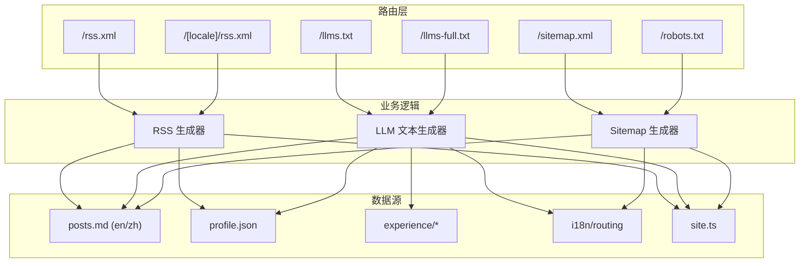
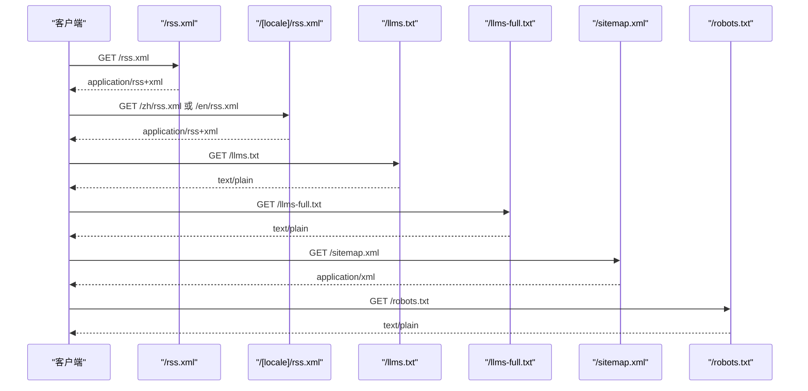
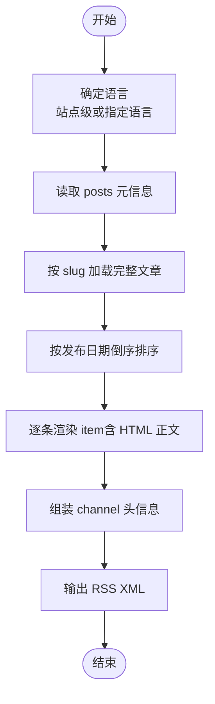
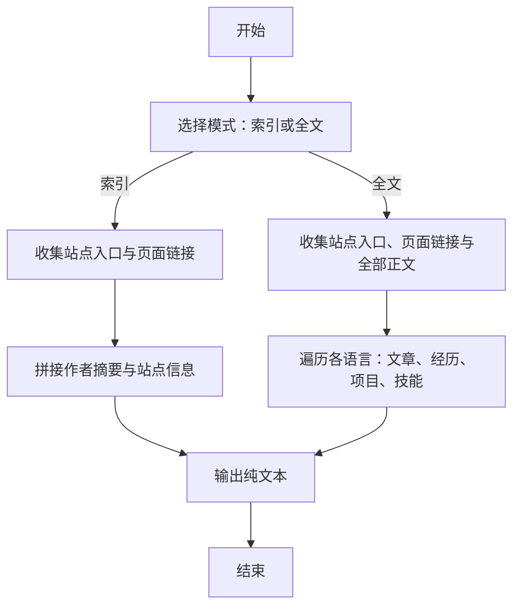
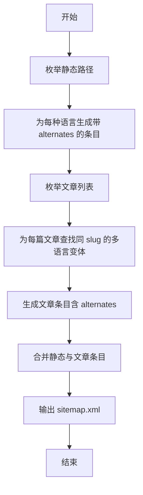
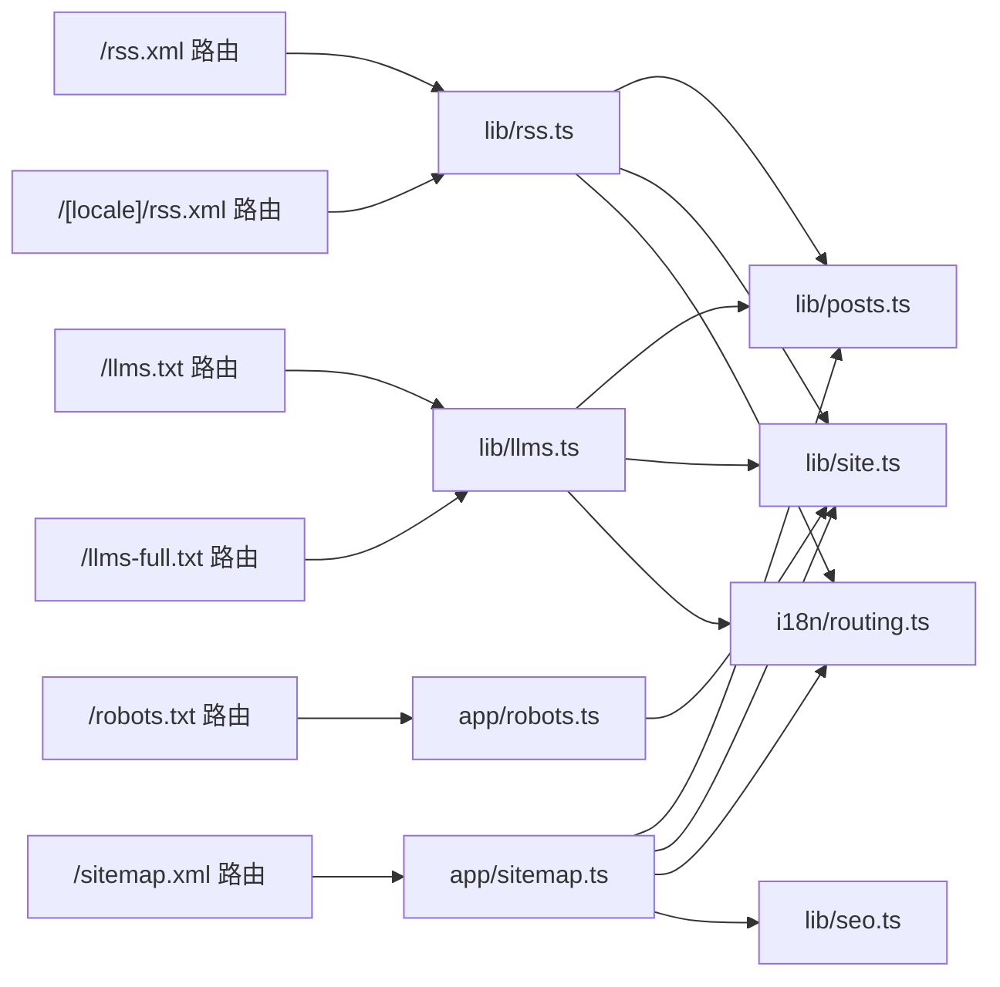

# API 参考

<cite>
**本文引用的文件**
- [app/rss.xml/route.ts](file://app/rss.xml/route.ts)
- [app/[locale]/rss.xml/route.ts](file://app/[locale]/rss.xml/route.ts)
- [lib/rss.ts](file://lib/rss.ts)
- [app/llms.txt/route.ts](file://app/llms.txt/route.ts)
- [app/llms-full.txt/route.ts](file://app/llms-full.txt/route.ts)
- [lib/llms.ts](file://lib/llms.ts)
- [app/sitemap.ts](file://app/sitemap.ts)
- [app/robots.ts](file://app/robots.ts)
- [i18n/routing.ts](file://i18n/routing.ts)
- [lib/site.ts](file://lib/site.ts)
- [lib/posts.ts](file://lib/posts.ts)
- [lib/seo.ts](file://lib/seo.ts)
</cite>

## 目录
1. [简介](#简介)
2. [项目结构](#项目结构)
3. [核心组件](#核心组件)
4. [架构总览](#架构总览)
5. [详细组件分析](#详细组件分析)
6. [依赖分析](#依赖分析)
7. [性能考虑](#性能考虑)
8. [故障排查指南](#故障排查指南)
9. [结论](#结论)
10. [附录](#附录)

## 简介
本 API 参考文档面向第三方开发者，系统化说明博客系统暴露的公共接口，包括：
- RSS Feed API（站点级与国际化版本）
- LLM 文本导出接口（精简索引与完整内容导出）
- 站点地图生成（sitemap.xml）
- robots.txt 配置

每个端点均提供 HTTP 方法、URL 模式、请求/响应格式、错误处理说明，并附带使用示例、客户端集成建议与性能优化指导。

## 项目结构
本项目基于 Next.js App Router，API 以 Route Handlers 形式实现，数据来源于 Markdown 内容与 JSON 配置文件，并通过工具库进行渲染与组装。

图表来源
- [app/rss.xml/route.ts:1-12](file://app/rss.xml/route.ts#L1-L12)
- [app/[locale]/rss.xml/route.ts:1-23](file://app/[locale]/rss.xml/route.ts#L1-L23)
- [lib/rss.ts:1-156](file://lib/rss.ts#L1-L156)
- [app/llms.txt/route.ts:1-12](file://app/llms.txt/route.ts#L1-L12)
- [app/llms-full.txt/route.ts:1-12](file://app/llms-full.txt/route.ts#L1-L12)
- [lib/llms.ts:1-260](file://lib/llms.ts#L1-L260)
- [app/sitemap.ts:1-76](file://app/sitemap.ts#L1-L76)
- [app/robots.ts:1-16](file://app/robots.ts#L1-L16)
- [i18n/routing.ts:1-6](file://i18n/routing.ts#L1-L6)
- [lib/site.ts:1-35](file://lib/site.ts#L1-L35)
- [lib/posts.ts:1-121](file://lib/posts.ts#L1-L121)

章节来源
- [app/rss.xml/route.ts:1-12](file://app/rss.xml/route.ts#L1-L12)
- [app/[locale]/rss.xml/route.ts:1-23](file://app/[locale]/rss.xml/route.ts#L1-L23)
- [app/llms.txt/route.ts:1-12](file://app/llms.txt/route.ts#L1-L12)
- [app/llms-full.txt/route.ts:1-12](file://app/llms-full.txt/route.ts#L1-L12)
- [app/sitemap.ts:1-76](file://app/sitemap.ts#L1-L76)
- [app/robots.ts:1-16](file://app/robots.ts#L1-L16)

## 核心组件
- RSS 生成器：负责将文章元信息与正文转换为 RSS 2.0 XML，支持站点级与按语言过滤。
- LLM 文本生成器：输出机器可读的站点索引与全文导出，便于大模型抓取与检索。
- Sitemap 生成器：根据静态页面与文章列表生成 sitemap.xml，包含多语言 alternates。
- Robots 配置：声明允许爬取范围与站点地图地址。

章节来源
- [lib/rss.ts:1-156](file://lib/rss.ts#L1-L156)
- [lib/llms.ts:1-260](file://lib/llms.ts#L1-L260)
- [app/sitemap.ts:1-76](file://app/sitemap.ts#L1-L76)
- [app/robots.ts:1-16](file://app/robots.ts#L1-L16)

## 架构总览
下图展示了从客户端到各 API 端点的调用路径及内部依赖关系。

图表来源
- [app/rss.xml/route.ts:1-12](file://app/rss.xml/route.ts#L1-L12)
- [app/[locale]/rss.xml/route.ts:1-23](file://app/[locale]/rss.xml/route.ts#L1-L23)
- [app/llms.txt/route.ts:1-12](file://app/llms.txt/route.ts#L1-L12)
- [app/llms-full.txt/route.ts:1-12](file://app/llms-full.txt/route.ts#L1-L12)
- [app/sitemap.ts:1-76](file://app/sitemap.ts#L1-L76)
- [app/robots.ts:1-16](file://app/robots.ts#L1-L16)

## 详细组件分析

### RSS Feed API
- 端点
  - GET /rss.xml
  - GET /[locale]/rss.xml（locale 为 en 或 zh）
- 认证与鉴权
  - 无需认证
- 请求参数
  - 无查询参数；语言版通过 URL 中的 locale 指定
- 响应
  - Content-Type: application/rss+xml; charset=utf-8
  - 返回符合 RSS 2.0 规范的 XML 文档
  - 站点级 /rss.xml 聚合所有语言的文章；语言版 /[locale]/rss.xml 仅包含该语言文章
- 字段与结构
  - channel 中包含标题、链接、描述、语言、最后构建时间、作者信息、图像等
  - item 中包含标题、链接、GUID、发布时间、摘要、HTML 正文、作者、分类与标签等
- 错误处理
  - 若未找到对应语言文章，仍返回空条目列表的合法 RSS 文档
  - 日期解析失败时回退到默认时间
- 使用示例
  - curl https://your-domain.com/rss.xml
  - curl https://your-domain.com/zh/rss.xml
- 客户端集成建议
  - 订阅者应缓存响应并按 lastBuildDate 增量更新
  - 对 HTML 正文进行安全渲染，避免 XSS
- 性能优化
  - 路由标记为强制静态生成，构建期产出，运行时零计算开销
  - 建议在 CDN 开启长缓存策略

章节来源
- [app/rss.xml/route.ts:1-12](file://app/rss.xml/route.ts#L1-L12)
- [app/[locale]/rss.xml/route.ts:1-23](file://app/[locale]/rss.xml/route.ts#L1-L23)
- [lib/rss.ts:1-156](file://lib/rss.ts#L1-L156)

#### RSS 生成流程（算法流程图）

图表来源
- [lib/rss.ts:58-156](file://lib/rss.ts#L58-L156)

### LLM 文本导出接口
- 端点
  - GET /llms.txt（精简索引）
  - GET /llms-full.txt（完整内容导出）
- 认证与鉴权
  - 无需认证
- 请求参数
  - 无
- 响应
  - Content-Type: text/plain; charset=utf-8
  - llms.txt：站点入口、主要页面与文章索引链接、作者信息摘要
  - llms-full.txt：在 llms.txt 基础上，包含每篇文章的完整正文、经历与技能等结构化文本
- 结构与内容
  - 包含站点标题、描述、主入口链接、按语言分组的页面与文章链接、作者资料摘要
  - 完整版额外包含每篇 Markdown 正文、工作经历、项目与技能 JSON
- 错误处理
  - 若无文章或内容缺失，会返回“无发布文章”等占位提示，不报错
- 使用示例
  - curl https://your-domain.com/llms.txt
  - curl https://your-domain.com/llms-full.txt
- 客户端集成建议
  - 用于 LLM 知识库导入、离线检索增强
  - 可结合缓存与增量更新策略，减少重复下载
- 性能优化
  - 路由标记为强制静态生成，构建期产出，适合长期缓存

章节来源
- [app/llms.txt/route.ts:1-12](file://app/llms.txt/route.ts#L1-L12)
- [app/llms-full.txt/route.ts:1-12](file://app/llms-full.txt/route.ts#L1-L12)
- [lib/llms.ts:1-260](file://lib/llms.ts#L1-L260)

#### LLM 文本生成流程（算法流程图）

图表来源
- [lib/llms.ts:211-260](file://lib/llms.ts#L211-L260)

### 站点地图（Sitemap）
- 端点
  - GET /sitemap.xml
- 认证与鉴权
  - 无需认证
- 请求参数
  - 无
- 响应
  - Content-Type: application/xml（由 Next.js 自动设置）
  - 包含静态页面与文章页面的 URL 列表，并为每个 URL 提供多语言 alternates
- 规则与优先级
  - 首页、博客索引、关于、经历、简历等静态页分别设置 changeFrequency 与 priority
  - 文章页按月更新频率，priority 略低于索引页
- 错误处理
  - 若某语言下无文章，则不会为该语言生成对应条目
- 使用示例
  - curl https://your-domain.com/sitemap.xml
- 客户端集成建议
  - 搜索引擎爬虫定期抓取
  - 可在构建后校验 sitemap 完整性
- 性能优化
  - 路由标记为强制静态生成，构建期产出

章节来源
- [app/sitemap.ts:1-76](file://app/sitemap.ts#L1-L76)

#### Sitemap 生成流程（算法流程图）

图表来源
- [app/sitemap.ts:15-75](file://app/sitemap.ts#L15-L75)

### robots.txt
- 端点
  - GET /robots.txt
- 认证与鉴权
  - 无需认证
- 请求参数
  - 无
- 响应
  - Content-Type: text/plain
  - 允许所有用户代理访问根路径，并指向 sitemap.xml 地址
- 使用示例
  - curl https://your-domain.com/robots.txt
- 客户端集成建议
  - 供爬虫遵循爬取策略
- 性能优化
  - 路由标记为强制静态生成，构建期产出

章节来源
- [app/robots.ts:1-16](file://app/robots.ts#L1-L16)

## 依赖分析
- 路由层依赖
  - RSS 路由依赖 lib/rss.ts 与 i18n/routing.ts、lib/site.ts、lib/posts.ts
  - LLM 路由依赖 lib/llms.ts、lib/posts.ts、lib/about.ts、lib/experience.ts、lib/profile.ts、lib/site.ts
  - Sitemap 依赖 lib/posts.ts、i18n/routing.ts、lib/site.ts、lib/seo.ts
- 数据源
  - content/posts/{en,zh}/*.md
  - content/config/profile.json
  - content/experience/*
- 外部库
  - gray-matter（解析 frontmatter）
  - unified + remark/rehype（Markdown 转 HTML）
  - next-intl（国际化路由）

图表来源
- [app/rss.xml/route.ts:1-12](file://app/rss.xml/route.ts#L1-L12)
- [app/[locale]/rss.xml/route.ts:1-23](file://app/[locale]/rss.xml/route.ts#L1-L23)
- [lib/rss.ts:1-156](file://lib/rss.ts#L1-L156)
- [app/llms.txt/route.ts:1-12](file://app/llms.txt/route.ts#L1-L12)
- [app/llms-full.txt/route.ts:1-12](file://app/llms-full.txt/route.ts#L1-L12)
- [lib/llms.ts:1-260](file://lib/llms.ts#L1-L260)
- [app/sitemap.ts:1-76](file://app/sitemap.ts#L1-L76)
- [app/robots.ts:1-16](file://app/robots.ts#L1-L16)
- [i18n/routing.ts:1-6](file://i18n/routing.ts#L1-L6)
- [lib/site.ts:1-35](file://lib/site.ts#L1-L35)
- [lib/posts.ts:1-121](file://lib/posts.ts#L1-L121)
- [lib/seo.ts:1-199](file://lib/seo.ts#L1-L199)

## 性能考虑
- 构建期静态化
  - 所有 API 路由均设置为 force-static，构建时生成静态资源，运行时零计算，适合高并发与 CDN 缓存
- 缓存策略
  - RSS：建议设置较长的 Cache-Control（如 1h~24h），配合 ETag/Last-Modified 实现增量更新
  - LLM 文本：变化频率低，可设置更长缓存（如 1d~7d）
  - Sitemap/robots：变更极少，可设置较长缓存
- 体积控制
  - llms-full.txt 可能较大，建议按需拉取并结合压缩传输（Gzip/Brotli）
- 网络优化
  - 启用 CDN 与边缘缓存，利用多地域就近分发
- 监控指标
  - 关注首字节时间（TTFB）、缓存命中率、带宽占用与错误率

## 故障排查指南
- 常见问题
  - 404：检查部署域名与 basePath 环境变量是否正确
  - RSS 内容为空：确认 content/posts 目录下存在已发布的文章且 published 不为 false
  - LLM 文本缺少内容：确认相关 Markdown 文件存在且 frontmatter 完整
  - Sitemap 缺少 alternates：确认多语言文章 slug 一致
- 调试步骤
  - 本地开发：运行 dev 服务，直接访问各端点验证
  - 构建产物：检查 out/ 目录是否包含 rss.xml、llms.txt、llms-full.txt、sitemap.xml、robots.txt
  - 日志：查看构建与部署日志，定位文件读取或路径问题
- 监控方法
  - 使用浏览器开发者工具观察响应头与状态码
  - 接入站点监控服务，定期检查关键端点可用性
  - 对 RSS 订阅者增加重试与告警机制

## 结论
本博客系统提供了完善的公开 API，涵盖 RSS 订阅、LLM 文本导出与站点地图生成。所有端点均为静态生成，具备高性能与易缓存特性。第三方开发者可据此快速集成订阅、索引与内容消费能力。

## 附录

### 端点速查表
- RSS
  - GET /rss.xml → application/rss+xml
  - GET /[locale]/rss.xml → application/rss+xml（locale ∈ {en, zh}）
- LLM 文本
  - GET /llms.txt → text/plain
  - GET /llms-full.txt → text/plain
- 站点地图
  - GET /sitemap.xml → application/xml
- robots
  - GET /robots.txt → text/plain

章节来源
- [app/rss.xml/route.ts:1-12](file://app/rss.xml/route.ts#L1-L12)
- [app/[locale]/rss.xml/route.ts:1-23](file://app/[locale]/rss.xml/route.ts#L1-L23)
- [app/llms.txt/route.ts:1-12](file://app/llms.txt/route.ts#L1-L12)
- [app/llms-full.txt/route.ts:1-12](file://app/llms-full.txt/route.ts#L1-L12)
- [app/sitemap.ts:1-76](file://app/sitemap.ts#L1-L76)
- [app/robots.ts:1-16](file://app/robots.ts#L1-L16)