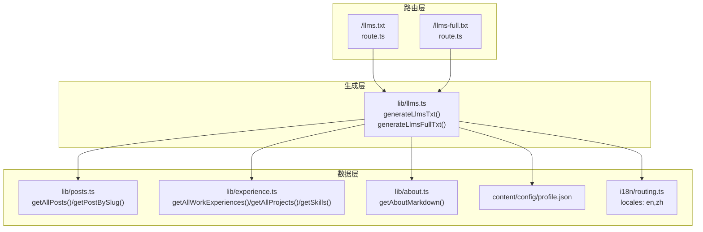
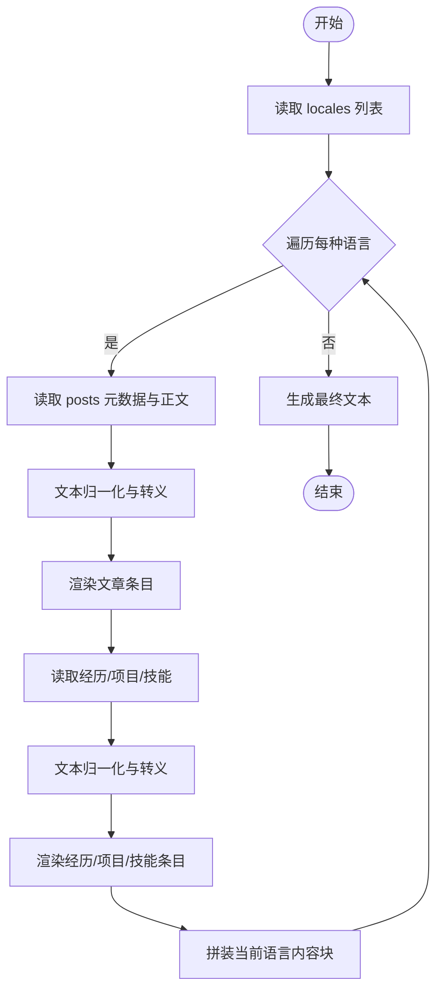
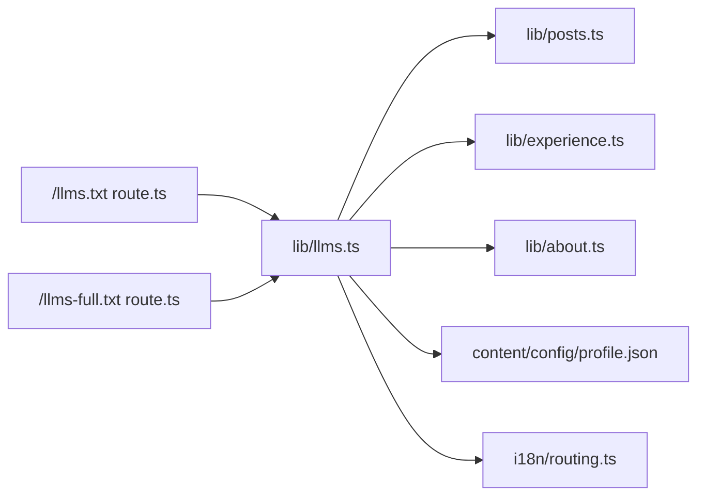

# LLM 文本导出接口

<cite>
**本文引用的文件列表**
- [app/llms.txt/route.ts](file://app/llms.txt/route.ts)
- [app/llms-full.txt/route.ts](file://app/llms-full.txt/route.ts)
- [lib/llms.ts](file://lib/llms.ts)
- [i18n/routing.ts](file://i18n/routing.ts)
- [lib/posts.ts](file://lib/posts.ts)
- [lib/experience.ts](file://lib/experience.ts)
- [lib/about.ts](file://lib/about.ts)
- [content/config/profile.json](file://content/config/profile.json)
</cite>

## 目录
1. [简介](#简介)
2. [项目结构](#项目结构)
3. [核心组件](#核心组件)
4. [架构总览](#架构总览)
5. [详细组件分析](#详细组件分析)
6. [依赖关系分析](#依赖关系分析)
7. [性能与缓存特性](#性能与缓存特性)
8. [内容过滤与安全](#内容过滤与安全)
9. [AI 工具集成指南](#ai-工具集成指南)
10. [故障排查](#故障排查)
11. [结论](#结论)

## 简介
本文件为面向大型语言模型（LLM）的站点文本导出接口文档，覆盖以下两个端点：
- /llms.txt：精简索引型导出版本，提供站点概览、主要入口链接、作者摘要以及各语言的内容导航。
- /llms-full.txt：完整导出版本，包含站点概览、作者信息、所有语言下的“关于”、全部博文正文、工作经历、项目经历与技能清单等。

这两个端点均返回纯文本（text/plain; charset=utf-8），便于 AI 工具直接读取并作为上下文或知识库使用。

## 项目结构
与 LLM 文本导出相关的代码位于 Next.js App Router 下，采用“路由 + 生成器”的分层组织方式：
- 路由层：定义 GET 处理器，设置静态构建策略与响应头。
- 生成层：集中实现文本组装逻辑，统一处理多语言、Markdown 归一化、日期格式化、链接渲染等。
- 数据层：从 Markdown 与 JSON 源文件中读取文章、经历、技能、个人配置等。



图表来源
- [app/llms.txt/route.ts:1-12](file://app/llms.txt/route.ts#L1-L12)
- [app/llms-full.txt/route.ts:1-12](file://app/llms-full.txt/route.ts#L1-L12)
- [lib/llms.ts:211-259](file://lib/llms.ts#L211-L259)
- [lib/posts.ts:15-71](file://lib/posts.ts#L15-L71)
- [lib/experience.ts:17-147](file://lib/experience.ts#L17-L147)
- [lib/about.ts:6-16](file://lib/about.ts#L6-L16)
- [i18n/routing.ts:3-6](file://i18n/routing.ts#L3-L6)

章节来源
- [app/llms.txt/route.ts:1-12](file://app/llms.txt/route.ts#L1-L12)
- [app/llms-full.txt/route.ts:1-12](file://app/llms-full.txt/route.ts#L1-L12)
- [lib/llms.ts:1-260](file://lib/llms.ts#L1-L260)
- [i18n/routing.ts:1-6](file://i18n/routing.ts#L1-L6)

## 核心组件
- 路由处理器
  - /llms.txt：调用 generateLlmsTxt()，返回精简版文本。
  - /llms-full.txt：调用 generateLlmsFullTxt()，返回完整版文本。
  - 两者均声明 dynamic = "force-static"，在构建期生成静态资源；响应头 Content-Type 为 text/plain; charset=utf-8。
- 文本生成器
  - generateLlmsTxt()：输出站点标题、描述、主要入口（含 llms-full.txt）、首页、RSS，以及按语言分组的页面与文章链接，最后附上作者摘要。
  - generateLlmsFullTxt()：在精简版基础上，增加站点档案（作者信息）与各语言的完整内容块（关于、博文、经历、项目、技能）。
- 数据读取
  - 文章：通过 getAllPosts(locale) 获取元数据，再通过 getPostBySlug(slug, locale) 获取正文。
  - 经历/项目/技能：分别通过 experience.ts 中的函数读取 Markdown 与 JSON。
  - 关于：通过 about.ts 读取对应语言的 about.{locale}.md。
  - 国际化：基于 i18n/routing.ts 的 locales 枚举遍历。

章节来源
- [app/llms.txt/route.ts:1-12](file://app/llms.txt/route.ts#L1-L12)
- [app/llms-full.txt/route.ts:1-12](file://app/llms-full.txt/route.ts#L1-L12)
- [lib/llms.ts:211-259](file://lib/llms.ts#L211-L259)
- [lib/posts.ts:15-71](file://lib/posts.ts#L15-L71)
- [lib/experience.ts:17-147](file://lib/experience.ts#L17-L147)
- [lib/about.ts:6-16](file://lib/about.ts#L6-L16)
- [i18n/routing.ts:3-6](file://i18n/routing.ts#L3-L6)

## 架构总览
下图展示了请求到响应的端到端流程，包括静态构建、路由分发、文本生成与数据读取。

```mermaid
sequenceDiagram
participant Client as "客户端/AI 工具"
participant Route as "Next.js 路由"
participant Gen as "lib/llms.ts 生成器"
participant Posts as "lib/posts.ts"
participant Exp as "lib/experience.ts"
participant About as "lib/about.ts"
participant Profile as "profile.json"
participant I18N as "i18n/routing.ts"
Client->>Route : GET /llms.txt 或 /llms-full.txt
Route->>Gen : 调用 generateLlmsTxt() 或 generateLlmsFullTxt()
Gen->>I18N : 读取 locales 列表
alt 需要文章内容
Gen->>Posts : getAllPosts(locale)/getPostBySlug(slug, locale)
end
alt 需要经历/项目/技能
Gen->>Exp : getAllWorkExperiences()/getAllProjects()/getSkills()
end
alt 需要关于内容
Gen->>About : getAboutMarkdown(locale)
end
Gen->>Profile : 读取作者信息与社交链接
Gen-->>Route : 返回文本字符串
Route-->>Client : 200 OK<br/>Content-Type : text/plain; charset=utf-8
```

图表来源
- [app/llms.txt/route.ts:1-12](file://app/llms.txt/route.ts#L1-L12)
- [app/llms-full.txt/route.ts:1-12](file://app/llms-full.txt/route.ts#L1-L12)
- [lib/llms.ts:211-259](file://lib/llms.ts#L211-L259)
- [lib/posts.ts:15-71](file://lib/posts.ts#L15-L71)
- [lib/experience.ts:17-147](file://lib/experience.ts#L17-L147)
- [lib/about.ts:6-16](file://lib/about.ts#L6-L16)
- [content/config/profile.json:1-66](file://content/config/profile.json#L1-L66)
- [i18n/routing.ts:3-6](file://i18n/routing.ts#L3-L6)

## 详细组件分析

### 端点对比与用途
- /llms.txt（精简索引）
  - 适用场景：快速了解站点结构与入口，适合用于检索、导航与轻量级上下文注入。
  - 内容组成：站点标题与描述、主要入口（指向 /llms-full.txt、首页、RSS）、按语言分组的内容链接（首页、博客索引、关于、经历、简历、RSS、每篇文章链接）、作者摘要。
- /llms-full.txt（完整导出）
  - 适用场景：为 AI 应用提供完整的可消费文本，包括所有文章的正文、经历与项目详情、技能清单等。
  - 内容组成：站点标题与描述、主要入口（指向精简版与首页、RSS）、站点档案（作者信息）、按语言分块的完整内容（关于、博文、经历、项目、技能）。

章节来源
- [lib/llms.ts:211-259](file://lib/llms.ts#L211-L259)

### 文本格式规范
- 编码与 MIME
  - 字符编码：UTF-8。
  - 响应类型：text/plain; charset=utf-8。
- 换行与转义
  - 换行规范化：将 CRLF 统一为 LF，并去除首尾空白。
  - 链接文本转义：对反斜杠、方括号进行转义，避免破坏 Markdown 链接语法。
- 日期格式
  - 统一转换为 ISO 日期前缀（YYYY-MM-DD）。
- 结构化标记
  - 使用 Markdown 标题层级组织内容（如 #、##、###、####）。
  - 列表项以短横线开头，键值对形式呈现元数据（如 URL、Date、Author、Tags、Description）。
  - 技能部分以 JSON 代码块包裹，便于解析。
- 语言与路径
  - 根据 i18n/routing.ts 的 locales 动态生成多语言链接。
  - 路径规范化：确保根路径与子路径拼接正确。

章节来源
- [lib/llms.ts:24-50](file://lib/llms.ts#L24-L50)
- [lib/llms.ts:28-35](file://lib/llms.ts#L28-L35)
- [lib/llms.ts:37-45](file://lib/llms.ts#L37-L45)
- [lib/llms.ts:100-126](file://lib/llms.ts#L100-L126)
- [lib/llms.ts:128-190](file://lib/llms.ts#L128-L190)
- [lib/llms.ts:192-209](file://lib/llms.ts#L192-L209)
- [i18n/routing.ts:3-6](file://i18n/routing.ts#L3-L6)

### 内容组织结构
- 精简版（/llms.txt）
  - 站点头部：标题与描述。
  - 主要入口：完整导出、首页、RSS。
  - 内容导航：按语言列出首页、博客索引、关于、经历、简历、RSS 及每篇文章链接。
  - 作者摘要：姓名、职业、地点、是否开放工作、简历 PDF 链接与更新时间、社交链接。
- 完整版（/llms-full.txt）
  - 站点头部与主要入口（同精简版）。
  - 站点档案：作者摘要。
  - 按语言分块：
    - 关于：about.{locale}.md 的正文。
    - 博文：每篇包含标题、URL、日期、作者、标签、描述与正文。
    - 经历：工作经历条目（职位、公司、时间、地点、技术栈、正文）。
    - 项目：项目条目（标题、描述、技术栈、GitHub/链接、正文）。
    - 技能：JSON 代码块，按类别组织技能项。

章节来源
- [lib/llms.ts:211-259](file://lib/llms.ts#L211-L259)
- [lib/llms.ts:100-126](file://lib/llms.ts#L100-L126)
- [lib/llms.ts:128-190](file://lib/llms.ts#L128-L190)
- [lib/llms.ts:192-209](file://lib/llms.ts#L192-L209)

### 数据处理与算法要点
- 文章聚合与排序
  - 扫描 content/posts/{locale} 下的 .md 文件，解析 frontmatter 与正文，计算阅读时长，过滤未发布文章，并按发布日期倒序排列。
- 经历/项目聚合与排序
  - 扫描 content/experience/work/{locale} 与 projects/{locale} 下的 .md 文件，解析 frontmatter 与正文，按 order 字段升序排列。
- 技能加载与回退
  - 优先读取 skills/{locale}.json，不存在时回退至 skills/en.json。
- 关于内容加载与回退
  - 优先读取 about.{locale}.md，不存在时回退 to about.en.md。
- 文本归一化
  - 统一换行符，去除多余空白，保证跨平台一致性。



图表来源
- [lib/llms.ts:52-80](file://lib/llms.ts#L52-L80)
- [lib/llms.ts:100-126](file://lib/llms.ts#L100-L126)
- [lib/llms.ts:128-190](file://lib/llms.ts#L128-L190)
- [lib/posts.ts:15-71](file://lib/posts.ts#L15-L71)
- [lib/experience.ts:17-147](file://lib/experience.ts#L17-L147)
- [lib/about.ts:6-16](file://lib/about.ts#L6-L16)

章节来源
- [lib/posts.ts:15-71](file://lib/posts.ts#L15-L71)
- [lib/experience.ts:17-147](file://lib/experience.ts#L17-L147)
- [lib/about.ts:6-16](file://lib/about.ts#L6-L16)
- [lib/llms.ts:24-50](file://lib/llms.ts#L24-L50)

## 依赖关系分析
- 路由层仅负责响应头与静态构建策略，不承载业务逻辑。
- 生成层集中了所有文本组装逻辑，依赖数据层提供的文章、经历、项目、技能与关于内容。
- 数据层通过文件系统读取 Markdown 与 JSON，并进行必要的解析与归一化。
- 国际化模块提供语言枚举，驱动多语言内容的遍历与链接生成。



图表来源
- [app/llms.txt/route.ts:1-12](file://app/llms.txt/route.ts#L1-L12)
- [app/llms-full.txt/route.ts:1-12](file://app/llms-full.txt/route.ts#L1-L12)
- [lib/llms.ts:211-259](file://lib/llms.ts#L211-L259)
- [lib/posts.ts:15-71](file://lib/posts.ts#L15-L71)
- [lib/experience.ts:17-147](file://lib/experience.ts#L17-L147)
- [lib/about.ts:6-16](file://lib/about.ts#L6-L16)
- [content/config/profile.json:1-66](file://content/config/profile.json#L1-L66)
- [i18n/routing.ts:3-6](file://i18n/routing.ts#L3-L6)

章节来源
- [lib/llms.ts:1-260](file://lib/llms.ts#L1-L260)
- [lib/posts.ts:1-121](file://lib/posts.ts#L1-L121)
- [lib/experience.ts:1-147](file://lib/experience.ts#L1-L147)
- [lib/about.ts:1-17](file://lib/about.ts#L1-L17)
- [i18n/routing.ts:1-6](file://i18n/routing.ts#L1-L6)

## 性能与缓存特性
- 静态构建
  - 两个端点均声明 dynamic = "force-static"，在构建期生成静态文本，运行时零开销。
- 文本体积
  - /llms-full.txt 可能较大，建议按需使用：检索与导航用 /llms.txt，深度上下文用 /llms-full.txt。
- 网络传输
  - 纯文本无压缩默认情况下由部署环境决定，建议在反向代理或 CDN 开启 gzip/br 以提升传输效率。

章节来源
- [app/llms.txt/route.ts:3-11](file://app/llms.txt/route.ts#L3-L11)
- [app/llms-full.txt/route.ts:3-11](file://app/llms-full.txt/route.ts#L3-L11)

## 内容过滤与安全
- 内容过滤规则
  - 文章发布状态：仅包含 published !== false 的文章。
  - 空内容回退：当某语言无文章或无关于内容时，输出占位提示而非报错。
  - 文本归一化：统一换行与空白，避免异常格式影响解析。
- 安全考虑
  - 访问控制：当前实现为公开可读，无鉴权机制。若需限制访问，请在反向代理或网关层添加认证与速率限制。
  - 敏感信息：作者摘要中包含简历 PDF 链接与社交链接，请确认这些链接符合隐私策略。
  - 输入来源：内容来源于本地 Markdown 与 JSON，不受用户输入影响，风险较低。

章节来源
- [lib/posts.ts:43-44](file://lib/posts.ts#L43-L44)
- [lib/llms.ts:104-106](file://lib/llms.ts#L104-L106)
- [lib/llms.ts:192-209](file://lib/llms.ts#L192-L209)
- [content/config/profile.json:1-66](file://content/config/profile.json#L1-L66)

## AI 工具集成指南
- 基本用法
  - 获取精简索引：GET https://your-domain.com/llms.txt
  - 获取完整文本：GET https://your-domain.com/llms-full.txt
  - 响应类型为 text/plain; charset=utf-8，可直接作为文本上下文。
- 提示词工程建议
  - 角色设定：明确 AI 的角色与任务（例如“你是一个技术写作助手，请基于提供的站点文本回答问题”）。
  - 上下文管理：优先使用 /llms.txt 进行定位，再按需抓取 /llms-full.txt 中具体章节；或使用 /llms-full.txt 一次性注入完整上下文。
  - 指令约束：要求 AI 严格依据提供的文本作答，禁止臆造事实；如需引用，标注来源段落或链接。
  - 多语言处理：根据目标语言选择对应语言的内容块，或在提示词中指定语言偏好。
- 示例流程
  - 步骤一：拉取 /llms.txt，识别目标文章或主题。
  - 步骤二：根据链接定位 /llms-full.txt 中的相应章节，提取所需正文。
  - 步骤三：构造提示词，附加必要约束与输出格式要求。
  - 步骤四：调用大模型 API，解析结果并展示给用户。

[本节为概念性指导，无需源码引用]

## 故障排查
- 常见问题
  - 中文乱码：确认客户端与服务端均以 UTF-8 处理文本；检查代理层是否强制转换编码。
  - 内容为空：检查对应语言的 Markdown 或 JSON 是否存在；确认 about.{locale}.md 与 skills/{locale}.json 的路径与命名。
  - 构建失败：检查 Markdown frontmatter 格式是否正确；确认 Node.js 版本满足要求。
- 调试建议
  - 查看构建产物：确认 out/ 目录下存在 llms.txt 与 llms-full.txt。
  - 验证响应头：使用 curl 或浏览器开发者工具检查 Content-Type 与编码。
  - 逐步缩小范围：先访问 /llms.txt，再访问 /llms-full.txt，定位问题所在的数据源。

章节来源
- [lib/posts.ts:15-71](file://lib/posts.ts#L15-L71)
- [lib/experience.ts:17-147](file://lib/experience.ts#L17-L147)
- [lib/about.ts:6-16](file://lib/about.ts#L6-L16)

## 结论
本项目提供了面向 LLM 的两类文本导出端点：精简索引与完整导出。通过统一的文本生成器与数据读取层，实现了多语言、标准化、易解析的纯文本输出。对于 AI 应用开发者而言，/llms.txt 适合作为导航与检索入口，/llms-full.txt 则可作为完整知识库上下文。结合合理的提示词工程与上下文管理策略，可以显著提升问答与生成的准确性与稳定性。