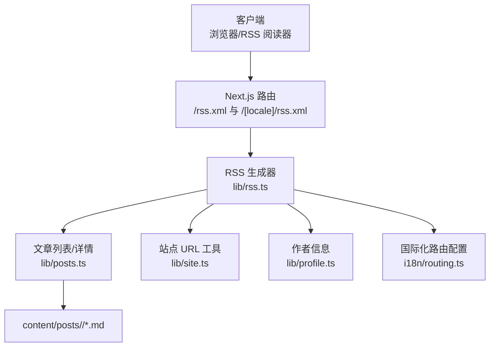
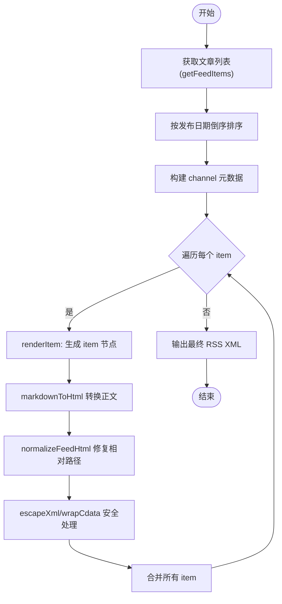
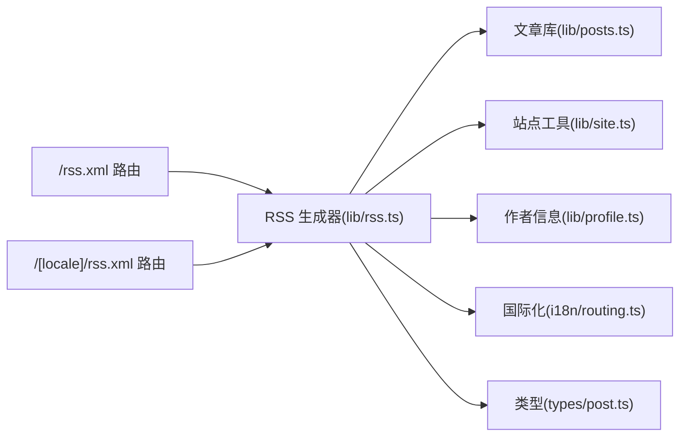

# RSS Feed API

<cite>
**本文引用的文件**
- [app/rss.xml/route.ts](file://app/rss.xml/route.ts)
- [app/[locale]/rss.xml/route.ts](file://app/[locale]/rss.xml/route.ts)
- [lib/rss.ts](file://lib/rss.ts)
- [lib/posts.ts](file://lib/posts.ts)
- [i18n/routing.ts](file://i18n/routing.ts)
- [lib/site.ts](file://lib/site.ts)
- [lib/profile.ts](file://lib/profile.ts)
- [types/post.ts](file://types/post.ts)
</cite>

## 目录
1. [简介](#简介)
2. [项目结构](#项目结构)
3. [核心组件](#核心组件)
4. [架构总览](#架构总览)
5. [详细组件分析](#详细组件分析)
6. [依赖关系分析](#依赖关系分析)
7. [性能与缓存](#性能与缓存)
8. [错误处理与排障](#错误处理与排障)
9. [RSS 阅读器集成指南](#rss-阅读器集成指南)
10. [结论](#结论)

## 简介
本文件为博客项目的 RSS Feed API 提供完整技术文档，覆盖以下要点：
- 多语言支持（默认 /rss.xml 与 /[locale]/rss.xml）
- 内容生成流程（Markdown -> HTML -> RSS XML）
- XML 格式规范（channel、item、CDATA、命名空间）
- 响应格式说明（Content-Type、编码、字段含义）
- 第三方 RSS 阅读器集成示例（订阅配置、解析策略、缓存建议）
- 错误处理机制与性能优化建议

## 项目结构
RSS 相关代码主要分布在以下位置：
- 路由层：app/rss.xml/route.ts 与 app/[locale]/rss.xml/route.ts
- 业务逻辑：lib/rss.ts（RSS 生成器）
- 数据源：lib/posts.ts（读取 content/posts 下的 Markdown 文章）
- 国际化：i18n/routing.ts（定义 en/zh 两种语言）
- 站点工具：lib/site.ts（绝对路径与站点 URL 拼接）
- 作者信息：lib/profile.ts（头像、邮箱等元数据）
- 类型定义：types/post.ts（文章 Frontmatter 与 Post 模型）



图表来源
- [app/rss.xml/route.ts:1-12](file://app/rss.xml/route.ts#L1-L12)
- [app/[locale]/rss.xml/route.ts:1-23](file://app/[locale]/rss.xml/route.ts#L1-L23)
- [lib/rss.ts:1-156](file://lib/rss.ts#L1-L156)
- [lib/posts.ts:1-121](file://lib/posts.ts#L1-L121)
- [i18n/routing.ts:1-6](file://i18n/routing.ts#L1-L6)
- [lib/site.ts:1-35](file://lib/site.ts#L1-L35)
- [lib/profile.ts:1-30](file://lib/profile.ts#L1-L30)

章节来源
- [app/rss.xml/route.ts:1-12](file://app/rss.xml/route.ts#L1-L12)
- [app/[locale]/rss.xml/route.ts:1-23](file://app/[locale]/rss.xml/route.ts#L1-L23)
- [lib/rss.ts:1-156](file://lib/rss.ts#L1-L156)
- [lib/posts.ts:1-121](file://lib/posts.ts#L1-L121)
- [i18n/routing.ts:1-6](file://i18n/routing.ts#L1-L6)
- [lib/site.ts:1-35](file://lib/site.ts#L1-L35)
- [lib/profile.ts:1-30](file://lib/profile.ts#L1-L30)
- [types/post.ts:1-20](file://types/post.ts#L1-L20)

## 核心组件
- 路由层
  - /rss.xml：返回全站聚合的 RSS（包含所有语言的文章）。
  - /[locale]/rss.xml：返回指定语言的 RSS（仅该语言文章）。
- RSS 生成器（lib/rss.ts）
  - 负责：获取文章列表与详情、Markdown 转 HTML、构建 channel 与 item、输出 XML。
  - 关键能力：XML 字符转义、CDATA 包裹、日期格式化、语言映射、HTML 链接规范化。
- 数据层（lib/posts.ts）
  - 从 content/posts/<locale> 下读取 .md 文件，解析 frontmatter 与正文。
- 工具与配置
  - lib/site.ts：统一站点 URL 与 basePath 拼接。
  - i18n/routing.ts：声明支持的 locales（en、zh）。
  - lib/profile.ts：作者信息与头像等元数据。
  - types/post.ts：Post 数据结构定义。

章节来源
- [app/rss.xml/route.ts:1-12](file://app/rss.xml/route.ts#L1-L12)
- [app/[locale]/rss.xml/route.ts:1-23](file://app/[locale]/rss.xml/route.ts#L1-L23)
- [lib/rss.ts:1-156](file://lib/rss.ts#L1-L156)
- [lib/posts.ts:1-121](file://lib/posts.ts#L1-L121)
- [lib/site.ts:1-35](file://lib/site.ts#L1-L35)
- [i18n/routing.ts:1-6](file://i18n/routing.ts#L1-L6)
- [lib/profile.ts:1-30](file://lib/profile.ts#L1-L30)
- [types/post.ts:1-20](file://types/post.ts#L1-L20)

## 架构总览
请求到响应的整体流程如下：

```mermaid
sequenceDiagram
participant Client as "客户端"
participant Route as "Next.js 路由"
participant RSS as "RSS 生成器(lib/rss.ts)"
participant Posts as "文章库(lib/posts.ts)"
participant Site as "站点工具(lib/site.ts)"
participant Profile as "作者信息(lib/profile.ts)"
Client->>Route : GET /rss.xml 或 GET /[locale]/rss.xml
Route->>RSS : generateRssFeed(locale?)
RSS->>Posts : getAllPosts(locale?)
Posts-->>RSS : PostMeta[]
loop 遍历文章
RSS->>Posts : getPostBySlug(slug, locale)
Posts-->>RSS : Post
RSS->>Site : getSiteUrl(...)
Site-->>RSS : 绝对URL
RSS->>Profile : getProfile()
Profile-->>RSS : 作者信息
RSS->>RSS : markdownToHtml(content)
end
RSS-->>Route : RSS XML 字符串
Route-->>Client : application/rss+xml; charset=utf-8
```

图表来源
- [app/rss.xml/route.ts:1-12](file://app/rss.xml/route.ts#L1-L12)
- [app/[locale]/rss.xml/route.ts:1-23](file://app/[locale]/rss.xml/route.ts#L1-L23)
- [lib/rss.ts:1-156](file://lib/rss.ts#L1-L156)
- [lib/posts.ts:1-121](file://lib/posts.ts#L1-L121)
- [lib/site.ts:1-35](file://lib/site.ts#L1-L35)
- [lib/profile.ts:1-30](file://lib/profile.ts#L1-L30)

## 详细组件分析

### 路由层：/rss.xml 与 /[locale]/rss.xml
- /rss.xml
  - 行为：调用 generateRssFeed() 无参版本，返回全站聚合的 RSS。
  - 静态化：dynamic = "force-static"，构建期生成。
  - 响应头：Content-Type 为 application/rss+xml; charset=utf-8。
- /[locale]/rss.xml
  - 行为：根据路由参数 locale 调用 generateRssFeed(locale)，返回对应语言的 RSS。
  - 静态化：dynamic = "force-static"，dynamicParams = false，并通过 generateStaticParams 预生成 en/zh 两个版本。
  - 响应头：同上。

章节来源
- [app/rss.xml/route.ts:1-12](file://app/rss.xml/route.ts#L1-L12)
- [app/[locale]/rss.xml/route.ts:1-23](file://app/[locale]/rss.xml/route.ts#L1-L23)
- [i18n/routing.ts:1-6](file://i18n/routing.ts#L1-L6)

### RSS 生成器：lib/rss.ts
- 输入
  - 可选 locale：不传则聚合所有语言；传入则只生成该语言条目。
- 输出
  - 标准 RSS 2.0 XML 字符串，包含 channel 与多个 item。
- 关键实现要点
  - 多语言支持
    - 通过 routing.locales 枚举语言，getLanguage 将 locale 映射为 rss language 字段（如 zh-CN、en-US）。
    - getFeedTitle 按语言设置不同标题。
    - getFeedPath 决定 feed 自引用地址（/rss.xml 或 /[locale]/rss.xml）。
  - 内容生成流程
    - getFeedItems：先按语言获取文章元数据，再逐篇加载完整内容，最后按 date 倒序排序。
    - markdownToHtml：使用 unified 管线（remark-parse + remark-gfm + remark-rehype + rehype-stringify）将 Markdown 转为 HTML。
    - normalizeFeedHtml：将相对路径的 href/src 替换为绝对 URL，适配部署在 basePath 的场景。
    - renderItem：组装 item 节点，包括 title、link、guid、pubDate、description、content:encoded、dc:creator、author、category 等。
  - XML 安全与编码
    - escapeXml：对 & < > " ' 进行转义，避免破坏 XML 结构。
    - wrapCdata：将值用 <![CDATA[...]]> 包裹，并对内部可能出现的 ]]> 做拆分保护，确保合法。
    - toRssDate：将 ISO 时间转换为 RSS 要求的 UTC 字符串。
  - 命名空间
    - 根 rss 节点声明 dc、content、atom 命名空间，以支持扩展字段与自引用链接。
  - 并行渲染
    - renderedItems 使用 Promise.all 并行渲染各 item，提升吞吐。



图表来源
- [lib/rss.ts:1-156](file://lib/rss.ts#L1-L156)

章节来源
- [lib/rss.ts:1-156](file://lib/rss.ts#L1-L156)

### 数据层：lib/posts.ts
- 功能
  - getAllPosts(locale)：扫描 content/posts/<locale> 下 .md 文件，解析 frontmatter，过滤未发布文章，计算阅读时长并返回 PostMeta 列表。
  - getPostBySlug(slug, locale)：按 slug 读取单篇文章，返回含 content 的 Post。
- 数据来源
  - content/posts/<locale>/*.md 中的 YAML frontmatter 与正文内容。
- 排序与过滤
  - 默认按 date 倒序；published=false 的文章会被过滤。

章节来源
- [lib/posts.ts:1-121](file://lib/posts.ts#L1-L121)
- [types/post.ts:1-20](file://types/post.ts#L1-L20)

### 站点与作者信息：lib/site.ts 与 lib/profile.ts
- lib/site.ts
  - getSiteOrigin/getBasePath/getSiteUrl/getAbsoluteUrl：统一站点域名与 basePath 拼接，保证 RSS 中链接正确。
- lib/profile.ts
  - getProfile：返回作者姓名、邮箱、头像等，用于 RSS 的 image、author、dc:creator 等字段。

章节来源
- [lib/site.ts:1-35](file://lib/site.ts#L1-L35)
- [lib/profile.ts:1-30](file://lib/profile.ts#L1-L30)

### 国际化：i18n/routing.ts
- 定义 locales 为 ["en", "zh"]，defaultLocale 为 "en"。
- 被 RSS 生成器用于确定语言集合与默认语言。

章节来源
- [i18n/routing.ts:1-6](file://i18n/routing.ts#L1-L6)

## 依赖关系分析
- 路由层依赖 RSS 生成器。
- RSS 生成器依赖：
  - 文章数据（lib/posts.ts）
  - 站点 URL 工具（lib/site.ts）
  - 作者信息（lib/profile.ts）
  - 国际化配置（i18n/routing.ts）
  - 类型定义（types/post.ts）



图表来源
- [app/rss.xml/route.ts:1-12](file://app/rss.xml/route.ts#L1-L12)
- [app/[locale]/rss.xml/route.ts:1-23](file://app/[locale]/rss.xml/route.ts#L1-L23)
- [lib/rss.ts:1-156](file://lib/rss.ts#L1-L156)
- [lib/posts.ts:1-121](file://lib/posts.ts#L1-L121)
- [lib/site.ts:1-35](file://lib/site.ts#L1-L35)
- [lib/profile.ts:1-30](file://lib/profile.ts#L1-L30)
- [i18n/routing.ts:1-6](file://i18n/routing.ts#L1-L6)
- [types/post.ts:1-20](file://types/post.ts#L1-L20)

## 性能与缓存
- 构建期静态生成
  - 路由层设置 dynamic = "force-static"，/[locale]/rss.xml 还设置了 dynamicParams = false 并使用 generateStaticParams 预生成 en/zh 两个版本，减少运行时开销。
- 并行渲染
  - RSS 生成器使用 Promise.all 并行渲染各 item，降低总体延迟。
- 文本处理
  - Markdown 转 HTML 使用 unified 管线，建议在文章数量较多时考虑引入缓存层（例如基于 slug+locale 的内存缓存或持久化缓存），避免重复解析。
- 资源路径
  - normalizeFeedHtml 会将相对路径修正为绝对路径，确保在不同部署环境（含 basePath）下图片与链接可用。

章节来源
- [app/rss.xml/route.ts:1-12](file://app/rss.xml/route.ts#L1-L12)
- [app/[locale]/rss.xml/route.ts:1-23](file://app/[locale]/rss.xml/route.ts#L1-L23)
- [lib/rss.ts:1-156](file://lib/rss.ts#L1-L156)

## 错误处理与排障
- 文章缺失
  - getPostBySlug 在找不到文章时返回 null，RSS 生成器会过滤掉无效项，避免中断整个 feed 生成。
- 日期异常
  - toRssDate 遇到非法日期会回退到 epoch 时间，保证 RSS 合法性。
- XML 安全性
  - escapeXml 对所有文本字段进行转义；wrapCdata 对 CDATA 内容进行保护，防止 ]]> 导致 XML 提前闭合。
- 常见排查点
  - 检查 NEXT_PUBLIC_SITE_URL 与 NEXT_PUBLIC_BASE_PATH 环境变量是否正确，以确保 RSS 中链接可访问。
  - 确认 content/posts/<locale> 下存在 .md 文件且 frontmatter 包含必需字段（title、date、tags、category、author、slug）。
  - 若部署在子路径（basePath），验证 normalizeFeedHtml 是否已将相对路径转换为绝对路径。

章节来源
- [lib/posts.ts:49-71](file://lib/posts.ts#L49-L71)
- [lib/rss.ts:35-40](file://lib/rss.ts#L35-L40)
- [lib/rss.ts:22-33](file://lib/rss.ts#L22-L33)
- [lib/site.ts:1-35](file://lib/site.ts#L1-L35)

## RSS 阅读器集成指南

### 端点与响应格式
- 端点
  - 全站聚合：/rss.xml
  - 按语言：/en/rss.xml、/zh/rss.xml
- Content-Type
  - application/rss+xml; charset=utf-8
- 编码
  - UTF-8（XML 声明与响应头一致）

### Channel 元数据
- 字段
  - title：站点标题（按语言区分）
  - link：站点首页链接（已拼接 basePath）
  - description：站点描述
  - language：语言代码（zh-CN、en-US）
  - lastBuildDate：最近更新时间（UTC）
  - docs：RSS 2.0 规范链接
  - generator：生成器标识
  - image：站点图标（title/url/link）
  - copyright：版权信息
  - atom:link：self 链接指向当前 feed 地址

### Item 结构
- 字段
  - title：文章标题（CDAT A）
  - link：文章永久链接（绝对 URL）
  - guid：唯一标识（isPermaLink="true"）
  - pubDate：发布时间（UTC）
  - description：文章摘要（CDATA）
  - content:encoded：正文 HTML（CDATA）
  - dc:creator：作者名
  - author：作者邮箱与名称组合
  - category：分类与标签（多个）

### CDATA 与 HTML 内容编码
- 所有富文本字段（title、description、content:encoded）均使用 CDATA 包裹，避免特殊字符破坏 XML。
- 正文 HTML 由 Markdown 转换而来，相对路径已被修正为绝对路径，便于阅读器直接展示图片与外链。

### 订阅配置示例
- 在任意 RSS 阅读器中添加以下任一地址：
  - https://yourdomain.com/rss.xml
  - https://yourdomain.com/en/rss.xml
  - https://yourdomain.com/zh/rss.xml
- 若部署在子路径（例如 /blog），请替换 yourdomain.com 为 yourdomain.com/blog。

### 内容解析与缓存策略
- 解析
  - 使用标准 RSS 2.0 解析器（如 Python feedparser、Node feed-read、Java ROME 等）即可正常解析。
- 缓存
  - 建议在服务端缓存 RSS 结果（按 locale 维度），TTL 可根据更新频率设定（如 5~15 分钟）。
  - 针对大型站点，可对 markdownToHtml 的结果增加基于 slug+locale 的缓存键，避免重复转换。
- 增量更新
  - 利用 lastBuildDate 与 item.pubDate 判断是否需要拉取新内容。

### 第三方开发者注意事项
- 多语言选择
  - 如需特定语言内容，优先使用 /[locale]/rss.xml。
- 链接有效性
  - 确保 NEXT_PUBLIC_SITE_URL 与 NEXT_PUBLIC_BASE_PATH 与环境一致，否则 RSS 内链接不可用。
- 合规性
  - 遵循 RSS 2.0 规范，保持 GUID 唯一性与 pubDate 格式正确。

章节来源
- [app/rss.xml/route.ts:1-12](file://app/rss.xml/route.ts#L1-L12)
- [app/[locale]/rss.xml/route.ts:1-23](file://app/[locale]/rss.xml/route.ts#L1-L23)
- [lib/rss.ts:124-155](file://lib/rss.ts#L124-L155)
- [lib/site.ts:1-35](file://lib/site.ts#L1-L35)

## 结论
本项目实现了符合 RSS 2.0 规范的 Feed 服务，具备多语言支持与完善的 HTML 内容处理能力。通过构建期静态生成与并行渲染，兼顾了性能与稳定性。对于第三方集成，只需按语言选择对应端点，并按标准 RSS 解析即可。建议在生产环境结合缓存与监控，进一步提升可用性。