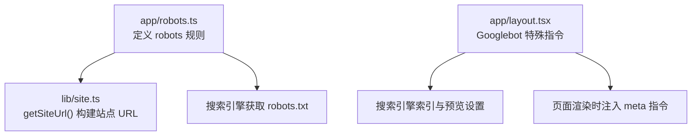
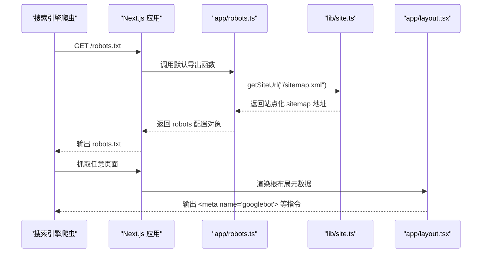
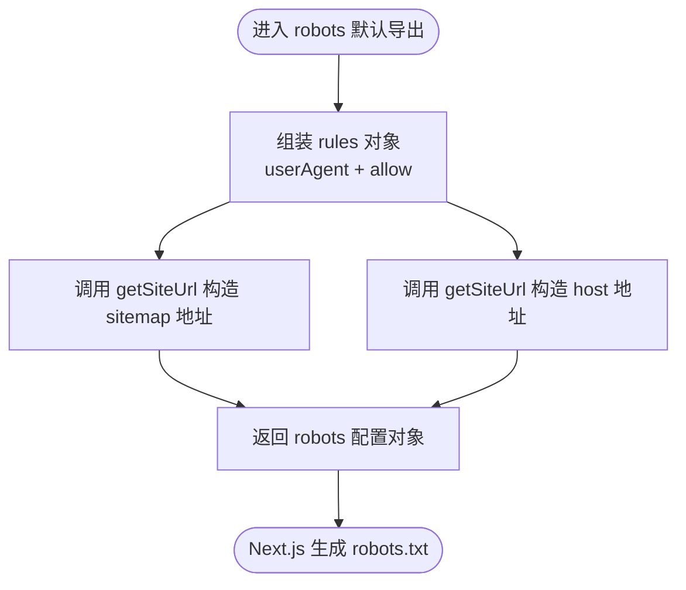
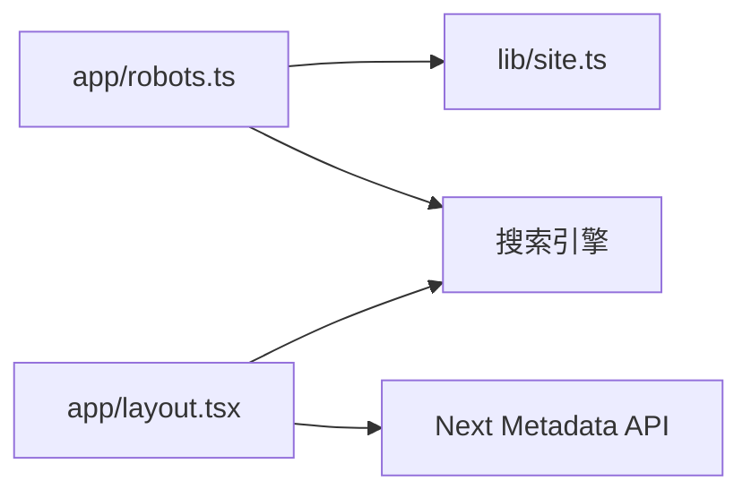

# 机器人协议

<cite>
**本文引用的文件**   
- [app/robots.ts](file://app/robots.ts)
- [app/layout.tsx](file://app/layout.tsx)
- [lib/site.ts](file://lib/site.ts)
</cite>

## 目录
1. [简介](#简介)
2. [项目结构](#项目结构)
3. [核心组件](#核心组件)
4. [架构总览](#架构总览)
5. [详细组件分析](#详细组件分析)
6. [依赖关系分析](#依赖关系分析)
7. [性能与爬取优化建议](#性能与爬取优化建议)
8. [安全与隐私保护](#安全与隐私保护)
9. [运维与监控指南](#运维与监控指南)
10. [结论](#结论)

## 简介
本文件面向网站运维人员与开发者，系统化说明本项目中 robots.txt 的实现方式、搜索引擎爬虫访问控制规则、用户代理识别、路径允许/禁止策略、以及针对 Googlebot 的特殊指令。同时提供爬虫优化建议（资源加载优先级、缓存策略、带宽控制）、安全与隐私注意事项，并给出可操作的运维与监控指南，帮助在 Next.js 静态导出环境下稳定、可控地管理爬虫行为。

## 项目结构
本项目采用 Next.js App Router，通过约定式路由生成 robots.txt 与站点地图。关键位置如下：
- app/robots.ts：定义全局 robots 规则、站点地图地址与主机名
- app/layout.tsx：根布局元数据中声明对 Googlebot 的特定抓取指令
- lib/site.ts：提供站点 URL 构建工具函数，被 robots 与 sitemap 等模块复用

图示来源 
- [app/robots.ts:1-15](file://app/robots.ts#L1-L15)
- [app/layout.tsx:74-85](file://app/layout.tsx#L74-L85)
- [lib/site.ts](file://lib/site.ts)

章节来源
- [app/robots.ts:1-15](file://app/robots.ts#L1-L15)
- [app/layout.tsx:74-85](file://app/layout.tsx#L74-L85)

## 核心组件
- robots 规则集中配置：通过 app/robots.ts 暴露统一的 robots 配置对象，包含通用用户代理规则、允许路径、站点地图与主机名。
- Googlebot 专用指令：在根布局 metadata 中为 Googlebot 开启索引与跟随，并设置视频/图片/摘要的最大预览范围。
- 站点 URL 工具：统一通过 lib/site.ts 提供的 getSiteUrl/getAbsoluteUrl 生成绝对或相对站点 URL，确保多环境一致。

章节来源
- [app/robots.ts:1-15](file://app/robots.ts#L1-L15)
- [app/layout.tsx:74-85](file://app/layout.tsx#L74-L85)
- [lib/site.ts](file://lib/site.ts)

## 架构总览
下图展示了从“搜索引擎请求”到“服务端返回 robots 与 meta 指令”的整体流程，以及各模块的职责边界。

图示来源 
- [app/robots.ts:1-15](file://app/robots.ts#L1-L15)
- [app/layout.tsx:74-85](file://app/layout.tsx#L74-L85)
- [lib/site.ts](file://lib/site.ts)

## 详细组件分析

### robots.ts 实现解析
- 动态性：显式声明为静态生成，保证构建期产出稳定的 robots.txt。
- 用户代理：使用通配符匹配所有爬虫。
- 路径策略：当前仅允许根路径；如需精细化控制，可在 rules 中扩展 allow/disallow。
- 站点地图与主机名：通过站点 URL 工具生成，避免硬编码域名。

图示来源 
- [app/robots.ts:1-15](file://app/robots.ts#L1-L15)
- [lib/site.ts](file://lib/site.ts)

章节来源
- [app/robots.ts:1-15](file://app/robots.ts#L1-L15)

### layout.tsx 中的 Googlebot 指令
- 索引与跟随：为 Googlebot 开启 index/follow，利于内容收录与链接发现。
- 预览限制：
  - max-video-preview：设为较大值以启用更长的视频预览。
  - max-image-preview：设为 large 以展示大图预览。
  - max-snippet：设为 -1 表示不限制摘要长度。
- 作用范围：这些指令作为页面级 meta 注入，优先于 robots.txt 的全局规则，用于精细控制单个页面的抓取与展示。

章节来源
- [app/layout.tsx:74-85](file://app/layout.tsx#L74-L85)

### 站点 URL 工具（lib/site.ts）
- 职责：提供 getSiteUrl/getAbsoluteUrl 等工具，统一处理站点基础 URL 拼接，避免在不同部署环境出现不一致。
- 影响面：被 robots.ts、sitemap 生成、RSS 等模块复用，是全站 URL 一致性的重要保障。

章节来源
- [lib/site.ts](file://lib/site.ts)

## 依赖关系分析
- app/robots.ts 依赖 lib/site.ts 进行站点 URL 拼装。
- app/layout.tsx 通过 next 的 Metadata API 注入 Googlebot 相关 meta 指令。
- 整体耦合度低、内聚度高：URL 构建逻辑集中在 lib/site.ts，便于维护与迁移。

图示来源 
- [app/robots.ts:1-15](file://app/robots.ts#L1-L15)
- [app/layout.tsx:74-85](file://app/layout.tsx#L74-L85)
- [lib/site.ts](file://lib/site.ts)

章节来源
- [app/robots.ts:1-15](file://app/robots.ts#L1-L15)
- [app/layout.tsx:74-85](file://app/layout.tsx#L74-L85)
- [lib/site.ts](file://lib/site.ts)

## 性能与爬取优化建议
- 资源加载优先级
  - 将首屏关键 CSS/字体/图标置于头部预加载，减少阻塞。
  - 对非关键脚本与第三方组件使用 defer 或按需加载。
- 缓存策略
  - 静态资源启用长期缓存与强缓存头，配合版本化文件名。
  - HTML 页面使用短缓存或协商缓存，确保 SEO 变更及时生效。
- 带宽控制
  - 压缩图片与媒体资源，提供 WebP/AVIF 变体。
  - 合理设置响应头与 CDN 缓存，降低重复抓取带来的带宽消耗。
- 爬虫友好性
  - 保持 robots.txt 简洁明确，避免频繁变更。
  - 使用 sitemap 引导爬虫高效发现新内容与更新。
  - 对大型页面考虑分页与懒加载，降低单次抓取成本。

[本节为通用指导，无需代码引用]

## 安全与隐私保护
- 敏感路径屏蔽：对后台、API、调试接口等使用 disallow 或服务器端鉴权，避免被公开索引。
- 个人信息脱敏：不在可被索引的页面暴露个人联系方式、内部网络信息等。
- 合规与最小化：遵循 robots 协议的最小权限原则，仅开放必要路径。
- 日志与审计：定期审查 robots 与 meta 指令变更，保留变更记录以便回溯。

[本节为通用指导，无需代码引用]

## 运维与监控指南
- 验证 robots.txt
  - 在线工具：使用搜索引擎控制台（如 Google Search Console）的 robots.txt 测试器。
  - 本地校验：构建后检查 out/ 目录是否生成正确的 robots.txt。
- 监控抓取状态
  - 关注搜索引擎控制台中的抓取错误、覆盖率报告与索引状态。
  - 结合服务器/CDN 日志分析爬虫 UA、频率与热点路径。
- 变更发布流程
  - 修改 robots 或 meta 指令后，先在小流量环境验证，再灰度发布。
  - 同步更新 sitemap，确保新路径被快速收录。
- 回滚与应急
  - 若误封重要路径，立即回滚并观察抓取恢复情况。
  - 对异常高并发爬虫，结合 WAF/CDN 限速或临时屏蔽。

[本节为通用指导，无需代码引用]

## 结论
本项目通过 Next.js 约定式路由集中管理 robots 规则，并在根布局中对 Googlebot 进行细粒度控制。借助统一的站点 URL 工具，保证了多环境下的稳定性与一致性。建议在现有基础上持续完善路径策略、加强监控与审计，并结合性能优化与隐私保护措施，提升搜索引擎抓取效率与用户体验。

[本节为总结性内容，无需代码引用]