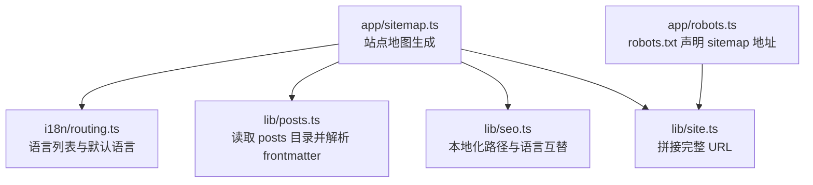
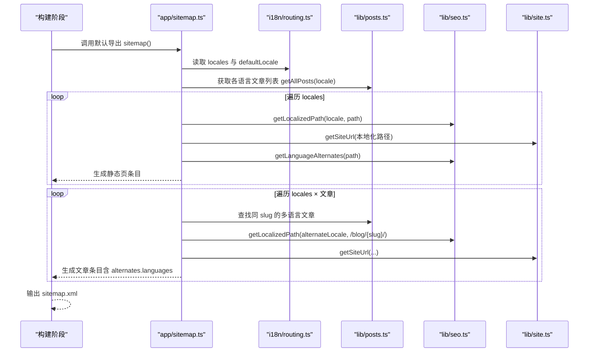
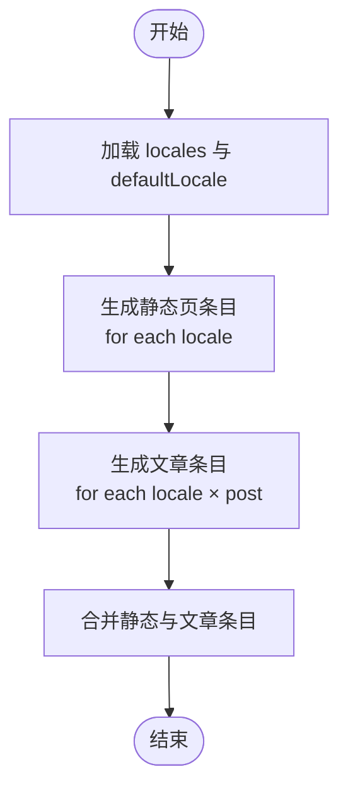
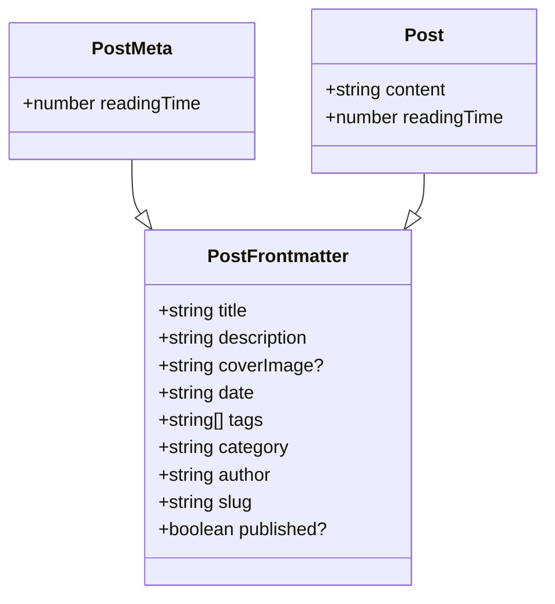
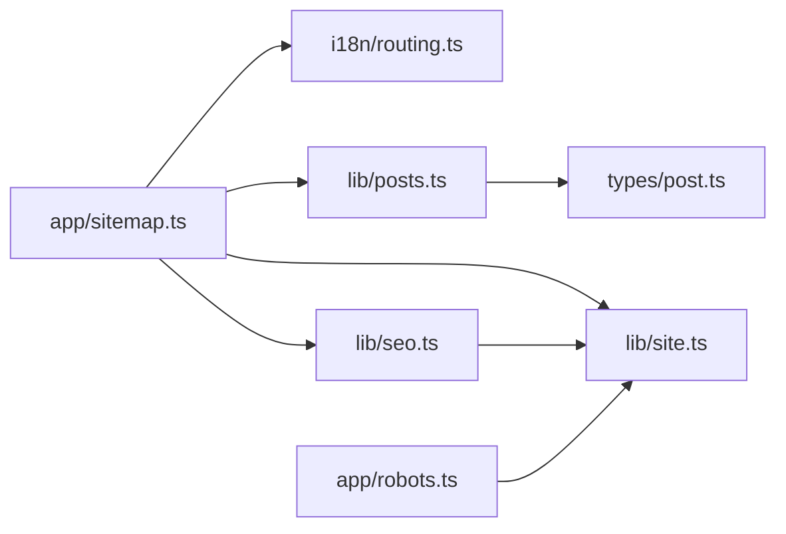

# 站点地图生成

<cite>
**本文引用的文件**   
- [app/sitemap.ts](file://app/sitemap.ts)
- [lib/posts.ts](file://lib/posts.ts)
- [i18n/routing.ts](file://i18n/routing.ts)
- [lib/site.ts](file://lib/site.ts)
- [lib/seo.ts](file://lib/seo.ts)
- [types/post.ts](file://types/post.ts)
- [app/robots.ts](file://app/robots.ts)
</cite>

## 目录
1. [简介](#简介)
2. [项目结构](#项目结构)
3. [核心组件](#核心组件)
4. [架构总览](#架构总览)
5. [详细组件分析](#详细组件分析)
6. [依赖关系分析](#依赖关系分析)
7. [性能考量](#性能考量)
8. [故障排查指南](#故障排查指南)
9. [结论](#结论)
10. [附录](#附录)

## 简介
本文件面向网站管理员与开发者，系统化说明该 Next.js 博客项目的动态站点地图（sitemap.xml）生成机制。内容涵盖：
- 多语言 URL 处理与语言互替标注
- 文章路由映射与优先级设置
- sitemap.xml 的结构规范、lastmod 更新策略与 changefreq 配置
- 搜索引擎优化最佳实践（索引提交、爬虫友好性、性能优化）
- 自定义页面添加方法与 SEO 元数据同步机制
- 站点地图维护与监控指南

## 项目结构
站点地图相关代码集中在应用层与工具库中，采用“声明式 + 静态化”的构建期生成模式：
- 应用层入口：站点地图导出函数位于 app/sitemap.ts
- 国际化路由：i18n/routing.ts 定义支持的语言与默认语言
- 文章数据源：lib/posts.ts 扫描 content/posts 下的 Markdown 文章并解析 frontmatter
- 站点 URL 构造：lib/site.ts 提供 getSiteUrl/getAbsoluteUrl 等工具
- SEO 辅助：lib/seo.ts 提供 getLocalizedPath、getLanguageAlternates 等
- 类型定义：types/post.ts 定义文章 frontmatter 字段
- robots.txt：app/robots.ts 声明站点地图地址与主机名

图表来源
- [app/sitemap.ts:1-76](file://app/sitemap.ts#L1-L76)
- [i18n/routing.ts:1-6](file://i18n/routing.ts#L1-L6)
- [lib/posts.ts:1-121](file://lib/posts.ts#L1-L121)
- [lib/seo.ts:1-199](file://lib/seo.ts#L1-L199)
- [lib/site.ts:1-35](file://lib/site.ts#L1-L35)
- [app/robots.ts:1-16](file://app/robots.ts#L1-L16)

章节来源
- [app/sitemap.ts:1-76](file://app/sitemap.ts#L1-L76)
- [i18n/routing.ts:1-6](file://i18n/routing.ts#L1-L6)
- [lib/posts.ts:1-121](file://lib/posts.ts#L1-L121)
- [lib/seo.ts:1-199](file://lib/seo.ts#L1-L199)
- [lib/site.ts:1-35](file://lib/site.ts#L1-L35)
- [app/robots.ts:1-16](file://app/robots.ts#L1-L16)

## 核心组件
- 站点地图生成器（app/sitemap.ts）
  - 将静态页面与文章页面合并为最终 Sitemap 条目数组
  - 为每个条目设置 lastModified、changeFrequency、priority 与 alternates.languages
- 文章数据访问（lib/posts.ts）
  - 按语言目录扫描 .md 文件，解析 frontmatter，过滤未发布文章，并按日期倒序排序
- 国际化路由（i18n/routing.ts）
  - 声明 locales 与 defaultLocale，供站点地图与 SEO 模块复用
- SEO 工具（lib/seo.ts）
  - 提供本地化路径转换与语言互替表生成
- 站点 URL 工具（lib/site.ts）
  - 基于环境变量拼接 origin、basePath 与相对路径，生成绝对 URL
- 类型定义（types/post.ts）
  - 定义 frontmatter 字段，如 title、description、date、tags、category、author、slug、published 等
- robots 声明（app/robots.ts）
  - 声明允许爬取规则、sitemap 地址与 host

章节来源
- [app/sitemap.ts:1-76](file://app/sitemap.ts#L1-L76)
- [lib/posts.ts:1-121](file://lib/posts.ts#L1-L121)
- [i18n/routing.ts:1-6](file://i18n/routing.ts#L1-L6)
- [lib/seo.ts:1-199](file://lib/seo.ts#L1-L199)
- [lib/site.ts:1-35](file://lib/site.ts#L1-L35)
- [types/post.ts:1-20](file://types/post.ts#L1-L20)
- [app/robots.ts:1-16](file://app/robots.ts#L1-L16)

## 架构总览
站点地图在构建期以静态方式生成，遵循 Next.js MetadataRoute.Sitemap 约定。整体流程如下：

图表来源
- [app/sitemap.ts:1-76](file://app/sitemap.ts#L1-L76)
- [i18n/routing.ts:1-6](file://i18n/routing.ts#L1-L6)
- [lib/posts.ts:1-121](file://lib/posts.ts#L1-L121)
- [lib/seo.ts:1-199](file://lib/seo.ts#L1-L199)
- [lib/site.ts:1-35](file://lib/site.ts#L1-L35)

## 详细组件分析

### 站点地图生成器（app/sitemap.ts）
- 静态页面条目
  - 对每个 locale 生成首页、博客列表、关于、经验、简历等页面的条目
  - 使用 getLocalizedPath 将基础路径转换为带前缀的本地化路径
  - 使用 getSiteUrl 拼接为绝对 URL
  - 设置 changeFrequency 与 priority，lastModified 设为当前时间
  - 通过 getLanguageAlternates 注入 languages 互替信息
- 文章条目
  - 遍历所有语言的文章，按 slug 聚合多语言版本
  - 为每个文章条目设置 lastModified 来自 frontmatter.date（若无效则忽略）
  - 设置 changefreq=monthly，priority=0.8
  - 为存在多语言版本的条目注入 alternates.languages，并设置 x-default 指向默认语言版本
- 合并结果
  - 返回静态条目与文章条目的合并数组

图表来源
- [app/sitemap.ts:1-76](file://app/sitemap.ts#L1-L76)

章节来源
- [app/sitemap.ts:1-76](file://app/sitemap.ts#L1-L76)

### 文章数据访问（lib/posts.ts）
- 扫描 content/posts/{locale} 目录下的 .md 文件
- 使用 gray-matter 解析 frontmatter，提取标题、描述、日期、标签、分类、作者、slug、是否发布等
- 计算阅读时长，过滤 published=false 的文章，按 date 降序排序
- 提供按标签/分类筛选、相关文章推荐等扩展能力（与站点地图无关但体现数据结构）

图表来源
- [types/post.ts:1-20](file://types/post.ts#L1-L20)

章节来源
- [lib/posts.ts:1-121](file://lib/posts.ts#L1-L121)
- [types/post.ts:1-20](file://types/post.ts#L1-L20)

### 国际化路由（i18n/routing.ts）
- 声明支持的 locales 与默认语言
- 被站点地图与 SEO 模块共同引用，确保 URL 与语言互替一致性

章节来源
- [i18n/routing.ts:1-6](file://i18n/routing.ts#L1-L6)

### SEO 工具（lib/seo.ts）
- getLocalizedPath：将基础路径转换为带语言前缀的路径；根路径统一为 /{locale}/
- getLanguageAlternates：为给定路径生成 en-US、zh-CN 与 x-default 的互替映射
- 其他 SEO 功能（JSON-LD、Open Graph、Twitter Card、robots 指令等）与站点地图无直接耦合，但保证全站 SEO 一致性

章节来源
- [lib/seo.ts:1-199](file://lib/seo.ts#L1-L199)

### 站点 URL 工具（lib/site.ts）
- getSiteOrigin：从环境变量或默认值获取站点根域名，去除尾部斜杠
- getBasePath：从环境变量获取部署 basePath，去除尾部斜杠
- getSiteUrl：规范化相对路径并拼接 origin + basePath + path，得到绝对 URL
- getAbsoluteUrl：判断输入是否为绝对 URL，否则按 basePath 规则拼接

章节来源
- [lib/site.ts:1-35](file://lib/site.ts#L1-L35)

### robots 声明（app/robots.ts）
- 声明允许爬取规则
- 指定 sitemap 地址为站点根下的 sitemap.xml
- 指定 host 为站点根 URL

章节来源
- [app/robots.ts:1-16](file://app/robots.ts#L1-L16)

## 依赖关系分析
- app/sitemap.ts 依赖：
  - i18n/routing.ts：获取 locales 与 defaultLocale
  - lib/posts.ts：获取文章元数据
  - lib/seo.ts：本地化路径与语言互替
  - lib/site.ts：URL 拼接
- lib/posts.ts 依赖：
  - fs/path：文件系统操作
  - gray-matter：frontmatter 解析
  - types/post.ts：类型约束
  - lib/utils.ts：资源路径处理（与站点地图间接相关）
- lib/seo.ts 依赖：
  - i18n/routing.ts：默认语言
  - lib/site.ts：URL 拼接
- app/robots.ts 依赖：
  - lib/site.ts：URL 拼接

图表来源
- [app/sitemap.ts:1-76](file://app/sitemap.ts#L1-L76)
- [lib/posts.ts:1-121](file://lib/posts.ts#L1-L121)
- [i18n/routing.ts:1-6](file://i18n/routing.ts#L1-L6)
- [lib/seo.ts:1-199](file://lib/seo.ts#L1-L199)
- [lib/site.ts:1-35](file://lib/site.ts#L1-L35)
- [types/post.ts:1-20](file://types/post.ts#L1-L20)
- [app/robots.ts:1-16](file://app/robots.ts#L1-L16)

章节来源
- [app/sitemap.ts:1-76](file://app/sitemap.ts#L1-L76)
- [lib/posts.ts:1-121](file://lib/posts.ts#L1-L121)
- [i18n/routing.ts:1-6](file://i18n/routing.ts#L1-L6)
- [lib/seo.ts:1-199](file://lib/seo.ts#L1-L199)
- [lib/site.ts:1-35](file://lib/site.ts#L1-L35)
- [types/post.ts:1-20](file://types/post.ts#L1-L20)
- [app/robots.ts:1-16](file://app/robots.ts#L1-L16)

## 性能考量
- 构建期静态生成
  - 站点地图设置为强制静态（dynamic = "force-static"），避免运行时开销
- I/O 与解析
  - 文章列表通过文件系统同步读取与 gray-matter 解析，适合构建期一次性完成
- 复杂度
  - 静态条目：O(L)，L 为语言数量
  - 文章条目：O(L × N × L) = O(L^2 × N)，N 为文章数（因每篇文章需遍历所有语言查找同 slug 版本）
- 优化建议
  - 当文章量较大时，可预先建立 slug→多语言映射缓存，降低重复查找成本
  - 仅对需要多语言互替的文章生成 alternates.languages，减少冗余
  - 合理设置 changefreq 与 priority，避免过度频繁更新导致爬虫负担

[本节为通用性能讨论，不直接分析具体文件]

## 故障排查指南
- 站点地图为空或缺失文章
  - 检查 content/posts/{locale} 下是否存在 .md 文件
  - 确认 frontmatter 包含必需字段（title、date、slug 等）
  - 确认 published 不为 false（已过滤未发布文章）
- lastModified 未生效
  - 检查 frontmatter.date 是否为有效日期字符串
  - 若日期无效，生成器会忽略 lastModified 字段
- 多语言互替缺失
  - 确认目标语言目录下存在相同 slug 的文章
  - 检查 i18n/routing.ts 中的 locales 配置是否正确
- URL 不正确
  - 检查环境变量 NEXT_PUBLIC_SITE_URL 与 NEXT_PUBLIC_BASE_PATH
  - 确认 getSiteUrl 拼接逻辑符合部署环境（子路径部署需正确设置 basePath）
- robots 未指向 sitemap
  - 检查 app/robots.ts 中 sitemap 与 host 配置
  - 确认部署后 robots.txt 可被正常访问

章节来源
- [lib/posts.ts:1-121](file://lib/posts.ts#L1-L121)
- [app/sitemap.ts:1-76](file://app/sitemap.ts#L1-L76)
- [lib/site.ts:1-35](file://lib/site.ts#L1-L35)
- [app/robots.ts:1-16](file://app/robots.ts#L1-L16)

## 结论
本项目采用构建期静态生成的站点地图方案，结合国际化路由与 SEO 工具，实现了：
- 多语言 URL 与语言互替标注
- 文章路由映射与优先级设置
- 清晰的 lastmod 更新策略与 changefreq 配置
- 与 robots.txt 的协同，便于搜索引擎发现与抓取
通过合理的结构与工具封装，站点地图具备良好的可维护性与可扩展性。

[本节为总结性内容，不直接分析具体文件]

## 附录

### sitemap.xml 结构规范与字段说明
- 必填字段
  - url：绝对 URL（由 getSiteUrl 生成）
- 可选字段
  - lastModified：最后修改时间（ISO 8601 格式）
  - changeFrequency：变更频率（weekly/monthly 等）
  - priority：优先级（0.0–1.0）
  - alternates.languages：多语言互替映射（含 x-default）

章节来源
- [app/sitemap.ts:1-76](file://app/sitemap.ts#L1-L76)
- [lib/seo.ts:1-199](file://lib/seo.ts#L1-L199)
- [lib/site.ts:1-35](file://lib/site.ts#L1-L35)

### lastmod 更新策略
- 静态页面：每次构建时使用当前时间作为 lastModified
- 文章页面：使用 frontmatter.date 作为 lastModified；若日期无效则忽略
- 建议：发布或修订文章时更新 frontmatter.date，以确保搜索引擎及时感知变更

章节来源
- [app/sitemap.ts:1-76](file://app/sitemap.ts#L1-L76)
- [types/post.ts:1-20](file://types/post.ts#L1-L20)

### changefreq 配置
- 静态页面：根据页面特性分别设置为 weekly 或 monthly
- 文章页面：统一设置为 monthly
- 建议：高频更新的页面可提高 changefreq，低频页面保持较低值以减少爬虫压力

章节来源
- [app/sitemap.ts:1-76](file://app/sitemap.ts#L1-L76)

### 优先级设置
- 首页最高（1.0），博客列表次之（0.9），关于/经验/简历中等（0.7/0.6），文章页面（0.8）
- 建议：依据业务价值与用户访问频率调整优先级

章节来源
- [app/sitemap.ts:1-76](file://app/sitemap.ts#L1-L76)

### 搜索引擎优化最佳实践
- 索引提交
  - 在 Google Search Console 与 Bing Webmaster Tools 中提交 sitemap.xml 地址
  - 确保 robots.txt 正确声明 sitemap 与 host
- 爬虫友好性
  - 全站开启 index/follow（可通过 SEO 工具统一设置）
  - 合理使用 canonical 与 alternates.languages，避免重复内容
- 性能优化
  - 构建期静态生成站点地图
  - 控制 alternates.languages 的规模，避免不必要的语言映射
  - 合理设置 changefreq 与 priority，平衡抓取效率与服务器负载

章节来源
- [app/robots.ts:1-16](file://app/robots.ts#L1-L16)
- [lib/seo.ts:1-199](file://lib/seo.ts#L1-L199)

### 自定义页面添加方法
- 新增静态页面
  - 在 app/[locale]/ 下创建对应路由页面
  - 在 app/sitemap.ts 的 staticPaths 中添加新路径，并设置 changeFrequency 与 priority
  - 如需多语言互替，确保各语言目录下均存在对应页面
- 新增动态页面（如专题页）
  - 参考文章条目生成逻辑，在 sitemap 生成器中追加相应条目
  - 为动态页面设置合适的 lastModified、changefreq 与 priority
  - 若涉及多语言，按需生成 alternates.languages

章节来源
- [app/sitemap.ts:1-76](file://app/sitemap.ts#L1-L76)

### SEO 元数据同步机制
- 站点地图与页面元数据保持一致
  - 使用相同的 getLocalizedPath 与 getSiteUrl 生成 URL
  - 使用相同的 getLanguageAlternates 生成语言互替
- 全站 SEO 元数据
  - 通过 SEO 工具统一设置 Open Graph、Twitter Card、JSON-LD 与 robots 指令
  - 确保 canonical 与 alternates.languages 与站点地图一致

章节来源
- [lib/seo.ts:1-199](file://lib/seo.ts#L1-L199)
- [lib/site.ts:1-35](file://lib/site.ts#L1-L35)

### 站点地图维护与监控指南
- 维护
  - 定期审查 staticPaths 与文章条目，确保覆盖所有重要页面
  - 校验 frontmatter.date 的有效性，避免 lastModified 异常
  - 在多语言环境下，确保同 slug 文章在各语言目录中同步存在
- 监控
  - 在搜索引擎控制台查看 sitemap 抓取状态与错误报告
  - 关注 robots.txt 的可访问性与配置正确性
  - 监控站点地图大小与生成耗时，必要时进行性能优化

章节来源
- [app/sitemap.ts:1-76](file://app/sitemap.ts#L1-L76)
- [app/robots.ts:1-16](file://app/robots.ts#L1-L16)