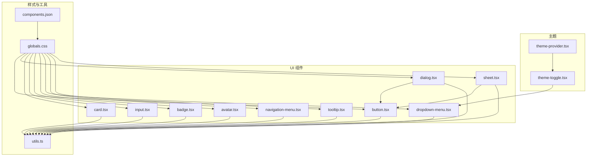
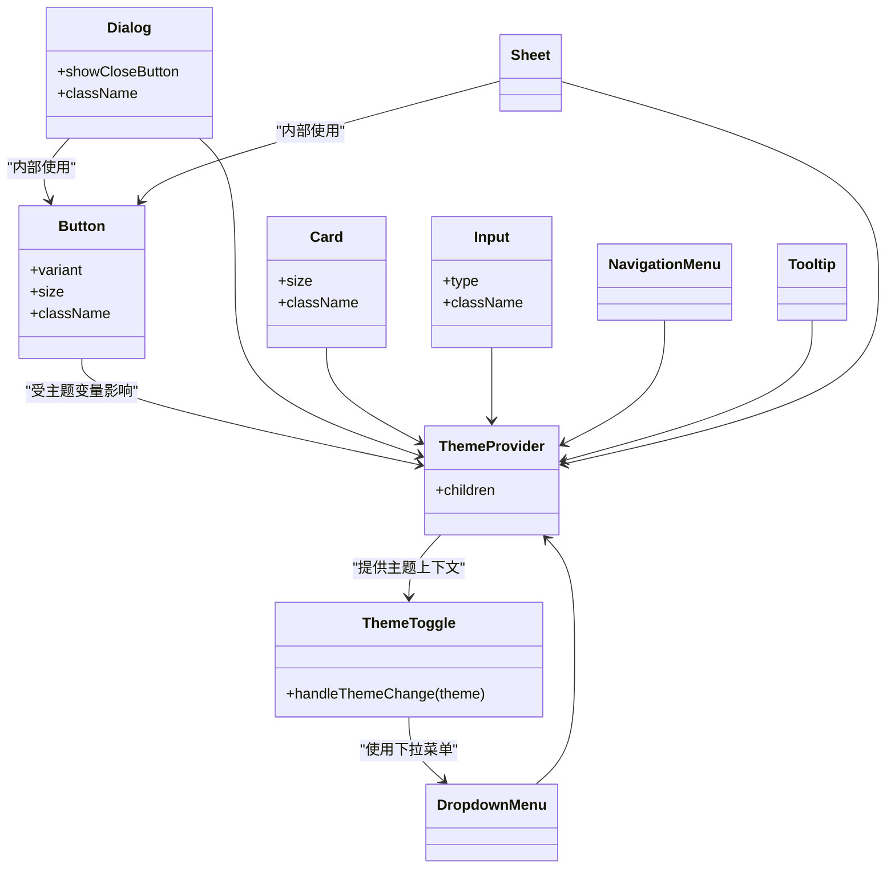
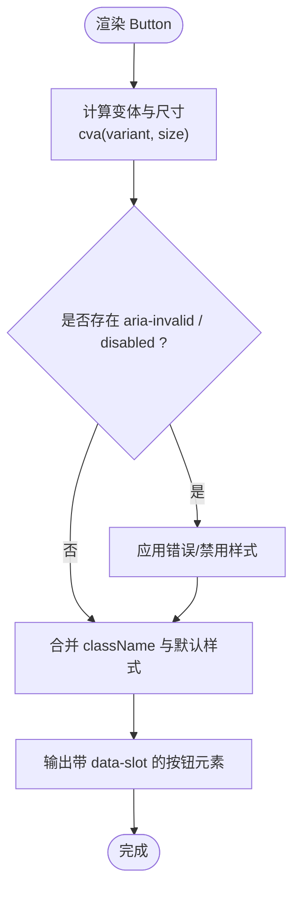
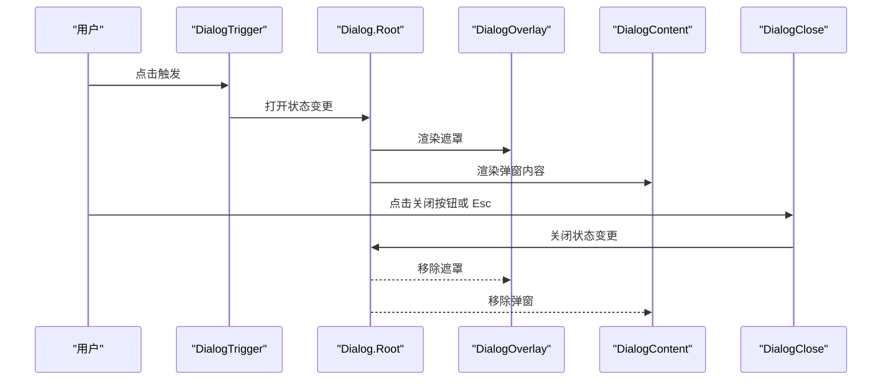
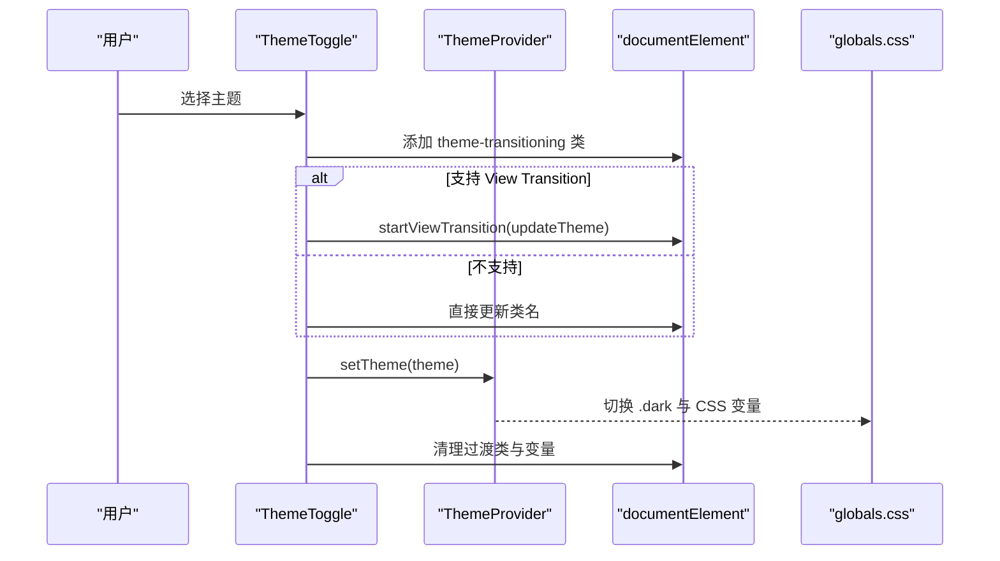
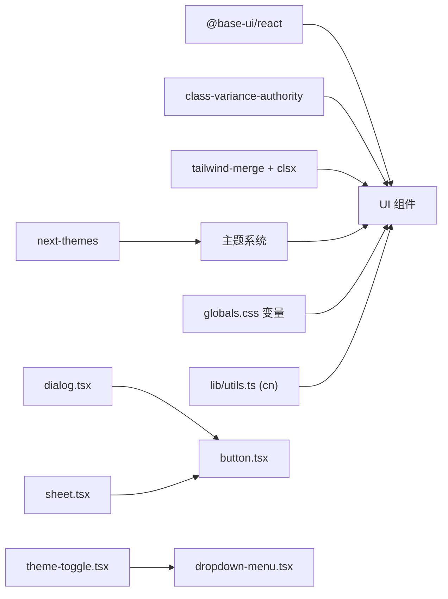

# UI 组件库

<cite>
**本文引用的文件**
- [components.json](file://components.json)
- [app/globals.css](file://app/globals.css)
- [lib/utils.ts](file://lib/utils.ts)
- [components/ui/button.tsx](file://components/ui/button.tsx)
- [components/ui/dialog.tsx](file://components/ui/dialog.tsx)
- [components/ui/card.tsx](file://components/ui/card.tsx)
- [components/ui/input.tsx](file://components/ui/input.tsx)
- [components/ui/badge.tsx](file://components/ui/badge.tsx)
- [components/ui/avatar.tsx](file://components/ui/avatar.tsx)
- [components/ui/dropdown-menu.tsx](file://components/ui/dropdown-menu.tsx)
- [components/ui/navigation-menu.tsx](file://components/ui/navigation-menu.tsx)
- [components/ui/tooltip.tsx](file://components/ui/tooltip.tsx)
- [components/ui/sheet.tsx](file://components/ui/sheet.tsx)
- [components/theme/theme-provider.tsx](file://components/theme/theme-provider.tsx)
- [components/theme/theme-toggle.tsx](file://components/theme/theme-toggle.tsx)
</cite>

## 目录
1. [简介](#简介)
2. [项目结构](#项目结构)
3. [核心组件](#核心组件)
4. [架构总览](#架构总览)
5. [详细组件分析](#详细组件分析)
6. [依赖关系分析](#依赖关系分析)
7. [性能与可访问性](#性能与可访问性)
8. [主题与样式定制](#主题与样式定制)
9. [组合模式与最佳实践](#组合模式与最佳实践)
10. [故障排查](#故障排查)
11. [结论](#结论)

## 简介
本文件面向前端开发者，系统化梳理基于 shadcn/ui 的 UI 组件库。内容覆盖基础组件（按钮、对话框、卡片、输入框等）的使用方法、属性配置、样式定制、响应式实现、主题适配与可访问性支持，并提供组件组合模式与自定义样式的指导，帮助快速构建一致、可维护的用户界面。

## 项目结构
本项目采用“按功能域组织”的结构：
- components/ui：通用 UI 原子组件（Button、Dialog、Card、Input、Badge、Avatar、DropdownMenu、NavigationMenu、Tooltip、Sheet 等）
- components/theme：主题提供者与切换器
- app/globals.css：全局样式、CSS 变量、动画与工具类
- lib/utils.ts：样式合并工具 cn 与资源路径工具 getAssetPath
- components.json：shadcn/ui 配置（风格、别名、图标库等）

图表来源
- [components/ui/button.tsx:1-61](file://components/ui/button.tsx#L1-L61)
- [components/ui/dialog.tsx:1-161](file://components/ui/dialog.tsx#L1-L161)
- [components/ui/card.tsx:1-104](file://components/ui/card.tsx#L1-L104)
- [components/ui/input.tsx:1-21](file://components/ui/input.tsx#L1-L21)
- [components/ui/badge.tsx:1-53](file://components/ui/badge.tsx#L1-L53)
- [components/ui/avatar.tsx:1-110](file://components/ui/avatar.tsx#L1-L110)
- [components/ui/dropdown-menu.tsx:1-269](file://components/ui/dropdown-menu.tsx#L1-L269)
- [components/ui/navigation-menu.tsx:1-169](file://components/ui/navigation-menu.tsx#L1-L169)
- [components/ui/tooltip.tsx:1-67](file://components/ui/tooltip.tsx#L1-L67)
- [components/ui/sheet.tsx:1-139](file://components/ui/sheet.tsx#L1-L139)
- [components/theme/theme-provider.tsx:1-11](file://components/theme/theme-provider.tsx#L1-L11)
- [components/theme/theme-toggle.tsx:1-115](file://components/theme/theme-toggle.tsx#L1-L115)
- [app/globals.css:1-125](file://app/globals.css#L1-L125)
- [lib/utils.ts:1-26](file://lib/utils.ts#L1-L26)
- [components.json:1-26](file://components.json#L1-L26)

章节来源
- [components.json:1-26](file://components.json#L1-L26)
- [app/globals.css:1-125](file://app/globals.css#L1-L125)
- [lib/utils.ts:1-26](file://lib/utils.ts#L1-L26)

## 核心组件
本节聚焦常用组件的使用要点、关键属性与样式扩展方式。所有组件均通过 Tailwind CSS 与 CSS 变量驱动主题与状态，结合 class-variance-authority 管理变体。

- 按钮 Button
  - 用途：触发操作、导航或表单提交
  - 关键属性
    - variant：default、outline、secondary、ghost、destructive、link
    - size：default、xs、sm、lg、icon、icon-xs、icon-sm、icon-lg
    - className：追加自定义样式
  - 交互与可访问性
    - 焦点环、禁用态、aria-invalid 错误态
    - 支持内联图标尺寸自适应
  - 参考实现
    - [components/ui/button.tsx:1-61](file://components/ui/button.tsx#L1-L61)

- 对话框 Dialog
  - 用途：模态确认、表单录入、详情展示
  - 子组件：Dialog、DialogTrigger、DialogContent、DialogHeader、DialogTitle、DialogDescription、DialogFooter、DialogOverlay、DialogPortal、DialogClose
  - 关键属性
    - showCloseButton：是否显示右上角关闭按钮
    - className：覆盖默认布局与动画
  - 交互与可访问性
    - 自动焦点管理、Esc 关闭、点击遮罩关闭
    - 标题与描述语义化
  - 参考实现
    - [components/ui/dialog.tsx:1-161](file://components/ui/dialog.tsx#L1-L161)

- 卡片 Card
  - 用途：信息聚合、内容区块容器
  - 子组件：Card、CardHeader、CardTitle、CardDescription、CardAction、CardContent、CardFooter
  - 关键属性
    - size：default、sm
    - className：覆盖圆角、间距、边框等
  - 参考实现
    - [components/ui/card.tsx:1-104](file://components/ui/card.tsx#L1-L104)

- 输入框 Input
  - 用途：文本输入、搜索、过滤
  - 关键属性
    - type：text、email、password 等原生类型
    - className：覆盖边框、占位符、禁用态
  - 交互与可访问性
    - 焦点环、禁用态、aria-invalid 错误态
  - 参考实现
    - [components/ui/input.tsx:1-21](file://components/ui/input.tsx#L1-L21)

- 徽章 Badge
  - 用途：标签、计数、状态提示
  - 关键属性
    - variant：default、secondary、destructive、outline、ghost、link
  - 参考实现
    - [components/ui/badge.tsx:1-53](file://components/ui/badge.tsx#L1-L53)

- 头像 Avatar
  - 用途：用户标识、群组展示
  - 子组件：Avatar、AvatarImage、AvatarFallback、AvatarBadge、AvatarGroup、AvatarGroupCount
  - 关键属性
    - size：default、sm、lg
  - 参考实现
    - [components/ui/avatar.tsx:1-110](file://components/ui/avatar.tsx#L1-L110)

- 下拉菜单 DropdownMenu
  - 用途：操作列表、设置面板入口
  - 子组件：DropdownMenu、DropdownMenuTrigger、DropdownMenuContent、DropdownMenuItem、DropdownMenuCheckboxItem、DropdownMenuRadioGroup、DropdownMenuRadioItem、DropdownMenuSeparator、DropdownMenuShortcut、DropdownMenuSub、DropdownMenuSubTrigger、DropdownMenuSubContent
  - 关键属性
    - align、side、alignOffset、sideOffset：定位控制
    - inset、variant：对齐与危险项样式
  - 参考实现
    - [components/ui/dropdown-menu.tsx:1-269](file://components/ui/dropdown-menu.tsx#L1-L269)

- 导航菜单 NavigationMenu
  - 用途：主导航、多级菜单
  - 子组件：NavigationMenu、NavigationMenuList、NavigationMenuItem、NavigationMenuTrigger、NavigationMenuContent、NavigationMenuLink、NavigationMenuIndicator、NavigationMenuPositioner
  - 参考实现
    - [components/ui/navigation-menu.tsx:1-169](file://components/ui/navigation-menu.tsx#L1-L169)

- 提示 Tooltip
  - 用途：辅助说明、快捷键提示
  - 子组件：TooltipProvider、Tooltip、TooltipTrigger、TooltipContent
  - 关键属性
    - delay、side、align、sideOffset、alignOffset
  - 参考实现
    - [components/ui/tooltip.tsx:1-67](file://components/ui/tooltip.tsx#L1-L67)

- 抽屉 Sheet
  - 用途：侧边栏、移动端面板
  - 子组件：Sheet、SheetTrigger、SheetContent、SheetHeader、SheetTitle、SheetDescription、SheetFooter、SheetOverlay、SheetPortal、SheetClose
  - 关键属性
    - side：top、right、bottom、left
    - showCloseButton：是否显示关闭按钮
  - 参考实现
    - [components/ui/sheet.tsx:1-139](file://components/ui/sheet.tsx#L1-L139)

章节来源
- [components/ui/button.tsx:1-61](file://components/ui/button.tsx#L1-L61)
- [components/ui/dialog.tsx:1-161](file://components/ui/dialog.tsx#L1-L161)
- [components/ui/card.tsx:1-104](file://components/ui/card.tsx#L1-L104)
- [components/ui/input.tsx:1-21](file://components/ui/input.tsx#L1-L21)
- [components/ui/badge.tsx:1-53](file://components/ui/badge.tsx#L1-L53)
- [components/ui/avatar.tsx:1-110](file://components/ui/avatar.tsx#L1-L110)
- [components/ui/dropdown-menu.tsx:1-269](file://components/ui/dropdown-menu.tsx#L1-L269)
- [components/ui/navigation-menu.tsx:1-169](file://components/ui/navigation-menu.tsx#L1-L169)
- [components/ui/tooltip.tsx:1-67](file://components/ui/tooltip.tsx#L1-L67)
- [components/ui/sheet.tsx:1-139](file://components/ui/sheet.tsx#L1-L139)

## 架构总览
组件层基于 @base-ui/react 提供无障碍与行为能力，样式层由 Tailwind CSS 与 CSS 变量驱动，主题层由 next-themes 提供运行时切换。

图表来源
- [components/theme/theme-provider.tsx:1-11](file://components/theme/theme-provider.tsx#L1-L11)
- [components/theme/theme-toggle.tsx:1-115](file://components/theme/theme-toggle.tsx#L1-L115)
- [components/ui/button.tsx:1-61](file://components/ui/button.tsx#L1-L61)
- [components/ui/dialog.tsx:1-161](file://components/ui/dialog.tsx#L1-L161)
- [components/ui/card.tsx:1-104](file://components/ui/card.tsx#L1-L104)
- [components/ui/input.tsx:1-21](file://components/ui/input.tsx#L1-L21)
- [components/ui/dropdown-menu.tsx:1-269](file://components/ui/dropdown-menu.tsx#L1-L269)
- [components/ui/navigation-menu.tsx:1-169](file://components/ui/navigation-menu.tsx#L1-L169)
- [components/ui/tooltip.tsx:1-67](file://components/ui/tooltip.tsx#L1-L67)
- [components/ui/sheet.tsx:1-139](file://components/ui/sheet.tsx#L1-L139)

## 详细组件分析

### 按钮 Button
- 设计要点
  - 使用 cva 定义变体与尺寸，统一视觉语言
  - 内置焦点环、禁用态、错误态（aria-invalid）
  - 图标尺寸根据父级自适应
- 使用建议
  - 优先选择语义明确的 variant（如 destructive 用于删除）
  - 在密集操作中选用 xs/sm 尺寸
  - 需要强调时选择 default，弱化时使用 ghost/outline
- 示例路径
  - [components/ui/button.tsx:1-61](file://components/ui/button.tsx#L1-L61)

图表来源
- [components/ui/button.tsx:1-61](file://components/ui/button.tsx#L1-L61)

章节来源
- [components/ui/button.tsx:1-61](file://components/ui/button.tsx#L1-L61)

### 对话框 Dialog
- 设计要点
  - 使用 Portal 渲染到文档根节点，避免层级问题
  - 提供 Header/Footer 区域与可选关闭按钮
  - 入场/出场动画与缩放过渡
- 使用建议
  - 始终为标题设置 DialogTitle，为说明设置 DialogDescription
  - 复杂表单建议使用 Sheet 替代 Dialog 以利用更大宽度
- 示例路径
  - [components/ui/dialog.tsx:1-161](file://components/ui/dialog.tsx#L1-L161)

图表来源
- [components/ui/dialog.tsx:1-161](file://components/ui/dialog.tsx#L1-L161)

章节来源
- [components/ui/dialog.tsx:1-161](file://components/ui/dialog.tsx#L1-L161)

### 卡片 Card
- 设计要点
  - 支持 sm 紧凑尺寸，头部网格布局适配 Action 区
  - 首尾图片自动圆角处理
- 使用建议
  - 将重要操作放入 Footer，次要信息放入 Description
  - 配合 Badge 展示状态标签
- 示例路径
  - [components/ui/card.tsx:1-104](file://components/ui/card.tsx#L1-L104)

章节来源
- [components/ui/card.tsx:1-104](file://components/ui/card.tsx#L1-L104)

### 输入框 Input
- 设计要点
  - 统一的边框、焦点环与禁用态
  - 兼容文件上传时的 file 样式重置
- 使用建议
  - 结合 Form 校验，使用 aria-invalid 表达错误
  - 长文本场景考虑 Textarea（可扩展）
- 示例路径
  - [components/ui/input.tsx:1-21](file://components/ui/input.tsx#L1-L21)

章节来源
- [components/ui/input.tsx:1-21](file://components/ui/input.tsx#L1-L21)

### 下拉菜单 DropdownMenu
- 设计要点
  - 支持分组、复选、单选、分隔符、快捷提示
  - 丰富的定位参数与动画
- 使用建议
  - 危险操作使用 destructive 变体
  - 大量选项时考虑虚拟滚动（外部方案）
- 示例路径
  - [components/ui/dropdown-menu.tsx:1-269](file://components/ui/dropdown-menu.tsx#L1-L269)

章节来源
- [components/ui/dropdown-menu.tsx:1-269](file://components/ui/dropdown-menu.tsx#L1-L269)

### 导航菜单 NavigationMenu
- 设计要点
  - 支持视口外弹出、指示器与平滑过渡
  - 触发器箭头旋转反馈
- 使用建议
  - 移动端建议折叠为 Drawer/Sheet
  - 二级菜单注意键盘可达性与焦点顺序
- 示例路径
  - [components/ui/navigation-menu.tsx:1-169](file://components/ui/navigation-menu.tsx#L1-L169)

章节来源
- [components/ui/navigation-menu.tsx:1-169](file://components/ui/navigation-menu.tsx#L1-L169)

### 提示 Tooltip
- 设计要点
  - 延迟显示、多方位定位、箭头指向
- 使用建议
  - 仅用于补充说明，不承载关键操作
  - 移动端长按触发更佳
- 示例路径
  - [components/ui/tooltip.tsx:1-67](file://components/ui/tooltip.tsx#L1-L67)

章节来源
- [components/ui/tooltip.tsx:1-67](file://components/ui/tooltip.tsx#L1-L67)

### 抽屉 Sheet
- 设计要点
  - 四向滑入、遮罩、关闭按钮
- 使用建议
  - 适合移动端侧边导航与编辑面板
  - 与 Dialog 相比更适合大内容与分步流程
- 示例路径
  - [components/ui/sheet.tsx:1-139](file://components/ui/sheet.tsx#L1-L139)

章节来源
- [components/ui/sheet.tsx:1-139](file://components/ui/sheet.tsx#L1-L139)

### 主题切换 ThemeToggle
- 设计要点
  - 使用 next-themes 管理主题状态
  - 支持系统/亮/暗三种模式
  - 结合 View Transition API 实现圆形展开过渡
- 使用建议
  - 在应用根包裹 ThemeProvider
  - 尊重 prefers-reduced-motion 减少动效
- 示例路径
  - [components/theme/theme-toggle.tsx:1-115](file://components/theme/theme-toggle.tsx#L1-L115)
  - [components/theme/theme-provider.tsx:1-11](file://components/theme/theme-provider.tsx#L1-L11)

图表来源
- [components/theme/theme-toggle.tsx:1-115](file://components/theme/theme-toggle.tsx#L1-L115)
- [components/theme/theme-provider.tsx:1-11](file://components/theme/theme-provider.tsx#L1-L11)
- [app/globals.css:1-125](file://app/globals.css#L1-L125)

章节来源
- [components/theme/theme-toggle.tsx:1-115](file://components/theme/theme-toggle.tsx#L1-L115)
- [components/theme/theme-provider.tsx:1-11](file://components/theme/theme-provider.tsx#L1-L11)
- [app/globals.css:1-125](file://app/globals.css#L1-L125)

## 依赖关系分析
- 组件间耦合
  - Dialog 与 Sheet 内部复用 Button 作为关闭按钮
  - ThemeToggle 依赖 DropdownMenu 作为主题选择入口
- 外部依赖
  - @base-ui/react：提供无头组件与无障碍能力
  - class-variance-authority：变体与尺寸管理
  - tailwind-merge + clsx：样式合并
  - next-themes：主题状态持久化与切换
- 样式依赖
  - globals.css 中定义 CSS 变量与主题色板，被各组件通过 Tailwind 类引用

图表来源
- [components/ui/dialog.tsx:1-161](file://components/ui/dialog.tsx#L1-L161)
- [components/ui/sheet.tsx:1-139](file://components/ui/sheet.tsx#L1-L139)
- [components/ui/button.tsx:1-61](file://components/ui/button.tsx#L1-L61)
- [components/theme/theme-toggle.tsx:1-115](file://components/theme/theme-toggle.tsx#L1-L115)
- [components/ui/dropdown-menu.tsx:1-269](file://components/ui/dropdown-menu.tsx#L1-L269)
- [lib/utils.ts:1-26](file://lib/utils.ts#L1-L26)
- [app/globals.css:1-125](file://app/globals.css#L1-L125)

章节来源
- [components/ui/dialog.tsx:1-161](file://components/ui/dialog.tsx#L1-L161)
- [components/ui/sheet.tsx:1-139](file://components/ui/sheet.tsx#L1-L139)
- [components/ui/button.tsx:1-61](file://components/ui/button.tsx#L1-L61)
- [components/theme/theme-toggle.tsx:1-115](file://components/theme/theme-toggle.tsx#L1-L115)
- [components/ui/dropdown-menu.tsx:1-269](file://components/ui/dropdown-menu.tsx#L1-L269)
- [lib/utils.ts:1-26](file://lib/utils.ts#L1-L26)
- [app/globals.css:1-125](file://app/globals.css#L1-L125)

## 性能与可访问性
- 性能
  - 使用 Portal 避免重排与层级问题
  - 动画与过渡遵循 prefers-reduced-motion，降低不必要的重绘
  - 按需引入图标与组件，避免冗余渲染
- 可访问性
  - 所有交互组件具备键盘可达性与焦点管理
  - 语义化标签（标题、描述、关闭按钮）提升屏幕阅读器体验
  - 错误态通过 aria-invalid 传达，确保一致性

[本节为通用指导，不直接分析具体文件]

## 主题与样式定制
- 主题变量
  - 在 globals.css 中定义 light/dark 两套 CSS 变量，涵盖背景、前景、主色、强调、破坏、边框、阴影等
  - 通过 Tailwind 的 @theme 映射到设计令牌，供组件直接使用
- 自定义步骤
  - 修改 globals.css 中的颜色变量即可全局生效
  - 使用 cn 工具合并 className，避免冲突
  - 通过 shadcn 配置文件 components.json 调整风格与别名
- 响应式
  - 组件广泛使用 Tailwind 断点与容器查询，保证移动端友好
  - 对话框与抽屉在小屏下自动限制最大宽度

章节来源
- [app/globals.css:1-125](file://app/globals.css#L1-L125)
- [lib/utils.ts:1-26](file://lib/utils.ts#L1-L26)
- [components.json:1-26](file://components.json#L1-L26)

## 组合模式与最佳实践
- 表单组合
  - 使用 Input + Label + 错误提示（aria-invalid）+ 按钮提交
  - 复杂表单可嵌套在 Dialog 或 Sheet 中
- 列表与卡片
  - Card + CardHeader/CardContent/CardFooter + Badge 组合呈现条目
- 导航与菜单
  - NavigationMenu 用于主导航；DropdownMenu 用于页面内操作
- 主题与国际化
  - 在应用根包裹 ThemeProvider；使用 i18n 文案替换静态文本
- 可访问性清单
  - 为每个交互元素提供可识别的标签与状态
  - 确保键盘导航顺序合理，焦点可见

[本节为通用指导，不直接分析具体文件]

## 故障排查
- 主题未生效
  - 检查是否在应用根包裹了 ThemeProvider
  - 确认 documentElement 上存在正确的主题类
- 样式冲突
  - 使用 cn 合并 className，避免重复定义
  - 检查 Tailwind 配置与全局样式导入顺序
- 弹窗层级异常
  - 确认使用了 Portal 渲染，避免父容器 overflow 裁剪
- 动画卡顿
  - 检查 prefers-reduced-motion 媒体查询，必要时禁用过渡

章节来源
- [components/theme/theme-provider.tsx:1-11](file://components/theme/theme-provider.tsx#L1-L11)
- [components/theme/theme-toggle.tsx:1-115](file://components/theme/theme-toggle.tsx#L1-L115)
- [lib/utils.ts:1-26](file://lib/utils.ts#L1-L26)
- [app/globals.css:147-192](file://app/globals.css#L147-L192)

## 结论
本 UI 组件库以 shadcn/ui 为基础，结合 Tailwind CSS 与 CSS 变量实现了高一致性的主题与样式体系。通过无头组件保障可访问性，通过 class-variance-authority 管理变体，通过 Portal 与动画优化交互体验。按照本文档的组合模式与最佳实践，可以快速构建高质量、可维护的前端界面。