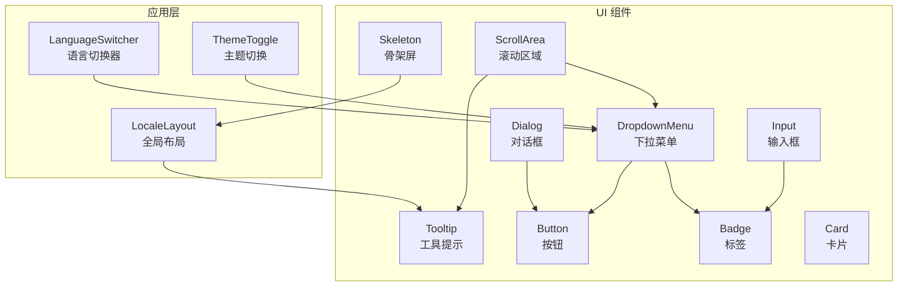
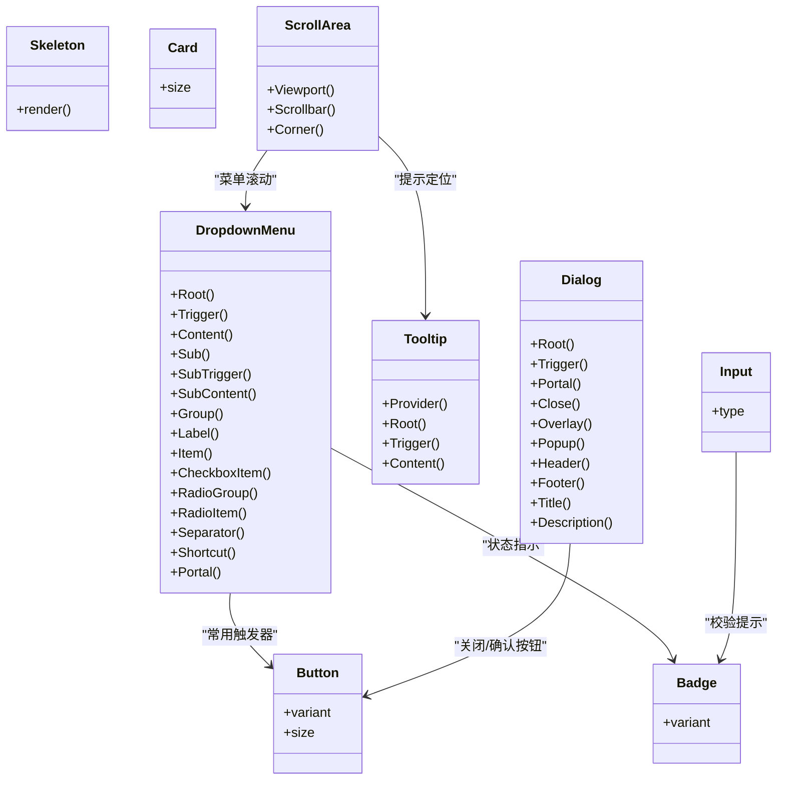
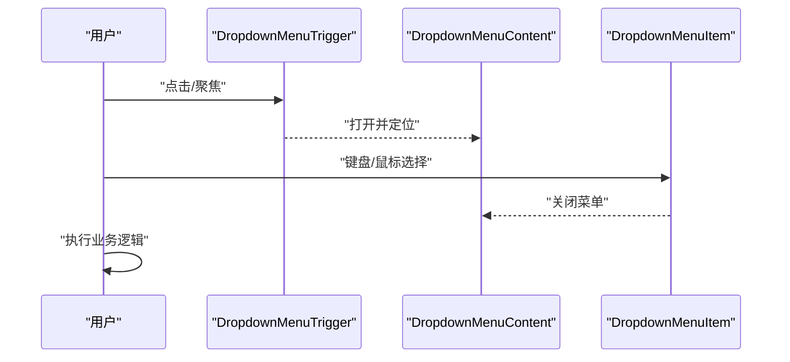
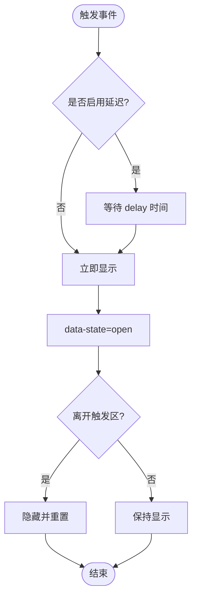
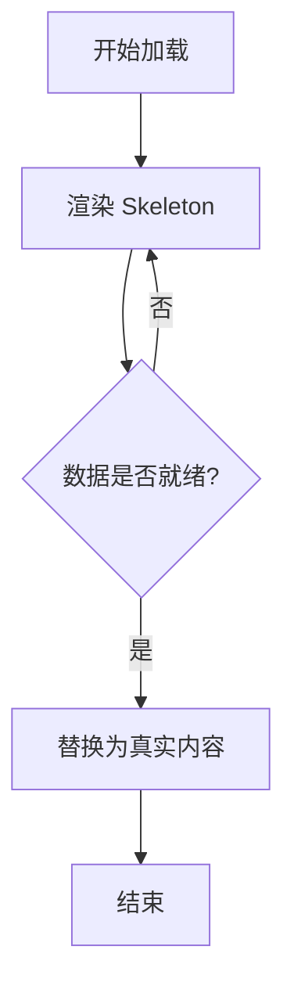
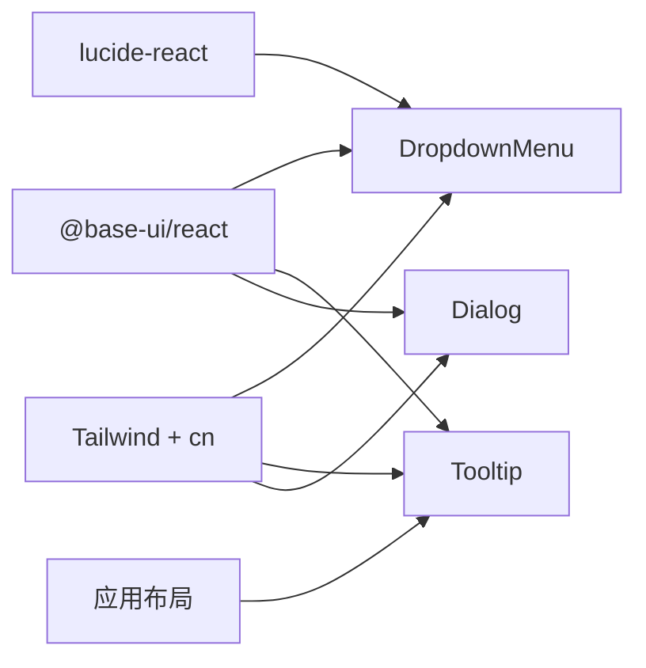

# 反馈组件

<cite>
**本文引用的文件**   
- [dropdown-menu.tsx](file://components/ui/dropdown-menu.tsx)
- [tooltip.tsx](file://components/ui/tooltip.tsx)
- [skeleton.tsx](file://components/ui/skeleton.tsx)
- [dialog.tsx](file://components/ui/dialog.tsx)
- [button.tsx](file://components/ui/button.tsx)
- [badge.tsx](file://components/ui/badge.tsx)
- [input.tsx](file://components/ui/input.tsx)
- [card.tsx](file://components/ui/card.tsx)
- [scroll-area.tsx](file://components/ui/scroll-area.tsx)
- [utils.ts](file://lib/utils.ts)
- [layout.tsx](file://app/[locale]/layout.tsx)
- [language-switcher.tsx](file://components/layout/language-switcher.tsx)
- [theme-toggle.tsx](file://components/theme/theme-toggle.tsx)
</cite>

## 目录
1. [简介](#简介)
2. [项目结构](#项目结构)
3. [核心组件](#核心组件)
4. [架构总览](#架构总览)
5. [详细组件分析](#详细组件分析)
6. [依赖关系分析](#依赖关系分析)
7. [性能与体验优化](#性能与体验优化)
8. [故障排查指南](#故障排查指南)
9. [结论](#结论)
10. [附录：使用示例与最佳实践](#附录使用示例与最佳实践)

## 简介
本文件聚焦于“用户反馈类 UI 组件”的实现与使用，涵盖下拉菜单、工具提示、骨架屏等关键组件。文档从交互行为、动画效果、状态管理、无障碍访问（a11y）与跨浏览器兼容性角度进行系统化说明，并提供实际使用场景与代码片段路径，帮助开发者快速构建一致、可访问且高性能的用户反馈界面。

## 项目结构
反馈相关组件集中在 components/ui 目录下，基于 @base-ui/react 的无样式基础组件进行封装，并通过 Tailwind CSS 与 class-variance-authority 实现主题化与变体控制。全局 TooltipProvider 在应用布局中注入，确保 tooltip 延迟与上下文一致性。

图表来源
- [layout.tsx:42-63](file://app/[locale]/layout.tsx#L42-L63)
- [language-switcher.tsx:31-52](file://components/layout/language-switcher.tsx#L31-L52)
- [theme-toggle.tsx:88-114](file://components/theme/theme-toggle.tsx#L88-L114)
- [dropdown-menu.tsx:1-268](file://components/ui/dropdown-menu.tsx#L1-L268)
- [tooltip.tsx:1-67](file://components/ui/tooltip.tsx#L1-L67)
- [skeleton.tsx:1-14](file://components/ui/skeleton.tsx#L1-L14)
- [dialog.tsx:1-161](file://components/ui/dialog.tsx#L1-L161)
- [button.tsx:1-61](file://components/ui/button.tsx#L1-L61)
- [badge.tsx:1-53](file://components/ui/badge.tsx#L1-L53)
- [input.tsx:1-21](file://components/ui/input.tsx#L1-L21)
- [card.tsx:1-104](file://components/ui/card.tsx#L1-L104)
- [scroll-area.tsx:1-56](file://components/ui/scroll-area.tsx#L1-L56)

章节来源
- [layout.tsx:42-63](file://app/[locale]/layout.tsx#L42-L63)
- [dropdown-menu.tsx:1-268](file://components/ui/dropdown-menu.tsx#L1-L268)
- [tooltip.tsx:1-67](file://components/ui/tooltip.tsx#L1-L67)
- [skeleton.tsx:1-14](file://components/ui/skeleton.tsx#L1-L14)

## 核心组件
本节对下拉菜单、工具提示、骨架屏三大反馈组件进行深度解析，包括 API、交互、动画、状态与无障碍要点。

### 下拉菜单 DropdownMenu
- 组成与职责
  - Root/Trigger/Content/Sub/SubTrigger/SubContent/Group/Label/Item/CheckboxItem/RadioGroup/RadioItem/Separator/Shortcut/Portal
  - 通过 Portal 渲染到 DOM 顶层，避免层级与溢出问题
- 交互行为
  - 键盘导航：方向键移动焦点、Enter/Space 选择、Esc 关闭、子菜单支持右箭头展开
  - 点击外部自动关闭；支持对齐与偏移配置
- 动画效果
  - 打开/关闭时提供淡入缩放与滑入滑出过渡，依据 side 动态计算进入方向
- 状态管理
  - 受控 checked 属性用于 CheckboxItem；RadioGroup 内部维护单选状态
- 无障碍访问
  - 原生 aria-* 由底层库负责；建议为图标添加 sr-only 文本
- 典型用法
  - 语言切换、主题切换等场景

章节来源
- [dropdown-menu.tsx:1-268](file://components/ui/dropdown-menu.tsx#L1-L268)
- [language-switcher.tsx:31-52](file://components/layout/language-switcher.tsx#L31-L52)
- [theme-toggle.tsx:88-114](file://components/theme/theme-toggle.tsx#L88-L114)

### 工具提示 Tooltip
- 组成与职责
  - Provider/Root/Trigger/Content/Arrow
  - Provider 统一设置延迟与上下文
- 交互行为
  - 悬停或聚焦触发，支持 delay 延迟显示；内容定位与箭头指向随 side/align 变化
- 动画效果
  - 打开/关闭包含淡入缩放与滑入滑出过渡
- 状态管理
  - 内部维护 open/closed/delayed-open 状态，配合 data-state 驱动样式
- 无障碍访问
  - 自动关联 aria-describedby；建议为 Trigger 提供语义化文本
- 全局注入
  - 在应用根布局中包裹 TooltipProvider，保证延迟与上下文一致

章节来源
- [tooltip.tsx:1-67](file://components/ui/tooltip.tsx#L1-L67)
- [layout.tsx:42-63](file://app/[locale]/layout.tsx#L42-L63)

### 骨架屏 Skeleton
- 组成与职责
  - 轻量占位容器，默认带脉冲动画与圆角背景
- 交互行为
  - 纯展示型，不响应交互
- 动画效果
  - 使用 pulse 动画模拟加载节奏
- 状态管理
  - 无状态，按父级数据加载状态决定是否渲染
- 无障碍访问
  - 作为占位元素，无需额外 aria；真实内容加载后替换即可

章节来源
- [skeleton.tsx:1-14](file://components/ui/skeleton.tsx#L1-L14)

### 辅助组件（与反馈相关）
- Dialog：模态弹窗，含遮罩、关闭按钮、标题描述、页眉页脚等，适合确认、表单等强反馈场景
- Button：多尺寸与变体，支持禁用、无效态与焦点环，常作为触发器
- Badge：状态标签，常用于计数、提示、版本标记
- Input：输入控件，结合错误态与焦点环提升可访问性
- Card：信息块容器，便于组织反馈内容
- ScrollArea：自定义滚动条，改善长列表/菜单的可读性与体验

章节来源
- [dialog.tsx:1-161](file://components/ui/dialog.tsx#L1-L161)
- [button.tsx:1-61](file://components/ui/button.tsx#L1-L61)
- [badge.tsx:1-53](file://components/ui/badge.tsx#L1-L53)
- [input.tsx:1-21](file://components/ui/input.tsx#L1-L21)
- [card.tsx:1-104](file://components/ui/card.tsx#L1-L104)
- [scroll-area.tsx:1-56](file://components/ui/scroll-area.tsx#L1-L56)

## 架构总览
反馈组件整体采用“基础组件 + 样式封装”的分层模式：
- 基础层：@base-ui/react 提供无样式、可访问的原语组件
- 样式层：Tailwind + cva 组合样式与变体
- 应用层：在布局中注入 TooltipProvider，页面按需组合组件完成反馈

图表来源
- [dropdown-menu.tsx:1-268](file://components/ui/dropdown-menu.tsx#L1-L268)
- [tooltip.tsx:1-67](file://components/ui/tooltip.tsx#L1-L67)
- [skeleton.tsx:1-14](file://components/ui/skeleton.tsx#L1-L14)
- [dialog.tsx:1-161](file://components/ui/dialog.tsx#L1-L161)
- [button.tsx:1-61](file://components/ui/button.tsx#L1-L61)
- [badge.tsx:1-53](file://components/ui/badge.tsx#L1-L53)
- [input.tsx:1-21](file://components/ui/input.tsx#L1-L21)
- [card.tsx:1-104](file://components/ui/card.tsx#L1-L104)
- [scroll-area.tsx:1-56](file://components/ui/scroll-area.tsx#L1-L56)

## 详细组件分析

### 下拉菜单：交互流程与动画
- 交互流程
  - 触发：点击/聚焦 Trigger 打开 Content
  - 导航：方向键移动焦点，Enter/Space 激活 Item，Esc 关闭
  - 子菜单：SubTrigger 展开 SubContent，右箭头进入，左箭头返回
  - 关闭：点击外部、选择项、Esc
- 动画策略
  - 打开：fade-in + zoom-in + slide-in-from-{side}
  - 关闭：fade-out + zoom-out + slide-out-to-{side}
- 定位与层级
  - Positioner 根据 align/side/sideOffset 计算位置
  - Portal 挂载至 body，z-index 隔离

图表来源
- [dropdown-menu.tsx:17-50](file://components/ui/dropdown-menu.tsx#L17-L50)
- [dropdown-menu.tsx:76-97](file://components/ui/dropdown-menu.tsx#L76-L97)
- [dropdown-menu.tsx:99-146](file://components/ui/dropdown-menu.tsx#L99-L146)

章节来源
- [dropdown-menu.tsx:1-268](file://components/ui/dropdown-menu.tsx#L1-L268)

### 工具提示：延迟与定位
- 延迟策略
  - Provider 的 delay 控制首次显示的等待时间，减少误触抖动
- 定位策略
  - Positioner 根据 side/align/offset 计算弹出位置
  - Arrow 跟随 Popup 边沿旋转与位移
- 状态机
  - closed -> delayed-open -> open -> closed

图表来源
- [tooltip.tsx:7-18](file://components/ui/tooltip.tsx#L7-L18)
- [tooltip.tsx:28-64](file://components/ui/tooltip.tsx#L28-L64)

章节来源
- [tooltip.tsx:1-67](file://components/ui/tooltip.tsx#L1-L67)
- [layout.tsx:42-63](file://app/[locale]/layout.tsx#L42-L63)

### 骨架屏：加载占位与替换时机
- 使用方式
  - 在数据未就绪时渲染 Skeleton，数据到达后替换为真实内容
- 视觉与节奏
  - 默认脉冲动画，可通过 className 调整尺寸与颜色
- 可访问性
  - 占位阶段无需 aria；真实内容加载后可移除占位

图表来源
- [skeleton.tsx:3-11](file://components/ui/skeleton.tsx#L3-L11)

章节来源
- [skeleton.tsx:1-14](file://components/ui/skeleton.tsx#L1-L14)

### 对话框：强反馈与焦点管理
- 结构
  - Overlay 遮罩 + Popup 内容 + 可选关闭按钮
- 交互
  - 打开时锁定滚动、聚焦第一个可聚焦元素；Esc 关闭
- 无障碍
  - 自动设置 role、aria-modal、aria-labelledby 等

章节来源
- [dialog.tsx:1-161](file://components/ui/dialog.tsx#L1-L161)

## 依赖关系分析
- 组件间耦合
  - DropdownMenu 与 Button/Badge 组合常见；Dialog 内嵌 Button 作为操作入口
  - ScrollArea 与 DropdownMenu/Tooltip 组合，解决长内容与定位问题
- 外部依赖
  - @base-ui/react 提供无样式原语与 a11y 能力
  - Tailwind + clsx/twMerge 合并样式
  - lucide-react 提供图标
- 全局上下文
  - TooltipProvider 在布局层注入，避免重复声明

图表来源
- [dropdown-menu.tsx:1-268](file://components/ui/dropdown-menu.tsx#L1-L268)
- [tooltip.tsx:1-67](file://components/ui/tooltip.tsx#L1-L67)
- [dialog.tsx:1-161](file://components/ui/dialog.tsx#L1-L161)
- [utils.ts:1-6](file://lib/utils.ts#L1-L6)
- [layout.tsx:42-63](file://app/[locale]/layout.tsx#L42-L63)

章节来源
- [utils.ts:1-6](file://lib/utils.ts#L1-L6)
- [layout.tsx:42-63](file://app/[locale]/layout.tsx#L42-L63)

## 性能与体验优化
- 动画与重排
  - 使用 transform/opacity 驱动的动画，避免布局抖动
  - 合理设置 duration 与 easing，避免过度动画影响首屏
- 定位与层级
  - 使用 Portal 将浮层置于顶层，减少 z-index 冲突
  - 通过 align/side/sideOffset 精确控制位置，避免遮挡
- 可访问性
  - 为图标与按钮提供 sr-only 文本
  - 确保键盘可达与焦点顺序正确
- 主题与暗色模式
  - 利用 CSS 变量与 dark: 前缀适配不同主题
- 国际化
  - 文案通过 next-intl 注入，避免硬编码

[本节为通用指导，不直接分析具体文件]

## 故障排查指南
- 提示/菜单不出现
  - 检查是否在布局中包裹了 TooltipProvider
  - 确认父容器 overflow/transform 是否影响定位
- 键盘无法导航
  - 确认 Trigger 可聚焦，且未被 pointer-events-none 阻断
  - 检查 focus-visible 样式是否被覆盖
- 动画异常或卡顿
  - 检查是否使用了会触发布局的属性（如 width/height）
  - 降低动画时长或简化动效
- 主题不一致
  - 确认 Tailwind 配置已启用 dark 模式与 CSS 变量
- 无障碍缺失
  - 为图标添加 sr-only 文本，确保屏幕阅读器可读

章节来源
- [layout.tsx:42-63](file://app/[locale]/layout.tsx#L42-L63)
- [dropdown-menu.tsx:1-268](file://components/ui/dropdown-menu.tsx#L1-L268)
- [tooltip.tsx:1-67](file://components/ui/tooltip.tsx#L1-L67)

## 结论
本项目以 @base-ui/react 为基础，结合 Tailwind 与 cva 构建了高可用、可访问、易扩展的反馈组件体系。通过统一的 Provider、一致的动画与定位策略，以及完善的键盘与屏幕阅读器支持，开发者可以快速搭建高质量的用户反馈界面。

[本节为总结，不直接分析具体文件]

## 附录：使用示例与最佳实践
- 语言切换（下拉菜单）
  - 参考：[language-switcher.tsx:31-52](file://components/layout/language-switcher.tsx#L31-L52)
- 主题切换（下拉菜单）
  - 参考：[theme-toggle.tsx:88-114](file://components/theme/theme-toggle.tsx#L88-L114)
- 全局工具提示（Provider）
  - 参考：[layout.tsx:42-63](file://app/[locale]/layout.tsx#L42-L63)
- 骨架屏占位
  - 参考：[skeleton.tsx:3-11](file://components/ui/skeleton.tsx#L3-L11)
- 对话框确认
  - 参考：[dialog.tsx:42-81](file://components/ui/dialog.tsx#L42-L81)

章节来源
- [language-switcher.tsx:31-52](file://components/layout/language-switcher.tsx#L31-L52)
- [theme-toggle.tsx:88-114](file://components/theme/theme-toggle.tsx#L88-L114)
- [layout.tsx:42-63](file://app/[locale]/layout.tsx#L42-L63)
- [skeleton.tsx:3-11](file://components/ui/skeleton.tsx#L3-L11)
- [dialog.tsx:42-81](file://components/ui/dialog.tsx#L42-L81)