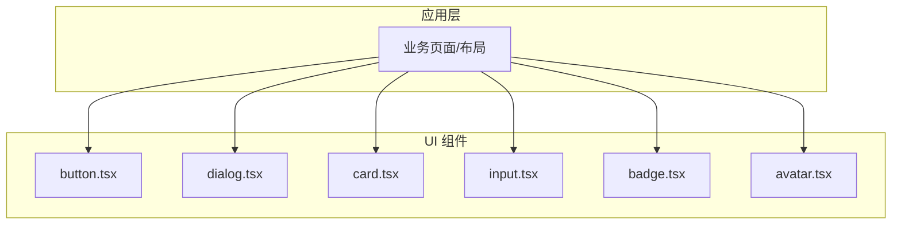
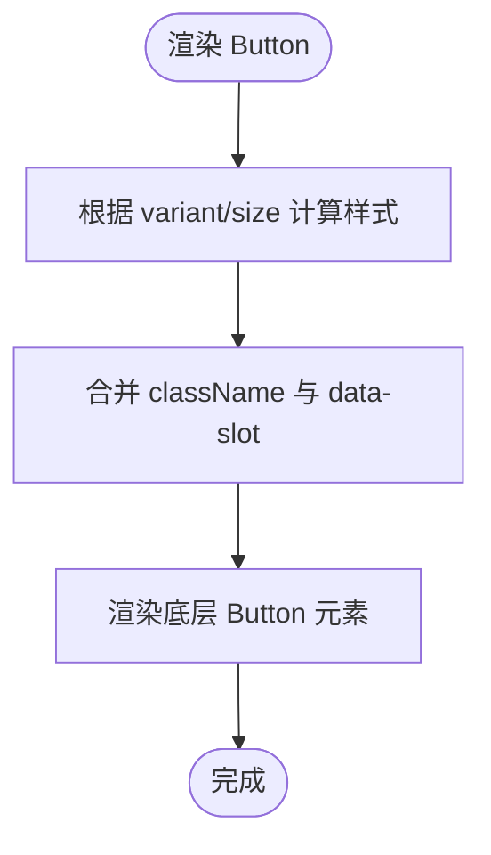
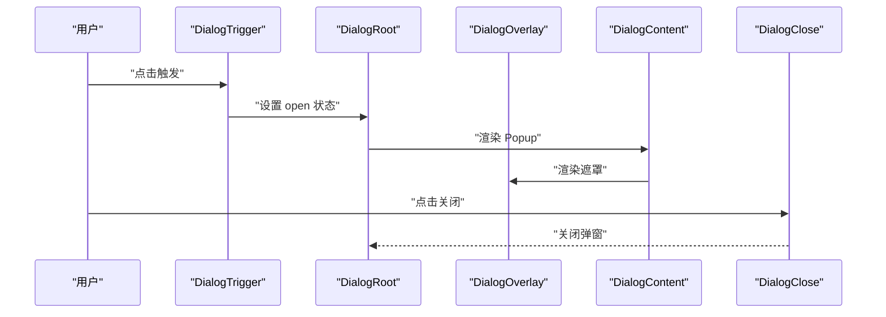
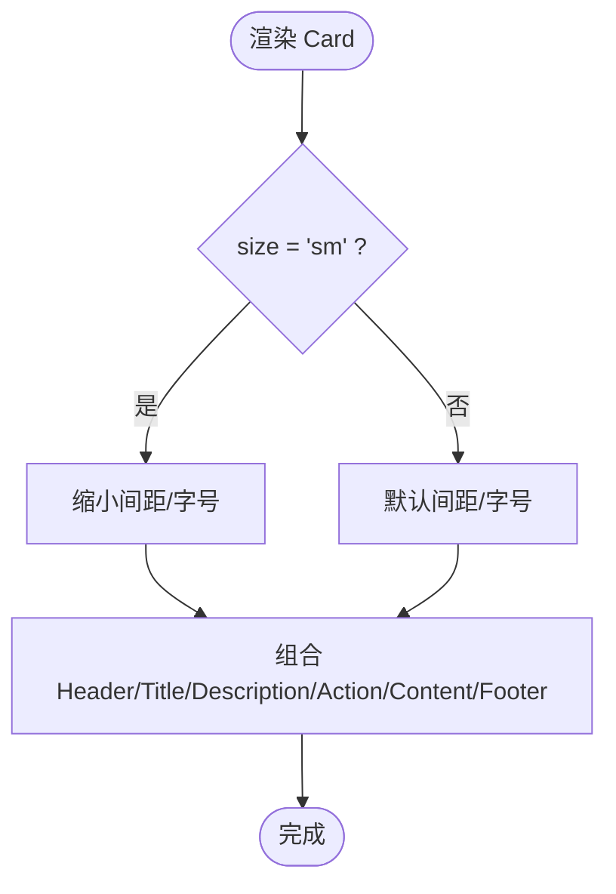
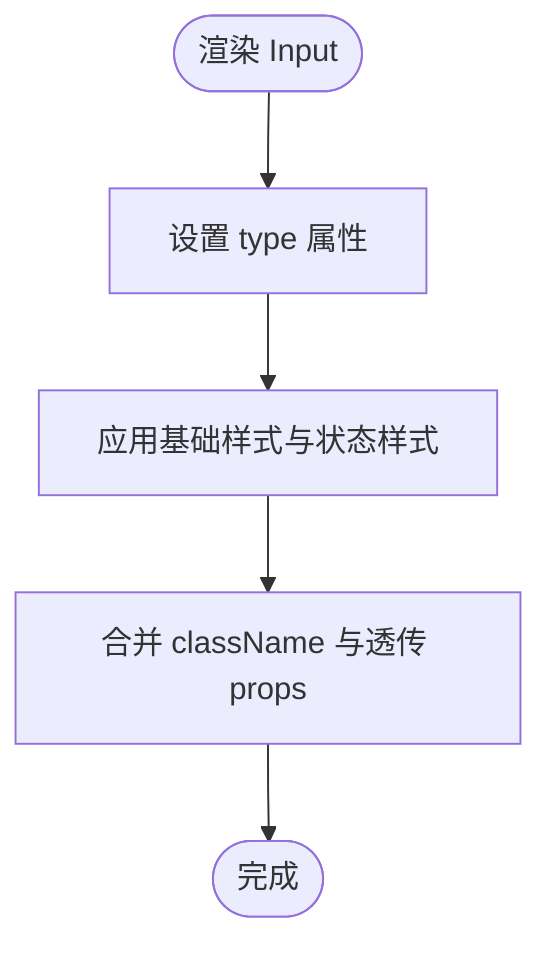
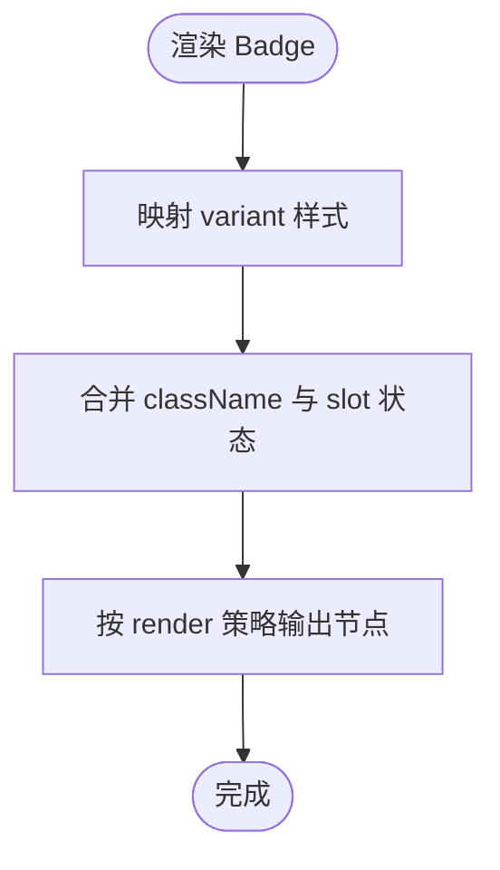
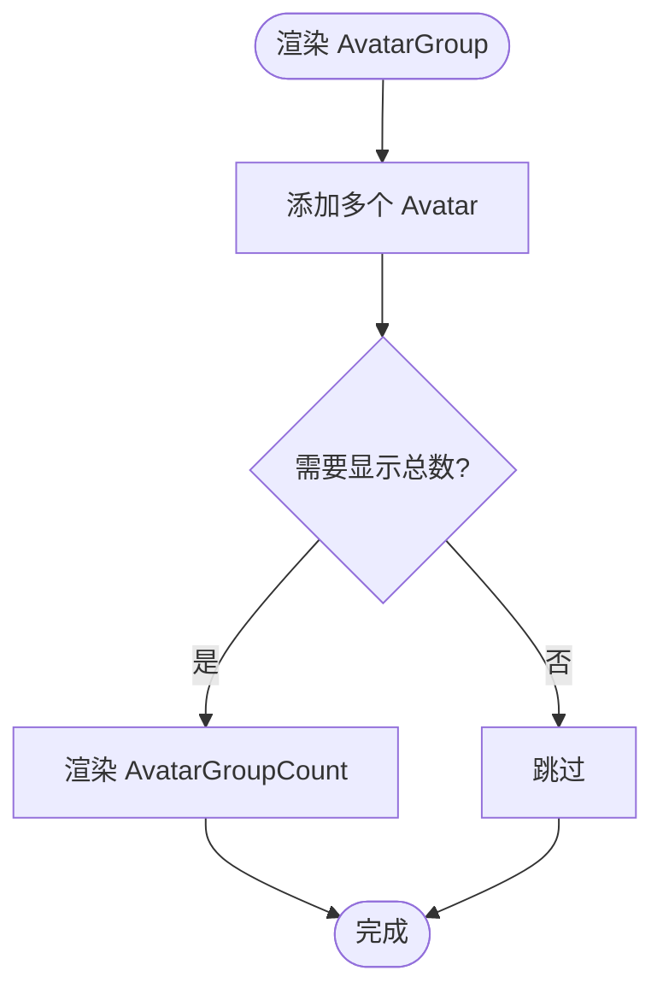
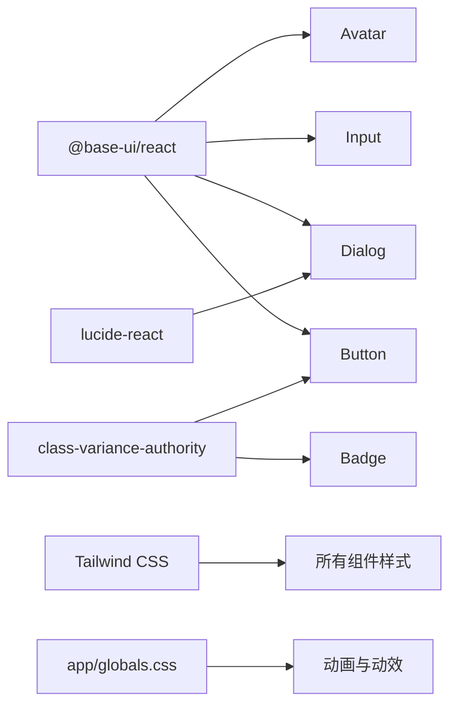

# 基础组件

<cite>
**本文引用的文件**   
- [components/ui/button.tsx](file://components/ui/button.tsx)
- [components/ui/dialog.tsx](file://components/ui/dialog.tsx)
- [components/ui/card.tsx](file://components/ui/card.tsx)
- [components/ui/input.tsx](file://components/ui/input.tsx)
- [components/ui/badge.tsx](file://components/ui/badge.tsx)
- [components/ui/avatar.tsx](file://components/ui/avatar.tsx)
- [app/globals.css](file://app/globals.css)
</cite>

## 目录
1. [简介](#简介)
2. [项目结构](#项目结构)
3. [核心组件](#核心组件)
4. [架构总览](#架构总览)
5. [详细组件分析](#详细组件分析)
6. [依赖关系分析](#依赖关系分析)
7. [性能与可访问性](#性能与可访问性)
8. [故障排查指南](#故障排查指南)
9. [结论](#结论)
10. [附录：主题与样式定制](#附录主题与样式定制)

## 简介
本章节面向使用 shadcn/ui 风格的基础 UI 组件的开发者，提供按钮、对话框、卡片、输入框、徽章、头像等核心组件的使用参考。文档涵盖各组件的 props 配置、事件处理、样式定制选项与响应式实现要点，并给出常见场景的组合示例路径与最佳实践建议。所有说明均基于仓库内实际源码与样式文件进行提炼。

## 项目结构
本项目采用“功能/页面 + 共享 UI 组件”的组织方式。基础 UI 组件集中在 components/ui 目录下，通过 Tailwind CSS 与 class-variance-authority（cva）组合实现变体与尺寸控制；全局样式在 app/globals.css 中维护。

[本节为概念性结构说明，不直接分析具体文件，故无“章节来源”]

## 核心组件
本节概述各基础组件的职责与能力边界，后续章节将逐一深入。

- 按钮 Button：多形态（默认、描边、次要、幽灵、危险、链接）、多尺寸（默认、xs、sm、lg、icon 系列），支持禁用态、焦点环与图标对齐。
- 对话框 Dialog：由 Root/Trigger/Portal/Close/Overlay/Popup/Header/Footer/Title/Description 组成，内置关闭按钮与动画过渡。
- 卡片 Card：容器型组件，包含 Header/Title/Description/Action/Content/Footer 子块，支持大小变体。
- 输入框 Input：标准文本输入，支持类型、占位符、禁用态、无效态与暗色适配。
- 徽章 Badge：标签化展示，支持多种语义变体（默认、次要、危险、描边、幽灵、链接）。
- 头像 Avatar：支持图片、回退文本、角标与分组显示，具备尺寸变体。

**章节来源**
- [components/ui/button.tsx:8-43](file://components/ui/button.tsx#L8-L43)
- [components/ui/dialog.tsx:10-147](file://components/ui/dialog.tsx#L10-L147)
- [components/ui/card.tsx:5-93](file://components/ui/card.tsx#L5-L93)
- [components/ui/input.tsx:6-18](file://components/ui/input.tsx#L6-L18)
- [components/ui/badge.tsx:7-28](file://components/ui/badge.tsx#L7-L28)
- [components/ui/avatar.tsx:8-100](file://components/ui/avatar.tsx#L8-L100)

## 架构总览
基础组件统一遵循以下模式：
- 基于 @base-ui/react 的无头组件封装，保证可访问性与行为正确性。
- 使用 cva 定义样式变体，结合 cn 工具类合并 className。
- 通过 data-slot 标记子区域，便于外部精准覆盖样式。
- 利用 Tailwind 断点与 dark 前缀实现响应式与暗色主题适配。

```mermaid
classDiagram
class Button {
+variant : "default" | "outline" | "secondary" | "ghost" | "destructive" | "link"
+size : "default" | "xs" | "sm" | "lg" | "icon" | "icon-xs" | "icon-sm" | "icon-lg"
+className? : string
+...props
}
class DialogRoot {
+...props
}
class DialogTrigger {
+...props
}
class DialogPortal {
+...props
}
class DialogClose {
+...props
}
class DialogOverlay {
+className? : string
}
class DialogContent {
+className? : string
+children? : ReactNode
+showCloseButton? : boolean
}
class DialogHeader {
+className? : string
}
class DialogFooter {
+className? : string
+showCloseButton? : boolean
+children? : ReactNode
}
class DialogTitle {
+className? : string
}
class DialogDescription {
+className? : string
}
class Card {
+size? : "default" | "sm"
+className? : string
}
class CardHeader { +className? : string }
class CardTitle { +className? : string }
class CardDescription { +className? : string }
class CardAction { +className? : string }
class CardContent { +className? : string }
class CardFooter { +className? : string }
class Input {
+type? : string
+className? : string
+...props
}
class Badge {
+variant : "default" | "secondary" | "destructive" | "outline" | "ghost" | "link"
+className? : string
}
class Avatar {
+size? : "default" | "sm" | "lg"
+className? : string
}
class AvatarImage { +className? : string }
class AvatarFallback { +className? : string }
class AvatarBadge { +className? : string }
class AvatarGroup { +className? : string }
class AvatarGroupCount { +className? : string }
DialogContent --> DialogOverlay : "渲染遮罩"
DialogContent --> DialogClose : "内置关闭按钮"
DialogFooter --> DialogClose : "可选关闭按钮"
AvatarGroup --> Avatar : "组合多个头像"
```

**图表来源**
- [components/ui/button.tsx:8-43](file://components/ui/button.tsx#L8-L43)
- [components/ui/dialog.tsx:10-147](file://components/ui/dialog.tsx#L10-L147)
- [components/ui/card.tsx:5-93](file://components/ui/card.tsx#L5-L93)
- [components/ui/input.tsx:6-18](file://components/ui/input.tsx#L6-L18)
- [components/ui/badge.tsx:7-28](file://components/ui/badge.tsx#L7-L28)
- [components/ui/avatar.tsx:8-100](file://components/ui/avatar.tsx#L8-L100)

## 详细组件分析

### 按钮 Button
- 用途：触发操作或导航，支持多种视觉变体与尺寸。
- 关键属性
  - variant：default、outline、secondary、ghost、destructive、link
  - size：default、xs、sm、lg、icon、icon-xs、icon-sm、icon-lg
  - className：用于追加自定义样式
  - ...props：透传至底层原生 button 元素
- 交互与状态
  - 焦点可见：focus-visible 边框与环形高亮
  - 禁用态：pointer-events-none、opacity 降低
  - 无效态：aria-invalid 关联破坏色边框与环
  - 图标对齐：data-[icon=inline-start/end] 自动调整内边距
- 响应式与主题
  - 使用 Tailwind 断点与 dark 前缀适配小屏与暗色
- 常见用法
  - 主操作按钮：使用 default 变体
  - 次级操作：outline/secondary
  - 删除/危险操作：destructive
  - 文本链接：link
  - 图标按钮：icon/icon-sm/icon-lg

**图表来源**
- [components/ui/button.tsx:8-43](file://components/ui/button.tsx#L8-L43)
- [components/ui/button.tsx:45-58](file://components/ui/button.tsx#L45-L58)

**章节来源**
- [components/ui/button.tsx:8-43](file://components/ui/button.tsx#L8-L43)
- [components/ui/button.tsx:45-58](file://components/ui/button.tsx#L45-L58)

### 对话框 Dialog
- 用途：弹出窗口承载重要信息或交互表单。
- 子组件与职责
  - Dialog：根容器
  - DialogTrigger：触发器
  - DialogPortal：挂载到 DOM 树合适位置
  - DialogOverlay：半透明遮罩
  - DialogContent：弹窗主体，支持 showCloseButton
  - DialogHeader/DialogFooter：头部/尾部布局
  - DialogTitle/DialogDescription：无障碍标题与描述
  - DialogClose：关闭控件
- 关键属性
  - Content.showCloseButton：是否显示右上角关闭按钮
  - Footer.showCloseButton：是否在底部渲染关闭按钮
  - className：覆盖默认样式
- 交互与可访问性
  - 焦点管理、Esc 关闭、点击遮罩关闭等行为由底层库保障
  - 标题与描述提供语义化标注
- 动画与响应式
  - 打开/关闭 fade 与 zoom 过渡
  - 移动端最大宽度自适应

**图表来源**
- [components/ui/dialog.tsx:10-81](file://components/ui/dialog.tsx#L10-L81)
- [components/ui/dialog.tsx:93-118](file://components/ui/dialog.tsx#L93-L118)

**章节来源**
- [components/ui/dialog.tsx:10-81](file://components/ui/dialog.tsx#L10-L81)
- [components/ui/dialog.tsx:93-118](file://components/ui/dialog.tsx#L93-L118)
- [components/ui/dialog.tsx:120-147](file://components/ui/dialog.tsx#L120-L147)

### 卡片 Card
- 用途：聚合内容区块，常用于文章摘要、项目展示等。
- 子组件
  - CardHeader/CardTitle/CardDescription/CardAction/CardContent/CardFooter
- 关键属性
  - Card.size：default | sm，影响间距与字号
  - 各子组件.className：按需覆盖
- 布局特性
  - 圆角、阴影与边框统一
  - 首尾图自动圆角处理
  - 响应式间距与字体缩放

**图表来源**
- [components/ui/card.tsx:5-21](file://components/ui/card.tsx#L5-L21)
- [components/ui/card.tsx:23-93](file://components/ui/card.tsx#L23-L93)

**章节来源**
- [components/ui/card.tsx:5-21](file://components/ui/card.tsx#L5-L21)
- [components/ui/card.tsx:23-93](file://components/ui/card.tsx#L23-L93)

### 输入框 Input
- 用途：文本输入，支持多种 input type。
- 关键属性
  - type：字符串，如 text、email、password 等
  - className：覆盖默认样式
  - ...props：透传给原生 input
- 状态与反馈
  - 禁用态：不可交互且样式弱化
  - 无效态：红色边框与提示环
  - 焦点态：聚焦边框与环形高亮
- 响应式与主题
  - 移动端字体与背景适配，暗色模式兼容

**图表来源**
- [components/ui/input.tsx:6-18](file://components/ui/input.tsx#L6-L18)

**章节来源**
- [components/ui/input.tsx:6-18](file://components/ui/input.tsx#L6-L18)

### 徽章 Badge
- 用途：标签、计数、状态标识。
- 关键属性
  - variant：default、secondary、destructive、outline、ghost、link
  - className：覆盖默认样式
  - render：允许自定义渲染目标（useRender）
- 样式特性
  - 紧凑高度与圆角
  - 图标自动尺寸与间距
  - 无效态与焦点态一致

**图表来源**
- [components/ui/badge.tsx:7-28](file://components/ui/badge.tsx#L7-L28)
- [components/ui/badge.tsx:30-50](file://components/ui/badge.tsx#L30-L50)

**章节来源**
- [components/ui/badge.tsx:7-28](file://components/ui/badge.tsx#L7-L28)
- [components/ui/badge.tsx:30-50](file://components/ui/badge.tsx#L30-L50)

### 头像 Avatar
- 用途：用户或实体头像展示，支持回退与角标。
- 子组件
  - Avatar：容器，支持 size=default|sm|lg
  - AvatarImage：图片
  - AvatarFallback：加载失败时的回退文本
  - AvatarBadge：右下角角标
  - AvatarGroup：头像组
  - AvatarGroupCount：组数量统计
- 关键属性
  - Avatar.size：控制整体尺寸
  - 各子组件.className：按需覆盖
- 交互与体验
  - 触摸设备下提供点击动效（全局样式）
  - 暗色模式下混合模式切换

**图表来源**
- [components/ui/avatar.tsx:73-100](file://components/ui/avatar.tsx#L73-L100)

**章节来源**
- [components/ui/avatar.tsx:8-26](file://components/ui/avatar.tsx#L8-L26)
- [components/ui/avatar.tsx:28-55](file://components/ui/avatar.tsx#L28-L55)
- [components/ui/avatar.tsx:57-100](file://components/ui/avatar.tsx#L57-L100)

## 依赖关系分析
- 组件间耦合
  - Dialog 内部依赖 Button 作为关闭按钮的呈现载体
  - 其余组件相互独立，通过统一的样式系统（Tailwind + cva）保持一致性
- 外部依赖
  - @base-ui/react：提供无头、可访问的交互基元
  - class-variance-authority：声明式变体与尺寸
  - lucide-react：图标资源（仅 Dialog 使用）
- 样式依赖
  - Tailwind 断点与颜色变量驱动响应式与主题
  - 全局动画与动效在 app/globals.css 中集中管理

**图表来源**
- [components/ui/dialog.tsx:1-8](file://components/ui/dialog.tsx#L1-L8)
- [components/ui/button.tsx:1-6](file://components/ui/button.tsx#L1-L6)
- [components/ui/badge.tsx:1-5](file://components/ui/badge.tsx#L1-L5)
- [components/ui/avatar.tsx:1-6](file://components/ui/avatar.tsx#L1-L6)
- [components/ui/input.tsx:1-4](file://components/ui/input.tsx#L1-L4)
- [app/globals.css:634-690](file://app/globals.css#L634-L690)

**章节来源**
- [components/ui/dialog.tsx:1-8](file://components/ui/dialog.tsx#L1-L8)
- [components/ui/button.tsx:1-6](file://components/ui/button.tsx#L1-L6)
- [components/ui/badge.tsx:1-5](file://components/ui/badge.tsx#L1-L5)
- [components/ui/avatar.tsx:1-6](file://components/ui/avatar.tsx#L1-L6)
- [components/ui/input.tsx:1-4](file://components/ui/input.tsx#L1-L4)
- [app/globals.css:634-690](file://app/globals.css#L634-L690)

## 性能与可访问性
- 性能
  - 组件均为轻量函数式封装，避免不必要的重渲染
  - 图标按需引入，减少打包体积
  - 动画与过渡使用 CSS 硬件加速类，提升流畅度
- 可访问性
  - 基于 @base-ui/react 的语义化结构与键盘交互
  - 焦点可见、ARIA 状态（如 aria-invalid）与屏幕阅读器友好文案（如 sr-only）
  - 标题与描述在对话框中提供明确层级

[本节为通用指导，不直接分析具体文件，故无“章节来源”]

## 故障排查指南
- 对话框无法关闭
  - 检查是否误覆盖了 DialogContent 的点击事件
  - 确认未移除 DialogClose 或阻止默认行为
- 按钮样式异常
  - 检查 variant/size 值是否拼写正确
  - 确认 className 未被覆盖导致样式优先级问题
- 输入框无效态不生效
  - 确保父表单或受控逻辑设置了 aria-invalid 或对应状态
- 头像图片加载失败
  - 使用 AvatarFallback 提供回退文本，避免空白
- 暗色主题不一致
  - 检查是否遗漏 dark: 前缀或使用了硬编码颜色

**章节来源**
- [components/ui/dialog.tsx:42-81](file://components/ui/dialog.tsx#L42-L81)
- [components/ui/button.tsx:8-43](file://components/ui/button.tsx#L8-L43)
- [components/ui/input.tsx:6-18](file://components/ui/input.tsx#L6-L18)
- [components/ui/avatar.tsx:28-55](file://components/ui/avatar.tsx#L28-L55)

## 结论
以上为基础组件的系统化参考。通过统一的变体系统与无头组件封装，这些组件在可访问性、主题适配与响应式方面具备良好的开箱即用能力。建议在项目中优先复用这些组件，并通过 className 与数据属性进行最小化定制，以保持界面一致性。

[本节为总结性内容，不直接分析具体文件，故无“章节来源”]

## 附录：主题与样式定制
- 主题变量
  - 使用 Tailwind 颜色变量（如 primary、background、muted、foreground 等）实现明暗主题切换
- 全局动效
  - 头像点击动效、卡片边框旋转等动画在 app/globals.css 中集中定义
- 覆盖建议
  - 优先使用组件提供的 variant/size 与 className 覆盖
  - 对复杂布局，可在外层包裹自定义容器，避免侵入组件内部样式

**章节来源**
- [app/globals.css:634-690](file://app/globals.css#L634-L690)