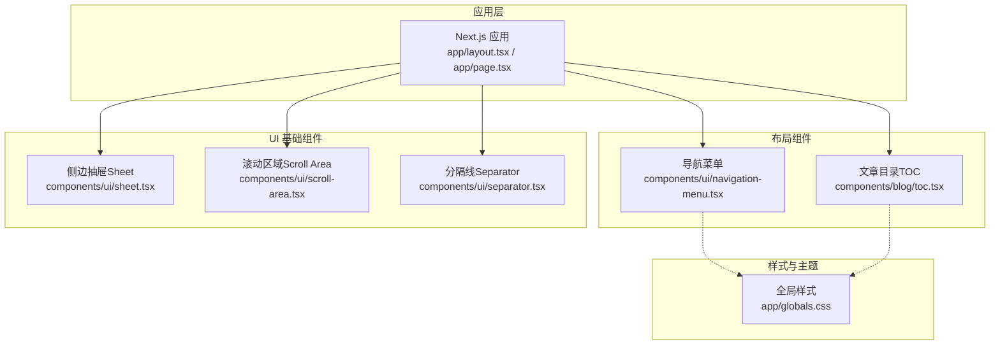
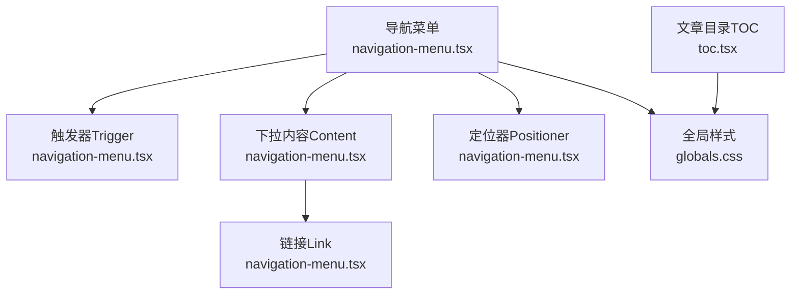
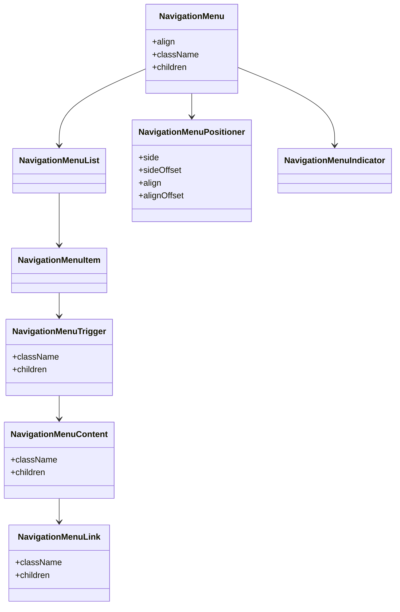
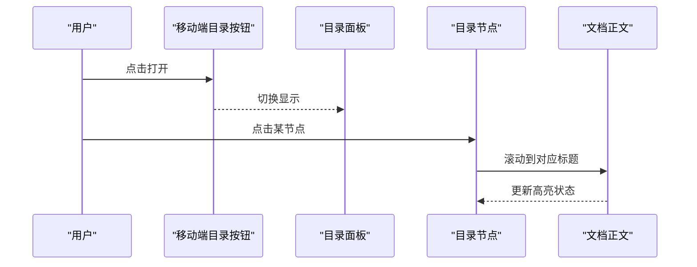
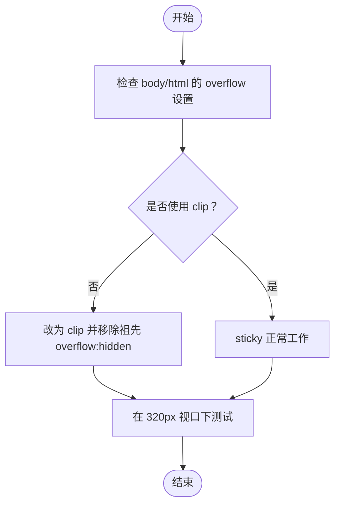
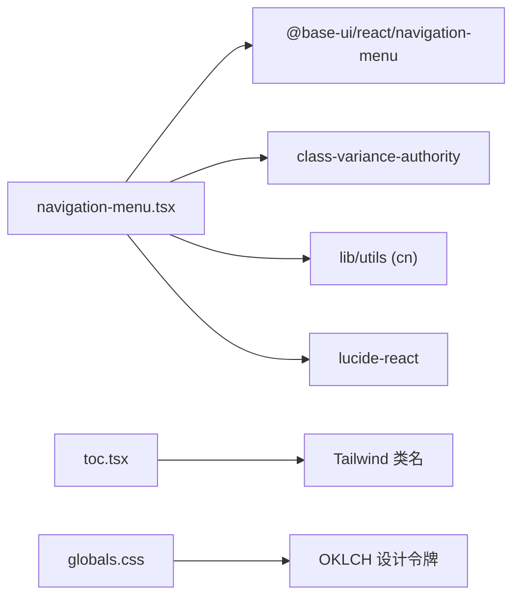

# 布局组件

<cite>
**本文引用的文件**   
- [navigation-menu.tsx](file://components/ui/navigation-menu.tsx)
- [toc.tsx](file://components/blog/toc.tsx)
- [globals.css](file://app/globals.css)
- [AGENTS.md](file://AGENTS.md)
</cite>

## 目录
1. [简介](#简介)
2. [项目结构](#项目结构)
3. [核心组件](#核心组件)
4. [架构总览](#架构总览)
5. [详细组件分析](#详细组件分析)
6. [依赖分析](#依赖分析)
7. [性能考虑](#性能考虑)
8. [故障排查指南](#故障排查指南)
9. [结论](#结论)
10. [附录](#附录)

## 简介
本文件聚焦于与“布局”相关的 UI 组件，包括导航菜单、侧边抽屉（Sheet）、滚动区域（Scroll Area）、分隔线（Separator）等。文档面向前端开发者，提供：
- 组件职责与使用方式说明
- 配置项与响应式行为要点
- 移动端适配与可访问性建议
- 复杂页面布局的组合示例与最佳实践
- 性能优化策略与常见问题排查

为保证准确性，本文所有实现细节均基于仓库中实际源码与样式文件进行分析与总结。

## 项目结构
本项目采用 Next.js App Router 组织页面与组件，布局相关能力主要分布在以下位置：
- 通用 UI 基础组件：位于 components/ui 下，包含导航菜单、对话框/抽屉、滚动区域、分隔线等
- 业务布局组件：如文章目录（TOC）在 components/blog/toc.tsx
- 全局样式与主题：app/globals.css 中定义了滚动、粘性定位、渐变分隔线等关键样式
- 工程规范与注意事项：AGENTS.md 记录了移动端横向滚动、sticky 定位、断点测试等实践要点

图表来源
- [navigation-menu.tsx:1-168](file://components/ui/navigation-menu.tsx#L1-L168)
- [toc.tsx:76-148](file://components/blog/toc.tsx#L76-L148)
- [globals.css:126-161](file://app/globals.css#L126-L161)
- [globals.css:858-983](file://app/globals.css#L858-L983)

章节来源
- [navigation-menu.tsx:1-168](file://components/ui/navigation-menu.tsx#L1-L168)
- [toc.tsx:76-148](file://components/blog/toc.tsx#L76-L148)
- [globals.css:126-161](file://app/globals.css#L126-L161)
- [globals.css:858-983](file://app/globals.css#L858-L983)

## 核心组件
本节概述各布局组件的职责与典型用法，结合仓库中的实现进行说明。

- 导航菜单（Navigation Menu）
  - 作用：提供桌面端主导航与下拉面板，支持触发器、列表项、内容区、定位器等子组件
  - 关键点：内置焦点管理、弹出层动画、指示器；通过 Positioner 控制对齐与偏移
  - 参考路径：[navigation-menu.tsx:1-168](file://components/ui/navigation-menu.tsx#L1-L168)

- 文章目录（TOC）
  - 作用：为长文提供目录导航，支持折叠/展开、移动端抽屉式展示、滚动高亮
  - 关键点：移动端以 sticky 顶部按钮 + 可滚动面板呈现；支持“全部展开/收起”
  - 参考路径：[toc.tsx:76-148](file://components/blog/toc.tsx#L76-L148)

- 侧边抽屉（Sheet）
  - 作用：从屏幕边缘滑出的覆盖层容器，常用于移动端导航或设置面板
  - 参考路径：[sheet.tsx](file://components/ui/sheet.tsx)

- 滚动区域（Scroll Area）
  - 作用：跨平台一致的自定义滚动条与滚动容器，避免原生滚动差异
  - 参考路径：[scroll-area.tsx](file://components/ui/scroll-area.tsx)

- 分隔线（Separator）
  - 作用：用于视觉分割的轻量组件，支持方向与语义化标签
  - 参考路径：[separator.tsx](file://components/ui/separator.tsx)

章节来源
- [navigation-menu.tsx:1-168](file://components/ui/navigation-menu.tsx#L1-L168)
- [toc.tsx:76-148](file://components/blog/toc.tsx#L76-L148)
- [sheet.tsx](file://components/ui/sheet.tsx)
- [scroll-area.tsx](file://components/ui/scroll-area.tsx)
- [separator.tsx](file://components/ui/separator.tsx)

## 架构总览
下图展示了布局组件之间的交互关系以及它们与全局样式的协作方式。

图表来源
- [navigation-menu.tsx:1-168](file://components/ui/navigation-menu.tsx#L1-L168)
- [toc.tsx:76-148](file://components/blog/toc.tsx#L76-L148)
- [globals.css:126-161](file://app/globals.css#L126-L161)

## 详细组件分析

### 导航菜单（Navigation Menu）
- 组件组成
  - Root：根容器，负责整体布局与对齐
  - List/Item：菜单项容器与单项
  - Trigger：触发器，带箭头图标与焦点状态
  - Content：下拉内容区，含进入/退出动画
  - Positioner：定位器，控制弹出方向、偏移与视口边界
  - Link：菜单内链接，统一样式与焦点环
  - Indicator：三角指示器，跟随激活项
- 配置要点
  - align：对齐方式（start/end），影响 Positioner 的定位
  - side/sideOffset：弹出方向与间距
  - className：扩展样式类名
- 可访问性与键盘导航
  - 由底层库提供焦点管理与键盘交互（如上下键移动、Enter/Space 打开、Esc 关闭）
  - 触发器与链接具备 focus-visible 样式，确保键盘可见焦点
- 响应式与动画
  - 使用数据属性驱动过渡与缩放动画，提升交互体验
  - 在小屏场景建议配合 Sheet 或 Drawer 替代复杂下拉

图表来源
- [navigation-menu.tsx:1-168](file://components/ui/navigation-menu.tsx#L1-L168)

章节来源
- [navigation-menu.tsx:1-168](file://components/ui/navigation-menu.tsx#L1-L168)

### 文章目录（TOC）
- 功能特性
  - 移动端：顶部 sticky 按钮 + 可滚动面板，支持“全部展开/收起”
  - 桌面端：常驻侧边目录树，支持节点折叠与高亮
  - 滚动联动：点击节点平滑滚动到对应标题
- 响应式行为
  - lg:hidden 控制移动端面板显示
  - 面板最大高度限制与内部滚动，避免溢出
- 可访问性建议
  - 为按钮与链接添加 aria-label 或描述文本
  - 保持键盘可达与焦点顺序合理

图表来源
- [toc.tsx:76-148](file://components/blog/toc.tsx#L76-L148)

章节来源
- [toc.tsx:76-148](file://components/blog/toc.tsx#L76-L148)

### 侧边抽屉（Sheet）
- 适用场景
  - 移动端导航、设置面板、筛选条件等
- 交互要点
  - 遮罩层点击关闭、Esc 关闭、阻止背景滚动
  - 可配置方向（左/右/上/下）与尺寸
- 组合建议
  - 与导航菜单联动：小屏隐藏主导航，改用 Sheet 承载
  - 与 Scroll Area 组合：抽屉内容过长时使用自定义滚动

章节来源
- [sheet.tsx](file://components/ui/sheet.tsx)

### 滚动区域（Scroll Area）
- 优势
  - 统一的滚动条外观与行为，跨浏览器一致
  - 可与固定头部/底部组合，避免原生滚动带来的抖动
- 使用建议
  - 长列表、抽屉内容、侧边栏推荐包裹
  - 注意与父级 overflow 的关系，避免双重滚动容器

章节来源
- [scroll-area.tsx](file://components/ui/scroll-area.tsx)

### 分隔线（Separator）
- 用途
  - 区块划分、表单分组、卡片内部分隔
- 可访问性
  - 使用正确的 role 与 orientation 语义，便于读屏器识别

章节来源
- [separator.tsx](file://components/ui/separator.tsx)

### 全局样式与布局基线
- 水平滚动保护与粘性定位
  - body 使用 clip 而非 hidden，避免建立滚动容器导致 sticky 失效
  - 在移动端窄屏下务必验证 header 与 flex 容器的表现
- 渐变分隔线
  - 提供 .gradient-divider 样式，可用于卡片或区块间的柔和分隔

图表来源
- [globals.css:126-161](file://app/globals.css#L126-L161)
- [AGENTS.md:112-121](file://AGENTS.md#L112-L121)

章节来源
- [globals.css:126-161](file://app/globals.css#L126-L161)
- [globals.css:858-983](file://app/globals.css#L858-L983)
- [AGENTS.md:112-121](file://AGENTS.md#L112-L121)

## 依赖分析
- 导航菜单依赖
  - 基础 UI 库（@base-ui/react/navigation-menu）提供无障碍与交互逻辑
  - 样式工具（class-variance-authority、cn）用于动态类名合并与变体
  - 图标库（lucide-react）提供箭头等图标
- 文章目录依赖
  - 依赖 React Hooks 与 Tailwind 类名进行响应式与动画
- 全局样式
  - 使用 OKLCH 颜色空间与 Tailwind v4 设计令牌，保证主题一致性

图表来源
- [navigation-menu.tsx:1-168](file://components/ui/navigation-menu.tsx#L1-L168)
- [toc.tsx:76-148](file://components/blog/toc.tsx#L76-L148)
- [globals.css:126-161](file://app/globals.css#L126-L161)

章节来源
- [navigation-menu.tsx:1-168](file://components/ui/navigation-menu.tsx#L1-L168)
- [toc.tsx:76-148](file://components/blog/toc.tsx#L76-L148)
- [globals.css:126-161](file://app/globals.css#L126-L161)

## 性能考虑
- 减少重排与重绘
  - 使用 transform/opacity 做动画，避免频繁修改布局属性
  - 下拉面板使用 Portal 渲染，降低层级计算开销
- 滚动性能
  - 长列表使用虚拟滚动或分页加载
  - 避免多层嵌套滚动容器，优先使用 Scroll Area 统一管理
- 样式与主题切换
  - 使用 view-transition 与过渡变量，减少闪烁与卡顿
- 移动端测试
  - 在 320px 视口下验证布局与交互，防止溢出与错位

章节来源
- [AGENTS.md:112-121](file://AGENTS.md#L112-L121)
- [globals.css:126-161](file://app/globals.css#L126-L161)

## 故障排查指南
- 移动端出现横向滚动条
  - 检查是否在 html/body 或其祖先设置了 overflow:hidden，应改为 overflow-x:clip
  - 确认新增的图标按钮不会在小屏下导致 flex 溢出
- 粘性定位（sticky）失效
  - 若父级建立了滚动容器，sticky 将失效；避免在 header 的祖先上使用 overflow
- 导航下拉遮挡或错位
  - 调整 Positioner 的 side、sideOffset、align、alignOffset
  - 检查 z-index 层级与视口边界计算
- 目录面板无法滚动
  - 确认面板设置了最大高度与内部滚动
  - 避免外层再次创建滚动容器

章节来源
- [AGENTS.md:112-121](file://AGENTS.md#L112-L121)
- [globals.css:126-161](file://app/globals.css#L126-L161)
- [toc.tsx:76-148](file://components/blog/toc.tsx#L76-L148)

## 结论
通过导航菜单、侧边抽屉、滚动区域、分隔线与全局样式协同，本项目提供了完整且可复用的布局解决方案。遵循本文的响应式与可访问性建议，并结合性能优化策略，可在多端设备上构建稳定、流畅的用户界面。

## 附录
- 快速上手清单
  - 在导航中使用 NavigationMenu 及其子组件，必要时用 Positioner 微调对齐
  - 在长文页面集成 TOC，移动端启用抽屉式目录
  - 对需要自定义滚动的区域使用 Scroll Area
  - 使用 Separator 进行视觉分区，或使用 .gradient-divider 获得渐变分隔效果
  - 严格遵循 AGENTS.md 中的移动端与 sticky 注意事项

章节来源
- [navigation-menu.tsx:1-168](file://components/ui/navigation-menu.tsx#L1-L168)
- [toc.tsx:76-148](file://components/blog/toc.tsx#L76-L148)
- [globals.css:858-983](file://app/globals.css#L858-L983)
- [AGENTS.md:112-121](file://AGENTS.md#L112-L121)