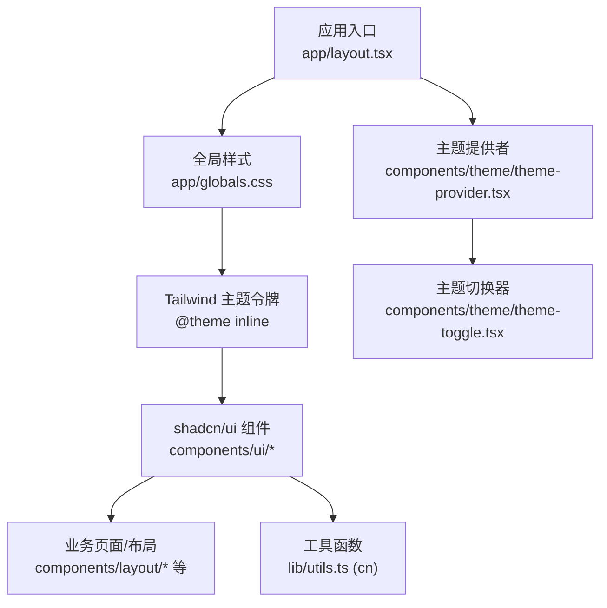
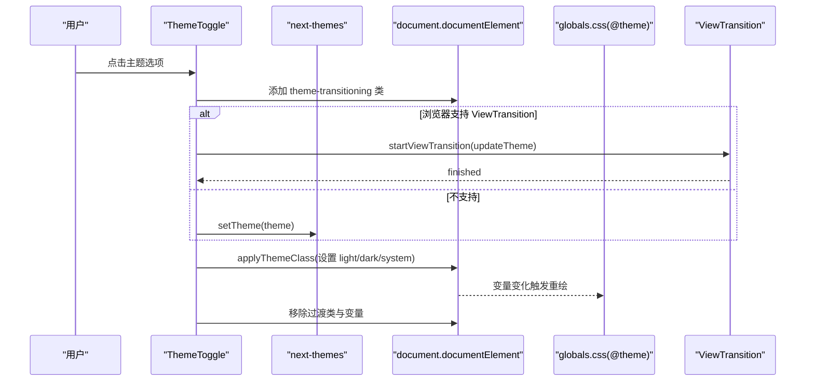
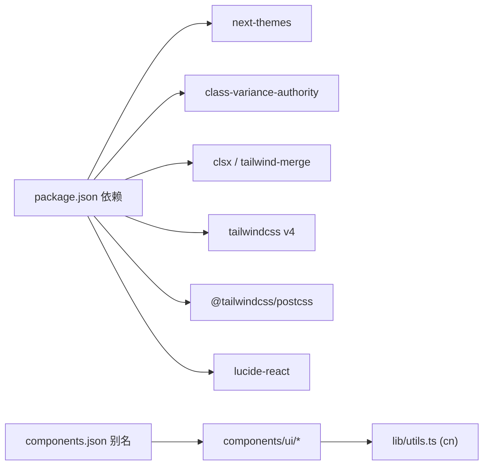

# 组件定制与扩展

<cite>
**本文引用的文件**   
- [components.json](file://components.json)
- [app/globals.css](file://app/globals.css)
- [postcss.config.mjs](file://postcss.config.mjs)
- [components/theme/theme-provider.tsx](file://components/theme/theme-provider.tsx)
- [components/theme/theme-toggle.tsx](file://components/theme/theme-toggle.tsx)
- [components/ui/button.tsx](file://components/ui/button.tsx)
- [components/ui/card.tsx](file://components/ui/card.tsx)
- [components/ui/badge.tsx](file://components/ui/badge.tsx)
- [components/ui/input.tsx](file://components/ui/input.tsx)
- [components/ui/dialog.tsx](file://components/ui/dialog.tsx)
- [lib/utils.ts](file://lib/utils.ts)
- [package.json](file://package.json)
</cite>

## 目录
1. [简介](#简介)
2. [项目结构](#项目结构)
3. [核心组件](#核心组件)
4. [架构总览](#架构总览)
5. [详细组件分析](#详细组件分析)
6. [依赖关系分析](#依赖关系分析)
7. [性能考量](#性能考量)
8. [故障排查指南](#故障排查指南)
9. [结论](#结论)
10. [附录](#附录)

## 简介
本指南面向希望在 shadcn/ui 基础上进行样式、主题与外观定制的开发者，提供从 CSS 变量配置、Tailwind CSS 集成、主题切换实现到组件样式覆盖技巧的完整路径。同时给出可复用的自定义组件最佳实践，涵盖响应式适配、深色模式支持与品牌化定制方案，帮助构建一致且可扩展的 UI 系统。

## 项目结构
本项目采用 Next.js + Tailwind CSS v4 + shadcn/ui（基于 @base-ui/react）的组合：
- 全局样式与主题变量集中在 app/globals.css，使用 @theme inline 将 CSS 变量映射为 Tailwind 设计令牌。
- shadcn/ui 组件位于 components/ui，通过 class-variance-authority 管理变体，结合 cn 工具函数合并类名。
- 主题状态由 next-themes 驱动，根布局注入 ThemeProvider，ThemeToggle 负责切换并触发 View Transition 动画。
- PostCSS 仅启用 @tailwindcss/postcss，配合 Tailwind v4 的按需编译与 CSS 变量体系。

图表来源
- [app/layout.tsx:103-113](file://app/layout.tsx#L103-L113)
- [app/globals.css:10-53](file://app/globals.css#L10-L53)
- [components/theme/theme-provider.tsx:6-11](file://components/theme/theme-provider.tsx#L6-L11)
- [components/theme/theme-toggle.tsx:44-86](file://components/theme/theme-toggle.tsx#L44-L86)
- [components/ui/button.tsx:1-61](file://components/ui/button.tsx#L1-L61)
- [lib/utils.ts:4-6](file://lib/utils.ts#L4-L6)

章节来源
- [components.json:1-26](file://components.json#L1-L26)
- [postcss.config.mjs:1-8](file://postcss.config.mjs#L1-L8)
- [package.json:13-34](file://package.json#L13-L34)

## 核心组件
- 按钮 Button：使用 cva 定义 variant 与 size 变体，默认使用 primary/secondary/ghost/destructive/link 等语义色，支持 focus-visible 与 aria-invalid 状态。
- 卡片 Card：包含 Header/Title/Description/Content/Footer 子块，统一圆角、间距与尺寸控制，适合内容聚合展示。
- 徽章 Badge：轻量标签，支持多种语义变体，常用于分类或状态标识。
- 输入 Input：基础表单控件，遵循焦点环与禁用态规范，兼容暗色背景。
- 对话框 Dialog：基于 Portal 的弹出层，含 Overlay/Content/Header/Footer/Title/Description 等组合，支持关闭按钮与动画。

章节来源
- [components/ui/button.tsx:8-43](file://components/ui/button.tsx#L8-L43)
- [components/ui/card.tsx:5-21](file://components/ui/card.tsx#L5-L21)
- [components/ui/badge.tsx:7-28](file://components/ui/badge.tsx#L7-L28)
- [components/ui/input.tsx:6-18](file://components/ui/input.tsx#L6-L18)
- [components/ui/dialog.tsx:42-81](file://components/ui/dialog.tsx#L42-L81)

## 架构总览
主题与样式在运行时通过 CSS 变量与 Tailwind 令牌联动，next-themes 维护当前主题状态，ThemeToggle 更新 DOM 类名并触发 View Transition 动画。

图表来源
- [components/theme/theme-toggle.tsx:44-86](file://components/theme/theme-toggle.tsx#L44-L86)
- [app/globals.css:147-201](file://app/globals.css#L147-L201)
- [components/theme/theme-provider.tsx:6-11](file://components/theme/theme-provider.tsx#L6-L11)

## 详细组件分析

### 主题系统与 CSS 变量
- 设计令牌映射：通过 @theme inline 将 --color-*、--radius-*、--font-* 等 CSS 变量暴露为 Tailwind 令牌，便于在组件中直接使用如 bg-primary、rounded-lg 等类。
- 明暗主题：:root 与 .dark 两套变量集，覆盖背景、前景、主色、强调、边框、阴影、图表色、侧边栏等。
- 过渡与动效：.theme-transitioning 与 ::view-transition-* 配合，实现平滑的主题切换；尊重 prefers-reduced-motion。
- 滚动条与代码块：自定义滚动条样式与代码高亮双主题变量，确保可读性与一致性。

章节来源
- [app/globals.css:10-53](file://app/globals.css#L10-L53)
- [app/globals.css:55-124](file://app/globals.css#L55-L124)
- [app/globals.css:147-201](file://app/globals.css#L147-L201)
- [app/globals.css:203-257](file://app/globals.css#L203-L257)
- [app/globals.css:376-450](file://app/globals.css#L376-L450)

### Tailwind CSS 集成与配置
- PostCSS 插件：仅启用 @tailwindcss/postcss，利用 Tailwind v4 的 CSS-first 配置方式。
- shadcn 配置：components.json 指定 tailwind.css 入口、baseColor、cssVariables 开关与别名，便于 CLI 生成与引用。
- 字体与排版：引入多套字体并通过 --font-* 变量注入 Tailwind 令牌，标题与正文分别使用 serif/sans/mono。

章节来源
- [postcss.config.mjs:1-8](file://postcss.config.mjs#L1-L8)
- [components.json:6-12](file://components.json#L6-L12)
- [components.json:15-21](file://components.json#L15-L21)
- [app/globals.css:1-6](file://app/globals.css#L1-L6)
- [app/globals.css:13-16](file://app/globals.css#L13-L16)

### 主题切换实现
- 提供者：ThemeProvider 包裹应用，透传 next-themes 属性。
- 切换器：ThemeToggle 根据系统偏好与用户选择，动态设置 documentElement 的 light/dark/system 类名，并调用 setTheme 持久化。
- 动效：计算右上角作为圆形展开中心，设置 CSS 变量供 keyframes 使用；在不支持 ViewTransition 时回退到 CSS transition。

章节来源
- [components/theme/theme-provider.tsx:6-11](file://components/theme/theme-provider.tsx#L6-L11)
- [components/theme/theme-toggle.tsx:24-31](file://components/theme/theme-toggle.tsx#L24-L31)
- [components/theme/theme-toggle.tsx:33-42](file://components/theme/theme-toggle.tsx#L33-L42)
- [components/theme/theme-toggle.tsx:44-86](file://components/theme/theme-toggle.tsx#L44-L86)

### 组件样式覆盖与扩展技巧
- 使用 cva 管理变体：Button/Badge 通过 cva 声明 variant/size，新增变体只需在 variants 中追加规则，保持类型安全与文档化。
- 类名合并：所有组件均通过 cn 合并外部 className，避免冲突并保持优先级可控。
- 数据槽位：组件普遍使用 data-slot 标记，便于在父级或全局样式中精准定位子节点进行覆盖。
- 语义色与状态：优先使用 primary/secondary/muted/foreground 等语义色，以及 focus-visible/aria-invalid 等无障碍状态类。

章节来源
- [components/ui/button.tsx:8-43](file://components/ui/button.tsx#L8-L43)
- [components/ui/badge.tsx:7-28](file://components/ui/badge.tsx#L7-L28)
- [lib/utils.ts:4-6](file://lib/utils.ts#L4-L6)
- [components/ui/card.tsx:14-19](file://components/ui/card.tsx#L14-L19)
- [components/ui/dialog.tsx:55-58](file://components/ui/dialog.tsx#L55-L58)

### 创建可复用自定义组件的最佳实践
- 以原子化类名为主：尽量使用 Tailwind 语义类与 CSS 变量，减少内联样式。
- 封装变体：对常见形态（大小、颜色、形状）用 cva 抽象，对外暴露 props 而非直接写死样式。
- 插槽与组合：参考 Card/Dialog 的子组件拆分，提升组合能力与可测试性。
- 无障碍与可聚焦：确保键盘可达、焦点可见、ARIA 属性正确。
- 主题兼容：所有颜色与尺寸都应读取 CSS 变量，避免硬编码。

章节来源
- [components/ui/card.tsx:23-93](file://components/ui/card.tsx#L23-L93)
- [components/ui/dialog.tsx:83-147](file://components/ui/dialog.tsx#L83-L147)

### 响应式设计适配
- 断点策略：广泛使用 md: 等断点修饰符，保证移动端紧凑、桌面端舒展。
- 容器查询：CardHeader 使用 @container 实现更细粒度的自适应布局。
- 文本与行高：prose 系列样式针对段落、列表、表格做了移动端友好的字号与行高调整。

章节来源
- [components/ui/card.tsx:27-33](file://components/ui/card.tsx#L27-L33)
- [app/globals.css:313-336](file://app/globals.css#L313-L336)
- [app/globals.css:500-551](file://app/globals.css#L500-L551)

### 深色模式支持
- 变量分层：:root 与 .dark 两套变量，覆盖所有关键视觉维度。
- 组件适配：Input 等组件显式处理 dark:bg-input/30 等暗态背景，确保对比度。
- 代码高亮：通过 --code-bg/--code-text 与 Shiki 的双主题变量，保障代码块在暗色下的可读性。

章节来源
- [app/globals.css:91-124](file://app/globals.css#L91-L124)
- [components/ui/input.tsx:11-16](file://components/ui/input.tsx#L11-L16)
- [app/globals.css:380-390](file://app/globals.css#L380-L390)
- [app/globals.css:411-421](file://app/globals.css#L411-L421)

### 品牌化定制方案
- 主色与强调色：修改 --primary 与 --accent 即可快速改变全站强调风格。
- 圆角与阴影：调整 --radius 与相关 shadow 变量，统一卡片、按钮、弹窗的视觉语言。
- 字体家族：通过 --font-sans/--font-serif/--font-mono 替换品牌字体，保持层级清晰。
- 渐变与玻璃效果：利用 gradient-bg、glass 等工具类，打造品牌化的 Hero 与悬浮元素。

章节来源
- [app/globals.css:55-89](file://app/globals.css#L55-L89)
- [app/globals.css:260-298](file://app/globals.css#L260-L298)
- [app/globals.css:13-16](file://app/globals.css#L13-L16)

## 依赖关系分析
- 运行时依赖：next-themes 管理主题状态，lucide-react 提供图标，class-variance-authority 管理变体，clsx/tailwind-merge 用于类名合并。
- 构建期依赖：tailwindcss v4 与 @tailwindcss/postcss 提供 CSS-first 的样式引擎。
- shadcn 生态：components.json 中的 aliases 指向本地组件与工具，便于 CLI 生成与引用。

图表来源
- [package.json:13-34](file://package.json#L13-L34)
- [components.json:15-21](file://components.json#L15-L21)
- [lib/utils.ts:4-6](file://lib/utils.ts#L4-L6)

章节来源
- [package.json:13-34](file://package.json#L13-L34)
- [components.json:1-26](file://components.json#L1-L26)

## 性能考量
- 主题切换动画：使用 View Transition 与 CSS 变量，避免 JS 频繁操作 DOM；在低性能设备上尊重 prefers-reduced-motion。
- 滚动监听节流：Header 使用 requestAnimationFrame 节流滚动事件，降低重排开销。
- 按需样式：Tailwind v4 自动剔除未使用样式，减小产物体积。

章节来源
- [components/theme/theme-toggle.tsx:51-57](file://components/theme/theme-toggle.tsx#L51-L57)
- [components/layout/header.tsx:33-47](file://components/layout/header.tsx#L33-L47)
- [postcss.config.mjs:1-8](file://postcss.config.mjs#L1-L8)

## 故障排查指南
- 主题不生效
  - 检查是否已包裹 ThemeProvider，并在根布局中引入全局样式。
  - 确认 documentElement 是否存在 light/dark/system 类名。
- 样式未覆盖
  - 确认组件是否接受 className 并通过 cn 合并。
  - 检查 Tailwind 是否加载了 shadcn 的 tailwind.css 与 @theme inline。
- 暗色下对比度异常
  - 检查对应 CSS 变量是否在 .dark 中正确定义。
  - 对于第三方高亮库，确认其双主题变量是否被正确注入。
- 动画卡顿或不可见
  - 检查 prefers-reduced-motion 设置与 ViewTransition 兼容性。
  - 确认过渡类 theme-transitioning 是否正确添加与清理。

章节来源
- [components/theme/theme-provider.tsx:6-11](file://components/theme/theme-provider.tsx#L6-L11)
- [components/theme/theme-toggle.tsx:24-31](file://components/theme/theme-toggle.tsx#L24-L31)
- [app/globals.css:147-201](file://app/globals.css#L147-L201)
- [components/ui/button.tsx:51-57](file://components/ui/button.tsx#L51-L57)

## 结论
通过将 CSS 变量、Tailwind 令牌与 shadcn/ui 组件解耦，本项目实现了高度可定制的主题与样式体系。借助 cva 与 cn 的组合，组件既保持了灵活性又具备强类型约束；配合 next-themes 与 View Transition，主题切换体验流畅自然。遵循本文的实践，可在不破坏既有设计系统的前提下，快速完成品牌化与功能扩展。

## 附录

### 常用定制清单
- 更换品牌主色与强调色：编辑 :root 与 .dark 中的 --primary 与 --accent。
- 调整圆角与半径：修改 --radius 及 --radius-* 系列变量。
- 替换字体：在 @theme inline 中更新 --font-sans/--font-serif/--font-mono。
- 新增组件变体：在对应组件的 cva 中追加 variant/size 规则，并在 props 中暴露。
- 覆盖第三方样式：使用 data-slot 与 Tailwind 作用域类精准命中目标节点。

章节来源
- [app/globals.css:55-89](file://app/globals.css#L55-L89)
- [app/globals.css:10-53](file://app/globals.css#L10-L53)
- [components/ui/button.tsx:8-43](file://components/ui/button.tsx#L8-L43)
- [components/ui/badge.tsx:7-28](file://components/ui/badge.tsx#L7-L28)