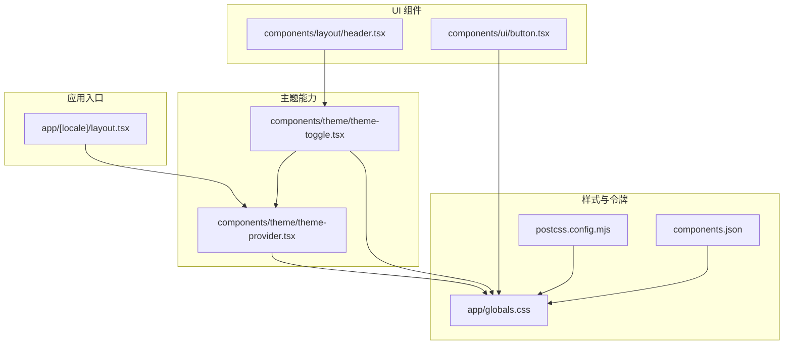
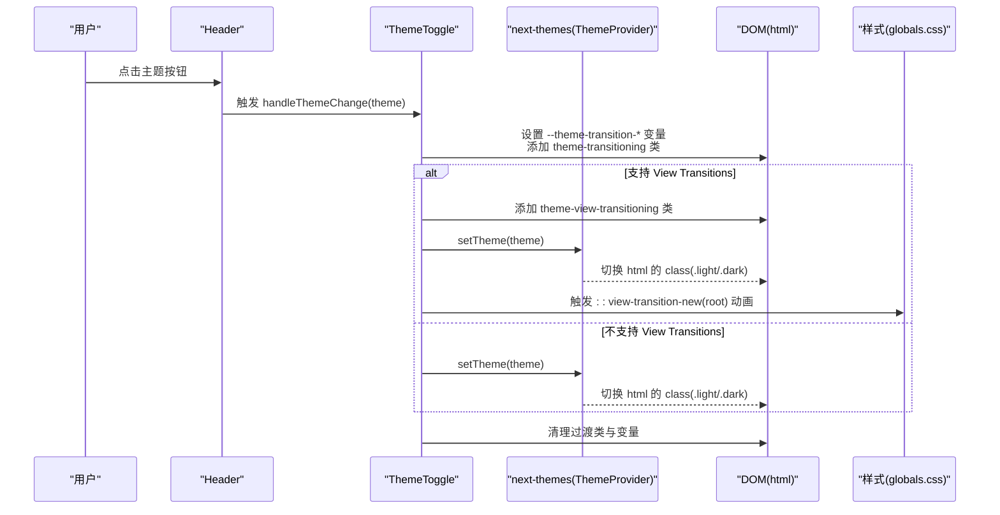
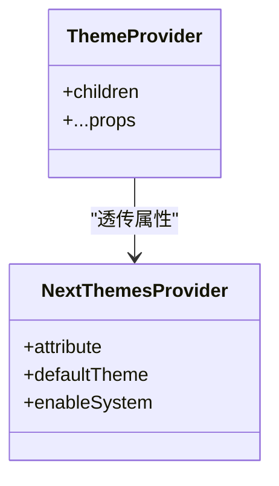
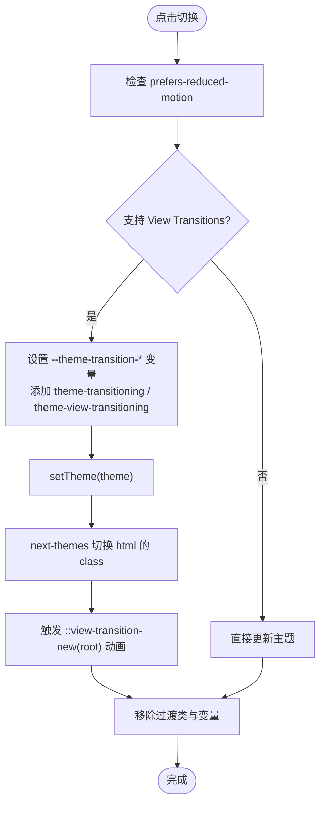
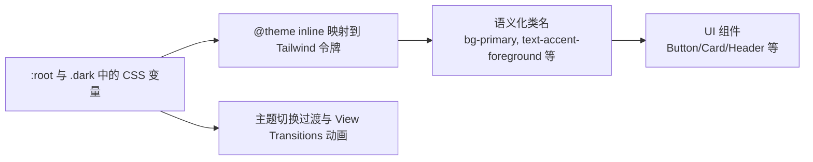
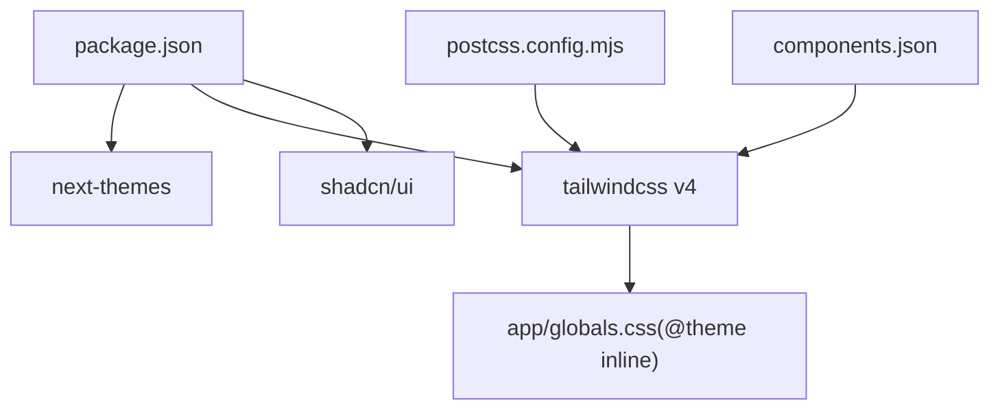

# 主题系统

<cite>
**本文引用的文件**   
- [components/theme/theme-provider.tsx](file://components/theme/theme-provider.tsx)
- [components/theme/theme-toggle.tsx](file://components/theme/theme-toggle.tsx)
- [app/[locale]/layout.tsx](file://app/[locale]/layout.tsx)
- [app/globals.css](file://app/globals.css)
- [postcss.config.mjs](file://postcss.config.mjs)
- [components.json](file://components.json)
- [package.json](file://package.json)
- [components/ui/button.tsx](file://components/ui/button.tsx)
- [components/layout/header.tsx](file://components/layout/header.tsx)
- [messages/zh.json](file://messages/zh.json)
- [messages/en.json](file://messages/en.json)
</cite>

## 目录
1. [简介](#简介)
2. [项目结构](#项目结构)
3. [核心组件](#核心组件)
4. [架构总览](#架构总览)
5. [详细组件分析](#详细组件分析)
6. [依赖关系分析](#依赖关系分析)
7. [性能考量](#性能考量)
8. [故障排查指南](#故障排查指南)
9. [结论](#结论)
10. [附录：定制与最佳实践](#附录定制与最佳实践)

## 简介
本主题系统基于 next-themes 与 Tailwind CSS v4，通过“在根元素上切换 class”的方式实现明暗主题。项目采用 OKLCH 色彩空间定义设计令牌（Design Tokens），并通过 CSS 变量将主题色注入到 Tailwind 的 @theme inline 中，从而让所有使用语义化颜色类的组件自动适配明暗模式。主题切换支持三种模式：浅色、深色、跟随系统；同时提供平滑的过渡动画与 View Transitions API 的圆形展开效果。

## 项目结构
主题相关的关键位置如下：
- 客户端主题提供者：封装 next-themes 的 ThemeProvider
- 主题切换器：下拉菜单选择 light/dark/system，并驱动 DOM class 与动画
- 全局样式：定义 CSS 变量、Tailwind 映射、过渡动画、滚动条与代码块样式等
- 布局层：在国际化布局中包裹 ThemeProvider，设置默认主题为 system
- UI 组件：广泛使用语义化颜色类（如 bg-primary、text-muted-foreground）以适配主题
- 构建配置：PostCSS 使用 Tailwind v4 插件，shadcn/ui 启用 cssVariables

图表来源
- [app/[locale]/layout.tsx:48-52](file://app/[locale]/layout.tsx#L48-L52)
- [components/theme/theme-provider.tsx:1-11](file://components/theme/theme-provider.tsx#L1-L11)
- [components/theme/theme-toggle.tsx:1-115](file://components/theme/theme-toggle.tsx#L1-L115)
- [app/globals.css:1-124](file://app/globals.css#L1-L124)
- [postcss.config.mjs:1-8](file://postcss.config.mjs#L1-L8)
- [components.json:1-26](file://components.json#L1-L26)
- [components/ui/button.tsx:1-61](file://components/ui/button.tsx#L1-L61)
- [components/layout/header.tsx:1-270](file://components/layout/header.tsx#L1-L270)

章节来源
- [app/[locale]/layout.tsx:48-52](file://app/[locale]/layout.tsx#L48-L52)
- [components/theme/theme-provider.tsx:1-11](file://components/theme/theme-provider.tsx#L1-L11)
- [components/theme/theme-toggle.tsx:1-115](file://components/theme/theme-toggle.tsx#L1-L115)
- [app/globals.css:1-124](file://app/globals.css#L1-L124)
- [postcss.config.mjs:1-8](file://postcss.config.mjs#L1-L8)
- [components.json:1-26](file://components.json#L1-L26)
- [components/ui/button.tsx:1-61](file://components/ui/button.tsx#L1-L61)
- [components/layout/header.tsx:1-270](file://components/layout/header.tsx#L1-L270)

## 核心组件
- 主题提供者（ThemeProvider）
  - 职责：对 next-themes 的 ThemeProvider 进行轻量封装，透传属性（如 attribute、defaultTheme、enableSystem）。
  - 关键点：attribute="class" 表示通过给 <html> 添加或移除 class 来切换主题。
- 主题切换器（ThemeToggle）
  - 职责：提供下拉菜单，支持 light/dark/system 三种模式；根据用户偏好决定是否启用 View Transitions 动画；更新 root 的 class 与 colorScheme；调用 setTheme 持久化主题。
  - 关键点：计算右上角为起点的圆形展开坐标，写入 CSS 自定义属性供动画使用；尊重 prefers-reduced-motion。
- 全局样式（globals.css）
  - 职责：定义 :root 与 .dark 两套 CSS 变量；通过 @theme inline 将 CSS 变量映射到 Tailwind 的设计令牌；定义主题切换过渡与 View Transition 动画；提供滚动条、代码块、Prose 等样式。
  - 关键点：使用 OKLCH 色彩空间，保证明暗对比一致性与可访问性。

章节来源
- [components/theme/theme-provider.tsx:1-11](file://components/theme/theme-provider.tsx#L1-L11)
- [components/theme/theme-toggle.tsx:1-115](file://components/theme/theme-toggle.tsx#L1-L115)
- [app/globals.css:1-201](file://app/globals.css#L1-L201)

## 架构总览
主题系统的运行流程：
- 初始化：在国际化布局中包裹 ThemeProvider，设置默认主题为 system，并启用系统主题检测。
- 渲染：Tailwind 通过 @theme inline 读取 CSS 变量，生成语义化颜色类（如 bg-primary、text-accent-foreground）。
- 切换：用户在 Header 中点击主题切换器，ThemeToggle 计算动画参数，必要时开启 View Transitions，随后调用 setTheme 并更新 DOM class。
- 持久化：next-themes 负责将主题保存到本地存储（由库内部实现），下次加载时恢复。

图表来源
- [components/layout/header.tsx:131-134](file://components/layout/header.tsx#L131-L134)
- [components/theme/theme-toggle.tsx:44-86](file://components/theme/theme-toggle.tsx#L44-L86)
- [app/globals.css:147-201](file://app/globals.css#L147-L201)
- [app/[locale]/layout.tsx:48-52](file://app/[locale]/layout.tsx#L48-L52)

## 详细组件分析

### 主题提供者（ThemeProvider）
- 作用：作为 next-themes 的包装，统一暴露属性，便于在布局层集中配置。
- 关键配置：
  - attribute="class"：通过 class 切换主题
  - defaultTheme="system"：默认跟随系统
  - enableSystem：允许读取系统偏好
- 集成点：在 app/[locale]/layout.tsx 中包裹整个应用。

图表来源
- [components/theme/theme-provider.tsx:1-11](file://components/theme/theme-provider.tsx#L1-L11)
- [app/[locale]/layout.tsx:48-52](file://app/[locale]/layout.tsx#L48-L52)

章节来源
- [components/theme/theme-provider.tsx:1-11](file://components/theme/theme-provider.tsx#L1-L11)
- [app/[locale]/layout.tsx:48-52](file://app/[locale]/layout.tsx#L48-L52)

### 主题切换器（ThemeToggle）
- 功能要点：
  - 解析系统主题：当选择 system 时，依据 prefers-color-scheme 决定实际主题。
  - 动画准备：计算右上角为圆心的半径与坐标，写入 CSS 变量供动画使用。
  - 降级策略：若浏览器不支持 View Transitions 或用户偏好减少动画，则回退到普通 transition。
  - 状态同步：调用 setTheme 后，next-themes 会更新 html 的 class，从而触发 CSS 变量变化。
- 交互细节：
  - 下拉菜单项分别对应 light/dark/system。
  - 无障碍文本来自 i18n 的 theme.switch。

图表来源
- [components/theme/theme-toggle.tsx:20-86](file://components/theme/theme-toggle.tsx#L20-L86)
- [app/globals.css:147-201](file://app/globals.css#L147-L201)

章节来源
- [components/theme/theme-toggle.tsx:1-115](file://components/theme/theme-toggle.tsx#L1-L115)
- [messages/zh.json:129-134](file://messages/zh.json#L129-L134)
- [messages/en.json:129-134](file://messages/en.json#L129-L134)

### 全局样式与令牌（globals.css）
- 设计令牌映射：
  - @theme inline 将 CSS 变量映射到 Tailwind 的颜色、字体、圆角等令牌，使组件可使用语义化类名。
- 主题变量：
  - :root 定义浅色主题变量（Polar Dawn）
  - .dark 定义深色主题变量（Polar Night）
- 过渡与动画：
  - 非减少动画模式下，为背景色、边框色、文字色等属性添加 640ms 过渡。
  - 使用 ::view-transition-group/new 实现从右上角出发的圆形展开动画。
- 其他样式：
  - 自定义滚动条、代码块容器、语法高亮（Shiki）双主题变量、Prose 排版、渐变背景与玻璃态等。

图表来源
- [app/globals.css:10-53](file://app/globals.css#L10-L53)
- [app/globals.css:55-124](file://app/globals.css#L55-L124)
- [app/globals.css:147-201](file://app/globals.css#L147-L201)

章节来源
- [app/globals.css:1-201](file://app/globals.css#L1-L201)

### UI 组件的主题适配
- 组件广泛使用语义化颜色类，例如：
  - Button 的 variant 与 size 变体通过 bg-primary、text-primary-foreground、border-border 等类名实现主题自适应。
  - Header 中的导航、图标、悬浮胶囊等也遵循同一套令牌。
- 优势：无需为每个组件编写明暗分支逻辑，只需维护一套 CSS 变量。

章节来源
- [components/ui/button.tsx:8-43](file://components/ui/button.tsx#L8-L43)
- [components/layout/header.tsx:50-150](file://components/layout/header.tsx#L50-L150)

## 依赖关系分析
- 运行时依赖
  - next-themes：提供主题状态管理与持久化
  - tailwindcss v4：通过 PostCSS 插件处理 @theme inline 与语义化类
  - shadcn/ui：启用 cssVariables，配合 Tailwind 令牌
- 构建配置
  - postcss.config.mjs 引入 @tailwindcss/postcss
  - components.json 指定 Tailwind CSS 路径与 cssVariables 开关

图表来源
- [package.json:13-34](file://package.json#L13-L34)
- [postcss.config.mjs:1-8](file://postcss.config.mjs#L1-L8)
- [components.json:6-12](file://components.json#L6-L12)
- [app/globals.css:10-53](file://app/globals.css#L10-L53)

章节来源
- [package.json:13-34](file://package.json#L13-L34)
- [postcss.config.mjs:1-8](file://postcss.config.mjs#L1-L8)
- [components.json:6-12](file://components.json#L6-L12)

## 性能考量
- 过渡时长控制
  - 主题切换过渡约 640ms，View Transitions 动画约 780ms，避免过长导致卡顿。
- 减少动画
  - 尊重 prefers-reduced-motion，在不支持或用户偏好减少动画时禁用过渡与 View Transitions。
- 变量与类名
  - 使用 CSS 变量与 Tailwind 令牌，避免大量条件分支与重复样式，降低重排与重绘成本。
- 首屏体验
  - 默认主题设置为 system，减少首次闪烁；next-themes 会在客户端快速恢复上次主题。

[本节为通用指导，不直接分析具体文件]

## 故障排查指南
- 主题未生效
  - 确认布局层已包裹 ThemeProvider，且 attribute="class" 正确设置。
  - 检查是否引入了 globals.css，确保 :root 与 .dark 变量存在。
- 切换无动画
  - 检查浏览器是否支持 View Transitions；若不支持，应回退到 CSS transition。
  - 检查 prefers-reduced-motion 是否被启用。
- 颜色不一致
  - 确认组件使用的是语义化类名（如 bg-primary），而非硬编码颜色值。
  - 检查 Tailwind 的 @theme inline 是否正确映射了 CSS 变量。
- 移动端溢出
  - 注意 body 使用 overflow-x: clip 而非 hidden，以避免破坏 sticky 定位。

章节来源
- [app/[locale]/layout.tsx:48-52](file://app/[locale]/layout.tsx#L48-L52)
- [app/globals.css:126-145](file://app/globals.css#L126-L145)
- [app/globals.css:147-192](file://app/globals.css#L147-L192)

## 结论
本项目通过 next-themes 与 Tailwind CSS v4 的组合，实现了稳定、可扩展的明暗主题系统。以 CSS 变量为核心的设计令牌体系，使得主题切换成本低、一致性高，并提供了流畅的视觉过渡。开发者只需关注语义化类名与变量定义，即可快速扩展新的主题风格。

[本节为总结，不直接分析具体文件]

## 附录：定制与最佳实践

### 主题配置选项
- 在布局层配置 ThemeProvider：
  - attribute="class"：通过 class 切换主题
  - defaultTheme="system"：默认跟随系统
  - enableSystem：允许读取系统偏好
- 参考路径
  - [app/[locale]/layout.tsx:48-52](file://app/[locale]/layout.tsx#L48-L52)

章节来源
- [app/[locale]/layout.tsx:48-52](file://app/[locale]/layout.tsx#L48-L52)

### 颜色系统定制
- 修改主题变量
  - 在 :root 与 .dark 下调整 OKLCH 值，保持明度与饱和度平衡，确保对比度满足可访问性要求。
- 新增令牌
  - 在 @theme inline 中增加新的 CSS 变量映射，以便在组件中使用新的语义化类名。
- 参考路径
  - [app/globals.css:55-124](file://app/globals.css#L55-L124)
  - [app/globals.css:10-53](file://app/globals.css#L10-L53)

章节来源
- [app/globals.css:55-124](file://app/globals.css#L55-L124)
- [app/globals.css:10-53](file://app/globals.css#L10-L53)

### 组件主题适配
- 使用语义化类名
  - 优先使用 bg-primary、text-accent-foreground、border-border 等类名，避免硬编码颜色。
- 示例参考
  - [components/ui/button.tsx:8-43](file://components/ui/button.tsx#L8-L43)
  - [components/layout/header.tsx:50-150](file://components/layout/header.tsx#L50-L150)

章节来源
- [components/ui/button.tsx:8-43](file://components/ui/button.tsx#L8-L43)
- [components/layout/header.tsx:50-150](file://components/layout/header.tsx#L50-L150)

### 创建自定义主题的最佳实践
- 保持 OKLCH 色彩空间的一致性，确保明暗主题具有相近的感知亮度与对比度。
- 为新主题提供完整的变量集（背景、前景、主色、强调色、边框、阴影等），避免遗漏导致样式异常。
- 在 @theme inline 中集中映射，便于后续维护与扩展。
- 利用 View Transitions 提升切换体验，但务必考虑降级与减少动画场景。

[本节为通用指导，不直接分析具体文件]

### 性能优化建议
- 合理设置过渡时长，避免影响交互响应。
- 仅在必要时启用 View Transitions，并在不支持时优雅降级。
- 使用 CSS 变量与 Tailwind 令牌，减少重复样式与条件判断。
- 在移动端测试小视口下的布局与滚动行为，避免意外溢出。

[本节为通用指导，不直接分析具体文件]