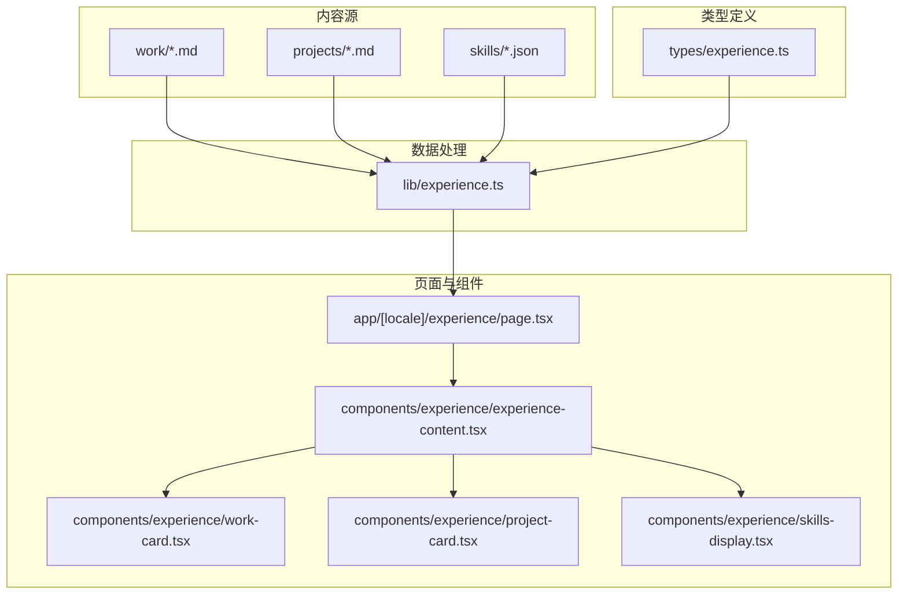
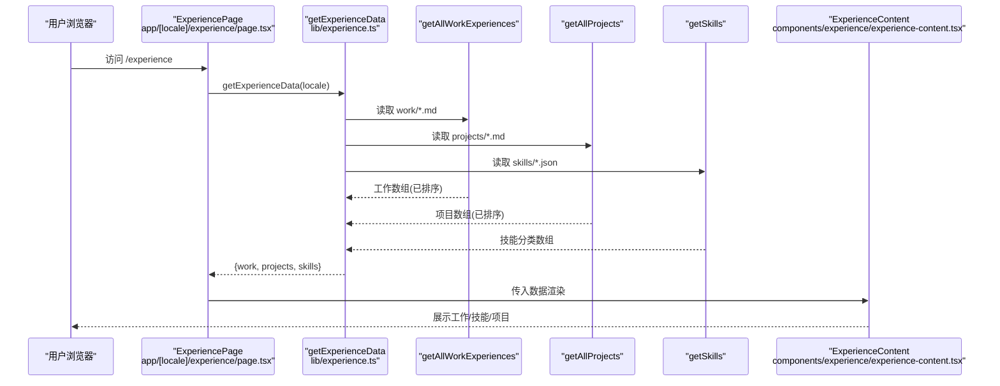
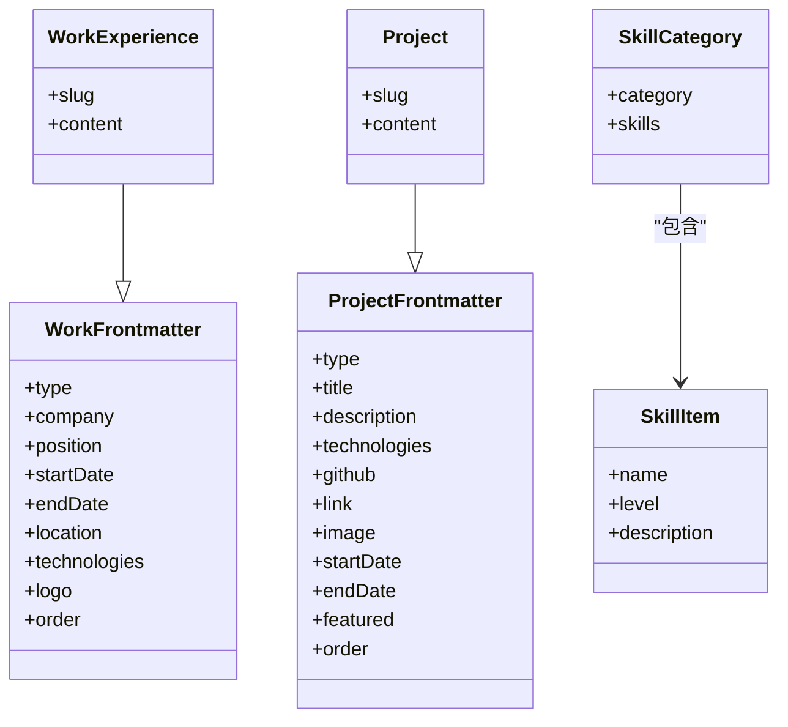
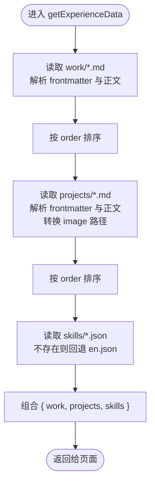
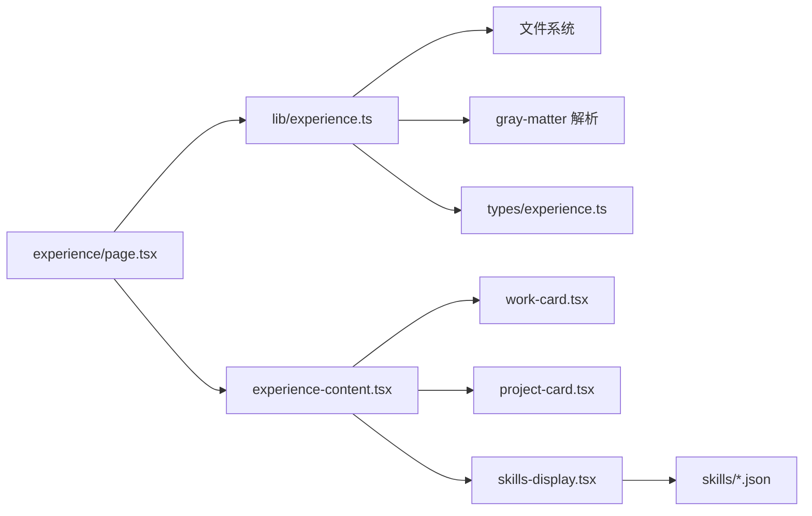

# 个人经历管理

<cite>
**本文引用的文件**
- [lib/experience.ts](file://lib/experience.ts)
- [types/experience.ts](file://types/experience.ts)
- [components/experience/experience-content.tsx](file://components/experience/experience-content.tsx)
- [components/experience/work-card.tsx](file://components/experience/work-card.tsx)
- [components/experience/project-card.tsx](file://components/experience/project-card.tsx)
- [components/experience/skills-display.tsx](file://components/experience/skills-display.tsx)
- [app/[locale]/experience/page.tsx](file://app/[locale]/experience/page.tsx)
- [content/experience/skills/zh.json](file://content/experience/skills/zh.json)
- [content/experience/skills/en.json](file://content/experience/skills/en.json)
</cite>

## 目录
1. [简介](#简介)
2. [项目结构](#项目结构)
3. [核心组件](#核心组件)
4. [架构总览](#架构总览)
5. [详细组件分析](#详细组件分析)
6. [依赖关系分析](#依赖关系分析)
7. [性能考虑](#性能考虑)
8. [故障排查指南](#故障排查指南)
9. [结论](#结论)
10. [附录](#附录)

## 简介
本文件面向网站维护者与开发者，系统化说明“个人经历管理”模块的数据结构、数据处理逻辑与渲染机制。重点覆盖：
- 工作经历、项目展示、技能列表的数据模型与管理方式
- experience.ts 中的数据处理流程（读取 Markdown 与 JSON、排序、回退策略等）
- 工作卡片与项目卡片的渲染机制
- 多语言工作经历内容的组织结构与更新流程
- 技能展示组件的配置方法与自定义选项
- 简历页面的数据绑定与动态生成机制
- 个人信息维护与更新的实操指南

## 项目结构
该模块采用“内容即数据 + 类型约束 + 组件渲染”的分层设计：
- 数据层：Markdown 与 JSON 文件作为静态内容源
- 类型层：TypeScript 接口定义数据结构与字段约束
- 处理层：统一的数据读取与组合函数
- 表现层：页面与组件负责渲染与交互

图表来源
- [lib/experience.ts:1-147](file://lib/experience.ts#L1-L147)
- [types/experience.ts:1-48](file://types/experience.ts#L1-L48)
- [app/[locale]/experience/page.tsx:1-35](file://app/[locale]/experience/page.tsx#L1-L35)
- [components/experience/experience-content.tsx:1-106](file://components/experience/experience-content.tsx#L1-L106)
- [components/experience/work-card.tsx:1-69](file://components/experience/work-card.tsx#L1-L69)
- [components/experience/project-card.tsx:1-73](file://components/experience/project-card.tsx#L1-L73)
- [components/experience/skills-display.tsx:1-51](file://components/experience/skills-display.tsx#L1-L51)

章节来源
- [lib/experience.ts:1-147](file://lib/experience.ts#L1-L147)
- [types/experience.ts:1-48](file://types/experience.ts#L1-L48)
- [app/[locale]/experience/page.tsx:1-35](file://app/[locale]/experience/page.tsx#L1-L35)
- [components/experience/experience-content.tsx:1-106](file://components/experience/experience-content.tsx#L1-L106)
- [components/experience/work-card.tsx:1-69](file://components/experience/work-card.tsx#L1-L69)
- [components/experience/project-card.tsx:1-73](file://components/experience/project-card.tsx#L1-L73)
- [components/experience/skills-display.tsx:1-51](file://components/experience/skills-display.tsx#L1-L51)

## 核心组件
- 经验数据聚合器：提供按语言获取工作、项目、技能的统一入口，并组合为页面所需的数据对象
- 经验内容容器：根据当前激活的标签页渲染工作、技能或项目
- 工作卡片：展示职位、公司、时间、地点、技术栈与详情内容
- 项目卡片：展示标题、描述、图片、链接、技术栈与详情内容
- 技能展示：按分类渲染技能条与可选描述

章节来源
- [lib/experience.ts:141-147](file://lib/experience.ts#L141-L147)
- [components/experience/experience-content.tsx:20-103](file://components/experience/experience-content.tsx#L20-L103)
- [components/experience/work-card.tsx:15-69](file://components/experience/work-card.tsx#L15-L69)
- [components/experience/project-card.tsx:16-73](file://components/experience/project-card.tsx#L16-L73)
- [components/experience/skills-display.tsx:21-51](file://components/experience/skills-display.tsx#L21-L51)

## 架构总览
从页面到数据的调用链如下：

图表来源
- [app/[locale]/experience/page.tsx:25-34](file://app/[locale]/experience/page.tsx#L25-L34)
- [lib/experience.ts:141-147](file://lib/experience.ts#L141-L147)
- [lib/experience.ts:17-46](file://lib/experience.ts#L17-L46)
- [lib/experience.ts:71-98](file://lib/experience.ts#L71-L98)
- [lib/experience.ts:124-137](file://lib/experience.ts#L124-L137)
- [components/experience/experience-content.tsx:20-103](file://components/experience/experience-content.tsx#L20-L103)

## 详细组件分析

### 数据类型与前端映射
- 工作经历
  - 前置元数据字段：类型标识、公司、职位、开始日期、结束日期（空表示在职）、地点、技术栈、Logo、排序权重
  - 扩展字段：slug、content（Markdown 正文）
- 项目
  - 前置元数据字段：类型标识、标题、描述、技术栈、GitHub 链接、外部链接、封面图、起止时间、是否精选、排序权重
  - 扩展字段：slug、content（Markdown 正文），image 在加载时会被转换为资源路径
- 技能
  - 分类：category
  - 技能项：name、level（0-100）、description（可选）

图表来源
- [types/experience.ts:3-18](file://types/experience.ts#L3-L18)
- [types/experience.ts:20-37](file://types/experience.ts#L20-L37)
- [types/experience.ts:39-48](file://types/experience.ts#L39-L48)

章节来源
- [types/experience.ts:1-48](file://types/experience.ts#L1-L48)

### 数据处理逻辑（experience.ts）
- 工作条目
  - 扫描 content/experience/work/{locale} 下的 .md 文件
  - 解析 frontmatter 与正文，附加 slug 与 content
  - 按 order 升序排序
  - Windows CRLF→LF 规范化，避免部署后字节不一致问题
- 项目条目
  - 扫描 content/experience/projects/{locale} 下的 .md 文件
  - 解析 frontmatter 与正文，附加 slug、content，并将 image 转为资源路径
  - 按 order 升序排序
  - 支持筛选 featured 项目
- 技能列表
  - 读取 content/experience/skills/{locale}.json
  - 若目标语言不存在则回退至 en.json
- 组合接口
  - 返回 { work, projects, skills } 供页面直接使用

图表来源
- [lib/experience.ts:17-46](file://lib/experience.ts#L17-L46)
- [lib/experience.ts:71-98](file://lib/experience.ts#L71-L98)
- [lib/experience.ts:124-137](file://lib/experience.ts#L124-L137)
- [lib/experience.ts:141-147](file://lib/experience.ts#L141-L147)

章节来源
- [lib/experience.ts:1-147](file://lib/experience.ts#L1-L147)

### 工作卡片渲染机制（work-card.tsx）
- 输入：单个 WorkExperience 对象
- 显示要点
  - 标题：职位；副标题：公司
  - 时间范围：开始日期 - 结束日期（为空则显示“在职”）
  - 地点：可选
  - 详情：使用 Markdown 渲染
  - 技术栈：以标签形式展示
  - 动画延迟：基于 index 递增，形成交错入场效果

章节来源
- [components/experience/work-card.tsx:15-69](file://components/experience/work-card.tsx#L15-L69)

### 项目卡片渲染机制（project-card.tsx）
- 输入：单个 Project 对象
- 显示要点
  - 封面图：可选，悬停缩放动效
  - 标题与描述
  - 外链：GitHub 图标与外部链接图标
  - 详情：使用 Markdown 渲染
  - 技术栈：以标签形式展示
  - 动画延迟：基于 index 递增

章节来源
- [components/experience/project-card.tsx:16-73](file://components/experience/project-card.tsx#L16-L73)

### 技能展示组件（skills-display.tsx）
- 输入：SkillCategory[]
- 显示要点
  - 网格布局，每列一个分类卡片
  - 每个技能项显示名称、百分比进度条与可选描述
  - 动画延迟：基于 index 递增

章节来源
- [components/experience/skills-display.tsx:21-51](file://components/experience/skills-display.tsx#L21-L51)

### 经验内容容器（experience-content.tsx）
- 功能
  - 顶部标题与国际化文案
  - 三个标签页：工作、技能、项目
  - 根据 activeTab 切换渲染对应子组件
  - 空状态提示：当某类数据为空时展示占位信息与提示
- 数据流
  - 接收来自页面的 work、projects、skills
  - 将数据分别传递给 WorkCard、ProjectCard、SkillsDisplay

章节来源
- [components/experience/experience-content.tsx:20-103](file://components/experience/experience-content.tsx#L20-L103)

### 页面数据绑定与动态生成（experience page）
- 服务端渲染流程
  - 解析 locale 参数并设置请求语言
  - 调用 getExperienceData(locale) 获取三类数据
  - 将数据注入 ExperienceContent 进行渲染
- SEO 元信息
  - 通过 buildPageMetadata 构建标题与描述（来源于 i18n 命名空间）

章节来源
- [app/[locale]/experience/page.tsx:11-34](file://app/[locale]/experience/page.tsx#L11-L34)

## 依赖关系分析
- 页面依赖数据处理层
- 数据处理层依赖文件系统与 Markdown 解析库
- 组件依赖类型定义与 UI 基础组件
- 技能数据存在多语言 JSON 文件，具备回退策略

图表来源
- [app/[locale]/experience/page.tsx:25-34](file://app/[locale]/experience/page.tsx#L25-L34)
- [lib/experience.ts:1-147](file://lib/experience.ts#L1-L147)
- [components/experience/experience-content.tsx:20-103](file://components/experience/experience-content.tsx#L20-L103)
- [components/experience/skills-display.tsx:21-51](file://components/experience/skills-display.tsx#L21-L51)

章节来源
- [lib/experience.ts:1-147](file://lib/experience.ts#L1-L147)
- [app/[locale]/experience/page.tsx:1-35](file://app/[locale]/experience/page.tsx#L1-L35)
- [components/experience/experience-content.tsx:1-106](file://components/experience/experience-content.tsx#L1-L106)
- [components/experience/skills-display.tsx:1-51](file://components/experience/skills-display.tsx#L1-L51)

## 性能考虑
- 文件 I/O 与解析
  - 所有数据在构建期读取，适合静态站点；注意 Markdown 文件体积与数量对构建时间的影响
- 排序与过滤
  - 工作/项目均按 order 排序，建议合理设置以避免大规模重排
- 图片路径转换
  - 项目封面图在加载阶段转换为资源路径，确保静态资源可被正确引用
- 文本编码
  - 内置 CRLF→LF 规范化，避免跨平台部署导致的字节差异问题

[本节为通用指导，不直接分析具体文件]

## 故障排查指南
- 工作/项目内容为空
  - 检查对应语言目录下是否存在 .md 文件
  - 确认 frontmatter 中必填字段完整且 type 值正确
  - 确认 order 字段为数字，避免排序异常
- 技能未显示或显示英文
  - 检查 skills/{locale}.json 是否存在
  - 若缺失，系统会回退到 en.json；如需中文，请创建 zh.json
- 项目封面图不显示
  - 确认 frontmatter 中 image 字段指向的资源路径有效
  - 确认资源已被复制到 public 目录或通过 getAssetPath 转换
- 构建时报错或运行时异常
  - 关注 Windows 换行符问题，已在读取时自动规范化
  - 检查 Markdown 语法与 frontmatter 格式是否正确

章节来源
- [lib/experience.ts:17-46](file://lib/experience.ts#L17-L46)
- [lib/experience.ts:71-98](file://lib/experience.ts#L71-L98)
- [lib/experience.ts:124-137](file://lib/experience.ts#L124-L137)

## 结论
本模块通过清晰的数据分层与类型约束，实现了工作经历、项目展示与技能列表的可维护化与多语言支持。数据处理层集中负责文件读取、解析与组合，组件层专注渲染与交互，便于后续扩展与维护。

[本节为总结性内容，不直接分析具体文件]

## 附录

### 多语言内容与更新流程
- 工作内容
  - 新增/修改：在 content/experience/work/{locale} 下添加或编辑 .md 文件，确保 frontmatter 字段齐全
  - 排序：调整 order 字段控制展示顺序
  - 详情：使用 Markdown 编写详细内容
- 项目内容
  - 新增/修改：在 content/experience/projects/{locale} 下添加或编辑 .md 文件
  - 封面图：在 frontmatter 中配置 image，并确保资源路径有效
  - 精选标记：设置 featured 为 true 可在筛选中使用
- 技能内容
  - 新增/修改：在 content/experience/skills/{locale}.json 中维护分类与技能项
  - 回退策略：若目标语言文件缺失，将回退到 en.json
- 页面刷新
  - 由于数据在构建期读取，修改内容后需重新构建以生效

章节来源
- [lib/experience.ts:17-46](file://lib/experience.ts#L17-L46)
- [lib/experience.ts:71-98](file://lib/experience.ts#L71-L98)
- [lib/experience.ts:124-137](file://lib/experience.ts#L124-L137)
- [content/experience/skills/zh.json:1-102](file://content/experience/skills/zh.json#L1-L102)
- [content/experience/skills/en.json:1-102](file://content/experience/skills/en.json#L1-L102)

### 技能展示组件配置与自定义
- 数据结构
  - 分类：category
  - 技能项：name、level（0-100）、description（可选）
- 展示行为
  - 进度条宽度由 level 决定
  - 支持可选描述文本
- 自定义建议
  - 调整样式：通过 CSS 变量或主题配置修改进度条颜色与圆角
  - 布局：可按需调整网格列数与间距
  - 交互：可扩展点击展开详情或筛选特定分类

章节来源
- [components/experience/skills-display.tsx:21-51](file://components/experience/skills-display.tsx#L21-L51)
- [types/experience.ts:39-48](file://types/experience.ts#L39-L48)

### 简历页面数据绑定与动态生成
- 数据来源
  - 通过 getExperienceData(locale) 统一获取工作、项目、技能
- 绑定方式
  - 页面将数据直接注入 ExperienceContent 组件
  - 组件内部根据标签页状态渲染对应子组件
- 动态生成
  - 新增内容无需修改组件代码，只需更新对应内容文件并在构建时生效

章节来源
- [app/[locale]/experience/page.tsx:25-34](file://app/[locale]/experience/page.tsx#L25-L34)
- [components/experience/experience-content.tsx:20-103](file://components/experience/experience-content.tsx#L20-L103)