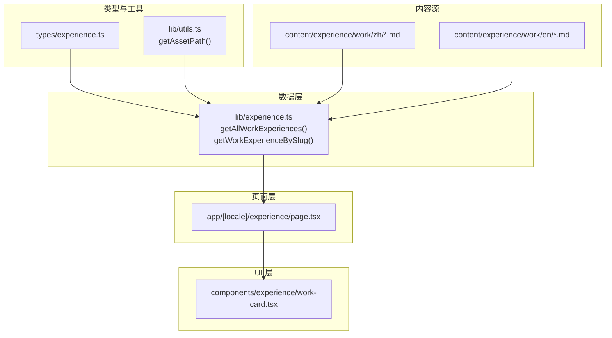
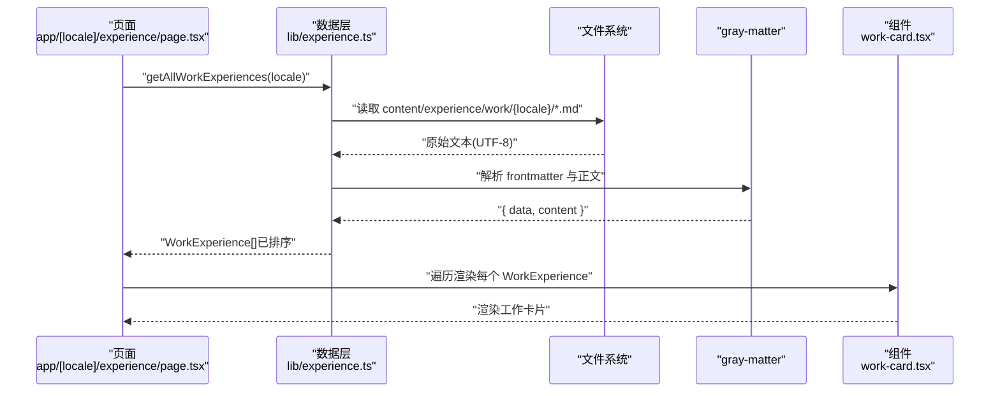
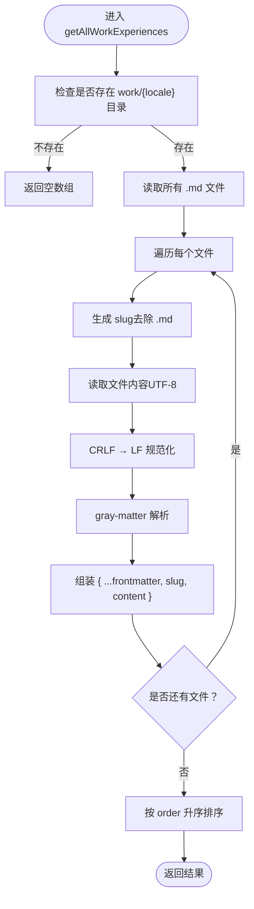
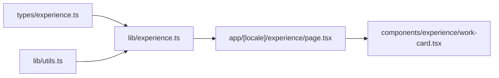

# 工作经历管理

<cite>
**本文引用的文件**
- [lib/experience.ts](file://lib/experience.ts)
- [types/experience.ts](file://types/experience.ts)
- [components/experience/work-card.tsx](file://components/experience/work-card.tsx)
- [app/[locale]/experience/page.tsx](file://app/[locale]/experience/page.tsx)
- [content/experience/work/zh/qunje_zh.md](file://content/experience/work/zh/qunje_zh.md)
- [content/experience/work/en/qunje_en.md](file://content/experience/work/en/qunje_en.md)
</cite>

## 目录
1. [简介](#简介)
2. [项目结构](#项目结构)
3. [核心组件](#核心组件)
4. [架构总览](#架构总览)
5. [详细组件分析](#详细组件分析)
6. [依赖关系分析](#依赖关系分析)
7. [性能考虑](#性能考虑)
8. [故障排查指南](#故障排查指南)
9. [结论](#结论)
10. [附录](#附录)

## 简介
本文件面向网站维护者，系统化说明“工作经历”模块的数据模型、数据读取与解析流程、多语言组织方式、内容编写规范以及工作卡片渲染机制。通过本文档，您可以快速理解并扩展该模块，安全地添加新的工作经历条目。

## 项目结构
工作经历相关代码与资源分布如下：
- 类型定义位于 types/experience.ts
- 数据读取与解析逻辑位于 lib/experience.ts
- 页面入口位于 app/[locale]/experience/page.tsx
- 工作卡片组件位于 components/experience/work-card.tsx
- 多语言 Markdown 内容位于 content/experience/work/{locale}/{slug}.md

图表来源
- [lib/experience.ts:1-98](file://lib/experience.ts#L1-L98)
- [types/experience.ts:1-48](file://types/experience.ts#L1-L48)
- [components/experience/work-card.tsx](file://components/experience/work-card.tsx)
- [app/[locale]/experience/page.tsx](file://app/[locale]/experience/page.tsx)

章节来源
- [lib/experience.ts:1-98](file://lib/experience.ts#L1-L98)
- [types/experience.ts:1-48](file://types/experience.ts#L1-L48)

## 核心组件
本节聚焦于数据结构定义与数据访问函数。

- 数据结构
  - WorkFrontmatter：工作经历的 frontmatter 元信息字段集合，包含公司、职位、起止时间、地点、技术栈、排序等。
  - WorkExperience：在 WorkFrontmatter 基础上增加 slug 与 content 字段，用于页面渲染。
- 数据访问函数
  - getAllWorkExperiences(locale)：按语言读取 work 目录下所有 .md 文件，解析 gray-matter，合并 frontmatter 与正文，返回按 order 升序排列的列表。
  - getWorkExperienceBySlug(slug, locale)：根据 slug 精确读取单条工作经历，失败时返回空值。

章节来源
- [types/experience.ts:1-48](file://types/experience.ts#L1-L48)
- [lib/experience.ts:17-46](file://lib/experience.ts#L17-L46)
- [lib/experience.ts:48-67](file://lib/experience.ts#L48-L67)

## 架构总览
从页面到数据再到 UI 的调用链如下：

图表来源
- [lib/experience.ts:17-46](file://lib/experience.ts#L17-L46)
- [lib/experience.ts:48-67](file://lib/experience.ts#L48-L67)
- [components/experience/work-card.tsx](file://components/experience/work-card.tsx)
- [app/[locale]/experience/page.tsx](file://app/[locale]/experience/page.tsx)

## 详细组件分析

### 数据结构定义
- WorkFrontmatter 字段说明
  - type: 固定为 "work"，用于区分内容类型
  - company: 公司名称
  - position: 职位名称
  - startDate: 开始日期（字符串）
  - endDate?: 结束日期（可选；为空表示仍在任）
  - location?: 工作地点（可选）
  - technologies?: 技术栈数组（可选）
  - logo?: Logo 路径（可选）
  - order: 排序权重（数值）
- WorkExperience 字段说明
  - 继承 WorkFrontmatter 全部字段
  - slug: 由文件名推导的唯一标识
  - content: gray-matter 解析后的正文内容（Markdown 字符串）

章节来源
- [types/experience.ts:3-18](file://types/experience.ts#L3-L18)

### 数据读取与解析逻辑
- getAllWorkExperiences(locale)
  - 定位目录：content/experience/work/{locale}
  - 若目录不存在则返回空数组
  - 读取所有 .md 文件，过滤非 Markdown 文件
  - 对每个文件：
    - 生成 slug（去除 .md 后缀）
    - 以 UTF-8 读取文件，并将 CRLF 统一为 LF，避免部署后字节差异导致运行时异常
    - 使用 gray-matter 解析 frontmatter 与正文
    - 将 data 展开为对象，附加 slug 与 content
  - 最终按 order 升序排序并返回
- getWorkExperienceBySlug(slug, locale)
  - 定位目录：content/experience/work/{locale}
  - 尝试读取 {slug}.md，失败则返回 null
  - 成功则同样进行 CRLF→LF 规范化与 gray-matter 解析，返回带 slug 与 content 的对象

图表来源
- [lib/experience.ts:17-46](file://lib/experience.ts#L17-L46)

章节来源
- [lib/experience.ts:17-46](file://lib/experience.ts#L17-L46)
- [lib/experience.ts:48-67](file://lib/experience.ts#L48-L67)

### 多语言支持与文件组织
- 目录约定
  - 中文：content/experience/work/zh/{slug}_zh.md
  - 英文：content/experience/work/en/{slug}_en.md
- 命名建议
  - 同一经历的中英文 slug 保持一致，便于路由与引用
  - 文件名后缀 _zh/_en 仅作为可读性增强，实际 slug 由文件名去 .md 得到
- 示例文件
  - 中文示例：[qunje_zh.md](file://content/experience/work/zh/qunje_zh.md)
  - 英文示例：[qunje_en.md](file://content/experience/work/en/qunje_en.md)

章节来源
- [content/experience/work/zh/qunje_zh.md](file://content/experience/work/zh/qunje_zh.md)
- [content/experience/work/en/qunje_en.md](file://content/experience/work/en/qunje_en.md)

### 工作卡片组件渲染机制与自定义
- 渲染流程
  - 页面获取 WorkExperience 列表后，逐项传入 work-card 组件
  - 组件负责展示 frontmatter 中的基本信息（如公司、职位、时间、地点、技术栈、Logo 等）
  - 正文 content 可通过 MDX 或 Markdown 渲染器进行渲染（具体实现取决于组件内部）
- 自定义方法
  - 如需调整展示样式或交互，可在 work-card.tsx 中扩展 props 或新增子组件
  - 若需接入外部图片资源，请确保路径正确并通过 getAssetPath 处理（如有需要）

章节来源
- [components/experience/work-card.tsx](file://components/experience/work-card.tsx)
- [lib/experience.ts:1-12](file://lib/experience.ts#L1-L12)

### 页面集成与调用
- 页面入口 app/[locale]/experience/page.tsx 负责：
  - 根据当前 locale 调用 getAllWorkExperiences
  - 将结果传递给工作卡片组件进行渲染
- 若需要按 slug 加载详情，可使用 getWorkExperienceBySlug

章节来源
- [app/[locale]/experience/page.tsx](file://app/[locale]/experience/page.tsx)
- [lib/experience.ts:17-46](file://lib/experience.ts#L17-L46)
- [lib/experience.ts:48-67](file://lib/experience.ts#L48-L67)

## 依赖关系分析
- 模块耦合
  - lib/experience.ts 依赖 fs、path、gray-matter 与 types/experience.ts
  - 页面层依赖 lib/experience.ts 提供的数据接口
  - UI 层依赖页面传入的 WorkExperience 数据
- 外部依赖
  - gray-matter：用于解析 Markdown 文件的 frontmatter 与正文
  - fs/path：用于本地文件系统访问与路径拼接

图表来源
- [lib/experience.ts:1-12](file://lib/experience.ts#L1-L12)
- [types/experience.ts:1-48](file://types/experience.ts#L1-L48)
- [components/experience/work-card.tsx](file://components/experience/work-card.tsx)
- [app/[locale]/experience/page.tsx](file://app/[locale]/experience/page.tsx)

章节来源
- [lib/experience.ts:1-12](file://lib/experience.ts#L1-L12)
- [types/experience.ts:1-48](file://types/experience.ts#L1-L48)

## 性能考虑
- 文件 I/O
  - getAllWorkExperiences 会同步读取多个 Markdown 文件，建议在构建期或静态生成阶段执行，避免请求时阻塞
- 文本规范化
  - 统一 CRLF→LF 可避免部署环境差异导致的运行时异常，代价是额外一次字符串替换，影响较小
- 排序
  - 基于 order 的排序开销极低，适合小型数据集
- 缓存策略
  - 若未来数据量增长，可考虑在构建期缓存解析结果或使用增量构建优化

## 故障排查指南
- 常见问题
  - 页面未显示任何工作经历：检查对应 locale 目录是否存在且包含 .md 文件
  - 某条记录缺失：确认 slug 与文件名一致，且文件未被误删或重命名
  - 排序异常：检查 frontmatter 中 order 字段是否为有效数字
  - 部署后出现运行时错误：确认文件换行符为 LF；构建脚本或编辑器配置应输出 LF
- 定位步骤
  - 打印 getAllWorkExperiences 返回的数组长度与每条记录的 slug
  - 使用 getWorkExperienceBySlug 单独验证目标文件是否能被正确解析
  - 检查 gray-matter 解析结果是否包含预期的 frontmatter 字段

章节来源
- [lib/experience.ts:17-46](file://lib/experience.ts#L17-L46)
- [lib/experience.ts:48-67](file://lib/experience.ts#L48-L67)

## 结论
本模块通过清晰的类型定义与简洁的数据读取逻辑，实现了多语言工作经历的标准化管理与渲染。遵循本文档的编写规范与最佳实践，可高效、稳定地扩展与维护工作经历内容。

## 附录

### 内容编写规范
- Frontmatter 必填项
  - type: "work"
  - company、position、startDate、order
- Frontmatter 可选项
  - endDate、location、technologies、logo
- 正文格式
  - 使用标准 Markdown 语法，支持标题、列表、链接、图片等
  - 建议分节描述职责、成果与技术要点，保持可读性与一致性
- 排序规则
  - 使用 order 控制展示顺序，数值越小越靠前

章节来源
- [types/experience.ts:3-18](file://types/experience.ts#L3-L18)

### 添加新工作经历的步骤
- 准备内容
  - 在 content/experience/work/{locale} 下创建新文件，命名为 {slug}_{lang}.md（例如 zh 为 qunje_zh.md，en 为 qunje_en.md）
  - 填写 frontmatter 必填字段与正文内容
- 校验与预览
  - 运行开发服务器，访问 /experience 页面查看效果
  - 如需单独调试，使用 getWorkExperienceBySlug 验证解析结果
- 提交与发布
  - 提交变更并确保 CI 构建成功
  - 若涉及图片资源，确认路径可用并通过 getAssetPath 处理（如需要）

章节来源
- [content/experience/work/zh/qunje_zh.md](file://content/experience/work/zh/qunje_zh.md)
- [content/experience/work/en/qunje_en.md](file://content/experience/work/en/qunje_en.md)
- [lib/experience.ts:17-46](file://lib/experience.ts#L17-L46)
- [lib/experience.ts:48-67](file://lib/experience.ts#L48-L67)