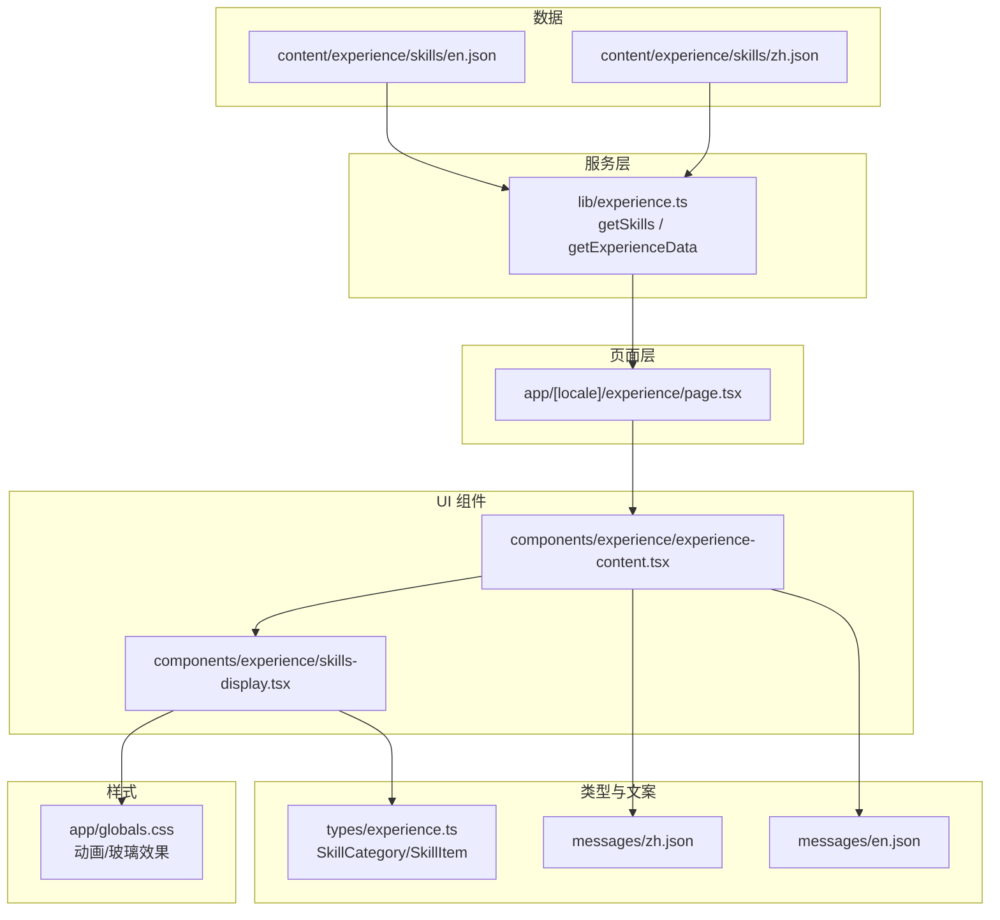
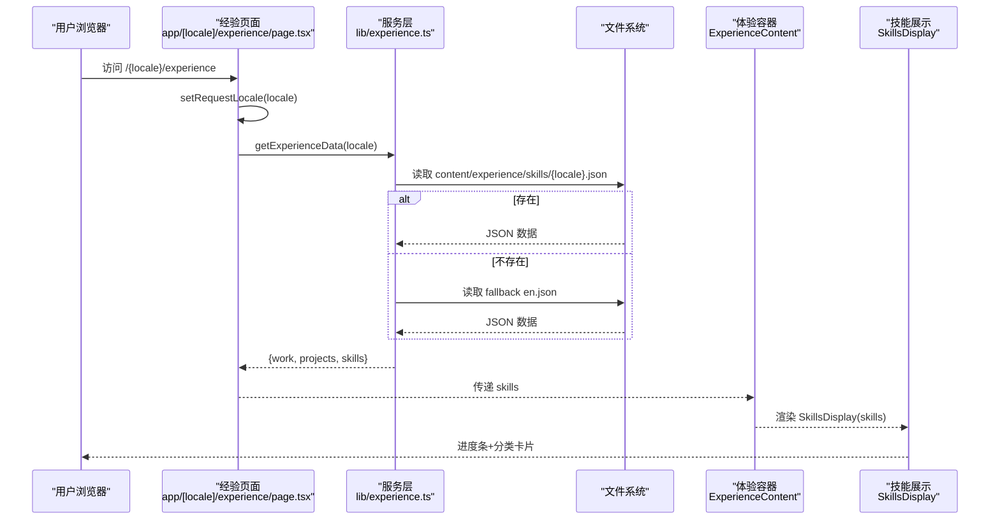
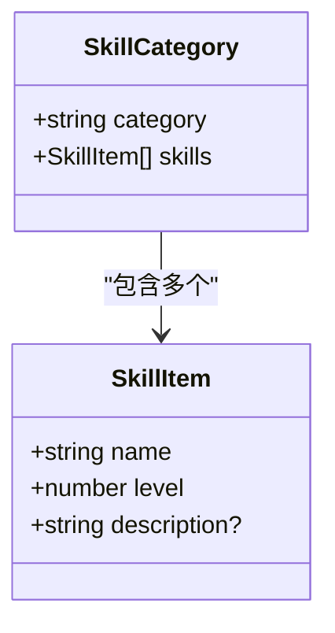
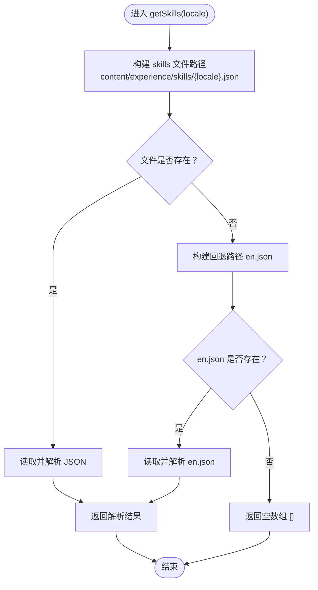
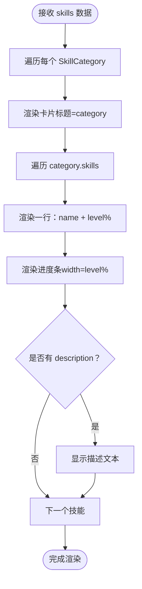
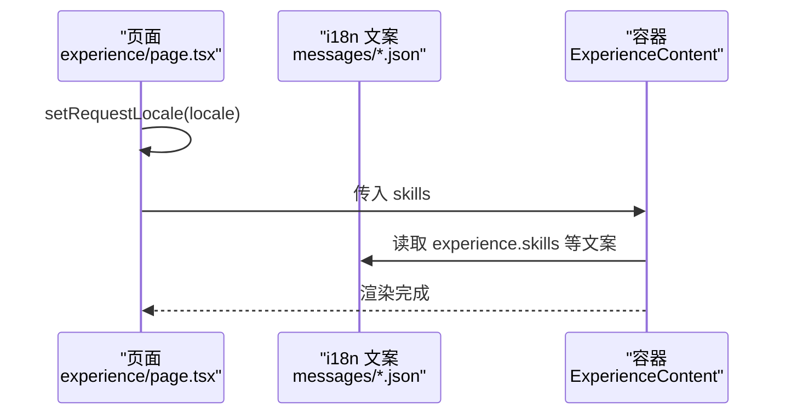
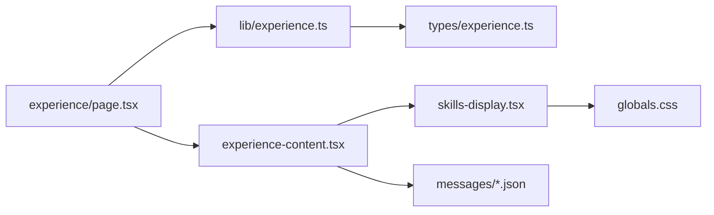

# 技能展示系统

<cite>
**本文引用的文件**   
- [experience.ts](file://lib/experience.ts)
- [experience.ts](file://types/experience.ts)
- [skills-display.tsx](file://components/experience/skills-display.tsx)
- [experience-content.tsx](file://components/experience/experience-content.tsx)
- [page.tsx](file://app/[locale]/experience/page.tsx)
- [en.json](file://content\experience\skills\en.json)
- [zh.json](file://content\experience\skills\zh.json)
- [zh.json](file://messages/zh.json)
- [en.json](file://messages/en.json)
- [globals.css](file://app/globals.css)
</cite>

## 目录
1. [简介](#简介)
2. [项目结构](#项目结构)
3. [核心组件](#核心组件)
4. [架构总览](#架构总览)
5. [详细组件分析](#详细组件分析)
6. [依赖分析](#依赖分析)
7. [性能考虑](#性能考虑)
8. [故障排查指南](#故障排查指南)
9. [结论](#结论)
10. [附录](#附录)

## 简介
本文件面向网站维护者，系统化说明“技能展示系统”的数据模型、数据加载与多语言回退机制、前端渲染逻辑、样式定制方式，以及中英文技能文件的同步更新流程与维护最佳实践。目标是让非技术背景读者也能快速理解并安全地维护技能信息。

## 项目结构
技能展示系统由“数据层（JSON）—服务层（读取与回退）—页面层（服务端组装）—UI 组件（客户端渲染）—样式（全局 CSS）”构成。关键位置如下：
- 数据源：content/experience/skills/{locale}.json
- 服务层：lib/experience.ts 中的 getSkills 与 getExperienceData
- 页面层：app/[locale]/experience/page.tsx
- UI 组件：components/experience/skills-display.tsx 与 components/experience/experience-content.tsx
- 类型定义：types/experience.ts
- 国际化文案：messages/{zh,en}.json
- 动画与玻璃效果：app/globals.css

图表来源
- [experience.ts:122-147](file://lib/experience.ts#L122-L147)
- [page.tsx:25-34](file://app/[locale]/experience/page.tsx#L25-L34)
- [experience-content.tsx:20-103](file://components/experience/experience-content.tsx#L20-L103)
- [skills-display.tsx:21-51](file://components/experience/skills-display.tsx#L21-L51)
- [experience.ts:39-48](file://types/experience.ts#L39-L48)
- [zh.json:103-118](file://messages/zh.json#L103-L118)
- [en.json:103-118](file://messages/en.json#L103-L118)
- [globals.css:600-632](file://app/globals.css#L600-L632)

章节来源
- [experience.ts:122-147](file://lib/experience.ts#L122-L147)
- [page.tsx:25-34](file://app/[locale]/experience/page.tsx#L25-L34)
- [experience-content.tsx:20-103](file://components/experience/experience-content.tsx#L20-L103)
- [skills-display.tsx:21-51](file://components/experience/skills-display.tsx#L21-L51)
- [experience.ts:39-48](file://types/experience.ts#L39-L48)
- [zh.json:103-118](file://messages/zh.json#L103-L118)
- [en.json:103-118](file://messages/en.json#L103-L118)
- [globals.css:600-632](file://app/globals.css#L600-L632)

## 核心组件
- 数据模型 SkillCategory 与 SkillItem
  - SkillCategory：包含 category（分类名）与 skills（技能列表）。
  - SkillItem：包含 name（技能名）、level（0-100 的数值）、description（可选描述）。
- 数据读取 getSkills(locale)
  - 根据 locale 读取 content/experience/skills/{locale}.json。
  - 若当前语言文件不存在，则回退到 en.json；若仍不存在，返回空数组。
- 页面与服务聚合 getExperienceData(locale)
  - 统一返回 work、projects、skills，供页面使用。
- 页面入口 experience page
  - 通过 setRequestLocale 设置请求语言，调用 getExperienceData 获取数据并传入 ExperienceContent。
- 体验页容器 ExperienceContent
  - 提供“工作经历/专业技能/项目经历”三个标签页，点击切换显示 SkillsDisplay。
- 技能展示 SkillsDisplay
  - 将 SkillCategory 渲染为卡片网格，每个技能以进度条可视化 level，并可选显示 description。

章节来源
- [experience.ts:39-48](file://types/experience.ts#L39-L48)
- [experience.ts:122-147](file://lib/experience.ts#L122-L147)
- [page.tsx:25-34](file://app/[locale]/experience/page.tsx#L25-L34)
- [experience-content.tsx:20-103](file://components/experience/experience-content.tsx#L20-L103)
- [skills-display.tsx:21-51](file://components/experience/skills-display.tsx#L21-L51)

## 架构总览
下图展示了从页面请求到最终渲染的完整链路，包括多语言选择与回退策略。

图表来源
- [page.tsx:25-34](file://app/[locale]/experience/page.tsx#L25-L34)
- [experience.ts:122-147](file://lib/experience.ts#L122-L147)
- [experience-content.tsx:70-82](file://components/experience/experience-content.tsx#L70-L82)
- [skills-display.tsx:21-51](file://components/experience/skills-display.tsx#L21-L51)

## 详细组件分析

### 数据结构与组织方式
- SkillCategory
  - category：字符串，用于分组标题（如“后端开发”、“前端开发”等）。
  - skills：SkillItem[]，该分类下的技能集合。
- SkillItem
  - name：字符串，技能名称。
  - level：数字，取值范围 0-100，用于进度条百分比。
  - description：可选字符串，用于补充说明。

图表来源
- [experience.ts:39-48](file://types/experience.ts#L39-L48)

章节来源
- [experience.ts:39-48](file://types/experience.ts#L39-L48)

### getSkills 函数实现逻辑（JSON 读取、多语言与回退）
- 路径解析：基于 process.cwd() 拼接 content/experience/skills/{locale}.json。
- 存在性判断：
  - 若目标语言文件存在，直接解析并返回。
  - 否则尝试回退到 en.json；若仍不存在，返回空数组。
- 错误处理：在读取单个文件时采用 try/catch 包裹，避免异常中断。

图表来源
- [experience.ts:122-147](file://lib/experience.ts#L122-L147)

章节来源
- [experience.ts:122-147](file://lib/experience.ts#L122-L147)

### 技能数据 JSON 格式规范与示例
- 根节点：数组，每项为一个 SkillCategory。
- 字段要求：
  - category：必填，字符串。
  - skills：必填，SkillItem 数组。
  - SkillItem.name：必填，字符串。
  - SkillItem.level：必填，整数，建议 0-100。
  - SkillItem.description：可选，字符串。
- 文件命名：
  - 中文：content/experience/skills/zh.json
  - 英文：content/experience/skills/en.json
- 示例要点（不展示具体代码内容，仅说明结构）：
  - 新增类别：在数组末尾追加一个对象，包含新的 category 和对应的 skills 列表。
  - 修改等级：定位到对应 skill 的 level 字段并更新为 0-100 的整数。
  - 新增技能：在某个 category.skills 中追加新条目，确保 name 唯一且 level 合理。
  - 删除技能或类别：移除对应条目即可。

章节来源
- [en.json:1-102](file://content\experience\skills\en.json#L1-L102)
- [zh.json:1-102](file://content\experience\skills\zh.json#L1-L102)

### 技能展示组件渲染逻辑与样式定制
- 渲染逻辑
  - 外层网格：按屏幕尺寸自适应列数，每个分类一张卡片。
  - 卡片头部：显示 category 标题。
  - 卡片内容：遍历 skills，显示 name、level（百分比），并以进度条可视化。
  - 可选描述：当 description 存在时，显示简短说明。
- 交互与动效
  - 卡片入场动画：fade-in 与 stagger 延迟，提升视觉层次。
  - 进度条过渡：宽度变化带平滑过渡。
- 样式定制
  - 进度条颜色与圆角：可通过 Tailwind 类名调整（例如 bg-primary、rounded-full）。
  - 卡片风格：glass 类提供毛玻璃效果，hover 边框高亮。
  - 字体与字号：通过 font-heading、text-sm 等控制。
  - 响应式布局：grid-cols-1/md:grid-cols-2 控制两列布局。
  - 自定义主题色：遵循项目的 primary/accent 变量体系。

图表来源
- [skills-display.tsx:21-51](file://components/experience/skills-display.tsx#L21-L51)
- [globals.css:600-632](file://app/globals.css#L600-L632)

章节来源
- [skills-display.tsx:21-51](file://components/experience/skills-display.tsx#L21-L51)
- [globals.css:600-632](file://app/globals.css#L600-L632)

### 页面集成与多语言文案
- 页面入口
  - 通过 setRequestLocale 设置当前语言，再调用 getExperienceData 获取 skills。
  - 将 skills 传递给 ExperienceContent 进行渲染。
- 文案支持
  - 标签页文案（如“专业技能”）来自 messages/{zh,en}.json 的 experience.* 命名空间。
  - 空状态提示也来自同一命名空间，便于统一维护。

图表来源
- [page.tsx:25-34](file://app/[locale]/experience/page.tsx#L25-L34)
- [experience-content.tsx:20-50](file://components/experience/experience-content.tsx#L20-L50)
- [zh.json:103-118](file://messages/zh.json#L103-L118)
- [en.json:103-118](file://messages/en.json#L103-L118)

章节来源
- [page.tsx:25-34](file://app/[locale]/experience/page.tsx#L25-L34)
- [experience-content.tsx:20-50](file://components/experience/experience-content.tsx#L20-L50)
- [zh.json:103-118](file://messages/zh.json#L103-L118)
- [en.json:103-118](file://messages/en.json#L103-L118)

## 依赖分析
- 模块耦合
  - 页面依赖服务层（getExperienceData），服务层依赖文件系统与类型定义。
  - 容器组件依赖 i18n 文案与子组件 SkillsDisplay。
  - SkillsDisplay 依赖类型定义与全局样式。
- 外部依赖
  - next-intl：用于多语言文案。
  - Tailwind CSS：用于样式与动画。
  - fs/gray-matter：服务层读取 Markdown 与 JSON（技能数据为 JSON，无需 gray-matter）。

图表来源
- [page.tsx:25-34](file://app/[locale]/experience/page.tsx#L25-L34)
- [experience.ts:122-147](file://lib/experience.ts#L122-L147)
- [experience.ts:39-48](file://types/experience.ts#L39-L48)
- [experience-content.tsx:20-103](file://components/experience/experience-content.tsx#L20-L103)
- [skills-display.tsx:21-51](file://components/experience/skills-display.tsx#L21-L51)
- [globals.css:600-632](file://app/globals.css#L600-L632)

章节来源
- [page.tsx:25-34](file://app/[locale]/experience/page.tsx#L25-L34)
- [experience.ts:122-147](file://lib/experience.ts#L122-L147)
- [experience.ts:39-48](file://types/experience.ts#L39-L48)
- [experience-content.tsx:20-103](file://components/experience/experience-content.tsx#L20-L103)
- [skills-display.tsx:21-51](file://components/experience/skills-display.tsx#L21-L51)
- [globals.css:600-632](file://app/globals.css#L600-L632)

## 性能考虑
- 数据读取时机
  - 技能数据在服务端读取，减少客户端负担。
- 渲染优化
  - 使用 key 稳定标识（category、skill.name），避免不必要的重渲染。
  - 进度条宽度变更使用 CSS transition，避免 JS 频繁计算。
- 可访问性与动效
  - 尊重 prefers-reduced-motion，降低动画对敏感用户的干扰。

[本节为通用指导，不涉及具体文件分析]

## 故障排查指南
- 现象：切换到某语言后技能为空
  - 检查 content/experience/skills/{locale}.json 是否存在且语法正确。
  - 若缺失，系统将回退到 en.json；确认 en.json 是否可用。
- 现象：页面报错或空白
  - 检查 JSON 是否符合规范（根为数组、字段齐全、level 为数字）。
  - 查看控制台是否有 JSON 解析错误。
- 现象：进度条显示异常
  - 确认 level 值在 0-100 范围内。
  - 检查 Tailwind 主题变量是否正常生效。
- 现象：文案未更新
  - 确认 messages/{zh,en}.json 中 experience.* 键值已同步更新。

章节来源
- [experience.ts:122-147](file://lib/experience.ts#L122-L147)
- [skills-display.tsx:21-51](file://components/experience/skills-display.tsx#L21-L51)
- [zh.json:103-118](file://messages/zh.json#L103-L118)
- [en.json:103-118](file://messages/en.json#L103-L118)

## 结论
本系统通过清晰的类型定义、稳健的多语言回退机制与简洁的前端渲染，实现了易维护的技能展示能力。维护者只需关注 JSON 数据与文案的同步更新，即可安全地完成技能信息的日常维护。

[本节为总结，不涉及具体文件分析]

## 附录

### 中英文技能文件同步更新流程
- 新增技能类别
  - 在 zh.json 与 en.json 的 skills 数组中各添加一个同构的对象，保持 category 与 skills 结构一致。
  - 如需翻译，确保 category 与 description 分别使用对应语言。
- 修改技能等级
  - 定位到对应 skill 的 level 字段，更新为 0-100 的整数。
- 新增/删除技能
  - 在相应 category.skills 中增删条目，确保 name 唯一且 level 合理。
- 提交与发布
  - 建议为每次变更创建独立分支与 PR，并在本地预览验证。
  - 合并后触发部署，观察线上效果。

章节来源
- [en.json:1-102](file://content\experience\skills\en.json#L1-L102)
- [zh.json:1-102](file://content\experience\skills\zh.json#L1-L102)

### 版本管理策略建议
- 分支策略
  - main/master：生产环境。
  - develop：集成测试。
  - feature/*：功能分支（如 feature/update-skills-zh）。
- 提交规范
  - 使用语义化提交信息，如 feat: 更新中文技能等级、fix: 修正英文技能拼写。
- 变更清单
  - 建议在 PR 中列出变更的文件与影响范围，便于审查。
- 回滚预案
  - 若上线后发现问题，优先回滚最近一次涉及 skills 的提交。

[本节为通用指导，不涉及具体文件分析]

### 维护最佳实践
- 数据一致性
  - 保持 zh.json 与 en.json 的结构一致，避免遗漏导致回退行为不符合预期。
- 可读性
  - 为每个技能添加简要 description，帮助访客快速理解。
- 可访问性
  - 避免过度动画，尊重 reduced motion 偏好。
- 主题适配
  - 使用项目既有的 Tailwind 类名与主题变量，保证暗色模式下的可读性。

[本节为通用指导，不涉及具体文件分析]