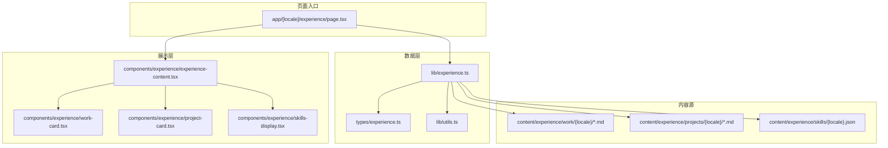
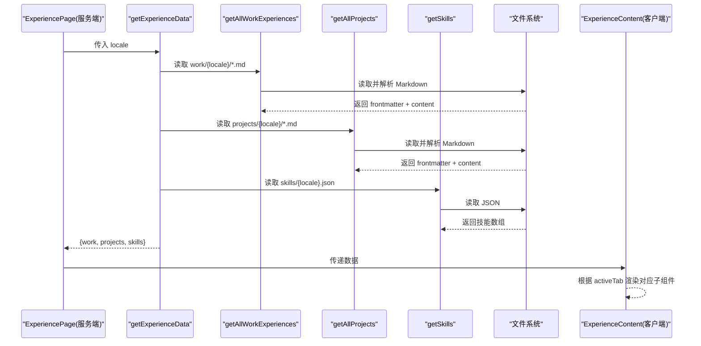
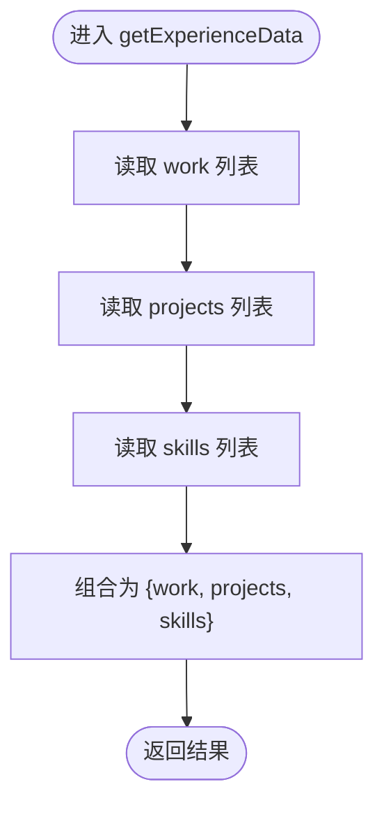
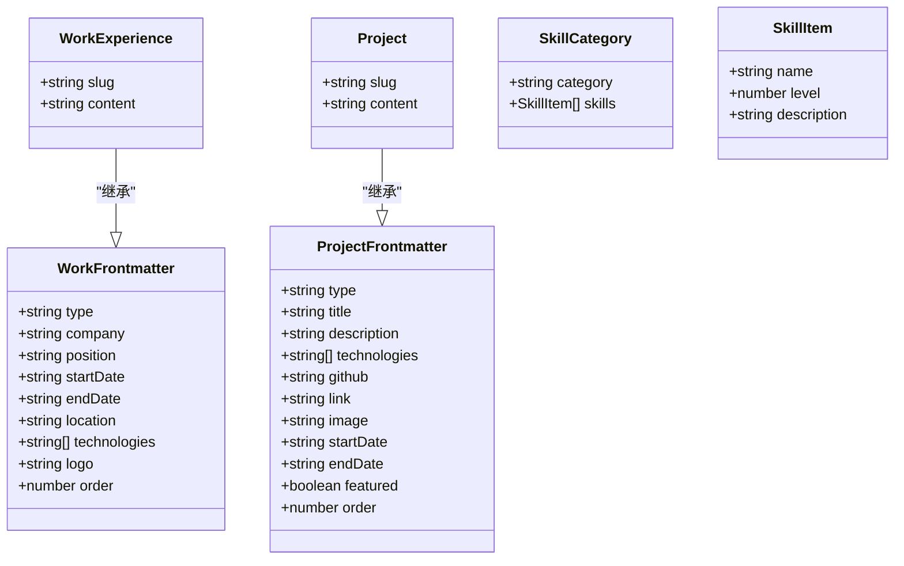
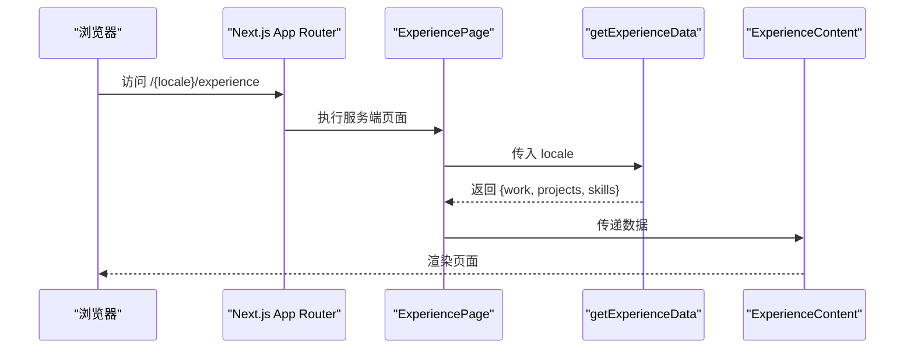
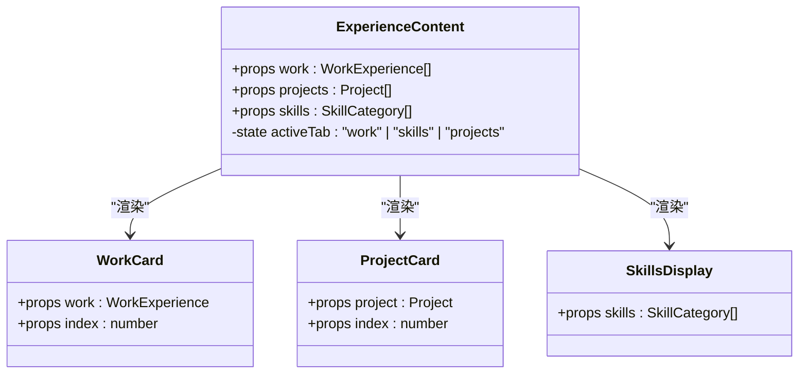
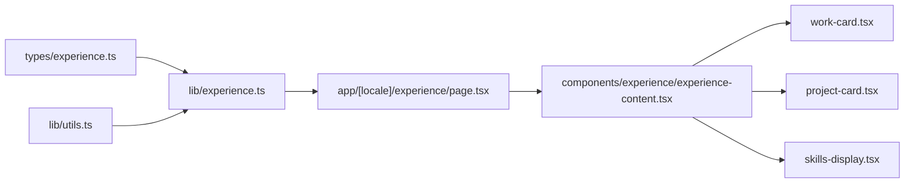

# 数据集成与组合

<cite>
**本文引用的文件**
- [lib/experience.ts](file://lib/experience.ts)
- [types/experience.ts](file://types/experience.ts)
- [components/experience/experience-content.tsx](file://components/experience/experience-content.tsx)
- [app/[locale]/experience/page.tsx](file://app/[locale]/experience/page.tsx)
- [components/experience/work-card.tsx](file://components/experience/work-card.tsx)
- [components/experience/project-card.tsx](file://components/experience/project-card.tsx)
- [components/experience/skills-display.tsx](file://components/experience/skills-display.tsx)
- [lib/utils.ts](file://lib/utils.ts)
- [content/experience/skills/zh.json](file://content/experience/skills/zh.json)
- [content/experience/projects/zh/ai-bid-dev.md](file://content/experience/projects/zh/ai-bid-dev.md)
</cite>

## 目录
1. [引言](#引言)
2. [项目结构](#项目结构)
3. [核心组件](#核心组件)
4. [架构总览](#架构总览)
5. [详细组件分析](#详细组件分析)
6. [依赖关系分析](#依赖关系分析)
7. [性能考虑](#性能考虑)
8. [故障排查指南](#故障排查指南)
9. [结论](#结论)
10. [附录](#附录)

## 引言
本文件聚焦于经验数据集成方案，围绕 getExperienceData 函数的设计理念与实现机制展开，说明其如何统一获取工作经历、项目和技能三类数据，并通过“数据组合模式”简化页面组件的数据绑定逻辑。文档同时提供 experience-content 组件的使用方法与扩展指南，解释页面级组件如何调用数据集成函数进行渲染，并给出缓存与懒加载等性能优化策略，以及扩展现有经验数据模型（新增数据类型、接入第三方数据源）的实践建议。

## 项目结构
经验数据相关代码主要分布在以下位置：
- 数据层：lib/experience.ts 负责从文件系统读取 Markdown 和 JSON 内容，解析 frontmatter，并按语言环境组织数据。
- 类型定义：types/experience.ts 定义了工作、项目、技能的类型契约，确保前后端数据结构一致。
- 页面入口：app/[locale]/experience/page.tsx 作为服务端页面，调用 getExperienceData 获取数据后传递给客户端组件。
- 展示层：components/experience 下的三个子组件分别负责工作经历、项目卡片和技能展示的渲染。
- 工具函数：lib/utils.ts 提供资源路径处理，用于图片等资源在 GitHub Pages 部署时的 basePath 适配。

图表来源
- [lib/experience.ts:1-147](file://lib/experience.ts#L1-L147)
- [types/experience.ts:1-48](file://types/experience.ts#L1-L48)
- [lib/utils.ts:1-26](file://lib/utils.ts#L1-L26)
- [app/[locale]/experience/page.tsx:1-35](file://app/[locale]/experience/page.tsx#L1-L35)
- [components/experience/experience-content.tsx:1-106](file://components/experience/experience-content.tsx#L1-L106)
- [components/experience/work-card.tsx:1-69](file://components/experience/work-card.tsx#L1-L69)
- [components/experience/project-card.tsx:1-73](file://components/experience/project-card.tsx#L1-L73)
- [components/experience/skills-display.tsx:1-51](file://components/experience/skills-display.tsx#L1-L51)

章节来源
- [lib/experience.ts:1-147](file://lib/experience.ts#L1-L147)
- [types/experience.ts:1-48](file://types/experience.ts#L1-L48)
- [lib/utils.ts:1-26](file://lib/utils.ts#L1-L26)
- [app/[locale]/experience/page.tsx:1-35](file://app/[locale]/experience/page.tsx#L1-L35)
- [components/experience/experience-content.tsx:1-106](file://components/experience/experience-content.tsx#L1-L106)
- [components/experience/work-card.tsx:1-69](file://components/experience/work-card.tsx#L1-L69)
- [components/experience/project-card.tsx:1-73](file://components/experience/project-card.tsx#L1-L73)
- [components/experience/skills-display.tsx:1-51](file://components/experience/skills-display.tsx#L1-L51)

## 核心组件
- getExperienceData 函数
  - 职责：统一聚合工作经历、项目、技能三类数据，返回一个包含 work、projects、skills 的对象。
  - 设计要点：
    - 通过 getAllWorkExperiences、getAllProjects、getSkills 三个独立函数分别读取不同来源的内容，再组合为单一对象，降低耦合度。
    - 对 Markdown 使用 gray-matter 解析 frontmatter，将元信息与正文分离，便于渲染与排序。
    - 支持按 order 字段排序，保证列表顺序可控。
    - 对图片路径使用 getAssetPath 进行规范化，兼容 GitHub Pages 的 basePath 部署场景。
    - 针对 Windows 环境的 CRLF 换行问题做了文本规范化，避免 RSC Flight 字节长度不一致导致的运行时异常。
- ExperienceContent 组件
  - 职责：接收 work、projects、skills 数据，以 Tab 形式切换展示，内部委托 WorkCard、ProjectCard、SkillsDisplay 完成具体渲染。
  - 设计要点：
    - 使用 React 状态管理当前激活的 Tab，减少不必要的渲染。
    - 空数据时提供友好的占位提示，提升用户体验。
    - 通过 next-intl 实现国际化文案。
- 子组件
  - WorkCard：渲染单条工作经历，包括时间、地点、技术栈标签与 Markdown 内容。
  - ProjectCard：渲染项目卡片，支持封面图、外部链接、GitHub 图标与技术标签。
  - SkillsDisplay：按分类展示技能，并以进度条可视化技能等级。

章节来源
- [lib/experience.ts:141-147](file://lib/experience.ts#L141-L147)
- [components/experience/experience-content.tsx:1-106](file://components/experience/experience-content.tsx#L1-L106)
- [components/experience/work-card.tsx:1-69](file://components/experience/work-card.tsx#L1-L69)
- [components/experience/project-card.tsx:1-73](file://components/experience/project-card.tsx#L1-L73)
- [components/experience/skills-display.tsx:1-51](file://components/experience/skills-display.tsx#L1-L51)

## 架构总览
下图展示了从页面到数据源的完整调用链，体现“数据组合模式”如何将多源数据聚合为单一接口供页面消费。

图表来源
- [app/[locale]/experience/page.tsx:25-34](file://app/[locale]/experience/page.tsx#L25-L34)
- [lib/experience.ts:17-46](file://lib/experience.ts#L17-L46)
- [lib/experience.ts:71-98](file://lib/experience.ts#L71-L98)
- [lib/experience.ts:124-137](file://lib/experience.ts#L124-L137)
- [components/experience/experience-content.tsx:20-103](file://components/experience/experience-content.tsx#L20-L103)

## 详细组件分析

### 数据层：lib/experience.ts
- 工作经历
  - getAllWorkExperiences：扫描 work/{locale} 目录，过滤 .md 文件，解析 frontmatter，附加 slug 与 content，按 order 升序排序。
  - getWorkExperienceBySlug：按 slug 精确读取单个工作经历，失败时返回 null。
- 项目
  - getAllProjects：扫描 projects/{locale} 目录，解析 frontmatter，附加 slug、content，并对 image 字段调用 getAssetPath 进行路径规范化，按 order 升序排序。
  - getFeaturedProjects：过滤 featured 为 true 的项目。
  - getProjectBySlug：按 slug 精确读取单个项目，失败时返回 null。
- 技能
  - getSkills：优先读取 skills/{locale}.json，不存在则回退到 en.json，最终返回 SkillCategory[]。
- 组合接口
  - getExperienceData：聚合上述三类数据，返回统一对象，简化上层调用。

图表来源
- [lib/experience.ts:141-147](file://lib/experience.ts#L141-L147)
- [lib/experience.ts:17-46](file://lib/experience.ts#L17-L46)
- [lib/experience.ts:71-98](file://lib/experience.ts#L71-L98)
- [lib/experience.ts:124-137](file://lib/experience.ts#L124-L137)

章节来源
- [lib/experience.ts:17-46](file://lib/experience.ts#L17-L46)
- [lib/experience.ts:71-98](file://lib/experience.ts#L71-L98)
- [lib/experience.ts:124-137](file://lib/experience.ts#L124-L137)
- [lib/experience.ts:141-147](file://lib/experience.ts#L141-L147)

### 类型定义：types/experience.ts
- WorkFrontmatter / WorkExperience：定义工作经历的元信息字段（公司、职位、起止时间、地点、技术栈、logo、排序），以及 slug 与 content。
- ProjectFrontmatter / Project：定义项目的元信息字段（标题、描述、技术栈、链接、图片、是否重点、起止时间、排序），以及 slug 与 content。
- SkillCategory / SkillItem：定义技能分类与技能项（名称、等级、可选描述）。

图表来源
- [types/experience.ts:1-48](file://types/experience.ts#L1-L48)

章节来源
- [types/experience.ts:1-48](file://types/experience.ts#L1-L48)

### 页面入口：app/[locale]/experience/page.tsx
- generateMetadata：基于 next-intl/server 获取翻译，构建 SEO 元信息。
- 默认导出页面：
  - 解析 params.locale，设置请求语言。
  - 调用 getExperienceData(locale) 获取统一数据。
  - 将 work、projects、skills 作为 props 传递给 ExperienceContent。

图表来源
- [app/[locale]/experience/page.tsx:11-34](file://app/[locale]/experience/page.tsx#L11-L34)
- [lib/experience.ts:141-147](file://lib/experience.ts#L141-L147)
- [components/experience/experience-content.tsx:20-103](file://components/experience/experience-content.tsx#L20-L103)

章节来源
- [app/[locale]/experience/page.tsx:1-35](file://app/[locale]/experience/page.tsx#L1-L35)

### 展示层：experience-content 及其子组件
- experience-content
  - 通过 state 管理 activeTab，控制显示 work、skills、projects 三块内容。
  - 空数据时展示友好提示，提升可用性。
  - 使用 lucide-react 图标增强视觉表达。
- work-card
  - 根据 endDate 是否为空判断是否“在职”，动态显示标签。
  - 使用 ReactMarkdown 渲染工作详情。
  - 展示技术栈标签。
- project-card
  - 支持封面图、GitHub 与外部链接。
  - 使用 ReactMarkdown 渲染项目详情。
  - 展示技术栈标签。
- skills-display
  - 按分类渲染技能卡片。
  - 使用进度条可视化技能等级。

图表来源
- [components/experience/experience-content.tsx:1-106](file://components/experience/experience-content.tsx#L1-L106)
- [components/experience/work-card.tsx:1-69](file://components/experience/work-card.tsx#L1-L69)
- [components/experience/project-card.tsx:1-73](file://components/experience/project-card.tsx#L1-L73)
- [components/experience/skills-display.tsx:1-51](file://components/experience/skills-display.tsx#L1-L51)

章节来源
- [components/experience/experience-content.tsx:1-106](file://components/experience/experience-content.tsx#L1-L106)
- [components/experience/work-card.tsx:1-69](file://components/experience/work-card.tsx#L1-L69)
- [components/experience/project-card.tsx:1-73](file://components/experience/project-card.tsx#L1-L73)
- [components/experience/skills-display.tsx:1-51](file://components/experience/skills-display.tsx#L1-L51)

### 工具函数：lib/utils.ts
- getAssetPath：为静态资源路径添加 basePath 前缀，兼容 GitHub Pages 的用户站点与项目站点两种部署模式；对绝对 URL 与 data: 协议不做修改。

章节来源
- [lib/utils.ts:1-26](file://lib/utils.ts#L1-L26)

## 依赖关系分析
- 模块耦合
  - 页面入口仅依赖 getExperienceData 与 ExperienceContent，保持低耦合。
  - 数据层依赖 types 与 utils，不直接依赖 UI 组件，职责清晰。
  - 展示层仅消费数据，不包含业务逻辑，易于测试与维护。
- 外部依赖
  - gray-matter：解析 Markdown frontmatter。
  - next-intl：国际化文案。
  - react-markdown：渲染 Markdown 内容。
  - lucide-react：图标库。
  - shadcn/ui：基础 UI 组件。

图表来源
- [types/experience.ts:1-48](file://types/experience.ts#L1-L48)
- [lib/experience.ts:1-147](file://lib/experience.ts#L1-L147)
- [lib/utils.ts:1-26](file://lib/utils.ts#L1-L26)
- [app/[locale]/experience/page.tsx:1-35](file://app/[locale]/experience/page.tsx#L1-L35)
- [components/experience/experience-content.tsx:1-106](file://components/experience/experience-content.tsx#L1-L106)
- [components/experience/work-card.tsx:1-69](file://components/experience/work-card.tsx#L1-L69)
- [components/experience/project-card.tsx:1-73](file://components/experience/project-card.tsx#L1-L73)
- [components/experience/skills-display.tsx:1-51](file://components/experience/skills-display.tsx#L1-L51)

章节来源
- [lib/experience.ts:1-147](file://lib/experience.ts#L1-L147)
- [types/experience.ts:1-48](file://types/experience.ts#L1-L48)
- [lib/utils.ts:1-26](file://lib/utils.ts#L1-L26)
- [app/[locale]/experience/page.tsx:1-35](file://app/[locale]/experience/page.tsx#L1-L35)
- [components/experience/experience-content.tsx:1-106](file://components/experience/experience-content.tsx#L1-L106)
- [components/experience/work-card.tsx:1-69](file://components/experience/work-card.tsx#L1-L69)
- [components/experience/project-card.tsx:1-73](file://components/experience/project-card.tsx#L1-L73)
- [components/experience/skills-display.tsx:1-51](file://components/experience/skills-display.tsx#L1-L51)

## 性能考虑
- 数据缓存
  - 建议在 Node 进程内引入内存缓存（如 Map 或 LRU 缓存），以 locale 为键缓存 getExperienceData 的结果，避免重复 IO。
  - 对于静态导出场景，可在构建阶段一次性生成数据快照并注入页面，减少运行期开销。
- 懒加载
  - 对大体积 Markdown 内容可采用按需加载策略，例如仅在用户切换到对应 Tab 时才解析与渲染。
  - 图片懒加载可使用原生 loading="lazy" 或 IntersectionObserver 实现。
- 并发与批处理
  - 若未来数据源增多，可考虑 Promise.all 并行读取多个来源，缩短首屏时间。
- 资源路径优化
  - 继续使用 getAssetPath 规范化路径，确保在不同部署模式下资源正确加载。
- 渲染优化
  - 使用 React.memo 包裹子组件以减少重渲染。
  - 对长列表采用虚拟滚动（react-window 等）提升大数据量下的渲染性能。

[本节为通用性能建议，不直接分析具体文件]

## 故障排查指南
- Windows 换行符导致 RSC Flight 字节长度不一致
  - 现象：部署后出现 enqueueModel is not a function 等异常。
  - 原因：Windows 的 CRLF 与 GitHub Pages 的 LF 不一致，影响 RSC 序列化。
  - 解决：在读取 Markdown 时统一替换 \r\n 为 \n。
- 图片路径错误
  - 现象：GitHub Pages 项目站点下图片无法加载。
  - 原因：未添加 basePath 前缀。
  - 解决：使用 getAssetPath 处理图片路径。
- 语言回退
  - 现象：特定语言的 skills 文件缺失。
  - 行为：自动回退到 en.json。
  - 建议：确保每个语言都有对应的 skills 文件，或在 CI 中校验。
- 空数据展示
  - 现象：无数据时页面空白。
  - 解决：在 experience-content 中提供空状态占位与提示。

章节来源
- [lib/experience.ts:31-35](file://lib/experience.ts#L31-L35)
- [lib/experience.ts:85-93](file://lib/experience.ts#L85-L93)
- [lib/experience.ts:124-137](file://lib/experience.ts#L124-L137)
- [components/experience/experience-content.tsx:55-99](file://components/experience/experience-content.tsx#L55-L99)

## 结论
getExperienceData 通过“数据组合模式”将多源数据聚合为统一接口，显著降低了页面组件的数据绑定复杂度。配合清晰的类型定义与模块化设计，系统具备良好的可扩展性与可维护性。通过引入缓存、懒加载与渲染优化策略，可进一步提升性能与用户体验。未来可按需扩展新的数据类型与第三方数据源，保持数据层与展示层的解耦。

[本节为总结性内容，不直接分析具体文件]

## 附录

### experience-content 使用方法
- 在页面级组件中调用 getExperienceData(locale)，将返回的 work、projects、skills 作为 props 传入 ExperienceContent。
- 组件内部通过 Tab 切换展示不同板块，无需关心数据来源。

章节来源
- [app/[locale]/experience/page.tsx:25-34](file://app/[locale]/experience/page.tsx#L25-L34)
- [components/experience/experience-content.tsx:20-103](file://components/experience/experience-content.tsx#L20-L103)

### 自定义与扩展指南
- 新增数据类型
  - 在 types/experience.ts 中定义新类型的 Frontmatter 与实体类型。
  - 在 lib/experience.ts 中新增读取函数，并在 getExperienceData 中聚合返回。
  - 在 experience-content 中添加新的 Tab 与渲染逻辑，必要时创建新子组件。
- 集成第三方数据源
  - 在 lib/experience.ts 中新增异步读取函数（如 fetch API），将远程数据转换为本地类型。
  - 在 getExperienceData 中合并本地与远程数据，注意错误处理与降级策略。
  - 引入缓存层（内存或 Redis）以提升性能。
- 示例数据参考
  - 技能配置：content/experience/skills/zh.json
  - 项目示例：content/experience/projects/zh/ai-bid-dev.md

章节来源
- [types/experience.ts:1-48](file://types/experience.ts#L1-L48)
- [lib/experience.ts:141-147](file://lib/experience.ts#L141-L147)
- [components/experience/experience-content.tsx:20-103](file://components/experience/experience-content.tsx#L20-L103)
- [content/experience/skills/zh.json:1-102](file://content/experience/skills/zh.json#L1-L102)
- [content/experience/projects/zh/ai-bid-dev.md:1-25](file://content/experience/projects/zh/ai-bid-dev.md#L1-L25)