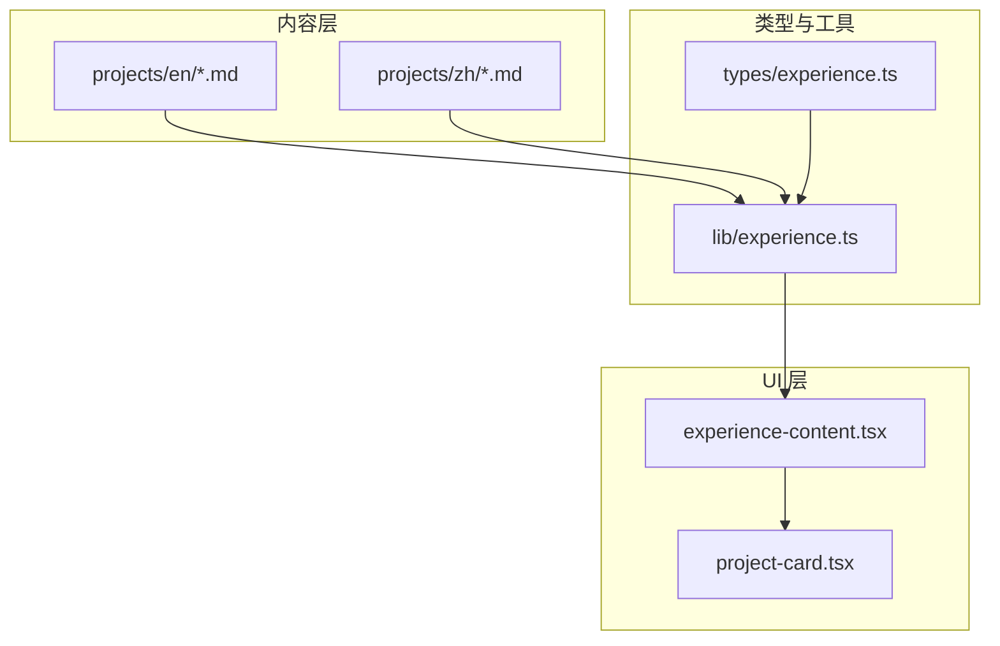
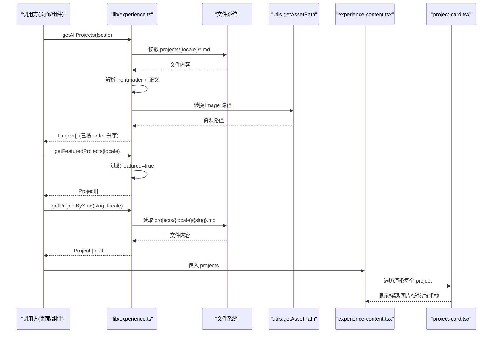
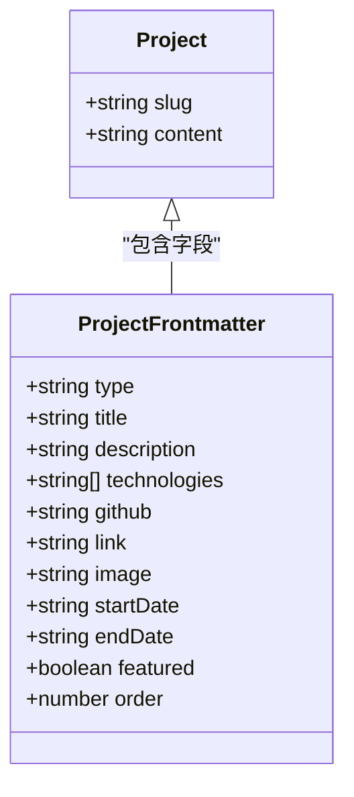
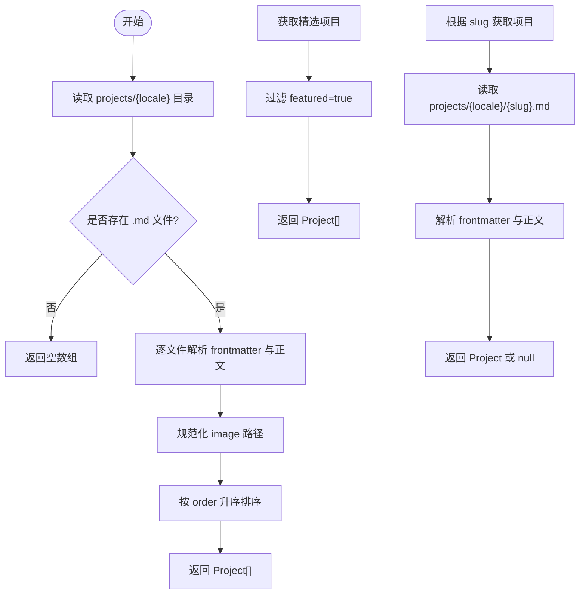
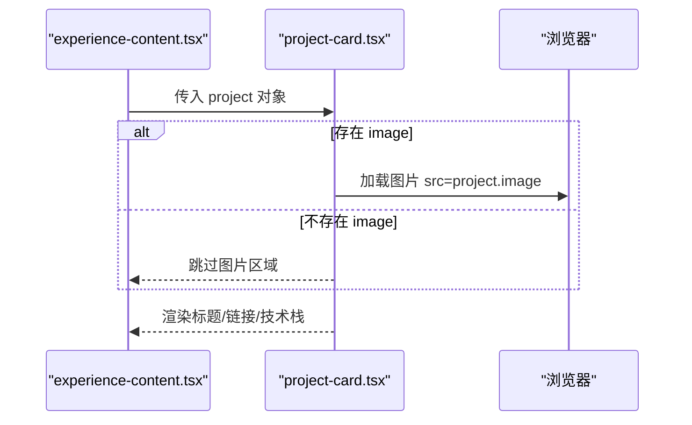
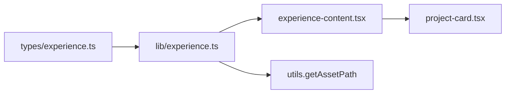

# 项目展示管理

<cite>
**本文引用的文件**   
- [types/experience.ts](file://types/experience.ts)
- [lib/experience.ts](file://lib/experience.ts)
- [components/experience/project-card.tsx](file://components/experience/project-card.tsx)
- [components/experience/experience-content.tsx](file://components/experience/experience-content.tsx)
- [content/experience/projects/en/ai-bid-dev.md](file://content/experience/projects/en/ai-bid-dev.md)
- [content/experience/projects/en/ai-mcp-gateway.md](file://content/experience/projects/en/ai-mcp-gateway.md)
- [content/experience/projects/en/seal-management-platform.md](file://content/experience/projects/en/seal-management-platform.md)
- [content/experience/projects/zh/ai-bid-dev.md](file://content/experience/projects/zh/ai-bid-dev.md)
- [content/experience/projects/zh/ai-mcp-gateway.md](file://content/experience/projects/zh/ai-mcp-gateway.md)
</cite>

## 目录
1. [简介](#简介)
2. [项目结构](#项目结构)
3. [核心组件](#核心组件)
4. [架构总览](#架构总览)
5. [详细组件分析](#详细组件分析)
6. [依赖分析](#依赖分析)
7. [性能考虑](#性能考虑)
8. [故障排查指南](#故障排查指南)
9. [结论](#结论)
10. [附录](#附录)

## 简介
本文件面向开发者与维护者，系统化说明“项目展示”的数据模型、读取与筛选逻辑、Markdown 编写规范、前端卡片渲染与样式定制方法，以及多语言项目的目录结构与命名规范。目标是帮助读者快速理解并扩展项目展示能力，包括新增项目、设置精选项目、自定义展示样式等。

## 项目结构
项目采用“内容即数据”的方式：项目详情以 Markdown 文件存放于 content/experience/projects/{locale} 目录下，类型定义位于 types/experience.ts，数据读取与处理集中在 lib/experience.ts，前端通过 components/experience 下的组件进行渲染。

图表来源
- [lib/experience.ts:71-120](file://lib/experience.ts#L71-L120)
- [types/experience.ts:20-37](file://types/experience.ts#L20-L37)
- [components/experience/experience-content.tsx:84-99](file://components/experience/experience-content.tsx#L84-L99)
- [components/experience/project-card.tsx:16-50](file://components/experience/project-card.tsx#L16-L50)

章节来源
- [types/experience.ts:20-37](file://types/experience.ts#L20-L37)
- [lib/experience.ts:71-120](file://lib/experience.ts#L71-L120)
- [components/experience/experience-content.tsx:84-99](file://components/experience/experience-content.tsx#L84-L99)
- [components/experience/project-card.tsx:16-50](file://components/experience/project-card.tsx#L16-L50)

## 核心组件
本节聚焦以下关键实现：
- 数据模型：ProjectFrontmatter 与 Project
- 数据访问：getAllProjects、getFeaturedProjects、getProjectBySlug
- 前端渲染：ProjectCard 与 ExperienceContent 的项目展示逻辑

章节来源
- [types/experience.ts:20-37](file://types/experience.ts#L20-L37)
- [lib/experience.ts:71-120](file://lib/experience.ts#L71-L120)
- [components/experience/project-card.tsx:16-50](file://components/experience/project-card.tsx#L16-L50)
- [components/experience/experience-content.tsx:84-99](file://components/experience/experience-content.tsx#L84-L99)

## 架构总览
下图展示了从 Markdown 到 UI 的完整链路：按语言定位目录、解析 frontmatter 与正文、统一排序与过滤、最终由卡片组件渲染。

图表来源
- [lib/experience.ts:71-120](file://lib/experience.ts#L71-L120)
- [components/experience/experience-content.tsx:84-99](file://components/experience/experience-content.tsx#L84-L99)
- [components/experience/project-card.tsx:16-50](file://components/experience/project-card.tsx#L16-L50)

## 详细组件分析

### 数据模型：ProjectFrontmatter 与 Project
- ProjectFrontmatter 描述项目元信息，关键字段包括：
  - type: "project"（用于区分经验条目类型）
  - title、description：标题与摘要
  - technologies：技术栈数组
  - github、link：可选的外部链接
  - image：可选封面图路径
  - startDate、endDate：可选的时间范围
  - featured：是否精选（布尔）
  - order：排序权重（数值）
- Project 在 ProjectFrontmatter 基础上增加 slug 与 content，便于列表与详情页使用。

图表来源
- [types/experience.ts:20-37](file://types/experience.ts#L20-L37)

章节来源
- [types/experience.ts:20-37](file://types/experience.ts#L20-L37)

### 数据访问函数：getAllProjects、getFeaturedProjects、getProjectBySlug
- getAllProjects(locale)
  - 定位 content/experience/projects/{locale} 目录
  - 读取所有 .md 文件，解析 frontmatter 与正文
  - 将 image 路径转换为资源路径（若存在）
  - 按 order 升序排序
  - 返回 Project[]
- getFeaturedProjects(locale)
  - 基于 getAllProjects 的结果，过滤 featured 为 true 的项目
- getProjectBySlug(slug, locale)
  - 直接读取指定 slug 的文件，返回 Project 或 null

图表来源
- [lib/experience.ts:71-120](file://lib/experience.ts#L71-L120)

章节来源
- [lib/experience.ts:71-120](file://lib/experience.ts#L71-L120)

### 前端渲染：ProjectCard 与 ExperienceContent
- experience-content.tsx
  - 当 activeTab 为 "projects" 时，遍历 projects 列表，逐个渲染 ProjectCard
  - 无项目时展示占位提示
- project-card.tsx
  - 条件渲染图片区域（仅当 project.image 存在）
  - 展示标题、GitHub 图标与外部链接（若配置）
  - 支持悬停动效与响应式布局

图表来源
- [components/experience/experience-content.tsx:84-99](file://components/experience/experience-content.tsx#L84-L99)
- [components/experience/project-card.tsx:16-50](file://components/experience/project-card.tsx#L16-L50)

章节来源
- [components/experience/experience-content.tsx:84-99](file://components/experience/experience-content.tsx#L84-L99)
- [components/experience/project-card.tsx:16-50](file://components/experience/project-card.tsx#L16-L50)

## 依赖分析
- 类型依赖：lib/experience.ts 依赖 types/experience.ts 中的 ProjectFrontmatter 与 Project
- 运行时依赖：lib/experience.ts 使用文件系统读取 Markdown 与 gray-matter 解析 frontmatter
- 资源路径：image 字段通过 getAssetPath 统一处理为可访问的资源路径
- 组件依赖：experience-content.tsx 依赖 lib/experience.ts 提供的数据；project-card.tsx 依赖 types/experience.ts 的类型定义

图表来源
- [types/experience.ts:20-37](file://types/experience.ts#L20-L37)
- [lib/experience.ts:71-120](file://lib/experience.ts#L71-L120)
- [components/experience/experience-content.tsx:84-99](file://components/experience/experience-content.tsx#L84-L99)
- [components/experience/project-card.tsx:16-50](file://components/experience/project-card.tsx#L16-L50)

章节来源
- [types/experience.ts:20-37](file://types/experience.ts#L20-L37)
- [lib/experience.ts:71-120](file://lib/experience.ts#L71-L120)
- [components/experience/experience-content.tsx:84-99](file://components/experience/experience-content.tsx#L84-L99)
- [components/experience/project-card.tsx:16-50](file://components/experience/project-card.tsx#L16-L50)

## 性能考虑
- 列表读取：getAllProjects 会一次性读取某语言下所有项目文件，适合中小规模内容；若未来项目数量显著增长，可考虑按需懒加载或增量缓存策略。
- 排序成本：order 字段为整数，排序复杂度 O(n log n)，当前开销可忽略。
- 图片路径：image 路径统一转换，避免重复计算；建议保持图片尺寸合理，减少首屏加载时间。
- 精选过滤：getFeaturedProjects 基于内存过滤，开销极低。

[本节为通用指导，不直接分析具体文件]

## 故障排查指南
- 找不到项目文件
  - 现象：getProjectBySlug 返回 null
  - 排查：确认 slug 与文件名一致（不含 .md），且位于对应语言的 projects 子目录
- 图片未显示
  - 现象：卡片中无图片
  - 排查：检查 frontmatter 中 image 字段是否为空或路径不正确；确保 getAssetPath 能正确解析
- 排序不符合预期
  - 现象：项目顺序异常
  - 排查：确认各项目的 order 值大小关系；order 越小越靠前
- 精选项目未出现
  - 现象：getFeaturedProjects 为空
  - 排查：确认 frontmatter 中 featured 设置为 true

章节来源
- [lib/experience.ts:104-120](file://lib/experience.ts#L104-L120)
- [lib/experience.ts:100-102](file://lib/experience.ts#L100-L102)
- [lib/experience.ts:71-98](file://lib/experience.ts#L71-L98)

## 结论
本项目通过清晰的类型定义与集中化的数据访问函数，实现了项目内容的结构化管理与灵活展示。借助 Markdown frontmatter 与统一的图片路径处理，开发者可以快速添加新项目、设置精选项目，并通过前端组件轻松定制展示样式。

[本节为总结性内容，不直接分析具体文件]

## 附录

### Markdown 编写指南（项目）
- 文件位置与命名
  - 中文：content/experience/projects/zh/<slug>.md
  - 英文：content/experience/projects/en/<slug>.md
  - slug 需与文件名一致（不含 .md），用于路由与唯一标识
- frontmatter 必填项
  - type: "project"
  - title、description、technologies、order
- frontmatter 选填项
  - github、link、image、startDate、endDate、featured
- 富文本内容格式
  - 使用标准 Markdown 语法编写正文，可在正文中插入图片、代码块、表格等
- 示例文件参考
  - [content/experience/projects/en/ai-bid-dev.md](file://content/experience/projects/en/ai-bid-dev.md)
  - [content/experience/projects/en/ai-mcp-gateway.md](file://content/experience/projects/en/ai-mcp-gateway.md)
  - [content/experience/projects/en/seal-management-platform.md](file://content/experience/projects/en/seal-management-platform.md)
  - [content/experience/projects/zh/ai-bid-dev.md](file://content/experience/projects/zh/ai-bid-dev.md)
  - [content/experience/projects/zh/ai-mcp-gateway.md](file://content/experience/projects/zh/ai-mcp-gateway.md)

章节来源
- [content/experience/projects/en/ai-bid-dev.md](file://content/experience/projects/en/ai-bid-dev.md)
- [content/experience/projects/en/ai-mcp-gateway.md](file://content/experience/projects/en/ai-mcp-gateway.md)
- [content/experience/projects/en/seal-management-platform.md](file://content/experience/projects/en/seal-management-platform.md)
- [content/experience/projects/zh/ai-bid-dev.md](file://content/experience/projects/zh/ai-bid-dev.md)
- [content/experience/projects/zh/ai-mcp-gateway.md](file://content/experience/projects/zh/ai-mcp-gateway.md)

### 多语言目录结构与命名规范
- 目录结构
  - content/experience/projects/{locale}/<slug>.md
  - locale 取值如 zh、en
- 命名规范
  - 文件名使用小写英文与连字符，语义化表达主题
  - slug 与文件名保持一致，避免特殊字符与空格
- 示例
  - en/ai-bid-dev.md、zh/ai-bid-dev.md

章节来源
- [content/experience/projects/en/ai-bid-dev.md](file://content/experience/projects/en/ai-bid-dev.md)
- [content/experience/projects/zh/ai-bid-dev.md](file://content/experience/projects/zh/ai-bid-dev.md)

### 开发流程：添加新项目、设置精选、自定义展示
- 添加新项目
  - 在目标语言的 projects 目录下创建 <slug>.md
  - 填写 frontmatter（至少包含 type、title、description、technologies、order）
  - 如需封面图，配置 image 并确保路径可被 getAssetPath 解析
- 设置精选项目
  - 在 frontmatter 中将 featured 设为 true
  - 使用 getFeaturedProjects 获取精选列表
- 自定义项目展示
  - 调整 project-card.tsx 的样式与布局（如卡片边框、悬停效果、图片比例等）
  - 在 experience-content.tsx 中控制网格布局与空状态提示
- 验证
  - 使用 getAllProjects 查看列表顺序是否符合 order 预期
  - 使用 getProjectBySlug 校验单页内容是否正确解析

章节来源
- [lib/experience.ts:71-120](file://lib/experience.ts#L71-L120)
- [components/experience/project-card.tsx:16-50](file://components/experience/project-card.tsx#L16-L50)
- [components/experience/experience-content.tsx:84-99](file://components/experience/experience-content.tsx#L84-L99)