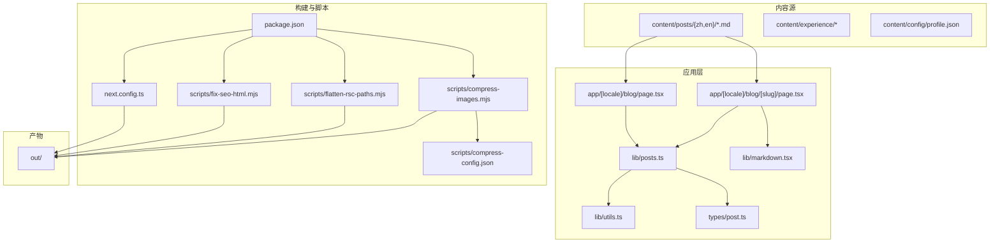
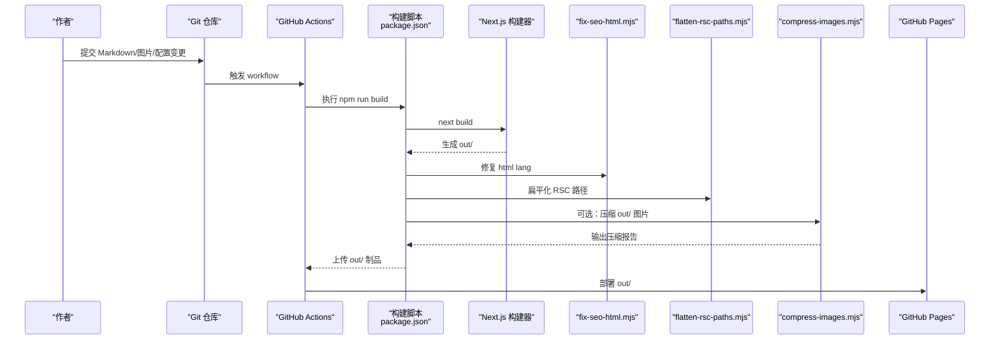
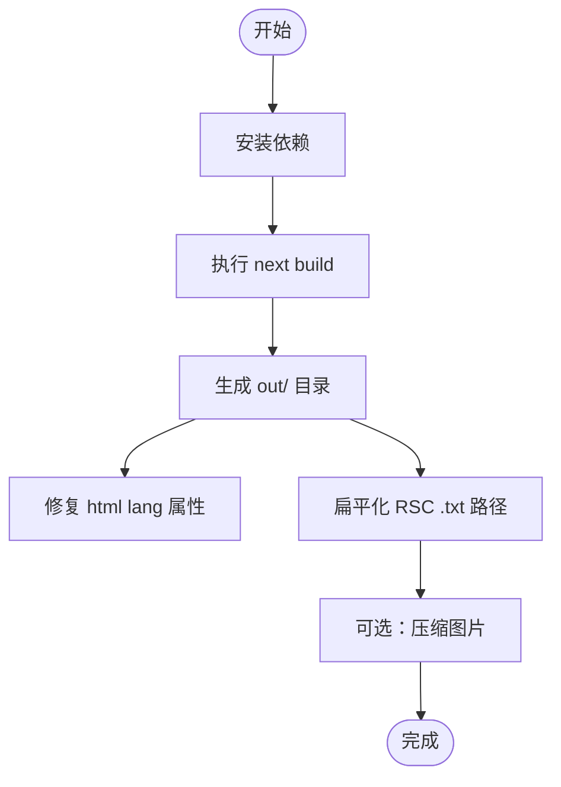
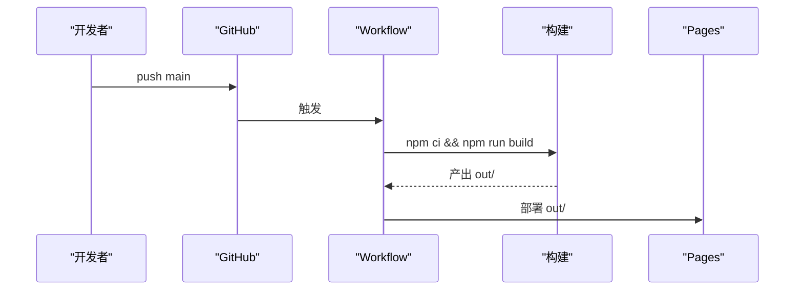
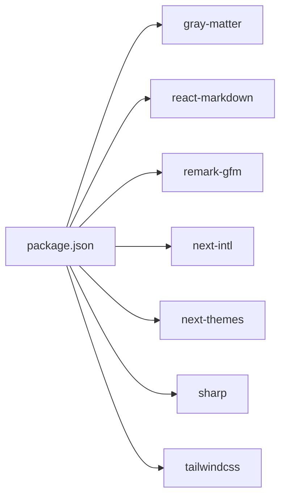

# 内容工作流

<cite>
**本文引用的文件**
- [README.md](file://README.md)
- [package.json](file://package.json)
- [next.config.ts](file://next.config.ts)
- [content/config/profile.json](file://content/config/profile.json)
- [lib/posts.ts](file://lib/posts.ts)
- [lib/markdown.tsx](file://lib/markdown.tsx)
- [scripts/compress-images.mjs](file://scripts/compress-images.mjs)
- [scripts/fix-seo-html.mjs](file://scripts/fix-seo-html.mjs)
- [scripts/flatten-rsc-paths.mjs](file://scripts/flatten-rsc-paths.mjs)
- [scripts/compress-config.json](file://scripts/compress-config.json)
- [lib/utils.ts](file://lib/utils.ts)
- [app/[locale]/blog/page.tsx](file://app/[locale]/blog/page.tsx)
- [app/[locale]/blog/[slug]/page.tsx](file://app/[locale]/blog/[slug]/page.tsx)
- [types/post.ts](file://types/post.ts)
- [.github/workflows/deploy.yml.bak](file://.github/workflows/deploy.yml.bak)
</cite>

## 目录
1. [简介](#简介)
2. [项目结构](#项目结构)
3. [核心组件](#核心组件)
4. [架构总览](#架构总览)
5. [详细组件分析](#详细组件分析)
6. [依赖分析](#依赖分析)
7. [性能考虑](#性能考虑)
8. [故障排查指南](#故障排查指南)
9. [结论](#结论)
10. [附录](#附录)

## 简介
本工作流文档面向内容创作者与运维人员，覆盖从 Markdown 创作、图片资源管理、构建与静态资源处理、SEO 优化到自动化部署的全链路。目标是提供一套可复用的规范与检查清单，确保内容更新高效、稳定、可追踪。

## 项目结构
本项目采用 Next.js App Router + 静态导出（output: export）的架构，内容以 Markdown 和 JSON 为主，配合脚本完成 SEO 修复与 RSC 路径扁平化，最终输出至 out/ 目录用于部署。

图表来源
- [next.config.ts:1-38](file://next.config.ts#L1-L38)
- [package.json:1-47](file://package.json#L1-L47)
- [lib/posts.ts:1-121](file://lib/posts.ts#L1-L121)
- [lib/markdown.tsx:1-318](file://lib/markdown.tsx#L1-L318)
- [lib/utils.ts:1-26](file://lib/utils.ts#L1-L26)
- [scripts/fix-seo-html.mjs:1-72](file://scripts/fix-seo-html.mjs#L1-L72)
- [scripts/flatten-rsc-paths.mjs:1-131](file://scripts/flatten-rsc-paths.mjs#L1-L131)
- [scripts/compress-images.mjs:1-230](file://scripts/compress-images.mjs#L1-L230)
- [scripts/compress-config.json:1-12](file://scripts/compress-config.json#L1-L12)

章节来源
- [README.md:33-67](file://README.md#L33-L67)
- [next.config.ts:1-38](file://next.config.ts#L1-L38)
- [package.json:1-47](file://package.json#L1-L47)

## 核心组件
- 内容读取与元数据生成：通过 lib/posts.ts 扫描 content/posts/{locale}/*.md，解析 frontmatter，计算阅读时长，过滤未发布文章并排序。
- 文章详情渲染：app/[locale]/blog/[slug]/page.tsx 负责页面元信息（SEO）、结构化数据（JSON-LD）、代码高亮、相关推荐等。
- Markdown 渲染：lib/markdown.tsx 使用 react-markdown 与 remark-gfm，定制标题锚点、表格、链接、代码块折叠与复制等。
- 资源路径适配：lib/utils.ts 的 getAssetPath 根据部署模式自动注入 basePath，兼容外部 CDN 与本地资源。
- 构建后处理：scripts/fix-seo-html.mjs 修正 html lang；scripts/flatten-rsc-paths.mjs 将 RSC .txt 路径扁平化，避免静态托管平台 404。
- 图片压缩：scripts/compress-images.mjs 基于 sharp 对 out/ 中图片进行阈值判断、格式转换与质量压缩，输出报告。
- 配置中心：content/config/profile.json 集中管理个人信息、社交链接、评论配置与主题色等。

章节来源
- [lib/posts.ts:1-121](file://lib/posts.ts#L1-L121)
- [app/[locale]/blog/[slug]/page.tsx:1-180](file://app/[locale]/blog/[slug]/page.tsx#L1-L180)
- [lib/markdown.tsx:1-318](file://lib/markdown.tsx#L1-L318)
- [lib/utils.ts:1-26](file://lib/utils.ts#L1-L26)
- [scripts/fix-seo-html.mjs:1-72](file://scripts/fix-seo-html.mjs#L1-L72)
- [scripts/flatten-rsc-paths.mjs:1-131](file://scripts/flatten-rsc-paths.mjs#L1-L131)
- [scripts/compress-images.mjs:1-230](file://scripts/compress-images.mjs#L1-L230)
- [content/config/profile.json:1-66](file://content/config/profile.json#L1-L66)

## 架构总览
下图展示“内容创作 → 构建 → 优化 → 部署”的关键流程与组件交互。

图表来源
- [package.json:5-12](file://package.json#L5-L12)
- [scripts/fix-seo-html.mjs:1-72](file://scripts/fix-seo-html.mjs#L1-L72)
- [scripts/flatten-rsc-paths.mjs:1-131](file://scripts/flatten-rsc-paths.mjs#L1-L131)
- [scripts/compress-images.mjs:1-230](file://scripts/compress-images.mjs#L1-L230)
- [.github/workflows/deploy.yml.bak:1-56](file://.github/workflows/deploy.yml.bak#L1-L56)

## 详细组件分析

### Markdown 编写规范
- 文件位置
  - 博客文章：content/posts/{zh,en}/<slug>.md
  - 工作经历/项目：content/experience/{work,projects}/{locale}/*.md
  - 技能配置：content/experience/skills/{locale}.json
- Frontmatter 字段（博客）
  - 必填：title、description、date、tags、category、author、slug
  - 可选：coverImage、published（默认 true）
- 字段类型与约束
  - date 使用 YYYY-MM-DD
  - tags 为字符串数组
  - slug 决定 URL 路径
- 阅读时长
  - 按词数估算，约 200 词/分钟
- 发布控制
  - published=false 的文章不会出现在列表页

章节来源
- [types/post.ts:1-20](file://types/post.ts#L1-L20)
- [lib/posts.ts:15-47](file://lib/posts.ts#L15-L47)
- [lib/posts.ts:49-71](file://lib/posts.ts#L49-L71)
- [lib/posts.ts:95-121](file://lib/posts.ts#L95-L121)
- [README.md:158-191](file://README.md#L158-L191)

### 图片资源管理与优化
- 存放位置
  - 头像：public/images/avatar.png
  - 文章封面：public/images/posts/
  - 项目截图：public/images/projects/
- 资源路径策略
  - 内部资源：通过 getAssetPath 自动注入 basePath（项目站点）
  - 外部资源：http(s)/data:/协议直出，不注入前缀
- 压缩脚本
  - 入口：npm run compress
  - 输入：./out（构建产物中的图片）
  - 阈值：大于 sizeThresholdMB 才压缩
  - 支持格式：jpg/jpeg/png/webp/avif
  - 可选：convertToWebP=true 时统一转 WebP
  - 结果：原地替换原图，输出统计报告
- 建议
  - 优先上传 PNG/JPEG，由脚本在构建后按需转 WebP
  - 大图建议先本地裁剪或压缩再上传，减少构建时间

章节来源
- [lib/utils.ts:8-26](file://lib/utils.ts#L8-L26)
- [scripts/compress-images.mjs:1-230](file://scripts/compress-images.mjs#L1-L230)
- [scripts/compress-config.json:1-12](file://scripts/compress-config.json#L1-L12)
- [README.md:291-295](file://README.md#L291-L295)

### 内容构建过程
- 构建命令
  - npm run build：执行 next build，随后运行 fix-seo-html.mjs 与 flatten-rsc-paths.mjs
  - npm run build:only：仅执行 next build
  - npm run compress：对 out/ 图片进行压缩
- 部署模式
  - 用户站点：无 basePath，资源根路径 /
  - 项目站点：basePath=/repoName，assetPrefix=/repoName/
- 环境变量
  - DEPLOY_TARGET=project 切换项目站点模式
  - NEXT_PUBLIC_BASE_PATH 注入前端资源路径前缀
  - NEXT_PUBLIC_SITE_URL 生产/开发站点地址

图表来源
- [package.json:5-12](file://package.json#L5-L12)
- [next.config.ts:18-35](file://next.config.ts#L18-L35)
- [scripts/fix-seo-html.mjs:48-72](file://scripts/fix-seo-html.mjs#L48-L72)
- [scripts/flatten-rsc-paths.mjs:84-131](file://scripts/flatten-rsc-paths.mjs#L84-L131)
- [scripts/compress-images.mjs:154-230](file://scripts/compress-images.mjs#L154-L230)

章节来源
- [package.json:5-12](file://package.json#L5-L12)
- [next.config.ts:1-38](file://next.config.ts#L1-L38)

### 静态资源处理
- 资源路径注入
  - getAssetPath 根据 NEXT_PUBLIC_BASE_PATH 拼接前缀
  - 对外部链接保持原样，避免误加前缀
- 静态导出限制
  - images.unoptimized=true，禁用服务端图片优化
  - 所有资源需提前准备或经脚本处理

章节来源
- [lib/utils.ts:8-26](file://lib/utils.ts#L8-L26)
- [next.config.ts:21-35](file://next.config.ts#L21-L35)

### SEO 优化步骤
- 页面级元信息
  - 列表页与详情页均调用 buildPageMetadata 生成基础元信息
  - 详情页补充 OpenGraph、Twitter Card、canonical、alternate languages
- 结构化数据
  - 文章页注入 BlogPosting 与 BreadcrumbList JSON-LD
- HTML lang 修复
  - 构建后根据路径 zh/en 设置正确的 html lang
- 站点配置
  - profile.json 包含站点主题、评论、社交信息等

章节来源
- [app/[locale]/blog/page.tsx:11-23](file://app/[locale]/blog/page.tsx#L11-L23)
- [app/[locale]/blog/[slug]/page.tsx:37-108](file://app/[locale]/blog/[slug]/page.tsx#L37-L108)
- [app/[locale]/blog/[slug]/page.tsx:131-169](file://app/[locale]/blog/[slug]/page.tsx#L131-L169)
- [scripts/fix-seo-html.mjs:34-72](file://scripts/fix-seo-html.mjs#L34-L72)
- [content/config/profile.json:1-66](file://content/config/profile.json#L1-L66)

### 内容更新的自动化流程
- 触发条件
  - 推送 main 分支或手动触发 workflow_dispatch
- 关键步骤
  - 检出代码、安装依赖、构建、上传制品、部署到 GitHub Pages
- 注意事项
  - 使用项目站点模式时需设置 DEPLOY_TARGET=project
  - 产物目录为 out/

图表来源
- [.github/workflows/deploy.yml.bak:1-56](file://.github/workflows/deploy.yml.bak#L1-L56)
- [package.json:5-12](file://package.json#L5-L12)

章节来源
- [.github/workflows/deploy.yml.bak:1-56](file://.github/workflows/deploy.yml.bak#L1-L56)

### 团队协作的内容管理规范
- 分支策略
  - 主分支：main（受保护）
  - 功能分支：feature/<topic>
  - 修复分支：fix/<issue>
- 提交规范
  - 语义化提交：feat/docs/chore/fix/style
  - 变更范围：content/posts、images、config、scripts
- 审查流程
  - 至少一名审阅者批准
  - 构建与脚本必须通过
- 版本控制
  - 标签发布：vX.Y.Z
  - 变更记录：CHANGELOG（可选）

[本节为通用协作规范说明，无需源码引用]

## 依赖分析
- 运行时依赖
  - gray-matter：解析 Markdown frontmatter
  - react-markdown、remark-gfm：Markdown 渲染与 GFM 支持
  - next-intl：国际化路由与翻译
  - next-themes：主题切换
- 构建期依赖
  - sharp：图片压缩
  - tailwindcss、@tailwindcss/postcss：样式系统
- 脚本依赖
  - Node fs/path/url：文件系统与路径处理

图表来源
- [package.json:13-45](file://package.json#L13-L45)

章节来源
- [package.json:13-45](file://package.json#L13-L45)

## 性能考虑
- 图片体积
  - 使用 compress-images.mjs 在构建后压缩，减少首屏加载
  - 合理选择尺寸与格式，优先 WebP/AVIF
- 构建产物
  - 静态导出下禁用服务端图片优化，提前准备合适尺寸的图片
- 路由预生成
  - generateStaticParams 预生成所有文章参数，利于缓存与访问速度
- 代码高亮
  - 按需高亮长代码块，减少客户端渲染开销

[本节为通用性能建议，无需源码引用]

## 故障排查指南
- 构建失败
  - 确认 Node.js 版本满足要求
  - 清理 node_modules/.next 后重试
  - 检查 Markdown frontmatter 语法
- 图片无法显示
  - 确认路径是否经过 getAssetPath 处理
  - 项目站点模式下 basePath 是否正确
- 静态托管 404
  - 确认已执行 flatten-rsc-paths.mjs
  - 确认 out/ 目录完整且未被忽略
- SEO 异常
  - 确认 fix-seo-html.mjs 已执行
  - 检查 alternate languages 与 canonical 是否正确

章节来源
- [lib/utils.ts:8-26](file://lib/utils.ts#L8-L26)
- [scripts/flatten-rsc-paths.mjs:84-131](file://scripts/flatten-rsc-paths.mjs#L84-L131)
- [scripts/fix-seo-html.mjs:48-72](file://scripts/fix-seo-html.mjs#L48-L72)
- [README.md:577-582](file://README.md#L577-L582)

## 结论
通过标准化的 Markdown 编写规范、集中的资源管理、完善的构建与优化脚本以及自动化的 CI/CD 流程，本项目实现了从内容创作到发布的端到端工作流。遵循本文档的规范与检查清单，可显著提升团队协作效率与发布稳定性。

## 附录

### 常用命令速查
- 开发：npm run dev
- 构建：npm run build
- 仅构建：npm run build:only
- 图片压缩：npm run compress
- 启动预览：npm start

章节来源
- [package.json:5-12](file://package.json#L5-L12)

### 部署前检查清单
- 内容
  - 新增/修改文章 frontmatter 完整且有效
  - 图片路径正确，大小合理
- 构建
  - npm run build 成功
  - out/ 目录存在且包含必要文件
- 优化
  - 已执行 npm run compress（可选但推荐）
  - 确认 html lang 与 alternate languages 正确
- 部署
  - 项目站点模式：DEPLOY_TARGET=project
  - GitHub Pages 环境配置正确

章节来源
- [next.config.ts:18-35](file://next.config.ts#L18-L35)
- [scripts/fix-seo-html.mjs:48-72](file://scripts/fix-seo-html.mjs#L48-L72)
- [scripts/compress-images.mjs:154-230](file://scripts/compress-images.mjs#L154-L230)
- [.github/workflows/deploy.yml.bak:35-43](file://.github/workflows/deploy.yml.bak#L35-L43)