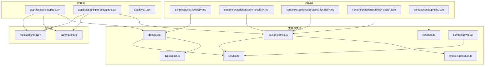
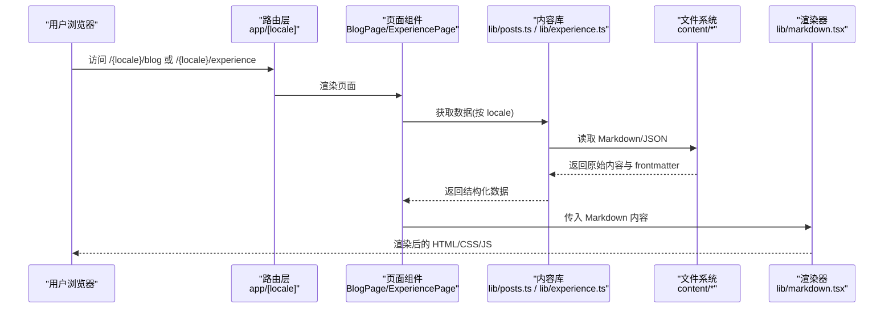
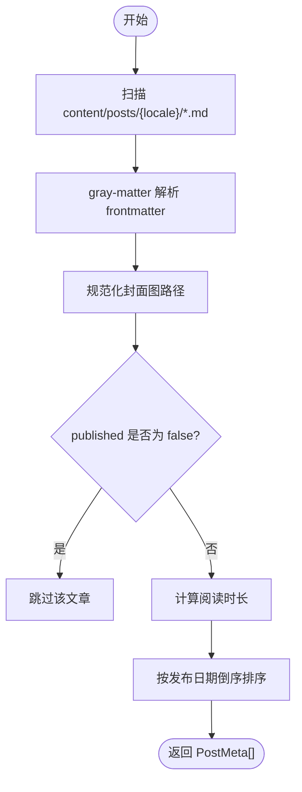
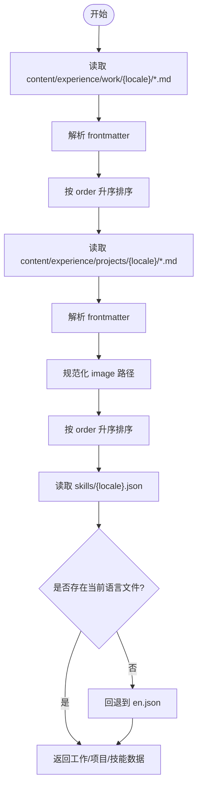
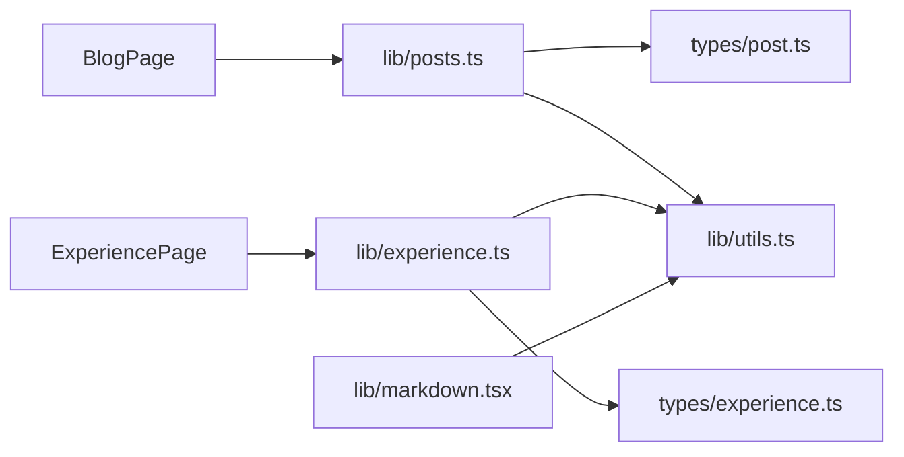

# 内容管理系统

<cite>
**本文引用的文件**   
- [README.md](file://README.md)
- [profile.json](file://content/config/profile.json)
- [posts.ts](file://lib/posts.ts)
- [experience.ts](file://lib/experience.ts)
- [about.ts](file://lib/about.ts)
- [markdown.tsx](file://lib/markdown.tsx)
- [utils.ts](file://lib/utils.ts)
- [post.ts](file://types/post.ts)
- [experience.ts](file://types/experience.ts)
- [routing.ts](file://i18n/routing.ts)
- [blog page.tsx](file://app/[locale]/blog/page.tsx)
- [experience page.tsx](file://app/[locale]/experience/page.tsx)
- [zh.json](file://messages/zh.json)
- [ralph.md](file://content/posts/zh/ralph.md)
- [ai-mcp-gateway.md](file://content/experience/projects/zh/ai-mcp-gateway.md)
- [zh skills.json](file://content/experience/skills/zh.json)
</cite>

## 目录
1. [简介](#简介)
2. [项目结构](#项目结构)
3. [核心组件](#核心组件)
4. [架构总览](#架构总览)
5. [详细组件分析](#详细组件分析)
6. [依赖关系分析](#依赖关系分析)
7. [性能与构建特性](#性能与构建特性)
8. [故障排查指南](#故障排查指南)
9. [结论](#结论)
10. [附录：规范与工作流](#附录：规范与工作流)

## 简介
本系统是一个基于 Next.js 的静态站点，采用 Markdown + JSON 作为内容源，通过 gray-matter 解析 frontmatter，结合 next-intl 实现中英文多语言路由与文案。内容类型包括博客文章、工作经历、项目展示、技能配置、个人档案与友链等。页面在构建期读取本地文件系统生成数据，渲染为静态 HTML，支持 GitHub Pages 与 Docker 部署。

## 项目结构
- 应用层（Next.js App Router）
  - app/[locale] 下按路由组织页面，如 blog、experience、about、resume 等
  - 根布局与全局样式位于 app/layout.tsx 与 app/globals.css
- 内容层（content）
  - posts/{locale}/*.md：博客文章
  - experience/work/{locale}/*.md：工作经历
  - experience/projects/{locale}/*.md：项目经历
  - experience/skills/{locale}.json：技能配置
  - config/profile.json：个人信息、主题、评论等配置
  - links/links.json：友链数据
- 工具与类型（lib、types）
  - lib/posts.ts、lib/experience.ts、lib/about.ts：内容读取与处理
  - lib/markdown.tsx：Markdown 渲染与代码块交互
  - lib/utils.ts：通用工具（含资源路径前缀处理）
  - types/post.ts、types/experience.ts：前端数据结构定义
- 国际化（i18n、messages）
  - i18n/routing.ts：语言路由配置
  - messages/{en,zh}.json：界面文案
- 静态资源（public）
  - images、resume 等静态资源

图表来源
- [blog page.tsx:1-34](file://app/[locale]/blog/page.tsx#L1-L34)
- [experience page.tsx:1-35](file://app/[locale]/experience/page.tsx#L1-L35)
- [posts.ts:1-121](file://lib/posts.ts#L1-L121)
- [experience.ts:1-147](file://lib/experience.ts#L1-L147)
- [about.ts:1-17](file://lib/about.ts#L1-L17)
- [markdown.tsx:1-318](file://lib/markdown.tsx#L1-L318)
- [utils.ts:1-26](file://lib/utils.ts#L1-L26)
- [post.ts:1-20](file://types/post.ts#L1-L20)
- [experience.ts:1-48](file://types/experience.ts#L1-L48)
- [routing.ts:1-6](file://i18n/routing.ts#L1-L6)
- [zh.json:1-168](file://messages/zh.json#L1-L168)

章节来源
- [README.md:33-67](file://README.md#L33-L67)

## 核心组件
- 博客内容管线
  - 读取 content/posts/{locale}/*.md，使用 gray-matter 解析 frontmatter，计算阅读时长，过滤未发布文章，按日期倒序排序
  - 提供标签、分类聚合与相关文章推荐算法（基于标签重叠与分类匹配加权）
- 经历与项目管线
  - 读取 work 与 projects 下的 Markdown，解析 frontmatter，按 order 字段排序
  - 读取 skills/{locale}.json，若当前语言不存在则回退到 en.json
- 关于页内容
  - 读取 content/config/about.{locale}.md，不存在时回退 to about.en.md
- Markdown 渲染
  - 客户端渲染，支持 GFM、标题锚点、表格、图片懒加载、外链安全属性、代码块折叠与复制
- 资源路径处理
  - 自动根据 NEXT_PUBLIC_BASE_PATH 注入 basePath 前缀，同时放行外部 URL 与 data URI

章节来源
- [posts.ts:15-47](file://lib/posts.ts#L15-L47)
- [posts.ts:95-121](file://lib/posts.ts#L95-L121)
- [experience.ts:17-46](file://lib/experience.ts#L17-L46)
- [experience.ts:71-98](file://lib/experience.ts#L71-L98)
- [experience.ts:124-137](file://lib/experience.ts#L124-L137)
- [about.ts:6-16](file://lib/about.ts#L6-L16)
- [markdown.tsx:35-192](file://lib/markdown.tsx#L35-L192)
- [utils.ts:16-25](file://lib/utils.ts#L16-L25)

## 架构总览
系统采用“内容即数据”的静态化架构：页面在构建期调用 lib 层函数读取 content 目录中的 Markdown 与 JSON，转换为结构化数据后传递给 UI 组件进行渲染。next-intl 负责语言路由与文案切换；gray-matter 负责 frontmatter 解析；ReactMarkdown 负责 Markdown 渲染。

图表来源
- [blog page.tsx:1-34](file://app/[locale]/blog/page.tsx#L1-L34)
- [experience page.tsx:1-35](file://app/[locale]/experience/page.tsx#L1-L35)
- [posts.ts:1-121](file://lib/posts.ts#L1-L121)
- [experience.ts:1-147](file://lib/experience.ts#L1-L147)
- [markdown.tsx:1-318](file://lib/markdown.tsx#L1-L318)

## 详细组件分析

### 博客内容模块
- 功能要点
  - 列出所有已发布文章，计算阅读时间，规范化封面图路径
  - 聚合标签与分类，支持按标签/分类筛选
  - 相关文章推荐：基于标签重叠权重与分类匹配权重排序
- 关键流程
  - getAllPosts：扫描 locale 目录 -> 解析 frontmatter -> 过滤 published=false -> 按 date 倒序
  - getRelatedPosts：计算相关性分数并截取 top N

图表来源
- [posts.ts:15-47](file://lib/posts.ts#L15-L47)
- [posts.ts:95-121](file://lib/posts.ts#L95-L121)

章节来源
- [posts.ts:15-47](file://lib/posts.ts#L15-L47)
- [posts.ts:73-93](file://lib/posts.ts#L73-L93)
- [posts.ts:95-121](file://lib/posts.ts#L95-L121)
- [post.ts:1-20](file://types/post.ts#L1-L20)

### 经历与项目模块
- 功能要点
  - 工作经历：按 order 升序排列，slug 由文件名推导
  - 项目经历：支持 featured 标记，image 路径规范化
  - 技能配置：按 locale 读取 JSON，缺失时回退到 en.json
- 关键流程
  - getAllWorkExperiences/getAllProjects：扫描对应目录 -> 解析 frontmatter -> 排序
  - getSkills：优先读取 {locale}.json，否则回退 en.json

图表来源
- [experience.ts:17-46](file://lib/experience.ts#L17-L46)
- [experience.ts:71-98](file://lib/experience.ts#L71-L98)
- [experience.ts:124-137](file://lib/experience.ts#L124-L137)

章节来源
- [experience.ts:17-46](file://lib/experience.ts#L17-L46)
- [experience.ts:71-98](file://lib/experience.ts#L71-L98)
- [experience.ts:124-137](file://lib/experience.ts#L124-L137)
- [experience.ts:1-48](file://types/experience.ts#L1-L48)

### 关于页内容模块
- 功能要点
  - 读取 content/config/about.{locale}.md，不存在时回退 to about.en.md
  - 统一换行符为 LF，避免跨平台差异

章节来源
- [about.ts:6-16](file://lib/about.ts#L6-L16)

### Markdown 渲染与代码块交互
- 功能要点
  - 启用 remark-gfm，支持表格、任务列表等
  - 标题自动生成锚点，便于目录跳转
  - 图片 lazy loading，外链增加 rel/target 安全属性
  - 代码块支持折叠与一键复制，支持高亮 HTML 注入
- 复杂度与优化
  - 长代码块默认折叠，减少首屏渲染体积
  - 复制操作使用 Clipboard API，失败时静默处理

章节来源
- [markdown.tsx:35-192](file://lib/markdown.tsx#L35-L192)
- [markdown.tsx:194-283](file://lib/markdown.tsx#L194-L283)

### 资源路径与国际化
- 资源路径
  - getAssetPath 自动拼接 NEXT_PUBLIC_BASE_PATH，放行外部 URL 与 data URI
- 国际化
  - routing.ts 定义 locales 与默认语言
  - 页面通过 next-intl/server 获取翻译命名空间，构建 SEO 元信息

章节来源
- [utils.ts:16-25](file://lib/utils.ts#L16-L25)
- [routing.ts:1-6](file://i18n/routing.ts#L1-L6)
- [blog page.tsx:11-23](file://app/[locale]/blog/page.tsx#L11-L23)
- [experience page.tsx:11-23](file://app/[locale]/experience/page.tsx#L11-L23)
- [zh.json:1-168](file://messages/zh.json#L1-L168)

## 依赖关系分析
- 页面组件依赖内容库
  - BlogPage 依赖 lib/posts.ts 获取文章、标签、分类
  - ExperiencePage 依赖 lib/experience.ts 获取工作、项目、技能
- 内容库依赖类型定义与工具
  - posts.ts 依赖 types/post.ts 与 utils.ts
  - experience.ts 依赖 types/experience.ts 与 utils.ts
- 渲染层依赖 Markdown 渲染器
  - 页面将 Markdown 字符串交给 lib/markdown.tsx 渲染
- 国际化贯穿全链路
  - 路由、文案、SEO 均受 i18n 影响

图表来源
- [blog page.tsx:1-34](file://app/[locale]/blog/page.tsx#L1-L34)
- [experience page.tsx:1-35](file://app/[locale]/experience/page.tsx#L1-L35)
- [posts.ts:1-121](file://lib/posts.ts#L1-L121)
- [experience.ts:1-147](file://lib/experience.ts#L1-L147)
- [post.ts:1-20](file://types/post.ts#L1-L20)
- [experience.ts:1-48](file://types/experience.ts#L1-L48)
- [utils.ts:1-26](file://lib/utils.ts#L1-L26)
- [markdown.tsx:1-318](file://lib/markdown.tsx#L1-L318)

章节来源
- [blog page.tsx:1-34](file://app/[locale]/blog/page.tsx#L1-L34)
- [experience page.tsx:1-35](file://app/[locale]/experience/page.tsx#L1-L35)
- [posts.ts:1-121](file://lib/posts.ts#L1-L121)
- [experience.ts:1-147](file://lib/experience.ts#L1-L147)

## 性能与构建特性
- 构建期数据读取
  - 所有 Markdown/JSON 在构建期读取，生成静态页面，无运行时 IO
- 阅读时长计算
  - 基于词数估算，避免复杂解析开销
- 图片与代码块优化
  - 图片懒加载，长代码块默认折叠，减少首屏渲染压力
- 资源路径前缀
  - 通过环境变量注入 basePath，适配不同部署路径

章节来源
- [posts.ts:9-13](file://lib/posts.ts#L9-L13)
- [markdown.tsx:81-88](file://lib/markdown.tsx#L81-L88)
- [markdown.tsx:194-283](file://lib/markdown.tsx#L194-L283)
- [utils.ts:16-25](file://lib/utils.ts#L16-L25)

## 故障排查指南
- 常见问题
  - 构建失败：检查 Node.js 版本、清理缓存、校验 frontmatter 格式
  - 中文乱码或换行异常：确保文件编码为 UTF-8，避免 CRLF 导致字节长度不一致
  - 图片不显示：确认路径是否以 / 开头，外部链接需完整协议
  - 多语言内容缺失：确认对应 locale 目录存在，skills 会回退到 en.json
- 定位建议
  - 查看 README 的“常见问题”部分
  - 检查各 lib 函数的错误分支与空值处理

章节来源
- [README.md:549-582](file://README.md#L549-L582)
- [experience.ts:31-34](file://lib/experience.ts#L31-L34)
- [experience.ts:124-137](file://lib/experience.ts#L124-L137)
- [about.ts:6-16](file://lib/about.ts#L6-L16)

## 结论
本系统以 Markdown + JSON 为核心内容载体，配合 gray-matter 与 ReactMarkdown 形成稳定高效的内容管线。通过 next-intl 实现多语言，利用构建期数据读取保障性能与可移植性。面向创作者与维护者，提供了清晰的目录结构与配置项，便于扩展新语言与新内容类型。

## 附录：规范与工作流

### Frontmatter 语法规范
- 博客文章（content/posts/{locale}/*.md）
  - 必填字段：title、description、date、tags、category、author、slug
  - 可选字段：coverImage、published（默认 true）
  - 示例参考：[ralph.md:1-10](file://content/posts/zh/ralph.md#L1-L10)
- 工作经历（content/experience/work/{locale}/*.md）
  - 必填字段：type="work"、company、position、startDate、order
  - 可选字段：endDate、location、technologies、logo
- 项目经历（content/experience/projects/{locale}/*.md）
  - 必填字段：type="project"、title、description、technologies、order
  - 可选字段：github、link、image、startDate、endDate、featured
  - 示例参考：[ai-mcp-gateway.md:1-17](file://content/experience/projects/zh/ai-mcp-gateway.md#L1-L17)
- 技能配置（content/experience/skills/{locale}.json）
  - 结构：数组，每项包含 category 与 skills 列表
  - 示例参考：[zh skills.json:1-102](file://content/experience/skills/zh.json#L1-L102)

章节来源
- [ralph.md:1-10](file://content/posts/zh/ralph.md#L1-L10)
- [ai-mcp-gateway.md:1-17](file://content/experience/projects/zh/ai-mcp-gateway.md#L1-L17)
- [zh skills.json:1-102](file://content/experience/skills/zh.json#L1-L102)
- [post.ts:1-20](file://types/post.ts#L1-L20)
- [experience.ts:1-48](file://types/experience.ts#L1-L48)

### 内容组织结构
- 博客文章：content/posts/{locale}/{slug}.md
- 工作经历：content/experience/work/{locale}/{slug}.md
- 项目经历：content/experience/projects/{locale}/{slug}.md
- 技能配置：content/experience/skills/{locale}.json
- 个人档案与评论：content/config/profile.json
- 友链：content/links/links.json

章节来源
- [README.md:200-215](file://README.md#L200-L215)
- [profile.json:1-66](file://content/config/profile.json#L1-L66)

### 多语言内容同步机制
- 路由与文案
  - i18n/routing.ts 定义支持的语言与默认语言
  - messages/{locale}.json 提供界面文案
- 内容语言选择
  - 页面根据当前 locale 读取对应目录内容
  - skills 缺失当前语言时回退到 en.json
  - about 缺失当前语言时回退到 about.en.md

章节来源
- [routing.ts:1-6](file://i18n/routing.ts#L1-L6)
- [zh.json:1-168](file://messages/zh.json#L1-L168)
- [experience.ts:124-137](file://lib/experience.ts#L124-L137)
- [about.ts:6-16](file://lib/about.ts#L6-L16)

### 内容创作最佳实践
- 文章写作
  - 合理拆分段落与小节，提升可读性与目录导航体验
  - 合理使用标签与分类，增强检索与推荐效果
  - 封面图建议使用合适尺寸，避免过大影响构建与加载
- 代码块
  - 标注语言以便高亮与复制
  - 长代码块保持简洁，必要时拆分为多篇
- 图片资源
  - 使用 public/images 目录管理，引用路径以 / 开头
  - 外部图片需带完整协议，避免被 basePath 修改
- 多语言
  - 新增语言需在 routing.ts 与 messages 中注册
  - 为每种语言准备对应的 content 目录与文案

章节来源
- [markdown.tsx:35-192](file://lib/markdown.tsx#L35-L192)
- [utils.ts:16-25](file://lib/utils.ts#L16-L25)
- [routing.ts:1-6](file://i18n/routing.ts#L1-L6)
- [zh.json:1-168](file://messages/zh.json#L1-L168)

### 图片资源管理
- 存放位置
  - 头像：public/images/avatar.png
  - 文章封面：public/images/posts/
  - 项目截图：public/images/projects/
- 引用方式
  - 相对路径以 / 开头，将被自动注入 basePath
  - 外部 CDN 或 data URI 不受影响

章节来源
- [README.md:291-295](file://README.md#L291-L295)
- [utils.ts:16-25](file://lib/utils.ts#L16-L25)

### 内容更新工作流
- 本地开发
  - 安装依赖后运行开发服务器，实时预览变更
- 构建验证
  - 执行构建命令，检查输出目录与日志
- 部署
  - GitHub Pages：推送 out 目录或使用 Actions 流水线
  - Docker：使用 docker-compose 或镜像直接运行

章节来源
- [README.md:69-100](file://README.md#L69-L100)
- [README.md:331-441](file://README.md#L331-L441)
- [README.md:443-546](file://README.md#L443-L546)