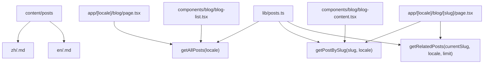
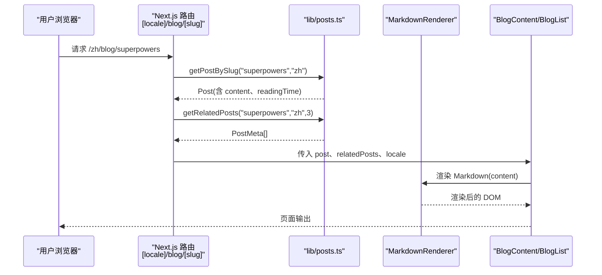
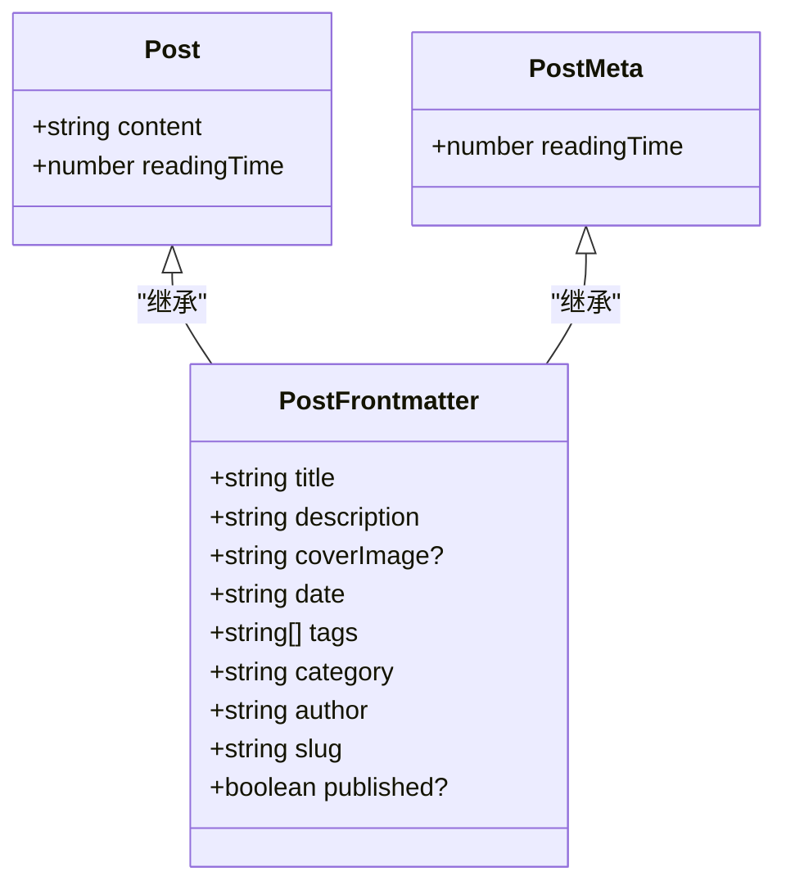
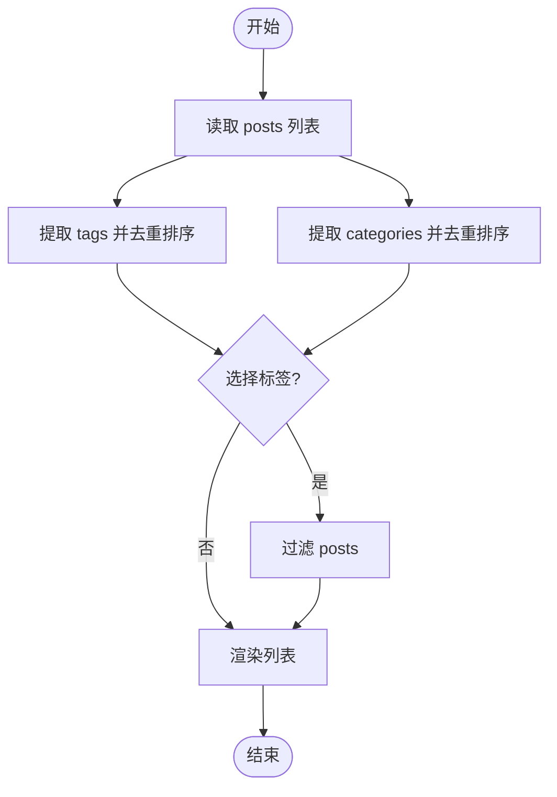
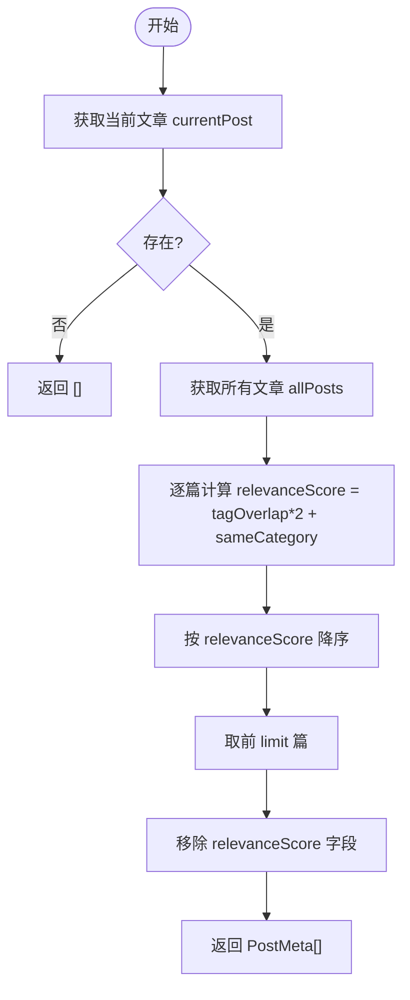
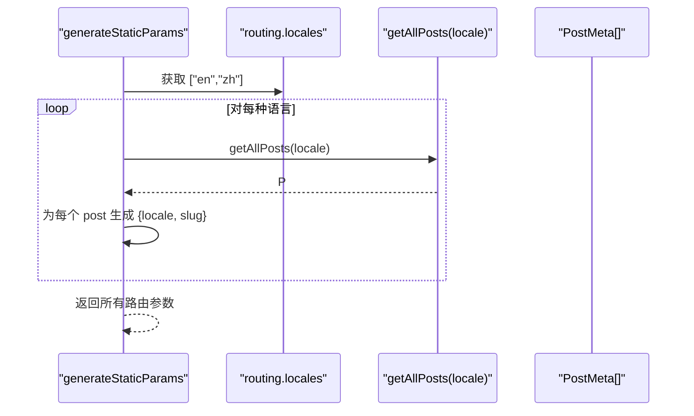
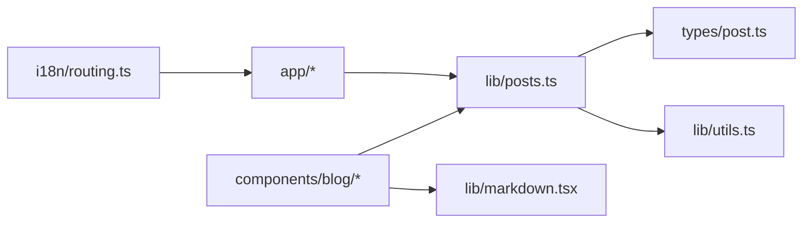

# 博客文章管理

<cite>
**本文引用的文件**   
- [lib/posts.ts](file://lib/posts.ts)
- [types/post.ts](file://types/post.ts)
- [app/[locale]/blog/page.tsx](file://app/[locale]/blog/page.tsx)
- [app/[locale]/blog/[slug]/page.tsx](file://app/[locale]/blog/[slug]/page.tsx)
- [components/blog/blog-list.tsx](file://components/blog/blog-list.tsx)
- [components/blog/blog-content.tsx](file://components/blog/blog-content.tsx)
- [lib/markdown.tsx](file://lib/markdown.tsx)
- [lib/utils.ts](file://lib/utils.ts)
- [i18n/routing.ts](file://i18n/routing.ts)
- [messages/zh.json](file://messages/zh.json)
- [messages/en.json](file://messages/en.json)
- [content/posts/zh/superpowers.md](file://content/posts/zh/superpowers.md)
- [content/posts/en/superpowers.md](file://content/posts/en/superpowers.md)
- [content/posts/zh/spec-coding.md](file://content/posts/zh/spec-coding.md)
- [content/posts/en/spec-coding.md](file://content/posts/en/spec-coding.md)
</cite>

## 目录
1. [简介](#简介)
2. [项目结构](#项目结构)
3. [核心组件](#核心组件)
4. [架构总览](#架构总览)
5. [详细组件分析](#详细组件分析)
6. [依赖分析](#依赖分析)
7. [性能考虑](#性能考虑)
8. [故障排查指南](#故障排查指南)
9. [结论](#结论)
10. [附录](#附录)

## 简介
本文件面向内容创作者与开发者，系统化说明基于 Markdown 的博客文章系统：从 frontmatter 规范、元数据定义、标签与分类体系，到核心函数 getAllPosts、getPostBySlug、getRelatedPosts 的使用方式；并覆盖图片资源引用、阅读时间计算、多语言同步机制以及相关文章推荐算法的实现原理与实践示例。目标是帮助你在 content/posts 下高效创作与维护中英双语文章，同时保证 SEO、可访问性与性能表现。

## 项目结构
博客文章采用“按语言分目录 + 按 slug 命名”的静态内容组织方式：
- 内容根目录：content/posts
- 语言子目录：zh、en
- 每篇文章以 .md 结尾，文件名即为 slug（如 superpowers.md）
- frontmatter 位于每个 .md 文件顶部，用于声明标题、描述、封面图、日期、标签、分类、作者、slug、是否发布等元信息

图表来源
- [lib/posts.ts:15-121](file://lib/posts.ts#L15-L121)
- [app/[locale]/blog/page.tsx:25-33](file://app/[locale]/blog/page.tsx#L25-L33)
- [app/[locale]/blog/[slug]/page.tsx:110-127](file://app/[locale]/blog/[slug]/page.tsx#L110-L127)
- [components/blog/blog-list.tsx:19-33](file://components/blog/blog-list.tsx#L19-L33)
- [components/blog/blog-content.tsx:25-33](file://components/blog/blog-content.tsx#L25-L33)

章节来源
- [lib/posts.ts:1-121](file://lib/posts.ts#L1-121)
- [app/[locale]/blog/page.tsx:1-34](file://app/[locale]/blog/page.tsx#L1-34)
- [app/[locale]/blog/[slug]/page.tsx:1-180](file://app/[locale]/blog/[slug]/page.tsx#L1-180)
- [components/blog/blog-list.tsx:1-416](file://components/blog/blog-list.tsx#L1-416)
- [components/blog/blog-content.tsx:1-254](file://components/blog/blog-content.tsx#L1-254)

## 核心组件
- 文章数据层
  - getAllPosts(locale): 读取指定语言目录下所有 .md 文件，解析 frontmatter，过滤未发布文章，按发布时间倒序返回文章元数据列表。
  - getPostBySlug(slug, locale): 根据 slug 和语言加载单篇文章，返回包含正文内容的完整文章对象。
  - getRelatedPosts(currentSlug, locale, limit=3): 基于当前文章的标签与分类，计算相关度得分，返回最相关的若干文章元数据。
- 类型定义
  - PostFrontmatter: frontmatter 字段契约（title、description、coverImage、date、tags、category、author、slug、published）。
  - Post: 在 PostFrontmatter 基础上增加 content、readingTime。
  - PostMeta: 在 PostFrontmatter 基础上增加 readingTime。
- 渲染与展示
  - BlogList: 文章列表页，支持搜索、标签筛选、分类侧边栏与移动端横向筛选条。
  - BlogContent: 文章详情页，渲染封面、元信息、目录、正文、标签、分类入口、评论与相关文章。
  - MarkdownRenderer: 基于 react-markdown 的渲染器，支持 GFM、代码块折叠/复制、高亮 HTML 注入、表格与链接样式。
- 工具与国际化
  - getAssetPath: 统一处理资源路径，兼容 GitHub Pages 部署的 basePath 前缀，且透传外部绝对地址。
  - i18n/routing: 定义支持的语言集合与默认语言。
  - messages/*.json: 界面文案与元信息配置。

章节来源
- [lib/posts.ts:15-121](file://lib/posts.ts#L15-L121)
- [types/post.ts:1-20](file://types/post.ts#L1-20)
- [components/blog/blog-list.tsx:19-33](file://components/blog/blog-list.tsx#L19-L33)
- [components/blog/blog-content.tsx:25-33](file://components/blog/blog-content.tsx#L25-L33)
- [lib/markdown.tsx:35-192](file://lib/markdown.tsx#L35-L192)
- [lib/utils.ts:16-25](file://lib/utils.ts#L16-L25)
- [i18n/routing.ts:1-6](file://i18n/routing.ts#L1-6)
- [messages/zh.json:30-60](file://messages/zh.json#L30-L60)
- [messages/en.json:30-60](file://messages/en.json#L30-L60)

## 架构总览
下图展示了从路由到数据层再到渲染层的调用链路与数据流向。

图表来源
- [app/[locale]/blog/[slug]/page.tsx:110-127](file://app/[locale]/blog/[slug]/page.tsx#L110-L127)
- [lib/posts.ts:49-121](file://lib/posts.ts#L49-L121)
- [components/blog/blog-content.tsx:170-179](file://components/blog/blog-content.tsx#L170-L179)
- [lib/markdown.tsx:35-192](file://lib/markdown.tsx#L35-L192)

## 详细组件分析

### Frontmatter 语法与元数据规范
- 位置：每个 .md 文件顶部，使用 --- 包裹的 YAML 块
- 必填字段
  - title: 文章标题
  - description: 文章摘要（用于 SEO 与卡片展示）
  - date: 发布日期（ISO 字符串或可被 Date 解析的格式）
  - tags: 标签数组（字符串）
  - category: 分类名称（字符串）
  - author: 作者名
  - slug: 文章唯一标识（对应 URL 路径）
- 可选字段
  - coverImage: 封面图路径（相对路径或外部 URL）
  - published: 是否发布（布尔值，默认视为已发布）
- 示例参考
  - 中文示例：[content/posts/zh/superpowers.md:1-10](file://content/posts/zh/superpowers.md#L1-L10)
  - 英文示例：[content/posts/en/superpowers.md:1-10](file://content/posts/en/superpowers.md#L1-L10)

章节来源
- [content/posts/zh/superpowers.md:1-10](file://content/posts/zh/superpowers.md#L1-L10)
- [content/posts/en/superpowers.md:1-10](file://content/posts/en/superpowers.md#L1-L10)
- [types/post.ts:1-11](file://types/post.ts#L1-11)

### 文章元数据与类型模型
- PostFrontmatter：定义 frontmatter 字段契约
- Post：扩展 PostFrontmatter，增加 content 与 readingTime
- PostMeta：扩展 PostFrontmatter，仅包含 readingTime（用于列表与推荐）

图表来源
- [types/post.ts:1-20](file://types/post.ts#L1-20)

章节来源
- [types/post.ts:1-20](file://types/post.ts#L1-20)

### 标签与分类系统实现
- 获取全部标签：getAllTags(locale) 聚合所有文章的 tags 去重排序
- 获取全部分类：getAllCategories(locale) 聚合所有文章的 category 去重排序
- 按标签筛选：getPostsByTag(tag, locale)
- 按分类筛选：getPostsByCategory(category, locale)
- 前端交互：BlogList 提供标签筛选面板、分类侧边栏与移动端横向筛选条，并实时过滤结果

图表来源
- [lib/posts.ts:73-93](file://lib/posts.ts#L73-L93)
- [components/blog/blog-list.tsx:44-55](file://components/blog/blog-list.tsx#L44-L55)

章节来源
- [lib/posts.ts:73-93](file://lib/posts.ts#L73-L93)
- [components/blog/blog-list.tsx:19-55](file://components/blog/blog-list.tsx#L19-L55)

### 核心函数使用方法

#### getAllPosts(locale)
- 作用：列出指定语言的所有已发布文章元数据，按 date 降序排列
- 输入：locale（如 "zh" 或 "en"）
- 输出：PostMeta[]
- 典型用法：
  - 列表页：app/[locale]/blog/page.tsx 中调用，将 posts、tags、categories 传递给 BlogList
  - 首页或 RSS 生成时也可复用

章节来源
- [lib/posts.ts:15-47](file://lib/posts.ts#L15-L47)
- [app/[locale]/blog/page.tsx:25-33](file://app/[locale]/blog/page.tsx#L25-L33)

#### getPostBySlug(slug, locale)
- 作用：根据 slug 与语言加载单篇文章，返回包含正文与阅读时间的完整文章对象
- 输入：slug（如 "superpowers"）、locale
- 输出：Post | null（不存在时返回 null）
- 典型用法：
  - 文章详情页：app/[locale]/blog/[slug]/page.tsx 中调用，若为 null 则触发 notFound()
  - 生成静态参数 generateStaticParams 时遍历所有语言与文章生成路由

章节来源
- [lib/posts.ts:49-71](file://lib/posts.ts#L49-L71)
- [app/[locale]/blog/[slug]/page.tsx:24-35](file://app/[locale]/blog/[slug]/page.tsx#L24-35)
- [app/[locale]/blog/[slug]/page.tsx:110-117](file://app/[locale]/blog/[slug]/page.tsx#L110-L117)

#### getRelatedPosts(currentSlug, locale, limit=3)
- 作用：基于标签重叠数与同分类加分，计算相关度得分，返回 top N 相关文章元数据
- 输入：currentSlug、locale、limit（默认 3）
- 输出：PostMeta[]
- 评分规则：
  - 标签重叠数 × 2 + 是否同分类（1 或 0）
  - 按得分降序取前 limit 篇
- 典型用法：
  - 文章详情页：BlogContent 下方展示“相关文章”

图表来源
- [lib/posts.ts:95-121](file://lib/posts.ts#L95-L121)

章节来源
- [lib/posts.ts:95-121](file://lib/posts.ts#L95-L121)
- [components/blog/blog-content.tsx:222-240](file://components/blog/blog-content.tsx#L222-L240)

### 图片资源引用方式
- 相对路径：推荐使用相对于站点根的路径，例如 /images/posts/xxx.png
- 外部 URL：支持 http(s)、data: 与协议相对 // 开头的地址，将被原样透传
- 部署适配：通过 getAssetPath 自动拼接 NEXT_PUBLIC_BASE_PATH，便于 GitHub Pages 部署
- 封面图：frontmatter 中的 coverImage 会被转换为最终可用路径

章节来源
- [lib/utils.ts:16-25](file://lib/utils.ts#L16-L25)
- [lib/posts.ts:34-41](file://lib/posts.ts#L34-L41)
- [content/posts/zh/spec-coding.md:4](file://content/posts/zh/spec-coding.md#L4)
- [content/posts/en/spec-coding.md:4](file://content/posts/en/spec-coding.md#L4)

### 阅读时间计算逻辑
- 算法：统计正文词数（按空白分割），除以每分钟 200 词，向上取整得到分钟数
- 应用：
  - 列表项与详情页均显示阅读时间
  - 由 getAllPosts 与 getPostBySlug 分别计算并写入 readingTime

章节来源
- [lib/posts.ts:9-13](file://lib/posts.ts#L9-L13)
- [lib/posts.ts:40-41](file://lib/posts.ts#L40-L41)
- [lib/posts.ts:66-67](file://lib/posts.ts#L66-L67)
- [components/blog/blog-content.tsx:98-101](file://components/blog/blog-content.tsx#L98-L101)

### 多语言文章同步机制
- 目录结构：content/posts/{locale}/{slug}.md，同一 slug 在不同语言目录下即构成多语言版本
- 路由与静态生成：generateStaticParams 遍历 routing.locales 与各语言文章，生成所有语言的详情页路由
- 元信息与 SEO：详情页根据当前 locale 与 alternateLanguages 构建 canonical 与 alternates.languages，支持 en-US 作为 x-default
- 切换与默认：routing.defaultLocale 指定默认语言，messages 文件提供界面文案

图表来源
- [app/[locale]/blog/[slug]/page.tsx:24-35](file://app/[locale]/blog/[slug]/page.tsx#L24-35)
- [i18n/routing.ts:1-6](file://i18n/routing.ts#L1-6)
- [lib/posts.ts:15-47](file://lib/posts.ts#L15-L47)

章节来源
- [app/[locale]/blog/[slug]/page.tsx:24-35](file://app/[locale]/blog/[slug]/page.tsx#L24-35)
- [i18n/routing.ts:1-6](file://i18n/routing.ts#L1-6)
- [messages/zh.json:145-166](file://messages/zh.json#L145-L166)
- [messages/en.json:145-166](file://messages/en.json#L145-L166)

### 相关文章推荐算法实现原理与使用示例
- 原理
  - 标签权重：与当前文章共享的标签数量 × 2
  - 分类权重：与当前文章同分类 +1
  - 总分 = 标签权重 + 分类权重
  - 排序：按总分降序，截取前 limit 篇
- 使用示例
  - 在文章详情页调用 getRelatedPosts(slug, locale)，将结果传给 BlogContent 渲染“相关文章”区块
  - 可通过调整权重系数或引入更多维度（如发布时间衰减、共现频率）进一步优化

章节来源
- [lib/posts.ts:95-121](file://lib/posts.ts#L95-L121)
- [components/blog/blog-content.tsx:222-240](file://components/blog/blog-content.tsx#L222-L240)

### 文章创作模板与维护清单
- 建议模板（frontmatter 字段）
  - title、description、coverImage、date、tags、category、author、slug、published
- 维护清单
  - 新增文章：在 content/posts/{locale}/ 下创建 {slug}.md，填写 frontmatter
  - 更新文章：修改对应语言下的 .md 文件
  - 多语言同步：保持不同语言下相同 slug，确保路由与 SEO 正确
  - 图片资源：优先使用 /images/posts/ 下的相对路径，必要时使用外部 URL
  - 发布控制：设置 published=false 可临时隐藏文章

章节来源
- [content/posts/zh/superpowers.md:1-10](file://content/posts/zh/superpowers.md#L1-L10)
- [content/posts/en/superpowers.md:1-10](file://content/posts/en/superpowers.md#L1-L10)
- [lib/posts.ts:43-44](file://lib/posts.ts#L43-L44)

### 正文渲染与代码块体验
- Markdown 渲染：支持 GFM、表格、链接、图片懒加载
- 代码块：
  - 支持折叠（行数超过阈值时）
  - 支持一键复制
  - 支持服务端高亮 HTML 注入（通过 highlightedCode）
- 目录：根据标题自动生成 TOC，右侧固定导航

章节来源
- [lib/markdown.tsx:35-192](file://lib/markdown.tsx#L35-L192)
- [components/blog/blog-content.tsx:170-179](file://components/blog/blog-content.tsx#L170-L179)

## 依赖分析
- 模块耦合
  - app 层依赖 lib/posts.ts 进行数据读取
  - components 层依赖 types/post.ts 的类型定义与 lib/markdown.tsx 的渲染能力
  - utils 提供路径处理，posts 层依赖其进行资源路径规范化
- 外部依赖
  - gray-matter：解析 frontmatter
  - react-markdown + remark-gfm：渲染 Markdown
  - next-intl：国际化与路由配置

图表来源
- [lib/posts.ts:1-6](file://lib/posts.ts#L1-6)
- [lib/markdown.tsx:1-6](file://lib/markdown.tsx#L1-6)
- [i18n/routing.ts:1-6](file://i18n/routing.ts#L1-6)

章节来源
- [lib/posts.ts:1-6](file://lib/posts.ts#L1-6)
- [lib/markdown.tsx:1-6](file://lib/markdown.tsx#L1-6)
- [i18n/routing.ts:1-6](file://i18n/routing.ts#L1-6)

## 性能考虑
- 静态生成
  - generateStaticParams 预生成所有语言与文章的路由，减少运行时 IO
- 文件系统读取
  - getAllPosts 与 getPostBySlug 使用同步读取，适合构建期或低并发场景；生产环境建议结合缓存或增量构建优化
- 列表过滤
  - BlogList 在前端进行内存过滤与排序，适用于中小规模文章量；大规模时可考虑服务端分页或索引
- 图片与资源
  - 使用 getAssetPath 避免重复拼接与错误路径；大图建议压缩与懒加载

[本节为通用指导，不直接分析具体文件]

## 故障排查指南
- 文章无法显示
  - 检查 frontmatter 是否缺失必填字段（title、date、tags、category、author、slug）
  - 确认 published 是否为 false（会导致过滤掉）
  - 确认 slug 与文件名一致，且所在语言目录正确
- 封面图不显示
  - 检查 coverImage 路径是否正确，或使用外部 URL
  - 若部署在子路径，确认 NEXT_PUBLIC_BASE_PATH 配置
- 多语言路由缺失
  - 确认 content/posts/{locale}/{slug}.md 是否存在
  - 检查 routing.locales 是否包含目标语言
- 相关文章为空
  - 检查当前文章是否有 tags 与 category
  - 确认其他文章与其有标签重叠或同分类

章节来源
- [lib/posts.ts:43-44](file://lib/posts.ts#L43-L44)
- [lib/posts.ts:18-20](file://lib/posts.ts#L18-L20)
- [lib/posts.ts:49-71](file://lib/posts.ts#L49-L71)
- [lib/utils.ts:16-25](file://lib/utils.ts#L16-L25)
- [i18n/routing.ts:1-6](file://i18n/routing.ts#L1-6)

## 结论
本博客系统以简洁的 Markdown + frontmatter 为核心，配合 Next.js 的静态生成与国际化能力，实现了高效的内容管理与良好的用户体验。通过统一的类型定义、清晰的函数职责与完善的渲染组件，内容创作者可以专注于写作，而系统负责展示、SEO 与多语言同步。推荐在后续迭代中引入缓存、服务端分页与更丰富的推荐策略，以进一步提升性能与个性化体验。

[本节为总结性内容，不直接分析具体文件]

## 附录
- 常用命令与流程
  - 新建文章：在 content/posts/{locale}/ 下创建 {slug}.md，填写 frontmatter
  - 预览与构建：运行开发服务器查看效果，构建时自动生成路由与静态资源
  - 多语言同步：保持不同语言下相同 slug，确保路由与 SEO 正确
- 参考示例
  - 中文示例：[content/posts/zh/superpowers.md:1-10](file://content/posts/zh/superpowers.md#L1-L10)
  - 英文示例：[content/posts/en/superpowers.md:1-10](file://content/posts/en/superpowers.md#L1-L10)
  - 带封面图示例：[content/posts/zh/spec-coding.md](file://content/posts/zh/spec-coding.md#L4)

章节来源
- [content/posts/zh/superpowers.md:1-10](file://content/posts/zh/superpowers.md#L1-L10)
- [content/posts/en/superpowers.md:1-10](file://content/posts/en/superpowers.md#L1-L10)
- [content/posts/zh/spec-coding.md:4](file://content/posts/zh/spec-coding.md#L4)