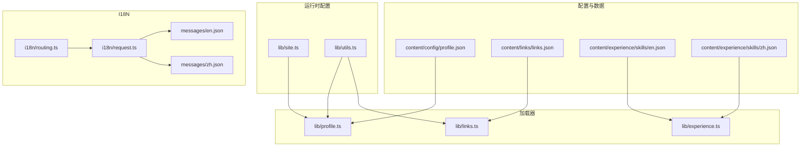
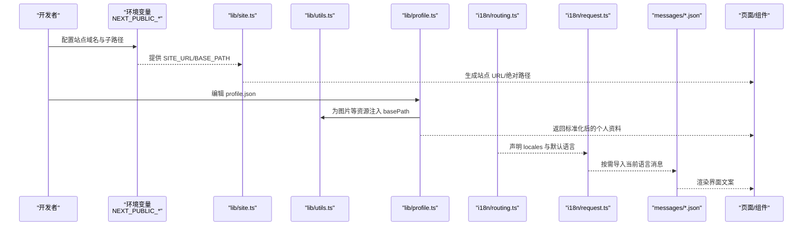
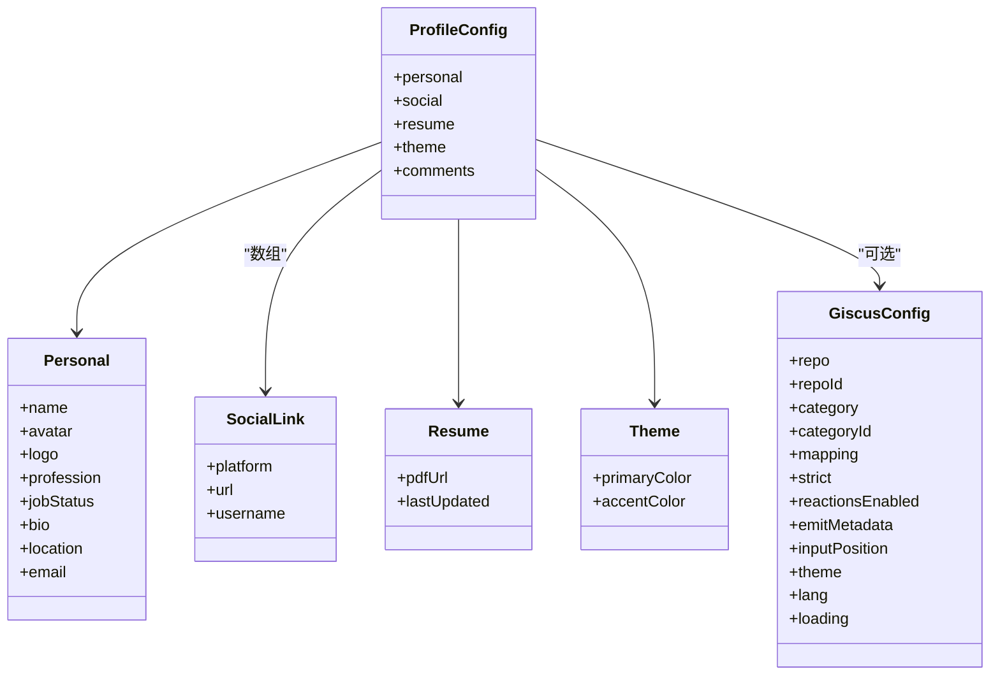
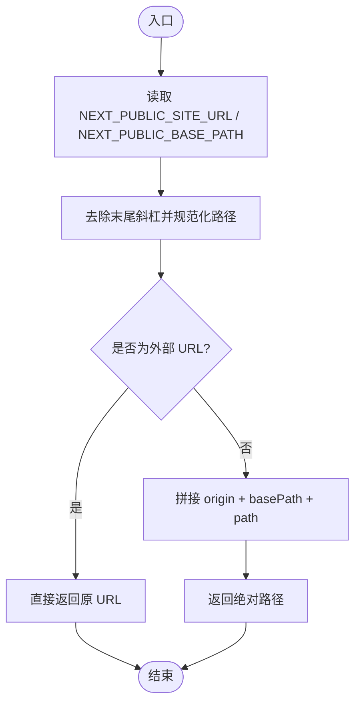
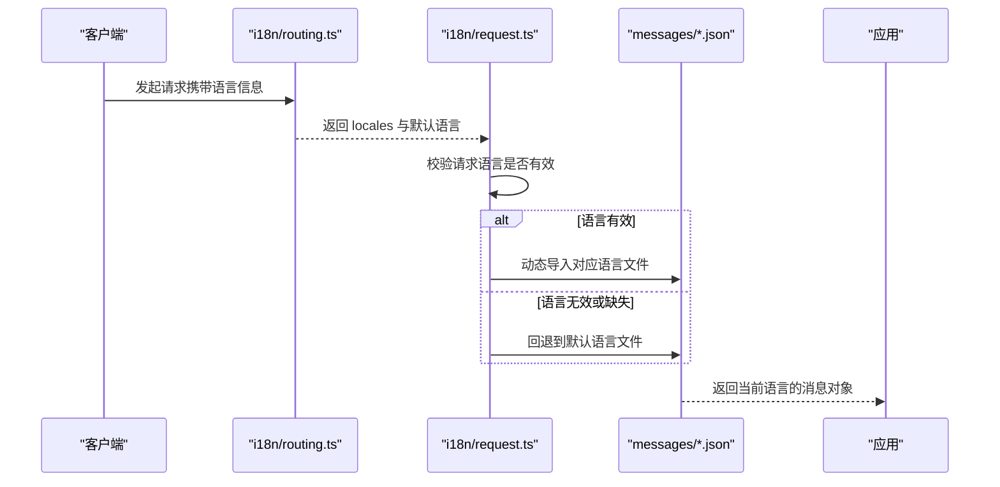
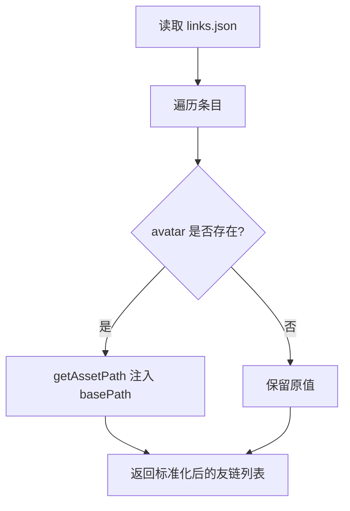
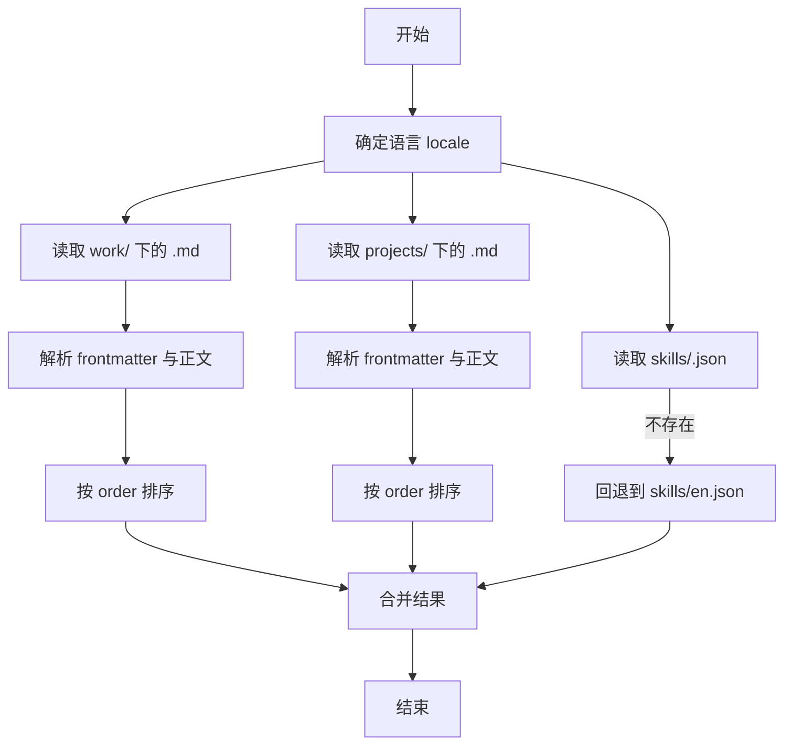
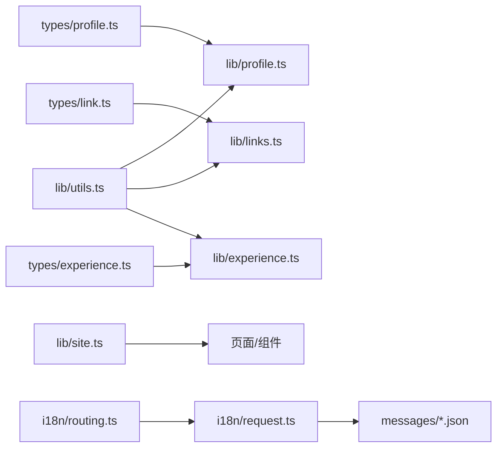

# 配置文件管理

<cite>
**本文引用的文件**   
- [profile.json](file://content/config/profile.json)
- [site.ts](file://lib/site.ts)
- [en.json](file://messages/en.json)
- [zh.json](file://messages/zh.json)
- [routing.ts](file://i18n/routing.ts)
- [request.ts](file://i18n/request.ts)
- [profile.ts](file://lib/profile.ts)
- [utils.ts](file://lib/utils.ts)
- [links.json](file://content/links/links.json)
- [links.ts](file://lib/links.ts)
- [experience.ts](file://lib/experience.ts)
- [en.json（技能）](file://content/experience/skills/en.json)
- [zh.json（技能）](file://content/experience/skills/zh.json)
- [profile.ts（类型）](file://types/profile.ts)
- [link.ts（类型）](file://types/link.ts)
- [experience.ts（类型）](file://types/experience.ts)
</cite>

## 目录
1. [简介](#简介)
2. [项目结构](#项目结构)
3. [核心组件](#核心组件)
4. [架构总览](#架构总览)
5. [详细组件分析](#详细组件分析)
6. [依赖关系分析](#依赖关系分析)
7. [性能与可维护性](#性能与可维护性)
8. [故障排查指南](#故障排查指南)
9. [结论](#结论)
10. [附录：最佳实践与版本管理](#附录最佳实践与版本管理)

## 简介
本文件面向开发者与维护者，系统化说明站点配置体系的结构、字段含义、验证规则、默认值与扩展机制，覆盖以下关键内容：
- 个人全局配置 profile.json 的字段与用途
- 站点运行期配置 site.ts 的环境变量与路径拼接策略
- 多语言消息文件的组织方式与新语言添加流程
- 友链与技能等数据型配置的读取与处理
- 配置项校验建议、默认值设置与扩展点
- 国际化资源管理与最佳实践
- 版本管理与协作规范

## 项目结构
站点配置相关的关键位置如下：
- content/config/profile.json：个人与站点主题、评论等全局配置
- lib/site.ts：站点 URL、BasePath 等运行时配置工具
- messages/*.json：界面文案的多语言资源
- i18n/routing.ts、i18n/request.ts：next-intl 路由与请求级语言解析
- content/links/links.json：友链数据
- content/experience/skills/{locale}.json：技能数据（按语言分文件）
- lib/profile.ts、lib/links.ts、lib/experience.ts：对应数据的加载与路径处理
- types/*：各配置的数据类型定义

图示来源
- [profile.json:1-66](file://content/config/profile.json#L1-L66)
- [site.ts:1-35](file://lib/site.ts#L1-L35)
- [utils.ts:1-26](file://lib/utils.ts#L1-L26)
- [routing.ts:1-6](file://i18n/routing.ts#L1-L6)
- [request.ts:1-15](file://i18n/request.ts#L1-L15)
- [en.json:1-168](file://messages/en.json#L1-L168)
- [zh.json:1-168](file://messages/zh.json#L1-L168)
- [links.json:1-24](file://content/links/links.json#L1-L24)
- [en.json（技能）:1-102](file://content/experience/skills/en.json#L1-L102)
- [zh.json（技能）:1-102](file://content/experience/skills/zh.json#L1-L102)
- [profile.ts:1-30](file://lib/profile.ts#L1-L30)
- [links.ts:1-23](file://lib/links.ts#L1-L23)
- [experience.ts:1-147](file://lib/experience.ts#L1-L147)

章节来源
- [profile.json:1-66](file://content/config/profile.json#L1-L66)
- [site.ts:1-35](file://lib/site.ts#L1-L35)
- [routing.ts:1-6](file://i18n/routing.ts#L1-L6)
- [request.ts:1-15](file://i18n/request.ts#L1-L15)
- [links.json:1-24](file://content/links/links.json#L1-L24)
- [en.json（技能）:1-102](file://content/experience/skills/en.json#L1-L102)
- [zh.json（技能）:1-102](file://content/experience/skills/zh.json#L1-L102)

## 核心组件
本节聚焦三类配置：个人全局配置、站点运行期配置、多语言消息。

- 个人全局配置（profile.json）
  - 个人基本信息：姓名、头像、Logo、职业、求职状态、简介（支持 en/zh）、所在地、邮箱
  - 社交链接：平台、URL、用户名（可选）
  - 简历：PDF 地址、最后更新时间
  - 主题：主色、强调色
  - 评论：Giscus 配置（仓库、分类、映射策略、主题、语言、加载策略等）
  - 注意：头像与 Logo 在加载时会被自动注入 basePath；PDF 由组件侧处理 basePath

- 站点运行期配置（site.ts）
  - NEXT_PUBLIC_SITE_URL：站点根地址，默认 http://localhost:3000
  - NEXT_PUBLIC_BASE_PATH：部署子路径（如 GitHub Pages），用于拼接绝对路径
  - 提供 getSiteOrigin/getBasePath/getSiteUrl/getAbsoluteUrl 等工具方法，统一处理末尾斜杠与路径规范化

- 多语言消息（messages/*.json）
  - 按语言分文件：en.json、zh.json
  - next-intl 通过 routing.ts 声明可用语言与默认语言
  - request.ts 根据请求语言动态导入对应 messages 文件

章节来源
- [profile.json:1-66](file://content/config/profile.json#L1-L66)
- [profile.ts:1-30](file://lib/profile.ts#L1-L30)
- [utils.ts:1-26](file://lib/utils.ts#L1-L26)
- [site.ts:1-35](file://lib/site.ts#L1-L35)
- [routing.ts:1-6](file://i18n/routing.ts#L1-L6)
- [request.ts:1-15](file://i18n/request.ts#L1-L15)
- [en.json:1-168](file://messages/en.json#L1-L168)
- [zh.json:1-168](file://messages/zh.json#L1-L168)

## 架构总览
下图展示配置从“静态文件/环境变量”到“应用层使用”的整体链路，包括路径修正、语言选择与资源加载。

图示来源
- [site.ts:1-35](file://lib/site.ts#L1-L35)
- [utils.ts:1-26](file://lib/utils.ts#L1-L26)
- [profile.ts:1-30](file://lib/profile.ts#L1-L30)
- [routing.ts:1-6](file://i18n/routing.ts#L1-L6)
- [request.ts:1-15](file://i18n/request.ts#L1-L15)
- [en.json:1-168](file://messages/en.json#L1-L168)
- [zh.json:1-168](file://messages/zh.json#L1-L168)

## 详细组件分析

### 个人全局配置 profile.json
- 结构与字段
  - personal：name、avatar、logo、profession、jobStatus.openToWork、jobStatus.availableFor、bio.en/zh、location、email
  - social：platform、url、username（可选）
  - resume：pdfUrl、lastUpdated
  - theme：primaryColor、accentColor
  - comments.giscus：repo、repoId、category、categoryId、mapping、strict、reactionsEnabled、emitMetadata、inputPosition、theme、lang、loading
- 字段约束与默认值
  - 类型约束见 types/profile.ts，例如 mapping 仅允许特定枚举值，inputPosition 仅 top/bottom
  - 未显式设置的可选字段将保持 undefined，组件需做好空值处理
- 路径与资源处理
  - avatar/logo 在加载时通过 getAssetPath 注入 BASE_PATH，确保部署子路径下资源正确访问
  - pdfUrl 由组件侧处理 basePath（Link 组件会自动处理，iframe 需手动处理）
- 扩展机制
  - 可在 personal/social/resume/theme/comments 下新增字段，并在 types/profile.ts 中同步扩展类型
  - 建议在组件中提供默认值或降级逻辑，避免缺失字段导致渲染异常

图示来源
- [profile.ts（类型）:1-52](file://types/profile.ts#L1-L52)
- [profile.json:1-66](file://content/config/profile.json#L1-L66)
- [profile.ts:1-30](file://lib/profile.ts#L1-L30)
- [utils.ts:1-26](file://lib/utils.ts#L1-L26)

章节来源
- [profile.json:1-66](file://content/config/profile.json#L1-L66)
- [profile.ts:1-30](file://lib/profile.ts#L1-L30)
- [profile.ts（类型）:1-52](file://types/profile.ts#L1-L52)
- [utils.ts:1-26](file://lib/utils.ts#L1-L26)

### 站点运行期配置 site.ts
- 环境变量
  - NEXT_PUBLIC_SITE_URL：站点根地址，缺省为 http://localhost:3000
  - NEXT_PUBLIC_BASE_PATH：部署子路径，缺省为空字符串
- 路径拼接策略
  - 去除末尾多余斜杠
  - 统一以 / 开头进行拼接
  - 对已包含协议的外部 URL 不做修改
- 典型用法
  - 生成 RSS、Sitemap、OG 图片等需要绝对地址的场景
  - 与 getAssetPath 配合，区分外部资源与站内资源

图示来源
- [site.ts:1-35](file://lib/site.ts#L1-L35)
- [utils.ts:1-26](file://lib/utils.ts#L1-L26)

章节来源
- [site.ts:1-35](file://lib/site.ts#L1-L35)
- [utils.ts:1-26](file://lib/utils.ts#L1-L26)

### 多语言消息与路由（next-intl）
- 路由声明
  - routing.ts 声明 locales 与 defaultLocale
- 请求级语言解析
  - request.ts 基于请求语言选择对应 messages 文件，若无效则回退到默认语言
- 消息文件
  - messages/en.json、messages/zh.json 分别存放英文与中文文案
  - 键名分层组织，便于维护与检索
- 新语言添加流程
  1) 在 routing.ts 中添加新 locale
  2) 创建 messages/<new>.json 并补齐所有必要键
  3) 在语言切换组件中注册新语言选项
  4) 构建与部署后验证路由与文案显示

图示来源
- [routing.ts:1-6](file://i18n/routing.ts#L1-L6)
- [request.ts:1-15](file://i18n/request.ts#L1-L15)
- [en.json:1-168](file://messages/en.json#L1-L168)
- [zh.json:1-168](file://messages/zh.json#L1-L168)

章节来源
- [routing.ts:1-6](file://i18n/routing.ts#L1-L6)
- [request.ts:1-15](file://i18n/request.ts#L1-L15)
- [en.json:1-168](file://messages/en.json#L1-L168)
- [zh.json:1-168](file://messages/zh.json#L1-L168)

### 友链配置 links.json
- 数据结构
  - name、description、url、avatar（可选）、category（可选）
- 加载与处理
  - lib/links.ts 读取 content/links/links.json，并对 avatar 调用 getAssetPath 注入 basePath
- 扩展建议
  - 可按需增加排序、标签等字段，并在类型 link.ts 中补充

图示来源
- [links.json:1-24](file://content/links/links.json#L1-L24)
- [links.ts:1-23](file://lib/links.ts#L1-L23)
- [utils.ts:1-26](file://lib/utils.ts#L1-L26)
- [link.ts（类型）:1-8](file://types/link.ts#L1-L8)

章节来源
- [links.json:1-24](file://content/links/links.json#L1-L24)
- [links.ts:1-23](file://lib/links.ts#L1-L23)
- [utils.ts:1-26](file://lib/utils.ts#L1-L26)
- [link.ts（类型）:1-8](file://types/link.ts#L1-L8)

### 经历与技能数据 experience.ts
- 工作/项目
  - 从 content/experience/work/<locale> 与 content/experience/projects/<locale> 读取 Markdown，解析 frontmatter 与正文
  - 支持排序字段 order，featured 标记精选项目
- 技能
  - 从 content/experience/skills/<locale>.json 读取，若无当前语言文件则回退到 en.json
- 路径处理
  - 项目封面 image 通过 getAssetPath 注入 basePath
- 类型定义
  - types/experience.ts 定义了 WorkFrontmatter、ProjectFrontmatter、SkillCategory/SkillItem 等

图示来源
- [experience.ts:1-147](file://lib/experience.ts#L1-L147)
- [en.json（技能）:1-102](file://content/experience/skills/en.json#L1-L102)
- [zh.json（技能）:1-102](file://content/experience/skills/zh.json#L1-L102)
- [experience.ts（类型）:1-48](file://types/experience.ts#L1-L48)

章节来源
- [experience.ts:1-147](file://lib/experience.ts#L1-L147)
- [en.json（技能）:1-102](file://content/experience/skills/en.json#L1-L102)
- [zh.json（技能）:1-102](file://content/experience/skills/zh.json#L1-L102)
- [experience.ts（类型）:1-48](file://types/experience.ts#L1-L48)

## 依赖关系分析
- 模块耦合
  - profile.ts 依赖 utils.ts 的路径处理与 types/profile.ts 的类型约束
  - links.ts 与 experience.ts 均依赖 utils.ts 的 getAssetPath
  - i18n 模块独立于业务配置，但被页面广泛消费
- 外部依赖
  - next-intl 负责多语言路由与消息加载
  - gray-matter 用于解析 Markdown frontmatter
- 潜在风险
  - 环境变量缺失或格式不正确会导致路径拼接异常
  - 缺少对应语言的消息文件会触发回退逻辑，需保证最小集完整

图示来源
- [profile.ts（类型）:1-52](file://types/profile.ts#L1-L52)
- [profile.ts:1-30](file://lib/profile.ts#L1-L30)
- [link.ts（类型）:1-8](file://types/link.ts#L1-L8)
- [links.ts:1-23](file://lib/links.ts#L1-L23)
- [experience.ts（类型）:1-48](file://types/experience.ts#L1-L48)
- [experience.ts:1-147](file://lib/experience.ts#L1-L147)
- [utils.ts:1-26](file://lib/utils.ts#L1-L26)
- [site.ts:1-35](file://lib/site.ts#L1-L35)
- [routing.ts:1-6](file://i18n/routing.ts#L1-L6)
- [request.ts:1-15](file://i18n/request.ts#L1-L15)
- [en.json:1-168](file://messages/en.json#L1-L168)
- [zh.json:1-168](file://messages/zh.json#L1-L168)

章节来源
- [profile.ts:1-30](file://lib/profile.ts#L1-L30)
- [links.ts:1-23](file://lib/links.ts#L1-L23)
- [experience.ts:1-147](file://lib/experience.ts#L1-L147)
- [utils.ts:1-26](file://lib/utils.ts#L1-L26)
- [site.ts:1-35](file://lib/site.ts#L1-L35)
- [routing.ts:1-6](file://i18n/routing.ts#L1-L6)
- [request.ts:1-15](file://i18n/request.ts#L1-L15)

## 性能与可维护性
- 路径处理集中化
  - 通过 getAssetPath 与 site.ts 的工具函数统一管理路径，减少重复逻辑与错误
- 按需加载多语言
  - next-intl 按需导入 messages 文件，降低首屏体积
- 数据回退策略
  - 技能数据在缺少目标语言时回退到英文，提升鲁棒性
- 建议
  - 对大型 JSON 考虑拆分与懒加载
  - 对频繁变更的配置（如主题色）可通过环境变量或远程配置中心注入

[本节为通用指导，不直接分析具体文件]

## 故障排查指南
- 部署子路径导致资源 404
  - 检查 NEXT_PUBLIC_BASE_PATH 是否正确设置
  - 确认 avatar/logo/pdfUrl 等路径是否经 getAssetPath 处理
- 多语言文案缺失
  - 确认 routing.ts 中的 locales 与实际 messages 文件一致
  - 若请求语言不在列表中，将回退到默认语言
- 友链或技能图片无法显示
  - 检查 links.json 与 skills/*.json 中的相对路径是否正确
  - 确认 getAssetPath 能正确注入 basePath
- 评论功能不可用
  - 核对 giscus 配置中的 repo/repoId/categoryId 等参数
  - 检查 mapping 与 inputPosition 等枚举值是否符合类型定义

章节来源
- [site.ts:1-35](file://lib/site.ts#L1-L35)
- [utils.ts:1-26](file://lib/utils.ts#L1-L26)
- [links.ts:1-23](file://lib/links.ts#L1-L23)
- [experience.ts:1-147](file://lib/experience.ts#L1-L147)
- [routing.ts:1-6](file://i18n/routing.ts#L1-L6)
- [request.ts:1-15](file://i18n/request.ts#L1-L15)
- [profile.ts（类型）:1-52](file://types/profile.ts#L1-L52)

## 结论
本项目采用“静态配置 + 运行时工具 + 多语言资源”的分层设计，结合类型定义与路径处理工具，实现了高内聚、低耦合的配置管理体系。通过环境变量与 basePath 的统一处理，站点在不同部署环境下具备良好的一致性；通过 next-intl 的按需加载与回退策略，多语言体验稳定可靠。遵循本文的最佳实践与版本管理策略，可进一步提升可维护性与团队协作效率。

[本节为总结性内容，不直接分析具体文件]

## 附录：最佳实践与版本管理
- 配置项校验与默认值
  - 在 types/* 中严格定义字段类型与枚举值
  - 在加载器中提供默认值与空值保护，避免组件崩溃
- 扩展机制
  - 新增配置字段时，同步更新类型定义与加载器
  - 对敏感或环境相关配置优先使用环境变量
- 国际化消息管理
  - 新增语言时，先在 routing.ts 声明，再创建对应 messages 文件，补齐所有必要键
  - 对可复用的文案抽取为公共键，减少重复
- 版本管理策略
  - 将 profile.json、links.json、skills/*.json 纳入版本控制，提交前执行 lint 与类型检查
  - 对重大配置变更使用语义化版本与变更日志
  - 在 CI 中校验环境变量与必填字段，防止遗漏

[本节为通用指导，不直接分析具体文件]