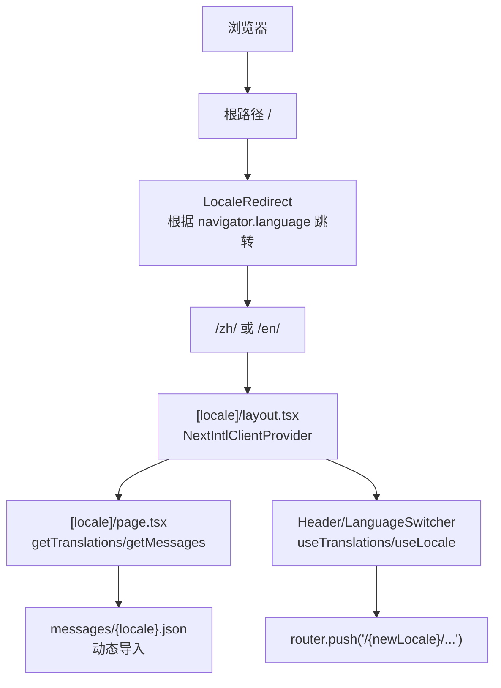
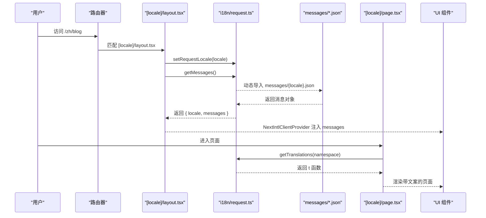
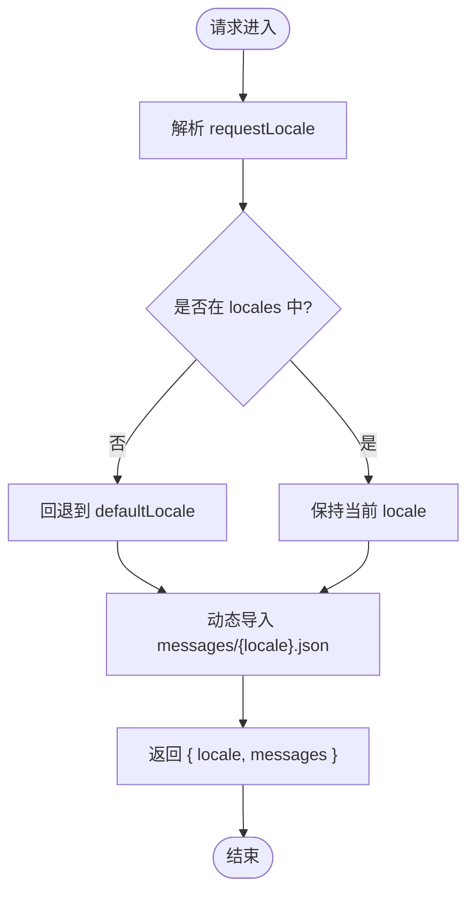
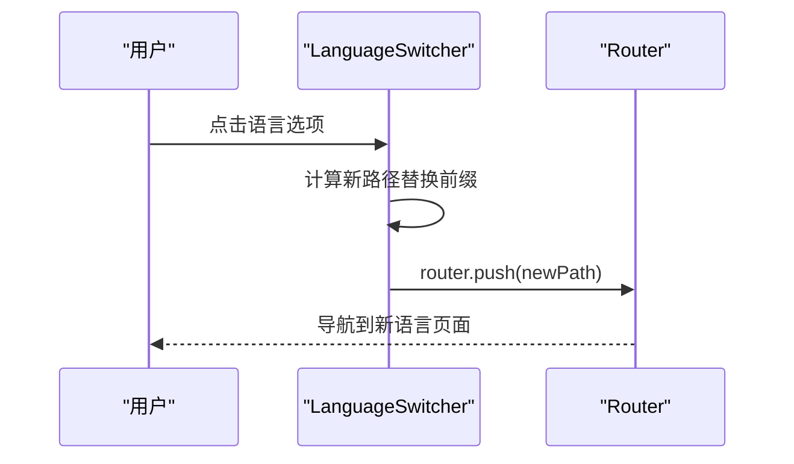
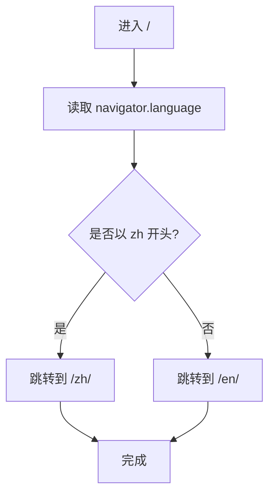
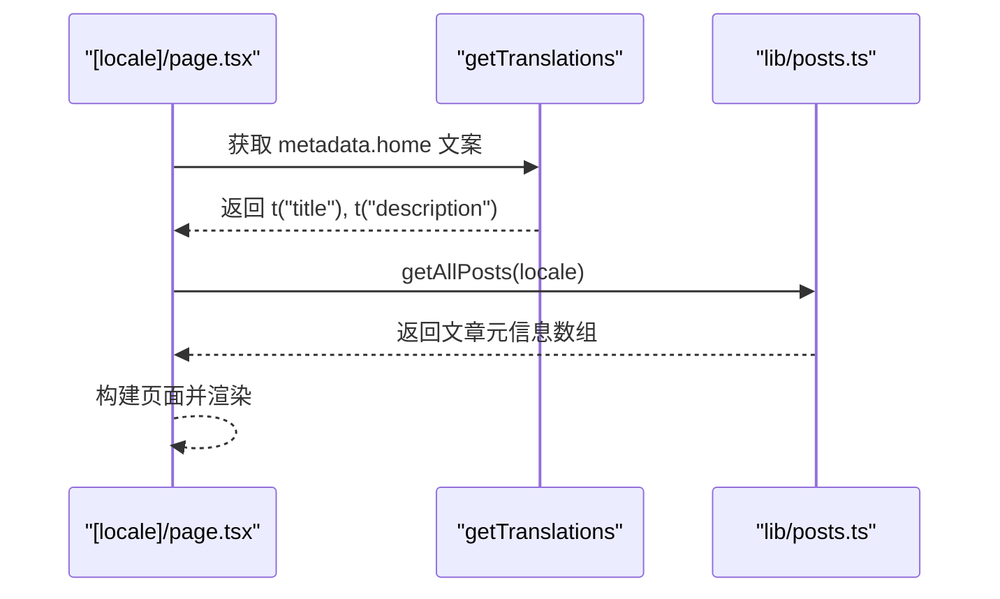
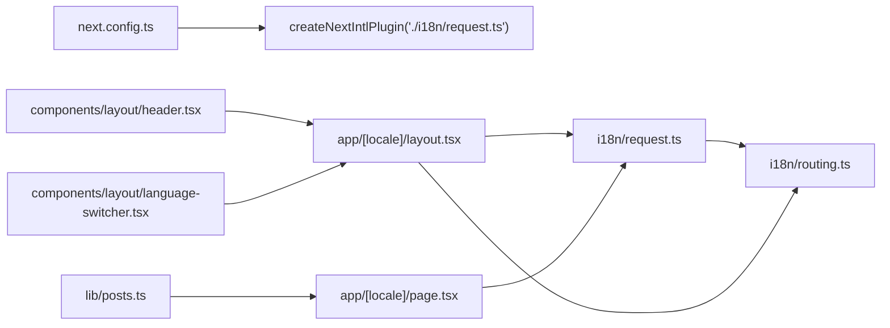

# 国际化系统

<cite>
**本文引用的文件**   
- [i18n/request.ts](file://i18n/request.ts)
- [i18n/routing.ts](file://i18n/routing.ts)
- [messages/en.json](file://messages/en.json)
- [messages/zh.json](file://messages/zh.json)
- [app/[locale]/layout.tsx](file://app/[locale]/layout.tsx)
- [app/[locale]/page.tsx](file://app/[locale]/page.tsx)
- [components/layout/language-switcher.tsx](file://components/layout/language-switcher.tsx)
- [components/layout/header.tsx](file://components/layout/header.tsx)
- [components/layout/locale-redirect.tsx](file://components/layout/locale-redirect.tsx)
- [app/[locale]/not-found.tsx](file://app/[locale]/not-found.tsx)
- [next.config.ts](file://next.config.ts)
- [package.json](file://package.json)
- [lib/posts.ts](file://lib/posts.ts)
</cite>

## 目录
1. [简介](#简介)
2. [项目结构](#项目结构)
3. [核心组件](#核心组件)
4. [架构总览](#架构总览)
5. [详细组件分析](#详细组件分析)
6. [依赖关系分析](#依赖关系分析)
7. [性能与可维护性](#性能与可维护性)
8. [故障排查指南](#故障排查指南)
9. [结论](#结论)
10. [附录：新增语言流程与最佳实践](#附录新增语言流程与最佳实践)

## 简介
本文件系统性地梳理基于 next-intl 的国际化实现，覆盖路由前缀、消息文件管理、动态内容翻译、语言切换机制，以及复数、日期格式化等常见问题的解决方案。文档面向开发者，提供从配置到落地的完整指导，并给出可视化架构图与流程图，帮助快速理解与维护。

## 项目结构
该项目的国际化采用“路径前缀 + 客户端 Provider + 服务端消息加载”的组合方案：
- 路由层：通过 app/[locale] 动态段承载多语言路由；默认语言为 en，支持 zh。
- 请求层：使用 next-intl/server 的 getRequestConfig 在每次请求时解析 locale 并动态导入对应 messages。
- 客户端层：NextIntlClientProvider 包裹布局，useTranslations/useLocale/usePathname 等 Hook 在组件中消费。
- 语言切换：LanguageSwitcher 通过 router.push 修改 URL 前缀完成切换。
- 根路由重定向：根路径 / 会跳转到浏览器语言对应的 /zh/ 或 /en/。

图示来源
- [components/layout/locale-redirect.tsx:1-19](file://components/layout/locale-redirect.tsx#L1-L19)
- [app/[locale]/layout.tsx:1-64](file://app/[locale]/layout.tsx#L1-L64)
- [app/[locale]/page.tsx:1-37](file://app/[locale]/page.tsx#L1-L37)
- [i18n/request.ts:1-15](file://i18n/request.ts#L1-L15)
- [components/layout/language-switcher.tsx:1-53](file://components/layout/language-switcher.tsx#L1-L53)

章节来源
- [i18n/routing.ts:1-6](file://i18n/routing.ts#L1-L6)
- [i18n/request.ts:1-15](file://i18n/request.ts#L1-L15)
- [app/[locale]/layout.tsx:1-64](file://app/[locale]/layout.tsx#L1-L64)
- [components/layout/language-switcher.tsx:1-53](file://components/layout/language-switcher.tsx#L1-L53)
- [components/layout/locale-redirect.tsx:1-19](file://components/layout/locale-redirect.tsx#L1-L19)

## 核心组件
- 路由定义与默认语言
  - 通过 defineRouting 声明 locales 与 defaultLocale，作为全局语言白名单与兜底策略。
- 请求期消息加载
  - getRequestConfig 在请求时解析 requestLocale，校验是否在 locales 内，否则回退到 defaultLocale，并动态 import 对应 messages JSON。
- 客户端 Provider
  - NextIntlClientProvider 注入 messages，使 useTranslations/useLocale 可用。
- 语言切换器
  - LanguageSwitcher 读取当前 locale 与 pathname，拼接新路径并 push，实现无刷新切换。
- 根路径重定向
  - LocaleRedirect 根据浏览器语言选择 /zh/ 或 /en/，提升首次访问体验。
- 页面元信息与动态内容
  - 页面级 generateMetadata 与服务端函数中使用 getTranslations 获取命名空间下的文案，用于 SEO 与 SSR。

章节来源
- [i18n/routing.ts:1-6](file://i18n/routing.ts#L1-L6)
- [i18n/request.ts:1-15](file://i18n/request.ts#L1-L15)
- [app/[locale]/layout.tsx:1-64](file://app/[locale]/layout.tsx#L1-L64)
- [components/layout/language-switcher.tsx:1-53](file://components/layout/language-switcher.tsx#L1-L53)
- [components/layout/locale-redirect.tsx:1-19](file://components/layout/locale-redirect.tsx#L1-L19)
- [app/[locale]/page.tsx:1-37](file://app/[locale]/page.tsx#L1-L37)

## 架构总览
下图展示了从请求到渲染的关键链路，包括路由解析、消息加载、客户端 Provider 注入与 UI 消费。

图示来源
- [app/[locale]/layout.tsx:1-64](file://app/[locale]/layout.tsx#L1-L64)
- [i18n/request.ts:1-15](file://i18n/request.ts#L1-L15)
- [app/[locale]/page.tsx:1-37](file://app/[locale]/page.tsx#L1-L37)

## 详细组件分析

### 路由与请求配置
- 路由定义
  - 声明支持的 locales 与默认语言，供静态参数生成与校验使用。
- 请求期配置
  - 解析 requestLocale，若不在 locales 则回退到 defaultLocale。
  - 动态导入 messages/{locale}.json，避免未使用语言的打包体积。
- 布局层集成
  - 校验 locale 是否合法，不合法返回 notFound。
  - setRequestLocale 启用静态渲染优化。
  - getMessages 获取消息并通过 NextIntlClientProvider 注入。

图示来源
- [i18n/routing.ts:1-6](file://i18n/routing.ts#L1-L6)
- [i18n/request.ts:1-15](file://i18n/request.ts#L1-L15)
- [app/[locale]/layout.tsx:1-64](file://app/[locale]/layout.tsx#L1-L64)

章节来源
- [i18n/routing.ts:1-6](file://i18n/routing.ts#L1-L6)
- [i18n/request.ts:1-15](file://i18n/request.ts#L1-L15)
- [app/[locale]/layout.tsx:1-64](file://app/[locale]/layout.tsx#L1-L64)

### 客户端语言切换
- 行为
  - 读取当前 locale 与 pathname，去除已有语言前缀后拼接新语言前缀，再调用 router.push 导航。
- 交互
  - 下拉菜单展示语言列表，高亮当前语言项。
- 注意事项
  - 需确保所有页面均位于 [locale] 下，以保证链接正确携带语言前缀。

图示来源
- [components/layout/language-switcher.tsx:1-53](file://components/layout/language-switcher.tsx#L1-L53)

章节来源
- [components/layout/language-switcher.tsx:1-53](file://components/layout/language-switcher.tsx#L1-L53)

### 根路径自动重定向
- 行为
  - 读取 navigator.language，按 zh 或 en 选择目标路径，使用 window.location.replace 进行跳转。
- 适用场景
  - 提升新用户的首访体验，减少手动选择语言步骤。

图示来源
- [components/layout/locale-redirect.tsx:1-19](file://components/layout/locale-redirect.tsx#L1-L19)

章节来源
- [components/layout/locale-redirect.tsx:1-19](file://components/layout/locale-redirect.tsx#L1-L19)

### 页面元信息与动态内容
- 服务端元信息
  - 使用 getTranslations({ namespace }) 获取 metadata 命名空间下的标题与描述，配合 buildPageMetadata 输出 SEO 元数据。
- 动态内容
  - 文章列表与详情通过 lib/posts.ts 按 locale 读取 content/posts/{locale} 下的 Markdown，结合 frontmatter 渲染。

图示来源
- [app/[locale]/page.tsx:1-37](file://app/[locale]/page.tsx#L1-L37)
- [lib/posts.ts:1-121](file://lib/posts.ts#L1-L121)

章节来源
- [app/[locale]/page.tsx:1-37](file://app/[locale]/page.tsx#L1-L37)
- [lib/posts.ts:1-121](file://lib/posts.ts#L1-L121)

### 404 页面本地化
- 行为
  - 使用 useTranslations("notFound") 渲染标题、描述与返回首页按钮，链接保留当前语言前缀。

章节来源
- [app/[locale]/not-found.tsx:1-33](file://app/[locale]/not-found.tsx#L1-L33)

### 头部导航与文案消费
- 行为
  - Header 使用 useTranslations("nav") 渲染导航项文案，并根据当前 pathname 高亮激活项。
- 注意
  - 导航链接统一以 `/${locale}${href}` 形式构造，保证语言前缀一致。

章节来源
- [components/layout/header.tsx:1-270](file://components/layout/header.tsx#L1-L270)

## 依赖关系分析
- 插件与版本
  - next-intl 通过 createNextIntlPlugin 注入到 next.config.ts，指向 i18n/request.ts。
  - package.json 声明 next-intl 版本，确保运行时能力。
- 模块耦合
  - routing.ts 被 request.ts 与 layout.tsx 引用，作为单一事实源。
  - language-switcher.tsx 与 header.tsx 共同消费 useTranslations/useLocale。
  - posts.ts 按 locale 读取 content/posts/{locale}，与路由语言保持一致。

图示来源
- [next.config.ts:1-38](file://next.config.ts#L1-L38)
- [i18n/request.ts:1-15](file://i18n/request.ts#L1-L15)
- [i18n/routing.ts:1-6](file://i18n/routing.ts#L1-L6)
- [app/[locale]/layout.tsx:1-64](file://app/[locale]/layout.tsx#L1-L64)
- [components/layout/header.tsx:1-270](file://components/layout/header.tsx#L1-L270)
- [components/layout/language-switcher.tsx:1-53](file://components/layout/language-switcher.tsx#L1-L53)
- [app/[locale]/page.tsx:1-37](file://app/[locale]/page.tsx#L1-L37)
- [lib/posts.ts:1-121](file://lib/posts.ts#L1-L121)

章节来源
- [next.config.ts:1-38](file://next.config.ts#L1-L38)
- [package.json:1-47](file://package.json#L1-47)

## 性能与可维护性
- 按需加载消息
  - 通过动态 import 每个 locale 的 messages JSON，避免一次性加载全部文案，减小首屏包体。
- 静态渲染优化
  - setRequestLocale 开启静态渲染，有利于预渲染与缓存。
- 路由一致性
  - 所有页面置于 [locale] 下，避免遗漏语言前缀导致切换异常。
- 资源路径
  - 通过 basePath/assetPrefix 控制部署子路径，确保 RSS、图片等资源在不同部署模式下均可正确访问。

章节来源
- [i18n/request.ts:1-15](file://i18n/request.ts#L1-L15)
- [app/[locale]/layout.tsx:1-64](file://app/[locale]/layout.tsx#L1-L64)
- [next.config.ts:1-38](file://next.config.ts#L1-L38)

## 故障排查指南
- 404 或空白页
  - 检查路由是否包含 [locale] 段，且访问路径带有语言前缀。
  - 确认 routing.locales 包含目标语言，否则会被视为非法语言触发 notFound。
- 文案缺失或未生效
  - 确认 messages/{locale}.json 中存在对应键值，命名空间与 useTranslations 一致。
  - 检查动态导入路径是否正确，是否存在拼写错误。
- 语言切换无效
  - 确认 LanguageSwitcher 中的路径替换逻辑能正确去除旧前缀并添加新前缀。
  - 检查导航链接是否统一使用 `/${locale}${href}` 格式。
- 根路径未跳转
  - 确认 LocaleRedirect 已挂载于根路径，且 NEXT_PUBLIC_BASE_PATH 与环境变量一致。
- 部署子路径问题
  - 检查 next.config.ts 的 basePath/assetPrefix 是否与部署仓库名一致。

章节来源
- [i18n/routing.ts:1-6](file://i18n/routing.ts#L1-L6)
- [i18n/request.ts:1-15](file://i18n/request.ts#L1-L15)
- [components/layout/language-switcher.tsx:1-53](file://components/layout/language-switcher.tsx#L1-L53)
- [components/layout/locale-redirect.tsx:1-19](file://components/layout/locale-redirect.tsx#L1-L19)
- [next.config.ts:1-38](file://next.config.ts#L1-L38)

## 结论
本项目基于 next-intl 实现了稳定、可扩展的多语言体系：通过路由前缀、请求期消息加载与客户端 Provider 组合，既保证了开发体验，也兼顾了性能与可维护性。建议在后续迭代中引入复数与日期格式化能力，完善类型约束与自动化校验，进一步提升国际化质量。

## 附录：新增语言流程与最佳实践

### 新增语言完整流程
- 更新路由定义
  - 在 routing.ts 中添加新语言代码至 locales，并确保 defaultLocale 合理。
- 创建消息文件
  - 在 messages/ 下新增 {locale}.json，复制现有结构并逐条翻译。
- 更新语言切换器
  - 在 LanguageSwitcher 的 locales 列表中增加新语言条目。
- 验证根路径重定向
  - 如需要，调整 LocaleRedirect 对浏览器语言的识别规则。
- 验证页面与元信息
  - 访问各页面，确认文案、SEO 元信息、RSS 与资源路径正常。
- 构建与部署
  - 运行构建脚本，检查产物中是否包含新语言的消息文件。

章节来源
- [i18n/routing.ts:1-6](file://i18n/routing.ts#L1-L6)
- [messages/en.json:1-168](file://messages/en.json#L1-L168)
- [messages/zh.json:1-168](file://messages/zh.json#L1-L168)
- [components/layout/language-switcher.tsx:1-53](file://components/layout/language-switcher.tsx#L1-L53)
- [components/layout/locale-redirect.tsx:1-19](file://components/layout/locale-redirect.tsx#L1-L19)

### 翻译文件组织结构建议
- 扁平命名空间
  - 将 UI 文案按功能域组织为命名空间（如 nav、home、blog、about、resume、experience、footer、theme、lang、notFound、metadata），便于定位与维护。
- 动态内容分离
  - 长文本与富文本（如博客正文、项目介绍）建议使用 Markdown 并按语言分目录存放，由 lib/posts.ts 等工具按 locale 读取。
- 常量与枚举
  - 标签、分类等枚举型文案建议集中管理，避免散落在多处。

章节来源
- [messages/en.json:1-168](file://messages/en.json#L1-L168)
- [messages/zh.json:1-168](file://messages/zh.json#L1-L168)
- [lib/posts.ts:1-121](file://lib/posts.ts#L1-L121)

### 国际化常见问题与解决方案
- 复数形式
  - 使用 next-intl 提供的复数处理 API（如 plural/select）替代硬编码字符串，确保不同语言形态正确。
- 日期与数字格式化
  - 使用 Intl.DateTimeFormat/NumberFormat 或 next-intl 的格式化能力，按 locale 输出符合当地习惯的格式。
- 占位符与插值
  - 使用模板占位符（如 {count}、{time}）传递动态值，避免拼接字符串导致的可读性与维护性问题。
- 命名空间隔离
  - 将 SEO 元信息、通用 UI 文案、业务文案分命名空间管理，降低耦合度。
- 类型安全
  - 为 messages 定义 TypeScript 类型，并在编译期检查缺失键与类型错误。
- 资源路径与部署
  - 在子路径部署时，确保 basePath/assetPrefix 与 NEXT_PUBLIC_BASE_PATH 一致，避免 RSS、图片等资源 404。

章节来源
- [next.config.ts:1-38](file://next.config.ts#L1-L38)
- [messages/en.json:1-168](file://messages/en.json#L1-L168)
- [messages/zh.json:1-168](file://messages/zh.json#L1-L168)