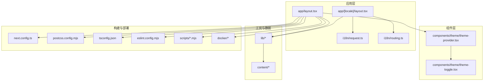
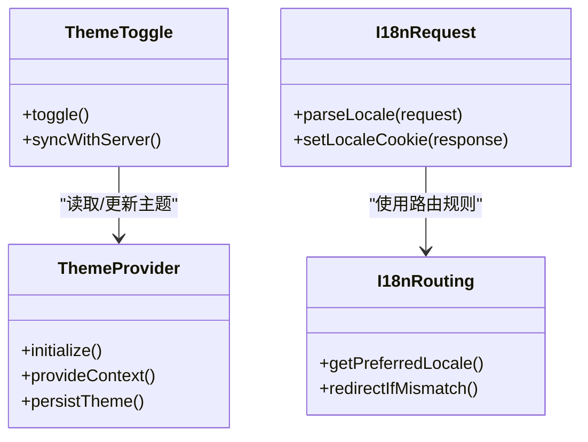
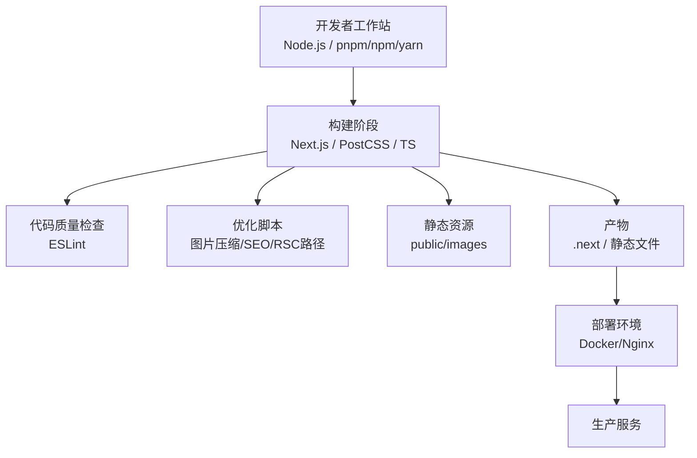
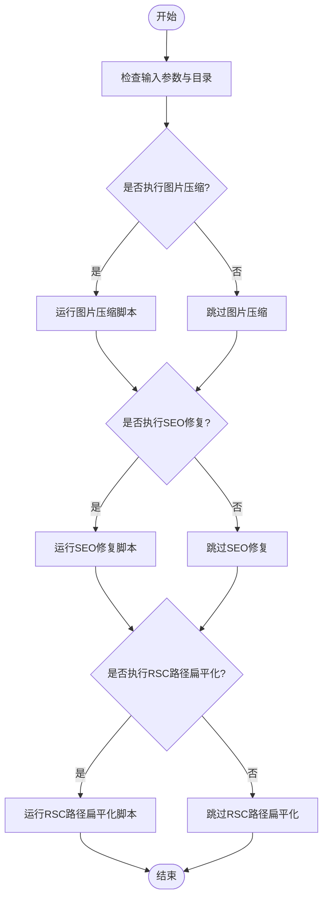

# 开发指南

<cite>
**本文引用的文件**   
- [README.md](file://README.md)
- [package.json](file://package.json)
- [eslint.config.mjs](file://eslint.config.mjs)
- [next.config.ts](file://next.config.ts)
- [postcss.config.mjs](file://postcss.config.mjs)
- [tsconfig.json](file://tsconfig.json)
- [.gitignore](file://.gitignore)
- [.github/workflows/deploy.yml.bak](file://.github/workflows/deploy.yml.bak)
- [docker/Dockerfile](file://docker/Dockerfile)
- [docker/docker-compose.yml](file://docker/docker-compose.yml)
- [docker/nginx.conf](file://docker/nginx.conf)
- [scripts/compress-images.mjs](file://scripts/compress-images.mjs)
- [scripts/fix-seo-html.mjs](file://scripts/fix-seo-html.mjs)
- [scripts/flatten-rsc-paths.mjs](file://scripts/flatten-rsc-paths.mjs)
- [app/layout.tsx](file://app/layout.tsx)
- [app/[locale]/layout.tsx](file://app/[locale]/layout.tsx)
- [i18n/request.ts](file://i18n/request.ts)
- [i18n/routing.ts](file://i18n/routing.ts)
- [components/theme/theme-provider.tsx](file://components/theme/theme-provider.tsx)
- [components/theme/theme-toggle.tsx](file://components/theme/theme-toggle.tsx)
</cite>

## 目录
1. [简介](#简介)
2. [项目结构](#项目结构)
3. [核心组件](#核心组件)
4. [架构总览](#架构总览)
5. [详细组件分析](#详细组件分析)
6. [依赖分析](#依赖分析)
7. [性能考虑](#性能考虑)
8. [故障排查指南](#故障排查指南)
9. [结论](#结论)
10. [附录](#附录)

## 简介
本指南面向新加入的开发者，提供代码规范、开发工作流程与团队协作约定，涵盖 ESLint 配置、Git 工作流、代码审查流程与版本管理策略；详细说明构建脚本、自动化任务与开发工具链配置；并提供调试技巧、性能分析与常见问题排查方法。目标是帮助团队在 Next.js 应用上高效协作、稳定交付。

## 项目结构
本项目采用基于功能分区的目录组织方式：
- app：Next.js App Router 页面与布局，包含国际化路由与站点元信息
- components：可复用 UI 与业务组件，按功能域拆分
- content：内容数据（Markdown/JSON），用于博客、经验等静态内容渲染
- i18n：国际化请求与路由配置
- lib：通用工具与数据处理逻辑
- scripts：构建期与优化脚本（图片压缩、SEO 修复、RSC 路径扁平化）
- docker：容器化部署相关配置
- types：TypeScript 类型定义
- public：静态资源

图表来源
- [app/layout.tsx:1-200](file://app/layout.tsx#L1-L200)
- [app/[locale]/layout.tsx:1-200](file://app/[locale]/layout.tsx#L1-L200)
- [i18n/request.ts:1-200](file://i18n/request.ts#L1-L200)
- [i18n/routing.ts:1-200](file://i18n/routing.ts#L1-L200)
- [components/theme/theme-provider.tsx:1-200](file://components/theme/theme-provider.tsx#L1-L200)
- [components/theme/theme-toggle.tsx:1-200](file://components/theme/theme-toggle.tsx#L1-L200)
- [next.config.ts:1-200](file://next.config.ts#L1-L200)
- [postcss.config.mjs:1-200](file://postcss.config.mjs#L1-L200)
- [tsconfig.json:1-200](file://tsconfig.json#L1-L200)
- [eslint.config.mjs:1-200](file://eslint.config.mjs#L1-L200)
- [scripts/compress-images.mjs:1-200](file://scripts/compress-images.mjs#L1-L200)
- [scripts/fix-seo-html.mjs:1-200](file://scripts/fix-seo-html.mjs#L1-L200)
- [scripts/flatten-rsc-paths.mjs:1-200](file://scripts/flatten-rsc-paths.mjs#L1-L200)
- [docker/Dockerfile:1-200](file://docker/Dockerfile#L1-L200)
- [docker/docker-compose.yml:1-200](file://docker/docker-compose.yml#L1-L200)
- [docker/nginx.conf:1-200](file://docker/nginx.conf#L1-L200)

章节来源
- [README.md:1-200](file://README.md#L1-L200)
- [package.json:1-200](file://package.json#L1-L200)

## 核心组件
本节聚焦于主题与国际化两大核心能力，说明其职责与交互关系。

- 主题提供者与切换器
  - 主题提供者负责初始化并注入主题上下文，确保全应用一致的主题状态
  - 主题切换器通过上下文更新主题状态，支持持久化到本地存储或服务器端首屏一致性
- 国际化路由与请求处理
  - 路由模块定义语言前缀与默认语言策略
  - 请求模块根据请求头或 Cookie 解析语言，并在服务端渲染时传递至页面

图表来源
- [components/theme/theme-provider.tsx:1-200](file://components/theme/theme-provider.tsx#L1-L200)
- [components/theme/theme-toggle.tsx:1-200](file://components/theme/theme-toggle.tsx#L1-L200)
- [i18n/routing.ts:1-200](file://i18n/routing.ts#L1-L200)
- [i18n/request.ts:1-200](file://i18n/request.ts#L1-L200)

章节来源
- [components/theme/theme-provider.tsx:1-200](file://components/theme/theme-provider.tsx#L1-L200)
- [components/theme/theme-toggle.tsx:1-200](file://components/theme/theme-toggle.tsx#L1-L200)
- [i18n/routing.ts:1-200](file://i18n/routing.ts#L1-L200)
- [i18n/request.ts:1-200](file://i18n/request.ts#L1-L200)

## 架构总览
整体架构围绕 Next.js App Router 展开，结合 TypeScript、ESLint、PostCSS 与 Docker 进行开发与部署。

图表来源
- [next.config.ts:1-200](file://next.config.ts#L1-L200)
- [postcss.config.mjs:1-200](file://postcss.config.mjs#L1-L200)
- [eslint.config.mjs:1-200](file://eslint.config.mjs#L1-L200)
- [scripts/compress-images.mjs:1-200](file://scripts/compress-images.mjs#L1-L200)
- [scripts/fix-seo-html.mjs:1-200](file://scripts/fix-seo-html.mjs#L1-L200)
- [scripts/flatten-rsc-paths.mjs:1-200](file://scripts/flatten-rsc-paths.mjs#L1-L200)
- [docker/Dockerfile:1-200](file://docker/Dockerfile#L1-L200)
- [docker/docker-compose.yml:1-200](file://docker/docker-compose.yml#L1-L200)
- [docker/nginx.conf:1-200](file://docker/nginx.conf#L1-L200)

## 详细组件分析

### 代码规范与工具链
- ESLint 配置
  - 统一 JavaScript/TypeScript/React 风格规则
  - 建议开启严格模式与 React Hooks 规则
  - 集成 IDE 自动格式化与保存时校验
- TypeScript 配置
  - 启用严格类型检查与路径映射
  - 为第三方库声明类型或使用 d.ts
- PostCSS 配置
  - 按需引入 Tailwind 插件与自定义处理器
  - 保持 CSS 模块化与可维护性
- 构建与运行脚本
  - 开发：热重载、增量编译
  - 构建：生成静态产物与优化资源
  - 预览：本地预览构建结果

章节来源
- [eslint.config.mjs:1-200](file://eslint.config.mjs#L1-L200)
- [tsconfig.json:1-200](file://tsconfig.json#L1-L200)
- [postcss.config.mjs:1-200](file://postcss.config.mjs#L1-L200)
- [package.json:1-200](file://package.json#L1-L200)

### Git 工作流与版本管理
- 分支模型
  - main：稳定发布分支
  - develop：集成开发分支
  - feature/*：功能分支
  - hotfix/*：紧急修复分支
- 提交规范
  - 使用约定式提交（如 feat/fix/docs/chore）
  - 提交信息清晰描述变更动机与影响范围
- 合并与发布
  - Pull Request 需至少一名审查者批准
  - 主分支保护，禁止直接推送
  - 版本号遵循语义化版本（SemVer）

章节来源
- [.gitignore:1-200](file://.gitignore#L1-L200)
- [package.json:1-200](file://package.json#L1-L200)

### 代码审查流程
- 审查清单
  - 功能正确性与边界条件
  - 可读性与可维护性
  - 性能与安全影响
  - 测试覆盖与文档更新
- 自动化检查
  - CI 中执行 ESLint、类型检查与构建
  - 失败则阻止合并
- 反馈与迭代
  - 评论具体行号与修改建议
  - 被审查方需在合理时间内响应

章节来源
- [.github/workflows/deploy.yml.bak:1-200](file://.github/workflows/deploy.yml.bak#L1-L200)
- [eslint.config.mjs:1-200](file://eslint.config.mjs#L1-L200)

### 构建脚本与自动化任务
- 图片压缩
  - 批量压缩 public/images 下资源，减少体积
- SEO 修复
  - 修正 HTML 中的元信息与结构化数据
- RSC 路径扁平化
  - 调整 RSC 相关路径以适配部署环境
- 本地与 CI 集成
  - 在构建前后执行相应脚本
  - 失败时中断流水线

图表来源
- [scripts/compress-images.mjs:1-200](file://scripts/compress-images.mjs#L1-L200)
- [scripts/fix-seo-html.mjs:1-200](file://scripts/fix-seo-html.mjs#L1-L200)
- [scripts/flatten-rsc-paths.mjs:1-200](file://scripts/flatten-rsc-paths.mjs#L1-L200)

章节来源
- [scripts/compress-images.mjs:1-200](file://scripts/compress-images.mjs#L1-L200)
- [scripts/fix-seo-html.mjs:1-200](file://scripts/fix-seo-html.mjs#L1-L200)
- [scripts/flatten-rsc-paths.mjs:1-200](file://scripts/flatten-rsc-paths.mjs#L1-L200)
- [package.json:1-200](file://package.json#L1-L200)

### 调试技巧与性能分析
- 前端调试
  - 使用浏览器开发者工具查看网络请求与资源加载
  - 利用 React DevTools 分析组件树与状态变化
- 服务端调试
  - 在 Next.js 日志中定位错误堆栈
  - 使用环境变量控制日志级别
- 性能分析
  - 使用 Lighthouse 评估性能指标
  - 关注关键渲染路径与首屏时间
  - 对图片与静态资源进行压缩与缓存优化

章节来源
- [next.config.ts:1-200](file://next.config.ts#L1-L200)
- [package.json:1-200](file://package.json#L1-L200)

### 常见问题排查
- 构建失败
  - 检查 ESLint 与 TypeScript 错误
  - 确认依赖安装完整与环境变量正确
- 运行时错误
  - 查看控制台与服务器日志
  - 验证 API 返回与数据格式
- 部署问题
  - 核对 Docker 镜像与 Nginx 配置
  - 检查端口与域名解析

章节来源
- [docker/Dockerfile:1-200](file://docker/Dockerfile#L1-L200)
- [docker/docker-compose.yml:1-200](file://docker/docker-compose.yml#L1-L200)
- [docker/nginx.conf:1-200](file://docker/nginx.conf#L1-L200)

## 依赖分析
项目依赖主要包含：
- 框架与运行时：Next.js、React、TypeScript
- 样式与工具：PostCSS、Tailwind（若启用）、ESLint
- 构建与部署：Docker、Nginx
- 脚本工具：Node.js 脚本用于资源优化与构建后处理

```mermaid
graph LR
Pkg["package.json"] --> Next["Next.js"]
Pkg --> React["React"]
Pkg --> TS["TypeScript"]
Pkg --> ESLint["ESLint"]
Pkg --> PostCSS["PostCSS"]
Pkg --> Scripts["构建脚本"]
Scripts --> Images["图片优化"]
Scripts --> SEO["SEO修复"]
Scripts --> RSC["RSC路径处理"]
Next --> Docker["Docker 镜像"]
Docker --> Nginx["Nginx 反向代理"]
```

图表来源
- [package.json:1-200](file://package.json#L1-L200)
- [next.config.ts:1-200](file://next.config.ts#L1-L200)
- [postcss.config.mjs:1-200](file://postcss.config.mjs#L1-L200)
- [eslint.config.mjs:1-200](file://eslint.config.mjs#L1-L200)
- [scripts/compress-images.mjs:1-200](file://scripts/compress-images.mjs#L1-L200)
- [scripts/fix-seo-html.mjs:1-200](file://scripts/fix-seo-html.mjs#L1-L200)
- [scripts/flatten-rsc-paths.mjs:1-200](file://scripts/flatten-rsc-paths.mjs#L1-L200)
- [docker/Dockerfile:1-200](file://docker/Dockerfile#L1-L200)
- [docker/docker-compose.yml:1-200](file://docker/docker-compose.yml#L1-L200)
- [docker/nginx.conf:1-200](file://docker/nginx.conf#L1-L200)

章节来源
- [package.json:1-200](file://package.json#L1-L200)

## 性能考虑
- 首屏优化
  - 预取关键路由与字体
  - 使用惰性加载非关键组件
- 资源优化
  - 图片压缩与懒加载
  - 静态资源缓存策略
- 构建优化
  - 启用增量构建与并行任务
  - 最小化依赖与移除未使用代码

[本节为通用指导，不直接分析具体文件]

## 故障排查指南
- 常见错误定位
  - 使用 ESLint 与 TypeScript 快速发现语法与类型问题
  - 在构建日志中搜索 Error 关键字
- 日志与监控
  - 集中收集前端与后端日志
  - 设置告警阈值与错误上报
- 回滚与恢复
  - 保留历史版本与制品
  - 制定回滚流程与演练

章节来源
- [eslint.config.mjs:1-200](file://eslint.config.mjs#L1-L200)
- [tsconfig.json:1-200](file://tsconfig.json#L1-L200)
- [docker/Dockerfile:1-200](file://docker/Dockerfile#L1-L200)

## 结论
通过统一的代码规范、清晰的 Git 工作流与完善的自动化构建，团队可以在 Next.js 应用中实现高质量、高效率的开发与交付。建议持续完善 CI/CD 与监控体系，定期回顾性能指标与最佳实践，保障产品稳定性与用户体验。

[本节为总结性内容，不直接分析具体文件]

## 附录
- 快速上手步骤
  - 安装依赖并启动开发服务器
  - 运行构建与预览命令
  - 执行脚本进行资源优化
- 常用命令参考
  - 开发、构建、预览、检查
- 环境变量与配置
  - 本地与生产环境差异
  - 敏感信息管理与安全建议

章节来源
- [package.json:1-200](file://package.json#L1-L200)
- [next.config.ts:1-200](file://next.config.ts#L1-L200)
- [docker/docker-compose.yml:1-200](file://docker/docker-compose.yml#L1-L200)