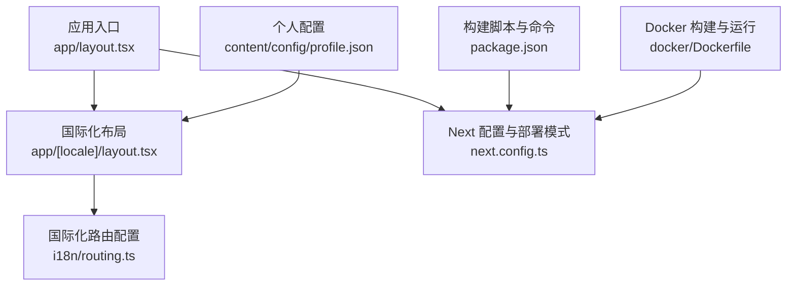
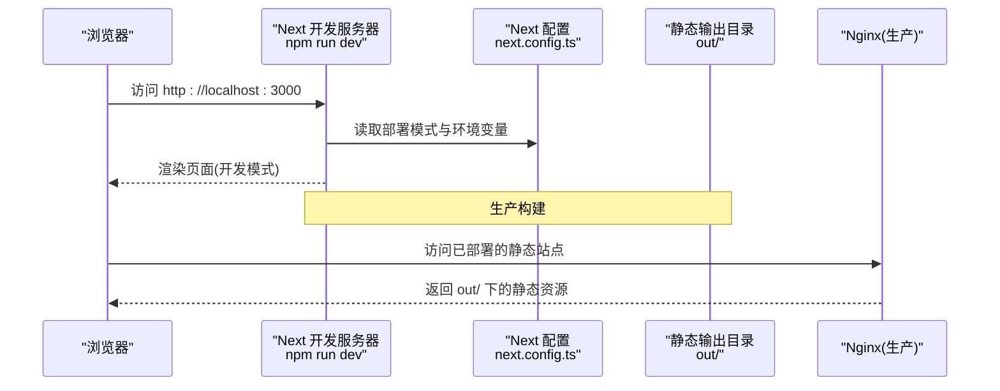
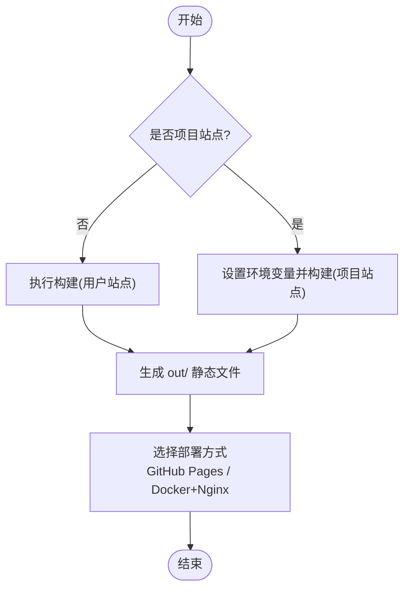
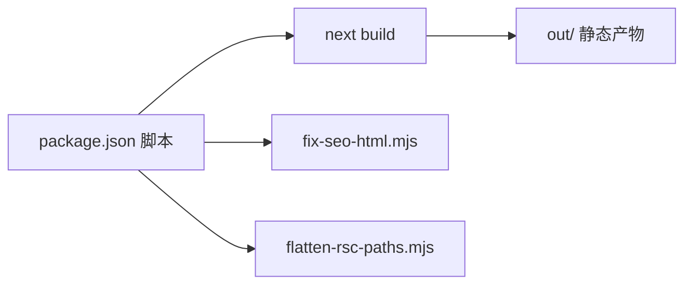

# 快速开始

<cite>
**本文引用的文件**
- [README.md](file://README.md)
- [package.json](file://package.json)
- [next.config.ts](file://next.config.ts)
- [content/config/profile.json](file://content/config/profile.json)
- [docker/Dockerfile](file://docker/Dockerfile)
- [i18n/routing.ts](file://i18n/routing.ts)
- [app/[locale]/layout.tsx](file://app/[locale]/layout.tsx)
- [app/layout.tsx](file://app/layout.tsx)
</cite>

## 目录
1. [简介](#简介)
2. [项目结构](#项目结构)
3. [核心组件](#核心组件)
4. [架构总览](#架构总览)
5. [详细组件分析](#详细组件分析)
6. [依赖分析](#依赖分析)
7. [性能考虑](#性能考虑)
8. [故障排查指南](#故障排查指南)
9. [结论](#结论)
10. [附录](#附录)

## 简介
本指南面向新手，帮助你在 30 分钟内完成博客项目的本地搭建、开发运行与生产构建。你将了解：
- 环境要求（Node.js 18+）
- 依赖安装与脚本说明
- 开发模式启动与验证
- 生产环境构建与静态导出
- 本地开发与生产环境的差异
- 基本目录结构与第一个自定义配置示例
- 常见问题解决方案

## 项目结构
本项目基于 Next.js App Router，采用国际化路由与静态导出。关键目录与职责如下：
- app：页面与布局（含国际化路由 [locale]）
- components：UI 与业务组件
- content：内容数据（文章、简历、个人配置等）
- i18n：国际化路由与请求上下文
- lib：工具函数与数据处理
- public：静态资源（图片、favicon 等）
- scripts：构建后处理脚本（SEO 修复、路径扁平化、图片压缩）
- docker：Docker 多阶段构建与 Nginx 运行镜像

图表来源
- [app/layout.tsx:1-114](file://app/layout.tsx#L1-L114)
- [app/[locale]/layout.tsx:1-64](file://app/[locale]/layout.tsx#L1-L64)
- [i18n/routing.ts:1-6](file://i18n/routing.ts#L1-L6)
- [next.config.ts:1-38](file://next.config.ts#L1-L38)
- [content/config/profile.json:1-66](file://content/config/profile.json#L1-L66)
- [package.json:1-47](file://package.json#L1-L47)
- [docker/Dockerfile:1-32](file://docker/Dockerfile#L1-L32)

章节来源
- [README.md:33-67](file://README.md#L33-L67)
- [package.json:5-12](file://package.json#L5-L12)
- [next.config.ts:6-36](file://next.config.ts#L6-L36)
- [content/config/profile.json:1-66](file://content/config/profile.json#L1-L66)

## 核心组件
- 国际化与主题：通过 next-intl 与 next-themes 提供语言切换与亮暗主题能力。
- 内容驱动：Markdown 文章与 JSON 配置驱动站点内容与展示。
- 静态导出：使用 output: export 生成纯静态站点，便于 GitHub Pages 或 Nginx 托管。
- 部署模式：通过环境变量 DEPLOY_TARGET 控制用户站点与项目站点的 basePath/assetPrefix。

章节来源
- [next.config.ts:21-36](file://next.config.ts#L21-L36)
- [app/[locale]/layout.tsx:1-64](file://app/[locale]/layout.tsx#L1-L64)
- [i18n/routing.ts:1-6](file://i18n/routing.ts#L1-L6)

## 架构总览
下图展示了从浏览器访问到静态资源返回的关键流程，以及构建产物输出位置。

图表来源
- [package.json:5-12](file://package.json#L5-L12)
- [next.config.ts:21-36](file://next.config.ts#L21-L36)
- [docker/Dockerfile:13-20](file://docker/Dockerfile#L13-L20)

## 详细组件分析

### 环境与依赖安装
- 环境要求
  - Node.js 18+
  - npm 或 pnpm
- 安装依赖
  - 在项目根目录执行安装命令以拉取所有依赖。
- 常用脚本
  - 开发：启动热重载开发服务器
  - 构建：执行 Next 构建并运行 SEO 修复与路径扁平化脚本
  - 仅构建：跳过额外脚本直接构建
  - 本地预览：使用 serve 服务 out 目录进行本地预览
  - 压缩：执行图片压缩脚本
  - 代码检查：ESLint 检查

章节来源
- [README.md:71-100](file://README.md#L71-L100)
- [package.json:5-12](file://package.json#L5-L12)

### 开发模式启动与验证
- 启动开发服务器
  - 在终端执行开发命令，随后访问本地地址查看效果。
- 验证要点
  - 首页可正常加载
  - 中英文切换生效
  - 亮暗主题切换生效
  - 文章列表与详情可访问

章节来源
- [README.md:82-88](file://README.md#L82-L88)
- [app/[locale]/layout.tsx:1-64](file://app/[locale]/layout.tsx#L1-L64)
- [i18n/routing.ts:1-6](file://i18n/routing.ts#L1-L6)

### 生产环境构建与部署
- 构建命令
  - 用户站点（默认）：直接构建，资源从根路径提供
  - 项目站点：设置环境变量后构建，自动添加子路径前缀
- 构建产物
  - 静态文件输出至 out 目录
- 部署方式
  - GitHub Pages（用户站点或项目站点）
  - Docker + Nginx（容器化部署）

图表来源
- [next.config.ts:6-36](file://next.config.ts#L6-L36)
- [README.md:90-100](file://README.md#L90-L100)
- [docker/Dockerfile:13-20](file://docker/Dockerfile#L13-L20)

章节来源
- [README.md:90-100](file://README.md#L90-L100)
- [next.config.ts:21-36](file://next.config.ts#L21-L36)
- [docker/Dockerfile:1-32](file://docker/Dockerfile#L1-L32)

### 本地开发与生产环境的区别
- 开发模式
  - 使用 Next 开发服务器，支持热重载与调试
  - 不启用静态导出优化
- 生产模式
  - 静态导出为纯静态站点，适合 CDN/Nginx/GitHub Pages
  - 根据部署模式决定是否启用 basePath/assetPrefix
  - 图片优化关闭（unoptimized），适配静态导出场景

章节来源
- [next.config.ts:21-36](file://next.config.ts#L21-L36)
- [package.json:5-12](file://package.json#L5-L12)

### 第一个自定义配置示例
- 修改个人信息与社交链接
  - 编辑配置文件，更新姓名、头像、职业、简介、社交账号等字段。
- 修改主题颜色
  - 在配置文件中设置主色与强调色，刷新即可生效。
- 评论系统（Giscus）
  - 在配置中填写仓库、分类 ID 等参数，使评论功能可用。

章节来源
- [content/config/profile.json:1-66](file://content/config/profile.json#L1-L66)

### 国际化与布局
- 国际化路由
  - 定义支持的语言与默认语言
- 国际化布局
  - 校验 locale、注入消息、集成主题与全局 UI 组件
- 根布局
  - 设置字体、元信息、图标、OpenGraph/Twitter 卡片等

章节来源
- [i18n/routing.ts:1-6](file://i18n/routing.ts#L1-L6)
- [app/[locale]/layout.tsx:1-64](file://app/[locale]/layout.tsx#L1-L64)
- [app/layout.tsx:1-114](file://app/layout.tsx#L1-L114)

## 依赖分析
- 运行时依赖
  - 框架与国际化：Next.js、next-intl
  - 主题：next-themes
  - Markdown 解析：gray-matter、react-markdown、rehype-*、remark-*
  - UI 与样式：Tailwind CSS、shadcn/ui 生态
- 开发依赖
  - TypeScript、ESLint、Tailwind PostCSS 插件、Sharp（图片处理）
- 构建与脚本
  - 构建后执行 SEO 修复与路径扁平化脚本，确保静态导出质量

图表来源
- [package.json:5-12](file://package.json#L5-L12)

章节来源
- [package.json:13-45](file://package.json#L13-L45)

## 性能考虑
- 静态导出减少服务端开销，适合高并发与 CDN 缓存
- 关闭图片优化以适配静态导出，避免运行时依赖
- 合理拆分组件与按需引入，减小首屏体积
- 使用 Tailwind 与 shadcn/ui 的原子化样式，利于 Tree-shaking

[本节为通用建议，无需特定文件引用]

## 故障排查指南
- 构建失败
  - 确认 Node.js 版本满足要求
  - 清理 node_modules 与 .next 后重新安装
  - 检查 Markdown frontmatter 格式是否正确
- 资源路径错误（项目站点）
  - 确认已设置对应环境变量，使 basePath/assetPrefix 正确生效
- 评论无法加载
  - 检查 Giscus 仓库 Discussions 是否开启，repoId/categoryId 是否正确
- Docker 部署问题
  - 确认端口映射与外部 Nginx 反向代理配置一致
  - 查看容器日志定位问题

章节来源
- [README.md:577-582](file://README.md#L577-L582)
- [next.config.ts:6-36](file://next.config.ts#L6-L36)
- [content/config/profile.json:49-64](file://content/config/profile.json#L49-L64)
- [docker/Dockerfile:13-20](file://docker/Dockerfile#L13-L20)

## 结论
通过以上步骤，你可以在 30 分钟内完成博客项目的本地搭建、开发运行与生产构建。建议优先使用静态导出与 GitHub Pages 或 Docker+Nginx 进行部署，以获得最佳的可维护性与性能表现。

[本节为总结性内容，无需特定文件引用]

## 附录

### 命令行速查
- 安装依赖
  - 在项目根目录执行安装命令
- 启动开发
  - 执行开发命令，访问本地地址
- 构建生产
  - 用户站点：直接构建
  - 项目站点：设置环境变量后构建
- 本地预览
  - 使用 serve 服务 out 目录
- Docker 部署
  - 参考 README 中的 Docker 使用说明

章节来源
- [README.md:71-100](file://README.md#L71-L100)
- [package.json:5-12](file://package.json#L5-L12)