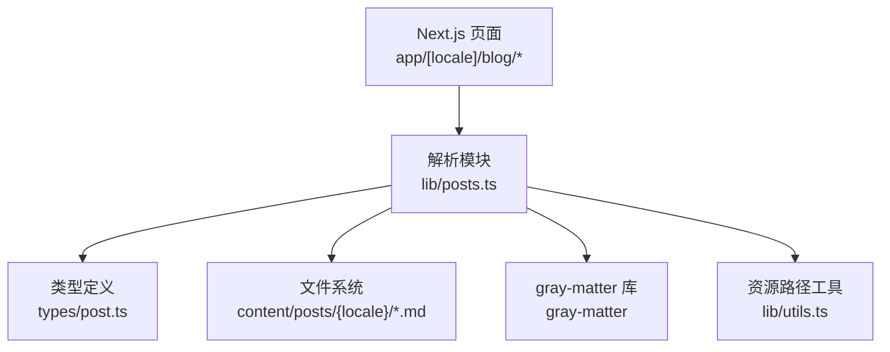
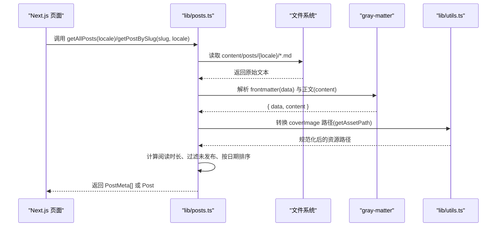
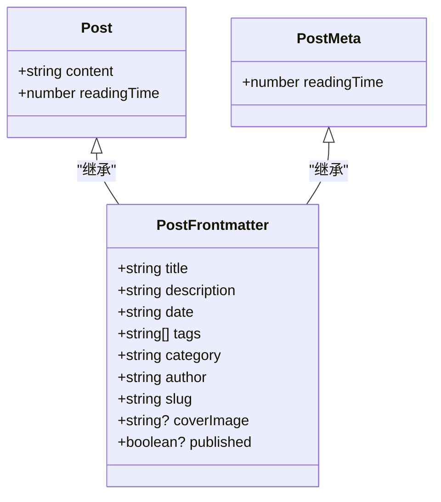
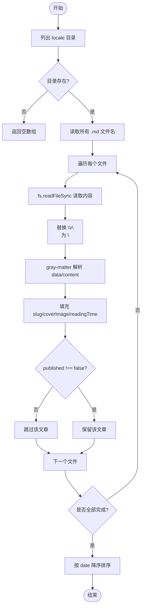
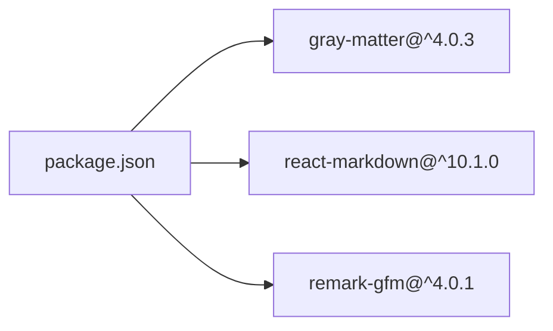

# 内容解析系统

<cite>
**本文引用的文件**
- [lib/posts.ts](file://lib/posts.ts)
- [types/post.ts](file://types/post.ts)
- [lib/utils.ts](file://lib/utils.ts)
- [package.json](file://package.json)
- [app/[locale]/blog/page.tsx](file://app/[locale]/blog/page.tsx)
- [app/[locale]/blog/[slug]/page.tsx](file://app/[locale]/blog/[slug]/page.tsx)
- [content/posts/zh/superpowers.md](file://content/posts/zh/superpowers.md)
- [content/posts/en/superpowers.md](file://content/posts/en/superpowers.md)
</cite>

## 目录
1. [简介](#简介)
2. [项目结构](#项目结构)
3. [核心组件](#核心组件)
4. [架构总览](#架构总览)
5. [详细组件分析](#详细组件分析)
6. [依赖关系分析](#依赖关系分析)
7. [性能考量](#性能考量)
8. [故障排查指南](#故障排查指南)
9. [结论](#结论)
10. [附录：扩展字段与验证规则示例](#附录扩展字段与验证规则示例)

## 简介
本文件系统性地梳理博客的内容解析流程，重点围绕 gray-matter 对 Markdown 前置元数据（frontmatter）的解析、PostFrontmatter 类型定义与校验策略、从文件系统到内存对象的转换过程、错误处理机制，以及如何扩展新的字段类型和验证规则。该方案以 Next.js App Router 为入口，通过 lib/posts.ts 统一读取 content/posts 下的多语言文章，并输出结构化对象供页面渲染与 SEO 生成使用。

## 项目结构
与内容解析相关的关键位置如下：
- 内容源：content/posts/{locale}/*.md（包含 frontmatter 与正文）
- 解析层：lib/posts.ts（gray-matter 解析、过滤、排序、聚合）
- 类型定义：types/post.ts（PostFrontmatter、Post、PostMeta）
- 资源路径工具：lib/utils.ts（getAssetPath）
- 页面入口：app/[locale]/blog/page.tsx 与 app/[locale]/blog/[slug]/page.tsx（调用解析函数）
- 依赖声明：package.json（gray-matter 版本）

图表来源
- [lib/posts.ts:1-121](file://lib/posts.ts#L1-L121)
- [types/post.ts:1-20](file://types/post.ts#L1-L20)
- [lib/utils.ts:1-26](file://lib/utils.ts#L1-L26)
- [app/[locale]/blog/page.tsx:1-34](file://app/[locale]/blog/page.tsx#L1-L34)
- [app/[locale]/blog/[slug]/page.tsx:1-180](file://app/[locale]/blog/[slug]/page.tsx#L1-L180)

章节来源
- [lib/posts.ts:1-121](file://lib/posts.ts#L1-L121)
- [types/post.ts:1-20](file://types/post.ts#L1-L20)
- [lib/utils.ts:1-26](file://lib/utils.ts#L1-L26)
- [app/[locale]/blog/page.tsx:1-34](file://app/[locale]/blog/page.tsx#L1-L34)
- [app/[locale]/blog/[slug]/page.tsx:1-180](file://app/[locale]/blog/[slug]/page.tsx#L1-L180)
- [package.json:13-19](file://package.json#L13-L19)

## 核心组件
- gray-matter 集成：在 lib/posts.ts 中引入 gray-matter，用于将 Markdown 字符串拆分为 data（frontmatter）与 content（正文）。
- 类型体系：types/post.ts 定义了 PostFrontmatter（元数据）、Post（含正文与阅读时长）、PostMeta（列表项元数据）。
- 资源路径处理：lib/utils.ts 提供 getAssetPath，兼容相对路径与绝对 URL，适配 GitHub Pages 等部署场景。
- 页面集成：Next.js 页面在构建期或请求期调用 getAllPosts/getPostBySlug 获取数据，并用于渲染与 SEO。

章节来源
- [lib/posts.ts:1-121](file://lib/posts.ts#L1-L121)
- [types/post.ts:1-20](file://types/post.ts#L1-L20)
- [lib/utils.ts:1-26](file://lib/utils.ts#L1-L26)
- [app/[locale]/blog/page.tsx:1-34](file://app/[locale]/blog/page.tsx#L1-L34)
- [app/[locale]/blog/[slug]/page.tsx:1-180](file://app/[locale]/blog/[slug]/page.tsx#L1-L180)

## 架构总览
下图展示了从页面到文件系统的完整数据流，包括 gray-matter 解析、字段映射、过滤与排序。

图表来源
- [lib/posts.ts:15-71](file://lib/posts.ts#L15-L71)
- [lib/utils.ts:16-25](file://lib/utils.ts#L16-L25)

## 详细组件分析

### gray-matter 使用与 frontmatter 解析
- 解析入口：lib/posts.ts 中通过 matter(fileContents) 将 Markdown 文本拆分为 data 与 content。
- 字段映射：data 被断言为 PostFrontmatter，随后合并 slug、coverImage 规范化、readingTime 等衍生字段。
- 正文处理：content 用于计算阅读时长，并在详情页作为渲染输入。

章节来源
- [lib/posts.ts:29-41](file://lib/posts.ts#L29-L41)
- [lib/posts.ts:54-67](file://lib/posts.ts#L54-L67)

### PostFrontmatter 类型定义与数据结构设计
- 必填字段：title、description、date、tags、category、author、slug。
- 可选字段：coverImage、published。
- 派生类型：Post 增加 content 与 readingTime；PostMeta 仅保留阅读时长。

图表来源
- [types/post.ts:1-20](file://types/post.ts#L1-L20)

章节来源
- [types/post.ts:1-20](file://types/post.ts#L1-L20)

### 内容读取流程（文件系统到内存对象）
- 列举与过滤：根据 locale 定位 content/posts/{locale}，筛选 .md 文件。
- 逐文件解析：读取文件内容，替换换行符后交由 gray-matter 解析。
- 字段增强：补充 slug、规范化 coverImage、计算 readingTime。
- 过滤与排序：排除 published=false 的文章，按 date 降序排列。
- 详情读取：getPostBySlug 直接读取指定 slug 的文件，失败时返回 null。

图表来源
- [lib/posts.ts:15-47](file://lib/posts.ts#L15-L47)

章节来源
- [lib/posts.ts:15-47](file://lib/posts.ts#L15-L47)

### 错误处理机制
- 目录不存在：getAllPosts 在目录不存在时直接返回空数组，避免异常中断。
- 单篇文章缺失：getPostBySlug 捕获读取异常并返回 null，上层页面据此触发 notFound。
- 格式错误：gray-matter 对非法 YAML 会抛出异常，当前实现未显式捕获，建议在调用处增加 try/catch 并记录日志。

章节来源
- [lib/posts.ts:18-20](file://lib/posts.ts#L18-L20)
- [lib/posts.ts:52-71](file://lib/posts.ts#L52-L71)
- [app/[locale]/blog/[slug]/page.tsx:113-117](file://app/[locale]/blog/[slug]/page.tsx#L113-L117)

### 前端渲染与 SEO 集成
- 列表页：调用 getAllPosts、getAllTags、getAllCategories 生成文章列表与分类标签。
- 详情页：调用 getPostBySlug 获取文章，结合 highlightCodeBlocks 进行代码高亮，并生成 JSON-LD、OpenGraph、Twitter Card 等 SEO 信息。

章节来源
- [app/[locale]/blog/page.tsx:25-33](file://app/[locale]/blog/page.tsx#L25-L33)
- [app/[locale]/blog/[slug]/page.tsx:37-108](file://app/[locale]/blog/[slug]/page.tsx#L37-L108)
- [app/[locale]/blog/[slug]/page.tsx:110-179](file://app/[locale]/blog/[slug]/page.tsx#L110-L179)

## 依赖关系分析
- gray-matter：用于解析 frontmatter，版本在 package.json 中声明。
- ReactMarkdown 与 remark-gfm：用于前端渲染 Markdown（不在本次解析流程内，但属于内容展示链路）。
- clsx/tailwind-merge：样式工具，非解析核心。

图表来源
- [package.json:13-34](file://package.json#L13-L34)

章节来源
- [package.json:13-34](file://package.json#L13-L34)

## 性能考量
- 同步 I/O：当前使用 fs.readFileSync 与 readdirSync，适合静态站点构建期；若需服务端动态渲染，建议改为异步 API 或缓存结果。
- 全文扫描：getAllPosts 每次都会遍历目录并解析所有文章，可考虑按需缓存（如基于文件时间戳）以减少重复解析。
- 阅读时长计算：基于词数估算，复杂度 O(n)，对长文影响有限，但可进一步优化（如预存 readingTime）。

[本节为通用指导，不直接分析具体文件]

## 故障排查指南
- 文件不存在：检查 content/posts/{locale}/{slug}.md 是否存在，以及 slug 是否与文件名一致。
- 目录不存在：确认 locale 子目录是否存在，否则 getAllPosts 返回空数组。
- 格式错误：确保 frontmatter 使用合法的 YAML 语法，避免缩进与特殊字符问题。
- 资源路径异常：检查 coverImage 是否为相对路径或合法外部 URL，getAssetPath 会忽略绝对 URL 并自动补齐 basePath。

章节来源
- [lib/posts.ts:18-20](file://lib/posts.ts#L18-L20)
- [lib/posts.ts:52-71](file://lib/posts.ts#L52-L71)
- [lib/utils.ts:16-25](file://lib/utils.ts#L16-L25)

## 结论
本内容解析系统以 gray-matter 为核心，配合清晰的类型定义与统一的资源路径处理，实现了从文件系统到内存对象的稳定转换。通过过滤与排序逻辑，保证了列表数据的可用性与一致性。建议在后续迭代中引入异步 I/O 与缓存策略，提升运行时性能，并完善 frontmatter 的运行时校验以提升健壮性。

[本节为总结，不直接分析具体文件]

## 附录：扩展字段与验证规则示例
以下示例展示如何扩展新的字段类型与验证规则（概念性说明，不包含具体代码片段）：

- 新增字段
  - 在 types/post.ts 的 PostFrontmatter 中添加新字段，例如：
    - summary?: string（摘要）
    - draft?: boolean（草稿标记）
    - customFields?: Record<string, unknown>（自定义扩展）
- 解析阶段增强
  - 在 lib/posts.ts 的解析循环中，对 data 进行运行时校验：
    - 使用 zod/yup 等库对 data 进行 schema 校验，确保字段类型与取值范围正确。
    - 对 date 字段进行日期有效性校验，必要时转换为 ISO 字符串。
    - 对 tags 去重与大小写归一化。
- 资源路径增强
  - 在 getAssetPath 基础上，支持更多协议或 CDN 域名白名单。
- 错误处理增强
  - 在 getPostBySlug 与 getAllPosts 中对 gray-matter 抛出的异常进行捕获，记录错误上下文（文件路径、locale、slug），并返回降级数据或提示。
- 示例参考
  - 现有 frontmatter 样例可参考：
    - [content/posts/zh/superpowers.md](file://content/posts/zh/superpowers.md)
    - [content/posts/en/superpowers.md](file://content/posts/en/superpowers.md)

章节来源
- [types/post.ts:1-20](file://types/post.ts#L1-L20)
- [lib/posts.ts:29-41](file://lib/posts.ts#L29-L41)
- [lib/posts.ts:54-67](file://lib/posts.ts#L54-L67)
- [content/posts/zh/superpowers.md:1-10](file://content/posts/zh/superpowers.md#L1-L10)
- [content/posts/en/superpowers.md:1-10](file://content/posts/en/superpowers.md#L1-L10)