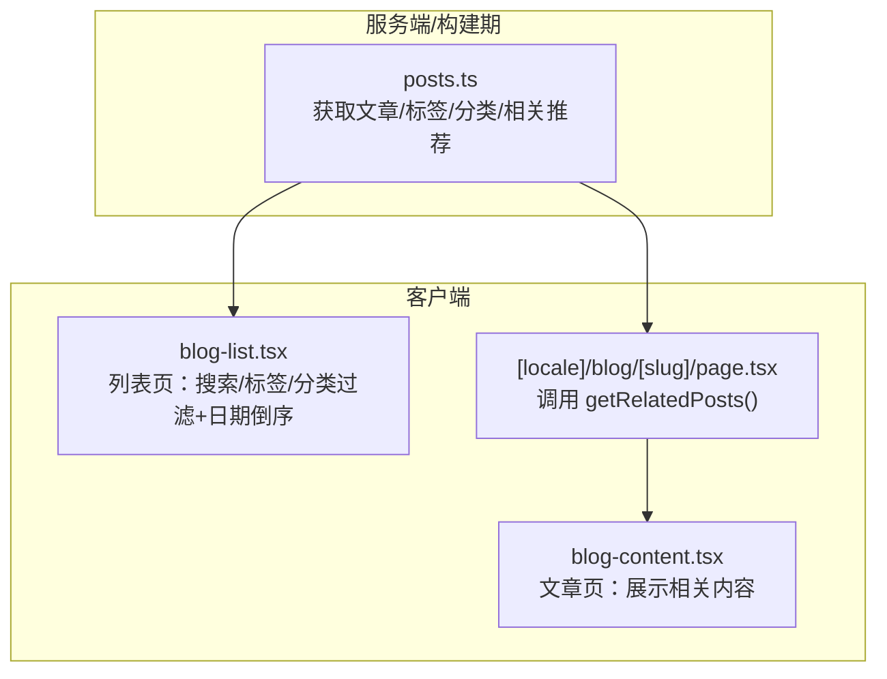
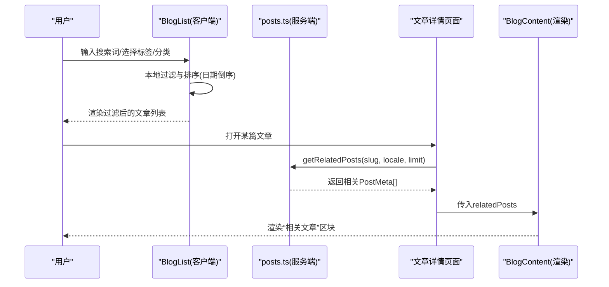
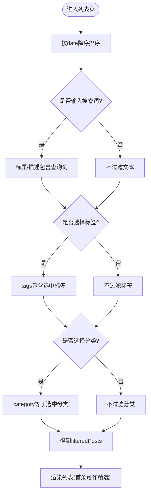
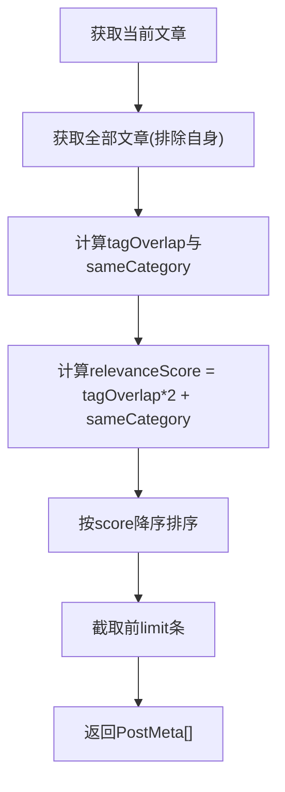
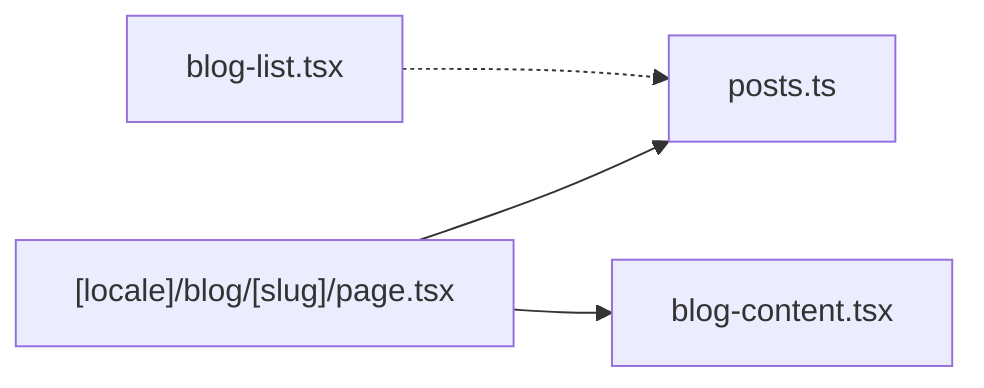

# 内容过滤与排序

<cite>
**本文引用的文件**   
- [lib/posts.ts](file://lib/posts.ts)
- [components/blog/blog-list.tsx](file://components/blog/blog-list.tsx)
- [app/[locale]/blog/[slug]/page.tsx](file://app/[locale]/blog/[slug]/page.tsx)
- [components/blog/blog-content.tsx](file://components/blog/blog-content.tsx)
</cite>

## 目录
1. [简介](#简介)
2. [项目结构](#项目结构)
3. [核心组件](#核心组件)
4. [架构总览](#架构总览)
5. [详细组件分析](#详细组件分析)
6. [依赖分析](#依赖分析)
7. [性能考虑](#性能考虑)
8. [故障排查指南](#故障排查指南)
9. [结论](#结论)
10. [附录](#附录)

## 简介
本文件围绕“内容过滤与排序系统”展开，聚焦以下能力：
- 标签过滤（getPostsByTag）与分类筛选（getPostsByCategory）的实现逻辑与优化策略
- 相关文章推荐算法：基于标签重叠度与分类匹配度的相关性评分机制
- 排序算法：按日期倒序排列与可扩展的自定义排序规则
- 客户端过滤与服务器端过滤的选择策略
- 搜索功能扩展指南：全文搜索与模糊匹配方案
- 性能基准测试方法与大数据集处理优化技巧

## 项目结构
与内容过滤、排序和推荐相关的代码主要分布在以下位置：
- 数据访问与基础查询：lib/posts.ts
- 列表页客户端过滤与排序：components/blog/blog-list.tsx
- 文章详情页相关计算与渲染：app/[locale]/blog/[slug]/page.tsx、components/blog/blog-content.tsx

图表来源
- [lib/posts.ts:84-121](file://lib/posts.ts#L84-L121)
- [components/blog/blog-list.tsx:28-55](file://components/blog/blog-list.tsx#L28-L55)
- [app/[locale]/blog/[slug]/page.tsx:118-171](file://app/[locale]/blog/[slug]/page.tsx#L118-L171)
- [components/blog/blog-content.tsx:220-240](file://components/blog/blog-content.tsx#L220-L240)

章节来源
- [lib/posts.ts:84-121](file://lib/posts.ts#L84-L121)
- [components/blog/blog-list.tsx:28-55](file://components/blog/blog-list.tsx#L28-L55)
- [app/[locale]/blog/[slug]/page.tsx:118-171](file://app/[locale]/blog/[slug]/page.tsx#L118-L171)
- [components/blog/blog-content.tsx:220-240](file://components/blog/blog-content.tsx#L220-L240)

## 核心组件
- 标签过滤与分类筛选
  - 服务端函数：getPostsByTag、getPostsByCategory，用于根据标签或分类返回文章元信息数组。
- 列表页客户端过滤与排序
  - 在 blog-list.tsx 中实现：
    - 搜索：标题与描述包含查询词（大小写不敏感）
    - 标签过滤：selectedTag 是否在 post.tags 中
    - 分类过滤：post.category 是否等于 selectedCategory
    - 排序：按 date 字段降序（最新在前）
- 相关文章推荐
  - 服务端函数：getRelatedPosts(currentSlug, locale, limit=3)
  - 评分机制：relevanceScore = tagOverlap * 2 + sameCategory
    - tagOverlap：当前文章与候选文章的标签交集数量
    - sameCategory：若分类相同则加 1
  - 最终按 relevanceScore 降序取前 limit 条

章节来源
- [lib/posts.ts:84-121](file://lib/posts.ts#L84-L121)
- [components/blog/blog-list.tsx:28-55](file://components/blog/blog-list.tsx#L28-L55)

## 架构总览
下图展示了从页面到数据层再到渲染层的完整流程，包括列表页过滤排序与文章页相关推荐的计算链路。

图表来源
- [components/blog/blog-list.tsx:28-55](file://components/blog/blog-list.tsx#L28-L55)
- [lib/posts.ts:95-121](file://lib/posts.ts#L95-L121)
- [app/[locale]/blog/[slug]/page.tsx:118-171](file://app/[locale]/blog/[slug]/page.tsx#L118-L171)
- [components/blog/blog-content.tsx:220-240](file://components/blog/blog-content.tsx#L220-L240)

## 详细组件分析

### 标签过滤与分类筛选（服务端）
- 实现要点
  - getPostsByTag(tag, locale)：遍历该语言下所有文章，保留 tags 包含指定标签的文章。
  - getPostsByCategory(category, locale)：遍历该语言下所有文章，保留 category 等于指定分类的文章。
- 复杂度
  - 时间 O(N)，空间 O(K)（K为结果数量）
- 优化建议
  - 预构建索引：以标签/分类为键的倒排索引，将过滤降至 O(1) 查找 + O(K) 输出
  - 缓存：对常用标签/分类组合做短期缓存（如内存 Map），降低重复 IO 与遍历成本

章节来源
- [lib/posts.ts:84-93](file://lib/posts.ts#L84-L93)

### 列表页客户端过滤与排序
- 过滤条件
  - 搜索：title/description 包含查询词（忽略大小写）
  - 标签：post.tags.includes(selectedTag)
  - 分类：post.category === selectedCategory
- 排序
  - 按 date 降序（新文章优先）
- 复杂度
  - 每次过滤 O(M)，M为当前已排序文章数；排序仅在 posts 变化时执行一次
- 交互
  - 支持清除筛选条件、高亮当前筛选状态

图表来源
- [components/blog/blog-list.tsx:28-55](file://components/blog/blog-list.tsx#L28-L55)

章节来源
- [components/blog/blog-list.tsx:28-55](file://components/blog/blog-list.tsx#L28-L55)

### 相关文章推荐算法
- 数据来源
  - 当前文章：getPostBySlug(currentSlug, locale)
  - 候选集合：getAllPosts(locale) 排除自身
- 评分公式
  - tagOverlap = |current.tags ∩ candidate.tags|
  - sameCategory = (candidate.category === current.category ? 1 : 0)
  - relevanceScore = tagOverlap * 2 + sameCategory
- 排序与截断
  - 按 relevanceScore 降序，取前 limit 条
- 复杂度
  - 时间 O(N)，N为文章总数；空间 O(N)（中间映射）
- 可视化

图表来源
- [lib/posts.ts:95-121](file://lib/posts.ts#L95-L121)

章节来源
- [lib/posts.ts:95-121](file://lib/posts.ts#L95-L121)

### 文章详情页集成与渲染
- 页面侧
  - 调用 getRelatedPosts(slug, locale) 获取相关文章
  - 将 relatedPosts 作为 props 传递给 BlogContent
- 渲染侧
  - BlogContent 在文章正文后渲染“相关文章”区块，并支持“浏览全部”跳转

章节来源
- [app/[locale]/blog/[slug]/page.tsx:118-171](file://app/[locale]/blog/[slug]/page.tsx#L118-L171)
- [components/blog/blog-content.tsx:220-240](file://components/blog/blog-content.tsx#L220-L240)

## 依赖分析
- 模块关系
  - app/[locale]/blog/[slug]/page.tsx 依赖 lib/posts.ts 的 getRelatedPosts
  - components/blog/blog-content.tsx 消费来自页面的 relatedPosts
  - components/blog/blog-list.tsx 独立实现客户端过滤与排序，不直接依赖 posts.ts 的过滤函数
- 耦合与内聚
  - 推荐算法集中在 posts.ts，内聚良好，便于替换评分策略
  - 列表页过滤逻辑位于 UI 组件，关注点清晰，但未来如需统一策略，可抽取至 hooks 或工具模块

图表来源
- [app/[locale]/blog/[slug]/page.tsx:118-171](file://app/[locale]/blog/[slug]/page.tsx#L118-L171)
- [components/blog/blog-content.tsx:220-240](file://components/blog/blog-content.tsx#L220-L240)
- [components/blog/blog-list.tsx:28-55](file://components/blog/blog-list.tsx#L28-L55)
- [lib/posts.ts:95-121](file://lib/posts.ts#L95-L121)

章节来源
- [app/[locale]/blog/[slug]/page.tsx:118-171](file://app/[locale]/blog/[slug]/page.tsx#L118-L171)
- [components/blog/blog-content.tsx:220-240](file://components/blog/blog-content.tsx#L220-L240)
- [components/blog/blog-list.tsx:28-55](file://components/blog/blog-list.tsx#L28-L55)
- [lib/posts.ts:95-121](file://lib/posts.ts#L95-L121)

## 性能考虑
- 当前复杂度
  - 列表页过滤：O(M) 每轮交互；排序仅当 posts 变化时执行
  - 推荐算法：O(N) 扫描全量文章
- 优化方向
  - 索引化
    - 为标签与分类建立倒排索引，将过滤由 O(N) 降至 O(1)+O(K)
  - 缓存
    - 对 getPostsByTag/getPostsByCategory/getRelatedPosts 的结果进行短期缓存（按参数键）
  - 增量更新
    - 新增/修改文章时只更新受影响索引项
  - 分页/懒加载
    - 列表页采用虚拟滚动或分页，减少 DOM 节点数量
  - 前端计算优化
    - 使用 useMemo/useCallback 避免不必要的重算
    - 将高频操作（如去重、计数）前置到构建期或后台任务

## 故障排查指南
- 常见问题
  - 筛选无结果：检查 searchQuery 的大小写处理、标签/分类是否存在
  - 排序异常：确认 date 字段格式一致且可解析
  - 相关文章为空：确认当前文章存在且至少有一条非自身的候选文章
- 定位步骤
  - 在列表页打印过滤前后数组长度，逐步验证各条件分支
  - 在推荐计算处打印 tagOverlap 与 sameCategory，核对评分
  - 校验 locale 是否正确传递，避免跨语言数据混用

章节来源
- [components/blog/blog-list.tsx:28-55](file://components/blog/blog-list.tsx#L28-L55)
- [lib/posts.ts:95-121](file://lib/posts.ts#L95-L121)

## 结论
- 现有实现以“服务端提供基础数据与推荐，客户端完成即时过滤与排序”的方式达成良好的交互体验
- 推荐算法简单有效，易于扩展更多维度（如作者、发布时间衰减等）
- 面向大规模数据，建议引入索引与缓存，并将部分计算迁移到构建期或后台任务

## 附录

### 客户端过滤与服务器端过滤的选择策略
- 客户端过滤
  - 适用：数据量较小、需要即时响应、低延迟交互
  - 优点：无需网络往返、用户体验流畅
  - 缺点：全量数据需下发，内存占用随数据增长
- 服务器端过滤
  - 适用：数据量大、复杂筛选、需要权限控制或安全限制
  - 优点：按需返回、可控带宽与计算
  - 缺点：有网络开销，需设计合理的接口与缓存策略
- 混合策略
  - 列表页先客户端快速过滤，必要时再请求服务端细化结果
  - 热门标签/分类在服务端预聚合，客户端直接命中

### 搜索功能扩展指南（全文搜索与模糊匹配）
- 轻量级方案（前端）
  - 基于字符串包含的关键词匹配（当前已实现）
  - 增加分词与停用词表，提升中文检索效果
  - 引入 fuzzy 匹配库（如 fast-fuzzy）实现容错搜索
- 进阶方案（后端/构建期）
  - 构建全文索引（如 SQLite FTS、Meilisearch、Typesense）
  - 提供 /api/search?q=... 接口，支持分页与高亮
  - 结合权重策略：标题 > 描述 > 标签 > 正文片段
- 性能建议
  - 防抖输入（debounce）
  - 结果缓存（按查询词与过滤条件）
  - 增量索引更新（发布/修改文章时重建局部索引）

### 性能基准测试方法
- 指标
  - 首屏渲染时间、过滤响应时间、推荐计算耗时、内存峰值
- 方法
  - 使用浏览器 Performance 面板记录关键路径
  - 构造不同规模数据集（1k/10k/100k）对比
  - 对推荐算法与过滤逻辑分别打点计时
- 自动化
  - 在 CI 中加入基准脚本，监控回归

### 大数据集处理优化技巧
- 数据结构
  - 倒排索引：tag→[postIds]、category→[postIds]
  - 预计算：每篇文章的 tagSet、category 哈希
- 计算卸载
  - 构建期生成索引与摘要，运行时直接读取
- 存储与传输
  - 压缩传输（gzip/brotli）
  - 按需加载（分页/无限滚动）
- 并发与异步
  - 并行构建索引，避免阻塞主线程
  - Web Worker 执行重型计算