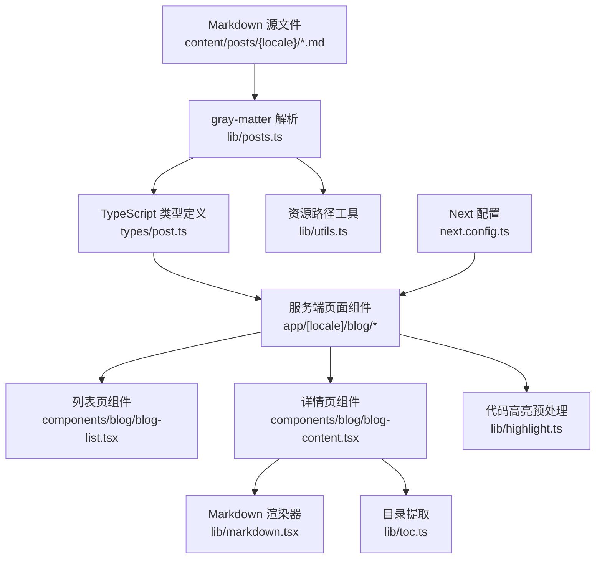
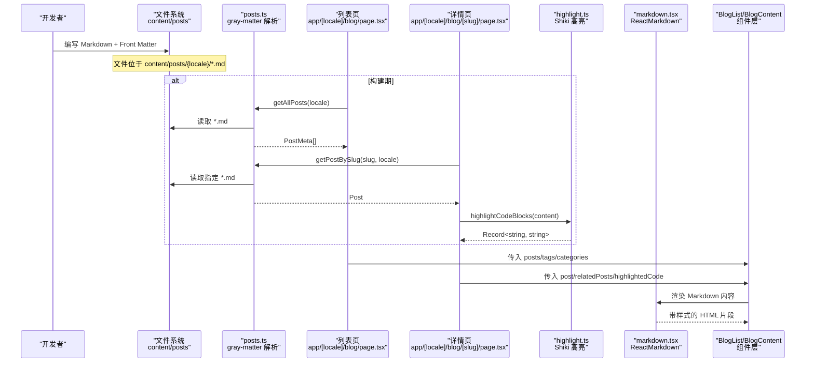
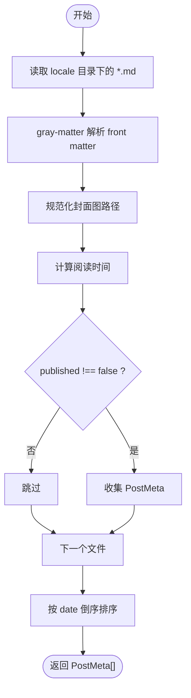
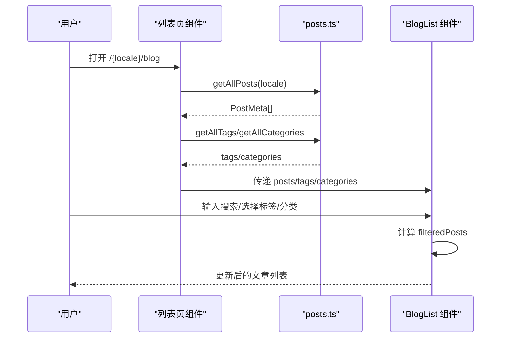
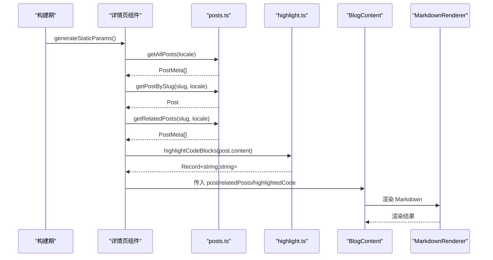
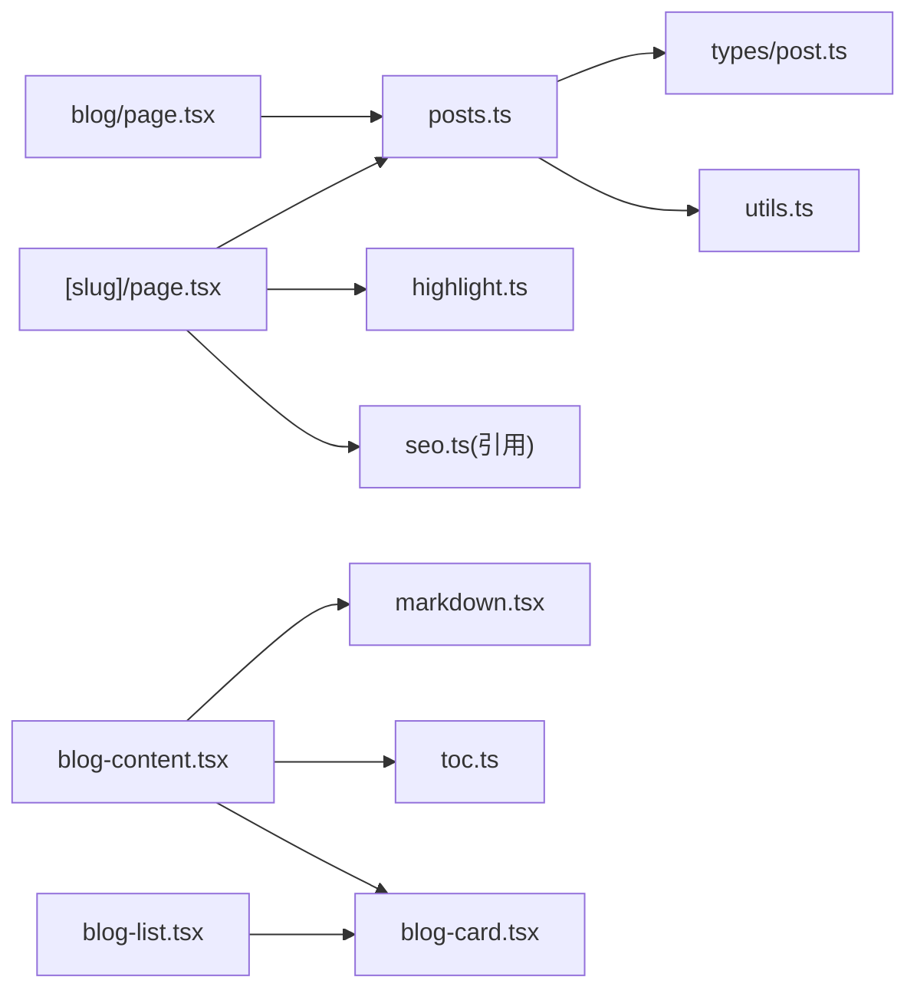

# 数据流管理

<cite>
**本文引用的文件**   
- [lib/posts.ts](file://lib/posts.ts)
- [types/post.ts](file://types/post.ts)
- [lib/markdown.tsx](file://lib/markdown.tsx)
- [lib/highlight.ts](file://lib/highlight.ts)
- [app/[locale]/blog/page.tsx](file://app/[locale]/blog/page.tsx)
- [app/[locale]/blog/[slug]/page.tsx](file://app/[locale]/blog/[slug]/page.tsx)
- [components/blog/blog-list.tsx](file://components/blog/blog-list.tsx)
- [components/blog/blog-content.tsx](file://components/blog/blog-content.tsx)
- [components/blog/blog-card.tsx](file://components/blog/blog-card.tsx)
- [lib/toc.ts](file://lib/toc.ts)
- [lib/utils.ts](file://lib/utils.ts)
- [next.config.ts](file://next.config.ts)
- [package.json](file://package.json)
</cite>

## 目录
1. [简介](#简介)
2. [项目结构](#项目结构)
3. [核心组件](#核心组件)
4. [架构总览](#架构总览)
5. [详细组件分析](#详细组件分析)
6. [依赖关系分析](#依赖关系分析)
7. [性能考虑](#性能考虑)
8. [故障排查指南](#故障排查指南)
9. [结论](#结论)
10. [附录](#附录)

## 简介
本文件面向博客系统的数据流管理，聚焦从 Markdown 源文件到 React 组件的完整数据处理链路。内容涵盖：
- gray-matter 解析与 TypeScript 类型转换
- 代码高亮、目录生成与渲染管线
- 静态数据获取的最佳实践（构建时预取 vs 运行时加载）
- 内容管理系统数据结构设计（文章元数据、标签分类、相关文章推荐算法）
- 性能优化策略（增量静态再生成 ISR 与客户端缓存机制）
- 数据验证、错误处理与调试技巧的实际应用示例

## 项目结构
该博客采用 Next.js App Router 与文件系统路由，内容以 Markdown + Front Matter 形式存储在 content/posts 下，服务端在构建或请求时读取并解析为结构化数据，再传递给客户端组件进行渲染。

图表来源
- [lib/posts.ts:1-121](file://lib/posts.ts#L1-L121)
- [types/post.ts:1-20](file://types/post.ts#L1-L20)
- [app/[locale]/blog/page.tsx:1-34](file://app/[locale]/blog/page.tsx#L1-L34)
- [app/[locale]/blog/[slug]/page.tsx:1-180](file://app/[locale]/blog/[slug]/page.tsx#L1-L180)
- [components/blog/blog-list.tsx:1-416](file://components/blog/blog-list.tsx#L1-L416)
- [components/blog/blog-content.tsx:1-254](file://components/blog/blog-content.tsx#L1-L254)
- [lib/markdown.tsx:1-318](file://lib/markdown.tsx#L1-L318)
- [lib/highlight.ts:1-73](file://lib/highlight.ts#L1-L73)
- [lib/toc.ts:1-93](file://lib/toc.ts#L1-L93)
- [lib/utils.ts:1-26](file://lib/utils.ts#L1-L26)
- [next.config.ts:1-38](file://next.config.ts#L1-L38)

章节来源
- [lib/posts.ts:1-121](file://lib/posts.ts#L1-L121)
- [app/[locale]/blog/page.tsx:1-34](file://app/[locale]/blog/page.tsx#L1-L34)
- [app/[locale]/blog/[slug]/page.tsx:1-180](file://app/[locale]/blog/[slug]/page.tsx#L1-L180)
- [next.config.ts:1-38](file://next.config.ts#L1-L38)

## 核心组件
- 数据访问层
  - 列出所有文章、按 slug 获取文章、标签/分类聚合、相关度计算等逻辑集中在 lib/posts.ts。
  - 使用 gray-matter 解析 Front Matter，结合 fs 同步读取本地 Markdown 文件。
- 类型定义
  - types/post.ts 定义了 PostFrontmatter、Post、PostMeta 三类接口，确保前后端数据一致性。
- 渲染与增强
  - lib/markdown.tsx 提供 MarkdownRenderer，支持 GFM、自定义标题锚点、图片懒加载、表格样式、链接行为、代码块折叠与复制。
  - lib/highlight.ts 在服务端通过 rehype-pretty-code（Shiki）对代码块进行高亮，返回 HTML 映射表供客户端直接注入。
  - lib/toc.ts 负责从 Markdown 中提取目录项并构建层级树。
- 页面与组件
  - app/[locale]/blog/page.tsx 作为列表页入口，调用 getAllPosts、getAllTags、getAllCategories 获取数据并传给 BlogList。
  - app/[locale]/blog/[slug]/page.tsx 作为详情页入口，调用 getPostBySlug、getRelatedPosts、highlightCodeBlocks，组装 SEO 与 JSON-LD，再交给 BlogContent。
  - components/blog/blog-list.tsx 实现搜索、标签筛选、分类侧边栏与卡片展示。
  - components/blog/blog-content.tsx 负责文章头部信息、正文渲染、目录、评论与相关文章展示。
  - components/blog/blog-card.tsx 封装文章卡片的两种布局（精选与普通）。

章节来源
- [lib/posts.ts:1-121](file://lib/posts.ts#L1-L121)
- [types/post.ts:1-20](file://types/post.ts#L1-L20)
- [lib/markdown.tsx:1-318](file://lib/markdown.tsx#L1-L318)
- [lib/highlight.ts:1-73](file://lib/highlight.ts#L1-L73)
- [lib/toc.ts:1-93](file://lib/toc.ts#L1-L93)
- [app/[locale]/blog/page.tsx:1-34](file://app/[locale]/blog/page.tsx#L1-L34)
- [app/[locale]/blog/[slug]/page.tsx:1-180](file://app/[locale]/blog/[slug]/page.tsx#L1-L180)
- [components/blog/blog-list.tsx:1-416](file://components/blog/blog-list.tsx#L1-L416)
- [components/blog/blog-content.tsx:1-254](file://components/blog/blog-content.tsx#L1-L254)
- [components/blog/blog-card.tsx:1-156](file://components/blog/blog-card.tsx#L1-L156)

## 架构总览
下图展示了从 Markdown 到页面的端到端数据流，包括构建期与运行期的关键节点。

图表来源
- [lib/posts.ts:1-121](file://lib/posts.ts#L1-L121)
- [lib/highlight.ts:1-73](file://lib/highlight.ts#L1-L73)
- [lib/markdown.tsx:1-318](file://lib/markdown.tsx#L1-L318)
- [app/[locale]/blog/page.tsx:1-34](file://app/[locale]/blog/page.tsx#L1-L34)
- [app/[locale]/blog/[slug]/page.tsx:1-180](file://app/[locale]/blog/[slug]/page.tsx#L1-L180)
- [components/blog/blog-list.tsx:1-416](file://components/blog/blog-list.tsx#L1-L416)
- [components/blog/blog-content.tsx:1-254](file://components/blog/blog-content.tsx#L1-L254)

## 详细组件分析

### 数据访问层：lib/posts.ts
- 功能要点
  - getAllPosts(locale): 扫描对应语言目录，过滤 .md，解析 front matter，计算阅读时间，归一化封面图路径，过滤未发布文章，按日期倒序排序。
  - getPostBySlug(slug, locale): 读取单篇文章，返回包含 content 的 Post。
  - getAllTags/getAllCategories: 基于已解析的文章集合去重并排序。
  - getPostsByTag/getPostsByCategory: 按标签/分类过滤文章。
  - getRelatedPosts(currentSlug, locale, limit=3): 基于标签重叠数与同分类权重计算相关性得分，取前 N 篇。
- 复杂度分析
  - getAllPosts: O(N log N) 排序；N 为文章数量。
  - getRelatedPosts: O(M) 遍历全部文章计算分数，M 为文章数量。
- 错误处理
  - getPostBySlug 捕获异常返回 null，调用方可据此触发 notFound。
- 依赖链
  - 依赖 gray-matter 解析 front matter，依赖 utils.getAssetPath 统一资源路径前缀。

图表来源
- [lib/posts.ts:15-47](file://lib/posts.ts#L15-L47)
- [lib/utils.ts:16-25](file://lib/utils.ts#L16-L25)

章节来源
- [lib/posts.ts:1-121](file://lib/posts.ts#L1-L121)
- [lib/utils.ts:1-26](file://lib/utils.ts#L1-L26)

### 类型系统：types/post.ts
- 字段说明
  - PostFrontmatter: 标题、描述、封面图、日期、标签数组、分类、作者、slug、是否发布。
  - Post: 继承 Frontmatter，增加 content 与 readingTime。
  - PostMeta: 继承 Frontmatter，仅包含阅读时间，用于列表展示。
- 作用
  - 保证前端组件与服务端数据一致，避免运行时类型错误。

章节来源
- [types/post.ts:1-20](file://types/post.ts#L1-L20)

### 列表页：app/[locale]/blog/page.tsx 与 components/blog/blog-list.tsx
- 列表页职责
  - 设置请求语言，调用 getAllPosts/getAllTags/getAllCategories，构造页面元信息，渲染 BlogList。
- 列表组件职责
  - 客户端搜索、标签筛选、分类筛选，计算分类计数，首条置顶为精选文章，其余网格展示。
- 交互流程
  - 用户输入关键词或选择标签/分类，组件内部 useMemo 计算 filteredPosts，实时反馈。

图表来源
- [app/[locale]/blog/page.tsx:1-34](file://app/[locale]/blog/page.tsx#L1-L34)
- [components/blog/blog-list.tsx:1-416](file://components/blog/blog-list.tsx#L1-L416)
- [lib/posts.ts:15-83](file://lib/posts.ts#L15-L83)

章节来源
- [app/[locale]/blog/page.tsx:1-34](file://app/[locale]/blog/page.tsx#L1-L34)
- [components/blog/blog-list.tsx:1-416](file://components/blog/blog-list.tsx#L1-L416)
- [lib/posts.ts:15-83](file://lib/posts.ts#L15-L83)

### 详情页：app/[locale]/blog/[slug]/page.tsx 与 components/blog/blog-content.tsx
- 详情页职责
  - generateStaticParams 预生成所有文章的参数，提升构建期可预测性。
  - generateMetadata 根据文章元数据生成 SEO 与 OpenGraph/Twitter 信息，含多语言 alternate。
  - 主函数中调用 getPostBySlug、getRelatedPosts、highlightCodeBlocks，组装 JSON-LD 与面包屑，渲染 BlogContent。
- 详情组件职责
  - 渲染封面、元信息、正文（MarkdownRenderer）、目录（TOC）、评论（Giscus）、相关文章（BlogCard）。
- 代码高亮流程
  - 服务端统一用 Shiki 生成高亮 HTML，并以“源码文本 -> 高亮 HTML”的映射表回传，客户端直接注入，避免运行时异步高亮开销。

图表来源
- [app/[locale]/blog/[slug]/page.tsx:24-180](file://app/[locale]/blog/[slug]/page.tsx#L24-L180)
- [lib/posts.ts:49-121](file://lib/posts.ts#L49-L121)
- [lib/highlight.ts:27-72](file://lib/highlight.ts#L27-L72)
- [components/blog/blog-content.tsx:1-254](file://components/blog/blog-content.tsx#L1-L254)
- [lib/markdown.tsx:35-192](file://lib/markdown.tsx#L35-L192)

章节来源
- [app/[locale]/blog/[slug]/page.tsx:1-180](file://app/[locale]/blog/[slug]/page.tsx#L1-L180)
- [components/blog/blog-content.tsx:1-254](file://components/blog/blog-content.tsx#L1-L254)
- [lib/highlight.ts:1-73](file://lib/highlight.ts#L1-L73)
- [lib/markdown.tsx:1-318](file://lib/markdown.tsx#L1-L318)

### 目录与锚点：lib/toc.ts
- 功能
  - slugify: 生成 URL 友好的锚点 ID，兼容中英文。
  - extractToc: 从 Markdown 内容提取 h1-h3 标题，忽略代码块内的注释。
  - buildTocTree: 将扁平目录项构造成层级树。
- 与渲染联动
  - MarkdownRenderer 为每个标题生成 id 与锚点链接，配合 TOC 侧边栏实现跳转。

章节来源
- [lib/toc.ts:1-93](file://lib/toc.ts#L1-L93)
- [lib/markdown.tsx:35-75](file://lib/markdown.tsx#L35-L75)

### 资源路径与部署适配：lib/utils.ts 与 next.config.ts
- getAssetPath
  - 自动拼接 basePath，同时放行外部绝对地址（http/https/data/协议相对），便于 CDN 与 Gravatar 等场景。
- next.config.ts
  - output: export 导出静态站点；trailingSlash 开启；images.unoptimized 关闭 Next 图像优化；basePath/assetPrefix 根据 DEPLOY_TARGET 切换子路径部署；env 注入 NEXT_PUBLIC_BASE_PATH 与 SITE_URL。

章节来源
- [lib/utils.ts:1-26](file://lib/utils.ts#L1-L26)
- [next.config.ts:1-38](file://next.config.ts#L1-L38)

## 依赖关系分析
- 模块耦合
  - 页面组件强依赖 lib/posts.ts 提供的数据访问函数。
  - 详情页依赖 lib/highlight.ts 的代码高亮能力。
  - 渲染层依赖 lib/markdown.tsx 与 lib/toc.ts。
  - 资源路径与部署配置由 lib/utils.ts 与 next.config.ts 共同决定。
- 外部依赖
  - gray-matter 解析 front matter。
  - react-markdown + remark-gfm 渲染 Markdown。
  - rehype-pretty-code（Shiki）在服务端进行代码高亮。
  - next-intl 国际化。

图表来源
- [lib/posts.ts:1-121](file://lib/posts.ts#L1-L121)
- [types/post.ts:1-20](file://types/post.ts#L1-L20)
- [lib/utils.ts:1-26](file://lib/utils.ts#L1-L26)
- [app/[locale]/blog/[slug]/page.tsx:1-180](file://app/[locale]/blog/[slug]/page.tsx#L1-L180)
- [lib/highlight.ts:1-73](file://lib/highlight.ts#L1-L73)
- [app/[locale]/blog/page.tsx:1-34](file://app/[locale]/blog/page.tsx#L1-L34)
- [components/blog/blog-content.tsx:1-254](file://components/blog/blog-content.tsx#L1-L254)
- [lib/markdown.tsx:1-318](file://lib/markdown.tsx#L1-L318)
- [lib/toc.ts:1-93](file://lib/toc.ts#L1-L93)
- [components/blog/blog-card.tsx:1-156](file://components/blog/blog-card.tsx#L1-L156)
- [components/blog/blog-list.tsx:1-416](file://components/blog/blog-list.tsx#L1-L416)

## 性能考虑
- 构建时数据预取
  - 列表页与详情页均在服务端同步读取 Markdown 并解析，适合静态站点导出（output: export）。
  - 详情页使用 generateStaticParams 预生成所有 slug，利于 SEO 与首屏性能。
- 代码高亮优化
  - 服务端一次性完成 Shiki 高亮，返回 HTML 映射表，客户端直接注入，避免运行时异步高亮带来的延迟与体积。
- 客户端缓存机制
  - 列表页使用浏览器原生缓存与 Next 导航缓存；如需更细粒度控制，可在组件内使用状态与 useMemo 减少重复计算。
- ISR（增量静态再生成）
  - 当前配置为静态导出，未启用 revalidate。若需动态更新，可在页面导出函数中添加 revalidate 选项以实现 ISR。
- 资源路径与图片
  - images.unoptimized 关闭 Next 图片优化，适合纯静态托管；如需优化，可恢复默认并在支持优化的平台部署。
- 目录与锚点
  - 目录提取与标题锚点在客户端轻量计算，避免服务端额外负担。

章节来源
- [next.config.ts:1-38](file://next.config.ts#L1-L38)
- [lib/highlight.ts:1-73](file://lib/highlight.ts#L1-L73)
- [app/[locale]/blog/[slug]/page.tsx:24-35](file://app/[locale]/blog/[slug]/page.tsx#L24-L35)
- [components/blog/blog-list.tsx:29-55](file://components/blog/blog-list.tsx#L29-L55)

## 故障排查指南
- 文章无法显示
  - 检查 getPostBySlug 是否返回 null，确认 content/posts/{locale}/{slug}.md 是否存在且 published 不为 false。
  - 查看日志与控制台，确认 gray-matter 解析是否成功。
- 封面图路径异常
  - 确认 getAssetPath 是否正确拼接 basePath，外部图片应保留原地址。
- 代码高亮不生效
  - 确认 highlightCodeBlocks 返回的映射表键值与客户端提取的源码文本一致（trim 后匹配）。
- 目录锚点失效
  - 检查 slugify 生成的 id 是否与 MarkdownRenderer 中的标题 id 一致，注意代码块内不应被误识别为标题。
- 多语言路由问题
  - 确认 generateStaticParams 遍历了所有 locales，且 alternateLanguages 配置正确。
- 构建产物路径错误
  - 核对 next.config.ts 的 basePath/assetPrefix 与环境变量 DEPLOY_TARGET 的设置。

章节来源
- [lib/posts.ts:49-71](file://lib/posts.ts#L49-L71)
- [lib/utils.ts:16-25](file://lib/utils.ts#L16-L25)
- [lib/highlight.ts:27-72](file://lib/highlight.ts#L27-L72)
- [lib/toc.ts:18-30](file://lib/toc.ts#L18-L30)
- [lib/markdown.tsx:35-75](file://lib/markdown.tsx#L35-L75)
- [app/[locale]/blog/[slug]/page.tsx:53-66](file://app/[locale]/blog/[slug]/page.tsx#L53-L66)
- [next.config.ts:18-35](file://next.config.ts#L18-L35)

## 结论
该博客系统的数据流清晰分层：文件系统中的 Markdown 经 gray-matter 解析为结构化数据，再通过 TypeScript 类型约束保障一致性；服务端在构建期完成数据预取与代码高亮，客户端专注渲染与交互。通过合理的目录提取、SEO 与 JSON-LD 注入，以及可选的 ISR 与缓存策略，系统在性能与可维护性之间取得良好平衡。后续可根据业务需求引入更丰富的推荐算法与缓存层，进一步提升用户体验。

## 附录

### 内容管理系统数据结构设计
- 文章元数据（Front Matter）
  - 字段：title、description、coverImage、date、tags、category、author、slug、published。
  - 用途：列表展示、SEO、分类与标签聚合、排序与过滤。
- 标签与分类
  - 标签：多值数组，支持按标签筛选与聚合。
  - 分类：单值字符串，用于侧边栏导航与统计。
- 相关文章推荐算法
  - 评分规则：标签重叠数 × 2 + 同分类权重（1 或 0），按得分降序取前 N 篇。
  - 可扩展：加入发布时间衰减、共现矩阵、TF-IDF 等策略。

章节来源
- [types/post.ts:1-20](file://types/post.ts#L1-L20)
- [lib/posts.ts:73-93](file://lib/posts.ts#L73-L93)
- [lib/posts.ts:95-121](file://lib/posts.ts#L95-L121)

### 静态数据获取最佳实践
- 构建时数据预取
  - 列表页与详情页在服务端读取并解析 Markdown，适合静态导出与 SEO。
- 运行时数据加载
  - 若需要频繁更新的内容，可在页面导出函数中启用 revalidate 实现 ISR，或在客户端按需 fetch 动态数据。
- 缓存策略
  - 列表页使用 useMemo 与浏览器缓存；详情页可利用 Next 的页面级缓存与网络缓存头。

章节来源
- [app/[locale]/blog/page.tsx:1-34](file://app/[locale]/blog/page.tsx#L1-L34)
- [app/[locale]/blog/[slug]/page.tsx:24-35](file://app/[locale]/blog/[slug]/page.tsx#L24-L35)
- [next.config.ts:21-35](file://next.config.ts#L21-L35)

### 实际示例参考
- 文章样例
  - 中文示例：content/posts/zh/ralph.md（包含 Front Matter 与正文）。
- 依赖清单
  - package.json 中列出了 gray-matter、react-markdown、rehype-pretty-code 等关键依赖。

章节来源
- [content/posts/zh/ralph.md:1-202](file://content/posts/zh/ralph.md#L1-L202)
- [package.json:13-34](file://package.json#L13-L34)