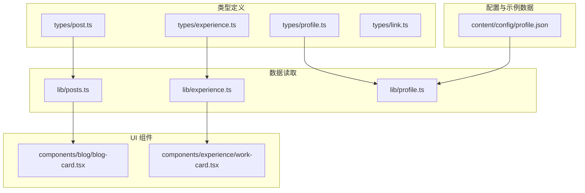
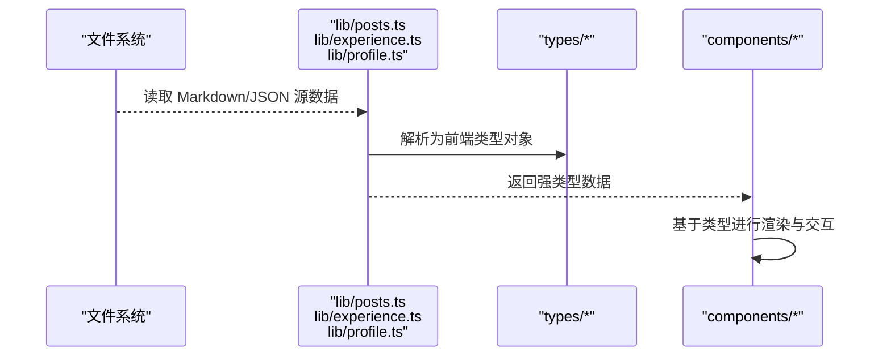
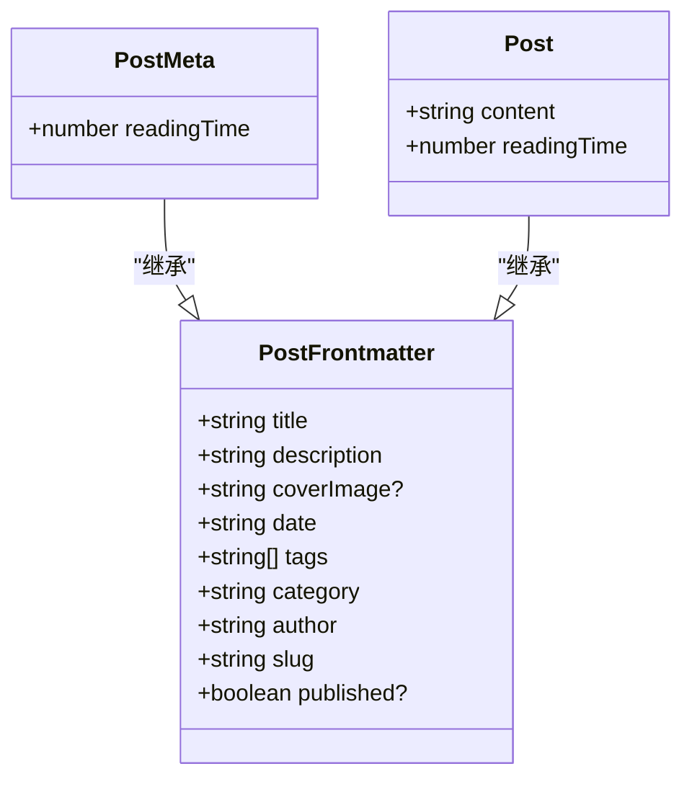
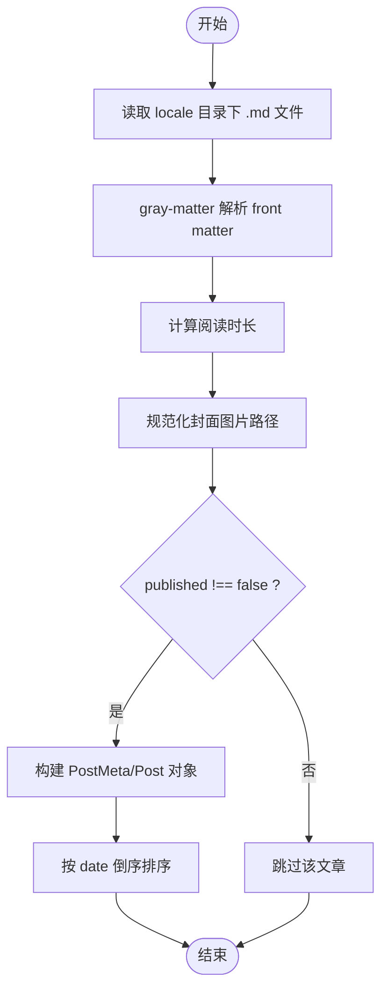
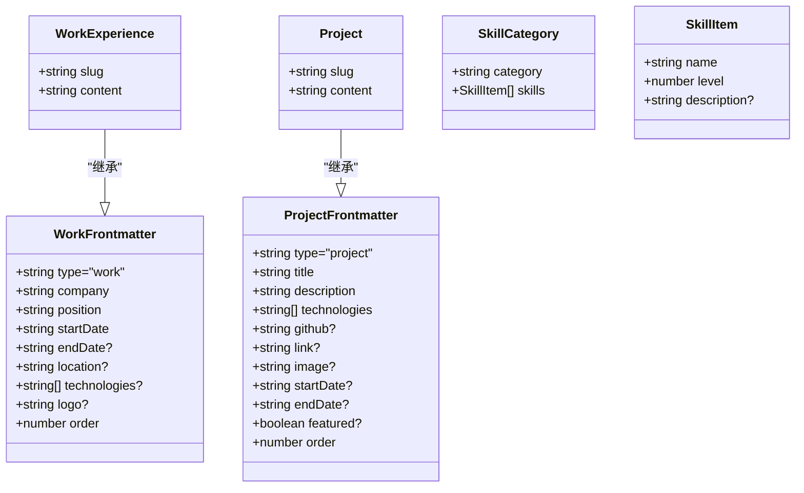
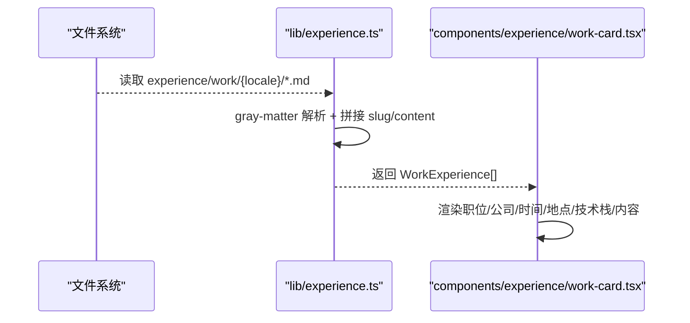
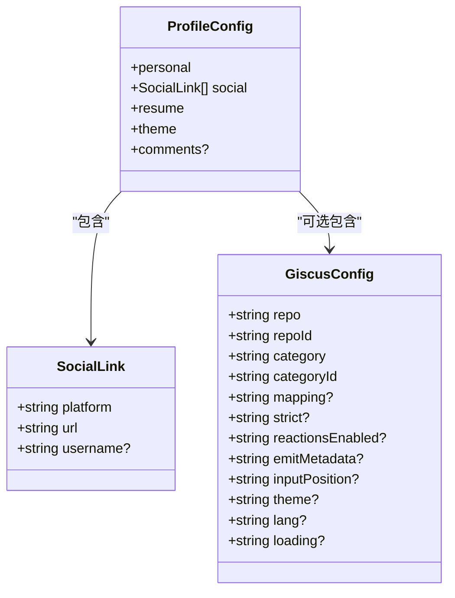
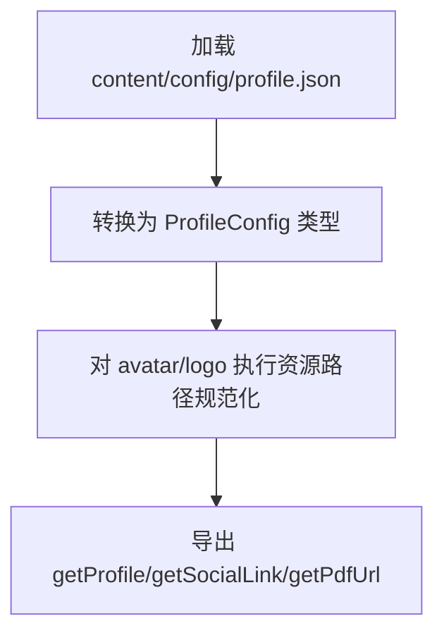
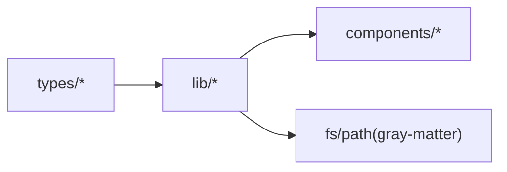

# 数据结构设计

<cite>
**本文引用的文件**   
- [types/post.ts](file://types/post.ts)
- [types/experience.ts](file://types/experience.ts)
- [types/profile.ts](file://types/profile.ts)
- [types/link.ts](file://types/link.ts)
- [lib/posts.ts](file://lib/posts.ts)
- [lib/experience.ts](file://lib/experience.ts)
- [lib/profile.ts](file://lib/profile.ts)
- [content/config/profile.json](file://content/config/profile.json)
- [components/blog/blog-card.tsx](file://components/blog/blog-card.tsx)
- [components/experience/work-card.tsx](file://components/experience/work-card.tsx)
</cite>

## 目录
1. [简介](#简介)
2. [项目结构](#项目结构)
3. [核心组件](#核心组件)
4. [架构总览](#架构总览)
5. [详细组件分析](#详细组件分析)
6. [依赖分析](#依赖分析)
7. [性能考虑](#性能考虑)
8. [故障排查指南](#故障排查指南)
9. [结论](#结论)
10. [附录：类型扩展指南](#附录类型扩展指南)

## 简介
本文件围绕博客项目的 TypeScript 类型系统，系统性梳理并解释以下要点：
- 核心接口定义与使用场景：Post、PostMeta、PostFrontmatter、WorkExperience、Project、ProfileConfig 等。
- 类型继承与组合模式的应用：如 PostMeta/Post 对 PostFrontmatter 的复用关系。
- 数据验证策略：编译时类型安全与运行时路径/字段处理（如资源路径规范化）。
- 经验数据模型（工作经历、项目）与个人配置结构的设计原则。
- 类型扩展指南：如何新增数据类型并保持向后兼容。

## 项目结构
本项目将类型定义集中于 types 目录，数据读取逻辑集中在 lib 目录，UI 组件在 components 目录按需消费类型。配置文件位于 content/config 下，示例内容以 Markdown front matter 和 JSON 形式组织。

图表来源
- [types/post.ts:1-20](file://types/post.ts#L1-L20)
- [types/experience.ts:1-48](file://types/experience.ts#L1-L48)
- [types/profile.ts:1-52](file://types/profile.ts#L1-L52)
- [lib/posts.ts:1-121](file://lib/posts.ts#L1-L121)
- [lib/experience.ts:1-147](file://lib/experience.ts#L1-L147)
- [lib/profile.ts:1-30](file://lib/profile.ts#L1-L30)
- [content/config/profile.json:1-66](file://content/config/profile.json#L1-L66)
- [components/blog/blog-card.tsx:1-156](file://components/blog/blog-card.tsx#L1-L156)
- [components/experience/work-card.tsx:1-69](file://components/experience/work-card.tsx#L1-L69)

章节来源
- [types/post.ts:1-20](file://types/post.ts#L1-L20)
- [types/experience.ts:1-48](file://types/experience.ts#L1-L48)
- [types/profile.ts:1-52](file://types/profile.ts#L1-L52)
- [lib/posts.ts:1-121](file://lib/posts.ts#L1-L121)
- [lib/experience.ts:1-147](file://lib/experience.ts#L1-L147)
- [lib/profile.ts:1-30](file://lib/profile.ts#L1-L30)
- [content/config/profile.json:1-66](file://content/config/profile.json#L1-L66)
- [components/blog/blog-card.tsx:1-156](file://components/blog/blog-card.tsx#L1-L156)
- [components/experience/work-card.tsx:1-69](file://components/experience/work-card.tsx#L1-L69)

## 核心组件
本节聚焦核心类型及其职责边界：
- 文章类型族：PostFrontmatter（元信息）、PostMeta（列表展示用）、Post（详情展示用）。
- 经验类型族：WorkFrontmatter/WorkExperience、ProjectFrontmatter/Project、SkillCategory/SkillItem。
- 个人配置：ProfileConfig、SocialLink、GiscusConfig。
- 友链：FriendLink。

这些类型通过“前缀 Frontmatter + 完整实体”的组合方式，实现“最小必要字段用于列表/摘要，完整字段用于详情”的分层设计。

章节来源
- [types/post.ts:1-20](file://types/post.ts#L1-L20)
- [types/experience.ts:1-48](file://types/experience.ts#L1-L48)
- [types/profile.ts:1-52](file://types/profile.ts#L1-L52)
- [types/link.ts:1-8](file://types/link.ts#L1-L8)

## 架构总览
下图展示了从静态内容到 UI 渲染的类型流转过程，强调“类型驱动的数据装配”。

图表来源
- [lib/posts.ts:1-121](file://lib/posts.ts#L1-L121)
- [lib/experience.ts:1-147](file://lib/experience.ts#L1-L147)
- [lib/profile.ts:1-30](file://lib/profile.ts#L1-L30)
- [types/post.ts:1-20](file://types/post.ts#L1-L20)
- [types/experience.ts:1-48](file://types/experience.ts#L1-L48)
- [types/profile.ts:1-52](file://types/profile.ts#L1-L52)

## 详细组件分析

### 文章类型体系（PostFrontmatter / PostMeta / Post）
- 设计要点
  - PostFrontmatter 定义文章元信息（标题、描述、封面、日期、标签、分类、作者、slug、是否发布等）。
  - PostMeta 继承自 PostFrontmatter，增加阅读时长，适合列表页展示。
  - Post 继承自 PostFrontmatter，包含正文内容与阅读时长，适合详情页展示。
- 使用场景
  - 列表/聚合：getAllPosts、getPostsByTag、getPostsByCategory、getRelatedPosts 均返回 PostMeta[]。
  - 详情：getPostBySlug 返回 Post | null。
- 关键流程
  - 读取 Markdown → gray-matter 解析 front matter → 计算阅读时长 → 组装 PostMeta/Post。
  - 过滤未发布文章、按日期倒序排序。
  - 相关度推荐：基于标签重叠与同分类加权评分后截断。

图表来源
- [types/post.ts:1-20](file://types/post.ts#L1-L20)

图表来源
- [lib/posts.ts:15-47](file://lib/posts.ts#L15-L47)
- [lib/posts.ts:49-71](file://lib/posts.ts#L49-L71)
- [lib/posts.ts:95-121](file://lib/posts.ts#L95-L121)

章节来源
- [types/post.ts:1-20](file://types/post.ts#L1-L20)
- [lib/posts.ts:1-121](file://lib/posts.ts#L1-L121)
- [components/blog/blog-card.tsx:1-156](file://components/blog/blog-card.tsx#L1-L156)

### 经验数据模型（WorkExperience / Project / SkillCategory）
- 设计要点
  - WorkFrontmatter/WorkExperience：工作经历的前置信息与完整实体，支持可选结束时间表示“至今”，含排序 order。
  - ProjectFrontmatter/Project：项目的前置信息与完整实体，支持精选 featured、排序 order、技术栈 technologies。
  - SkillCategory/SkillItem：技能分层的类别与条目，level 为 0-100 的数值等级。
- 使用场景
  - 工作经历：getAllWorkExperiences、getWorkExperienceBySlug。
  - 项目：getAllProjects、getFeaturedProjects、getProjectBySlug。
  - 技能：getSkills（优先当前语言，回退英文）。
  - 聚合：getExperienceData 一次性返回 work/projects/skills。

图表来源
- [types/experience.ts:1-48](file://types/experience.ts#L1-L48)

图表来源
- [lib/experience.ts:17-46](file://lib/experience.ts#L17-L46)
- [components/experience/work-card.tsx:1-69](file://components/experience/work-card.tsx#L1-L69)

章节来源
- [types/experience.ts:1-48](file://types/experience.ts#L1-L48)
- [lib/experience.ts:1-147](file://lib/experience.ts#L1-L147)
- [components/experience/work-card.tsx:1-69](file://components/experience/work-card.tsx#L1-L69)

### 个人配置结构（ProfileConfig）
- 设计要点
  - ProfileConfig 包含 personal（个人信息、求职状态、多语 bio、位置、邮箱）、social（社交链接数组）、resume（PDF 地址与更新时间）、theme（主题色）、comments（可选评论配置）。
  - SocialLink 使用字面量联合类型限定平台枚举值；GiscusConfig 提供评论系统的可选项。
- 使用场景
  - getProfile：加载 profile.json，并对 avatar/logo 做资源路径规范化。
  - getSocialLink：按平台检索社交链接。
  - getPdfUrl：为 iframe 等需要手动拼接 base path 的场景提供 PDF 地址。

图表来源
- [types/profile.ts:1-52](file://types/profile.ts#L1-L52)

图表来源
- [lib/profile.ts:1-30](file://lib/profile.ts#L1-L30)
- [content/config/profile.json:1-66](file://content/config/profile.json#L1-L66)

章节来源
- [types/profile.ts:1-52](file://types/profile.ts#L1-L52)
- [lib/profile.ts:1-30](file://lib/profile.ts#L1-L30)
- [content/config/profile.json:1-66](file://content/config/profile.json#L1-L66)

### 友链类型（FriendLink）
- 设计要点
  - FriendLink 描述友链的基本信息，包含名称、描述、URL，以及可选头像与分类。
- 使用场景
  - 适用于站点“友情链接”页面或侧边栏展示。

章节来源
- [types/link.ts:1-8](file://types/link.ts#L1-L8)

## 依赖分析
- 模块耦合
  - lib/* 仅依赖 types/* 与文件系统，不直接依赖 UI 组件，保持数据层与表现层解耦。
  - components/* 仅消费 lib/* 输出的强类型数据，避免跨层访问文件系统。
- 外部依赖
  - gray-matter 用于解析 Markdown front matter。
  - fs/path 用于本地文件读取与路径拼接。
- 潜在循环依赖
  - 当前结构清晰，未见循环导入迹象。

图表来源
- [lib/posts.ts:1-121](file://lib/posts.ts#L1-L121)
- [lib/experience.ts:1-147](file://lib/experience.ts#L1-L147)
- [lib/profile.ts:1-30](file://lib/profile.ts#L1-L30)
- [types/post.ts:1-20](file://types/post.ts#L1-L20)
- [types/experience.ts:1-48](file://types/experience.ts#L1-L48)
- [types/profile.ts:1-52](file://types/profile.ts#L1-L52)

章节来源
- [lib/posts.ts:1-121](file://lib/posts.ts#L1-L121)
- [lib/experience.ts:1-147](file://lib/experience.ts#L1-L147)
- [lib/profile.ts:1-30](file://lib/profile.ts#L1-L30)

## 性能考虑
- 列表型查询（getAllPosts、getAllProjects、getAllWorkExperiences）采用同步 I/O 读取与内存排序，适合静态站点预渲染阶段。若内容规模增长，建议：
  - 引入缓存层（如内存缓存或磁盘缓存），避免重复解析。
  - 对大文档的阅读时长计算进行增量或懒计算。
- 相关度推荐（getRelatedPosts）涉及全量遍历与打分，可在数据量较大时引入索引或预计算。
- 资源路径规范化（getAssetPath）在每次读取时调用，若频繁调用可考虑在数据装配阶段批量处理。

[本节为通用性能建议，无需特定文件引用]

## 故障排查指南
- 文件不存在
  - getAllPosts/getAllWorkExperiences/getAllProjects 在目录不存在时返回空数组，不会抛错。
  - getPostBySlug/getWorkExperienceBySlug/getProjectBySlug 在文件缺失时返回 null，调用方需做空值处理。
- Windows 换行符问题
  - 经验数据读取时对 CRLF→LF 做了统一替换，以避免部署环境字节长度不一致导致的异常。
- 资源路径
  - 封面图、头像、Logo 等路径通过 getAssetPath 规范化，确保在不同部署环境下正确加载。

章节来源
- [lib/posts.ts:15-47](file://lib/posts.ts#L15-L47)
- [lib/posts.ts:49-71](file://lib/posts.ts#L49-L71)
- [lib/experience.ts:17-46](file://lib/experience.ts#L17-L46)
- [lib/experience.ts:71-98](file://lib/experience.ts#L71-L98)
- [lib/experience.ts:104-120](file://lib/experience.ts#L104-L120)

## 结论
本项目采用“类型先行、数据装配、UI 消费”的清晰分层：
- 通过 PostFrontmatter/PostMeta/Post 的继承与组合，实现“列表精简、详情完整”的数据模型。
- 经验数据与工作/项目/技能采用相同范式，便于扩展与维护。
- 个人配置以强类型约束，结合运行时路径规范化，兼顾灵活性与安全性。
- 整体结构低耦合、高内聚，具备良好的可扩展性与可维护性。

[本节为总结性内容，无需特定文件引用]

## 附录：类型扩展指南
- 新增文章字段
  - 在 PostFrontmatter 中新增字段，PostMeta/Post 自动继承。
  - 在 lib/posts.ts 的数据装配处补充新字段的读取与转换逻辑。
  - 更新 UI 组件以消费新字段。
- 新增经验类型
  - 在 types/experience.ts 中新增 Frontmatter 与完整实体类型。
  - 在 lib/experience.ts 中新增对应的读取与聚合函数。
  - 在对应页面组件中消费新类型。
- 新增配置项
  - 在 types/profile.ts 中扩展 ProfileConfig 或其子结构。
  - 在 content/config/profile.json 中补充相应键值。
  - 在 lib/profile.ts 中按需添加路径规范化或默认值处理。
- 保持向后兼容
  - 新增字段尽量设为可选，避免破坏现有消费者。
  - 对必填字段提供默认值或在数据装配阶段补齐。
  - 对枚举类字段使用字面量联合类型，限制取值范围。

[本节为通用扩展指导，无需特定文件引用]