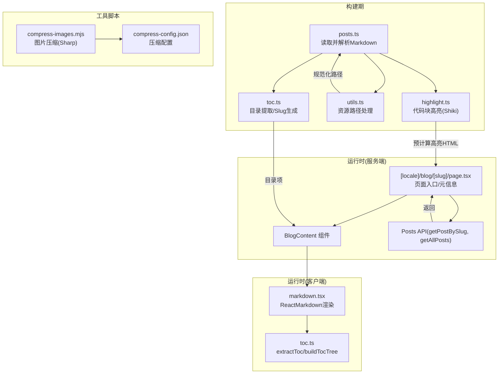
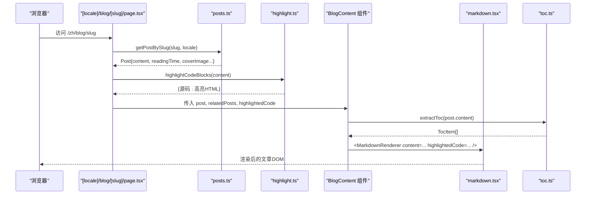
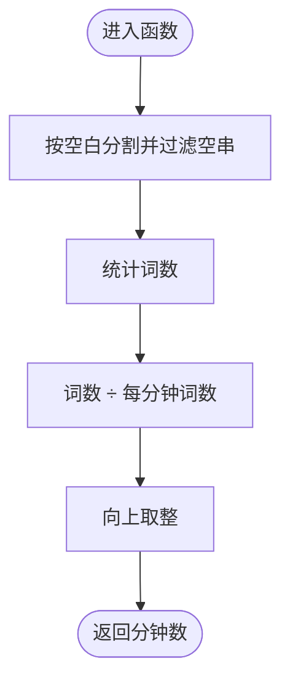
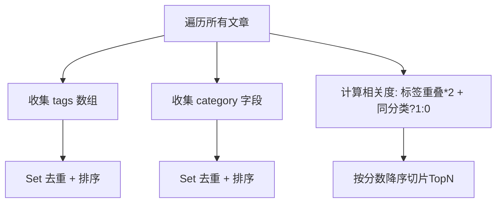
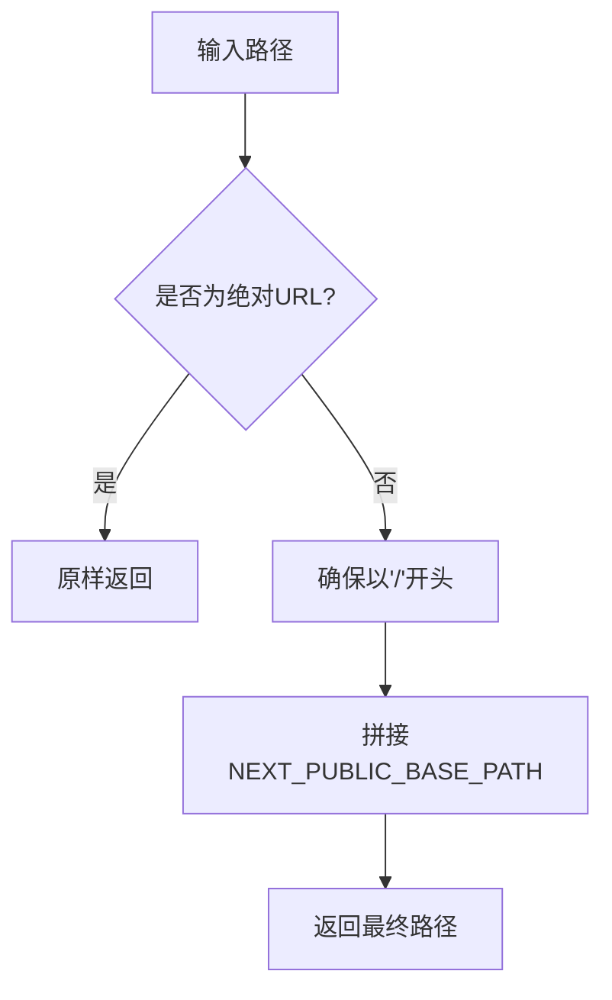
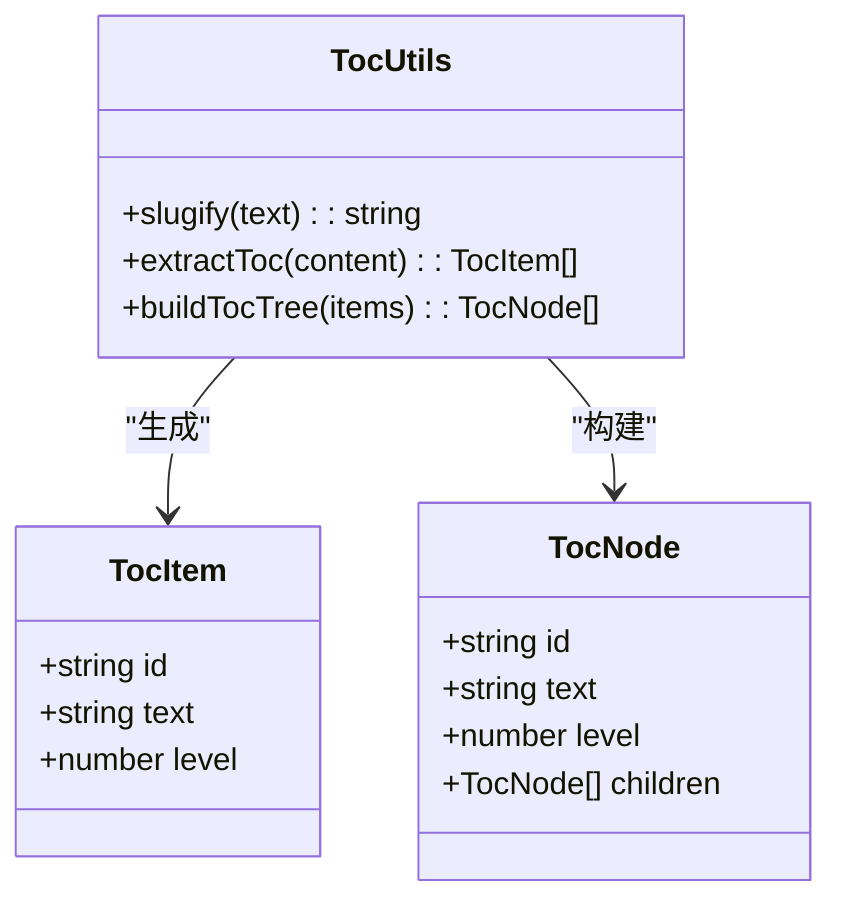
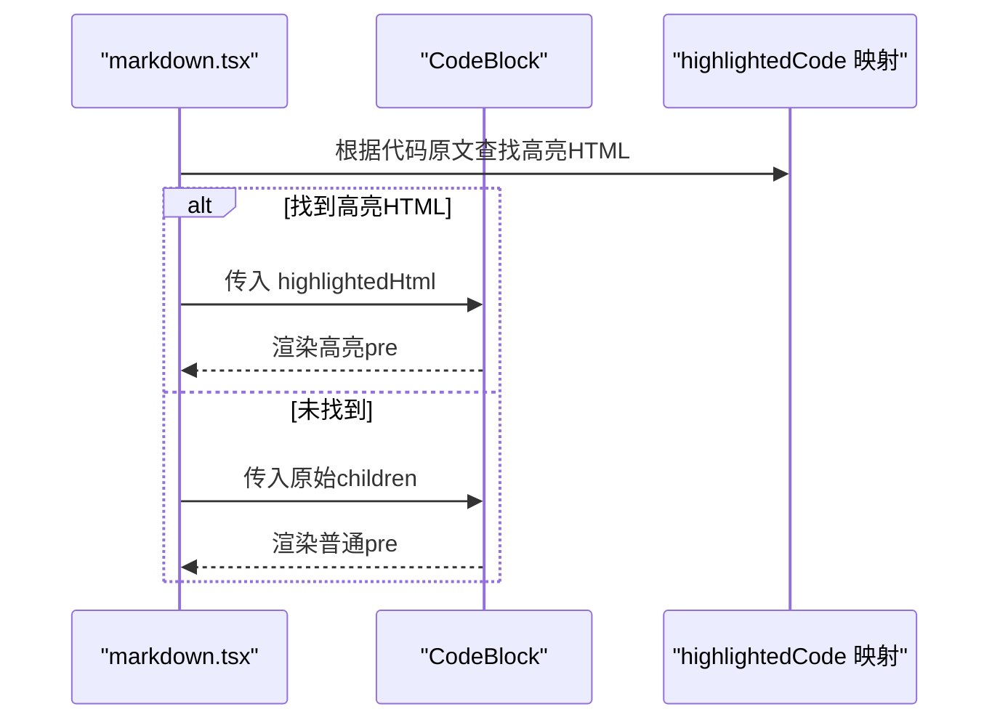
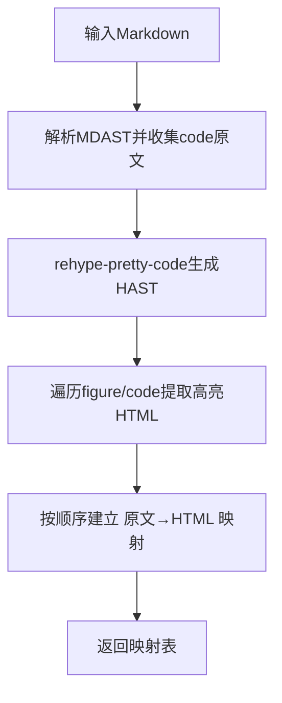
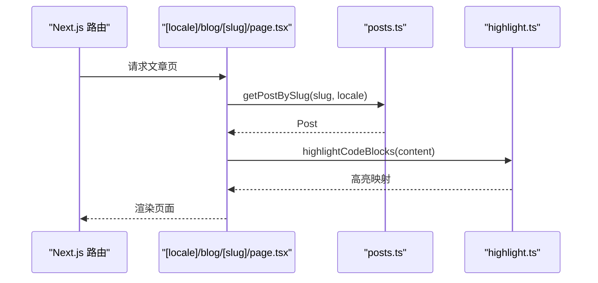
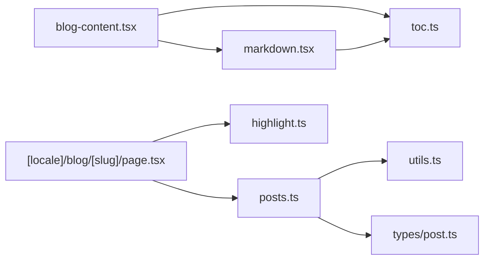

# 数据处理管道

<cite>
**本文引用的文件**   
- [lib/posts.ts](file://lib/posts.ts)
- [lib/toc.ts](file://lib/toc.ts)
- [lib/markdown.tsx](file://lib/markdown.tsx)
- [lib/utils.ts](file://lib/utils.ts)
- [types/post.ts](file://types/post.ts)
- [components/blog/blog-content.tsx](file://components/blog/blog-content.tsx)
- [app/[locale]/blog/[slug]/page.tsx](file://app/[locale]/blog/[slug]/page.tsx)
- [lib/highlight.ts](file://lib/highlight.ts)
- [scripts/compress-images.mjs](file://scripts/compress-images.mjs)
- [scripts/compress-config.json](file://scripts/compress-config.json)
</cite>

## 目录
1. [简介](#简介)
2. [项目结构](#项目结构)
3. [核心组件](#核心组件)
4. [架构总览](#架构总览)
5. [详细组件分析](#详细组件分析)
6. [依赖关系分析](#依赖关系分析)
7. [性能与内存优化](#性能与内存优化)
8. [故障排查指南](#故障排查指南)
9. [结论](#结论)
10. [附录：扩展与最佳实践](#附录扩展与最佳实践)

## 简介
本文件面向“从原始 Markdown 到结构化数据”的完整数据处理管道，覆盖以下关键能力：
- 阅读时间计算算法 calculateReadingTime
- 标签提取与分类处理逻辑（tags、category）
- 资源路径处理 getAssetPath 与图片优化集成
- 数据验证、类型转换与格式化
- 自定义数据处理函数的扩展方法与最佳实践
- 性能优化技巧与内存管理策略

该管道在构建期读取 content/posts 下的多语言 Markdown 文件，解析 frontmatter 与正文内容，生成可用于页面渲染的结构化对象，并在服务端进行代码高亮预处理；客户端负责渲染 Markdown、目录树与交互。

## 项目结构
下图展示了与数据处理管道相关的核心模块及其职责边界：

图表来源
- [lib/posts.ts:1-121](file://lib/posts.ts#L1-L121)
- [lib/toc.ts:1-93](file://lib/toc.ts#L1-L93)
- [lib/markdown.tsx:1-318](file://lib/markdown.tsx#L1-L318)
- [lib/utils.ts:1-26](file://lib/utils.ts#L1-L26)
- [lib/highlight.ts:1-73](file://lib/highlight.ts#L1-L73)
- [components/blog/blog-content.tsx:1-254](file://components/blog/blog-content.tsx#L1-L254)
- [app/[locale]/blog/[slug]/page.tsx:1-180](file://app/[locale]/blog/[slug]/page.tsx#L1-L180)
- [scripts/compress-images.mjs:1-230](file://scripts/compress-images.mjs#L1-L230)
- [scripts/compress-config.json:1-12](file://scripts/compress-config.json#L1-L12)

章节来源
- [lib/posts.ts:1-121](file://lib/posts.ts#L1-L121)
- [lib/toc.ts:1-93](file://lib/toc.ts#L1-L93)
- [lib/markdown.tsx:1-318](file://lib/markdown.tsx#L1-L318)
- [lib/utils.ts:1-26](file://lib/utils.ts#L1-L26)
- [lib/highlight.ts:1-73](file://lib/highlight.ts#L1-L73)
- [components/blog/blog-content.tsx:1-254](file://components/blog/blog-content.tsx#L1-L254)
- [app/[locale]/blog/[slug]/page.tsx:1-180](file://app/[locale]/blog/[slug]/page.tsx#L1-L180)
- [scripts/compress-images.mjs:1-230](file://scripts/compress-images.mjs#L1-L230)
- [scripts/compress-config.json:1-12](file://scripts/compress-config.json#L1-L12)

## 核心组件
- 文章聚合与元数据生成：读取 posts 目录，解析 frontmatter，计算阅读时间，归一化封面图路径，过滤未发布文章，按日期排序。
- 目录与锚点：基于标题文本生成 URL-friendly 的 slug，支持中英文；从正文提取 h1-h3 目录项，并构建层级树。
- Markdown 渲染：使用 ReactMarkdown + remarkGfm，定制标题锚点、链接、表格、代码块等节点渲染。
- 资源路径处理：根据部署 basePath 前缀统一资源路径，同时放行外部绝对地址。
- 代码高亮：构建期通过 Shiki 对代码块进行语法高亮，返回 HTML 映射表供客户端直接注入。
- 图片优化：构建后脚本扫描 out 目录，按配置使用 Sharp 压缩或格式转换。

章节来源
- [lib/posts.ts:1-121](file://lib/posts.ts#L1-L121)
- [lib/toc.ts:1-93](file://lib/toc.ts#L1-L93)
- [lib/markdown.tsx:1-318](file://lib/markdown.tsx#L1-L318)
- [lib/utils.ts:1-26](file://lib/utils.ts#L1-L26)
- [lib/highlight.ts:1-73](file://lib/highlight.ts#L1-L73)
- [scripts/compress-images.mjs:1-230](file://scripts/compress-images.mjs#L1-L230)
- [scripts/compress-config.json:1-12](file://scripts/compress-config.json#L1-L12)

## 架构总览
下图展示一次博客文章页面的请求-响应流程，包括服务端数据获取、构建期高亮、客户端渲染与目录生成。

图表来源
- [app/[locale]/blog/[slug]/page.tsx:1-180](file://app/[locale]/blog/[slug]/page.tsx#L1-L180)
- [lib/posts.ts:1-121](file://lib/posts.ts#L1-L121)
- [lib/highlight.ts:1-73](file://lib/highlight.ts#L1-L73)
- [components/blog/blog-content.tsx:1-254](file://components/blog/blog-content.tsx#L1-L254)
- [lib/markdown.tsx:1-318](file://lib/markdown.tsx#L1-L318)
- [lib/toc.ts:1-93](file://lib/toc.ts#L1-L93)

## 详细组件分析

### 阅读时间计算算法 calculateReadingTime
- 输入：纯文本字符串（正文内容）
- 过程：以空白字符为分隔统计词数，按固定每分钟词数估算阅读时长，向上取整
- 输出：分钟数（整数）
- 复杂度：O(n)，n 为字符数；空间 O(1)
- 适用性：适合英文与中文混合场景（按空白切分近似词数），若需更精确可引入分词库

图表来源
- [lib/posts.ts:9-13](file://lib/posts.ts#L9-L13)

章节来源
- [lib/posts.ts:9-13](file://lib/posts.ts#L9-L13)

### 标签提取与分类处理
- 标签 tags：从每篇文章 frontmatter 中收集，去重并排序，提供按标签筛选接口
- 分类 category：从每篇文章 frontmatter 中收集，去重并排序，提供按分类筛选接口
- 相关度推荐：基于标签重叠数量与是否同分类加权评分，降序截取 Top N

图表来源
- [lib/posts.ts:73-93](file://lib/posts.ts#L73-L93)
- [lib/posts.ts:95-121](file://lib/posts.ts#L95-L121)

章节来源
- [lib/posts.ts:73-93](file://lib/posts.ts#L73-L93)
- [lib/posts.ts:95-121](file://lib/posts.ts#L95-L121)

### 资源路径处理 getAssetPath 与图片优化集成
- 功能：为相对路径添加 NEXT_PUBLIC_BASE_PATH 前缀，保持绝对 URL（http/https/data:////）不变
- 用途：封面图、头像等资源在不同部署环境（如 GitHub Pages）下正确加载
- 图片优化：构建后运行 compress-images.mjs，依据 compress-config.json 对 out 目录下图片进行阈值判断、格式选择、可选缩放与压缩，并输出报告

图表来源
- [lib/utils.ts:16-25](file://lib/utils.ts#L16-L25)

章节来源
- [lib/utils.ts:16-25](file://lib/utils.ts#L16-L25)
- [scripts/compress-images.mjs:1-230](file://scripts/compress-images.mjs#L1-L230)
- [scripts/compress-config.json:1-12](file://scripts/compress-config.json#L1-L12)

### 目录与锚点：slugify、extractToc、buildTocTree
- slugify：将标题文本转为 URL-friendly 的 slug，兼容中英文，去除特殊字符与多余连字符
- extractToc：先剔除代码块，再正则匹配 h1-h3 标题，生成 TocItem 列表
- buildTocTree：基于栈的线性扫描，将扁平列表构造成层级树

图表来源
- [lib/toc.ts:1-93](file://lib/toc.ts#L1-L93)

章节来源
- [lib/toc.ts:1-93](file://lib/toc.ts#L1-L93)

### Markdown 渲染与代码块处理
- 使用 ReactMarkdown + remarkGfm 渲染
- 自定义 h1-h4 节点：自动根据标题文本生成锚点 ID，并附加跳转链接
- 自定义 a 节点：外链自动 target="_blank" 与 rel="noopener noreferrer"
- 自定义 pre/code：识别语言标记，结合构建期生成的 highlightedCode 映射，优先渲染高亮 HTML；否则回退为纯文本
- CodeBlock 组件：支持复制、折叠、语言标识显示

图表来源
- [lib/markdown.tsx:125-186](file://lib/markdown.tsx#L125-L186)
- [lib/markdown.tsx:195-283](file://lib/markdown.tsx#L195-L283)

章节来源
- [lib/markdown.tsx:1-318](file://lib/markdown.tsx#L1-L318)

### 服务端代码高亮 pipeline
- 构建期执行 highlightCodeBlocks：
  - 第一遍：解析 MDAST，收集所有 code 块的原始文本顺序
  - 第二遍：remark-parse → remark-gfm → remark-rehype → rehype-pretty-code（Shiki）
  - 遍历 HAST，定位 figure[data-rehype-pretty-code-figure] 中的 code 元素，序列化 HTML
  - 按文档顺序将“原文→高亮HTML”建立映射
- 客户端 markdown.tsx 通过相同规则提取代码原文作为键，查表注入高亮 HTML

图表来源
- [lib/highlight.ts:27-72](file://lib/highlight.ts#L27-L72)

章节来源
- [lib/highlight.ts:1-73](file://lib/highlight.ts#L1-L73)

### 页面入口与数据组装
- generateStaticParams：枚举所有语言与文章 slug，静态生成路由
- generateMetadata：基于文章 frontmatter 生成 SEO 元信息、OpenGraph/Twitter 卡片、多语言 alternates
- 默认导出：调用 getPostBySlug 获取文章，getRelatedPosts 获取相关文章，highlightCodeBlocks 预计算高亮，组合后渲染 BlogContent

图表来源
- [app/[locale]/blog/[slug]/page.tsx:24-180](file://app/[locale]/blog/[slug]/page.tsx#L24-L180)
- [lib/posts.ts:49-71](file://lib/posts.ts#L49-L71)
- [lib/highlight.ts:27-72](file://lib/highlight.ts#L27-L72)

章节来源
- [app/[locale]/blog/[slug]/page.tsx:1-180](file://app/[locale]/blog/[slug]/page.tsx#L1-L180)

## 依赖关系分析
- posts.ts 依赖：
  - fs/path：文件系统读写与路径拼接
  - gray-matter：解析 frontmatter
  - types/post.ts：定义数据结构
  - lib/utils.ts：资源路径处理
- blog-content.tsx 依赖：
  - lib/markdown.tsx：Markdown 渲染
  - lib/toc.ts：目录提取
  - types/post.ts：类型约束
- markdown.tsx 依赖：
  - react-markdown、remark-gfm：Markdown 解析与扩展
  - lib/toc.ts：标题 slug 生成
- highlight.ts 依赖：
  - unified、remark-*、rehype-*、rehype-pretty-code、unist-util-visit、hast-util-to-html：构建期 AST 处理与高亮

图表来源
- [lib/posts.ts:1-121](file://lib/posts.ts#L1-L121)
- [lib/utils.ts:1-26](file://lib/utils.ts#L1-L26)
- [types/post.ts:1-20](file://types/post.ts#L1-L20)
- [components/blog/blog-content.tsx:1-254](file://components/blog/blog-content.tsx#L1-L254)
- [lib/markdown.tsx:1-318](file://lib/markdown.tsx#L1-L318)
- [lib/toc.ts:1-93](file://lib/toc.ts#L1-L93)
- [app/[locale]/blog/[slug]/page.tsx:1-180](file://app/[locale]/blog/[slug]/page.tsx#L1-L180)
- [lib/highlight.ts:1-73](file://lib/highlight.ts#L1-L73)

章节来源
- [lib/posts.ts:1-121](file://lib/posts.ts#L1-L121)
- [lib/utils.ts:1-26](file://lib/utils.ts#L1-L26)
- [types/post.ts:1-20](file://types/post.ts#L1-L20)
- [components/blog/blog-content.tsx:1-254](file://components/blog/blog-content.tsx#L1-L254)
- [lib/markdown.tsx:1-318](file://lib/markdown.tsx#L1-L318)
- [lib/toc.ts:1-93](file://lib/toc.ts#L1-L93)
- [app/[locale]/blog/[slug]/page.tsx:1-180](file://app/[locale]/blog/[slug]/page.tsx#L1-L180)
- [lib/highlight.ts:1-73](file://lib/highlight.ts#L1-L73)

## 性能与内存优化
- 构建期高亮：
  - 仅在构建时运行 Shiki，避免客户端同步执行异步高亮带来的阻塞
  - 通过“原文→高亮HTML”映射减少重复解析
- 目录提取：
  - 先剔除代码块再匹配标题，避免误判
  - 线性扫描构建层级树，时间复杂度 O(n)
- 图片优化：
  - 仅处理超过阈值的图片，跳过小图节省 IO
  - 可选将大图缩放到合理尺寸，降低后续传输体积
  - 使用原子写入（临时文件+rename）避免损坏源文件
- 内存建议：
  - 大文档处理时避免一次性持有过多中间对象，尽量流式或分批处理
  - 控制并发度，避免大量文件同时打开导致句柄耗尽
- 缓存策略：
  - 可将高亮映射与目录结果持久化到磁盘，增量构建时复用
  - 对静态资源路径规范化结果做轻量缓存

章节来源
- [lib/highlight.ts:27-72](file://lib/highlight.ts#L27-L72)
- [lib/toc.ts:36-93](file://lib/toc.ts#L36-L93)
- [scripts/compress-images.mjs:53-125](file://scripts/compress-images.mjs#L53-L125)

## 故障排查指南
- 封面图路径异常
  - 检查 NEXT_PUBLIC_BASE_PATH 环境变量是否正确设置
  - 确认封面图路径为相对路径或合法绝对 URL
- 代码高亮缺失
  - 确认构建期已执行 highlightCodeBlocks 且返回映射非空
  - 核对客户端提取的代码原文是否与构建期一致（注意换行与空白）
- 目录锚点不生效
  - 检查标题文本是否包含特殊字符导致 slug 为空
  - 确认 extractToc 能匹配到对应标题（不在代码块内）
- 图片未压缩
  - 检查 compress-config.json 的 sizeThresholdMB 与 extensions 配置
  - 确认脚本输入目录存在且包含目标图片

章节来源
- [lib/utils.ts:16-25](file://lib/utils.ts#L16-L25)
- [lib/highlight.ts:27-72](file://lib/highlight.ts#L27-L72)
- [lib/toc.ts:36-59](file://lib/toc.ts#L36-L59)
- [scripts/compress-images.mjs:154-230](file://scripts/compress-images.mjs#L154-L230)

## 结论
该数据处理管道围绕“构建期解析与预处理 + 客户端渲染”展开，实现了从 Markdown 到结构化数据的稳定转化。通过阅读时间估算、标签/分类聚合、目录生成、资源路径规范化与代码高亮映射，既保证了页面渲染体验，又兼顾了构建期性能与可扩展性。配合图片压缩脚本，进一步提升了前端资源效率。

## 附录：扩展与最佳实践
- 自定义数据处理函数
  - 在 posts.ts 中新增钩子：在解析 frontmatter 后、返回 PostMeta/Post 前插入自定义字段计算（如摘要、关键词密度、SEO 评分）
  - 在 markdown.tsx 的 components 映射中添加自定义节点处理器（例如自定义 admonition、数学公式）
  - 在 toc.ts 中扩展 slugify 规则或支持更多标题级别
- 类型安全
  - 在 types/post.ts 中扩展 PostFrontmatter 字段，并在 posts.ts 中严格断言与校验
- 错误处理
  - 对 fs.readFileSync 与 matter 解析增加 try/catch 与日志记录
  - 对 getAssetPath 输入进行白名单校验，防止注入
- 性能优化
  - 对 getAllPosts 的结果进行内存级缓存，避免重复扫描
  - 对 extractToc 与 highlightCodeBlocks 的输出进行持久化缓存，实现增量构建
- 图片优化
  - 按需开启 convertToWebP，并结合 CDN 的 AVIF/WebP 回退策略
  - 调整 quality 与 sizeThresholdMB 平衡画质与体积

章节来源
- [lib/posts.ts:1-121](file://lib/posts.ts#L1-L121)
- [lib/markdown.tsx:1-318](file://lib/markdown.tsx#L1-L318)
- [lib/toc.ts:1-93](file://lib/toc.ts#L1-L93)
- [types/post.ts:1-20](file://types/post.ts#L1-L20)
- [scripts/compress-images.mjs:1-230](file://scripts/compress-images.mjs#L1-L230)
- [scripts/compress-config.json:1-12](file://scripts/compress-config.json#L1-L12)