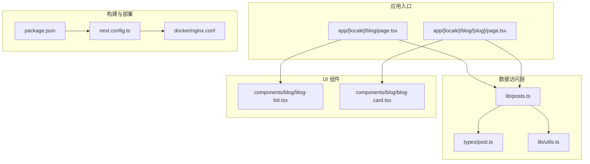
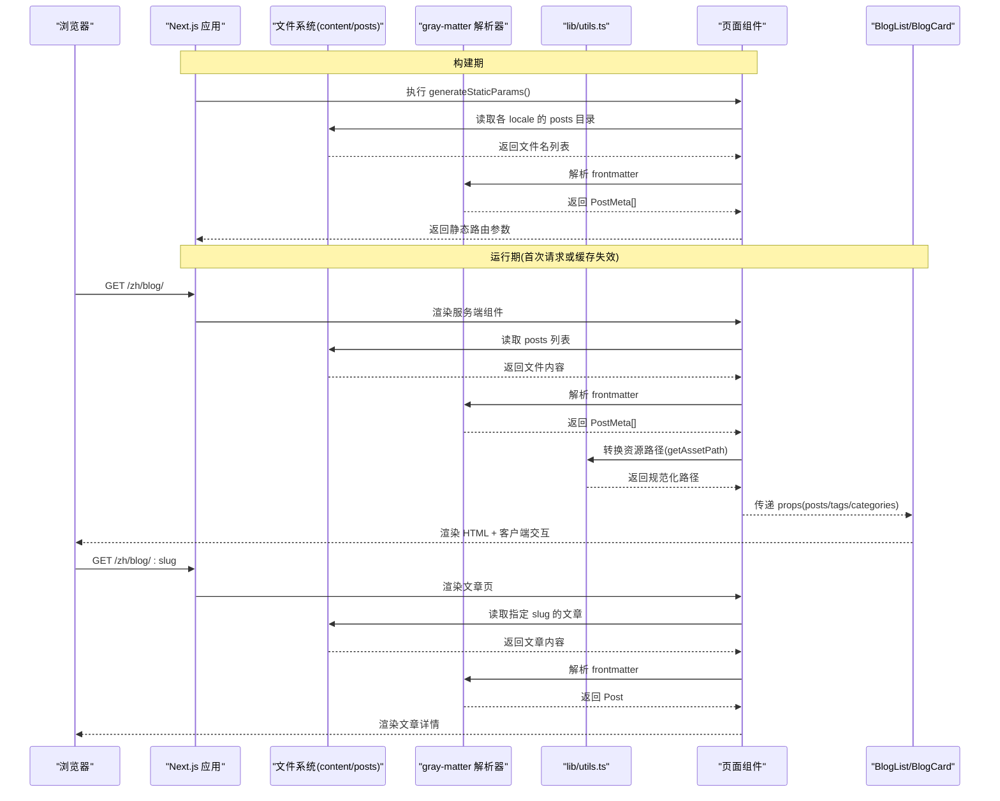
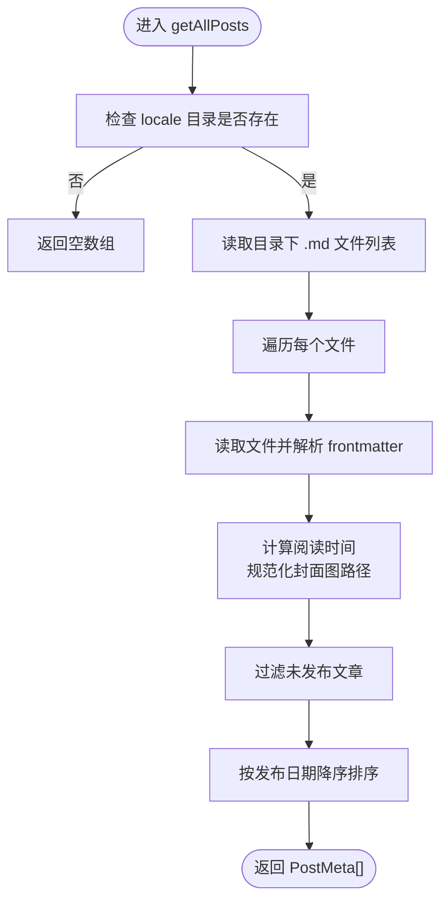
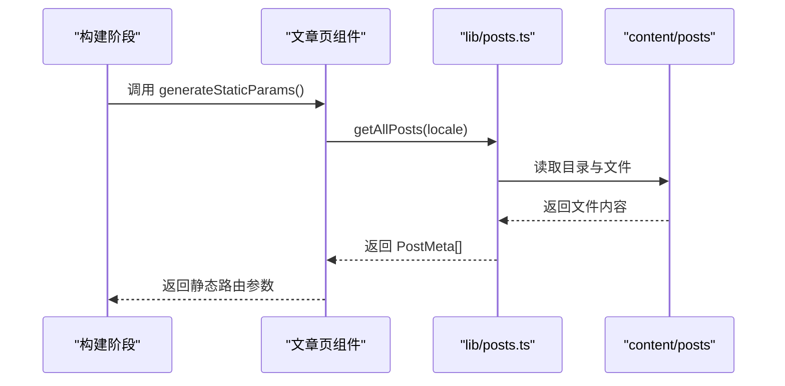
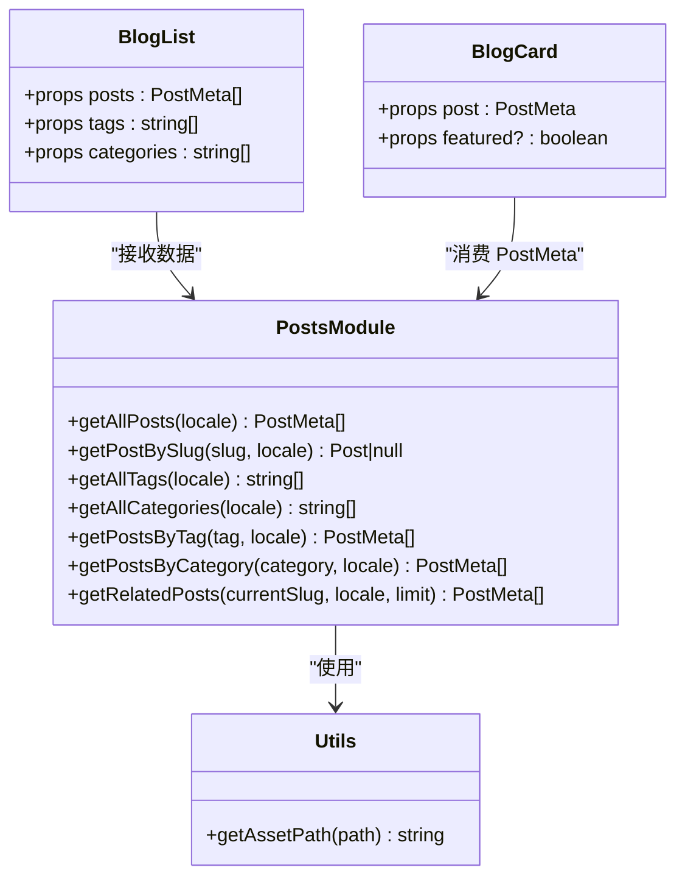

# 数据获取策略

<cite>
**本文引用的文件**   
- [lib/posts.ts](file://lib/posts.ts)
- [app/[locale]/blog/page.tsx](file://app/[locale]/blog/page.tsx)
- [app/[locale]/blog/[slug]/page.tsx](file://app/[locale]/blog/[slug]/page.tsx)
- [components/blog/blog-list.tsx](file://components/blog/blog-list.tsx)
- [components/blog/blog-card.tsx](file://components/blog/blog-card.tsx)
- [types/post.ts](file://types/post.ts)
- [lib/utils.ts](file://lib/utils.ts)
- [next.config.ts](file://next.config.ts)
- [docker/nginx.conf](file://docker/nginx.conf)
- [package.json](file://package.json)
- [lib/highlight.ts](file://lib/highlight.ts)
</cite>

## 目录
1. [简介](#简介)
2. [项目结构](#项目结构)
3. [核心组件](#核心组件)
4. [架构总览](#架构总览)
5. [详细组件分析](#详细组件分析)
6. [依赖关系分析](#依赖关系分析)
7. [性能考量](#性能考量)
8. [故障排查指南](#故障排查指南)
9. [结论](#结论)
10. [附录](#附录)

## 简介
本文件围绕 Next.js 中的数据获取策略，系统性梳理本项目在静态生成与服务器端渲染（RSC）场景下的最佳实践。重点包括：
- 构建时数据预取：通过 generateStaticParams 与同步读取 Markdown 源文件，实现全量路由的静态化。
- 运行时数据加载：服务端组件中直接调用本地文件系统函数进行按需读取。
- getAllPosts、getPostBySlug 等函数的实现原理与优化点。
- 缓存策略：Node.js 层文件系统 I/O 与浏览器/CDN 层缓存配置。
- ISR 增量静态再生成的适用性与落地方案。
- 性能监控方法与优化建议。

## 项目结构
本项目采用 App Router + RSC 架构，数据主要来源于 content/posts 下的多语言 Markdown 文件。页面与服务端逻辑集中在 app 目录，数据访问封装在 lib/posts.ts，UI 组件位于 components 目录。

图表来源
- [app/[locale]/blog/page.tsx:1-34](file://app/[locale]/blog/page.tsx#L1-L34)
- [app/[locale]/blog/[slug]/page.tsx:1-35](file://app/[locale]/blog/[slug]/page.tsx#L1-L35)
- [lib/posts.ts:1-47](file://lib/posts.ts#L1-L47)
- [components/blog/blog-list.tsx:1-40](file://components/blog/blog-list.tsx#L1-L40)
- [components/blog/blog-card.tsx:1-20](file://components/blog/blog-card.tsx#L1-L20)
- [next.config.ts:1-38](file://next.config.ts#L1-L38)
- [docker/nginx.conf:56-85](file://docker/nginx.conf#L56-L85)
- [package.json:1-12](file://package.json#L1-L12)

章节来源
- [app/[locale]/blog/page.tsx:1-34](file://app/[locale]/blog/page.tsx#L1-L34)
- [app/[locale]/blog/[slug]/page.tsx:1-35](file://app/[locale]/blog/[slug]/page.tsx#L1-L35)
- [lib/posts.ts:1-47](file://lib/posts.ts#L1-L47)
- [next.config.ts:1-38](file://next.config.ts#L1-L38)
- [docker/nginx.conf:56-85](file://docker/nginx.conf#L56-L85)
- [package.json:1-12](file://package.json#L1-L12)

## 核心组件
- 数据访问模块 lib/posts.ts：提供 getAllPosts、getPostBySlug、getAllTags、getAllCategories、getRelatedPosts 等函数，统一从 content/posts 下按 locale 读取 Markdown 并解析 frontmatter。
- 博客列表页 app/[locale]/blog/page.tsx：在服务端组件中调用 getAllPosts 等函数，将数据作为 props 传递给客户端组件 BlogList。
- 文章详情页 app/[locale]/blog/[slug]/page.tsx：使用 generateStaticParams 预生成所有文章路由；在 generateMetadata 和默认导出组件中按需读取单篇文章内容。
- UI 组件 blog-list.tsx、blog-card.tsx：负责展示与交互，接收服务端传入的数据进行前端过滤与排序。
- 类型定义 types/post.ts：PostFrontmatter、Post、PostMeta 明确数据结构。
- 工具函数 lib/utils.ts：资源路径处理 getAssetPath，兼容 basePath 与外部资源。
- 构建与部署 next.config.ts、docker/nginx.conf、package.json：控制输出模式、静态资源缓存与构建脚本。

章节来源
- [lib/posts.ts:15-93](file://lib/posts.ts#L15-L93)
- [app/[locale]/blog/page.tsx:25-33](file://app/[locale]/blog/page.tsx#L25-L33)
- [app/[locale]/blog/[slug]/page.tsx:24-35](file://app/[locale]/blog/[slug]/page.tsx#L24-L35)
- [components/blog/blog-list.tsx:1-40](file://components/blog/blog-list.tsx#L1-L40)
- [components/blog/blog-card.tsx:1-20](file://components/blog/blog-card.tsx#L1-L20)
- [types/post.ts:1-20](file://types/post.ts#L1-L20)
- [lib/utils.ts:16-25](file://lib/utils.ts#L16-L25)
- [next.config.ts:21-36](file://next.config.ts#L21-L36)
- [docker/nginx.conf:56-85](file://docker/nginx.conf#L56-L85)
- [package.json:5-12](file://package.json#L5-L12)

## 架构总览
下图展示了从请求到数据获取与渲染的关键流程，以及静态参数生成与元数据生成的位置。

图表来源
- [app/[locale]/blog/[slug]/page.tsx:24-35](file://app/[locale]/blog/[slug]/page.tsx#L24-L35)
- [app/[locale]/blog/page.tsx:25-33](file://app/[locale]/blog/page.tsx#L25-L33)
- [lib/posts.ts:15-71](file://lib/posts.ts#L15-L71)
- [lib/utils.ts:16-25](file://lib/utils.ts#L16-L25)

## 详细组件分析

### 数据访问模块 lib/posts.ts
- getAllPosts(locale): 
  - 行为：列出指定 locale 的 posts 目录，过滤 .md 文件，逐个读取并解析 frontmatter，计算阅读时间，过滤未发布文章，按日期倒序排序。
  - 复杂度：O(N log N)，N 为文章数量；I/O 为同步阻塞。
  - 优化点：可引入内存缓存避免重复 I/O；对大文档可考虑流式读取与分块解析。
- getPostBySlug(slug, locale):
  - 行为：根据 slug 定位文件，读取并解析，返回完整文章对象。
  - 异常处理：捕获不存在情况返回 null。
  - 优化点：可结合文件系统索引或哈希表加速查找。
- getAllTags/getAllCategories/getPostsByTag/getPostsByCategory:
  - 行为：基于 getAllPosts 结果做集合去重与筛选。
  - 复杂度：O(N)。
- getRelatedPosts(currentSlug, locale, limit=3):
  - 行为：计算标签重叠与同分类权重，排序后截取前 limit 篇。
  - 复杂度：O(N log N)。

图表来源
- [lib/posts.ts:15-47](file://lib/posts.ts#L15-L47)

章节来源
- [lib/posts.ts:15-121](file://lib/posts.ts#L15-L121)

### 博客列表页 app/[locale]/blog/page.tsx
- 服务端组件直接调用 getAllPosts、getAllTags、getAllCategories，并将结果作为 props 传给客户端组件 BlogList。
- 优点：构建期或首次请求即完成数据准备，减少客户端网络开销。
- 注意：由于使用了同步 I/O，建议在构建期使用（配合 export: static），避免生产环境每次请求都触发磁盘读取。

章节来源
- [app/[locale]/blog/page.tsx:25-33](file://app/[locale]/blog/page.tsx#L25-L33)

### 文章详情页 app/[locale]/blog/[slug]/page.tsx
- generateStaticParams：
  - 行为：遍历所有 locale 与文章，生成静态路由参数，确保所有文章页面在构建期被预渲染。
  - 影响：大幅提升首屏性能与 SEO，适合内容型站点。
- generateMetadata：
  - 行为：根据文章 frontmatter 生成标题、描述、OpenGraph、Twitter Card、多语言 alternates 等元信息。
- 默认导出组件：
  - 行为：读取文章正文，计算 JSON-LD，渲染文章内容与相关推荐。

图表来源
- [app/[locale]/blog/[slug]/page.tsx:24-35](file://app/[locale]/blog/[slug]/page.tsx#L24-L35)
- [lib/posts.ts:15-47](file://lib/posts.ts#L15-L47)

章节来源
- [app/[locale]/blog/[slug]/page.tsx:24-108](file://app/[locale]/blog/[slug]/page.tsx#L24-L108)

### UI 组件 blog-list.tsx 与 blog-card.tsx
- blog-list.tsx：
  - 客户端组件，接收服务端传入的 posts、tags、categories。
  - 功能：搜索、标签筛选、分类侧边栏、移动端横向筛选条、统计展示。
  - 性能：使用 useMemo 缓存排序与过滤结果，避免不必要的重算。
- blog-card.tsx：
  - 客户端组件，支持精选卡片与普通卡片两种布局。
  - 图片懒加载与过渡动画提升用户体验。

章节来源
- [components/blog/blog-list.tsx:1-416](file://components/blog/blog-list.tsx#L1-L416)
- [components/blog/blog-card.tsx:1-156](file://components/blog/blog-card.tsx#L1-L156)

### 类型与工具
- types/post.ts：
  - PostFrontmatter：frontmatter 字段定义。
  - Post：包含 content 与 readingTime。
  - PostMeta：列表项精简结构。
- lib/utils.ts：
  - getAssetPath：根据环境变量注入 basePath，兼容外部资源 URL。

章节来源
- [types/post.ts:1-20](file://types/post.ts#L1-L20)
- [lib/utils.ts:16-25](file://lib/utils.ts#L16-L25)

## 依赖关系分析
- 页面组件依赖 lib/posts.ts 提供的数据访问函数。
- 数据访问层依赖 gray-matter 解析 Markdown frontmatter。
- 资源路径处理依赖 lib/utils.ts 的 getAssetPath。
- 代码高亮在文章详情页构建期预处理，避免客户端异步成本。

图表来源
- [lib/posts.ts:15-121](file://lib/posts.ts#L15-L121)
- [components/blog/blog-list.tsx:13-17](file://components/blog/blog-list.tsx#L13-L17)
- [components/blog/blog-card.tsx:9-12](file://components/blog/blog-card.tsx#L9-L12)
- [lib/utils.ts:16-25](file://lib/utils.ts#L16-L25)

章节来源
- [lib/posts.ts:15-121](file://lib/posts.ts#L15-L121)
- [components/blog/blog-list.tsx:13-17](file://components/blog/blog-list.tsx#L13-L17)
- [components/blog/blog-card.tsx:9-12](file://components/blog/blog-card.tsx#L9-L12)
- [lib/utils.ts:16-25](file://lib/utils.ts#L16-L25)

## 性能考量

### 构建时数据预取 vs 运行时数据加载
- 构建时预取（推荐用于内容型站点）：
  - 通过 generateStaticParams 与同步 I/O 在构建期生成所有文章路由与页面，显著提升首屏性能与 SEO。
  - 适用于内容稳定、更新频率较低的场景。
- 运行时加载（适合动态内容）：
  - 若需实时数据或频繁变更，可在服务端组件中按需读取，但应避免同步阻塞 I/O 影响请求延迟。
  - 可通过缓存层（内存/Redis）降低 I/O 压力。

章节来源
- [app/[locale]/blog/[slug]/page.tsx:24-35](file://app/[locale]/blog/[slug]/page.tsx#L24-L35)
- [lib/posts.ts:15-71](file://lib/posts.ts#L15-L71)

### 缓存策略
- Node.js 层：
  - 当前实现为同步 fs.readFileSync，无内置缓存。建议在高频访问路径增加内存缓存（如 Map 或 LRU）。
  - 对于 large markdown 文件，可考虑流式读取与分块解析以减少峰值内存。
- 浏览器/CDN 层：
  - nginx 配置对静态资源设置长期缓存与不可变头，HTML 页面短期缓存并强制校验。
  - 建议在生产环境启用 CDN，利用边缘缓存进一步降低回源压力。

章节来源
- [docker/nginx.conf:56-85](file://docker/nginx.conf#L56-L85)
- [lib/posts.ts:22-30](file://lib/posts.ts#L22-L30)

### 增量静态再生成（ISR）
- 当前项目未显式配置 revalidate，属于纯静态导出。
- 如需 ISR：
  - 在页面级添加 revalidate 配置，使页面在过期后按需重建。
  - 结合内容更新事件触发特定路由重建，减少全量构建成本。
  - 注意：本项目使用 output: export，ISR 在静态导出模式下受限，建议使用支持 Node.js 的运行环境以启用 ISR。

章节来源
- [next.config.ts:21-36](file://next.config.ts#L21-L36)

### 代码高亮与渲染优化
- 构建期预处理代码高亮，避免客户端异步成本，提高渲染效率。
- 建议在高亮结果上加入缓存键，防止重复计算。

章节来源
- [lib/highlight.ts:27-72](file://lib/highlight.ts#L27-L72)

### 实际性能测试数据与优化建议
- 由于仓库未包含基准测试脚本与指标数据，无法提供具体数值。
- 建议：
  - 使用 Lighthouse 与 Web Vitals 采集 LCP、FID、CLS 等指标。
  - 针对文章列表页，测量构建时间与首屏 TTFB。
  - 对比开启/关闭缓存后的响应时间与 CPU 占用。
  - 对大文档进行 I/O 耗时剖析，评估流式读取的收益。

[本节为通用指导，不直接分析具体文件]

## 故障排查指南
- 文章缺失或 404：
  - 检查 slug 是否正确，确认 content/posts/{locale}/{slug}.md 存在且 frontmatter 中 published 不为 false。
  - 查看 generateStaticParams 是否生成了对应路由。
- 资源路径错误：
  - 确认 getAssetPath 正确拼接 basePath，外部资源不会被改写。
- 构建失败：
  - 检查 gray-matter 解析的 frontmatter 是否符合类型定义。
  - 确认 next.config.ts 的 output 与 basePath 配置与部署目标一致。

章节来源
- [app/[locale]/blog/[slug]/page.tsx:110-117](file://app/[locale]/blog/[slug]/page.tsx#L110-L117)
- [lib/posts.ts:49-71](file://lib/posts.ts#L49-L71)
- [lib/utils.ts:16-25](file://lib/utils.ts#L16-L25)
- [next.config.ts:21-36](file://next.config.ts#L21-L36)

## 结论
本项目采用“构建期静态生成 + 服务端组件数据预取”的策略，适合内容型博客站点的性能与 SEO 需求。通过 generateStaticParams 与同步 I/O 的组合，实现了高效的全量路由预渲染。未来可根据业务需要引入内存缓存与 ISR，进一步提升可扩展性与更新灵活性。同时，借助 nginx 的缓存策略与 CDN，可有效降低首屏延迟与回源压力。

[本节为总结性内容，不直接分析具体文件]

## 附录

### API 与函数清单
- getAllPosts(locale): 返回指定语言的帖子元数据列表。
- getPostBySlug(slug, locale): 返回指定 slug 的完整文章对象。
- getAllTags(locale)/getAllCategories(locale): 返回标签与分类集合。
- getPostsByTag(tag, locale)/getPostsByCategory(category, locale): 按条件筛选帖子。
- getRelatedPosts(currentSlug, locale, limit): 计算相关文章。

章节来源
- [lib/posts.ts:15-121](file://lib/posts.ts#L15-L121)

### 关键配置与环境变量
- NEXT_PUBLIC_BASE_PATH：资源路径前缀，受部署目标影响。
- DEPLOY_TARGET：决定是否为项目站点，从而设置 basePath 与 assetPrefix。
- NODE_ENV：区分生产与开发环境的站点 URL。

章节来源
- [next.config.ts:21-36](file://next.config.ts#L21-L36)