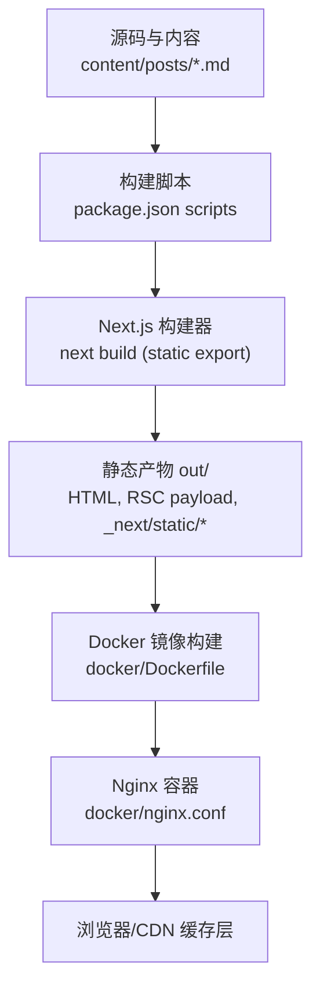
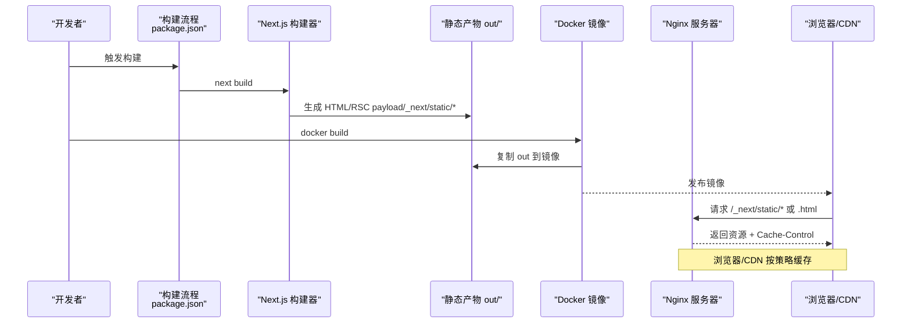
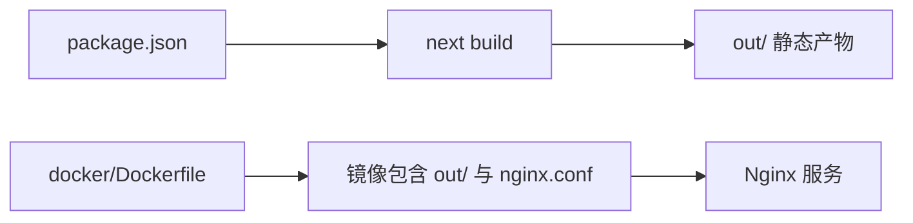
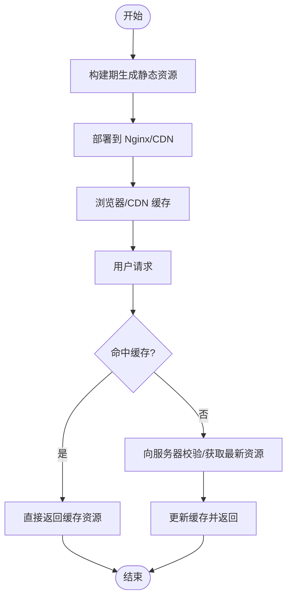

# 缓存策略

<cite>
**本文引用的文件**   
- [next.config.ts](file://next.config.ts)
- [package.json](file://package.json)
- [docker/nginx.conf](file://docker/nginx.conf)
- [docker/Dockerfile](file://docker/Dockerfile)
- [app/[locale]/blog/[slug]/page.tsx](file://app/[locale]/blog/[slug]/page.tsx)
- [lib/posts.ts](file://lib/posts.ts)
- [app/[locale]/layout.tsx](file://app/[locale]/layout.tsx)
- [app/layout.tsx](file://app/layout.tsx)
- [scripts/fix-seo-html.mjs](file://scripts/fix-seo-html.mjs)
- [lib/utils.ts](file://lib/utils.ts)
- [app/[locale]/rss.xml/route.ts](file://app/[locale]/rss.xml/route.ts)
- [app/rss.xml/route.ts](file://app/rss.xml/route.ts)
- [app/robots.ts](file://app/robots.ts)
- [app/sitemap.ts](file://app/sitemap.ts)
</cite>

## 目录
1. [简介](#简介)
2. [项目结构](#项目结构)
3. [核心组件](#核心组件)
4. [架构总览](#架构总览)
5. [详细组件分析](#详细组件分析)
6. [依赖分析](#依赖分析)
7. [性能考量](#性能考量)
8. [故障排查指南](#故障排查指南)
9. [结论](#结论)
10. [附录](#附录)

## 简介
本文件围绕该 Next.js 静态导出博客项目的缓存策略，系统性阐述以下方面：
- Node.js 文件系统读取与构建期缓存机制
- 浏览器与 CDN 的缓存配置（Nginx）
- Next.js 增量静态再生成（ISR）在本项目的适用性与现状
- 多级缓存架构：构建时缓存、运行时缓存、CDN 缓存
- 缓存预热、清理与一致性保证方案
- 监控与调试方法
- 实际配置示例与性能测试建议

本项目采用 Next.js 静态导出模式，配合 Nginx 提供静态资源服务。通过构建期生成 HTML、RSC payload 与带哈希的静态资源，结合 Nginx 的强缓存策略，实现高命中率的浏览器与 CDN 缓存。

## 项目结构
下图展示与缓存相关的关键路径与职责划分：

图表来源
- [package.json:5-12](file://package.json#L5-L12)
- [docker/Dockerfile:1-32](file://docker/Dockerfile#L1-L32)
- [docker/nginx.conf:42-111](file://docker/nginx.conf#L42-L111)

章节来源
- [package.json:5-12](file://package.json#L5-L12)
- [docker/Dockerfile:1-32](file://docker/Dockerfile#L1-L32)
- [docker/nginx.conf:42-111](file://docker/nginx.conf#L42-L111)

## 核心组件
- 构建与导出
  - 使用 next build 输出静态站点；构建后执行 SEO 修复与路径扁平化脚本。
- 静态资源与路由
  - 所有页面均为静态生成，RSS、Sitemap、Robots 等元数据资源也强制静态。
- 资源路径前缀
  - 根据部署目标动态注入 basePath/assetPrefix，并通过 getAssetPath 统一处理资源路径。
- 运行与部署
  - Docker 多阶段构建，将 out 目录作为 Nginx 静态根目录。
- 缓存策略
  - Nginx 对带哈希的静态资源设置长期不可变缓存；HTML 与 RSC payload 设置较短缓存并强制校验。

章节来源
- [package.json:5-12](file://package.json#L5-L12)
- [next.config.ts:21-36](file://next.config.ts#L21-L36)
- [lib/utils.ts:16-25](file://lib/utils.ts#L16-L25)
- [docker/Dockerfile:13-23](file://docker/Dockerfile#L13-L23)
- [docker/nginx.conf:56-85](file://docker/nginx.conf#L56-L85)

## 架构总览
下图展示了从构建到请求响应的完整缓存链路：

图表来源
- [package.json:5-12](file://package.json#L5-L12)
- [docker/Dockerfile:13-23](file://docker/Dockerfile#L13-L23)
- [docker/nginx.conf:56-85](file://docker/nginx.conf#L56-L85)

## 详细组件分析

### 构建期缓存与静态导出
- 构建命令
  - 构建后执行 SEO 修复与路径扁平化脚本，确保最终产物符合部署需求。
- 静态导出
  - Next.js 以 static export 模式生成纯静态站点，便于在 Nginx 上直接托管。
- 构建缓存优化
  - Docker 构建中先安装依赖再拷贝源码，利用镜像层缓存加速重复构建。

章节来源
- [package.json:5-12](file://package.json#L5-L12)
- [docker/Dockerfile:6-14](file://docker/Dockerfile#L6-L14)

### 资源路径与部署前缀
- basePath/assetPrefix
  - 根据环境变量决定是否为项目站点启用子路径前缀，影响资源引用与站点 URL。
- 资源路径工具
  - getAssetPath 自动为相对资源拼接 basePath，同时透传外部绝对链接，避免被错误改写。

章节来源
- [next.config.ts:21-36](file://next.config.ts#L21-L36)
- [lib/utils.ts:16-25](file://lib/utils.ts#L16-L25)

### 运行时数据读取与缓存特性
- 文章列表与详情
  - 通过 fs 同步读取 content/posts 下的 Markdown 文件，解析 frontmatter 与正文，计算阅读时长等。
- 构建期渲染
  - 页面使用 generateStaticParams 预生成所有语言与 slug 组合，属于构建期渲染，无运行时 ISR。
- 数据源稳定性
  - 内容位于 content 目录，构建时一次性读取，适合静态站点的高缓存命中率。

章节来源
- [lib/posts.ts:1-121](file://lib/posts.ts#L1-L121)
- [app/[locale]/blog/[slug]/page.tsx:24-35](file://app/[locale]/blog/[slug]/page.tsx#L24-L35)
- [app/[locale]/layout.tsx:16-18](file://app/[locale]/layout.tsx#L16-L18)

### 元数据与静态资源路由
- RSS/Sitemap/Robots
  - 均声明 force-static，确保构建期生成，减少运行时开销。
- 国际化支持
  - 基于路由参数 locale 生成多语言版本，静态导出后由 Nginx 分发。

章节来源
- [app/[locale]/rss.xml/route.ts:4-9](file://app/[locale]/rss.xml/route.ts#L4-L9)
- [app/rss.xml/route.ts:3-11](file://app/rss.xml/route.ts#L3-L11)
- [app/robots.ts:4-15](file://app/robots.ts#L4-L15)
- [app/sitemap.ts:11-75](file://app/sitemap.ts#L11-L75)

### Nginx 缓存规则与浏览器/CDN 行为
- 静态资源（/_next/static/*）
  - 设置一年过期与 immutable，浏览器与 CDN 可长期缓存，无需再次校验。
- HTML 页面
  - 短缓存（1 小时）+ must-revalidate，确保内容更新时可快速失效。
- 字体与图片
  - 较长缓存（30 天），提升首屏加载性能。
- RSC payload（__next.*.txt）
  - 短缓存（1 小时）+ must-revalidate，保障客户端导航时的内容新鲜度。
- 路由与 404
  - 保留尾斜杠约定，try_files 回退至 index.html，404 页面短缓存。

章节来源
- [docker/nginx.conf:56-111](file://docker/nginx.conf#L56-L111)

### 构建后处理与 SEO 修正
- HTML lang 属性修复
  - 扫描 out 目录下所有 HTML，依据路径推断语言并修正 html.lang 属性，利于 SEO 与可访问性。

章节来源
- [scripts/fix-seo-html.mjs:48-71](file://scripts/fix-seo-html.mjs#L48-L71)

## 依赖分析
- 构建与部署依赖
  - package.json 定义构建脚本与依赖；Dockerfile 使用 node:20-alpine 构建，nginx:alpine 运行。
- 运行时依赖
  - 静态站点无需 Node 运行时，Nginx 仅负责静态资源分发与缓存控制。

图表来源
- [package.json:5-12](file://package.json#L5-L12)
- [docker/Dockerfile:1-32](file://docker/Dockerfile#L1-L32)

章节来源
- [package.json:5-12](file://package.json#L5-L12)
- [docker/Dockerfile:1-32](file://docker/Dockerfile#L1-L32)

## 性能考量
- 构建期缓存
  - 优先缓存依赖层，减少 npm ci 耗时；静态导出产物可直接复用。
- 浏览器与 CDN 缓存
  - 带哈希的静态资源长期缓存，HTML 短缓存并强制校验，兼顾速度与新鲜度。
- 资源体积与压缩
  - Nginx 开启 gzip，覆盖常见文本与媒体类型，降低传输体积。
- 网络与连接
  - 启用 sendfile、tcp_nopush、tcp_nodelay 与 keepalive，提升吞吐与延迟表现。
- 前端资源优化
  - 图片与字体长缓存，减少重复下载；RSC payload 短缓存保障交互内容时效。

[本节为通用指导，不直接分析具体文件]

## 故障排查指南
- 构建失败
  - 检查构建脚本是否成功执行；确认 out 目录是否存在；查看 Docker 构建日志定位依赖或构建错误。
- 资源未命中缓存
  - 核对 Nginx 的 location 匹配与 Cache-Control 头；确认浏览器是否发送了条件请求（If-None-Match）。
- HTML 未更新
  - 确认 HTML 的缓存策略为 must-revalidate；检查 CDN 是否缓存了旧版本；必要时进行版本化或清理缓存。
- 语言属性不正确
  - 检查 fix-seo-html.mjs 是否已执行；确认 out 目录结构与语言映射逻辑。
- 路径前缀问题
  - 验证 basePath/assetPrefix 与环境变量 NEXT_PUBLIC_BASE_PATH 是否正确注入；检查 getAssetPath 的输出是否符合预期。

章节来源
- [docker/nginx.conf:56-111](file://docker/nginx.conf#L56-L111)
- [scripts/fix-seo-html.mjs:48-71](file://scripts/fix-seo-html.mjs#L48-L71)
- [next.config.ts:21-36](file://next.config.ts#L21-L36)
- [lib/utils.ts:16-25](file://lib/utils.ts#L16-L25)

## 结论
本项目采用“构建期静态导出 + Nginx 强缓存”的多级缓存架构，具备以下优势：
- 构建期一次性生成所有页面与资源，最大化缓存命中率
- 静态资源长期不可变缓存，显著降低带宽与延迟
- HTML 短缓存并强制校验，平衡内容与速度
- 通过 Docker 多阶段构建与脚本后处理，提升构建效率与产出质量

对于需要频繁更新的动态内容，可在未来引入 ISR 或 API 层缓存策略，但当前静态导出模式已满足博客类站点的高性能需求。

[本节为总结，不直接分析具体文件]

## 附录

### 多级缓存架构说明
- 构建时缓存
  - 依赖层缓存、静态产物复用、脚本后处理结果稳定。
- 运行时缓存
  - 静态站点无运行时状态；RSC payload 短缓存保障交互内容时效。
- CDN 缓存
  - 借助浏览器与 CDN 的长期缓存策略，提升全球访问性能。

[此图为概念流程图，不绑定具体源码文件]

### ISR 与缓存失效策略（现状与建议）
- 现状
  - 本项目未使用 ISR；页面与资源均在构建期生成，属于纯静态站点。
- 建议
  - 若需按需更新页面，可在页面级别添加 revalidate 配置以实现 ISR；或在构建流水线中触发特定页面的重建。
  - 针对高频更新的内容，可采用短缓存 + must-revalidate 的策略，并在内容变更后主动清理 CDN 缓存。

章节来源
- [app/[locale]/blog/[slug]/page.tsx:24-35](file://app/[locale]/blog/[slug]/page.tsx#L24-L35)
- [docker/nginx.conf:64-67](file://docker/nginx.conf#L64-L67)

### 缓存预热、清理与一致性保证
- 缓存预热
  - 构建完成后，通过健康检查或探测请求访问关键页面与资源，促使 CDN 预热。
- 缓存清理
  - 在 CI/CD 中增加版本号或时间戳参数，或使用 CDN 提供的缓存清理 API；HTML 使用 must-revalidate 可快速失效。
- 一致性保证
  - 使用带哈希的资源文件名，确保变更即新 URL；Nginx 的 try_files 与重定向规则保持一致的尾斜杠约定。

[本节为通用实践，不直接分析具体文件]

### 实际配置示例与性能测试建议
- 构建与部署
  - 使用 package.json 中的构建脚本；Dockerfile 多阶段构建；Nginx 缓存规则已在配置中定义。
- 性能测试
  - 使用 Lighthouse 或 WebPageTest 评估首屏加载、缓存命中率与资源体积。
  - 对比不同缓存策略下的 TTFB、FCP、LCP 指标，验证 must-revalidate 与 immutable 的效果。

章节来源
- [package.json:5-12](file://package.json#L5-L12)
- [docker/Dockerfile:13-23](file://docker/Dockerfile#L13-L23)
- [docker/nginx.conf:56-85](file://docker/nginx.conf#L56-L85)