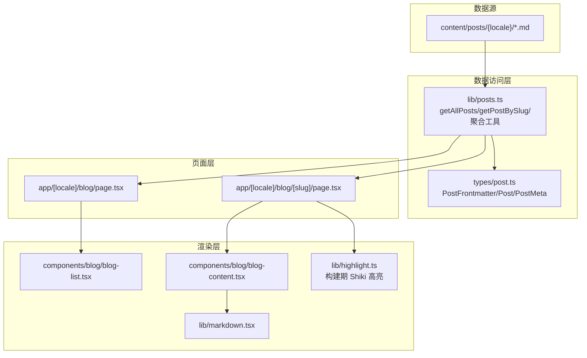
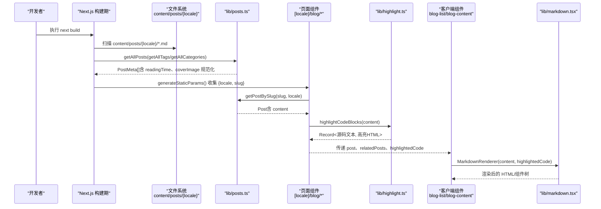
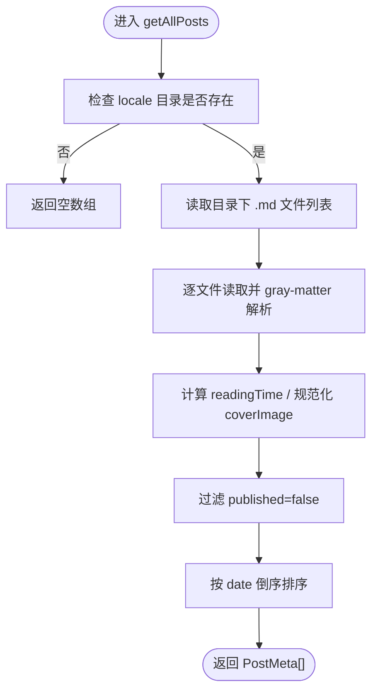
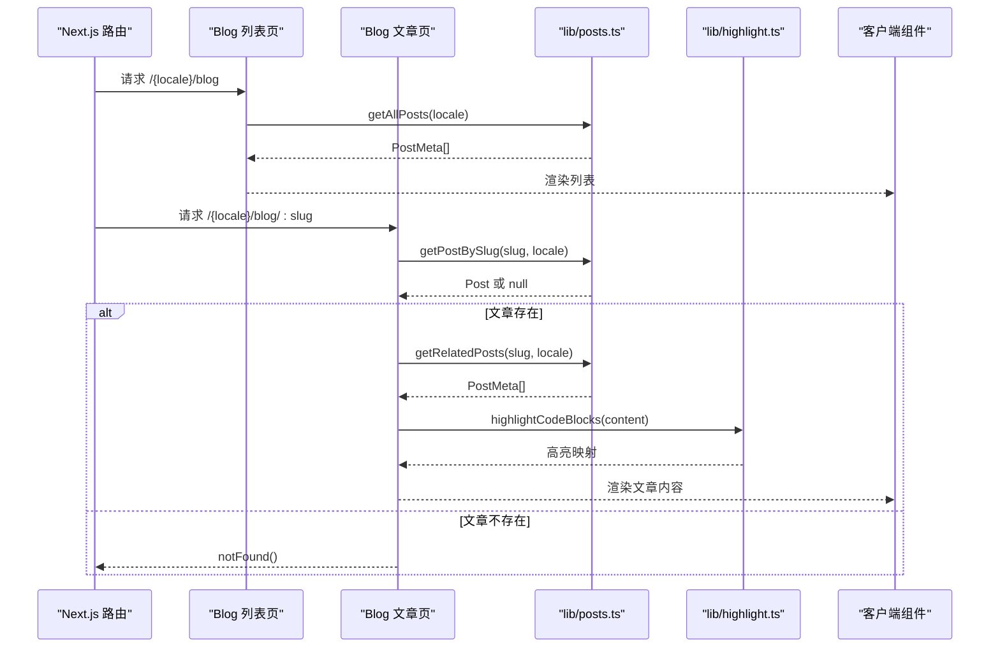
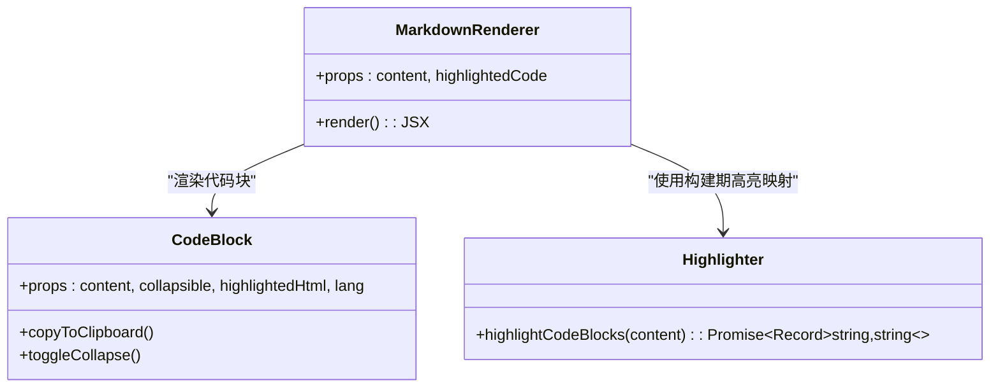
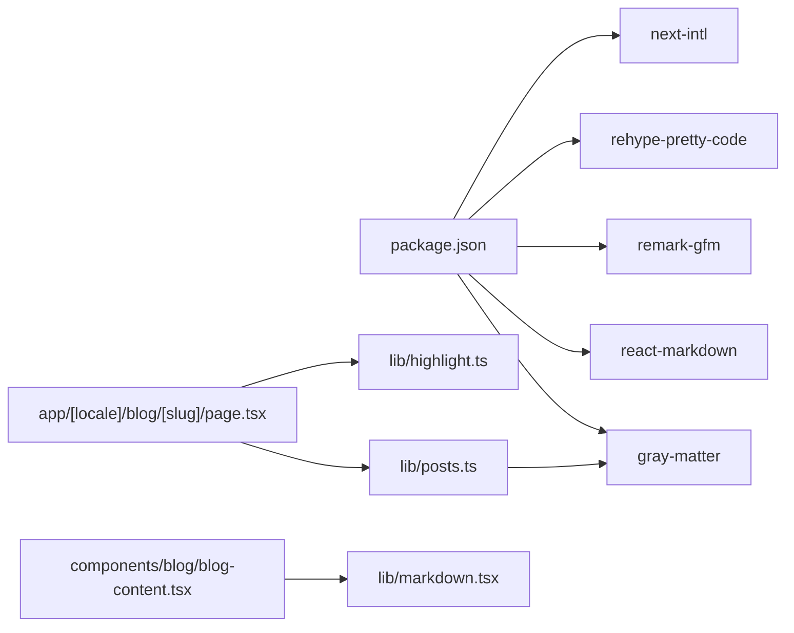

# 静态数据获取

<cite>
**本文引用的文件**
- [lib/posts.ts](file://lib/posts.ts)
- [types/post.ts](file://types/post.ts)
- [app/[locale]/blog/page.tsx](file://app/[locale]/blog/page.tsx)
- [app/[locale]/blog/[slug]/page.tsx](file://app/[locale]/blog/[slug]/page.tsx)
- [lib/markdown.tsx](file://lib/markdown.tsx)
- [lib/highlight.ts](file://lib/highlight.ts)
- [components/blog/blog-list.tsx](file://components/blog/blog-list.tsx)
- [components/blog/blog-content.tsx](file://components/blog/blog-content.tsx)
- [next.config.ts](file://next.config.ts)
- [package.json](file://package.json)
</cite>

## 目录
1. [简介](#简介)
2. [项目结构](#项目结构)
3. [核心组件](#核心组件)
4. [架构总览](#架构总览)
5. [详细组件分析](#详细组件分析)
6. [依赖关系分析](#依赖关系分析)
7. [性能与缓存](#性能与缓存)
8. [故障排查指南](#故障排查指南)
9. [结论](#结论)
10. [附录：在页面中调用示例](#附录在页面中调用示例)

## 简介
本文件面向“静态数据获取”主题，聚焦 Next.js 构建期对 Markdown 内容的预取与渲染。重点解释以下能力：
- 通过 getAllPosts、getPostBySlug 等函数读取 content/posts 下的多语言 Markdown 文件
- 使用 gray-matter 解析 frontmatter 与正文内容
- 计算阅读时长、生成标签/分类集合、按相关性推荐相关文章
- 在页面组件中如何调用这些函数进行服务端数据预取（SSG）
- 错误处理、文件不存在场景的处理策略
- 构建时代码高亮与性能优化建议

## 项目结构
与静态数据获取相关的目录与文件如下：
- 数据源：content/posts/{zh,en}/*.md（Markdown 文章）
- 数据访问层：lib/posts.ts（文件系统读取、gray-matter 解析、聚合工具）
- 类型定义：types/post.ts（PostFrontmatter、Post、PostMeta）
- 页面入口：app/[locale]/blog/page.tsx（列表页）、app/[locale]/blog/[slug]/page.tsx（文章页）
- 渲染层：components/blog/blog-list.tsx、components/blog/blog-content.tsx
- 客户端渲染：lib/markdown.tsx（ReactMarkdown + remark-gfm）
- 构建期高亮：lib/highlight.ts（rehype-pretty-code/Shiki）
- 部署配置：next.config.ts（输出为静态站点 export、basePath 等）
- 依赖声明：package.json（gray-matter、react-markdown、rehype-pretty-code 等）

图表来源
- [lib/posts.ts:1-121](file://lib/posts.ts#L1-L121)
- [types/post.ts:1-20](file://types/post.ts#L1-L20)
- [app/[locale]/blog/page.tsx:1-34](file://app/[locale]/blog/page.tsx#L1-L34)
- [app/[locale]/blog/[slug]/page.tsx:1-180](file://app/[locale]/blog/[slug]/page.tsx#L1-L180)
- [components/blog/blog-list.tsx:1-416](file://components/blog/blog-list.tsx#L1-L416)
- [components/blog/blog-content.tsx:1-254](file://components/blog/blog-content.tsx#L1-L254)
- [lib/markdown.tsx:1-318](file://lib/markdown.tsx#L1-L318)
- [lib/highlight.ts:1-73](file://lib/highlight.ts#L1-L73)

章节来源
- [lib/posts.ts:1-121](file://lib/posts.ts#L1-L121)
- [types/post.ts:1-20](file://types/post.ts#L1-L20)
- [app/[locale]/blog/page.tsx:1-34](file://app/[locale]/blog/page.tsx#L1-L34)
- [app/[locale]/blog/[slug]/page.tsx:1-180](file://app/[locale]/blog/[slug]/page.tsx#L1-L180)
- [components/blog/blog-list.tsx:1-416](file://components/blog/blog-list.tsx#L1-L416)
- [components/blog/blog-content.tsx:1-254](file://components/blog/blog-content.tsx#L1-L254)
- [lib/markdown.tsx:1-318](file://lib/markdown.tsx#L1-L318)
- [lib/highlight.ts:1-73](file://lib/highlight.ts#L1-L73)

## 核心组件
- lib/posts.ts
  - 提供 getAllPosts(locale)、getPostBySlug(slug, locale)、getAllTags、getAllCategories、getPostsByTag、getPostsByCategory、getRelatedPosts 等函数
  - 基于 fs 同步 API 读取 content/posts/{locale}/*.md，使用 gray-matter 解析 frontmatter 与正文
  - 自动计算 readingTime，过滤 published=false，按 date 降序排序
  - 支持 coverImage 路径规范化（结合 getAssetPath）
- types/post.ts
  - PostFrontmatter：frontmatter 字段定义（title、description、date、tags、category、author、slug、published 等）
  - Post：包含 content 与 readingTime
  - PostMeta：用于列表展示，不含 content
- app/[locale]/blog/page.tsx
  - 服务端组件，调用 getAllPosts、getAllTags、getAllCategories 获取数据并传递给 BlogList 组件
- app/[locale]/blog/[slug]/page.tsx
  - 服务端组件，调用 getPostBySlug 获取单篇文章；generateStaticParams 遍历所有语言与文章以生成静态路由
  - 调用 highlightCodeBlocks 在构建期完成代码高亮，将结果传入渲染组件
- components/blog/blog-list.tsx / blog-content.tsx
  - 客户端组件，接收服务端预取的数据进行渲染与交互（搜索、筛选、目录、评论等）
- lib/markdown.tsx
  - 客户端 ReactMarkdown 渲染器，支持 GFM、自定义标题锚点、图片懒加载、表格、链接行为、代码块折叠与复制
- lib/highlight.ts
  - 构建期统一处理 fenced code block，使用 rehype-pretty-code（Shiki）生成高亮 HTML，并以“源码文本 -> 高亮HTML”的映射返回给客户端

章节来源
- [lib/posts.ts:1-121](file://lib/posts.ts#L1-L121)
- [types/post.ts:1-20](file://types/post.ts#L1-L20)
- [app/[locale]/blog/page.tsx:1-34](file://app/[locale]/blog/page.tsx#L1-L34)
- [app/[locale]/blog/[slug]/page.tsx:1-180](file://app/[locale]/blog/[slug]/page.tsx#L1-L180)
- [components/blog/blog-list.tsx:1-416](file://components/blog/blog-list.tsx#L1-L416)
- [components/blog/blog-content.tsx:1-254](file://components/blog/blog-content.tsx#L1-L254)
- [lib/markdown.tsx:1-318](file://lib/markdown.tsx#L1-L318)
- [lib/highlight.ts:1-73](file://lib/highlight.ts#L1-L73)

## 架构总览
下图展示了从 Markdown 到页面的完整数据流与渲染流程，包括构建期与运行期的职责划分。

图表来源
- [lib/posts.ts:1-121](file://lib/posts.ts#L1-L121)
- [app/[locale]/blog/[slug]/page.tsx:24-35](file://app/[locale]/blog/[slug]/page.tsx#L24-L35)
- [lib/highlight.ts:1-73](file://lib/highlight.ts#L1-L73)
- [components/blog/blog-content.tsx:1-254](file://components/blog/blog-content.tsx#L1-L254)
- [lib/markdown.tsx:1-318](file://lib/markdown.tsx#L1-L318)

## 详细组件分析

### 数据访问层：lib/posts.ts
- 关键函数与职责
  - getAllPosts(locale): 列出指定语言的 .md 文件，解析 frontmatter，计算 readingTime，规范化 coverImage，过滤未发布文章，按日期倒序返回 PostMeta[]
  - getPostBySlug(slug, locale): 根据 slug 读取对应文章，解析 frontmatter 与 content，返回 Post；若文件不存在则返回 null
  - getAllTags/getAllCategories: 从已获取的文章中提取去重后的标签/分类列表
  - getPostsByTag/getPostsByCategory: 基于标签或分类过滤文章
  - getRelatedPosts(currentSlug, locale, limit=3): 基于标签重叠度与同分类权重计算相关度分数，返回 Top-N 相关文章
- 数据处理细节
  - 使用 gray-matter 解析 frontmatter 与正文
  - 使用 calculateReadingTime 估算阅读时长（词数/200 词每分钟）
  - 使用 getAssetPath 规范化资源路径（兼容 basePath 部署）
- 复杂度分析
  - getAllPosts: O(N log N)（N 为文章数量），主要开销在排序
  - getRelatedPosts: O(M) 遍历全部文章计算相关度，M 为文章数量
- 错误处理
  - getPostBySlug 捕获异常并返回 null，上层页面据此触发 notFound()

图表来源
- [lib/posts.ts:15-47](file://lib/posts.ts#L15-L47)

章节来源
- [lib/posts.ts:1-121](file://lib/posts.ts#L1-L121)
- [types/post.ts:1-20](file://types/post.ts#L1-L20)

### 页面层：列表页与文章页
- 列表页 app/[locale]/blog/page.tsx
  - 在服务端组件中直接调用 getAllPosts、getAllTags、getAllCategories，将数据作为 props 传给 BlogList 组件
  - 通过 generateMetadata 设置 SEO 元信息
- 文章页 app/[locale]/blog/[slug]/page.tsx
  - generateStaticParams：遍历所有语言与文章，生成静态路由参数
  - generateMetadata：根据文章 frontmatter 生成结构化元信息（OpenGraph/Twitter/alternates）
  - 默认导出组件：调用 getPostBySlug 获取文章，若为空则 notFound()；调用 getRelatedPosts 获取相关文章；调用 highlightCodeBlocks 在构建期完成代码高亮；最终将数据传递给 BlogContent 组件

图表来源
- [app/[locale]/blog/page.tsx:1-34](file://app/[locale]/blog/page.tsx#L1-L34)
- [app/[locale]/blog/[slug]/page.tsx:24-180](file://app/[locale]/blog/[slug]/page.tsx#L24-L180)
- [lib/posts.ts:49-121](file://lib/posts.ts#L49-L121)
- [lib/highlight.ts:1-73](file://lib/highlight.ts#L1-L73)

章节来源
- [app/[locale]/blog/page.tsx:1-34](file://app/[locale]/blog/page.tsx#L1-L34)
- [app/[locale]/blog/[slug]/page.tsx:1-180](file://app/[locale]/blog/[slug]/page.tsx#L1-L180)

### 渲染层：Markdown 与代码高亮
- lib/markdown.tsx
  - 客户端 ReactMarkdown 渲染器，启用 remark-gfm
  - 自定义标题组件，自动生成锚点 ID，便于目录跳转
  - 图片 lazy loading、表格样式、外链新窗口打开、内联/块级代码区分
  - 代码块支持折叠与复制，优先使用构建期生成的高亮 HTML
- lib/highlight.ts
  - 构建期仅运行：先遍历 AST 收集原始代码块文本顺序，再运行 rehype-pretty-code 生成高亮 HTML，最后按顺序将“源码文本 -> 高亮HTML”映射返回
  - 客户端渲染器通过匹配源码文本查找对应的高亮 HTML，避免在浏览器中重复执行异步高亮流程

图表来源
- [lib/markdown.tsx:1-318](file://lib/markdown.tsx#L1-L318)
- [lib/highlight.ts:1-73](file://lib/highlight.ts#L1-L73)

章节来源
- [lib/markdown.tsx:1-318](file://lib/markdown.tsx#L1-L318)
- [lib/highlight.ts:1-73](file://lib/highlight.ts#L1-L73)

### 组件层：列表与文章详情
- components/blog/blog-list.tsx
  - 接收服务端预取的 posts/tags/categories，实现前端搜索、标签筛选、分类侧边栏、统计计数等
- components/blog/blog-content.tsx
  - 接收服务端预取的 post、relatedPosts、highlightedCode，渲染封面、元信息、目录、评论、相关文章等

章节来源
- [components/blog/blog-list.tsx:1-416](file://components/blog/blog-list.tsx#L1-L416)
- [components/blog/blog-content.tsx:1-254](file://components/blog/blog-content.tsx#L1-L254)

## 依赖关系分析
- 外部依赖
  - gray-matter：解析 Markdown frontmatter
  - react-markdown + remark-gfm：客户端 Markdown 渲染
  - rehype-pretty-code（Shiki）：构建期代码高亮
  - next-intl：国际化（页面与服务端元信息）
- 内部依赖
  - 页面组件依赖 lib/posts.ts 提供的数据访问函数
  - 文章页依赖 lib/highlight.ts 的构建期高亮
  - 客户端渲染依赖 lib/markdown.tsx 的 MarkdownRenderer

图表来源
- [package.json:1-47](file://package.json#L1-L47)
- [lib/posts.ts:1-121](file://lib/posts.ts#L1-L121)
- [app/[locale]/blog/[slug]/page.tsx:1-180](file://app/[locale]/blog/[slug]/page.tsx#L1-L180)
- [lib/highlight.ts:1-73](file://lib/highlight.ts#L1-L73)
- [components/blog/blog-content.tsx:1-254](file://components/blog/blog-content.tsx#L1-L254)
- [lib/markdown.tsx:1-318](file://lib/markdown.tsx#L1-L318)

章节来源
- [package.json:1-47](file://package.json#L1-L47)
- [lib/posts.ts:1-121](file://lib/posts.ts#L1-L121)
- [app/[locale]/blog/[slug]/page.tsx:1-180](file://app/[locale]/blog/[slug]/page.tsx#L1-L180)
- [lib/highlight.ts:1-73](file://lib/highlight.ts#L1-L73)
- [components/blog/blog-content.tsx:1-254](file://components/blog/blog-content.tsx#L1-L254)
- [lib/markdown.tsx:1-318](file://lib/markdown.tsx#L1-L318)

## 性能与缓存
- 构建期一次性读取与解析
  - getAllPosts 与 getPostBySlug 均使用 fs 同步 API 在构建期读取文件，属于 SSG 阶段工作，不会增加运行时开销
  - highlightCodeBlocks 在构建期运行 Shiki，避免客户端重复高亮带来的 CPU 与内存压力
- 减少不必要的 I/O
  - getAllPosts 仅在目录存在时读取，否则直接返回空数组，避免无效 I/O
  - getPostBySlug 使用 try/catch 捕获文件不存在情况，快速失败
- 排序与过滤成本
  - 列表页排序为 O(N log N)，当文章量较大时可考虑在写入时维护索引或分片
  - getRelatedPosts 每次都会遍历全部文章计算相关度，可考虑引入缓存（见下节）
- 资源路径优化
  - getAssetPath 支持 basePath 部署，避免资源路径拼接错误导致的 404 与二次请求
- 可能的缓存策略（建议）
  - 在 lib/posts.ts 中引入模块级 Map 缓存，键为 (locale, slug) 或 (locale, "all")，值分别为 Post 或 PostMeta[]，并在首次读取后复用
  - 对于 getRelatedPosts，可在缓存层维护 tag/category 索引，降低 O(M) 遍历成本
  - 注意：由于当前为纯静态导出（output: export），缓存应限于构建期内存，不影响产物体积

章节来源
- [lib/posts.ts:15-71](file://lib/posts.ts#L15-L71)
- [lib/posts.ts:95-121](file://lib/posts.ts#L95-L121)
- [lib/utils.ts:16-25](file://lib/utils.ts#L16-L25)
- [next.config.ts:21-36](file://next.config.ts#L21-L36)

## 故障排查指南
- 常见问题与定位
  - 文章 404：检查 getPostBySlug 是否返回 null，确认 slug 与文件名一致且位于正确的 locale 目录
  - 封面图 404：检查 frontmatter 中的 coverImage 是否为相对路径，确认 getAssetPath 是否正确拼接 basePath
  - 代码高亮缺失：确认构建期 highlightCodeBlocks 是否成功执行，客户端渲染器是否能通过源码文本匹配到高亮 HTML
  - 列表为空：检查 getAllPosts 所在目录是否存在，以及 markdown 文件的 frontmatter 是否包含必要字段
- 错误处理现状
  - getPostBySlug 捕获异常并返回 null，页面层据此调用 notFound()
  - getAllPosts 在目录不存在时返回空数组，避免抛出异常
- 调试建议
  - 在开发环境打印目录结构与文件列表，确认 content/posts/{locale} 下文件命名与扩展名正确
  - 验证 frontmatter 字段是否符合 types/post.ts 的类型定义
  - 检查 next.config.ts 的 basePath 与 NEXT_PUBLIC_BASE_PATH 环境变量是否与部署目标一致

章节来源
- [app/[locale]/blog/[slug]/page.tsx:110-117](file://app/[locale]/blog/[slug]/page.tsx#L110-L117)
- [lib/posts.ts:49-71](file://lib/posts.ts#L49-L71)
- [lib/posts.ts:15-20](file://lib/posts.ts#L15-L20)
- [lib/utils.ts:16-25](file://lib/utils.ts#L16-L25)
- [next.config.ts:21-36](file://next.config.ts#L21-L36)

## 结论
本项目采用“构建期读取 + 静态导出”的模式，实现了高效稳定的静态数据获取与渲染。通过 gray-matter 解析 frontmatter、构建期代码高亮与客户端轻量渲染的组合，既保证了首屏性能，又提供了良好的用户体验。建议在后续迭代中引入模块级缓存与索引，进一步优化大数据量场景下的性能表现。

## 附录：在页面中调用示例
以下为如何在页面组件中调用数据获取函数的实践要点（不展示具体代码内容，仅提供路径参考）：
- 列表页
  - 在服务端组件中调用 getAllPosts(locale)、getAllTags(locale)、getAllCategories(locale)，并将结果作为 props 传递给 BlogList 组件
  - 参考路径：[app/[locale]/blog/page.tsx:25-33](file://app/[locale]/blog/page.tsx#L25-L33)
- 文章页
  - 在 generateStaticParams 中遍历所有语言与文章，生成静态路由参数
  - 在默认导出组件中调用 getPostBySlug(slug, locale) 获取文章，若为空则调用 notFound()
  - 调用 getRelatedPosts(slug, locale) 获取相关文章
  - 调用 highlightCodeBlocks(post.content) 在构建期完成代码高亮，并将结果传递给 BlogContent 组件
  - 参考路径：
    - [app/[locale]/blog/[slug]/page.tsx:24-35](file://app/[locale]/blog/[slug]/page.tsx#L24-L35)
    - [app/[locale]/blog/[slug]/page.tsx:110-121](file://app/[locale]/blog/[slug]/page.tsx#L110-L121)
    - [lib/highlight.ts:27-72](file://lib/highlight.ts#L27-L72)
- 客户端渲染
  - 在 BlogContent 中使用 MarkdownRenderer 渲染文章内容，并传入 highlightedCode 映射
  - 参考路径：[components/blog/blog-content.tsx:170-179](file://components/blog/blog-content.tsx#L170-L179)

章节来源
- [app/[locale]/blog/page.tsx:25-33](file://app/[locale]/blog/page.tsx#L25-L33)
- [app/[locale]/blog/[slug]/page.tsx:24-35](file://app/[locale]/blog/[slug]/page.tsx#L24-L35)
- [app/[locale]/blog/[slug]/page.tsx:110-121](file://app/[locale]/blog/[slug]/page.tsx#L110-L121)
- [lib/highlight.ts:27-72](file://lib/highlight.ts#L27-L72)
- [components/blog/blog-content.tsx:170-179](file://components/blog/blog-content.tsx#L170-L179)