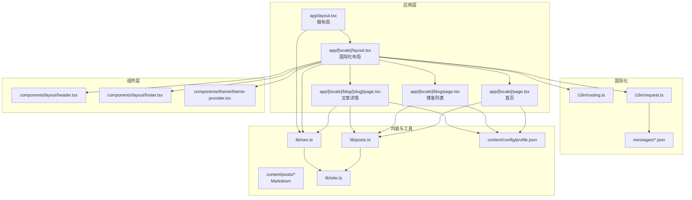
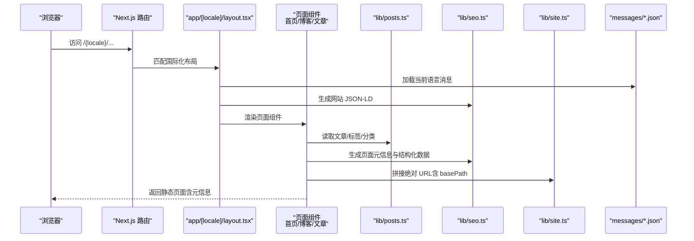
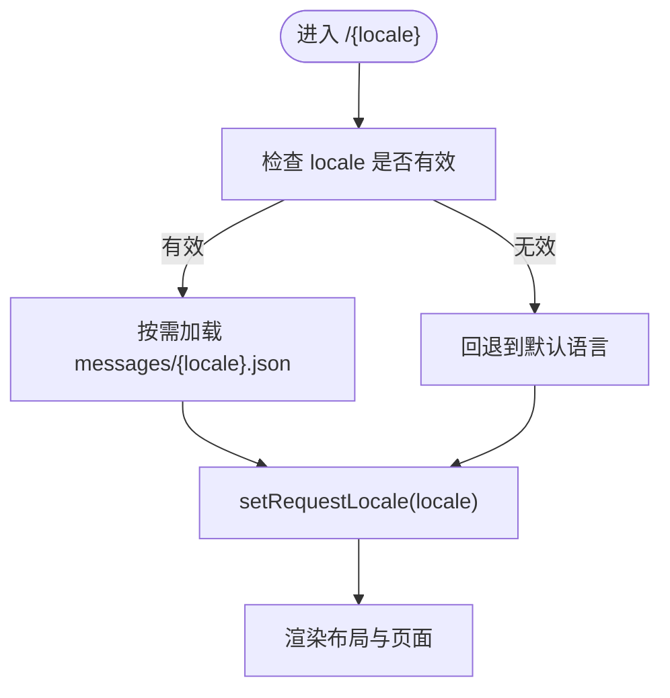
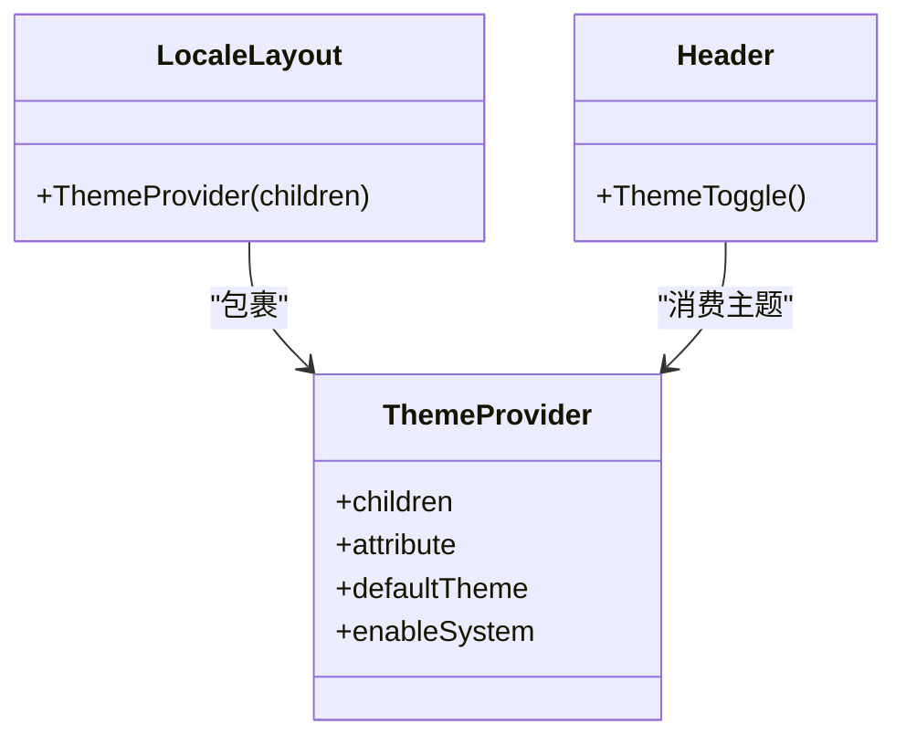
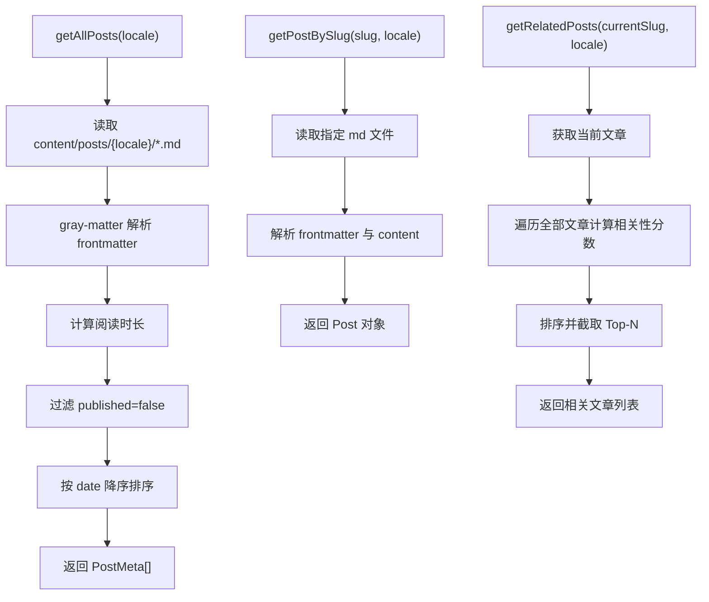
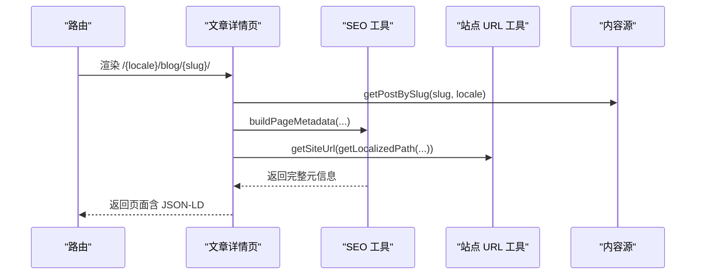
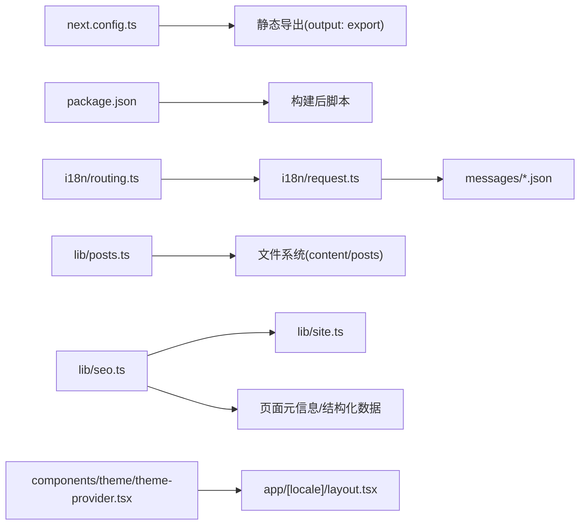

# 整体架构概览

<cite>
**本文引用的文件**   
- [README.md](file://README.md)
- [package.json](file://package.json)
- [next.config.ts](file://next.config.ts)
- [app/layout.tsx](file://app/layout.tsx)
- [app/[locale]/layout.tsx](file://app/[locale]/layout.tsx)
- [i18n/routing.ts](file://i18n/routing.ts)
- [i18n/request.ts](file://i18n/request.ts)
- [lib/site.ts](file://lib/site.ts)
- [lib/seo.ts](file://lib/seo.ts)
- [content/config/profile.json](file://content/config/profile.json)
- [messages/zh.json](file://messages/zh.json)
- [app/[locale]/page.tsx](file://app/[locale]/page.tsx)
- [app/[locale]/blog/page.tsx](file://app/[locale]/blog/page.tsx)
- [app/[locale]/blog/[slug]/page.tsx](file://app/[locale]/blog/[slug]/page.tsx)
- [lib/posts.ts](file://lib/posts.ts)
- [components/layout/header.tsx](file://components/layout/header.tsx)
- [components/layout/footer.tsx](file://components/layout/footer.tsx)
- [components/theme/theme-provider.tsx](file://components/theme/theme-provider.tsx)
</cite>

## 目录
1. [简介](#简介)
2. [项目结构](#项目结构)
3. [核心组件](#核心组件)
4. [架构总览](#架构总览)
5. [详细组件分析](#详细组件分析)
6. [依赖关系分析](#依赖关系分析)
7. [性能与构建策略](#性能与构建策略)
8. [故障排查指南](#故障排查指南)
9. [结论](#结论)
10. [附录](#附录)

## 简介
本博客系统基于 Next.js 16 App Router 构建，采用静态导出（output: export）实现纯静态站点部署。系统支持中英文国际化、亮暗主题切换、Markdown 内容管理、RSS 订阅以及 SEO 结构化数据注入。通过“服务器端渲染（SSR）+ 静态站点生成（SSG）”的组合策略，在构建期完成页面元信息、路由参数与内容数据的准备，运行时以静态资源提供高可用访问体验。

技术栈选择：
- 框架与路由：Next.js 16 + App Router
- 类型与语言：TypeScript
- 样式与 UI：Tailwind CSS 4 + shadcn/ui
- 国际化：next-intl
- 主题：next-themes
- 内容解析：gray-matter（Markdown frontmatter）
- 图标：lucide-react

系统边界定义：
- 前端应用边界：由 app 目录下的路由与组件构成，负责页面渲染、交互与国际化呈现。
- 内容边界：content 目录下的 Markdown 与 JSON 配置，作为 CMS 的“文件系统型内容源”。
- 工具与库边界：lib 目录提供站点 URL 计算、SEO 元数据、文章读取等通用能力。
- 部署边界：通过 next.config.ts 控制输出为静态站点，并支持用户站点与项目站点的 basePath 切换。

核心设计原则：
- 数据驱动：页面数据来源于 content 目录，构建期读取并生成静态产物。
- 可组合性：布局、主题、国际化、SEO 等横切关注点通过 Provider 与工具函数解耦。
- 可维护性：按功能域组织 components 与 lib，保持低耦合与高内聚。
- 可观测性：统一的 SEO 与结构化数据注入，便于搜索引擎与社交分享优化。

章节来源
- [README.md](file://README.md)
- [package.json](file://package.json)

## 项目结构
整体采用“App Router 路由 + 组件分层 + 内容即数据”的组织方式：
- app：Next.js 路由与页面，[locale] 子目录承载国际化路由；根 layout 注入全局字体与基础 Metadata。
- components：UI 与业务组件，包含布局（header/footer）、主题（theme-provider）、博客（blog-*）、关于/经历/简历等。
- content：CMS 内容源，posts、experience、links、profile 等以 Markdown/JSON 形式管理。
- i18n：next-intl 的路由与请求级配置。
- lib：站点 URL 计算、SEO 元数据、文章读取、代码高亮、RSS 生成等工具。
- messages：多语言文案。
- public：静态资源（图片、PDF 等）。
- scripts：构建后处理脚本（SEO HTML 修复、路径扁平化、图片压缩等）。

图表来源
- [app/layout.tsx](file://app/layout.tsx)
- [app/[locale]/layout.tsx](file://app/[locale]/layout.tsx)
- [app/[locale]/page.tsx](file://app/[locale]/page.tsx)
- [app/[locale]/blog/page.tsx](file://app/[locale]/blog/page.tsx)
- [app/[locale]/blog/[slug]/page.tsx](file://app/[locale]/blog/[slug]/page.tsx)
- [i18n/routing.ts](file://i18n/routing.ts)
- [i18n/request.ts](file://i18n/request.ts)
- [lib/posts.ts](file://lib/posts.ts)
- [lib/site.ts](file://lib/site.ts)
- [lib/seo.ts](file://lib/seo.ts)
- [content/config/profile.json](file://content/config/profile.json)
- [components/layout/header.tsx](file://components/layout/header.tsx)
- [components/layout/footer.tsx](file://components/layout/footer.tsx)
- [components/theme/theme-provider.tsx](file://components/theme/theme-provider.tsx)

章节来源
- [README.md](file://README.md)

## 核心组件
- 根布局与全局元信息
  - 根布局设置字体变量、全局元信息（标题模板、作者、Open Graph、Twitter Card、Robots 等），并通过 site 工具获取站点 URL。
- 国际化布局
  - 校验 locale、启用静态渲染、加载 messages、注入网站 JSON-LD、包裹 ThemeProvider 与 TooltipProvider，挂载 Header/Footer。
- 主题提供者
  - 基于 next-themes 封装，统一主题状态与持久化策略。
- 导航与页脚
  - 头部集成语言切换、主题切换、RSS 入口与移动端抽屉菜单；页脚展示品牌、导航与社交链接。
- 内容读取与 SEO
  - posts 模块从 content/posts 下按语言读取 Markdown，解析 frontmatter，计算阅读时长、标签与分类，并提供相关度排序的相关文章。
  - seo 模块集中生成页面元信息、语言替代链接、结构化数据（Person/WebSite/BlogPosting/BreadcrumbList）。

章节来源
- [app/layout.tsx](file://app/layout.tsx)
- [app/[locale]/layout.tsx](file://app/[locale]/layout.tsx)
- [components/theme/theme-provider.tsx](file://components/theme/theme-provider.tsx)
- [components/layout/header.tsx](file://components/layout/header.tsx)
- [components/layout/footer.tsx](file://components/layout/footer.tsx)
- [lib/posts.ts](file://lib/posts.ts)
- [lib/seo.ts](file://lib/seo.ts)

## 架构总览
下图展示了从请求到渲染的关键流程，包括国际化解析、内容读取、SEO 注入与主题/布局装配。

图表来源
- [app/[locale]/layout.tsx](file://app/[locale]/layout.tsx)
- [app/[locale]/page.tsx](file://app/[locale]/page.tsx)
- [app/[locale]/blog/page.tsx](file://app/[locale]/blog/page.tsx)
- [app/[locale]/blog/[slug]/page.tsx](file://app/[locale]/blog/[slug]/page.tsx)
- [lib/posts.ts](file://lib/posts.ts)
- [lib/seo.ts](file://lib/seo.ts)
- [lib/site.ts](file://lib/site.ts)
- [messages/zh.json](file://messages/zh.json)

## 详细组件分析

### 国际化与路由
- 路由定义：locales 包含 en 与 zh，默认语言为 en。
- 请求配置：根据 requestLocale 动态导入对应 messages，未匹配时回退至默认语言。
- 布局集成：在 [locale] 布局中调用 setRequestLocale 启用静态渲染，并通过 NextIntlClientProvider 注入 messages。

图表来源
- [i18n/routing.ts](file://i18n/routing.ts)
- [i18n/request.ts](file://i18n/request.ts)
- [app/[locale]/layout.tsx](file://app/[locale]/layout.tsx)

章节来源
- [i18n/routing.ts](file://i18n/routing.ts)
- [i18n/request.ts](file://i18n/request.ts)
- [app/[locale]/layout.tsx](file://app/[locale]/layout.tsx)

### 主题系统
- 主题提供者：使用 next-themes 封装，支持跟随系统、手动切换与持久化。
- 布局集成：在国际化布局中包裹 ThemeProvider，确保所有页面共享主题上下文。
- 交互入口：Header 提供主题切换按钮。

图表来源
- [components/theme/theme-provider.tsx](file://components/theme/theme-provider.tsx)
- [components/layout/header.tsx](file://components/layout/header.tsx)
- [app/[locale]/layout.tsx](file://app/[locale]/layout.tsx)

章节来源
- [components/theme/theme-provider.tsx](file://components/theme/theme-provider.tsx)
- [components/layout/header.tsx](file://components/layout/header.tsx)
- [app/[locale]/layout.tsx](file://app/[locale]/layout.tsx)

### 内容管理系统（CMS）
- 内容源：content/posts 下按语言分目录存放 Markdown，frontmatter 描述标题、摘要、封面、日期、标签、分类、作者、slug、是否发布等。
- 读取逻辑：
  - getAllPosts：扫描指定语言目录，解析 frontmatter，计算阅读时长，过滤未发布文章，按发布日期倒序。
  - getPostBySlug：按 slug 精确读取单篇文章。
  - 标签/分类聚合：去重排序，供筛选与统计。
  - 相关文章：基于标签重叠与同分类加权评分，取 Top-N。
- 资产路径：通过 utils.getAssetPath 将相对路径转换为适配 basePath 的绝对路径。

图表来源
- [lib/posts.ts](file://lib/posts.ts)

章节来源
- [lib/posts.ts](file://lib/posts.ts)

### 页面与 SEO
- 首页：加载 profile、最近文章与经历数据，生成页面元信息。
- 博客列表：加载文章、标签、分类，生成页面元信息。
- 文章详情：
  - generateStaticParams：为每个语言的每篇文章生成静态路由参数。
  - generateMetadata：结合文章 frontmatter 与 SEO 工具生成 Open Graph、Twitter Card、canonical、语言替代链接等。
  - 结构化数据：注入 BlogPosting 与 BreadcrumbList，提升搜索可见性与富结果展示。
- 站点 URL：site 工具统一处理 origin 与 basePath，保证 RSS、OG 图片、canonical 等链接正确。

图表来源
- [app/[locale]/blog/[slug]/page.tsx](file://app/[locale]/blog/[slug]/page.tsx)
- [lib/seo.ts](file://lib/seo.ts)
- [lib/site.ts](file://lib/site.ts)
- [lib/posts.ts](file://lib/posts.ts)

章节来源
- [app/[locale]/page.tsx](file://app/[locale]/page.tsx)
- [app/[locale]/blog/page.tsx](file://app/[locale]/blog/page.tsx)
- [app/[locale]/blog/[slug]/page.tsx](file://app/[locale]/blog/[slug]/page.tsx)
- [lib/seo.ts](file://lib/seo.ts)
- [lib/site.ts](file://lib/site.ts)

### 布局与导航
- 根布局：设置字体变量、全局元信息（标题模板、作者、Open Graph、Twitter、Robots、格式检测等）。
- 国际化布局：校验 locale、加载 messages、注入网站 JSON-LD、包裹主题与提示框提供者、挂载 Header/Footer。
- 头部：响应式导航、滚动吸顶效果、语言切换、主题切换、RSS 入口、移动端抽屉菜单。
- 页脚：品牌、导航、社交链接与版权信息。

章节来源
- [app/layout.tsx](file://app/layout.tsx)
- [app/[locale]/layout.tsx](file://app/[locale]/layout.tsx)
- [components/layout/header.tsx](file://components/layout/header.tsx)
- [components/layout/footer.tsx](file://components/layout/footer.tsx)

## 依赖关系分析
- 构建与运行
  - next.config.ts：开启 output: export、trailingSlash、images.unoptimized，并根据 DEPLOY_TARGET 环境变量设置 basePath/assetPrefix 与 NEXT_PUBLIC_BASE_PATH/NEXT_PUBLIC_SITE_URL。
  - package.json：scripts 中包含构建后处理脚本（SEO HTML 修复、路径扁平化、图片压缩）。
- 国际化
  - i18n/routing.ts 与 i18n/request.ts 配合 next-intl 插件，在构建期与请求期完成语言解析与消息加载。
- 内容
  - lib/posts.ts 依赖 fs 与 gray-matter 读取 content/posts 下的 Markdown。
- SEO 与站点 URL
  - lib/seo.ts 与 lib/site.ts 协作，生成 canonical、alternates、OG/Twitter 元信息，并正确处理 basePath。
- 主题
  - components/theme/theme-provider.tsx 基于 next-themes，在布局中注入。

图表来源
- [next.config.ts](file://next.config.ts)
- [package.json](file://package.json)
- [i18n/routing.ts](file://i18n/routing.ts)
- [i18n/request.ts](file://i18n/request.ts)
- [lib/posts.ts](file://lib/posts.ts)
- [lib/seo.ts](file://lib/seo.ts)
- [lib/site.ts](file://lib/site.ts)
- [components/theme/theme-provider.tsx](file://components/theme/theme-provider.tsx)
- [app/[locale]/layout.tsx](file://app/[locale]/layout.tsx)

章节来源
- [next.config.ts](file://next.config.ts)
- [package.json](file://package.json)

## 性能与构建策略
- 静态导出：output: export 使站点完全静态化，适合 GitHub Pages 与 CDN 分发，减少运行时开销。
- 图片优化：images.unoptimized 用于静态导出场景，避免服务端图片处理。
- 路由预渲染：generateStaticParams 为文章详情页生成全量静态路由，提高首屏性能与 SEO。
- 资源前缀：basePath/assetPrefix 根据部署模式自动添加子路径前缀，避免资源 404。
- 构建后处理：脚本对 SEO HTML 进行修复与路径扁平化，确保静态站点兼容性。
- 建议优化：
  - 对大体积图片进行压缩与懒加载。
  - 合理拆分组件与按需引入第三方库。
  - 利用缓存与 CDN 加速静态资源。

章节来源
- [next.config.ts](file://next.config.ts)
- [package.json](file://package.json)

## 故障排查指南
- 构建失败
  - 检查 Node.js 版本（需 18+）与依赖安装情况。
  - 确认 Markdown frontmatter 字段齐全且格式正确。
- 静态导出问题
  - 若部署在项目站点，请确认 DEPLOY_TARGET=project 已设置，basePath/assetPrefix 生效。
  - 检查 images.unoptimized 与资源路径是否正确。
- 国际化异常
  - 确认 routing.locales 与 messages 文件一致，未匹配语言会回退到默认语言。
- 评论与外部服务
  - Giscus 配置需在 profile.json 中正确填写 repoId/categoryId 等参数。

章节来源
- [README.md](file://README.md)
- [content/config/profile.json](file://content/config/profile.json)
- [next.config.ts](file://next.config.ts)

## 结论
本项目以 Next.js 16 App Router 为核心，结合静态导出与文件系统型 CMS，实现了高性能、易维护的博客系统。通过统一的国际化与主题体系、完善的 SEO 与结构化数据注入，系统在用户体验与搜索引擎友好性方面具备良好表现。未来可在内容检索、增量更新与更细粒度的缓存策略上持续优化。

## 附录
- 配置文件要点
  - 个人信息与主题：content/config/profile.json
  - 翻译文案：messages/zh.json、messages/en.json
  - 站点 URL 与 basePath：lib/site.ts 与 next.config.ts
  - SEO 元信息：lib/seo.ts

章节来源
- [content/config/profile.json](file://content/config/profile.json)
- [messages/zh.json](file://messages/zh.json)
- [lib/site.ts](file://lib/site.ts)
- [lib/seo.ts](file://lib/seo.ts)
- [next.config.ts](file://next.config.ts)