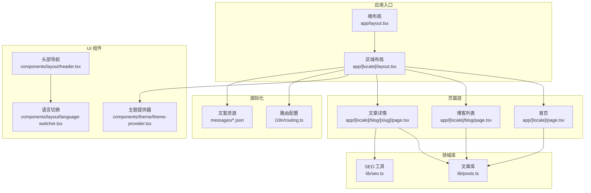
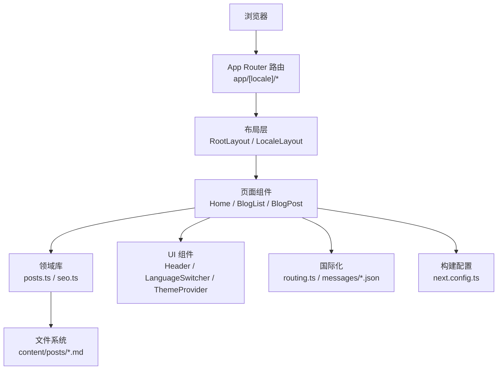
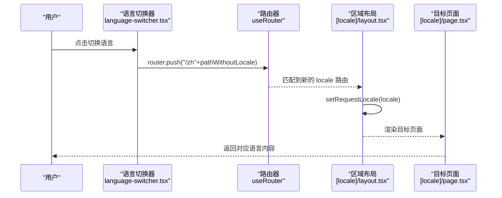
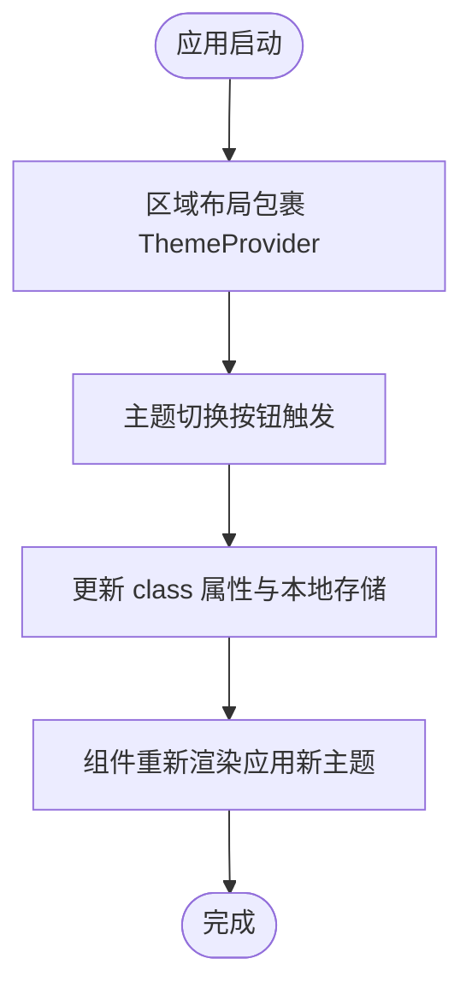
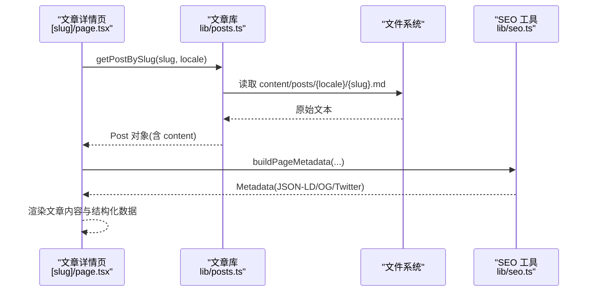
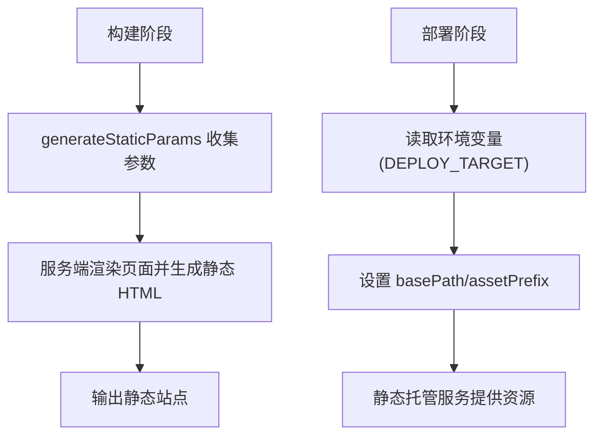
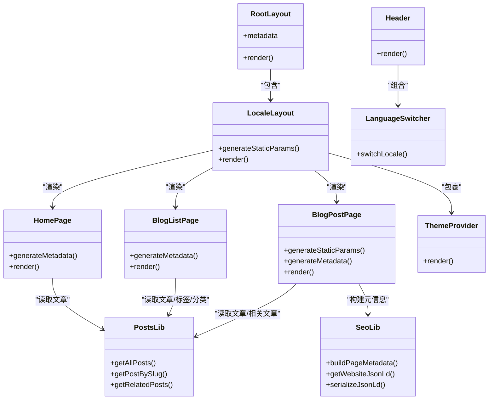
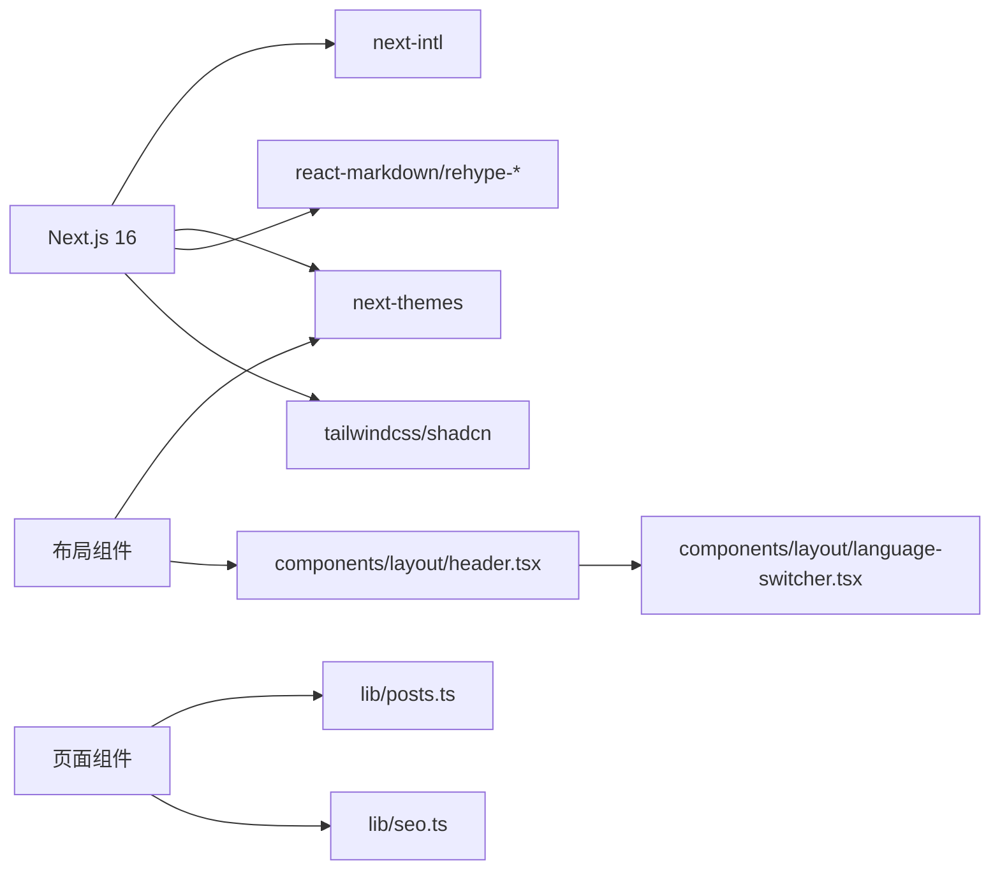

# 架构设计

<cite>
**本文引用的文件**   
- [package.json](file://package.json)
- [next.config.ts](file://next.config.ts)
- [app/layout.tsx](file://app/layout.tsx)
- [app/[locale]/layout.tsx](file://app/[locale]/layout.tsx)
- [i18n/routing.ts](file://i18n/routing.ts)
- [app/[locale]/page.tsx](file://app/[locale]/page.tsx)
- [app/[locale]/blog/page.tsx](file://app/[locale]/blog/page.tsx)
- [app/[locale]/blog/[slug]/page.tsx](file://app/[locale]/blog/[slug]/page.tsx)
- [lib/posts.ts](file://lib/posts.ts)
- [components/theme/theme-provider.tsx](file://components/theme/theme-provider.tsx)
- [components/layout/header.tsx](file://components/layout/header.tsx)
- [components/layout/language-switcher.tsx](file://components/layout/language-switcher.tsx)
- [lib/seo.ts](file://lib/seo.ts)
- [types/post.ts](file://types/post.ts)
- [messages/zh.json](file://messages/zh.json)
</cite>

## 目录
1. [简介](#简介)
2. [项目结构](#项目结构)
3. [核心组件](#核心组件)
4. [架构总览](#架构总览)
5. [详细组件分析](#详细组件分析)
6. [依赖关系分析](#依赖关系分析)
7. [性能考量](#性能考量)
8. [故障排查指南](#故障排查指南)
9. [结论](#结论)
10. [附录](#附录)

## 简介
本架构设计文档面向基于 Next.js 16 App Router 的博客系统，系统性阐述整体架构模式、组件化与分层设计、数据流管理、国际化路由、主题系统与内容管理的数据流向，以及 SSR 与 SSG 的结合策略。文档同时给出系统边界定义、组件交互关系图与技术决策权衡，帮助开发者深入理解并高效扩展该项目。

## 项目结构
本项目采用“按功能域组织”的目录结构：
- app 层：Next.js App Router 页面与布局，承载路由、元信息生成与页面级数据获取
- components 层：可复用 UI 与业务组件，按功能域拆分（如 blog、experience、theme、layout）
- lib 层：领域逻辑与工具函数（文章读取、SEO、站点 URL、高亮等）
- content 层：静态内容（Markdown、JSON），作为内容源
- i18n 层：国际化路由配置与请求上下文
- types 层：类型定义
- messages 层：多语言文案
- scripts 层：构建期脚本（SEO 修复、路径扁平化、图片压缩）

图表来源
- [app/layout.tsx:1-114](file://app/layout.tsx#L1-L114)
- [app/[locale]/layout.tsx:1-64](file://app/[locale]/layout.tsx#L1-L64)
- [app/[locale]/page.tsx:1-37](file://app/[locale]/page.tsx#L1-L37)
- [app/[locale]/blog/page.tsx:1-34](file://app/[locale]/blog/page.tsx#L1-L34)
- [app/[locale]/blog/[slug]/page.tsx:1-180](file://app/[locale]/blog/[slug]/page.tsx#L1-L180)
- [lib/posts.ts:1-121](file://lib/posts.ts#L1-L121)
- [lib/seo.ts:1-199](file://lib/seo.ts#L1-L199)
- [components/layout/header.tsx:1-270](file://components/layout/header.tsx#L1-L270)
- [components/layout/language-switcher.tsx:1-53](file://components/layout/language-switcher.tsx#L1-L53)
- [components/theme/theme-provider.tsx:1-11](file://components/theme/theme-provider.tsx#L1-L11)
- [i18n/routing.ts:1-6](file://i18n/routing.ts#L1-L6)
- [messages/zh.json:1-168](file://messages/zh.json#L1-L168)

章节来源
- [package.json:1-47](file://package.json#L1-L47)
- [next.config.ts:1-38](file://next.config.ts#L1-L38)

## 核心组件
- 根布局与区域布局
  - 根布局负责全局字体注入、站点元信息与 HTML 基础属性设置
  - 区域布局负责国际化上下文注入、主题提供器、通用 UI 容器（Header/Footer）、结构化数据注入
- 页面组件
  - 首页：聚合个人档案、最新文章、经历摘要
  - 博客列表：加载文章、标签、分类
  - 文章详情：根据 slug 加载文章、计算相关度推荐、生成 SEO 与结构化数据
- 领域库
  - 文章库：从 content/posts 下按 locale 读取 Markdown，解析 frontmatter，计算阅读时长，支持按标签/分类筛选与相关文章推荐
  - SEO 工具：统一构建页面元信息、语言变体、OpenGraph/Twitter Card、JSON-LD 序列化
- UI 组件
  - 头部导航：响应式导航、滚动态变化、移动端抽屉菜单
  - 语言切换：客户端动态切换 locale 并保留当前路径
  - 主题提供器：封装 next-themes，提供系统/明/暗主题能力

章节来源
- [app/layout.tsx:1-114](file://app/layout.tsx#L1-L114)
- [app/[locale]/layout.tsx:1-64](file://app/[locale]/layout.tsx#L1-L64)
- [app/[locale]/page.tsx:1-37](file://app/[locale]/page.tsx#L1-L37)
- [app/[locale]/blog/page.tsx:1-34](file://app/[locale]/blog/page.tsx#L1-L34)
- [app/[locale]/blog/[slug]/page.tsx:1-180](file://app/[locale]/blog/[slug]/page.tsx#L1-L180)
- [lib/posts.ts:1-121](file://lib/posts.ts#L1-L121)
- [lib/seo.ts:1-199](file://lib/seo.ts#L1-L199)
- [components/layout/header.tsx:1-270](file://components/layout/header.tsx#L1-L270)
- [components/layout/language-switcher.tsx:1-53](file://components/layout/language-switcher.tsx#L1-L53)
- [components/theme/theme-provider.tsx:1-11](file://components/theme/theme-provider.tsx#L1-L11)

## 架构总览
系统采用“App Router + 服务端组件 + 少量客户端组件”的分层架构：
- 路由层：基于 app/[locale] 的多语言路由，结合 next-intl 进行消息与语言上下文注入
- 页面层：各页面在 generateMetadata 中生成 SEO，在默认导出中执行数据获取与渲染
- 领域层：lib 模块封装内容读取、SEO 构建、站点 URL 处理等
- 表现层：components 提供可复用的 UI 与业务组件
- 部署层：通过 next.config.ts 控制输出为静态站点 export，并根据环境变量决定 basePath/assetPrefix

图表来源
- [app/[locale]/layout.tsx:1-64](file://app/[locale]/layout.tsx#L1-L64)
- [app/[locale]/page.tsx:1-37](file://app/[locale]/page.tsx#L1-L37)
- [app/[locale]/blog/page.tsx:1-34](file://app/[locale]/blog/page.tsx#L1-L34)
- [app/[locale]/blog/[slug]/page.tsx:1-180](file://app/[locale]/blog/[slug]/page.tsx#L1-L180)
- [lib/posts.ts:1-121](file://lib/posts.ts#L1-L121)
- [lib/seo.ts:1-199](file://lib/seo.ts#L1-L199)
- [i18n/routing.ts:1-6](file://i18n/routing.ts#L1-L6)
- [messages/zh.json:1-168](file://messages/zh.json#L1-L168)
- [next.config.ts:1-38](file://next.config.ts#L1-L38)

## 详细组件分析

### 国际化路由系统
- 路由定义：通过 defineRouting 声明支持的语言与默认语言
- 区域布局：校验 locale、启用 setRequestLocale、注入 next-intl 客户端提供者、注入网站 JSON-LD
- 语言切换：客户端使用 useLocale/useRouter 将当前路径前缀替换为新 locale，实现无刷新切换
- 导航链接：Header 中的导航项均带 locale 前缀，确保路由一致性

图表来源
- [components/layout/language-switcher.tsx:1-53](file://components/layout/language-switcher.tsx#L1-L53)
- [app/[locale]/layout.tsx:1-64](file://app/[locale]/layout.tsx#L1-L64)
- [app/[locale]/page.tsx:1-37](file://app/[locale]/page.tsx#L1-L37)
- [i18n/routing.ts:1-6](file://i18n/routing.ts#L1-L6)

章节来源
- [i18n/routing.ts:1-6](file://i18n/routing.ts#L1-L6)
- [app/[locale]/layout.tsx:1-64](file://app/[locale]/layout.tsx#L1-L64)
- [components/layout/language-switcher.tsx:1-53](file://components/layout/language-switcher.tsx#L1-L53)

### 主题系统
- 主题提供器：封装 next-themes，以 attribute="class" 方式驱动 Tailwind 主题变量
- 区域布局：包裹 TooltipProvider 与主题提供器，使全站共享主题状态
- 交互组件：ThemeToggle 与 Header 联动，支持明/暗/跟随系统

图表来源
- [components/theme/theme-provider.tsx:1-11](file://components/theme/theme-provider.tsx#L1-L11)
- [app/[locale]/layout.tsx:1-64](file://app/[locale]/layout.tsx#L1-L64)

章节来源
- [components/theme/theme-provider.tsx:1-11](file://components/theme/theme-provider.tsx#L1-L11)
- [app/[locale]/layout.tsx:1-64](file://app/[locale]/layout.tsx#L1-L64)

### 内容管理与数据流
- 内容源：content/posts/{locale}/*.md，gray-matter 解析 frontmatter
- 数据读取：getAllPosts/getPostBySlug 等函数按 locale 读取文件，计算阅读时长，过滤未发布文章，排序
- 页面消费：首页展示最新 N 篇；博客列表展示全部；文章详情根据 slug 精准读取并计算相关文章
- 资源路径：封面图等静态资源通过 getAssetPath 转换，适配 basePath/assetPrefix

图表来源
- [app/[locale]/blog/[slug]/page.tsx:1-180](file://app/[locale]/blog/[slug]/page.tsx#L1-L180)
- [lib/posts.ts:1-121](file://lib/posts.ts#L1-L121)
- [lib/seo.ts:1-199](file://lib/seo.ts#L1-L199)

章节来源
- [lib/posts.ts:1-121](file://lib/posts.ts#L1-L121)
- [app/[locale]/blog/[slug]/page.tsx:1-180](file://app/[locale]/blog/[slug]/page.tsx#L1-L180)
- [lib/seo.ts:1-199](file://lib/seo.ts#L1-L199)
- [types/post.ts:1-20](file://types/post.ts#L1-L20)

### 服务器端渲染（SSR）与静态站点生成（SSG）结合策略
- 静态导出：next.config.ts 设置 output: "export"，trailingSlash: true，images.unoptimized: true，适配纯静态托管
- 子路径部署：根据 DEPLOY_TARGET 环境变量决定是否启用 basePath/assetPrefix，并暴露 NEXT_PUBLIC_BASE_PATH 给前端
- 预生成参数：generateStaticParams 遍历 locales 与 posts，预生成所有语言的文章页，实现 SSG
- 元信息生成：每个页面通过 generateMetadata 生成 SEO，利于爬虫抓取与社交分享
- 运行时行为：页面组件在服务端执行数据读取与渲染，客户端仅承担交互（如语言切换、主题切换）

图表来源
- [next.config.ts:1-38](file://next.config.ts#L1-L38)
- [app/[locale]/blog/[slug]/page.tsx:1-180](file://app/[locale]/blog/[slug]/page.tsx#L1-L180)

章节来源
- [next.config.ts:1-38](file://next.config.ts#L1-L38)
- [app/[locale]/blog/[slug]/page.tsx:1-180](file://app/[locale]/blog/[slug]/page.tsx#L1-L180)

### 组件交互关系图

图表来源
- [app/layout.tsx:1-114](file://app/layout.tsx#L1-L114)
- [app/[locale]/layout.tsx:1-64](file://app/[locale]/layout.tsx#L1-L64)
- [app/[locale]/page.tsx:1-37](file://app/[locale]/page.tsx#L1-L37)
- [app/[locale]/blog/page.tsx:1-34](file://app/[locale]/blog/page.tsx#L1-L34)
- [app/[locale]/blog/[slug]/page.tsx:1-180](file://app/[locale]/blog/[slug]/page.tsx#L1-L180)
- [lib/posts.ts:1-121](file://lib/posts.ts#L1-L121)
- [lib/seo.ts:1-199](file://lib/seo.ts#L1-L199)
- [components/layout/header.tsx:1-270](file://components/layout/header.tsx#L1-L270)
- [components/layout/language-switcher.tsx:1-53](file://components/layout/language-switcher.tsx#L1-L53)
- [components/theme/theme-provider.tsx:1-11](file://components/theme/theme-provider.tsx#L1-L11)

## 依赖关系分析
- 外部依赖
  - next 16：App Router、静态导出、服务端组件
  - next-intl：国际化路由与消息
  - next-themes：主题切换
  - gray-matter：Markdown frontmatter 解析
  - react-markdown/rehype-*：Markdown 渲染与代码高亮
  - tailwindcss/shadcn：样式与 UI 组件
- 内部依赖
  - 页面依赖 lib/posts.ts 与 lib/seo.ts
  - 布局依赖 theme-provider、header/footer、tooltip 等
  - 语言切换依赖 next-intl 与 next/navigation

图表来源
- [package.json:1-47](file://package.json#L1-L47)
- [app/[locale]/page.tsx:1-37](file://app/[locale]/page.tsx#L1-L37)
- [app/[locale]/blog/page.tsx:1-34](file://app/[locale]/blog/page.tsx#L1-L34)
- [app/[locale]/blog/[slug]/page.tsx:1-180](file://app/[locale]/blog/[slug]/page.tsx#L1-L180)
- [lib/posts.ts:1-121](file://lib/posts.ts#L1-L121)
- [lib/seo.ts:1-199](file://lib/seo.ts#L1-L199)
- [components/layout/header.tsx:1-270](file://components/layout/header.tsx#L1-L270)
- [components/layout/language-switcher.tsx:1-53](file://components/layout/language-switcher.tsx#L1-L53)

章节来源
- [package.json:1-47](file://package.json#L1-L47)

## 性能考量
- 静态导出与预渲染：output: "export" 与 generateStaticParams 将文章页预生成，减少运行时开销，提升首屏与缓存命中
- 图片优化：images.unoptimized: true 适配静态托管环境，避免运行时图片处理
- 客户端最小化：仅在必要处使用 "use client"（如语言切换、主题切换），其余保持服务端组件以降低包体积
- 滚动监听节流：Header 使用 requestAnimationFrame 节流滚动事件，避免布局抖动
- 资源路径：basePath/assetPrefix 统一处理静态资源前缀，避免跨域与路径错误导致的二次请求

## 故障排查指南
- 404 页面
  - 现象：访问不存在的 slug 或 locale 时返回 404
  - 定位：文章详情页在找不到文章时调用 notFound；区域布局对非法 locale 也返回 notFound
- 语言切换无效
  - 现象：切换后路径未变更或跳转异常
  - 定位：检查 language-switcher 的路径替换逻辑与路由前缀是否一致
- 主题不生效
  - 现象：切换主题后样式未更新
  - 定位：确认 ThemeProvider 已包裹在布局中且 attribute="class" 正确
- 静态资源路径错误
  - 现象：图片/样式 404
  - 定位：检查 next.config.ts 的 basePath/assetPrefix 与 getAssetPath 的使用

章节来源
- [app/[locale]/blog/[slug]/page.tsx:1-180](file://app/[locale]/blog/[slug]/page.tsx#L1-L180)
- [app/[locale]/layout.tsx:1-64](file://app/[locale]/layout.tsx#L1-L64)
- [components/layout/language-switcher.tsx:1-53](file://components/layout/language-switcher.tsx#L1-L53)
- [components/theme/theme-provider.tsx:1-11](file://components/theme/theme-provider.tsx#L1-L11)
- [next.config.ts:1-38](file://next.config.ts#L1-L38)

## 结论
本项目以 Next.js 16 App Router 为核心，结合 next-intl 与 next-themes，构建了清晰的分层架构与稳定的数据流。通过静态导出与预生成参数，实现了高性能的 SSG；通过服务端组件与客户端组件的合理分工，兼顾了 SEO 与交互体验。国际化路由、主题系统与内容管理的数据流向明确，便于后续扩展与维护。

## 附录
- 多语言文案示例：messages/zh.json 提供了导航、页面标题、描述等键值，供页面与组件使用
- 类型定义：types/post.ts 定义了文章 frontmatter 与完整文章模型，保证类型安全

章节来源
- [messages/zh.json:1-168](file://messages/zh.json#L1-L168)
- [types/post.ts:1-20](file://types/post.ts#L1-L20)