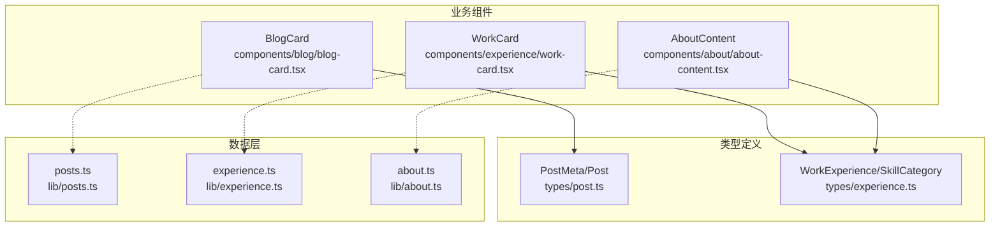
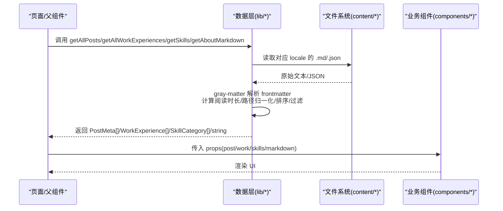
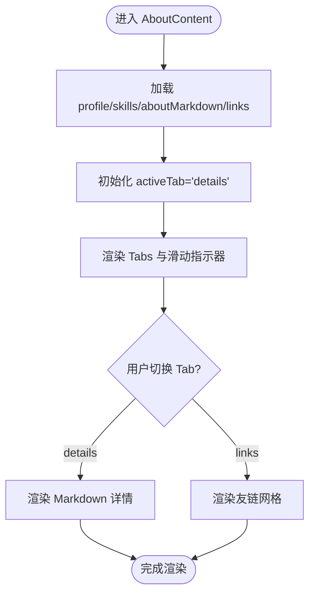
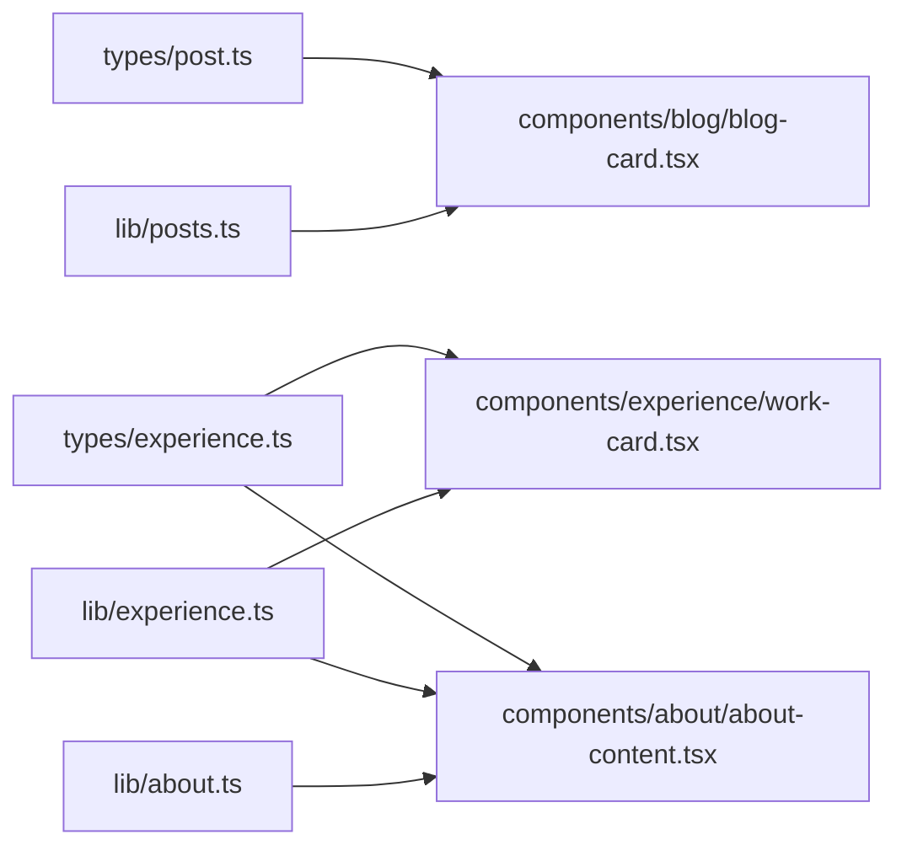

# 业务组件

<cite>
**本文引用的文件**
- [components/blog/blog-card.tsx](file://components/blog/blog-card.tsx)
- [components/experience/work-card.tsx](file://components/experience/work-card.tsx)
- [components/about/about-content.tsx](file://components/about/about-content.tsx)
- [types/post.ts](file://types/post.ts)
- [types/experience.ts](file://types/experience.ts)
- [lib/posts.ts](file://lib/posts.ts)
- [lib/experience.ts](file://lib/experience.ts)
- [lib/about.ts](file://lib/about.ts)
</cite>

## 目录
1. [简介](#简介)
2. [项目结构](#项目结构)
3. [核心组件](#核心组件)
4. [架构总览](#架构总览)
5. [详细组件分析](#详细组件分析)
6. [依赖关系分析](#依赖关系分析)
7. [性能考量](#性能考量)
8. [故障排查指南](#故障排查指南)
9. [结论](#结论)
10. [附录：使用示例与扩展点](#附录使用示例与扩展点)

## 简介
本文件聚焦博客卡片、工作经历卡片、关于内容等“业务组件”的实现与组合方式，解释它们如何基于基础 UI 组件构建复杂界面，并说明数据模型到组件的映射、状态管理策略、数据获取模式与错误处理机制。同时提供可配置项、扩展点与自定义方法，以及实际集成与定制示例路径，帮助读者快速上手与二次开发。

## 项目结构
围绕业务组件的相关代码主要分布在以下位置：
- 业务组件：components/blog、components/experience、components/about
- 类型定义：types/post.ts、types/experience.ts
- 数据读取与解析：lib/posts.ts、lib/experience.ts、lib/about.ts



图表来源
- [components/blog/blog-card.tsx:1-156](file://components/blog/blog-card.tsx#L1-L156)
- [components/experience/work-card.tsx:1-69](file://components/experience/work-card.tsx#L1-L69)
- [components/about/about-content.tsx:1-381](file://components/about/about-content.tsx#L1-L381)
- [types/post.ts:1-20](file://types/post.ts#L1-L20)
- [types/experience.ts:1-48](file://types/experience.ts#L1-L48)
- [lib/posts.ts:1-121](file://lib/posts.ts#L1-L121)
- [lib/experience.ts:1-147](file://lib/experience.ts#L1-L147)
- [lib/about.ts:1-17](file://lib/about.ts#L1-L17)

章节来源
- [components/blog/blog-card.tsx:1-156](file://components/blog/blog-card.tsx#L1-L156)
- [components/experience/work-card.tsx:1-69](file://components/experience/work-card.tsx#L1-L69)
- [components/about/about-content.tsx:1-381](file://components/about/about-content.tsx#L1-L381)
- [types/post.ts:1-20](file://types/post.ts#L1-L20)
- [types/experience.ts:1-48](file://types/experience.ts#L1-L48)
- [lib/posts.ts:1-121](file://lib/posts.ts#L1-L121)
- [lib/experience.ts:1-147](file://lib/experience.ts#L1-L147)
- [lib/about.ts:1-17](file://lib/about.ts#L1-L17)

## 核心组件
- 博客卡片 BlogCard
  - 职责：以两种布局（精选横向与普通纵向）展示文章元信息，支持封面图、分类标签、日期、阅读时长与标签列表，点击跳转至文章详情。
  - 输入属性：post(PostMeta)、featured(boolean, 默认 false)
  - 组合的基础 UI：Badge、图标、Next.js Link
  - 国际化：next-intl 的 useLocale/useTranslations
  - 数据映射：PostMeta → 标题、描述、封面、日期、标签、阅读时长、分类、slug
  - 交互：hover 动效、箭头指示、图片缩放过渡

- 工作经历卡片 WorkCard
  - 职责：展示单段工作经历，包括职位、公司、时间区间、地点、当前工作标记、Markdown 内容与技能标签。
  - 输入属性：work(WorkExperience)、index(number)
  - 组合的基础 UI：Card/CardHeader/CardContent、Badge、ReactMarkdown
  - 国际化：useTranslations("experience")
  - 数据映射：WorkExperience → 职位、公司、起止时间、地点、技术栈、内容

- 关于内容 AboutContent
  - 职责：聚合个人档案、社交链接、技能统计、Markdown 自我介绍与友情链接；提供“详情/链接”双 Tab 切换。
  - 输入属性：profile(personal+social)、locale、skills(SkillCategory[])、aboutMarkdown(string)、links(FriendLink[])
  - 组合的基础 UI：Button、Badge、SocialLink、TiltAvatar、MarkdownRenderer
  - 本地化：根据 locale 选择 bio 语言；Tab 文案与计数来自 i18n
  - 状态管理：activeTab 控制面板切换；友链头像加载失败回退逻辑

章节来源
- [components/blog/blog-card.tsx:1-156](file://components/blog/blog-card.tsx#L1-L156)
- [components/experience/work-card.tsx:1-69](file://components/experience/work-card.tsx#L1-L69)
- [components/about/about-content.tsx:1-381](file://components/about/about-content.tsx#L1-L381)

## 架构总览
业务组件通过“类型定义 + 数据层函数”获得结构化数据，再组合基础 UI 组件渲染页面。数据层从 content 目录下的 Markdown/JSON 中读取并解析 frontmatter，计算阅读时长、规范化换行、排序与过滤，最终将 PostMeta/WorkExperience/SkillCategory 等对象注入组件。



图表来源
- [lib/posts.ts:15-47](file://lib/posts.ts#L15-L47)
- [lib/experience.ts:17-46](file://lib/experience.ts#L17-L46)
- [lib/experience.ts:124-137](file://lib/experience.ts#L124-L137)
- [lib/about.ts:6-16](file://lib/about.ts#L6-L16)
- [components/blog/blog-card.tsx:14-108](file://components/blog/blog-card.tsx#L14-L108)
- [components/experience/work-card.tsx:15-67](file://components/experience/work-card.tsx#L15-L67)
- [components/about/about-content.tsx:36-60](file://components/about/about-content.tsx#L36-L60)

## 详细组件分析

### 博客卡片 BlogCard
- 设计要点
  - featured=true 时采用横向布局，左侧为封面图，右侧为元信息与标签；无封面时降级为紧凑布局。
  - featured=false 时采用纵向卡片，顶部可选封面图，下方为元信息、标题、摘要与标签。
  - 使用 next-intl 进行日期格式化与文案国际化。
- 数据模型映射
  - PostMeta 字段：title、description、coverImage、date、tags、category、readingTime、slug
- 关键实现路径
  - 组件入口与属性定义：[components/blog/blog-card.tsx:9-14](file://components/blog/blog-card.tsx#L9-L14)
  - 精选布局分支：[components/blog/blog-card.tsx:18-108](file://components/blog/blog-card.tsx#L18-L108)
  - 普通布局分支：[components/blog/blog-card.tsx:110-156](file://components/blog/blog-card.tsx#L110-L156)
  - 类型定义：[types/post.ts:18-20](file://types/post.ts#L18-L20)
- 错误处理与健壮性
  - 未提供封面图时自动降级为紧凑布局，避免空图占位异常。
- 可配置项
  - post: 必需，包含文章元信息
  - featured: 可选，是否使用精选布局
- 扩展点
  - 可在外层包裹自定义容器或样式类名
  - 可通过替换 Badge 或图标组件实现主题化
- 使用示例（路径）
  - 在页面中导入并传入 PostMeta 数组渲染列表：参考 [lib/posts.ts:15-47](file://lib/posts.ts#L15-L47) 的数据来源

```mermaid
classDiagram
class BlogCard {
+props : { post : PostMeta; featured? : boolean }
+render() JSX
}
class PostMeta {
+title : string
+description : string
+coverImage? : string
+date : string
+tags : string[]
+category : string
+author : string
+slug : string
+published? : boolean
+readingTime : number
}
BlogCard --> PostMeta : "消费"
```

图表来源
- [components/blog/blog-card.tsx:9-14](file://components/blog/blog-card.tsx#L9-L14)
- [types/post.ts:1-20](file://types/post.ts#L1-L20)

章节来源
- [components/blog/blog-card.tsx:1-156](file://components/blog/blog-card.tsx#L1-L156)
- [types/post.ts:1-20](file://types/post.ts#L1-L20)

### 工作经历卡片 WorkCard
- 设计要点
  - 使用 Card 系列组件承载头部信息与正文内容
  - 当 endDate 为空时显示“当前”标识
  - 使用 ReactMarkdown 渲染工作内容，底部展示技术栈标签
- 数据模型映射
  - WorkExperience 字段：position、company、startDate、endDate、location、technologies、content、slug
- 关键实现路径
  - 组件入口与属性定义：[components/experience/work-card.tsx:10-13](file://components/experience/work-card.tsx#L10-L13)
  - 当前工作判断与时间区间渲染：[components/experience/work-card.tsx:17-51](file://components/experience/work-card.tsx#L17-L51)
  - Markdown 内容与技能标签渲染：[components/experience/work-card.tsx:53-66](file://components/experience/work-card.tsx#L53-L66)
  - 类型定义：[types/experience.ts:15-18](file://types/experience.ts#L15-L18)
- 错误处理与健壮性
  - 对 technologies 存在性与长度进行判断，避免空数组渲染
- 可配置项
  - work: 必需，包含工作经历数据
  - index: 用于动画延迟等差异化表现
- 扩展点
  - 可替换 Card 子组件或增加操作按钮
  - 可接入外部评论或外链
- 使用示例（路径）
  - 数据来源与排序：[lib/experience.ts:17-46](file://lib/experience.ts#L17-L46)

```mermaid
classDiagram
class WorkCard {
+props : { work : WorkExperience; index : number }
+render() JSX
}
class WorkExperience {
+type : "work"
+company : string
+position : string
+startDate : string
+endDate? : string
+location? : string
+technologies? : string[]
+logo? : string
+order : number
+slug : string
+content : string
}
WorkCard --> WorkExperience : "消费"
```

图表来源
- [components/experience/work-card.tsx:10-13](file://components/experience/work-card.tsx#L10-L13)
- [types/experience.ts:1-18](file://types/experience.ts#L1-L18)

章节来源
- [components/experience/work-card.tsx:1-69](file://components/experience/work-card.tsx#L1-L69)
- [types/experience.ts:1-18](file://types/experience.ts#L1-L18)

### 关于内容 AboutContent
- 设计要点
  - 左侧个人信息卡片（头像、姓名、职业、地点、邮箱、社交链接、行动按钮）
  - 右侧主区域提供“详情/链接”两个 Tab，详情区渲染 Markdown，链接区展示友链网格
  - 动态统计技能总数，Tab 带滑动指示器与计数徽标
- 数据模型映射
  - profile.personal: 个人基本信息
  - profile.social: 社交链接数组
  - skills: SkillCategory[]，用于统计与展示
  - aboutMarkdown: string，用于详情区渲染
  - links: FriendLink[]，用于友链展示
- 关键实现路径
  - 组件入口与属性定义：[components/about/about-content.tsx:25-34](file://components/about/about-content.tsx#L25-L34)
  - 本地化与初始状态：[components/about/about-content.tsx:36-44](file://components/about/about-content.tsx#L36-L44)
  - Tab 定义与切换逻辑：[components/about/about-content.tsx:45-58](file://components/about/about-content.tsx#L45-L58), [components/about/about-content.tsx:201-234](file://components/about/about-content.tsx#L201-L234)
  - 详情区 Markdown 渲染：[components/about/about-content.tsx:259-267](file://components/about/about-content.tsx#L259-L267)
  - 友链卡片与头像回退：[components/about/about-content.tsx:306-368](file://components/about/about-content.tsx#L306-L368)
  - 数据源：[lib/about.ts:6-16](file://lib/about.ts#L6-L16), [lib/experience.ts:124-137](file://lib/experience.ts#L124-L137)
- 错误处理与健壮性
  - 头像加载失败时回退到默认头像或首字母占位
  - 若不存在本地化 Markdown，则返回空字符串并在 UI 提示
- 可配置项
  - profile、locale、skills、aboutMarkdown、links
- 扩展点
  - 新增 Tab 面板：在 tabs 数组中添加新项，并实现对应 panel 渲染
  - 友链卡片：FriendLinkCard 可独立抽取为组件，支持更多元数据展示
- 使用示例（路径）
  - 组装数据并传入组件：参考 [lib/about.ts:6-16](file://lib/about.ts#L6-L16) 与 [lib/experience.ts:124-137](file://lib/experience.ts#L124-L137)



图表来源
- [components/about/about-content.tsx:36-60](file://components/about/about-content.tsx#L36-L60)
- [components/about/about-content.tsx:201-234](file://components/about/about-content.tsx#L201-L234)
- [components/about/about-content.tsx:259-267](file://components/about/about-content.tsx#L259-L267)
- [components/about/about-content.tsx:306-368](file://components/about/about-content.tsx#L306-L368)
- [lib/about.ts:6-16](file://lib/about.ts#L6-L16)
- [lib/experience.ts:124-137](file://lib/experience.ts#L124-L137)

章节来源
- [components/about/about-content.tsx:1-381](file://components/about/about-content.tsx#L1-L381)
- [lib/about.ts:1-17](file://lib/about.ts#L1-L17)
- [lib/experience.ts:124-137](file://lib/experience.ts#L124-L137)

## 依赖关系分析
- 组件与类型
  - BlogCard 依赖 PostMeta
  - WorkCard 依赖 WorkExperience
  - AboutContent 依赖 ProfileConfig、SkillCategory、FriendLink
- 组件与数据层
  - BlogCard 由 posts.ts 提供的 PostMeta[] 驱动
  - WorkCard 由 experience.ts 提供的 WorkExperience[] 驱动
  - AboutContent 由 about.ts 提供的 Markdown 与 experience.ts 提供的 Skills 驱动
- 外部依赖
  - next-intl：国际化与本地化
  - react-markdown：Markdown 渲染
  - lucide-react：图标
  - 基础 UI：Badge、Card、Button 等



图表来源
- [types/post.ts:1-20](file://types/post.ts#L1-L20)
- [types/experience.ts:1-48](file://types/experience.ts#L1-L48)
- [components/blog/blog-card.tsx:1-156](file://components/blog/blog-card.tsx#L1-L156)
- [components/experience/work-card.tsx:1-69](file://components/experience/work-card.tsx#L1-L69)
- [components/about/about-content.tsx:1-381](file://components/about/about-content.tsx#L1-L381)
- [lib/posts.ts:1-121](file://lib/posts.ts#L1-L121)
- [lib/experience.ts:1-147](file://lib/experience.ts#L1-L147)
- [lib/about.ts:1-17](file://lib/about.ts#L1-L17)

章节来源
- [types/post.ts:1-20](file://types/post.ts#L1-L20)
- [types/experience.ts:1-48](file://types/experience.ts#L1-L48)
- [components/blog/blog-card.tsx:1-156](file://components/blog/blog-card.tsx#L1-L156)
- [components/experience/work-card.tsx:1-69](file://components/experience/work-card.tsx#L1-L69)
- [components/about/about-content.tsx:1-381](file://components/about/about-content.tsx#L1-L381)
- [lib/posts.ts:1-121](file://lib/posts.ts#L1-L121)
- [lib/experience.ts:1-147](file://lib/experience.ts#L1-L147)
- [lib/about.ts:1-17](file://lib/about.ts#L1-L17)

## 性能考量
- 静态数据读取
  - 数据层在构建期读取 content 目录，避免运行时 IO，提升首屏性能
- 图片与资源
  - 封面图与头像使用懒加载与回退策略，减少无效请求
- 渲染优化
  - 列表渲染使用 key 稳定标识
  - 大段 Markdown 仅在需要时渲染（Tab 切换）
- 国际化
  - 使用 next-intl 的 useLocale/useTranslations，避免重复计算

## 故障排查指南
- 中文/英文内容缺失
  - 检查 content 目录下是否存在对应 locale 的文件（如 zh/en），否则将回退到 en 或返回空串
  - 参考：[lib/about.ts:6-16](file://lib/about.ts#L6-L16)
- 阅读时长不准确
  - 阅读时长按字数估算，确认文章内容是否为纯文本且不含大量非空格字符
  - 参考：[lib/posts.ts:9-13](file://lib/posts.ts#L9-L13)
- 部署后出现 RSC 相关异常
  - 数据层已对 CRLF→LF 进行规范化，确保 Windows 本地与 GitHub Pages 部署一致
  - 参考：[lib/experience.ts:31-34](file://lib/experience.ts#L31-L34)
- 头像加载失败
  - 组件内部已实现 onError 回退逻辑，必要时检查网络与跨域设置
  - 参考：[components/about/about-content.tsx:347-368](file://components/about/about-content.tsx#L347-L368)

章节来源
- [lib/about.ts:6-16](file://lib/about.ts#L6-L16)
- [lib/posts.ts:9-13](file://lib/posts.ts#L9-L13)
- [lib/experience.ts:31-34](file://lib/experience.ts#L31-L34)
- [components/about/about-content.tsx:347-368](file://components/about/about-content.tsx#L347-L368)

## 结论
上述业务组件通过清晰的数据模型与数据层函数，结合基础 UI 组件实现了高内聚、低耦合的可复用界面单元。它们具备良好的国际化、响应式与可访问性支持，并提供丰富的扩展点以满足个性化需求。

## 附录：使用示例与扩展点

- 集成博客列表
  - 步骤
    - 在页面中调用 getAllPosts(locale) 获取 PostMeta[]
    - 遍历渲染 BlogCard，按需设置 featured
  - 参考路径
    - 数据获取：[lib/posts.ts:15-47](file://lib/posts.ts#L15-L47)
    - 组件使用：[components/blog/blog-card.tsx:14-108](file://components/blog/blog-card.tsx#L14-L108)

- 集成工作经历
  - 步骤
    - 调用 getAllWorkExperiences(locale) 获取 WorkExperience[]
    - 遍历渲染 WorkCard，index 可用于动画延迟
  - 参考路径
    - 数据获取：[lib/experience.ts:17-46](file://lib/experience.ts#L17-L46)
    - 组件使用：[components/experience/work-card.tsx:15-67](file://components/experience/work-card.tsx#L15-L67)

- 集成关于页
  - 步骤
    - 调用 getAboutMarkdown(locale) 获取 Markdown 文本
    - 调用 getSkills(locale) 获取技能分类
    - 组装 profile、links 等数据，传入 AboutContent
  - 参考路径
    - 数据获取：[lib/about.ts:6-16](file://lib/about.ts#L6-L16), [lib/experience.ts:124-137](file://lib/experience.ts#L124-L137)
    - 组件使用：[components/about/about-content.tsx:36-60](file://components/about/about-content.tsx#L36-L60)

- 扩展点建议
  - 新增 Tab：在 AboutContent 的 tabs 数组中添加新项，并实现对应 panel 渲染
  - 自定义徽章：替换 Badge 的 variant 或样式类名以实现品牌化
  - 增强友链：在 FriendLinkCard 中增加站点截图、更新频率等元信息