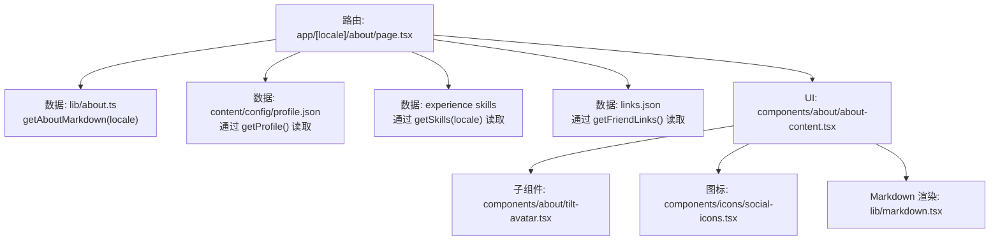
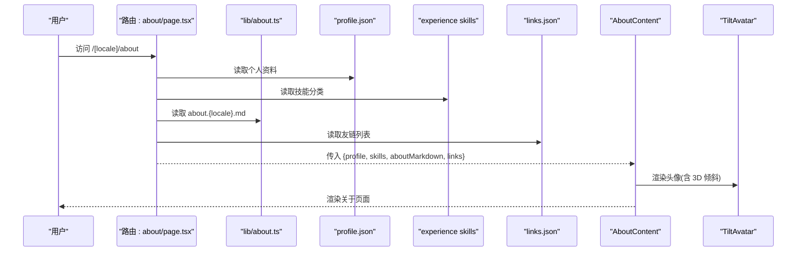
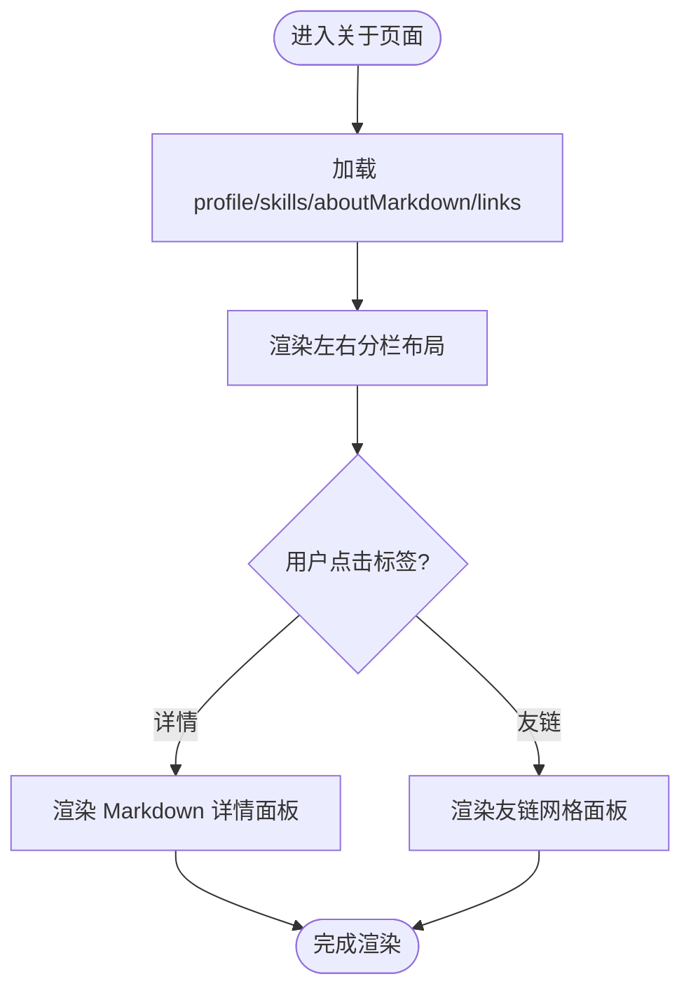
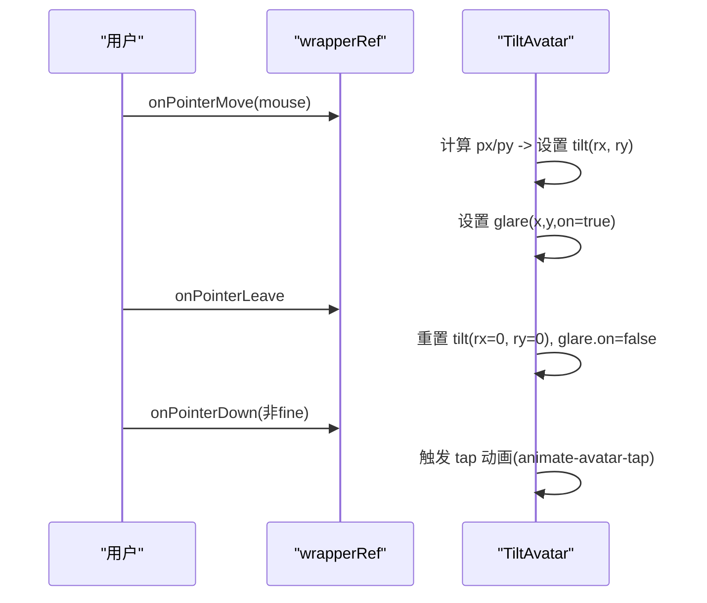
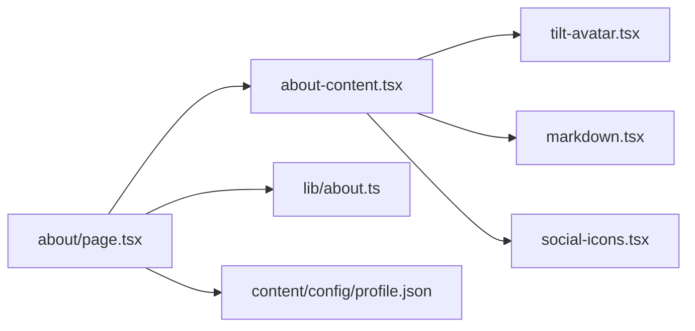

# 关于页面组件

<cite>
**本文引用的文件**
- [app/[locale]/about/page.tsx](file://app/[locale]/about/page.tsx)
- [components/about/about-content.tsx](file://components/about/about-content.tsx)
- [components/about/tilt-avatar.tsx](file://components/about/tilt-avatar.tsx)
- [lib/about.ts](file://lib/about.ts)
- [content/config/profile.json](file://content/config/profile.json)
- [types/profile.ts](file://types/profile.ts)
</cite>

## 目录
1. [简介](#简介)
2. [项目结构](#项目结构)
3. [核心组件](#核心组件)
4. [架构总览](#架构总览)
5. [详细组件分析](#详细组件分析)
6. [依赖关系分析](#依赖关系分析)
7. [性能考量](#性能考量)
8. [故障排查指南](#故障排查指南)
9. [结论](#结论)
10. [附录：配置与自定义示例](#附录配置与自定义示例)

## 简介
本文件围绕“关于页面”业务组件进行系统化文档化，覆盖信息架构、内容组织方式、响应式布局实现；深入解析倾斜头像组件的 3D 变换效果、鼠标交互与性能优化；说明个人信息动态渲染、社交媒体链接管理与联系方式展示；并给出主题适配、动画效果与可访问性支持要点。最后提供配置项、自定义样式与扩展方法，以及实际使用示例，帮助快速个性化定制关于页面。

## 项目结构
关于页面由路由入口、数据获取、UI 组合与子组件构成，遵循 Next.js App Router 与 next-intl 国际化约定。

图表来源
- [app/[locale]/about/page.tsx:1-46](file://app/[locale]/about/page.tsx#L1-L46)
- [lib/about.ts:1-17](file://lib/about.ts#L1-L17)
- [content/config/profile.json:1-66](file://content/config/profile.json#L1-L66)
- [components/about/about-content.tsx:1-381](file://components/about/about-content.tsx#L1-L381)
- [components/about/tilt-avatar.tsx:1-109](file://components/about/tilt-avatar.tsx#L1-L109)

章节来源
- [app/[locale]/about/page.tsx:1-46](file://app/[locale]/about/page.tsx#L1-L46)

## 核心组件
- AboutContent（主容器）
  - 负责整体布局、标签页切换、个人卡片、社交链接、好友链接网格等。
  - 接收 profile、skills、aboutMarkdown、links 等数据，驱动 UI 渲染。
- TiltAvatar（倾斜头像）
  - 基于 PointerEvent 计算鼠标位置，应用 rotateX/rotateY 与缩放，叠加高光与光环，移动端点击触发弹跳动画。
- 数据层
  - getAboutMarkdown：按 locale 读取 Markdown 内容，回退到英文版本。
  - profile.json：集中管理个人信息、社交链接、简历、主题色等。

章节来源
- [components/about/about-content.tsx:1-381](file://components/about/about-content.tsx#L1-L381)
- [components/about/tilt-avatar.tsx:1-109](file://components/about/tilt-avatar.tsx#L1-L109)
- [lib/about.ts:1-17](file://lib/about.ts#L1-L17)
- [content/config/profile.json:1-66](file://content/config/profile.json#L1-L66)

## 架构总览
关于页面的数据流从服务端路由开始，聚合多源数据后注入客户端组件渲染。

图表来源
- [app/[locale]/about/page.tsx:1-46](file://app/[locale]/about/page.tsx#L1-L46)
- [lib/about.ts:1-17](file://lib/about.ts#L1-L17)
- [content/config/profile.json:1-66](file://content/config/profile.json#L1-L66)
- [components/about/about-content.tsx:1-381](file://components/about/about-content.tsx#L1-L381)
- [components/about/tilt-avatar.tsx:1-109](file://components/about/tilt-avatar.tsx#L1-L109)

## 详细组件分析

### AboutContent 组件
- 信息架构
  - 左侧固定侧栏：开发者名片（头像、姓名、职位、地点、邮箱、社交图标、行动按钮）。
  - 右侧主区域：标题 + 分段标签（详情/友链），详情区以 Markdown 渲染 README 风格内容，友链区以网格卡片展示。
- 内容组织
  - 个人简介 bio 根据当前 locale 选择 zh/en。
  - 技能总数统计用于侧栏提示。
  - 友链卡片包含名称、分类、描述、外链图标与域名显示。
- 响应式布局
  - 小屏单列，大屏采用 360px 固定侧栏 + 自适应主区的两列网格；主内容在桌面端 sticky 定位。
- 可访问性
  - 标签组使用 role="tablist"/role="tab"/role="tabpanel" 与 aria-* 属性，确保键盘与屏幕阅读器可用。
- 主题与动画
  - 背景渐变光晕、卡片悬浮边框高亮、滑动指示器、入场动画延迟等，均基于 Tailwind 类名与 CSS 变量。
- 关键实现路径
  - 侧栏与主区域布局、标签切换逻辑、Markdown 渲染、友链网格与空态处理。

章节来源
- [components/about/about-content.tsx:1-381](file://components/about/about-content.tsx#L1-L381)

#### 关于页面布局与交互流程图

图表来源
- [components/about/about-content.tsx:1-381](file://components/about/about-content.tsx#L1-L381)

### TiltAvatar 组件
- 3D 变换效果
  - 基于 pointermove 计算相对坐标，映射为 rx/ry 旋转角度，配合 scale 放大，营造立体倾斜感。
  - 使用 preserve-3d 与 translateZ 分层，叠加渐变光环与径向高光，增强深度层次。
- 鼠标交互
  - 仅对 fine pointer 启用倾斜与高光；离开时复位；点击在非 fine pointer 设备上触发弹跳动画。
- 性能优化
  - 使用 requestAnimationFrame 重启动画避免抖动；pointerType 判断减少不必要计算；transform 与 opacity 变更优先走合成层。
- 可访问性
  - 装饰元素使用 aria-hidden；头像图片提供 alt；焦点可见性由外层 Avatar 组件保障。
- 关键实现路径
  - 指针事件处理、状态更新、CSS transform 拼接、高光与光环叠加。

章节来源
- [components/about/tilt-avatar.tsx:1-109](file://components/about/tilt-avatar.tsx#L1-L109)

#### 倾斜头像交互时序图

图表来源
- [components/about/tilt-avatar.tsx:1-109](file://components/about/tilt-avatar.tsx#L1-L109)

### 数据与类型
- 个人资料 profile.json
  - personal：姓名、头像、Logo、职业、求职状态、多语言简介、地点、邮箱。
  - social：平台、URL、用户名等社交链接数组。
  - resume：PDF 地址与更新时间。
  - theme：主色与强调色。
  - comments：可选评论配置（如 giscus）。
- 类型定义 types/profile.ts
  - ProfileConfig、SocialLink、GiscusConfig 等接口约束数据结构。
- 关于内容 about.ts
  - getAboutMarkdown：按 locale 读取 Markdown，不存在则回退 en 版本，统一换行符。

章节来源
- [content/config/profile.json:1-66](file://content/config/profile.json#L1-L66)
- [types/profile.ts:1-52](file://types/profile.ts#L1-L52)
- [lib/about.ts:1-17](file://lib/about.ts#L1-L17)

## 依赖关系分析
- 路由层
  - about/page.tsx 作为入口，负责 i18n 初始化、元数据生成与数据聚合，将数据传递给 AboutContent。
- 组件层
  - AboutContent 依赖 SocialLink、Badge、Button、MarkdownRenderer、TiltAvatar 等基础与功能组件。
- 数据层
  - profile.json 提供静态配置；about.ts 提供 Markdown 内容；skills 与 links 分别来自经验与友链模块。

图表来源
- [app/[locale]/about/page.tsx:1-46](file://app/[locale]/about/page.tsx#L1-L46)
- [components/about/about-content.tsx:1-381](file://components/about/about-content.tsx#L1-L381)
- [components/about/tilt-avatar.tsx:1-109](file://components/about/tilt-avatar.tsx#L1-L109)
- [lib/about.ts:1-17](file://lib/about.ts#L1-L17)
- [content/config/profile.json:1-66](file://content/config/profile.json#L1-L66)

## 性能考量
- 渲染策略
  - 路由层为异步 Server Component，预取 profile、skills、aboutMarkdown、links，减少首屏请求。
- 交互性能
  - 倾斜头像仅在 fine pointer 上启用复杂计算；使用 transform/opacity 提升合成效率；动画通过 requestAnimationFrame 启动避免阻塞。
- 资源加载
  - 头像与友链头像使用懒加载与错误回退；Markdown 内容在服务端一次性读取，避免运行时 IO。
- 样式与动画
  - 大量使用 Tailwind 原子类与 CSS 变量，减少自定义样式体积；动画延迟错开，降低重排压力。

## 故障排查指南
- Markdown 未显示或乱码
  - 检查 content/config/about.{locale}.md 是否存在且编码为 LF；若缺失将回退 en 版本。
  - 参考读取逻辑中的换行符归一化处理。
- 头像不显示
  - 确认 profile.json 中 avatar 地址可达；若失败会回退至默认占位。
- 社交链接无效
  - 检查 social 数组中 url 格式是否正确，必要时添加 mailto: 前缀。
- 友链为空
  - 确认 links.json 存在且格式正确；组件会在无数据时展示空态提示。
- 倾斜效果异常
  - 在触控设备或非 fine pointer 上不会触发倾斜；如需调试，检查 pointerType 与 matchMedia 条件。

章节来源
- [lib/about.ts:1-17](file://lib/about.ts#L1-L17)
- [content/config/profile.json:1-66](file://content/config/profile.json#L1-L66)
- [components/about/about-content.tsx:1-381](file://components/about/about-content.tsx#L1-L381)
- [components/about/tilt-avatar.tsx:1-109](file://components/about/tilt-avatar.tsx#L1-L109)

## 结论
关于页面组件通过清晰的数据分层与模块化 UI 组合，实现了良好的可扩展性与可维护性。倾斜头像在保持高性能的同时提供了丰富的交互体验；Markdown 驱动的详情内容与 JSON 配置化的个人信息、社交与友链，使站点易于个性化定制。结合主题与动画体系，整体体验一致且友好。

## 附录：配置与自定义示例

### 配置文件说明（profile.json）
- personal
  - name、avatar、logo、profession、jobStatus.openToWork、bio.zh/en、location、email
- social
  - platform、url、username
- resume
  - pdfUrl、lastUpdated
- theme
  - primaryColor、accentColor
- comments
  - giscus 相关字段（可选）

章节来源
- [content/config/profile.json:1-66](file://content/config/profile.json#L1-L66)
- [types/profile.ts:1-52](file://types/profile.ts#L1-L52)

### 关于内容（Markdown）
- 文件命名：content/config/about.{locale}.md（例如 about.zh.md、about.en.md）
- 读取逻辑：优先本地化版本，否则回退英文；统一换行符为 LF
- 渲染：由 MarkdownRenderer 在客户端渲染，支持标题、段落、列表、图片等

章节来源
- [lib/about.ts:1-17](file://lib/about.ts#L1-L17)
- [components/about/about-content.tsx:1-381](file://components/about/about-content.tsx#L1-L381)

### 响应式布局要点
- 小屏：单列堆叠
- 中屏及以上：左侧固定宽度侧栏 + 右侧自适应主区
- 桌面端：侧栏 sticky 定位，滚动时保持可见

章节来源
- [components/about/about-content.tsx:1-381](file://components/about/about-content.tsx#L1-L381)

### 倾斜头像参数与行为
- 输入参数
  - src：头像地址
  - name：替代文本与占位首字母
  - openToWork：是否显示“开放机会”角标
- 行为
  - 鼠标移动：计算倾斜角度与高光位置
  - 鼠标离开：复位倾斜与隐藏高光
  - 点击（非精细指针）：触发弹跳动画
- 性能
  - 仅细指针启用倾斜；使用 transform/opacity 合成；requestAnimationFrame 启动动画

章节来源
- [components/about/tilt-avatar.tsx:1-109](file://components/about/tilt-avatar.tsx#L1-L109)

### 社交媒体链接管理
- 数据来源：profile.json 的 social 数组
- 展示：社交图标按钮，点击跳转对应 URL
- 扩展：新增平台只需在 social 中添加条目，并确保图标组件支持该 platform

章节来源
- [content/config/profile.json:1-66](file://content/config/profile.json#L1-L66)
- [components/about/about-content.tsx:1-381](file://components/about/about-content.tsx#L1-L381)

### 联系方式展示
- 邮箱：当 profile.personal.email 存在时，渲染 mailto 链接，支持悬停下划线
- 其他：可通过 social 数组添加 website、github 等

章节来源
- [content/config/profile.json:1-66](file://content/config/profile.json#L1-L66)
- [components/about/about-content.tsx:1-381](file://components/about/about-content.tsx#L1-L381)

### 主题适配与可访问性
- 主题
  - 使用 CSS 变量与 Tailwind 语义化颜色，自动跟随系统或手动切换主题
  - 可通过 profile.theme.primaryColor/accentColor 调整品牌色
- 可访问性
  - 标签页使用正确的 role 与 aria-* 属性
  - 装饰元素使用 aria-hidden
  - 图片提供 alt 文本，焦点可见性良好

章节来源
- [components/about/about-content.tsx:1-381](file://components/about/about-content.tsx#L1-L381)
- [content/config/profile.json:1-66](file://content/config/profile.json#L1-L66)

### 自定义样式与扩展方法
- 侧栏与主区间距、圆角、阴影等均可通过 Tailwind 类名调整
- 友链卡片可自定义 hover 动效、边框与背景透明度
- 如需扩展新板块，可在 AboutContent 中新增 tab 与 panel，并复用现有标签与动画模式

章节来源
- [components/about/about-content.tsx:1-381](file://components/about/about-content.tsx#L1-L381)

### 实际使用示例（步骤指引）
- 修改个人信息
  - 编辑 content/config/profile.json 的 personal 与 social 字段
- 更新关于内容
  - 新增或编辑 content/config/about.zh.md 与 about.en.md
- 添加友链
  - 在 links.json 中新增条目（名称、分类、描述、URL、头像）
- 调整主题色
  - 修改 profile.json 的 theme.primaryColor/accentColor
- 验证效果
  - 运行开发服务器，访问 /[locale]/about 查看渲染结果

章节来源
- [content/config/profile.json:1-66](file://content/config/profile.json#L1-L66)
- [lib/about.ts:1-17](file://lib/about.ts#L1-L17)
- [components/about/about-content.tsx:1-381](file://components/about/about-content.tsx#L1-L381)