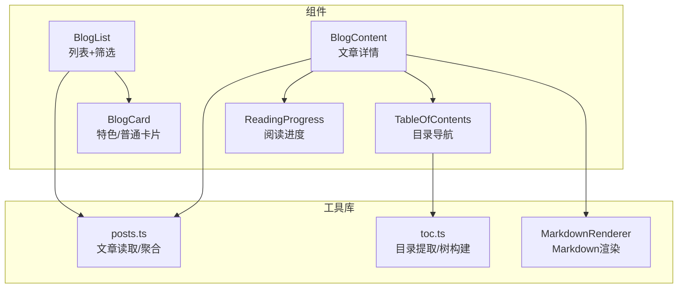
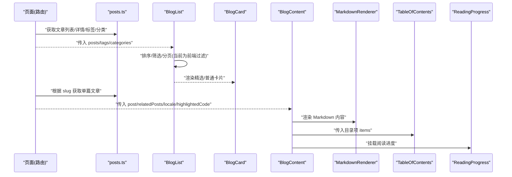
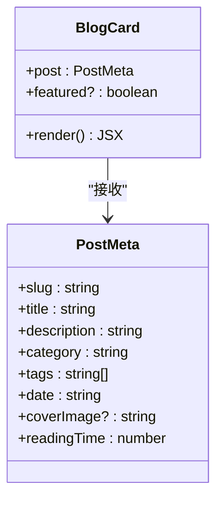
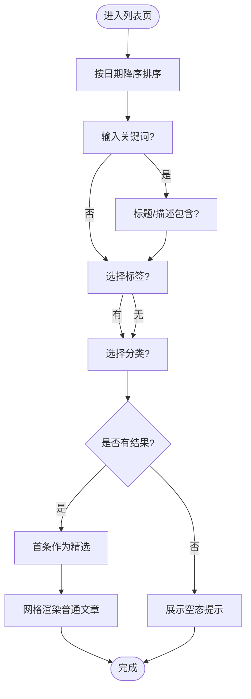
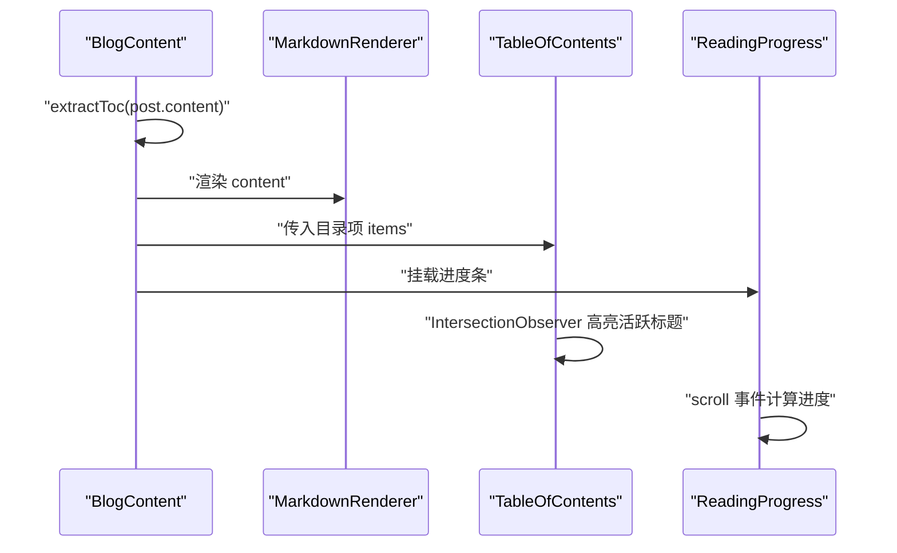
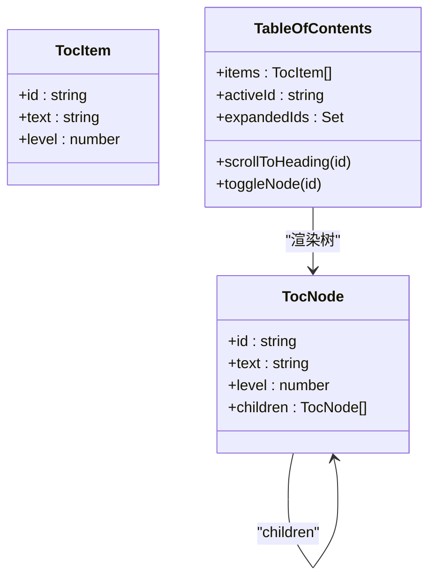
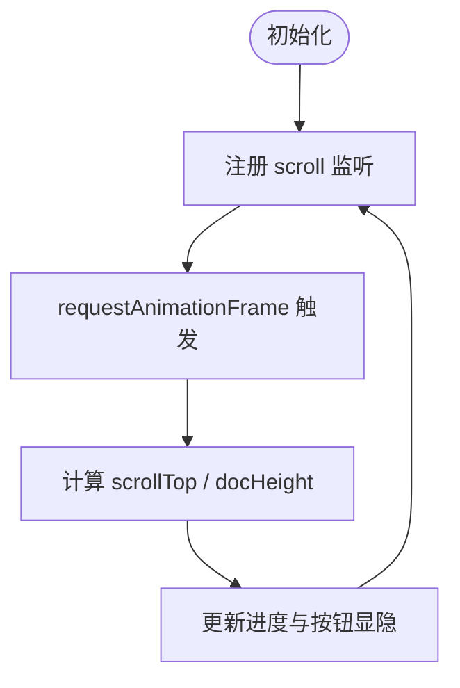
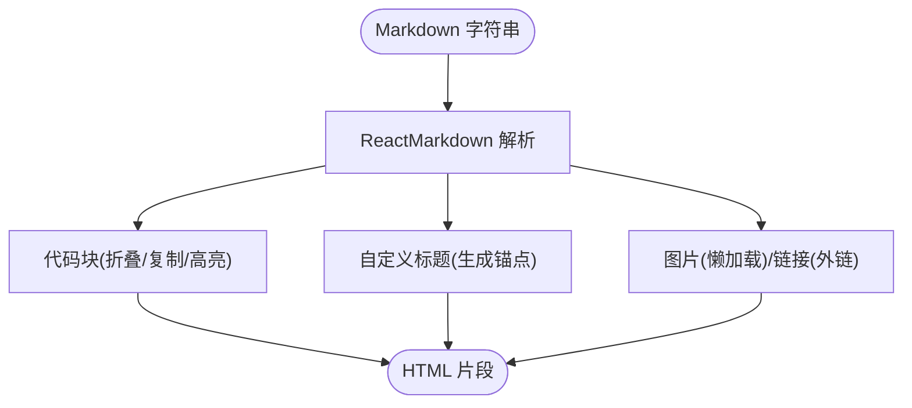
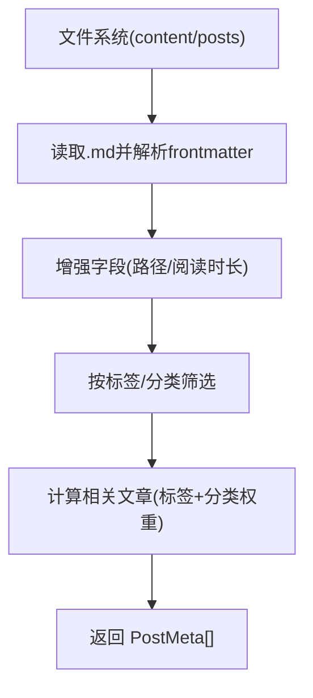
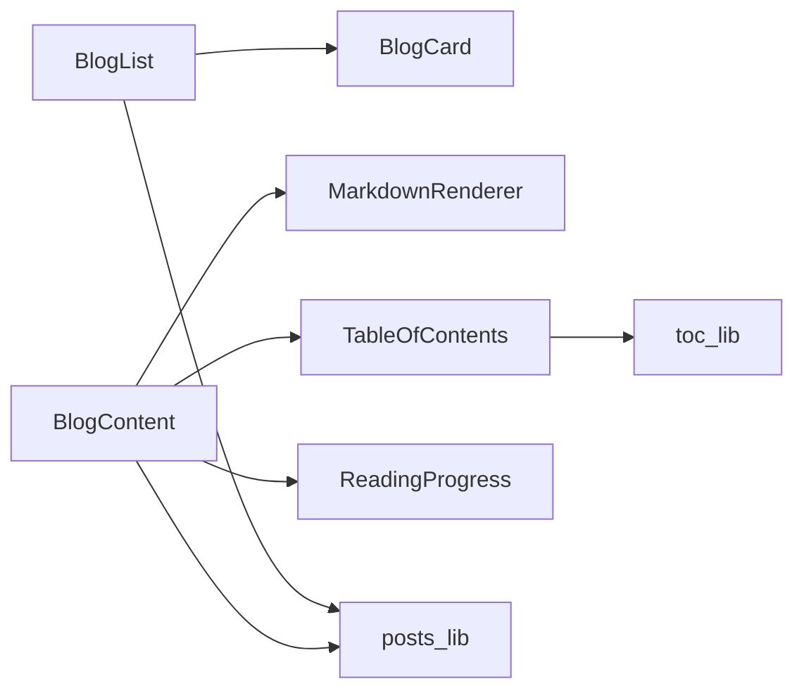

# 博客组件

<cite>
**本文引用的文件**
- [components/blog/blog-card.tsx](file://components/blog/blog-card.tsx)
- [components/blog/blog-list.tsx](file://components/blog/blog-list.tsx)
- [components/blog/blog-content.tsx](file://components/blog/blog-content.tsx)
- [components/blog/reading-progress.tsx](file://components/blog/reading-progress.tsx)
- [components/blog/toc.tsx](file://components/blog/toc.tsx)
- [lib/markdown.tsx](file://lib/markdown.tsx)
- [lib/toc.ts](file://lib/toc.ts)
- [lib/posts.ts](file://lib/posts.ts)
</cite>

## 目录
1. [简介](#简介)
2. [项目结构](#项目结构)
3. [核心组件](#核心组件)
4. [架构总览](#架构总览)
5. [详细组件分析](#详细组件分析)
6. [依赖关系分析](#依赖关系分析)
7. [性能考量](#性能考量)
8. [故障排查指南](#故障排查指南)
9. [结论](#结论)
10. [附录：使用示例与集成建议](#附录使用示例与集成建议)

## 简介
本文件面向博客业务相关的前端组件，系统性梳理并深入解析以下能力：
- 博客卡片组件：特色文章与普通文章的两种布局模式、响应式实现、图片懒加载与悬停效果。
- 博客列表组件：文章数据管理、筛选（搜索、标签、分类）逻辑与展示策略。
- 博客内容组件：Markdown 渲染、代码高亮、目录导航与阅读进度跟踪。
- 组件 Props 接口定义、事件处理机制与国际化支持。
- 实际集成与定制示例，帮助快速落地。

## 项目结构
围绕博客功能的关键文件分布如下：
- 组件层：blog-card、blog-list、blog-content、toc、reading-progress
- 工具与渲染：markdown 渲染器、目录提取与树构建、文章读取与聚合
- 类型与资源：PostMeta/Post 类型由上层导入，图片等资源路径通过工具函数转换

图表来源
- [components/blog/blog-card.tsx:1-156](file://components/blog/blog-card.tsx#L1-L156)
- [components/blog/blog-list.tsx:1-416](file://components/blog/blog-list.tsx#L1-L416)
- [components/blog/blog-content.tsx:1-254](file://components/blog/blog-content.tsx#L1-L254)
- [components/blog/toc.tsx:1-306](file://components/blog/toc.tsx#L1-L306)
- [components/blog/reading-progress.tsx:1-63](file://components/blog/reading-progress.tsx#L1-L63)
- [lib/markdown.tsx:1-318](file://lib/markdown.tsx#L1-L318)
- [lib/toc.ts:1-93](file://lib/toc.ts#L1-L93)
- [lib/posts.ts:1-121](file://lib/posts.ts#L1-L121)

章节来源
- [components/blog/blog-card.tsx:1-156](file://components/blog/blog-card.tsx#L1-L156)
- [components/blog/blog-list.tsx:1-416](file://components/blog/blog-list.tsx#L1-L416)
- [components/blog/blog-content.tsx:1-254](file://components/blog/blog-content.tsx#L1-L254)
- [components/blog/toc.tsx:1-306](file://components/blog/toc.tsx#L1-L306)
- [components/blog/reading-progress.tsx:1-63](file://components/blog/reading-progress.tsx#L1-L63)
- [lib/markdown.tsx:1-318](file://lib/markdown.tsx#L1-L318)
- [lib/toc.ts:1-93](file://lib/toc.ts#L1-L93)
- [lib/posts.ts:1-121](file://lib/posts.ts#L1-L121)

## 核心组件
本节概述各组件职责与交互要点，后续章节将展开细节。

- BlogCard：根据 featured 切换“横图+信息”的特色布局与“竖图/无图”的普通布局；包含标题、描述、分类、日期、阅读时长、标签等元信息；提供悬停缩放与边框高亮动效；图片默认懒加载。
- BlogList：负责文章排序、搜索、标签与分类筛选；首条作为“精选文章”单独展示；其余以网格排列；提供筛选面板与已选条件可视化。
- BlogContent：承载文章正文，集成 Markdown 渲染、代码块折叠与复制、目录侧边栏、阅读进度条、评论与相关文章推荐。
- TableOfContents：基于目录项构建层级树，支持展开/收起、滚动监听高亮、移动端抽屉式目录。
- ReadingProgress：监听滚动计算阅读百分比，显示顶部进度条与回到顶部按钮。
- MarkdownRenderer：基于 ReactMarkdown + GFM，自定义标题锚点、表格、链接、图片懒加载、代码块渲染与高亮注入。
- toc.ts：slugify、extractToc、buildTocTree 三个核心方法，支撑目录生成与树化。
- posts.ts：从文件系统读取文章、计算阅读时长、按标签/分类筛选、计算相关文章。

章节来源
- [components/blog/blog-card.tsx:1-156](file://components/blog/blog-card.tsx#L1-L156)
- [components/blog/blog-list.tsx:1-416](file://components/blog/blog-list.tsx#L1-L416)
- [components/blog/blog-content.tsx:1-254](file://components/blog/blog-content.tsx#L1-L254)
- [components/blog/toc.tsx:1-306](file://components/blog/toc.tsx#L1-L306)
- [components/blog/reading-progress.tsx:1-63](file://components/blog/reading-progress.tsx#L1-L63)
- [lib/markdown.tsx:1-318](file://lib/markdown.tsx#L1-L318)
- [lib/toc.ts:1-93](file://lib/toc.ts#L1-L93)
- [lib/posts.ts:1-121](file://lib/posts.ts#L1-L121)

## 架构总览
下图展示了博客页面到具体组件与工具库的数据流与调用关系。

图表来源
- [lib/posts.ts:1-121](file://lib/posts.ts#L1-L121)
- [components/blog/blog-list.tsx:1-416](file://components/blog/blog-list.tsx#L1-L416)
- [components/blog/blog-card.tsx:1-156](file://components/blog/blog-card.tsx#L1-L156)
- [components/blog/blog-content.tsx:1-254](file://components/blog/blog-content.tsx#L1-L254)
- [lib/markdown.tsx:1-318](file://lib/markdown.tsx#L1-L318)
- [components/blog/toc.tsx:1-306](file://components/blog/toc.tsx#L1-L306)
- [components/blog/reading-progress.tsx:1-63](file://components/blog/reading-progress.tsx#L1-L63)

## 详细组件分析

### 博客卡片组件（BlogCard）
- 布局模式
  - 特色文章（featured=true）：横向布局，左侧图片区（带渐变遮罩），右侧信息区（分类徽章、日期、标题、摘要、标签、阅读时长、“阅读全文”箭头）。
  - 普通文章（featured=false）：竖向布局，可选封面图（带渐变遮罩），紧凑元信息（日期、阅读时长）、标题、摘要、标签。
- 响应式设计
  - 小屏纵向堆叠，大屏分栏（md:flex-row/md:w-1/2）；标题字号、行高、间距随断点调整。
- 图片懒加载与悬停效果
  - 图片使用 loading="lazy" 实现懒加载；悬停时图片 scale 放大、边框/背景色过渡、箭头位移。
- 国际化
  - 使用 next-intl 的 useTranslations("blog") 渲染“阅读全文”等文案。
- 可访问性与语义
  - 使用 article、h2/h3、Badge 等语义化元素；图片 alt 使用文章标题。

图表来源
- [components/blog/blog-card.tsx:1-156](file://components/blog/blog-card.tsx#L1-L156)

章节来源
- [components/blog/blog-card.tsx:1-156](file://components/blog/blog-card.tsx#L1-L156)

### 博客列表组件（BlogList）
- 数据管理
  - 接收 posts/tags/categories，内部对 posts 进行降序排序（最新在前）。
- 筛选逻辑
  - 关键词搜索：匹配标题或描述（大小写不敏感）。
  - 标签筛选：点击标签 Badge 切换选中状态。
  - 分类筛选：桌面端侧边栏与移动端胶囊按钮，点击切换选中分类。
  - 组合筛选：同时生效，结果集取交集。
- 精选文章与网格布局
  - 筛选后第一条作为精选文章（featured），其余以两列网格展示。
- 筛选面板与已选条件
  - 可折叠筛选面板；当存在筛选条件时，在内容上方以“标签式”显示已选项，支持逐个移除与一键清空。
- 空态处理
  - 无结果时展示提示与“清空筛选”按钮。

图表来源
- [components/blog/blog-list.tsx:1-416](file://components/blog/blog-list.tsx#L1-L416)

章节来源
- [components/blog/blog-list.tsx:1-416](file://components/blog/blog-list.tsx#L1-L416)

### 博客内容组件（BlogContent）
- 结构与区域
  - Hero 区：可选封面背景、返回按钮、分类徽章、标题、摘要、作者/日期/阅读时长、标签。
  - 正文区：Markdown 渲染容器，支持表格、引用、链接、图片等。
  - 标签与分类跳转：点击标签跳转到对应筛选 URL；提供“查看更多该分类”入口。
  - 评论：集成 Giscus 评论组件（可选配置）。
  - 相关文章：根据标签与分类相关性评分选取若干文章并以卡片展示。
- 目录导航
  - 通过 extractToc 提取 h1-h3 标题生成目录项，TableOfContents 负责树形展示与滚动高亮。
- 阅读进度
  - 顶部进度条与回到顶部按钮，基于滚动位置计算百分比。
- 国际化
  - 使用 next-intl 的 useTranslations("blog") 渲染“上一篇”“阅读时间”“相关文章”等文案。

图表来源
- [components/blog/blog-content.tsx:1-254](file://components/blog/blog-content.tsx#L1-L254)
- [lib/markdown.tsx:1-318](file://lib/markdown.tsx#L1-L318)
- [components/blog/toc.tsx:1-306](file://components/blog/toc.tsx#L1-L306)
- [components/blog/reading-progress.tsx:1-63](file://components/blog/reading-progress.tsx#L1-L63)

章节来源
- [components/blog/blog-content.tsx:1-254](file://components/blog/blog-content.tsx#L1-L254)

### 目录导航组件（TableOfContents）
- 目录树构建
  - 使用 buildTocTree 将扁平目录项构造成层级树，支持多级嵌套。
- 交互特性
  - 展开/收起：根节点可全部展开/收起；子节点可独立切换。
  - 滚动高亮：IntersectionObserver 观察标题可见性，自动高亮当前所在目录项。
  - 移动端抽屉：小屏下以固定顶部的按钮打开抽屉式目录。
- 可访问性
  - 按钮具备 aria-label；目录项可聚焦并平滑滚动至目标标题。

图表来源
- [components/blog/toc.tsx:1-306](file://components/blog/toc.tsx#L1-L306)
- [lib/toc.ts:1-93](file://lib/toc.ts#L1-L93)

章节来源
- [components/blog/toc.tsx:1-306](file://components/blog/toc.tsx#L1-L306)
- [lib/toc.ts:1-93](file://lib/toc.ts#L1-L93)

### 阅读进度组件（ReadingProgress）
- 进度计算
  - 基于 window.scrollY 与文档高度差计算百分比，限制在 0-100。
- 性能优化
  - 使用 requestAnimationFrame 节流滚动事件，避免频繁重排。
- 交互
  - 超过阈值显示“回到顶部”按钮，点击平滑滚动至顶部。

图表来源
- [components/blog/reading-progress.tsx:1-63](file://components/blog/reading-progress.tsx#L1-L63)

章节来源
- [components/blog/reading-progress.tsx:1-63](file://components/blog/reading-progress.tsx#L1-L63)

### Markdown 渲染器（MarkdownRenderer）
- 基础能力
  - 基于 react-markdown 与 remark-gfm，支持表格、任务列表等扩展语法。
- 标题与锚点
  - 自定义 h1-h4 渲染，自动生成 slug 作为 id，并提供锚点链接。
- 图片与链接
  - 图片启用 lazy 加载；外链在新窗口打开并设置安全属性。
- 代码块
  - 支持折叠（行数大于阈值时）、复制、语言标识；优先注入预高亮的 HTML（Shiki），否则回退为纯文本。
- 内联代码
  - 行内代码样式区分于代码块，保持等宽字体与可读性。

图表来源
- [lib/markdown.tsx:1-318](file://lib/markdown.tsx#L1-L318)

章节来源
- [lib/markdown.tsx:1-318](file://lib/markdown.tsx#L1-L318)

### 文章数据与工具（posts.ts）
- 读取与解析
  - 从 content/posts/{locale} 目录下读取 .md 文件，使用 gray-matter 解析 frontmatter 与正文。
- 字段增强
  - 自动计算阅读时长；统一 coverImage 资源路径。
- 筛选与聚合
  - 提供按标签/分类筛选、去重标签/分类集合、相关文章推荐（基于标签重叠与同分类加权）。
- 排序
  - 默认按 date 降序（最新在前）。

图表来源
- [lib/posts.ts:1-121](file://lib/posts.ts#L1-L121)

章节来源
- [lib/posts.ts:1-121](file://lib/posts.ts#L1-L121)

## 依赖关系分析
- 组件耦合
  - BlogList 依赖 BlogCard 渲染条目；BlogContent 依赖 MarkdownRenderer、TableOfContents、ReadingProgress。
- 工具依赖
  - TableOfContents 依赖 lib/toc 的 extractToc/buildTocTree/slugify。
  - BlogContent 与 BlogList 均可能依赖 lib/posts 提供的数据源。
- 外部依赖
  - next-intl 用于国际化；react-markdown/remark-gfm 用于 Markdown 渲染；lucide-react 图标库。

图表来源
- [components/blog/blog-list.tsx:1-416](file://components/blog/blog-list.tsx#L1-L416)
- [components/blog/blog-card.tsx:1-156](file://components/blog/blog-card.tsx#L1-L156)
- [components/blog/blog-content.tsx:1-254](file://components/blog/blog-content.tsx#L1-L254)
- [lib/markdown.tsx:1-318](file://lib/markdown.tsx#L1-L318)
- [components/blog/toc.tsx:1-306](file://components/blog/toc.tsx#L1-L306)
- [lib/toc.ts:1-93](file://lib/toc.ts#L1-L93)
- [lib/posts.ts:1-121](file://lib/posts.ts#L1-L121)

章节来源
- [components/blog/blog-list.tsx:1-416](file://components/blog/blog-list.tsx#L1-L416)
- [components/blog/blog-card.tsx:1-156](file://components/blog/blog-card.tsx#L1-L156)
- [components/blog/blog-content.tsx:1-254](file://components/blog/blog-content.tsx#L1-L254)
- [lib/markdown.tsx:1-318](file://lib/markdown.tsx#L1-L318)
- [components/blog/toc.tsx:1-306](file://components/blog/toc.tsx#L1-L306)
- [lib/toc.ts:1-93](file://lib/toc.ts#L1-L93)
- [lib/posts.ts:1-121](file://lib/posts.ts#L1-L121)

## 性能考量
- 图片懒加载
  - 卡片与 Markdown 图片均启用 loading="lazy"，减少首屏带宽占用。
- 滚动事件节流
  - 阅读进度使用 requestAnimationFrame 节流，降低主线程压力。
- 目录高亮
  - IntersectionObserver 仅观察必要标题节点，避免全量监听。
- 代码块渲染
  - 长代码块默认折叠，减少 DOM 体积；优先使用预高亮 HTML，避免运行时重复着色。
- 列表筛选
  - 当前为前端内存筛选，适合中小规模数据；若文章量增长，建议引入服务端分页或虚拟列表。

[本节为通用指导，无需源码引用]

## 故障排查指南
- 目录无法高亮
  - 检查标题是否生成了唯一 id；确认 TableOfContents 是否正确订阅 IntersectionObserver。
- 代码块未高亮
  - 确认是否传入了 highlightedCode；若为空则回退为纯文本。
- 图片未懒加载
  - 检查 img 是否设置了 loading="lazy"；确保浏览器支持且未被预加载策略覆盖。
- 筛选无效
  - 核对筛选条件是否为空字符串或 null；确认 tags/category 字段与输入一致。
- 国际化文案缺失
  - 确认 next-intl 配置与 messages 文件中是否存在对应键值。

[本节为通用指导，无需源码引用]

## 结论
博客组件体系围绕“卡片—列表—内容—目录—进度—渲染”形成清晰分层：数据层由 posts.ts 提供，展示层由 BlogList/BlogCard 承担，内容层由 BlogContent 整合 Markdown 渲染、目录与进度，辅以完善的筛选与国际化体验。整体实现兼顾性能与可维护性，便于进一步扩展分页、缓存与主题定制。

[本节为总结性内容，无需源码引用]

## 附录：使用示例与集成建议
- 在列表页中集成
  - 从 posts.ts 获取 posts/tags/categories，传入 BlogList 组件即可展示筛选与网格布局。
- 在详情页中集成
  - 通过 getPostBySlug 获取 post，结合 getRelatedPosts 获取相关文章，传入 BlogContent；按需传入 highlightedCode 与 commentsConfig。
- 定制方向
  - 卡片样式：调整 hover 动画、边框与阴影、标签数量与截断策略。
  - 列表筛选：增加分页或无限滚动；将筛选条件同步到 URL 查询参数以实现可分享链接。
  - 目录导航：调整活跃区间阈值、默认展开层级、移动端抽屉样式。
  - 代码块：接入 Shiki 预高亮流程，完善语言映射与主题变量。
  - 国际化：在 messages 中补充 blog 命名空间下的所有文案键值。

[本节为概念性说明，无需源码引用]