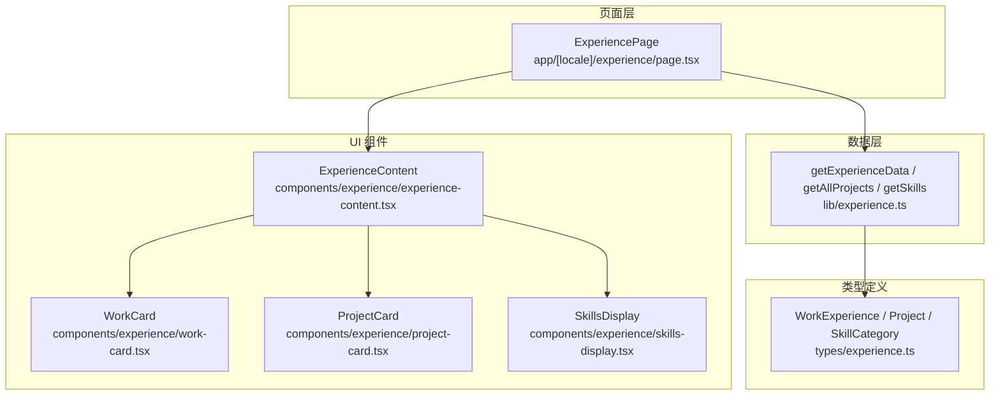
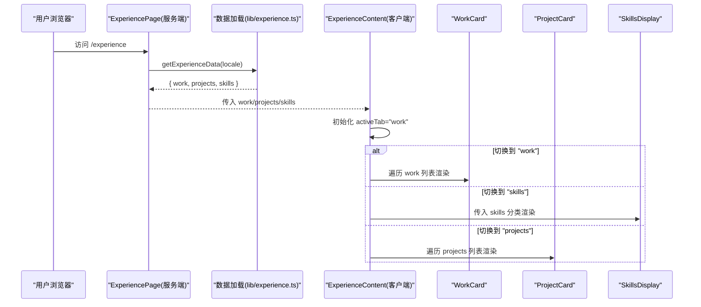
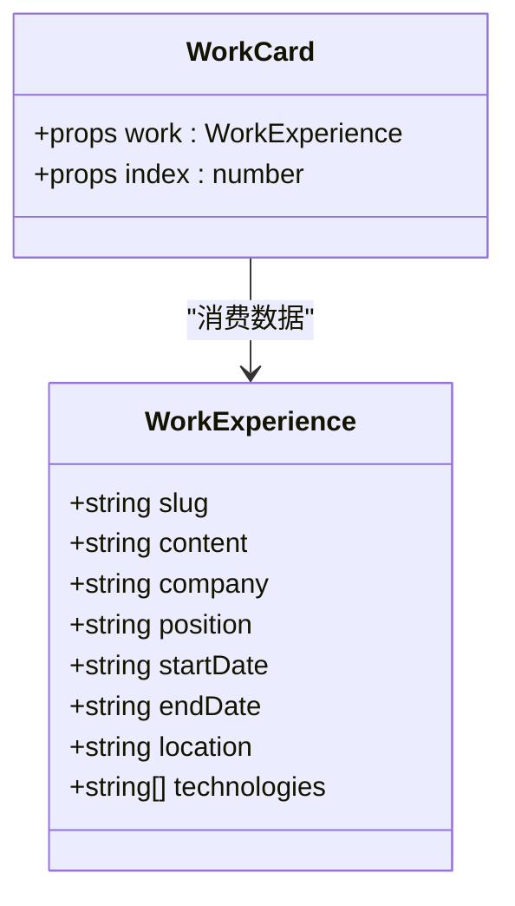
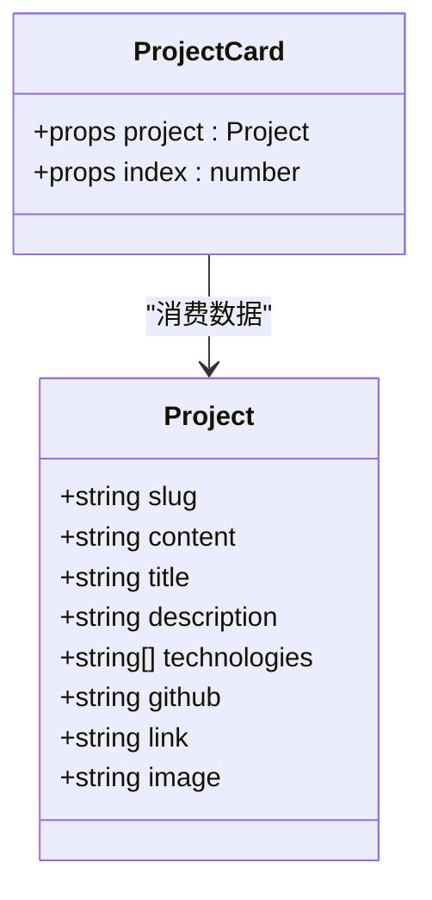
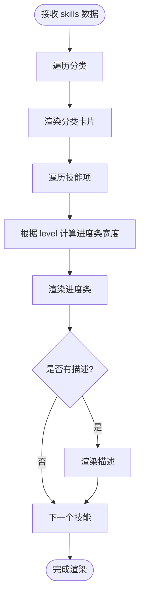
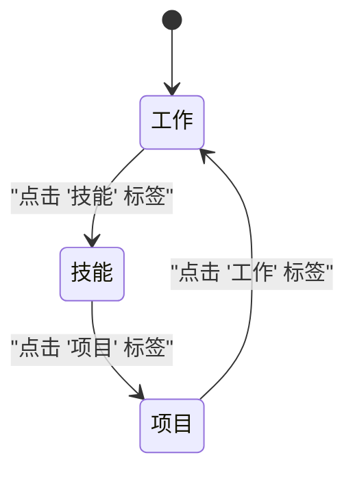
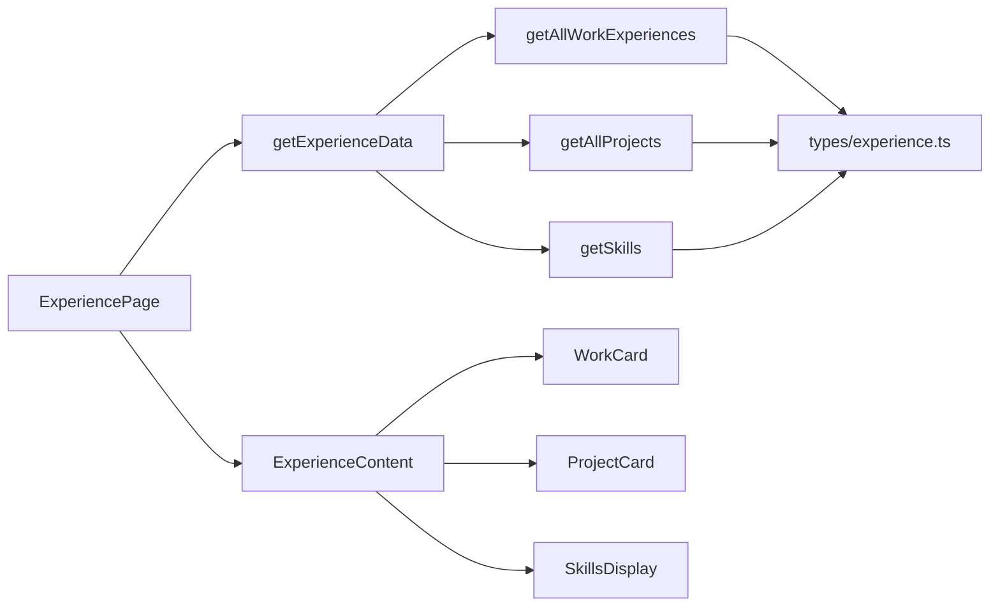

# 经验展示组件

<cite>
**本文引用的文件**   
- [experience-content.tsx](file://components/experience/experience-content.tsx)
- [work-card.tsx](file://components/experience/work-card.tsx)
- [project-card.tsx](file://components/experience/project-card.tsx)
- [skills-display.tsx](file://components/experience/skills-display.tsx)
- [experience.ts](file://lib/experience.ts)
- [page.tsx](file://app/[locale]/experience/page.tsx)
- [experience.ts](file://types/experience.ts)
- [zh.json](file://content/experience/skills/zh.json)
</cite>

## 目录
1. [简介](#简介)
2. [项目结构](#项目结构)
3. [核心组件](#核心组件)
4. [架构总览](#架构总览)
5. [详细组件分析](#详细组件分析)
6. [依赖关系分析](#依赖关系分析)
7. [性能考量](#性能考量)
8. [故障排查指南](#故障排查指南)
9. [结论](#结论)
10. [附录：使用与扩展示例](#附录使用与扩展示例)

## 简介
本文件面向“工作经验展示”相关的前端组件，系统性说明以下能力：
- 工作经历卡片的数据结构、时间线布局与交互效果
- 项目卡片的展示方式、技术栈标签与外部链接跳转
- 技能展示组件的动态渲染、分类显示与可视化进度条
- 经验内容组件如何整合子组件、处理多语言数据与响应式布局
- 状态管理、数据获取模式与错误处理策略
- 实际配置与扩展方法，帮助快速落地和二次开发

## 项目结构
经验展示功能由页面路由、数据加载层、类型定义与多个 UI 组件组成。整体采用“服务端读取 Markdown/JSON → 组装数据 → 客户端组件渲染”的模式，并通过 next-intl 实现多语言文案。

图表来源
- [page.tsx:1-35](file://app/[locale]/experience/page.tsx#L1-L35)
- [experience.ts:141-147](file://lib/experience.ts#L141-L147)
- [experience.ts:1-48](file://types/experience.ts#L1-L48)
- [experience-content.tsx:1-106](file://components/experience/experience-content.tsx#L1-L106)
- [work-card.tsx:1-69](file://components/experience/work-card.tsx#L1-L69)
- [project-card.tsx:1-73](file://components/experience/project-card.tsx#L1-L73)
- [skills-display.tsx:1-51](file://components/experience/skills-display.tsx#L1-L51)

章节来源
- [page.tsx:1-35](file://app/[locale]/experience/page.tsx#L1-L35)
- [experience.ts:1-147](file://lib/experience.ts#L1-L147)
- [experience.ts:1-48](file://types/experience.ts#L1-L48)
- [experience-content.tsx:1-106](file://components/experience/experience-content.tsx#L1-L106)

## 核心组件
- 经验内容容器（ExperienceContent）
  - 负责 Tab 切换（工作/技能/项目）、空态提示、将数据分发到子组件
  - 通过 next-intl 的 useTranslations 提供多语言文案
- 工作经历卡片（WorkCard）
  - 展示职位、公司、起止时间、地点、Markdown 内容与技能标签
  - 当前在职时显示“当前”徽章；支持入场动画延迟
- 项目卡片（ProjectCard）
  - 展示封面图、标题、描述、详细内容、GitHub/外链图标
  - 底部以标签形式展示技术栈
- 技能展示（SkillsDisplay）
  - 按分类渲染卡片，每个技能包含名称、百分比与可选描述
  - 内部封装进度条组件，带过渡动画

章节来源
- [experience-content.tsx:1-106](file://components/experience/experience-content.tsx#L1-L106)
- [work-card.tsx:1-69](file://components/experience/work-card.tsx#L1-L69)
- [project-card.tsx:1-73](file://components/experience/project-card.tsx#L1-L73)
- [skills-display.tsx:1-51](file://components/experience/skills-display.tsx#L1-L51)

## 架构总览
从页面到数据的完整调用链如下：

图表来源
- [page.tsx:25-33](file://app/[locale]/experience/page.tsx#L25-L33)
- [experience.ts:141-147](file://lib/experience.ts#L141-L147)
- [experience-content.tsx:20-103](file://components/experience/experience-content.tsx#L20-L103)

## 详细组件分析

### 工作经历卡片（WorkCard）
- 数据结构
  - 基于 WorkExperience 接口，包含 slug、content、company、position、startDate、endDate、location、technologies 等字段
- 时间线与布局
  - 头部展示职位与公司，若 endDate 为空则标记“当前”
  - 时间区间与地点信息并排展示，支持换行与紧凑排版
- 交互与动效
  - 悬停边框高亮、入场动画延迟随 index 递增
  - 内容区使用 ReactMarkdown 渲染富文本
  - 技术栈以 Badge 标签呈现
- 可访问性与国际化
  - 使用 next-intl 的 t("present") 等文案占位符，便于本地化

图表来源
- [experience.ts:15-18](file://types/experience.ts#L15-L18)
- [work-card.tsx:10-69](file://components/experience/work-card.tsx#L10-L69)

章节来源
- [work-card.tsx:1-69](file://components/experience/work-card.tsx#L1-L69)
- [experience.ts:15-18](file://types/experience.ts#L15-L18)

### 项目卡片（ProjectCard）
- 数据结构
  - 基于 Project 接口，包含 slug、content、title、description、technologies、github、link、image 等字段
- 展示逻辑
  - 可选封面图，悬停缩放动效
  - 标题右侧显示 GitHub 与外部链接图标，点击在新窗口打开
  - 内容区使用 ReactMarkdown 渲染
  - 底部以标签形式展示技术栈
- 交互与动效
  - 卡片悬停边框高亮、入场动画延迟随 index 递增

图表来源
- [experience.ts:34-37](file://types/experience.ts#L34-L37)
- [project-card.tsx:11-73](file://components/experience/project-card.tsx#L11-L73)

章节来源
- [project-card.tsx:1-73](file://components/experience/project-card.tsx#L1-L73)
- [experience.ts:34-37](file://types/experience.ts#L34-L37)

### 技能展示（SkillsDisplay）
- 数据结构
  - 基于 SkillCategory 数组，每项包含 category 与 skills 列表
  - 每个 SkillItem 包含 name、level（0-100）、可选 description
- 动态渲染与可视化
  - 外层网格布局，按分类渲染卡片
  - 内部封装 ProgressBar，根据 level 计算宽度并带动画过渡
  - 支持在技能下方展示简短描述
- 响应式
  - 使用栅格布局在小屏单列、大屏双列

图表来源
- [skills-display.tsx:10-51](file://components/experience/skills-display.tsx#L10-L51)
- [experience.ts:39-48](file://types/experience.ts#L39-L48)

章节来源
- [skills-display.tsx:1-51](file://components/experience/skills-display.tsx#L1-L51)
- [experience.ts:39-48](file://types/experience.ts#L39-L48)

### 经验内容容器（ExperienceContent）
- 状态管理
  - 使用 useState 维护 activeTab（work/skills/projects），默认选中“work”
- 数据分发
  - 根据 activeTab 条件渲染对应子组件
  - 当某类数据为空时，展示友好的空态提示与引导文案
- 多语言
  - 使用 next-intl 的 useTranslations 获取 experience 命名空间下的文案
- 响应式
  - 顶部标题与按钮组自适应换行；项目区采用网格布局

图表来源
- [experience-content.tsx:20-103](file://components/experience/experience-content.tsx#L20-L103)

章节来源
- [experience-content.tsx:1-106](file://components/experience/experience-content.tsx#L1-L106)

## 依赖关系分析
- 页面与服务端数据
  - ExperiencePage 在服务端调用 getExperienceData，按 locale 拉取 work/projects/skills
- 数据层
  - getAllWorkExperiences/getAllProjects 扫描 content/experience 下对应语言的 Markdown，解析 frontmatter 与正文
  - getSkills 读取 JSON，不存在时回退到 en.json
  - 统一返回对象供页面注入组件
- 类型系统
  - types/experience.ts 为所有组件与数据层提供强类型约束，确保前后端一致

图表来源
- [page.tsx:25-33](file://app/[locale]/experience/page.tsx#L25-L33)
- [experience.ts:17-147](file://lib/experience.ts#L17-L147)
- [experience.ts:1-48](file://types/experience.ts#L1-L48)
- [experience-content.tsx:20-103](file://components/experience/experience-content.tsx#L20-L103)

章节来源
- [page.tsx:1-35](file://app/[locale]/experience/page.tsx#L1-L35)
- [experience.ts:1-147](file://lib/experience.ts#L1-L147)
- [experience.ts:1-48](file://types/experience.ts#L1-L48)
- [experience-content.tsx:1-106](file://components/experience/experience-content.tsx#L1-L106)

## 性能考量
- 静态数据预取
  - 页面在服务端一次性读取 Markdown/JSON，减少客户端请求与首屏等待
- 渲染优化
  - 列表渲染使用稳定 key（slug/category/name），避免不必要的重渲染
  - 进度条动画使用 CSS transition，避免 JS 频繁计算
- 资源体积
  - 图片路径通过工具函数规范化，建议按需压缩与懒加载
- 可缓存性
  - 数据来源于文件系统，部署后可被框架缓存，提升构建与运行效率

[本节为通用指导，不直接分析具体文件]

## 故障排查指南
- 中文环境缺少技能或项目数据
  - 检查 content/experience/skills/{locale}.json 是否存在
  - 若缺失，系统将回退到 en.json；确认回退文件存在且格式正确
- Windows 换行符导致 RSC 字节长度不一致
  - 数据层已对 CRLF→LF 进行规范化，避免部署后出现异常
- 空态提示未显示
  - 确认传入的 work/projects/skills 是否为空数组；ExperienceContent 会对空数据进行空态渲染
- 链接无法打开
  - 检查项目卡片中的 github/link 字段是否有效；确保 target="_blank" 与 rel 属性设置正确

章节来源
- [experience.ts:124-137](file://lib/experience.ts#L124-L137)
- [experience.ts:34-35](file://lib/experience.ts#L34-L35)
- [experience-content.tsx:55-99](file://components/experience/experience-content.tsx#L55-L99)
- [project-card.tsx:36-57](file://components/experience/project-card.tsx#L36-L57)

## 结论
经验展示模块通过清晰的分层与类型约束，实现了可维护、可扩展的工作经历、项目与技术栈展示。服务端预取与客户端轻量渲染相结合，兼顾性能与体验。配合 next-intl 的多语言支持与丰富的 UI 组件，能够快速适配不同站点需求。

[本节为总结性内容，不直接分析具体文件]

## 附录：使用与扩展示例
- 新增工作经历
  - 在 content/experience/work/{locale}/ 下新增 .md 文件，填写 frontmatter（type/company/position/startDate/endDate/location/technologies/order 等）
  - 页面会自动读取并按 order 排序展示
- 新增项目
  - 在 content/experience/projects/{locale}/ 下新增 .md 文件，填写 frontmatter（type/title/description/technologies/github/link/image/featured/order 等）
  - 如需作为推荐项目，设置 featured=true
- 更新技能
  - 编辑 content/experience/skills/{locale}.json，按 SkillCategory/SkillItem 结构添加或调整技能与等级
- 扩展多语言
  - 复制现有 zh.json 为其他语言文件，并在页面中通过 locale 参数切换
- 自定义样式与交互
  - 可在 WorkCard/ProjectCard/SkillsDisplay 基础上扩展 hover、tooltip、弹窗等交互
  - 通过 Tailwind 类名或主题变量统一风格

章节来源
- [experience.ts:17-98](file://lib/experience.ts#L17-L98)
- [experience.ts:124-137](file://lib/experience.ts#L124-L137)
- [zh.json:1-102](file://content/experience/skills/zh.json#L1-L102)
- [experience.ts:141-147](file://lib/experience.ts#L141-L147)