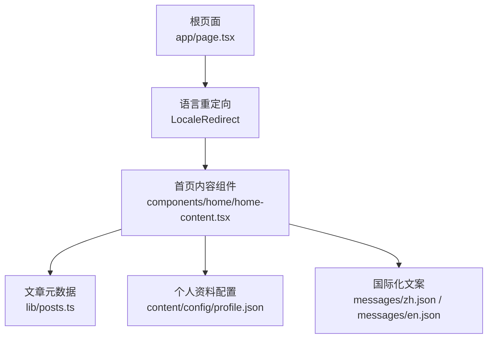
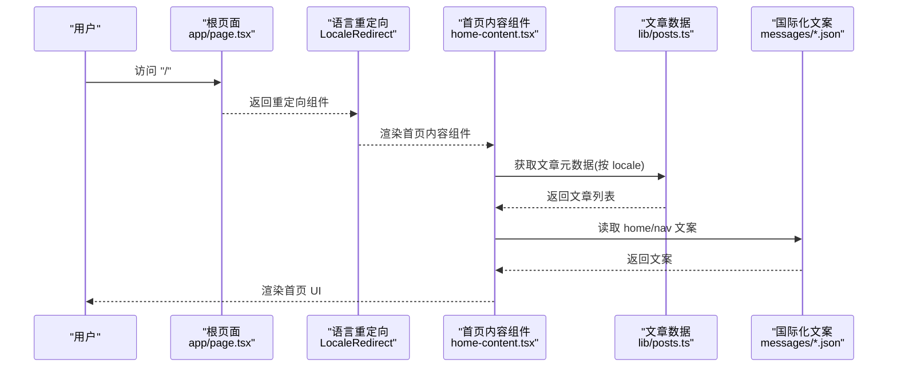
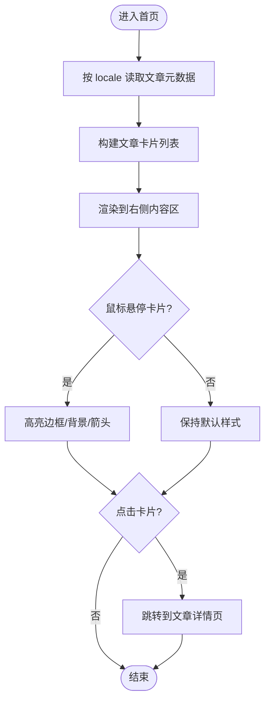
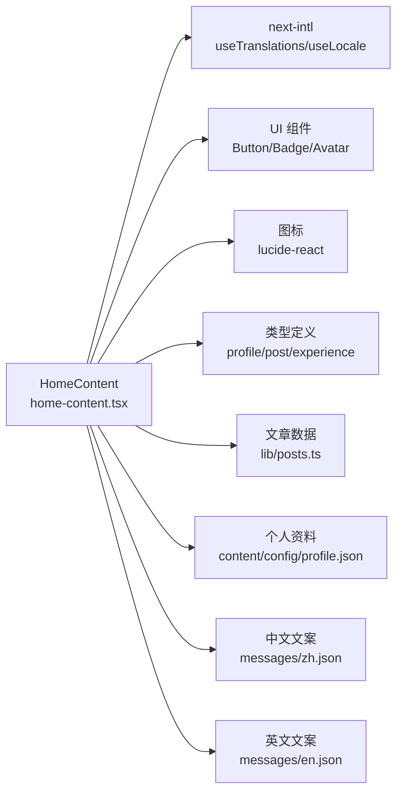

# 首页组件

<cite>
**本文引用的文件**   
- [components/home/home-content.tsx](file://components/home/home-content.tsx)
- [app/page.tsx](file://app/page.tsx)
- [content/config/profile.json](file://content/config/profile.json)
- [lib/posts.ts](file://lib/posts.ts)
- [messages/zh.json](file://messages/zh.json)
- [messages/en.json](file://messages/en.json)
</cite>

## 目录
1. [简介](#简介)
2. [项目结构](#项目结构)
3. [核心组件](#核心组件)
4. [架构总览](#架构总览)
5. [详细组件分析](#详细组件分析)
6. [依赖关系分析](#依赖关系分析)
7. [性能与 SEO](#性能与-seo)
8. [可配置项、主题与多语言](#可配置项主题与多语言)
9. [使用示例与定制指南](#使用示例与定制指南)
10. [故障排查](#故障排查)
11. [结论](#结论)

## 简介
本文件为“首页业务组件”的权威文档，聚焦于首页内容组件的整体布局设计、内容分区与视觉层次；详解英雄区域（Hero）标题动画、副标题打字效果与背景渐变的实现思路；介绍精选文章推荐区域的数据获取、卡片展示与交互；说明快速导航区域的按钮设计与路由跳转；并给出性能优化策略、懒加载机制与 SEO 友好性建议。同时提供可配置选项、主题适配与多语言支持说明，以及实际使用示例，帮助读者快速定制首页内容与布局。

## 项目结构
首页由根页面进行语言重定向，随后渲染“首页内容组件”。该组件采用左右分栏布局：左侧为个人信息与社交链接、右侧为最新文章列表。数据来源于本地 Markdown 文章与 profile 配置。

图表来源
- [app/page.tsx:1-19](file://app/page.tsx#L1-L19)
- [components/home/home-content.tsx:1-261](file://components/home/home-content.tsx#L1-L261)
- [lib/posts.ts:1-121](file://lib/posts.ts#L1-L121)
- [content/config/profile.json:1-66](file://content/config/profile.json#L1-L66)
- [messages/zh.json:1-168](file://messages/zh.json#L1-L168)
- [messages/en.json:1-168](file://messages/en.json#L1-L168)

章节来源
- [app/page.tsx:1-19](file://app/page.tsx#L1-L19)
- [components/home/home-content.tsx:1-261](file://components/home/home-content.tsx#L1-L261)

## 核心组件
- 首页内容组件负责：
  - 左右分栏布局与响应式网格
  - 左侧个人信息区：头像、姓名、职业、位置、简介、统计徽章、社交链接、行动按钮
  - 右侧最新文章区：标题、副标题、“查看全部”入口、文章卡片列表、空状态提示、浏览更多引导
  - 通过 next-intl 切换文案，根据当前 locale 选择对应语言的个人简介
  - 计算技能总数、经验数、文章数等统计信息

章节来源
- [components/home/home-content.tsx:14-26](file://components/home/home-content.tsx#L14-L26)
- [components/home/home-content.tsx:28-189](file://components/home/home-content.tsx#L28-L189)

## 架构总览
首页渲染流程从根页面开始，完成语言重定向后进入首页内容组件。组件内部读取文章元数据与个人资料，结合国际化文案渲染界面。

图表来源
- [app/page.tsx:1-19](file://app/page.tsx#L1-L19)
- [components/home/home-content.tsx:1-261](file://components/home/home-content.tsx#L1-L261)
- [lib/posts.ts:1-121](file://lib/posts.ts#L1-L121)
- [messages/zh.json:1-168](file://messages/zh.json#L1-L168)
- [messages/en.json:1-168](file://messages/en.json#L1-L168)

## 详细组件分析

### 整体布局与视觉层次
- 布局模式：容器 + 网格，桌面端采用固定宽度侧边栏 + 自适应主内容区的两列布局，移动端自动堆叠。
- 视觉层次：
  - 左侧优先展示身份标识（头像、姓名、职业）、定位与简介，辅以统计徽章与社交链接，形成强识别度。
  - 右侧以“最新文章”为焦点，顶部标题与副标题建立内容预期，“查看全部”提供全局入口。
  - 文章卡片采用封面图（可选）、分类标签、日期、阅读时长、标题、摘要与标签组合，层级清晰。

章节来源
- [components/home/home-content.tsx:38-189](file://components/home/home-content.tsx#L38-L189)

### 英雄区域（Hero）
- 现状：当前首页内容组件未包含独立的 Hero 区块，而是将“姓名、职业、简介、位置”等信息置于左侧个人信息区。
- 建议实现要点（概念性指导）：
  - 标题动画：可使用 CSS keyframes 或轻量动画库实现入场动画与逐字显示效果。
  - 副标题打字效果：基于定时器或 Web Animations API 控制光标闪烁与字符追加。
  - 背景渐变：使用 CSS 渐变与动画过渡营造动态氛围，注意在深色/浅色主题下保持对比度。
  - 无障碍：确保动画可被系统减少动效设置关闭，并提供语义化文本。

[本节为概念性说明，不直接分析具体文件]

### 精选文章推荐区域
- 数据获取：
  - 通过文章工具函数按当前语言读取 content/posts/{locale} 下的 Markdown 文件，解析 frontmatter 生成文章元数据，并按发布日期倒序排列。
  - 计算阅读时长，处理封面图片路径。
- 卡片展示：
  - 每条文章卡片包含分类标签、日期、阅读时长、标题、摘要与标签预览。
  - 可选封面图在小屏与大屏下有不同的尺寸与裁剪方式。
- 交互效果：
  - 悬停边框高亮、背景微变、箭头指示位移。
  - 列表项依次淡入，延迟递增，提升节奏感。
  - “查看全部”与“浏览更多”均跳转到博客列表页。

图表来源
- [lib/posts.ts:15-47](file://lib/posts.ts#L15-L47)
- [components/home/home-content.tsx:159-184](file://components/home/home-content.tsx#L159-L184)
- [components/home/home-content.tsx:193-261](file://components/home/home-content.tsx#L193-L261)

章节来源
- [lib/posts.ts:15-47](file://lib/posts.ts#L15-L47)
- [components/home/home-content.tsx:159-184](file://components/home/home-content.tsx#L159-L184)
- [components/home/home-content.tsx:193-261](file://components/home/home-content.tsx#L193-L261)

### 快速导航区域
- 按钮设计：
  - “关于”与“简历”两个主要行动按钮，分别使用默认与描边风格，统一尺寸与间距。
  - 图标与文案对齐，增强可读性与可操作性。
- 路由跳转：
  - 基于当前语言前缀拼接目标路径，如 /{locale}/about、/{locale}/resume。
  - 使用 Next.js Link 组件实现客户端导航。
- 用户引导：
  - 配合“查看全部”与“浏览更多”按钮，形成从首页到博客列表的完整引导链路。

章节来源
- [components/home/home-content.tsx:117-131](file://components/home/home-content.tsx#L117-L131)
- [components/home/home-content.tsx:148-157](file://components/home/home-content.tsx#L148-L157)
- [components/home/home-content.tsx:174-183](file://components/home/home-content.tsx#L174-L183)

## 依赖关系分析
- 组件依赖：
  - 国际化：next-intl 的 useTranslations、useLocale
  - UI 基础组件：Button、Badge、Avatar 等
  - 图标：lucide-react
  - 类型定义：ProfileConfig、PostMeta、Experience 相关类型
- 数据依赖：
  - 文章数据：lib/posts.ts 提供的 getAllPosts 等
  - 个人资料：content/config/profile.json
  - 文案：messages/zh.json、messages/en.json

图表来源
- [components/home/home-content.tsx:1-261](file://components/home/home-content.tsx#L1-L261)
- [lib/posts.ts:1-121](file://lib/posts.ts#L1-L121)
- [content/config/profile.json:1-66](file://content/config/profile.json#L1-L66)
- [messages/zh.json:1-168](file://messages/zh.json#L1-L168)
- [messages/en.json:1-168](file://messages/en.json#L1-L168)

章节来源
- [components/home/home-content.tsx:1-261](file://components/home/home-content.tsx#L1-L261)
- [lib/posts.ts:1-121](file://lib/posts.ts#L1-L121)
- [content/config/profile.json:1-66](file://content/config/profile.json#L1-L66)
- [messages/zh.json:1-168](file://messages/zh.json#L1-L168)
- [messages/en.json:1-168](file://messages/en.json#L1-L168)

## 性能与 SEO
- 性能优化策略
  - 首屏渲染：文章列表仅渲染元数据，避免加载全文内容，降低 DOM 体积。
  - 图片优化：封面图建议使用 Next.js Image 组件进行懒加载与格式转换（按需引入）。
  - 动画与过渡：使用 CSS transition 与关键帧，避免阻塞主线程的重排重绘。
  - 列表渲染：对长列表考虑虚拟滚动（当文章数量较大时）。
- 懒加载机制
  - 图片懒加载：通过 loading="lazy" 或 Next.js Image 的 lazy 行为。
  - 第三方资源：如评论组件可按需加载。
- SEO 友好性
  - 根页面已设置 title、description 与 canonical、alternate languages，利于搜索引擎索引。
  - 文章卡片应保留语义化标签（h1/h2/h3、p、time、a），并确保 alt 文本完善。
  - 结构化数据：可为首页添加 Person/Organization 等 JSON-LD（按需扩展）。

章节来源
- [app/page.tsx:6-14](file://app/page.tsx#L6-L14)
- [components/home/home-content.tsx:193-261](file://components/home/home-content.tsx#L193-L261)

## 可配置项、主题与多语言
- 可配置项
  - 个人资料：content/config/profile.json 中的 personal、social、theme、comments 等字段。
  - 文章元数据：各文章的 frontmatter（标题、分类、标签、封面图、发布时间等）。
- 主题适配
  - 通过 theme.primaryColor、theme.accentColor 等字段驱动主题色（结合 Tailwind 变量或 CSS 自定义属性）。
  - 组件内使用语义化颜色类名，便于跟随主题切换。
- 多语言支持
  - 使用 next-intl 的 useTranslations 与 useLocale 切换文案与语言。
  - 文案键值位于 messages/zh.json 与 messages/en.json 中，home 与 nav 命名空间用于首页与导航文案。
  - 个人简介 bio 支持 en/zh 双语文本，组件根据当前 locale 选择对应版本。

章节来源
- [content/config/profile.json:1-66](file://content/config/profile.json#L1-L66)
- [messages/zh.json:12-29](file://messages/zh.json#L12-L29)
- [messages/en.json:12-29](file://messages/en.json#L12-L29)
- [components/home/home-content.tsx:28-36](file://components/home/home-content.tsx#L28-L36)

## 使用示例与定制指南
- 修改个人信息
  - 编辑 content/config/profile.json 中的 personal.name、personal.profession、personal.bio、personal.location 等字段。
  - 更新 social 数组以添加或删除社交平台链接。
- 调整文章推荐
  - 在 content/posts/{locale} 目录下新增或编辑 Markdown 文件，完善 frontmatter 字段（title、category、tags、date、coverImage 等）。
  - 如需限制首页展示数量，可在组件层面对 posts 数组进行切片处理。
- 定制英雄区域
  - 在组件中添加 Hero 区块，实现标题动画、副标题打字效果与背景渐变（参考“英雄区域”章节的概念性指导）。
- 调整导航按钮
  - 在“快速导航区域”增加新的按钮，使用 Link 组件拼接 /{locale}/xxx 路径，并复用 Button 组件风格。
- 多语言扩展
  - 在 messages/zh.json 与 messages/en.json 中补充 home 与 nav 命名空间的键值，确保组件能正确读取。

章节来源
- [content/config/profile.json:1-66](file://content/config/profile.json#L1-L66)
- [lib/posts.ts:15-47](file://lib/posts.ts#L15-L47)
- [components/home/home-content.tsx:117-131](file://components/home/home-content.tsx#L117-L131)
- [messages/zh.json:12-29](file://messages/zh.json#L12-L29)
- [messages/en.json:12-29](file://messages/en.json#L12-L29)

## 故障排查
- 文章列表为空
  - 检查 content/posts/{locale} 是否存在 .md 文件且 frontmatter 字段完整。
  - 确认 getLanguageAlternates 与站点 URL 配置正确，避免重定向异常。
- 文案未生效
  - 确认 messages/zh.json 与 messages/en.json 中存在对应的 home 与 nav 键值。
  - 检查 useTranslations 的命名空间是否匹配。
- 头像或封面图不显示
  - 确认 profile.json 与文章 frontmatter 中的图片路径有效，必要时使用绝对路径或公共目录。
- 主题色未生效
  - 检查 theme.primaryColor、theme.accentColor 是否与 Tailwind 变量映射一致。

章节来源
- [lib/posts.ts:15-47](file://lib/posts.ts#L15-L47)
- [app/page.tsx:6-14](file://app/page.tsx#L6-L14)
- [content/config/profile.json:1-66](file://content/config/profile.json#L1-L66)
- [messages/zh.json:12-29](file://messages/zh.json#L12-L29)
- [messages/en.json:12-29](file://messages/en.json#L12-L29)

## 结论
首页内容组件通过清晰的左右分栏布局与丰富的信息组织，为用户提供了良好的第一印象与高效的内容发现路径。结合文章元数据与个人资料配置，组件实现了高度可定制化的首页体验。建议在后续迭代中引入 Hero 区域动画与背景渐变，进一步优化首屏吸引力与品牌表达；同时持续完善性能优化与 SEO 策略，以提升用户体验与搜索可见性。