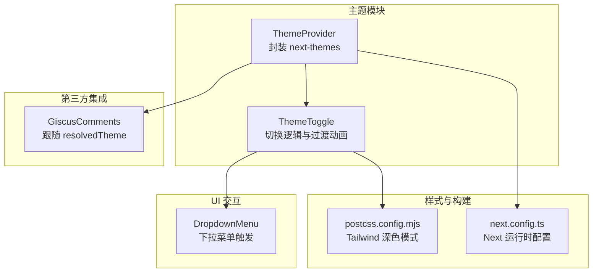
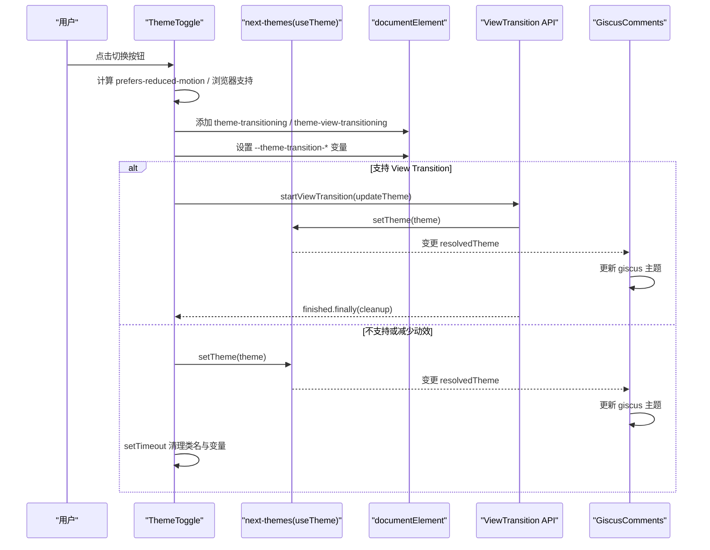
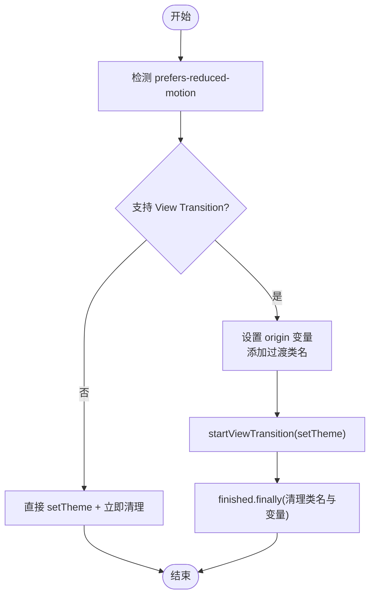
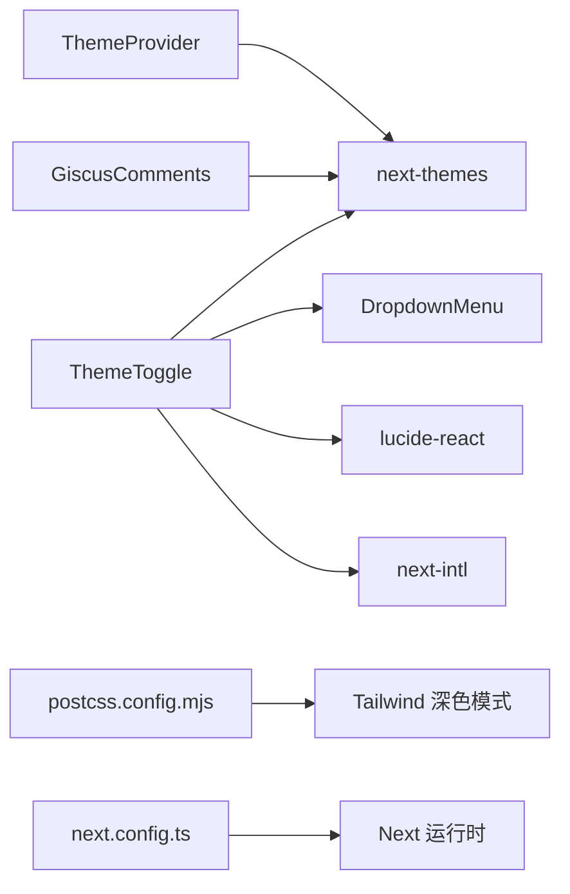

# 主题系统

<cite>
**本文引用的文件**   
- [components/theme/theme-provider.tsx](file://components/theme/theme-provider.tsx)
- [components/theme/theme-toggle.tsx](file://components/theme/theme-toggle.tsx)
- [components/comments/giscus-comments.tsx](file://components/comments/giscus-comments.tsx)
- [postcss.config.mjs](file://postcss.config.mjs)
- [next.config.ts](file://next.config.ts)
</cite>

## 目录
1. [简介](#简介)
2. [项目结构](#项目结构)
3. [核心组件](#核心组件)
4. [架构总览](#架构总览)
5. [详细组件分析](#详细组件分析)
6. [依赖关系分析](#依赖关系分析)
7. [性能与体验优化](#性能与体验优化)
8. [故障排查指南](#故障排查指南)
9. [结论](#结论)
10. [附录：扩展与自定义主题指南](#附录扩展与自定义主题指南)

## 简介
本主题系统基于 next-themes 提供明暗主题切换、状态持久化与系统偏好检测，结合 View Transitions API 实现从右上角出发的圆形扩散过渡动画。通过 CSS 变量与 Tailwind 深色模式协同工作，确保全局样式在主题切换时平滑过渡。同时，第三方评论组件 Giscus 会跟随应用主题同步更新。

## 项目结构
主题相关代码集中在 components/theme 目录下，并与 UI 层（DropdownMenu）及第三方集成（Giscus）协作。Tailwind 的深色模式配置位于 postcss 配置中；Next.js 运行时配置位于 next.config.ts。

图表来源
- [components/theme/theme-provider.tsx:1-11](file://components/theme/theme-provider.tsx#L1-L11)
- [components/theme/theme-toggle.tsx:1-86](file://components/theme/theme-toggle.tsx#L1-L86)
- [components/comments/giscus-comments.tsx:1-46](file://components/comments/giscus-comments.tsx#L1-L46)
- [postcss.config.mjs](file://postcss.config.mjs)
- [next.config.ts](file://next.config.ts)

章节来源
- [components/theme/theme-provider.tsx:1-11](file://components/theme/theme-provider.tsx#L1-L11)
- [components/theme/theme-toggle.tsx:1-86](file://components/theme/theme-toggle.tsx#L1-L86)
- [components/comments/giscus-comments.tsx:1-46](file://components/comments/giscus-comments.tsx#L1-L46)
- [postcss.config.mjs](file://postcss.config.mjs)
- [next.config.ts](file://next.config.ts)

## 核心组件
- ThemeProvider：对 next-themes 的 Provider 进行轻量封装，用于向子树注入主题能力（设置/读取主题、持久化、系统偏好等）。
- ThemeToggle：负责用户交互、主题解析、DOM class 与 CSS 变量更新、View Transition 动画控制，以及调用 setTheme 完成持久化。
- GiscusComments：监听 resolvedTheme 变化，将主题映射到 Giscus 的主题值，保证评论框与站点主题一致。

章节来源
- [components/theme/theme-provider.tsx:1-11](file://components/theme/theme-provider.tsx#L1-L11)
- [components/theme/theme-toggle.tsx:1-86](file://components/theme/theme-toggle.tsx#L1-L86)
- [components/comments/giscus-comments.tsx:1-46](file://components/comments/giscus-comments.tsx#L1-L46)

## 架构总览
整体流程围绕“用户操作 → 主题计算 → DOM 与 CSS 变量更新 → 视图过渡 → 状态持久化”展开。

图表来源
- [components/theme/theme-toggle.tsx:1-86](file://components/theme/theme-toggle.tsx#L1-L86)
- [components/comments/giscus-comments.tsx:1-46](file://components/comments/giscus-comments.tsx#L1-L46)

## 详细组件分析

### ThemeProvider 组件
- 职责：作为 next-themes 的包装器，统一入口暴露给应用根布局使用。
- 关键点：
  - 透传 props 给 NextThemesProvider，便于后续扩展（如默认主题、存储键、属性名等）。
  - 配合 app/layout.tsx 或页面级布局挂载，使 useTheme 可在任意子组件使用。

章节来源
- [components/theme/theme-provider.tsx:1-11](file://components/theme/theme-provider.tsx#L1-L11)

### ThemeToggle 组件
- 职责：处理主题切换的用户交互、系统偏好检测、CSS 变量与类名管理、View Transition 动画、持久化。
- 关键流程：
  - 系统主题检测：根据 prefers-color-scheme 判断系统当前为 dark/light。
  - 类名与 colorScheme：在 documentElement 上移除旧主题类并添加新主题类，同时设置 style.colorScheme 以适配原生控件。
  - 过渡动画：
    - 计算 origin 坐标与半径，写入 CSS 变量 --theme-transition-x/y/radius。
    - 添加 theme-transitioning 与 theme-view-transitioning 类，驱动 CSS 中的过渡效果。
    - 若浏览器支持且未启用减少动效，则使用 View Transition API 包裹 setTheme 更新。
    - 动画结束后清理类名与 CSS 变量。
  - 降级策略：在不支持 View Transition 或用户偏好减少动效时，直接更新主题并通过 setTimeout 清理过渡标记。

图表来源
- [components/theme/theme-toggle.tsx:1-86](file://components/theme/theme-toggle.tsx#L1-L86)

章节来源
- [components/theme/theme-toggle.tsx:1-86](file://components/theme/theme-toggle.tsx#L1-L86)

### GiscusComments 主题同步
- 职责：根据 resolvedTheme 选择 Giscus 主题，保持评论区与站点主题一致。
- 行为：
  - 当 resolvedTheme 为 light/dark 时直接使用；否则回退到配置项或 preferred_color_scheme。
  - 通过 ref 缓存当前主题，避免不必要的重渲染。

章节来源
- [components/comments/giscus-comments.tsx:1-46](file://components/comments/giscus-comments.tsx#L1-L46)

## 依赖关系分析
- 运行时依赖：
  - next-themes：提供 useTheme、setTheme、resolvedTheme、持久化与系统偏好检测。
  - lucide-react：图标资源（太阳、月亮、显示器）。
  - next-intl：国际化文案（主题切换按钮文本）。
  - 本地 UI 组件：DropdownMenu 作为触发容器。
- 构建与样式：
  - Tailwind 深色模式由 postcss.config.mjs 配置。
  - Next.js 运行期配置由 next.config.ts 提供。

图表来源
- [components/theme/theme-toggle.tsx:1-86](file://components/theme/theme-toggle.tsx#L1-L86)
- [components/theme/theme-provider.tsx:1-11](file://components/theme/theme-provider.tsx#L1-L11)
- [components/comments/giscus-comments.tsx:1-46](file://components/comments/giscus-comments.tsx#L1-L46)
- [postcss.config.mjs](file://postcss.config.mjs)
- [next.config.ts](file://next.config.ts)

章节来源
- [components/theme/theme-toggle.tsx:1-86](file://components/theme/theme-toggle.tsx#L1-L86)
- [components/theme/theme-provider.tsx:1-11](file://components/theme/theme-provider.tsx#L1-L11)
- [components/comments/giscus-comments.tsx:1-46](file://components/comments/giscus-comments.tsx#L1-L46)
- [postcss.config.mjs](file://postcss.config.mjs)
- [next.config.ts](file://next.config.ts)

## 性能与体验优化
- 减少动效优先：遵循 prefers-reduced-motion，自动禁用 View Transition 动画，提升可访问性。
- 渐进增强：在不支持 View Transition 的浏览器下回退到即时切换，保障功能可用。
- 最小 DOM 变更：仅切换 documentElement 的类名与少量 CSS 变量，避免大范围重排。
- 颜色方案提示：设置 colorScheme 有助于原生表单控件与滚动条在不同主题下的表现。
- 第三方组件联动：Giscus 随 resolvedTheme 同步，避免主题不一致导致的视觉割裂。

[本节为通用指导，不直接分析具体文件]

## 故障排查指南
- 切换后无动画
  - 检查是否启用了 prefers-reduced-motion 或浏览器不支持 View Transition。
  - 确认 transition 完成后是否正确清理了 theme-transitioning 与 theme-view-transitioning 类名。
- 主题未持久化
  - 确认应用已正确挂载 ThemeProvider，并在需要处使用 useTheme 的 setTheme。
- 评论主题不同步
  - 检查 resolvedTheme 是否为 light/dark，必要时回退到配置项或 preferred_color_scheme。
- Tailwind 深色模式未生效
  - 确认 postcss.config.mjs 中已开启深色模式策略，并确保根元素存在对应的主题类。

章节来源
- [components/theme/theme-toggle.tsx:1-86](file://components/theme/theme-toggle.tsx#L1-L86)
- [components/comments/giscus-comments.tsx:1-46](file://components/comments/giscus-comments.tsx#L1-L46)
- [postcss.config.mjs](file://postcss.config.mjs)

## 结论
该主题系统以 next-themes 为核心，结合 View Transition 与 CSS 变量实现了高性能、可访问的主题切换体验。通过统一的 ThemeProvider 与 ThemeToggle 组件，主题状态在应用中保持一致并可持久化。Tailwind 深色模式与自定义 CSS 变量共同支撑全局样式的一致性。第三方组件（如 Giscus）也能无缝跟随主题变化。

[本节为总结性内容，不直接分析具体文件]

## 附录：扩展与自定义主题指南

### 1. 新增主题变体（例如“高对比度”）
- 在 CSS 中定义新的主题类与变量（例如 .high-contrast），覆盖必要的语义色与背景色。
- 在 ThemeToggle 中扩展可选主题集合，并增加对应切换项。
- 如需持久化，确保 setTheme 能接受新主题名称。

章节来源
- [components/theme/theme-toggle.tsx:1-86](file://components/theme/theme-toggle.tsx#L1-L86)

### 2. 自定义颜色变量与 Tailwind 集成
- 在根样式中声明 CSS 变量（例如 --color-primary、--bg-base 等），并在不同主题类下赋值。
- 在 Tailwind 配置中引入这些变量，以便在组件中使用 tw 类引用。
- 确保深色模式下变量有合适的替代值，以保证可读性与对比度。

章节来源
- [postcss.config.mjs](file://postcss.config.mjs)

### 3. 主题状态持久化与系统偏好
- 使用 next-themes 提供的 setTheme 保存用户选择，并在首次加载时读取系统偏好。
- 在 ThemeProvider 中可传入默认策略（如 system、light、dark）与存储键名。

章节来源
- [components/theme/theme-provider.tsx:1-11](file://components/theme/theme-provider.tsx#L1-L11)
- [components/theme/theme-toggle.tsx:1-86](file://components/theme/theme-toggle.tsx#L1-L86)

### 4. 过渡动画与可访问性
- 使用 View Transition API 实现从右上角出发的圆形扩散效果，并通过 CSS 变量控制 origin 与半径。
- 尊重 prefers-reduced-motion，自动降级为无动画切换。
- 设置 colorScheme 以提升原生控件的主题一致性。

章节来源
- [components/theme/theme-toggle.tsx:1-86](file://components/theme/theme-toggle.tsx#L1-L86)

### 5. 第三方组件主题同步
- 在组件内使用 useTheme 的 resolvedTheme，将其映射到第三方库的主题值。
- 使用 ref 缓存当前主题，避免重复初始化。

章节来源
- [components/comments/giscus-comments.tsx:1-46](file://components/comments/giscus-comments.tsx#L1-L46)

### 6. 示例：添加新主题与样式规则
- 步骤概览：
  - 在 CSS 中为新主题类定义变量与覆盖规则。
  - 在 ThemeToggle 中添加新选项与切换逻辑。
  - 在 Tailwind 配置中注册新变量，供组件使用。
  - 验证持久化与动画效果，确保可访问性。
- 参考路径：
  - 主题切换与动画：[components/theme/theme-toggle.tsx:1-86](file://components/theme/theme-toggle.tsx#L1-L86)
  - 主题上下文封装：[components/theme/theme-provider.tsx:1-11](file://components/theme/theme-provider.tsx#L1-L11)
  - Tailwind 深色模式配置：[postcss.config.mjs](file://postcss.config.mjs)

[本节为实践指南，不直接展示代码内容]