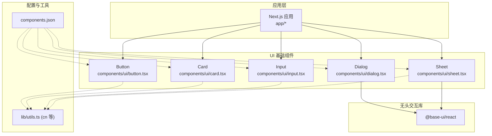
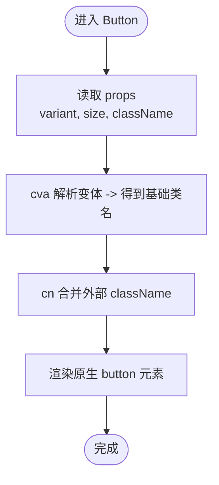
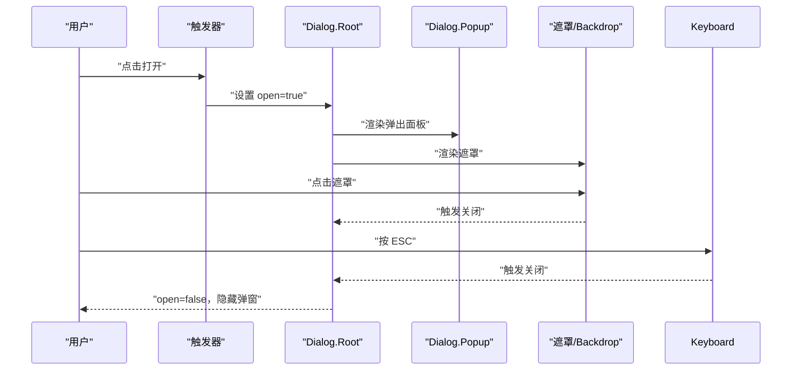
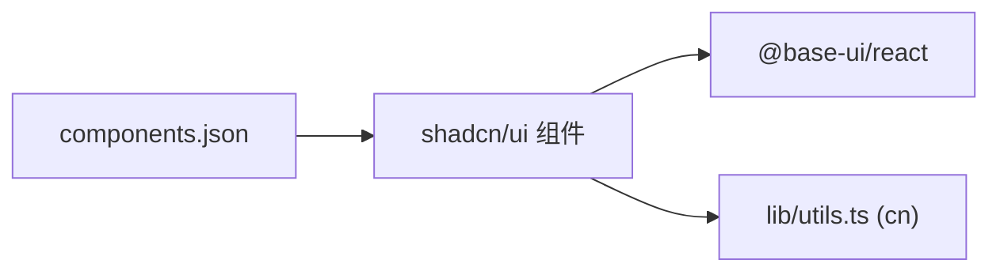

# 基础 UI 组件

<cite>
**本文引用的文件**   
- [components.json](file://components.json)
- [CLAUDE.md](file://CLAUDE.md)
- [AGENTS.md](file://AGENTS.md)
- [components/ui/button.tsx](file://components/ui/button.tsx)
- [components/ui/card.tsx](file://components/ui/card.tsx)
- [components/ui/dialog.tsx](file://components/ui/dialog.tsx)
- [components/ui/input.tsx](file://components/ui/input.tsx)
- [components/ui/sheet.tsx](file://components/ui/sheet.tsx)
</cite>

## 目录
1. [简介](#简介)
2. [项目结构](#项目结构)
3. [核心组件](#核心组件)
4. [架构总览](#架构总览)
5. [详细组件分析](#详细组件分析)
6. [依赖分析](#依赖分析)
7. [性能考虑](#性能考虑)
8. [故障排查指南](#故障排查指南)
9. [结论](#结论)
10. [附录](#附录)

## 简介
本文件面向使用 shadcn/ui 与 @base-ui/react 的基础 UI 组件，聚焦 Button、Card、Dialog、Input 等核心组件的实现原理、样式变体系统（基于 class-variance-authority，简称 cva）、Props 接口设计、事件处理机制与可访问性支持。文档同时提供组件组合模式、样式定制方法与性能优化技巧，并给出在业务组件中复用这些基础组件的实践建议。

## 项目结构
本项目采用 Next.js + Tailwind CSS 的常见前端工程结构，UI 基础组件位于 components/ui 目录，遵循 shadcn/ui 的代码生成约定；底层无头交互由 @base-ui/react 提供，而非 Radix UI。shadcn/ui 的配置通过 components.json 管理，包含路径别名、主题色、CSS 变量等设置。



图表来源
- [components.json:1-25](file://components.json#L1-L25)
- [components/ui/button.tsx](file://components/ui/button.tsx)
- [components/ui/card.tsx](file://components/ui/card.tsx)
- [components/ui/dialog.tsx](file://components/ui/dialog.tsx)
- [components/ui/input.tsx](file://components/ui/input.tsx)
- [components/ui/sheet.tsx:1-55](file://components/ui/sheet.tsx#L1-L55)

章节来源
- [components.json:1-25](file://components.json#L1-L25)
- [CLAUDE.md:108-110](file://CLAUDE.md#L108-L110)
- [AGENTS.md:108-110](file://AGENTS.md#L108-L110)

## 核心组件
本节概述各基础组件的职责与典型用法要点：
- Button：触发操作的可点击元素，通常支持多种尺寸、颜色与禁用态，内部通过 cva 管理样式变体。
- Card：内容容器，用于将相关信息分组展示，常作为复杂页面的子模块。
- Dialog：对话框/模态框，负责焦点管理、遮罩与键盘交互，底层由 @base-ui/react 提供。
- Input：文本输入控件，支持受控与非受控模式、占位符、禁用态等。

章节来源
- [components/ui/button.tsx](file://components/ui/button.tsx)
- [components/ui/card.tsx](file://components/ui/card.tsx)
- [components/ui/dialog.tsx](file://components/ui/dialog.tsx)
- [components/ui/input.tsx](file://components/ui/input.tsx)

## 架构总览
整体架构围绕“无头交互 + 样式封装”展开：@base-ui/react 提供语义化、可访问的无头组件（如 Dialog、Sheet），而 shadcn/ui 在其之上进行样式与行为封装，形成可直接复用的 UI 组件。cva 负责集中管理样式变体（如 size、variant），并通过 cn 工具函数合并类名，实现灵活的样式组合。

```mermaid
classDiagram
class BaseUI {
"+提供无头交互能力<br/>例如 Dialog, Sheet"
}
class ShadcnComponents {
"+Button<br/>+Card<br/>+Dialog<br/>+Input"
}
class CVA {
"+定义变体(size, variant)<br/>+返回 className"
}
class CN {
"+合并类名<br/>处理条件类"
}
ShadcnComponents --> BaseUI : "依赖"
ShadcnComponents --> CVA : "样式变体"
ShadcnComponents --> CN : "类名合并"
```

图表来源
- [CLAUDE.md:108-110](file://CLAUDE.md#L108-L110)
- [AGENTS.md:108-110](file://AGENTS.md#L108-L110)
- [components/ui/button.tsx](file://components/ui/button.tsx)
- [components/ui/dialog.tsx](file://components/ui/dialog.tsx)
- [components/ui/sheet.tsx:1-55](file://components/ui/sheet.tsx#L1-L55)

## 详细组件分析

### Button 组件
- 职责与特性
  - 作为通用触发器，支持不同尺寸与视觉变体，便于统一按钮风格。
  - 通过 cva 定义变体映射，结合 cn 合并外部传入的 className。
  - 暴露常用 props（如 disabled、onClick、type 等），保持与原生 button 一致的行为。
- 样式变体系统（cva）
  - 通过 cva 声明 size、variant 等变体键，为每个键值组合指定 Tailwind 类名集合。
  - 运行时根据 props 选择对应类名，再与外部 className 合并，确保覆盖与扩展能力。
- Props 接口设计
  - 继承或兼容原生 button 属性，保证可预期行为。
  - 新增与样式相关的 props（如 variant、size），并提供默认值。
- 事件处理机制
  - 透传 onClick 等事件到根元素，必要时在内部执行副作用后再调用用户回调。
- 可访问性支持
  - 保留原生 button 的语义与键盘行为；当禁用时正确设置 aria-disabled。
- 组合与定制
  - 可在外层包裹图标或其他元素，利用 className 与样式变体快速定制外观。
- 性能考量
  - 避免不必要的重渲染；对高频点击场景减少闭包创建与状态更新。



图表来源
- [components/ui/button.tsx](file://components/ui/button.tsx)

章节来源
- [components/ui/button.tsx](file://components/ui/button.tsx)

### Card 组件
- 职责与特性
  - 作为信息卡片容器，提供内边距、圆角、阴影等默认样式。
  - 通常由多个子区域组成（头部、主体、底部），便于结构化布局。
- 样式与组合
  - 通过 className 与 Tailwind 类名组合实现灵活定制。
  - 可与 Grid/Flex 布局配合，构建响应式卡片列表。
- 可访问性
  - 使用语义化标签（如 section/article）提升可读性与屏幕阅读器体验。
- 性能
  - 作为纯展示容器，尽量保持无状态，避免引入额外计算。

章节来源
- [components/ui/card.tsx](file://components/ui/card.tsx)

### Dialog 组件
- 职责与特性
  - 提供模态对话框能力，包括遮罩、弹出面板、焦点管理与 ESC 关闭等。
  - 底层使用 @base-ui/react 的 Dialog 原语，确保可访问性与跨浏览器一致性。
- 事件处理
  - 支持打开/关闭回调、遮罩点击关闭、Esc 键关闭等行为。
- 可访问性
  - 自动管理焦点陷阱、aria-modal、role 等属性，符合无障碍标准。
- 组合模式
  - 与 Trigger、Close、Portal 等子组件组合，实现灵活的触发与定位。



图表来源
- [components/ui/dialog.tsx](file://components/ui/dialog.tsx)
- [CLAUDE.md:108-110](file://CLAUDE.md#L108-L110)
- [AGENTS.md:108-110](file://AGENTS.md#L108-L110)

章节来源
- [components/ui/dialog.tsx](file://components/ui/dialog.tsx)
- [CLAUDE.md:108-110](file://CLAUDE.md#L108-L110)
- [AGENTS.md:108-110](file://AGENTS.md#L108-L110)

### Input 组件
- 职责与特性
  - 提供文本输入能力，支持占位符、禁用态、只读等常见属性。
  - 与表单系统集成，支持受控与非受控两种模式。
- 事件处理
  - 透传 onChange、onFocus、onBlur 等事件，便于上层状态同步。
- 可访问性
  - 关联 label（通过 id/for 或 aria-labelledby），提供必要的 aria-* 属性。
- 样式定制
  - 通过 className 与 Tailwind 类名组合，实现边框、圆角、焦点态等定制。

章节来源
- [components/ui/input.tsx](file://components/ui/input.tsx)

### Sheet 组件（侧边抽屉）
- 职责与特性
  - 从指定方向滑出的侧边面板，常用于导航、筛选或辅助操作。
  - 基于 @base-ui/react 的 Dialog 原语，复用其可访问性与交互模型。
- 关键子组件
  - Root/Trigger/Close/Portal/Overlay/Popup 等，分别负责状态、触发、关闭、挂载点、遮罩与弹出内容。
- 样式与动画
  - 通过 data-side 与过渡类名控制位置与动画效果。
- 可访问性
  - 与 Dialog 一致，具备焦点管理与键盘交互。

```mermaid
classDiagram
class SheetRoot {
"+状态管理(open)"
}
class SheetTrigger {
"+触发打开"
}
class SheetClose {
"+触发关闭"
}
class SheetPortal {
"+挂载到 DOM"
}
class SheetOverlay {
"+遮罩层"
}
class SheetPopup {
"+弹出面板"
}
SheetRoot --> SheetTrigger : "提供上下文"
SheetRoot --> SheetClose : "提供上下文"
SheetRoot --> SheetPortal : "使用"
SheetRoot --> SheetOverlay : "使用"
SheetRoot --> SheetPopup : "使用"
```

图表来源
- [components/ui/sheet.tsx:1-55](file://components/ui/sheet.tsx#L1-L55)

章节来源
- [components/ui/sheet.tsx:1-55](file://components/ui/sheet.tsx#L1-L55)

## 依赖分析
- 无头交互库
  - 项目明确使用 @base-ui/react 作为 shadcn 组件的无头原语库，而非 Radix UI。Dialog、Sheet、Tooltip 等均导入自 @base-ui/react。
- 样式与工具
  - 通过 components.json 配置 shadcn/ui 的样式风格、路径别名与 CSS 变量。
  - 组件普遍使用 lib/utils.ts 中的 cn 工具函数合并类名，结合 Tailwind 实现样式组合。
- 组件耦合关系
  - 基础组件之间低耦合，主要依赖无头库与样式工具；业务组件通过组合基础组件实现功能。



图表来源
- [CLAUDE.md:108-110](file://CLAUDE.md#L108-L110)
- [AGENTS.md:108-110](file://AGENTS.md#L108-L110)
- [components.json:1-25](file://components.json#L1-L25)

章节来源
- [CLAUDE.md:108-110](file://CLAUDE.md#L108-L110)
- [AGENTS.md:108-110](file://AGENTS.md#L108-L110)
- [components.json:1-25](file://components.json#L1-L25)

## 性能考虑
- 避免过度渲染
  - 对于频繁触发的组件（如 Button），尽量减少闭包与状态更新，必要时使用 React.memo 或 useMemo/useCallback 优化。
- 延迟加载与按需渲染
  - 对 Dialog/Sheet 等大体积内容，可采用懒加载或仅在需要时渲染，降低首屏开销。
- 样式合并成本
  - 合理使用 cva 与 cn，避免在每次渲染时构造复杂的类名字符串；将静态类名提升到常量。
- 事件处理
  - 在高频事件中避免昂贵计算，必要时节流/防抖。

[本节为通用指导，不直接分析具体文件]

## 故障排查指南
- 无法找到 @base-ui/react 相关组件
  - 确认已安装依赖，且组件导入路径指向 @base-ui/react 而非 Radix UI。
- 样式未生效或冲突
  - 检查 components.json 的样式风格与 CSS 变量配置；确认 Tailwind 已正确扫描组件路径。
  - 使用浏览器开发者工具查看最终类名，确认 cn 合并结果是否符合预期。
- 可访问性问题
  - 验证 Dialog/Sheet 的焦点管理是否正常工作，ESC 与遮罩点击是否能正确关闭。
  - 检查 Input 的 label 关联与 aria-* 属性是否正确设置。

章节来源
- [CLAUDE.md:108-110](file://CLAUDE.md#L108-L110)
- [AGENTS.md:108-110](file://AGENTS.md#L108-L110)
- [components.json:1-25](file://components.json#L1-L25)

## 结论
本项目以 @base-ui/react 为无头交互基础，结合 shadcn/ui 的样式封装与 cva 的变体系统，构建了可复用、可定制、可访问的基础 UI 组件集。通过清晰的组件职责划分与组合模式，业务组件可以高效复用这些基础能力，并在样式与交互上获得一致的体验。建议在后续迭代中持续完善组件文档与测试用例，进一步提升可维护性与稳定性。

[本节为总结性内容，不直接分析具体文件]

## 附录
- 组件组合示例（思路）
  - 在业务页面中使用 Card 组织内容，内部嵌套 Button 触发操作，使用 Dialog 展示详情或确认提示。
  - 使用 Sheet 作为侧边栏，集成筛选与导航功能，通过 Trigger 与 Close 控制显示与隐藏。
- 样式定制方法
  - 通过 cva 新增变体键（如 color、shape），在组件内部解析并合并到根元素类名。
  - 使用 Tailwind 的任意值语法与 CSS 变量，实现主题化与动态切换。
- 可访问性清单
  - 确保所有交互元素具备正确的 role、aria-* 属性与键盘支持。
  - 对动态内容变化提供 aria-live 或合适的更新策略。

[本节为概念性补充，不直接分析具体文件]