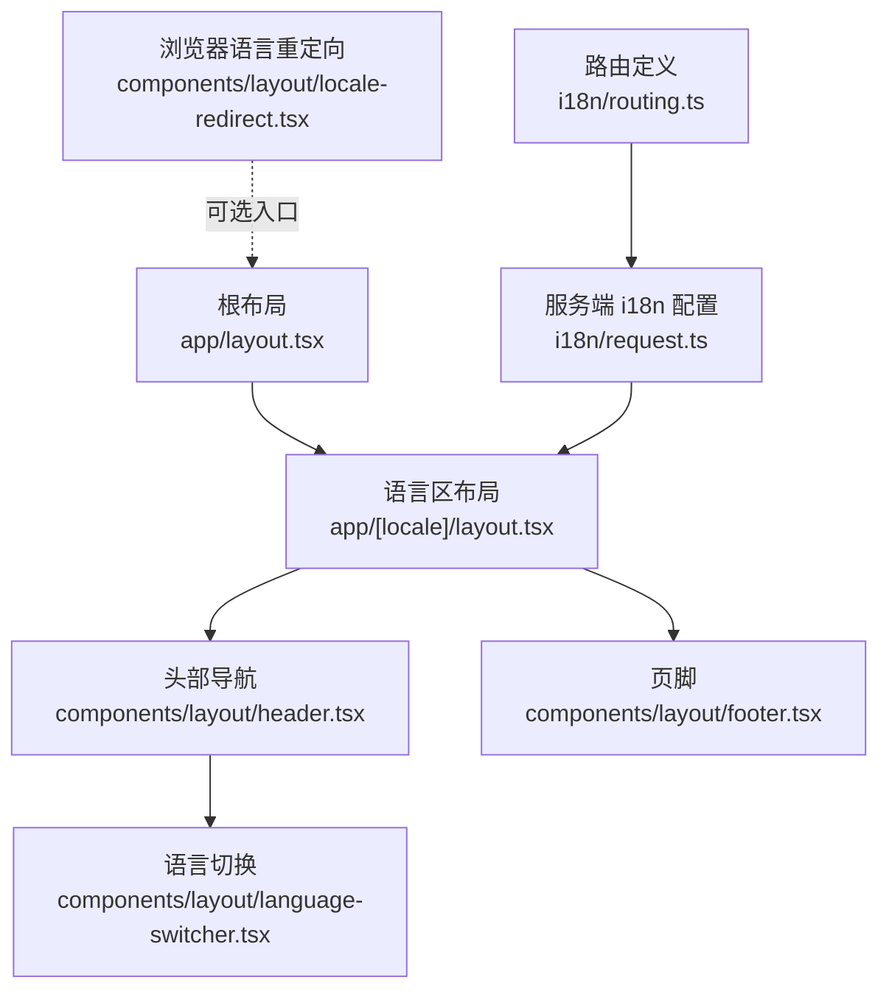
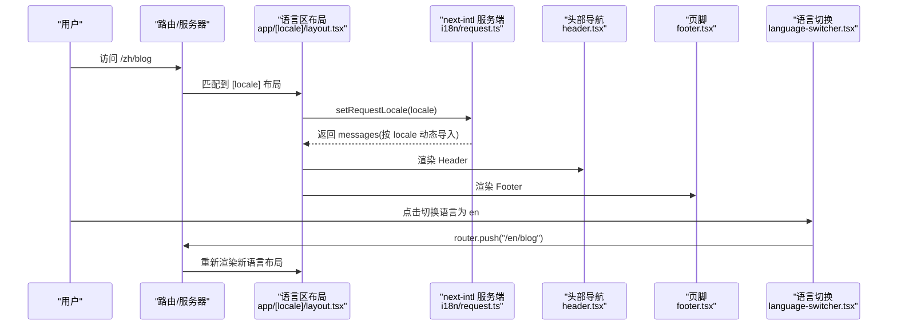
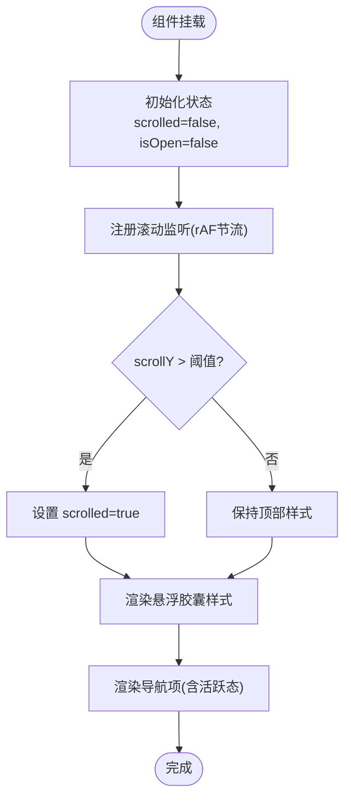
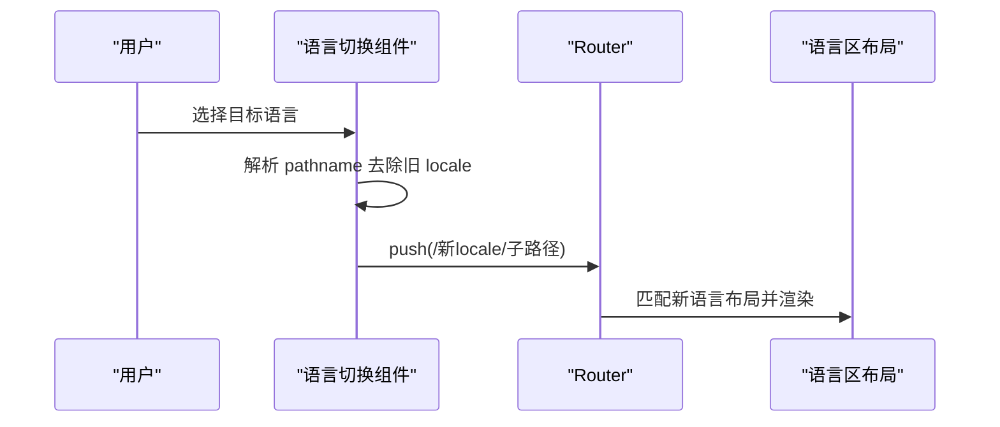
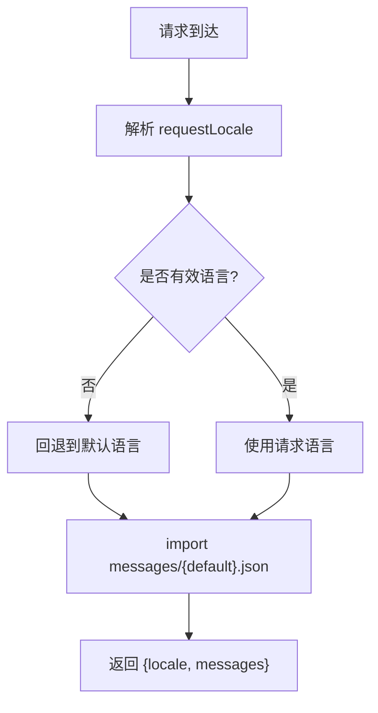
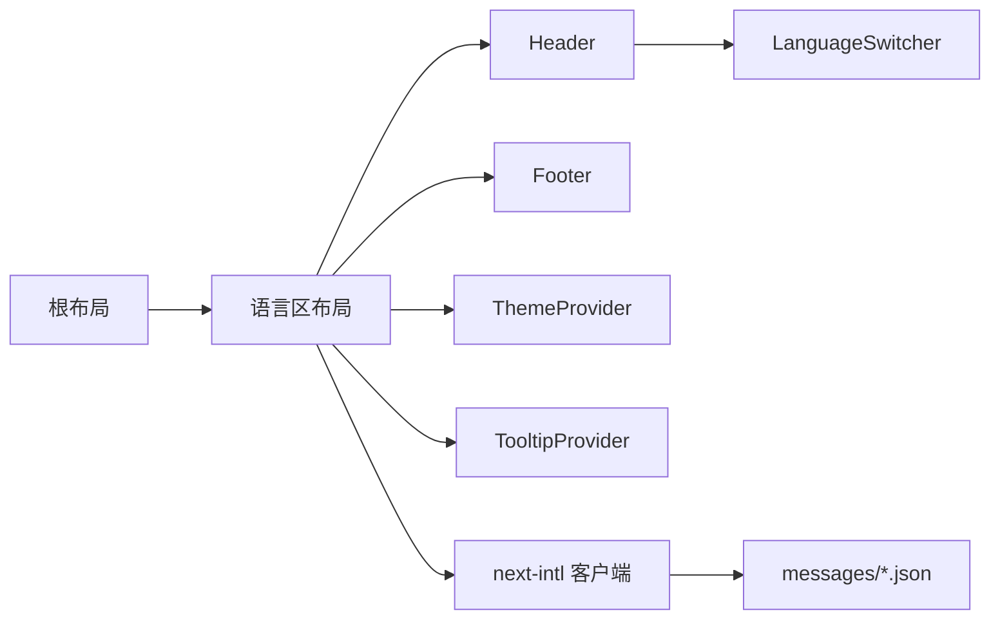

# 布局组件

<cite>
**本文引用的文件**
- [app/layout.tsx](file://app/layout.tsx)
- [app/[locale]/layout.tsx](file://app/[locale]/layout.tsx)
- [components/layout/header.tsx](file://components/layout/header.tsx)
- [components/layout/footer.tsx](file://components/layout/footer.tsx)
- [components/layout/language-switcher.tsx](file://components/layout/language-switcher.tsx)
- [components/layout/locale-redirect.tsx](file://components/layout/locale-redirect.tsx)
- [i18n/request.ts](file://i18n/request.ts)
- [i18n/routing.ts](file://i18n/routing.ts)
</cite>

## 目录
1. [简介](#简介)
2. [项目结构](#项目结构)
3. [核心组件](#核心组件)
4. [架构总览](#架构总览)
5. [详细组件分析](#详细组件分析)
6. [依赖关系分析](#依赖关系分析)
7. [性能考虑](#性能考虑)
8. [故障排查指南](#故障排查指南)
9. [结论](#结论)
10. [附录](#附录)

## 简介
本文件聚焦于 Next.js App Router 下的全局布局与国际化布局实现，系统性解析根布局、语言区布局、头部导航、页脚、语言切换与路由重定向等关键组件的设计模式与数据流。文档同时覆盖响应式布局策略、国际化处理流程、性能优化技巧（代码分割与懒加载），并提供自定义布局模板的实践示例路径，帮助读者快速搭建可维护、可扩展的站点级布局体系。

## 项目结构
本项目采用“根布局 + 语言区布局”的分层组织方式：
- 根布局负责 HTML 骨架、字体注入、SEO 元信息、全局样式与主题上下文。
- 语言区布局负责 next-intl 客户端提供者、JSON-LD 注入、主题与提示框提供器、以及 Header/Footer 包裹。
- 页面级布局通过嵌套在 [locale] 下的 layout.tsx 进一步组合业务区域。

图示来源
- [app/layout.tsx:1-114](file://app/layout.tsx#L1-L114)
- [app/[locale]/layout.tsx:1-64](file://app/[locale]/layout.tsx#L1-L64)
- [components/layout/header.tsx:1-270](file://components/layout/header.tsx#L1-L270)
- [components/layout/footer.tsx:1-81](file://components/layout/footer.tsx#L1-L81)
- [components/layout/language-switcher.tsx:1-53](file://components/layout/language-switcher.tsx#L1-L53)
- [components/layout/locale-redirect.tsx:1-19](file://components/layout/locale-redirect.tsx#L1-L19)
- [i18n/request.ts:1-15](file://i18n/request.ts#L1-L15)
- [i18n/routing.ts:1-6](file://i18n/routing.ts#L1-L6)

章节来源
- [app/layout.tsx:1-114](file://app/layout.tsx#L1-L114)
- [app/[locale]/layout.tsx:1-64](file://app/[locale]/layout.tsx#L1-L64)

## 核心组件
- 根布局 app/layout.tsx
  - 职责：设置 html/body 基础类名、注入 Google 字体变量、声明全局 SEO 元信息、引入全局样式。
  - 关键点：根据 locale 参数动态设置 html.lang；使用 CSS 变量驱动主题与字体。
- 语言区布局 app/[locale]/layout.tsx
  - 职责：校验并启用 next-intl 请求语言、注入 JSON-LD、提供 ThemeProvider/TooltipProvider、渲染 Header/main/Footer。
  - 关键点：generateStaticParams 预生成多语言静态参数；setRequestLocale 开启静态渲染；messages 由服务端按需加载。
- 头部导航 components/layout/header.tsx
  - 职责：展示品牌、桌面/移动端导航、语言切换、主题切换、RSS 入口；滚动时从顶部条变为悬浮胶囊。
  - 关键点：usePathname 计算当前激活项；useLocale 拼接带语言的 href；rAF 节流滚动事件；Sheet 抽屉菜单。
- 页脚 components/layout/footer.tsx
  - 职责：品牌信息、快捷导航、社交链接、版权信息。
  - 关键点：基于 profile 配置渲染社交图标；使用 next-intl 文案。
- 语言切换 components/layout/language-switcher.tsx
  - 职责：下拉选择目标语言，按当前 pathname 替换前缀进行客户端跳转。
  - 关键点：router.push 执行客户端导航；保留子路径不变。
- 浏览器语言重定向 components/layout/locale-redirect.tsx
  - 职责：读取 navigator.language，将用户重定向到 /zh 或 /en。
  - 关键点：window.location.replace 避免历史堆积；支持 NEXT_PUBLIC_BASE_PATH。

章节来源
- [app/layout.tsx:1-114](file://app/layout.tsx#L1-L114)
- [app/[locale]/layout.tsx:1-64](file://app/[locale]/layout.tsx#L1-L64)
- [components/layout/header.tsx:1-270](file://components/layout/header.tsx#L1-L270)
- [components/layout/footer.tsx:1-81](file://components/layout/footer.tsx#L1-L81)
- [components/layout/language-switcher.tsx:1-53](file://components/layout/language-switcher.tsx#L1-L53)
- [components/layout/locale-redirect.tsx:1-19](file://components/layout/locale-redirect.tsx#L1-L19)

## 架构总览
下图展示了从请求进入、语言解析、布局渲染到交互的关键流程。

图示来源
- [app/[locale]/layout.tsx:1-64](file://app/[locale]/layout.tsx#L1-L64)
- [i18n/request.ts:1-15](file://i18n/request.ts#L1-L15)
- [components/layout/header.tsx:1-270](file://components/layout/header.tsx#L1-L270)
- [components/layout/footer.tsx:1-81](file://components/layout/footer.tsx#L1-L81)
- [components/layout/language-switcher.tsx:1-53](file://components/layout/language-switcher.tsx#L1-L53)

## 详细组件分析

### 根布局（Root Layout）
- 设计要点
  - 全局 SEO：title 模板、OpenGraph/Twitter 卡片、RSS alternates、robots、formatDetection。
  - 字体与样式：注入 Geist Sans/Mono 的 CSS 变量，统一 antialiased 与最小高度。
  - 国际化基础：根据 params.locale 设置 html.lang。
- 数据流
  - 接收 Promise<params>，await 获取 locale，映射为 html lang。
- 扩展建议
  - 可在根布局中注入全局 Provider（如 analytics、feature flags）。
  - 若需 SSR 下首屏 SEO 更丰富，可将部分 metadata 下沉至页面级。

章节来源
- [app/layout.tsx:1-114](file://app/layout.tsx#L1-L114)

### 语言区布局（Locale Layout）
- 设计要点
  - 静态参数：generateStaticParams 枚举 locales，便于预渲染。
  - 语言校验：不在 routing.locales 中的语言直接 notFound。
  - 客户端 i18n：NextIntlClientProvider 注入 messages。
  - 结构化数据：注入 website Json-Ld。
  - UI 容器：ThemeProvider + TooltipProvider + 主内容区 main。
- 数据流
  - 服务端：setRequestLocale + getMessages 按需加载 messages.json。
  - 客户端：Header/Footer 通过 useTranslations/useLocale 消费上下文。
- 扩展建议
  - 可按模块拆分 providers（如仅对特定路由注入第三方 SDK）。
  - 可在该层集中处理错误边界与加载态骨架。

章节来源
- [app/[locale]/layout.tsx:1-64](file://app/[locale]/layout.tsx#L1-L64)
- [i18n/request.ts:1-15](file://i18n/request.ts#L1-L15)
- [i18n/routing.ts:1-6](file://i18n/routing.ts#L1-L6)

### 头部导航（Header）
- 设计要点
  - 响应式：桌面端水平导航，移动端 Sheet 抽屉菜单。
  - 活跃状态：基于 usePathname 与当前 locale 判断高亮。
  - 滚动形态：rAF 节流监听 scrollY，超过阈值切换为悬浮胶囊样式。
  - 国际化：所有文案来自 useTranslations("nav")。
  - 功能入口：语言切换、主题切换、RSS。
- 交互流程
  - 点击菜单项：Link 携带 /{locale} 前缀进行客户端导航。
  - 打开/关闭抽屉：SheetTrigger 控制 isOpen。
- 性能细节
  - 滚动事件使用 passive + rAF 节流，避免频繁 reflow。
  - 图标与文案按需渲染，减少不必要的 DOM 更新。

图示来源
- [components/layout/header.tsx:1-270](file://components/layout/header.tsx#L1-L270)

章节来源
- [components/layout/header.tsx:1-270](file://components/layout/header.tsx#L1-L270)

### 页脚（Footer）
- 设计要点
  - 三列网格：品牌、导航、社交；移动端自动堆叠。
  - 数据来源：profile 配置（名称、Logo、社交链接）。
  - 文案国际化：footer 命名空间。
- 扩展建议
  - 可增加“最近文章”、“订阅邮箱”等区块。
  - 社交图标可通过 lazy 加载外部脚本，降低首屏体积。

章节来源
- [components/layout/footer.tsx:1-81](file://components/layout/footer.tsx#L1-L81)

### 语言切换（Language Switcher）
- 设计要点
  - 下拉菜单：DropdownMenu 触发与选项。
  - 路由重写：移除原 locale 前缀后拼接新 locale，保留子路径。
  - 客户端跳转：router.push 执行无刷新导航。
- 行为说明
  - 当前语言选项高亮显示。
  - 切换后由语言区布局重新渲染对应语言内容。

图示来源
- [components/layout/language-switcher.tsx:1-53](file://components/layout/language-switcher.tsx#L1-L53)
- [app/[locale]/layout.tsx:1-64](file://app/[locale]/layout.tsx#L1-L64)

章节来源
- [components/layout/language-switcher.tsx:1-53](file://components/layout/language-switcher.tsx#L1-L53)

### 浏览器语言重定向（Locale Redirect）
- 设计要点
  - 读取 navigator.language，优先 zh 否则 en。
  - window.location.replace 跳转到 /zh 或 /en，避免历史记录污染。
  - 支持 NEXT_PUBLIC_BASE_PATH 前缀。
- 使用场景
  - 作为站点默认入口，引导用户进入正确语言路由。

章节来源
- [components/layout/locale-redirect.tsx:1-19](file://components/layout/locale-redirect.tsx#L1-L19)

### 国际化服务（i18n）
- 路由定义
  - 支持 en/zh，默认 en。
- 服务端请求配置
  - 未识别语言回退到默认语言。
  - 按 locale 动态 import messages/{locale}.json，实现消息包按需加载。

图示来源
- [i18n/routing.ts:1-6](file://i18n/routing.ts#L1-L6)
- [i18n/request.ts:1-15](file://i18n/request.ts#L1-L15)

章节来源
- [i18n/routing.ts:1-6](file://i18n/routing.ts#L1-L6)
- [i18n/request.ts:1-15](file://i18n/request.ts#L1-L15)

## 依赖关系分析
- 组件耦合
  - 语言区布局依赖 next-intl 服务端/客户端能力、主题与提示框提供器、Header/Footer。
  - Header 依赖 next-intl 文案、next/navigation、UI 组件库（Sheet/DropdownMenu 等）。
  - LanguageSwitcher 依赖 next/navigation 进行客户端路由跳转。
- 外部依赖
  - next-intl：多语言路由与消息加载。
  - lucide-react：图标资源。
  - Tailwind 类名：响应式与动画。
- 潜在循环
  - 当前布局与组件间单向依赖，未发现循环引用。

图示来源
- [app/layout.tsx:1-114](file://app/layout.tsx#L1-L114)
- [app/[locale]/layout.tsx:1-64](file://app/[locale]/layout.tsx#L1-L64)
- [components/layout/header.tsx:1-270](file://components/layout/header.tsx#L1-L270)
- [components/layout/footer.tsx:1-81](file://components/layout/footer.tsx#L1-L81)
- [components/layout/language-switcher.tsx:1-53](file://components/layout/language-switcher.tsx#L1-L53)

## 性能考虑
- 代码分割与按需加载
  - 语言消息：i18n/request.ts 使用动态 import 按语言加载 messages，天然具备代码分割效果。
  - 第三方 SDK：建议在非首屏需要的地方使用 dynamic import() 或 React.lazy 延迟加载。
- 首屏优化
  - 根布局只注入必要字体与全局样式，避免大体积 CSS 阻塞。
  - Header 滚动监听使用 rAF 节流与 passive 事件，减少重排重绘。
- 图片与媒体
  - 头像/Logo 建议使用 Next/Image 或 CDN 缓存；必要时添加 loading="lazy"。
- 路由与缓存
  - generateStaticParams 预生成多语言路由，利于静态化与缓存命中。
  - 对不常变动的静态资源（如 RSS、favicon）开启长期缓存。

[本节为通用性能建议，无需源码引用]

## 故障排查指南
- 语言未生效或报错
  - 检查 i18n/routing.ts 是否包含目标语言；确认 i18n/request.ts 能正确回退默认语言。
  - 确认 app/[locale]/layout.tsx 中 setRequestLocale 已调用且 locale 合法。
- 路由跳转异常
  - 语言切换后路径是否正确拼接 /{locale}/...；确保没有重复前缀。
  - 若使用 BASE_PATH，确认 locale-redirect 与 Link 均遵循同一前缀。
- 样式错乱或主题不一致
  - 检查根布局 html/body 类名与 CSS 变量是否注入成功。
  - 确认 ThemeProvider attribute 与 Tailwind 配置一致。
- 性能问题
  - 观察 Header 滚动监听是否造成卡顿；确认 rAF 节流与 passive 事件存在。
  - 检查是否有未拆分的重型模块在首屏同步加载。

章节来源
- [i18n/routing.ts:1-6](file://i18n/routing.ts#L1-L6)
- [i18n/request.ts:1-15](file://i18n/request.ts#L1-L15)
- [app/[locale]/layout.tsx:1-64](file://app/[locale]/layout.tsx#L1-L64)
- [components/layout/language-switcher.tsx:1-53](file://components/layout/language-switcher.tsx#L1-L53)
- [components/layout/locale-redirect.tsx:1-19](file://components/layout/locale-redirect.tsx#L1-L19)
- [components/layout/header.tsx:1-270](file://components/layout/header.tsx#L1-L270)
- [app/layout.tsx:1-114](file://app/layout.tsx#L1-L114)

## 结论
本项目通过“根布局 + 语言区布局”的组合，实现了清晰的全局布局分层与国际化能力。Header/Footer 组件在响应式与交互体验上表现良好，语言切换与路由重定向逻辑简洁可靠。结合 next-intl 的动态消息加载与静态参数预生成，整体具备良好的可维护性与性能基础。后续可在更多页面级布局中复用此模式，并按需引入懒加载与代码分割策略进一步优化首屏体验。

[本节为总结性内容，无需源码引用]

## 附录

### 自定义布局模板实践示例
- 创建页面级布局
  - 在任意路由目录下新增 layout.tsx，用于包裹该路由树下的页面。
  - 在该布局中组合 Header/Footer 或其他业务容器，并通过 props.children 渲染子页面。
- 嵌套布局
  - 语言区布局可作为“应用壳”，在其下再按功能域划分二级布局（如博客、简历、经验）。
- 路由上下文传递
  - 通过 NextIntlClientProvider 提供的 useLocale/useTranslations 在各层级消费语言上下文。
  - 如需跨层级共享其他上下文，可使用 React Context 或轻量状态库。
- 参考路径
  - 根布局：[app/layout.tsx](file://app/layout.tsx)
  - 语言区布局：[app/[locale]/layout.tsx](file://app/[locale]/layout.tsx)
  - 头部导航：[components/layout/header.tsx](file://components/layout/header.tsx)
  - 页脚：[components/layout/footer.tsx](file://components/layout/footer.tsx)
  - 语言切换：[components/layout/language-switcher.tsx](file://components/layout/language-switcher.tsx)
  - 语言重定向：[components/layout/locale-redirect.tsx](file://components/layout/locale-redirect.tsx)
  - i18n 配置：[i18n/routing.ts](file://i18n/routing.ts), [i18n/request.ts](file://i18n/request.ts)

[本节为概念性指导，无需源码引用]