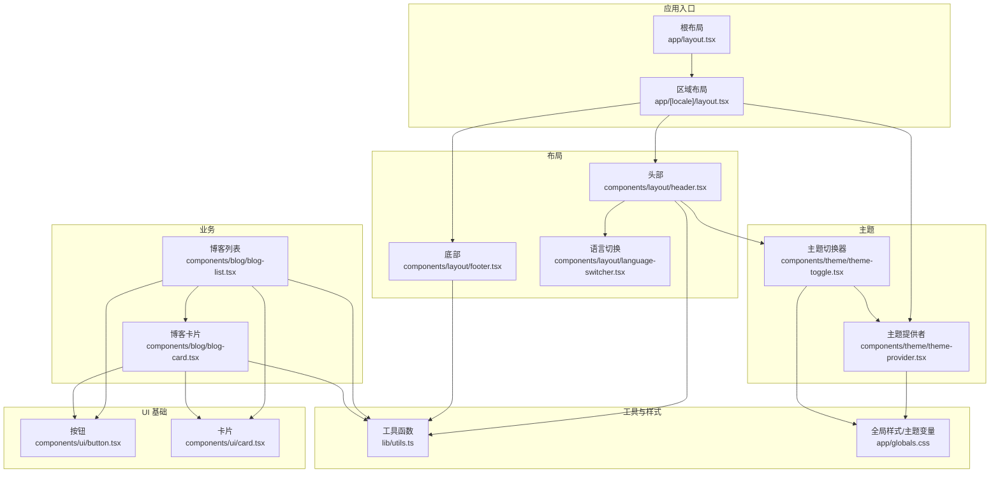
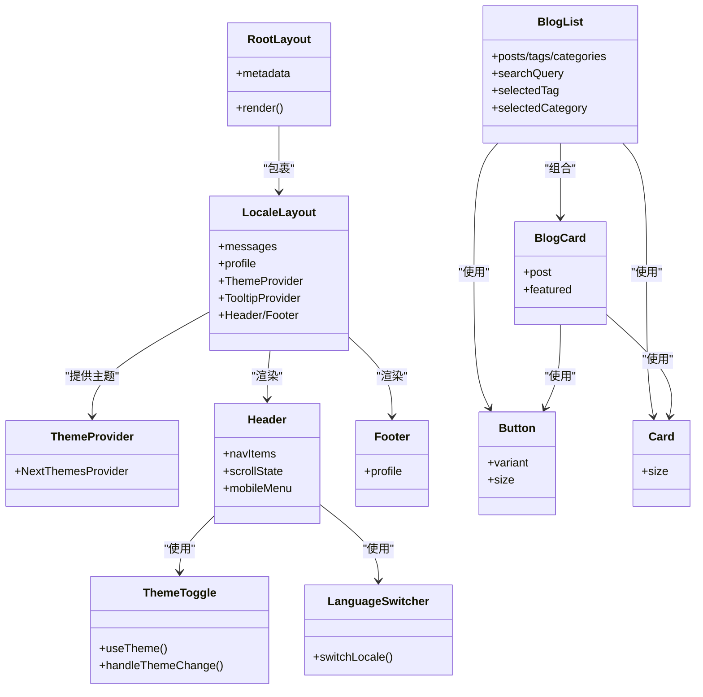
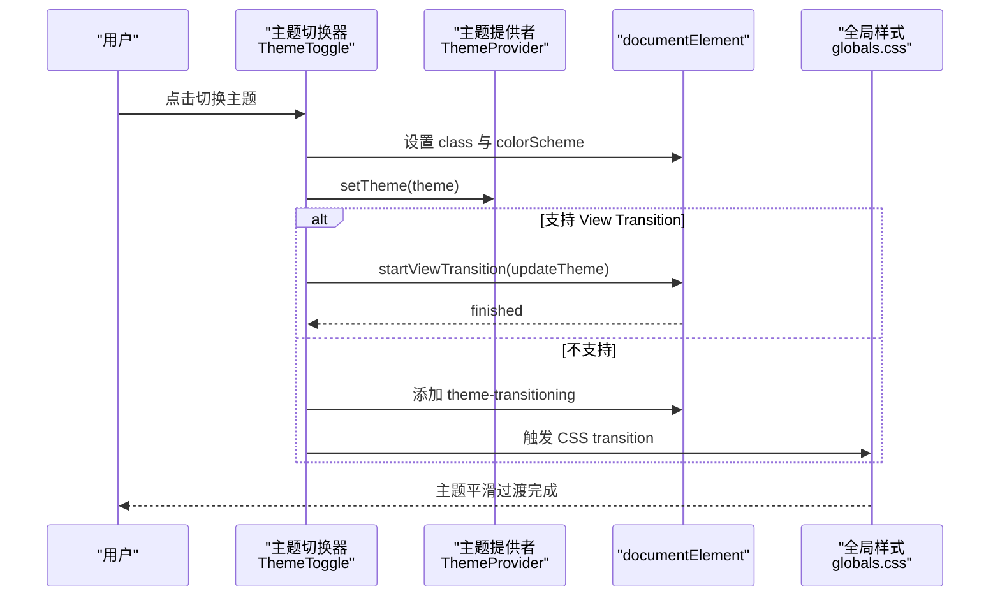
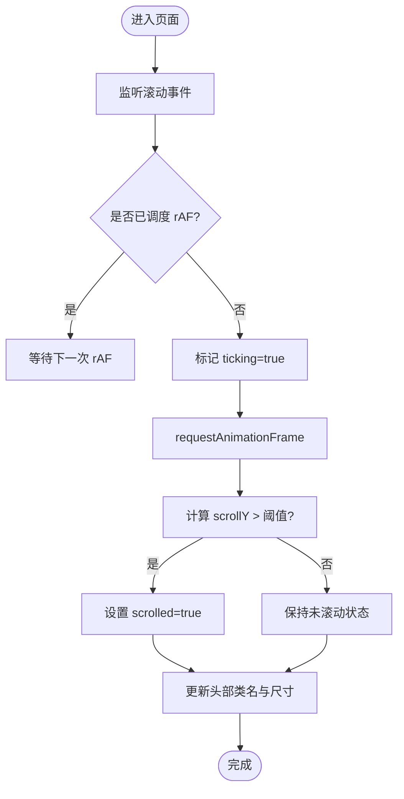
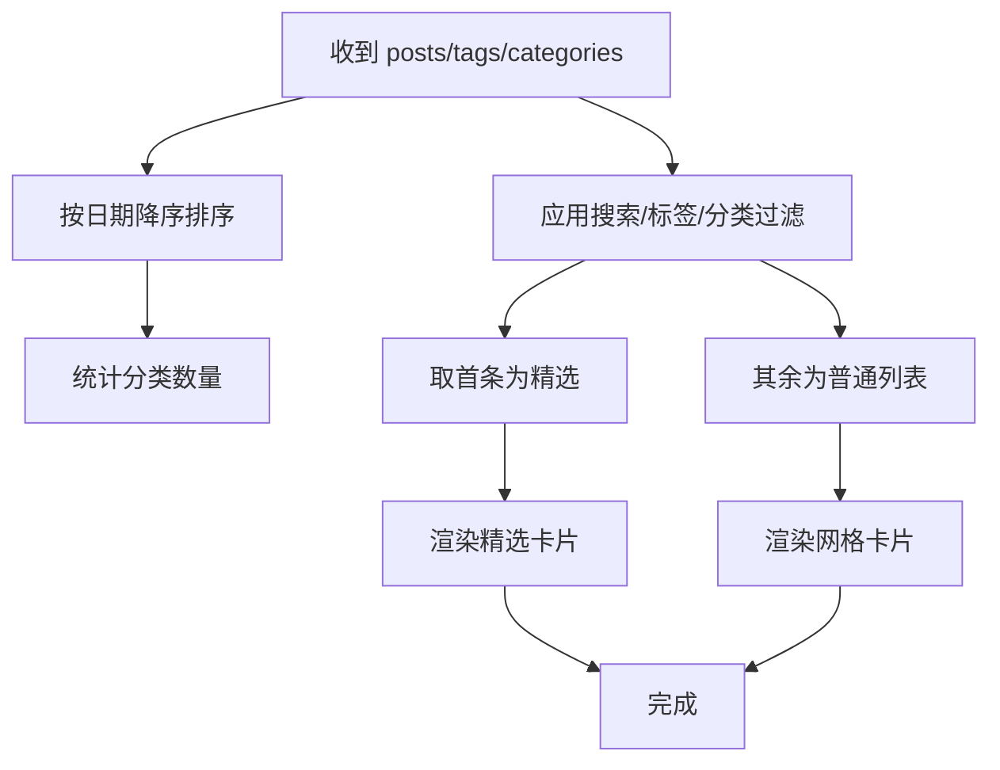
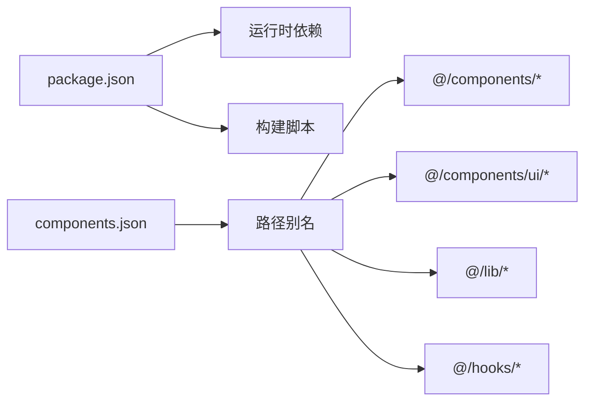

# 组件架构设计

<cite>
**本文引用的文件**   
- [components.json](file://components.json)
- [package.json](file://package.json)
- [app/layout.tsx](file://app/layout.tsx)
- [app/[locale]/layout.tsx](file://app/[locale]/layout.tsx)
- [components/theme/theme-provider.tsx](file://components/theme/theme-provider.tsx)
- [components/theme/theme-toggle.tsx](file://components/theme/theme-toggle.tsx)
- [components/layout/header.tsx](file://components/layout/header.tsx)
- [components/layout/footer.tsx](file://components/layout/footer.tsx)
- [components/layout/language-switcher.tsx](file://components/layout/language-switcher.tsx)
- [components/ui/button.tsx](file://components/ui/button.tsx)
- [components/ui/card.tsx](file://components/ui/card.tsx)
- [components/blog/blog-card.tsx](file://components/blog/blog-card.tsx)
- [components/blog/blog-list.tsx](file://components/blog/blog-list.tsx)
- [lib/utils.ts](file://lib/utils.ts)
- [app/globals.css](file://app/globals.css)
</cite>

## 目录
1. [引言](#引言)
2. [项目结构](#项目结构)
3. [核心组件](#核心组件)
4. [架构总览](#架构总览)
5. [详细组件分析](#详细组件分析)
6. [依赖关系分析](#依赖关系分析)
7. [性能考量](#性能考量)
8. [故障排查指南](#故障排查指南)
9. [结论](#结论)
10. [附录](#附录)

## 引言
本文件面向博客系统的组件化架构，基于 React 19 与 Next.js 应用结构，采用分层设计：基础 UI 组件、业务组件与布局组件。系统集成 shadcn/ui 风格的基础组件，并通过 CSS 变量与 next-themes 实现明暗主题切换。文档将说明组件分层、数据传递模式、状态管理策略、性能优化技巧、主题系统实现以及组合/复用模式的实践示例。

## 项目结构
本项目采用“按功能域 + 分层”的组织方式：
- app 层：页面路由与根布局（包含 SEO、国际化、主题等全局上下文）
- components 层：
  - ui：基础 UI 组件（按钮、卡片、输入等），遵循 shadcn/ui 风格
  - layout：布局组件（头部、底部、语言切换）
  - theme：主题相关组件（主题提供者、主题切换器）
  - blog/about/experience/home/resume/comments/icons/mdx：业务与领域组件
- lib 层：工具函数与数据读取（如 cn、getAssetPath、SEO、站点信息）
- types 层：类型定义
- content 层：内容源（Markdown/JSON）
- i18n 层：国际化配置与请求处理

图表来源
- [app/layout.tsx:93-114](file://app/layout.tsx#L93-L114)
- [app/[locale]/layout.tsx:20-64](file://app/[locale]/layout.tsx#L20-L64)
- [components/theme/theme-provider.tsx:1-11](file://components/theme/theme-provider.tsx#L1-L11)
- [components/theme/theme-toggle.tsx:1-115](file://components/theme/theme-toggle.tsx#L1-L115)
- [components/layout/header.tsx:1-270](file://components/layout/header.tsx#L1-L270)
- [components/layout/footer.tsx:1-81](file://components/layout/footer.tsx#L1-L81)
- [components/layout/language-switcher.tsx:1-53](file://components/layout/language-switcher.tsx#L1-L53)
- [components/ui/button.tsx:1-61](file://components/ui/button.tsx#L1-L61)
- [components/ui/card.tsx:1-104](file://components/ui/card.tsx#L1-L104)
- [components/blog/blog-list.tsx:1-416](file://components/blog/blog-list.tsx#L1-L416)
- [components/blog/blog-card.tsx:1-156](file://components/blog/blog-card.tsx#L1-L156)
- [lib/utils.ts:1-26](file://lib/utils.ts#L1-L26)
- [app/globals.css:1-800](file://app/globals.css#L1-L800)

章节来源
- [components.json:1-26](file://components.json#L1-L26)
- [package.json:1-47](file://package.json#L1-L47)
- [app/layout.tsx:1-114](file://app/layout.tsx#L1-L114)
- [app/[locale]/layout.tsx:1-64](file://app/[locale]/layout.tsx#L1-L64)

## 核心组件
- 基础 UI 组件
  - 按钮：基于 @base-ui/react 的 Button 封装，使用 class-variance-authority 管理变体与尺寸，统一焦点态、禁用态与无障碍属性。
  - 卡片：提供 Card、CardHeader、CardTitle、CardContent、CardFooter 等子元素，通过 data-slot 与 data-size 进行组合式样式控制。
- 布局组件
  - 头部：响应式导航、滚动吸顶形态变化、移动端抽屉菜单、RSS 入口、语言与主题切换。
  - 底部：品牌信息、导航链接、社交图标与版权信息。
  - 语言切换：基于 next-intl 与 next/navigation 的路由切换。
- 业务组件
  - 博客列表：搜索、标签筛选、分类侧边栏与移动端横向筛选条、首条精选展示。
  - 博客卡片：支持封面图与非封面两种布局，展示标题、描述、日期、阅读时长与标签。
- 主题组件
  - 主题提供者：对 next-themes 的轻量封装，作为全局主题上下文。
  - 主题切换器：下拉菜单选择 light/dark/system，结合 View Transition API 或 CSS transition 实现平滑过渡。

章节来源
- [components/ui/button.tsx:1-61](file://components/ui/button.tsx#L1-L61)
- [components/ui/card.tsx:1-104](file://components/ui/card.tsx#L1-L104)
- [components/layout/header.tsx:1-270](file://components/layout/header.tsx#L1-L270)
- [components/layout/footer.tsx:1-81](file://components/layout/footer.tsx#L1-L81)
- [components/layout/language-switcher.tsx:1-53](file://components/layout/language-switcher.tsx#L1-L53)
- [components/blog/blog-list.tsx:1-416](file://components/blog/blog-list.tsx#L1-L416)
- [components/blog/blog-card.tsx:1-156](file://components/blog/blog-card.tsx#L1-L156)
- [components/theme/theme-provider.tsx:1-11](file://components/theme/theme-provider.tsx#L1-L11)
- [components/theme/theme-toggle.tsx:1-115](file://components/theme/theme-toggle.tsx#L1-L115)

## 架构总览
整体采用“根布局 -> 区域布局 -> 业务页面”的层级，并在区域布局中注入国际化与主题上下文。UI 基础组件位于 components/ui，业务组件按功能域划分在各自目录下，布局组件集中在 components/layout。

图表来源
- [app/layout.tsx:93-114](file://app/layout.tsx#L93-L114)
- [app/[locale]/layout.tsx:20-64](file://app/[locale]/layout.tsx#L20-L64)
- [components/theme/theme-provider.tsx:1-11](file://components/theme/theme-provider.tsx#L1-L11)
- [components/theme/theme-toggle.tsx:1-115](file://components/theme/theme-toggle.tsx#L1-L115)
- [components/layout/header.tsx:1-270](file://components/layout/header.tsx#L1-L270)
- [components/layout/footer.tsx:1-81](file://components/layout/footer.tsx#L1-L81)
- [components/layout/language-switcher.tsx:1-53](file://components/layout/language-switcher.tsx#L1-L53)
- [components/blog/blog-list.tsx:1-416](file://components/blog/blog-list.tsx#L1-L416)
- [components/blog/blog-card.tsx:1-156](file://components/blog/blog-card.tsx#L1-L156)
- [components/ui/button.tsx:1-61](file://components/ui/button.tsx#L1-L61)
- [components/ui/card.tsx:1-104](file://components/ui/card.tsx#L1-L104)

## 详细组件分析

### 主题系统（明暗主题切换机制与样式变量管理）
- 主题提供者
  - 对 next-themes 的 Provider 进行最小封装，暴露 attribute、defaultTheme、enableSystem 等选项，供区域布局注入。
- 主题切换器
  - 使用 useTheme 获取 setTheme；根据用户选择更新 documentElement 的 class 与 colorScheme。
  - 优先尝试 View Transition API，若不可用则回退到 CSS transition；同时尊重 prefers-reduced-motion。
  - 通过 CSS 变量与动画关键帧实现圆形展开过渡效果。
- 样式变量管理
  - 在 globals.css 中定义 :root 与 .dark 两套 CSS 变量，涵盖背景、前景、主色、强调色、边框、阴影等。
  - 通过 Tailwind 的 @theme inline 映射至设计令牌，确保组件样式与主题一致。

图表来源
- [components/theme/theme-provider.tsx:1-11](file://components/theme/theme-provider.tsx#L1-L11)
- [components/theme/theme-toggle.tsx:1-115](file://components/theme/theme-toggle.tsx#L1-L115)
- [app/globals.css:147-201](file://app/globals.css#L147-L201)

章节来源
- [components/theme/theme-provider.tsx:1-11](file://components/theme/theme-provider.tsx#L1-L11)
- [components/theme/theme-toggle.tsx:1-115](file://components/theme/theme-toggle.tsx#L1-L115)
- [app/globals.css:55-124](file://app/globals.css#L55-L124)
- [app/globals.css:147-201](file://app/globals.css#L147-L201)

### 布局组件（头部、底部、语言切换）
- 头部
  - 滚动监听：使用 requestAnimationFrame 节流滚动事件，避免重排抖动；超过阈值时切换为悬浮胶囊形态。
  - 导航高亮：根据当前路径判断激活项，桌面端以圆角背景高亮。
  - 移动端菜单：使用 Sheet 组件，右侧滑出，带入场动画与关闭按钮。
  - 集成语言与主题切换入口。
- 底部
  - 接收 profile 数据，展示品牌、导航与社交链接。
- 语言切换
  - 基于 next-intl 的 useLocale 与 next/navigation 的 useRouter/usePathname，动态拼接新路径并跳转。

图表来源
- [components/layout/header.tsx:25-47](file://components/layout/header.tsx#L25-L47)
- [components/layout/header.tsx:49-60](file://components/layout/header.tsx#L49-L60)

章节来源
- [components/layout/header.tsx:1-270](file://components/layout/header.tsx#L1-L270)
- [components/layout/footer.tsx:1-81](file://components/layout/footer.tsx#L1-L81)
- [components/layout/language-switcher.tsx:1-53](file://components/layout/language-switcher.tsx#L1-L53)

### 基础 UI 组件（Button、Card）
- Button
  - 使用 cva 定义 variant 与 size 的样式变体，合并 className 后传递给底层 Button 原语组件。
  - 统一处理 focus-visible、aria-invalid、disabled 等可访问性与交互状态。
- Card
  - 提供多子组件（Header、Title、Description、Content、Action、Footer），通过 data-slot 与 data-size 进行组合式样式控制。
  - 适配不同尺寸与图片位置（首尾图片圆角）。

章节来源
- [components/ui/button.tsx:1-61](file://components/ui/button.tsx#L1-L61)
- [components/ui/card.tsx:1-104](file://components/ui/card.tsx#L1-L104)

### 业务组件（博客列表与博客卡片）
- 博客列表
  - 本地状态：搜索词、选中标签、选中分类、是否显示筛选面板。
  - 排序与统计：按日期倒序排列；统计每分类文章数。
  - 过滤逻辑：同时满足搜索、标签与分类条件。
  - 展示策略：首条作为精选卡片，其余网格展示；移动端提供横向筛选条。
- 博客卡片
  - 支持 featured 模式（横版大图+摘要）与普通模式（竖版卡片）。
  - 展示类别徽章、日期、阅读时长、标签与“阅读全文”引导。

图表来源
- [components/blog/blog-list.tsx:28-67](file://components/blog/blog-list.tsx#L28-L67)
- [components/blog/blog-list.tsx:69-416](file://components/blog/blog-list.tsx#L69-L416)
- [components/blog/blog-card.tsx:1-156](file://components/blog/blog-card.tsx#L1-L156)

章节来源
- [components/blog/blog-list.tsx:1-416](file://components/blog/blog-list.tsx#L1-L416)
- [components/blog/blog-card.tsx:1-156](file://components/blog/blog-card.tsx#L1-L156)

### 组合与复用模式示例
- 组合模式
  - 头部组合语言切换与主题切换，形成统一的顶部操作区。
  - 博客列表组合搜索、筛选与卡片展示，形成完整的内容发现体验。
- 复用模式
  - 基础按钮与卡片被多处复用，保证一致的交互与视觉规范。
  - 工具函数 cn 与 getAssetPath 在多个组件中复用，统一样式合并与资源路径处理。

章节来源
- [components/layout/header.tsx:131-150](file://components/layout/header.tsx#L131-L150)
- [components/blog/blog-list.tsx:1-416](file://components/blog/blog-list.tsx#L1-L416)
- [lib/utils.ts:1-26](file://lib/utils.ts#L1-L26)

## 依赖关系分析
- 运行时依赖
  - React 19 与 Next.js 16 提供现代 React 能力与 RSC 生态。
  - next-themes 提供主题持久化与切换能力。
  - next-intl 提供国际化能力。
  - tailwind-merge 与 clsx 用于样式合并。
  - shadcn 与 base-ui 提供基础 UI 原语与样式约定。
- 构建与脚本
  - build 流程包含 SEO 修复与路径扁平化脚本。
- 别名与路径
  - components.json 定义了 @/components、@/components/ui、@/lib、@/hooks 等别名，便于跨模块引用。

图表来源
- [package.json:1-47](file://package.json#L1-L47)
- [components.json:1-26](file://components.json#L1-L26)

章节来源
- [package.json:1-47](file://package.json#L1-L47)
- [components.json:1-26](file://components.json#L1-L26)

## 性能考量
- 滚动优化
  - 头部滚动监听使用 requestAnimationFrame 节流，避免频繁重排。
- 主题切换优化
  - 优先使用 View Transition API，减少重绘成本；在不支持时回退到 CSS transition，并尊重 prefers-reduced-motion。
- 列表渲染优化
  - 使用 useMemo 缓存排序结果、分类统计与过滤结果，降低重复计算。
- 样式合并
  - 使用 tailwind-merge 与 clsx 合并 className，避免冲突与冗余。
- 资源路径
  - 通过 getAssetPath 统一处理 basePath 前缀，兼容 GitHub Pages 部署场景。

章节来源
- [components/layout/header.tsx:33-47](file://components/layout/header.tsx#L33-L47)
- [components/theme/theme-toggle.tsx:44-86](file://components/theme/theme-toggle.tsx#L44-L86)
- [components/blog/blog-list.tsx:28-55](file://components/blog/blog-list.tsx#L28-L55)
- [lib/utils.ts:1-26](file://lib/utils.ts#L1-L26)

## 故障排查指南
- 主题切换无动画
  - 检查浏览器是否支持 View Transition API；若不支持，确认 CSS transition 生效且未受 prefers-reduced-motion 影响。
- 主题不生效或闪烁
  - 确认 ThemeProvider 包裹了需要主题感知的组件树；检查 documentElement 的 class 是否正确切换。
- 国际化路由异常
  - 检查语言切换器拼接的新路径是否符合 /[locale] 路由规则；确认 next-intl 消息加载成功。
- 样式冲突或覆盖
  - 检查 cn 合并顺序与 Tailwind 优先级；必要时调整组件 className 传入顺序。
- 资源路径错误（部署后）
  - 检查 NEXT_PUBLIC_BASE_PATH 环境变量与 getAssetPath 的使用，确保静态资源路径正确。

章节来源
- [components/theme/theme-toggle.tsx:44-86](file://components/theme/theme-toggle.tsx#L44-L86)
- [components/layout/language-switcher.tsx:25-29](file://components/layout/language-switcher.tsx#L25-L29)
- [lib/utils.ts:16-25](file://lib/utils.ts#L16-L25)

## 结论
本博客系统采用清晰的分层组件架构：基础 UI 组件提供稳定可复用的交互原语，布局组件负责全局结构与导航，业务组件聚焦内容呈现与交互。主题系统通过 next-themes 与 CSS 变量实现平滑切换，配合 View Transition API 提升用户体验。通过 useMemo、rAF 节流与样式合并等手段，系统在交互流畅度与渲染性能上取得良好平衡。未来可在更复杂的状态场景中引入集中式状态管理，并持续完善可访问性与测试覆盖。

## 附录
- shadcn/ui 集成要点
  - 通过 components.json 配置 style、aliases 与 iconLibrary，确保组件生成与导入路径一致。
  - 使用 @import "shadcn/tailwind.css" 引入默认样式，结合自定义 CSS 变量扩展主题。
- 开发规范建议
  - 组件职责单一，尽量使用 props 与组合模式表达行为。
  - 样式优先使用 Tailwind 与设计令牌，避免内联样式。
  - 对外暴露稳定的接口，内部实现细节隐藏。
  - 关注可访问性：键盘导航、ARIA 属性与屏幕阅读器友好。

章节来源
- [components.json:1-26](file://components.json#L1-L26)
- [app/globals.css:1-53](file://app/globals.css#L1-L53)