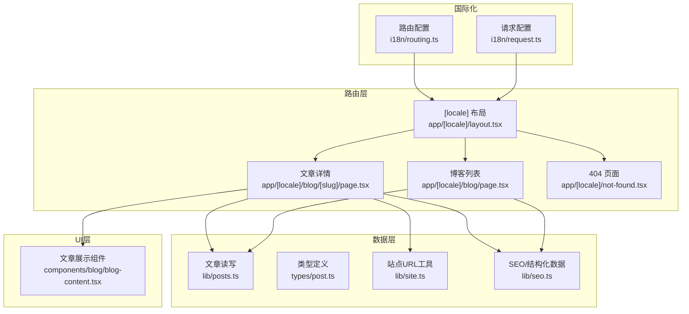
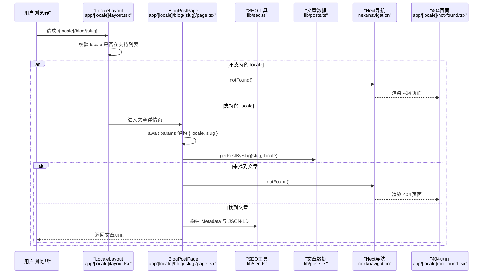
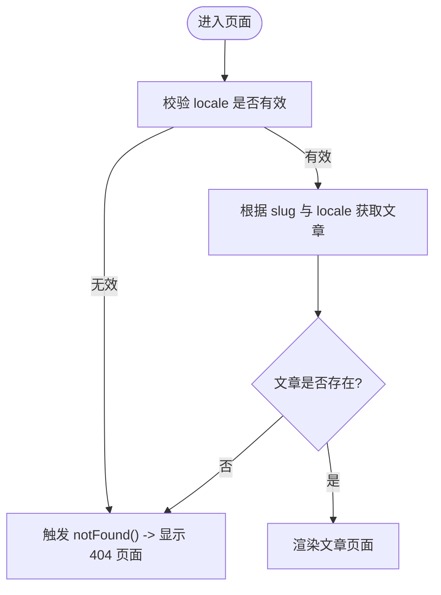
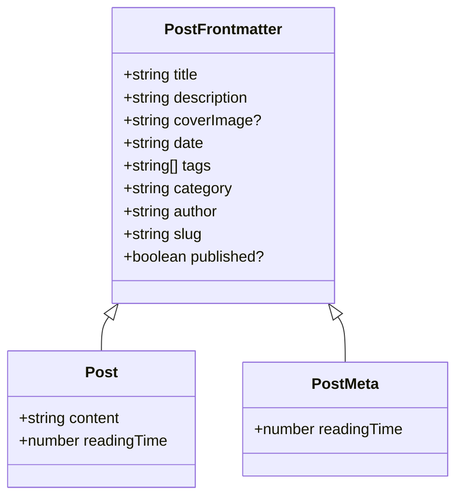
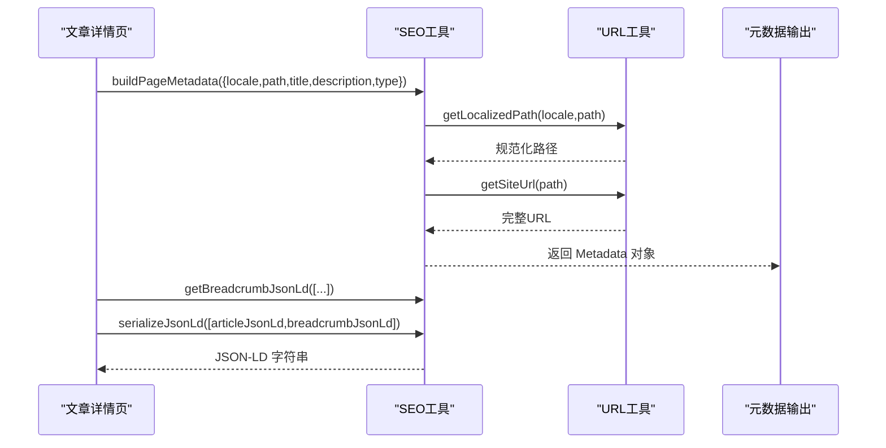
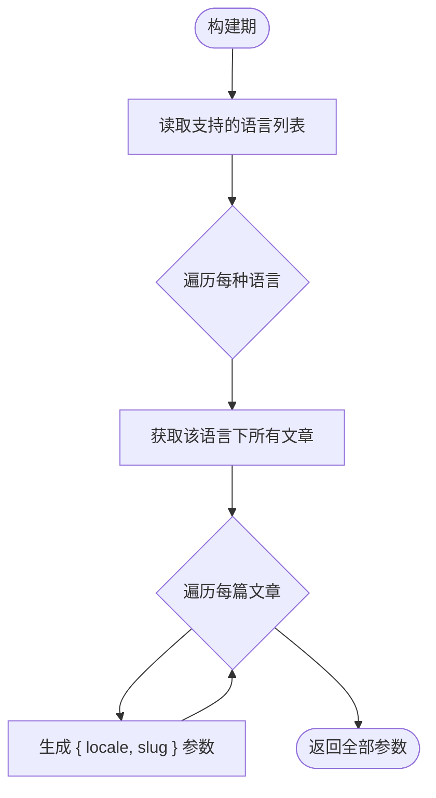
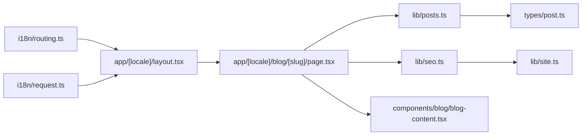

# 动态路由参数处理

<cite>
**本文引用的文件列表**
- [app/[locale]/blog/[slug]/page.tsx](file://app/[locale]/blog/[slug]/page.tsx)
- [app/[locale]/layout.tsx](file://app/[locale]/layout.tsx)
- [i18n/routing.ts](file://i18n/routing.ts)
- [lib/posts.ts](file://lib/posts.ts)
- [types/post.ts](file://types/post.ts)
- [lib/seo.ts](file://lib/seo.ts)
- [app/[locale]/not-found.tsx](file://app/[locale]/not-found.tsx)
- [i18n/request.ts](file://i18n/request.ts)
- [components/blog/blog-content.tsx](file://components/blog/blog-content.tsx)
- [lib/site.ts](file://lib/site.ts)
- [app/[locale]/blog/page.tsx](file://app/[locale]/blog/page.tsx)
</cite>

## 目录
1. [简介](#简介)
2. [项目结构](#项目结构)
3. [核心组件](#核心组件)
4. [架构总览](#架构总览)
5. [详细组件分析](#详细组件分析)
6. [依赖关系分析](#依赖关系分析)
7. [性能考量](#性能考量)
8. [故障排查指南](#故障排查指南)
9. [结论](#结论)
10. [附录](#附录)

## 简介
本文件聚焦于 Next.js App Router 的动态路由参数处理，围绕 [locale] 与 [slug] 两个关键参数展开，系统阐述：
- 动态路由参数的提取、类型定义与校验机制
- 基于参数获取内容数据（Markdown + frontmatter）的流程
- SEO 元数据与结构化数据（JSON-LD）的生成策略
- 错误边界与 404 处理
- 静态化预渲染（generateStaticParams）的实现方式
- 可复用的代码示例路径，便于快速定位实现细节

## 项目结构
本项目采用按功能域组织的路由与模块划分。与动态路由相关的关键位置如下：
- 国际化路由前缀：app/[locale]
- 博客文章详情页：app/[locale]/blog/[slug]/page.tsx
- 博客列表页：app/[locale]/blog/page.tsx
- 国际化配置：i18n/routing.ts、i18n/request.ts
- 内容读取与数据处理：lib/posts.ts、types/post.ts
- SEO 与结构化数据：lib/seo.ts、lib/site.ts
- 全局布局与语言校验：app/[locale]/layout.tsx
- 404 页面：app/[locale]/not-found.tsx
- 文章展示组件：components/blog/blog-content.tsx

图表来源
- [app/[locale]/layout.tsx:1-64](file://app/[locale]/layout.tsx#L1-L64)
- [app/[locale]/blog/[slug]/page.tsx:1-180](file://app/[locale]/blog/[slug]/page.tsx#L1-L180)
- [app/[locale]/blog/page.tsx:1-34](file://app/[locale]/blog/page.tsx#L1-L34)
- [i18n/routing.ts:1-6](file://i18n/routing.ts#L1-L6)
- [i18n/request.ts:1-15](file://i18n/request.ts#L1-L15)
- [lib/posts.ts:1-121](file://lib/posts.ts#L1-L121)
- [types/post.ts:1-20](file://types/post.ts#L1-L20)
- [lib/seo.ts:1-199](file://lib/seo.ts#L1-L199)
- [lib/site.ts:1-35](file://lib/site.ts#L1-L35)
- [components/blog/blog-content.tsx:1-254](file://components/blog/blog-content.tsx#L1-L254)

章节来源
- [app/[locale]/layout.tsx:1-64](file://app/[locale]/layout.tsx#L1-L64)
- [app/[locale]/blog/[slug]/page.tsx:1-180](file://app/[locale]/blog/[slug]/page.tsx#L1-L180)
- [i18n/routing.ts:1-6](file://i18n/routing.ts#L1-L6)
- [i18n/request.ts:1-15](file://i18n/request.ts#L1-L15)
- [lib/posts.ts:1-121](file://lib/posts.ts#L1-L121)
- [types/post.ts:1-20](file://types/post.ts#L1-L20)
- [lib/seo.ts:1-199](file://lib/seo.ts#L1-L199)
- [lib/site.ts:1-35](file://lib/site.ts#L1-L35)
- [components/blog/blog-content.tsx:1-254](file://components/blog/blog-content.tsx#L1-L254)

## 核心组件
- 动态路由参数类型
  - 文章详情页 props.params 类型为 Promise<{ locale: string; slug: string }>，在函数内通过 await params 解构得到具体值。
  - 布局页 props.params 类型为 Promise<{ locale: string }>，用于校验 locale 并设置请求语言。
- 参数提取与校验
  - 布局层对 locale 进行白名单校验，不在支持列表时触发 notFound()。
  - 文章详情页根据 slug 与 locale 调用 getPostBySlug 获取文章；若不存在则触发 notFound()。
- 静态化预渲染
  - generateStaticParams 遍历所有支持的 locale 与文章集合，生成所有可能的 { locale, slug } 组合，确保构建期即可静态化所有文章页面。
- 数据获取
  - lib/posts.ts 提供 getAllPosts、getPostBySlug、getRelatedPosts 等函数，从 content/posts/{locale} 下读取 .md 文件，解析 frontmatter 与正文内容，计算阅读时长等衍生字段。
- SEO 与结构化数据
  - lib/seo.ts 提供 buildPageMetadata、getBreadcrumbJsonLd、getWebsiteJsonLd、serializeJsonLd 等工具，结合 lib/site.ts 的 URL 工具生成 canonical、OpenGraph、Twitter Card 及 JSON-LD。
- 错误边界
  - 使用 next/navigation 的 notFound() 在服务端渲染阶段返回 404，配合 app/[locale]/not-found.tsx 呈现国际化 404 页面。

章节来源
- [app/[locale]/blog/[slug]/page.tsx:20-35](file://app/[locale]/blog/[slug]/page.tsx#L20-L35)
- [app/[locale]/layout.tsx:20-36](file://app/[locale]/layout.tsx#L20-L36)
- [lib/posts.ts:49-71](file://lib/posts.ts#L49-L71)
- [lib/seo.ts:137-199](file://lib/seo.ts#L137-L199)
- [lib/site.ts:13-35](file://lib/site.ts#L13-L35)
- [app/[locale]/not-found.tsx:1-33](file://app/[locale]/not-found.tsx#L1-L33)

## 架构总览
下图展示了从浏览器访问到最终渲染的完整流程，包括参数解析、数据获取、SEO 与结构化数据注入以及 404 分支。

图表来源
- [app/[locale]/layout.tsx:20-36](file://app/[locale]/layout.tsx#L20-L36)
- [app/[locale]/blog/[slug]/page.tsx:37-117](file://app/[locale]/blog/[slug]/page.tsx#L37-L117)
- [lib/posts.ts:49-71](file://lib/posts.ts#L49-L71)
- [lib/seo.ts:137-199](file://lib/seo.ts#L137-L199)
- [app/[locale]/not-found.tsx:1-33](file://app/[locale]/not-found.tsx#L1-L33)

## 详细组件分析

### 动态路由参数类型与提取
- 参数类型
  - 文章详情页：props.params 为 Promise<{ locale: string; slug: string }>，在异步函数中通过 await params 获取实际值。
  - 布局页：props.params 为 Promise<{ locale: string }>，用于语言校验与 setRequestLocale。
- 参数提取时机
  - 在 generateMetadata 与默认导出组件中均先 await params，再解构出 locale 与 slug，保证在构建期或运行期均可正确取值。
- 类型安全
  - 通过 TypeScript 接口 BlogPostPageProps 明确参数形状，避免运行时误用。

章节来源
- [app/[locale]/blog/[slug]/page.tsx:20-22](file://app/[locale]/blog/[slug]/page.tsx#L20-L22)
- [app/[locale]/layout.tsx:20-26](file://app/[locale]/layout.tsx#L20-L26)

### 参数校验与错误处理
- 语言校验
  - 布局层检查 resolvedLocale 是否属于 routing.locales，否则调用 notFound()。
- 文章存在性校验
  - 文章详情页调用 getPostBySlug 后判断是否为空，为空则调用 notFound()。
- 404 页面
  - 使用 app/[locale]/not-found.tsx 作为区域级 404 页面，支持国际化文案与当前 locale 跳转回首页。

图表来源
- [app/[locale]/layout.tsx:27-32](file://app/[locale]/layout.tsx#L27-L32)
- [app/[locale]/blog/[slug]/page.tsx:110-117](file://app/[locale]/blog/[slug]/page.tsx#L110-L117)
- [app/[locale]/not-found.tsx:1-33](file://app/[locale]/not-found.tsx#L1-L33)

章节来源
- [app/[locale]/layout.tsx:27-32](file://app/[locale]/layout.tsx#L27-L32)
- [app/[locale]/blog/[slug]/page.tsx:110-117](file://app/[locale]/blog/[slug]/page.tsx#L110-L117)
- [app/[locale]/not-found.tsx:1-33](file://app/[locale]/not-found.tsx#L1-L33)

### 基于动态参数获取内容数据
- 数据源
  - 文章位于 content/posts/{locale}/{slug}.md，frontmatter 包含标题、描述、封面图、日期、标签、分类、作者等字段。
- 读取与解析
  - getAllPosts 列出某语言下的所有文章，解析 frontmatter 并计算阅读时长。
  - getPostBySlug 精确读取指定 slug 的文章，返回包含 content 的完整对象。
  - getRelatedPosts 基于标签重叠与分类匹配度计算相关文章。
- 类型定义
  - types/post.ts 定义了 PostFrontmatter、Post、PostMeta，确保前后端一致的类型约束。

图表来源
- [types/post.ts:1-20](file://types/post.ts#L1-L20)

章节来源
- [lib/posts.ts:15-47](file://lib/posts.ts#L15-L47)
- [lib/posts.ts:49-71](file://lib/posts.ts#L49-L71)
- [lib/posts.ts:95-121](file://lib/posts.ts#L95-L121)
- [types/post.ts:1-20](file://types/post.ts#L1-L20)

### SEO 元数据与结构化数据生成
- 页面元数据
  - buildPageMetadata 统一生成 title、description、canonical、OpenGraph、Twitter Card、robots 等元信息，并根据 locale 选择关键词与语言。
- 多语言替代链接
  - getLanguageAlternates 与 alternateLanguages 构造 en-US、zh-CN、x-default 等多语言版本链接。
- 结构化数据
  - 文章页生成 BlogPosting 与 BreadcrumbList 的 JSON-LD，网站根布局生成 WebSite 与 Person 的 JSON-LD。
- URL 工具
  - lib/site.ts 提供 getSiteUrl、getAbsoluteUrl，兼容 basePath 与绝对路径场景。

图表来源
- [lib/seo.ts:137-199](file://lib/seo.ts#L137-L199)
- [lib/site.ts:13-35](file://lib/site.ts#L13-L35)
- [app/[locale]/blog/[slug]/page.tsx:37-108](file://app/[locale]/blog/[slug]/page.tsx#L37-L108)

章节来源
- [lib/seo.ts:1-199](file://lib/seo.ts#L1-L199)
- [lib/site.ts:1-35](file://lib/site.ts#L1-L35)
- [app/[locale]/blog/[slug]/page.tsx:37-108](file://app/[locale]/blog/[slug]/page.tsx#L37-L108)

### 静态化预渲染（generateStaticParams）
- 目标
  - 在构建期生成所有可能的 { locale, slug } 组合，使每个文章页面都可被静态化，提升首屏性能与缓存命中。
- 实现要点
  - 遍历 i18n/routing.ts 中的 locales，对每个 locale 调用 getAllPosts 获取该语言下的文章列表，将每个文章的 slug 与对应 locale 推入参数数组。
  - 布局页同样为每个 locale 生成静态参数，确保语言切换入口可静态化。

图表来源
- [app/[locale]/blog/[slug]/page.tsx:24-35](file://app/[locale]/blog/[slug]/page.tsx#L24-L35)
- [app/[locale]/layout.tsx:16-18](file://app/[locale]/layout.tsx#L16-L18)
- [i18n/routing.ts:1-6](file://i18n/routing.ts#L1-L6)
- [lib/posts.ts:15-47](file://lib/posts.ts#L15-L47)

章节来源
- [app/[locale]/blog/[slug]/page.tsx:24-35](file://app/[locale]/blog/[slug]/page.tsx#L24-L35)
- [app/[locale]/layout.tsx:16-18](file://app/[locale]/layout.tsx#L16-L18)
- [i18n/routing.ts:1-6](file://i18n/routing.ts#L1-L6)
- [lib/posts.ts:15-47](file://lib/posts.ts#L15-L47)

### 前端展示与交互
- 文章展示组件
  - components/blog/blog-content.tsx 负责渲染封面、标题、作者、日期、标签、目录、评论与相关文章。
  - 通过 MarkdownRenderer 渲染文章内容，并结合 highlightCodeBlocks 进行代码高亮。
- 导航与链接
  - 使用 locale 拼接相对路径，如 /{locale}/blog，确保多语言环境下的链接正确。

章节来源
- [components/blog/blog-content.tsx:1-254](file://components/blog/blog-content.tsx#L1-L254)
- [app/[locale]/blog/[slug]/page.tsx:110-179](file://app/[locale]/blog/[slug]/page.tsx#L110-L179)

## 依赖关系分析
- 路由与国际化
  - i18n/routing.ts 定义支持的语言与默认语言；i18n/request.ts 在请求阶段解析并回退到默认语言。
- 数据与类型
  - lib/posts.ts 依赖 fs 与 gray-matter 读取 Markdown；types/post.ts 提供严格的数据模型。
- SEO 与 URL
  - lib/seo.ts 依赖 lib/site.ts 生成规范化的站点 URL 与多语言替代链接。
- 组件耦合
  - 文章详情页依赖 SEO 工具与文章数据层，并将结果传递给 BlogContent 组件进行渲染。

图表来源
- [i18n/routing.ts:1-6](file://i18n/routing.ts#L1-L6)
- [i18n/request.ts:1-15](file://i18n/request.ts#L1-L15)
- [app/[locale]/layout.tsx:1-64](file://app/[locale]/layout.tsx#L1-L64)
- [app/[locale]/blog/[slug]/page.tsx:1-180](file://app/[locale]/blog/[slug]/page.tsx#L1-L180)
- [lib/posts.ts:1-121](file://lib/posts.ts#L1-L121)
- [types/post.ts:1-20](file://types/post.ts#L1-L20)
- [lib/seo.ts:1-199](file://lib/seo.ts#L1-L199)
- [lib/site.ts:1-35](file://lib/site.ts#L1-L35)
- [components/blog/blog-content.tsx:1-254](file://components/blog/blog-content.tsx#L1-L254)

章节来源
- [i18n/routing.ts:1-6](file://i18n/routing.ts#L1-L6)
- [i18n/request.ts:1-15](file://i18n/request.ts#L1-L15)
- [app/[locale]/layout.tsx:1-64](file://app/[locale]/layout.tsx#L1-L64)
- [app/[locale]/blog/[slug]/page.tsx:1-180](file://app/[locale]/blog/[slug]/page.tsx#L1-L180)
- [lib/posts.ts:1-121](file://lib/posts.ts#L1-L121)
- [types/post.ts:1-20](file://types/post.ts#L1-L20)
- [lib/seo.ts:1-199](file://lib/seo.ts#L1-L199)
- [lib/site.ts:1-35](file://lib/site.ts#L1-L35)
- [components/blog/blog-content.tsx:1-254](file://components/blog/blog-content.tsx#L1-L254)

## 性能考量
- 静态化优先
  - 通过 generateStaticParams 在构建期生成所有文章页面，减少运行时开销，提高缓存命中率。
- 数据读取优化
  - getAllPosts 与 getPostBySlug 使用同步文件系统读取，适合构建期或小规模内容；若内容量增长，建议引入增量静态再生（ISR）或外部 CMS。
- 图片与资源
  - 封面图路径通过 getAssetPath 转换，建议使用 CDN 与合适的尺寸以优化加载。
- SEO 与结构化数据
  - 集中式 SEO 工具减少重复逻辑，确保各页面元数据一致性。

## 故障排查指南
- 404 问题
  - 检查 locale 是否在 i18n/routing.ts 的支持列表中；若不在，布局层会直接 notFound()。
  - 确认 slug 对应的 .md 文件是否存在且未被标记为 unpublished。
- 参数未生效
  - 确认页面组件是否正确 await params 并解构出 locale 与 slug。
  - 检查 generateStaticParams 是否覆盖了所有需要静态化的组合。
- SEO 异常
  - 验证 getLocalizedPath 与 getSiteUrl 生成的 URL 是否符合预期，尤其是 basePath 与绝对路径场景。
  - 检查 JSON-LD 序列化是否包含必要字段，避免搜索引擎无法识别。

章节来源
- [app/[locale]/layout.tsx:27-32](file://app/[locale]/layout.tsx#L27-L32)
- [app/[locale]/blog/[slug]/page.tsx:110-117](file://app/[locale]/blog/[slug]/page.tsx#L110-L117)
- [lib/seo.ts:137-199](file://lib/seo.ts#L137-L199)
- [lib/site.ts:13-35](file://lib/site.ts#L13-L35)

## 结论
本项目在 Next.js App Router 下实现了完善的动态路由参数处理方案：
- 通过 Promise 类型的 params 与 await 模式，确保类型安全与异步可读性
- 在布局层与页面层双重校验，保障语言与内容的有效性
- 利用 generateStaticParams 实现全量静态化，提升性能与可缓存性
- 统一的 SEO 与结构化数据生成策略，增强搜索引擎友好度
- 清晰的错误边界与 404 页面，提升用户体验

## 附录
- 代码示例路径（不含具体代码内容）
  - 参数类型与提取：[app/[locale]/blog/[slug]/page.tsx:20-22](file://app/[locale]/blog/[slug]/page.tsx#L20-L22)、[app/[locale]/layout.tsx:20-26](file://app/[locale]/layout.tsx#L20-L26)
  - 参数校验与 404：[app/[locale]/layout.tsx:27-32](file://app/[locale]/layout.tsx#L27-L32)、[app/[locale]/blog/[slug]/page.tsx:110-117](file://app/[locale]/blog/[slug]/page.tsx#L110-L117)、[app/[locale]/not-found.tsx:1-33](file://app/[locale]/not-found.tsx#L1-L33)
  - 数据获取与类型：[lib/posts.ts:15-47](file://lib/posts.ts#L15-L47)、[lib/posts.ts:49-71](file://lib/posts.ts#L49-L71)、[types/post.ts:1-20](file://types/post.ts#L1-L20)
  - SEO 与结构化数据：[lib/seo.ts:137-199](file://lib/seo.ts#L137-L199)、[lib/site.ts:13-35](file://lib/site.ts#L13-L35)
  - 静态化预渲染：[app/[locale]/blog/[slug]/page.tsx:24-35](file://app/[locale]/blog/[slug]/page.tsx#L24-L35)、[app/[locale]/layout.tsx:16-18](file://app/[locale]/layout.tsx#L16-L18)
  - 前端展示组件：[components/blog/blog-content.tsx:1-254](file://components/blog/blog-content.tsx#L1-L254)