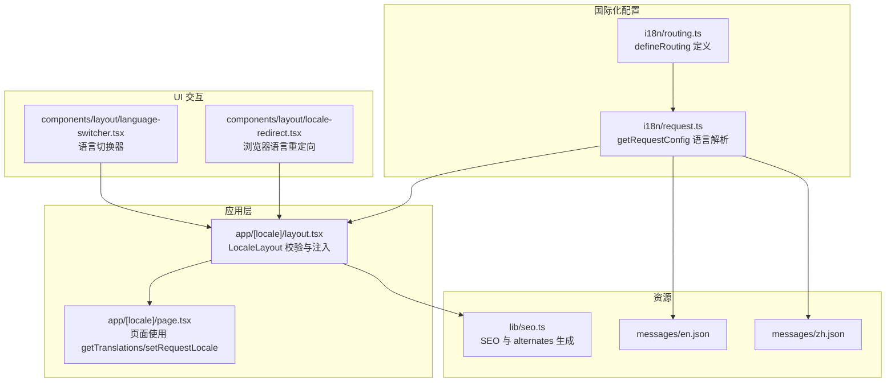
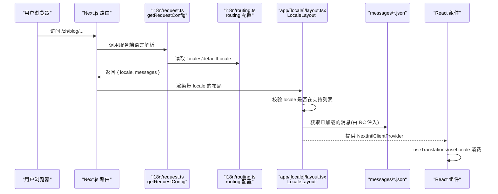
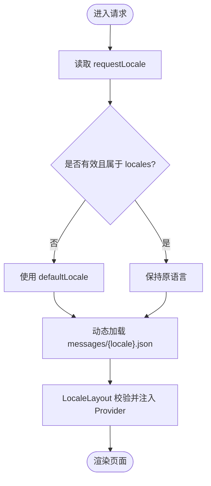
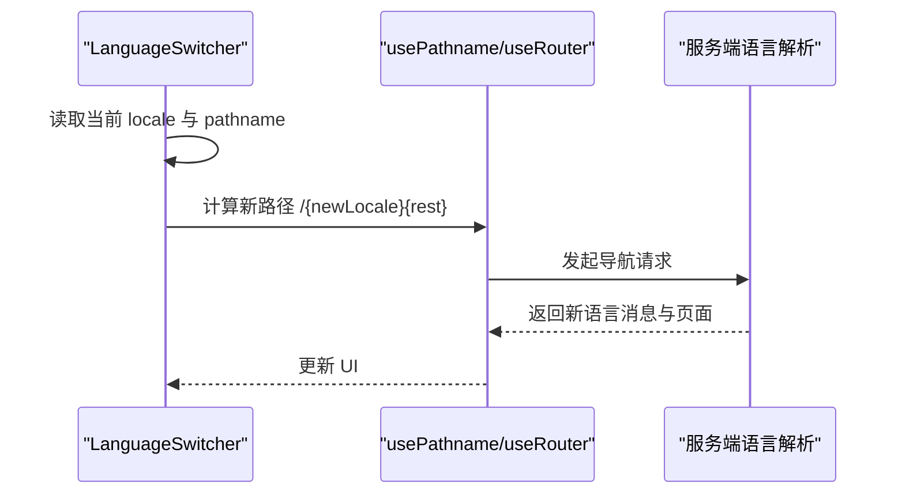
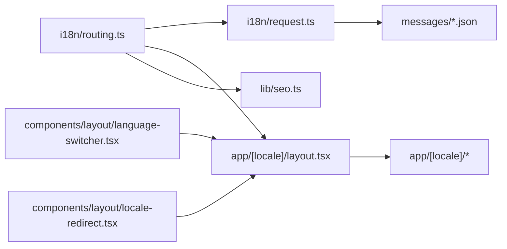

# 国际化路由配置

<cite>
**本文引用的文件**   
- [i18n/routing.ts](file://i18n/routing.ts)
- [i18n/request.ts](file://i18n/request.ts)
- [app/[locale]/layout.tsx](file://app/[locale]/layout.tsx)
- [components/layout/language-switcher.tsx](file://components/layout/language-switcher.tsx)
- [components/layout/locale-redirect.tsx](file://components/layout/locale-redirect.tsx)
- [messages/en.json](file://messages/en.json)
- [messages/zh.json](file://messages/zh.json)
- [lib/seo.ts](file://lib/seo.ts)
- [app/layout.tsx](file://app/layout.tsx)
- [app/[locale]/page.tsx](file://app/[locale]/page.tsx)
</cite>

## 目录
1. [简介](#简介)
2. [项目结构](#项目结构)
3. [核心组件](#核心组件)
4. [架构总览](#架构总览)
5. [详细组件分析](#详细组件分析)
6. [依赖关系分析](#依赖关系分析)
7. [性能考量](#性能考量)
8. [故障排查指南](#故障排查指南)
9. [结论](#结论)
10. [附录](#附录)

## 简介
本文件围绕 next-intl 的 defineRouting 配置，系统解析多语言路由策略、语言检测与回退机制、默认语言设置、语言前缀规则以及语言切换行为。文档同时给出添加新语言的步骤、最佳实践建议，并通过图示说明关键流程与数据流。

## 项目结构
本项目采用基于路径前缀的多语言路由：所有页面位于 app/[locale] 下，通过 URL 中的 locale 段（如 /en、/zh）区分语言。next-intl 负责在请求阶段解析语言、加载对应消息，并在客户端提供翻译 Hook。

图表来源
- [i18n/routing.ts:1-6](file://i18n/routing.ts#L1-L6)
- [i18n/request.ts:1-15](file://i18n/request.ts#L1-L15)
- [app/[locale]/layout.tsx:1-64](file://app/[locale]/layout.tsx#L1-L64)
- [components/layout/language-switcher.tsx:1-53](file://components/layout/language-switcher.tsx#L1-L53)
- [components/layout/locale-redirect.tsx:1-19](file://components/layout/locale-redirect.tsx#L1-L19)
- [messages/en.json:1-168](file://messages/en.json#L1-L168)
- [messages/zh.json:1-168](file://messages/zh.json#L1-L168)
- [lib/seo.ts:1-199](file://lib/seo.ts#L1-L199)

章节来源
- [i18n/routing.ts:1-6](file://i18n/routing.ts#L1-L6)
- [i18n/request.ts:1-15](file://i18n/request.ts#L1-L15)
- [app/[locale]/layout.tsx:1-64](file://app/[locale]/layout.tsx#L1-L64)
- [components/layout/language-switcher.tsx:1-53](file://components/layout/language-switcher.tsx#L1-L53)
- [components/layout/locale-redirect.tsx:1-19](file://components/layout/locale-redirect.tsx#L1-L19)
- [messages/en.json:1-168](file://messages/en.json#L1-L168)
- [messages/zh.json:1-168](file://messages/zh.json#L1-L168)
- [lib/seo.ts:1-199](file://lib/seo.ts#L1-L199)

## 核心组件
- defineRouting 配置：集中声明支持的语言列表与默认语言，作为整个国际化的“单一事实源”。
- getRequestConfig：在服务端解析请求语言，若未识别或不在支持列表中则回退到默认语言，并动态加载对应 messages。
- LocaleLayout：对传入的 locale 进行白名单校验，启用静态渲染上下文，注入 NextIntlClientProvider 与 JSON-LD。
- 语言切换器：前端根据当前 pathname 去除旧语言前缀后拼接新语言前缀，实现无刷新跳转。
- 浏览器语言重定向：根入口根据 navigator.language 将用户重定向至匹配的前缀路径。
- SEO 工具：根据 routing.locales 与 defaultLocale 生成 alternates、canonical 与 OpenGraph 语言信息。

章节来源
- [i18n/routing.ts:1-6](file://i18n/routing.ts#L1-L6)
- [i18n/request.ts:1-15](file://i18n/request.ts#L1-L15)
- [app/[locale]/layout.tsx:1-64](file://app/[locale]/layout.tsx#L1-L64)
- [components/layout/language-switcher.tsx:1-53](file://components/layout/language-switcher.tsx#L1-L53)
- [components/layout/locale-redirect.tsx:1-19](file://components/layout/locale-redirect.tsx#L1-L19)
- [lib/seo.ts:1-199](file://lib/seo.ts#L1-L199)

## 架构总览
下图展示了从浏览器访问到语言解析、消息加载与 UI 渲染的关键链路。

图表来源
- [i18n/request.ts:1-15](file://i18n/request.ts#L1-L15)
- [i18n/routing.ts:1-6](file://i18n/routing.ts#L1-L6)
- [app/[locale]/layout.tsx:1-64](file://app/[locale]/layout.tsx#L1-L64)
- [messages/en.json:1-168](file://messages/en.json#L1-L168)
- [messages/zh.json:1-168](file://messages/zh.json#L1-L168)

## 详细组件分析

### defineRouting 配置项详解
- locales：数组形式声明支持的语言代码，例如 ["en", "zh"]。该数组是全局唯一的事实源，被用于：
  - 服务端语言校验与回退判断
  - 客户端语言切换器展示
  - 静态参数生成（generateStaticParams）
  - SEO alternates 与 canonical 构建
- defaultLocale：当无法从请求中推断语言或推断结果不在 locales 时，使用该值作为回退语言。
- 扩展性：新增语言只需在此处追加代码，其余模块自动生效。

章节来源
- [i18n/routing.ts:1-6](file://i18n/routing.ts#L1-L6)
- [app/[locale]/layout.tsx:16-18](file://app/[locale]/layout.tsx#L16-L18)
- [lib/seo.ts:1-10](file://lib/seo.ts#L1-L10)

### 语言检测机制与默认语言回退逻辑
- 服务端检测：
  - 通过 requestLocale 获取候选语言（通常来自 URL 前缀）。
  - 若为空或不在 locales 中，则回退到 defaultLocale。
  - 随后动态导入对应 messages/*.json 文件，完成消息加载。
- 布局层校验：
  - 在 app/[locale]/layout.tsx 中对 params.locale 再次校验，不在支持列表直接触发 notFound。
- 客户端重定向：
  - 根入口根据 navigator.language 将用户重定向到匹配的 /zh/ 或 /en/ 前缀路径。

图表来源
- [i18n/request.ts:1-15](file://i18n/request.ts#L1-L15)
- [app/[locale]/layout.tsx:27-36](file://app/[locale]/layout.tsx#L27-L36)
- [components/layout/locale-redirect.tsx:1-19](file://components/layout/locale-redirect.tsx#L1-L19)

章节来源
- [i18n/request.ts:1-15](file://i18n/request.ts#L1-L15)
- [app/[locale]/layout.tsx:27-36](file://app/[locale]/layout.tsx#L27-L36)
- [components/layout/locale-redirect.tsx:1-19](file://components/layout/locale-redirect.tsx#L1-L19)

### 路由策略与前缀规则
- 路由策略：基于路径前缀的多语言路由，URL 形如 /{locale}/path。
- 前缀规则：
  - 首页：/{locale}/
  - 子页：/{locale}/blog、/{locale}/about 等
- 静态参数生成：
  - generateStaticParams 遍历 routing.locales 为每个语言生成预渲染参数，确保各语言首页可静态化。
- SEO 关联：
  - 通过 alternates.languages 与 canonical 指向具体语言版本，便于搜索引擎索引。

章节来源
- [app/[locale]/layout.tsx:16-18](file://app/[locale]/layout.tsx#L16-L18)
- [lib/seo.ts:53-68](file://lib/seo.ts#L53-L68)

### 语言切换行为
- 前端切换器：
  - 使用 useLocale 获取当前语言。
  - 使用 usePathname 获取当前路径，移除旧语言前缀后拼接新语言前缀，再通过 router.push 导航。
- 注意事项：
  - 切换仅改变 URL 前缀，不改变后续路径。
  - 切换后服务端会重新执行语言解析与消息加载。

图表来源
- [components/layout/language-switcher.tsx:19-29](file://components/layout/language-switcher.tsx#L19-L29)
- [i18n/request.ts:1-15](file://i18n/request.ts#L1-L15)

章节来源
- [components/layout/language-switcher.tsx:19-29](file://components/layout/language-switcher.tsx#L19-L29)

### 消息加载与类型安全
- 消息文件：
  - messages/en.json 与 messages/zh.json 分别存放英文与中文文案。
- 类型推导：
  - lib/seo.ts 中通过 (typeof routing.locales)[number] 导出 Locale 类型，保证语言代码的类型安全。
- 页面使用：
  - 页面与服务端函数通过 getTranslations/getMessages 获取对应语言文案。

章节来源
- [messages/en.json:1-168](file://messages/en.json#L1-L168)
- [messages/zh.json:1-168](file://messages/zh.json#L1-L168)
- [lib/seo.ts:1-10](file://lib/seo.ts#L1-L10)
- [app/[locale]/page.tsx:13-25](file://app/[locale]/page.tsx#L13-L25)

### HTML lang 与站点元信息
- 根布局根据当前 locale 设置 html.lang，使文档语言正确。
- SEO 工具统一生成 alternates、canonical、OpenGraph 与 Twitter 卡片信息，并与路由配置保持一致。

章节来源
- [app/layout.tsx:93-113](file://app/layout.tsx#L93-L113)
- [lib/seo.ts:137-199](file://lib/seo.ts#L137-L199)

## 依赖关系分析
- 配置中心：i18n/routing.ts 暴露 routing，被 i18n/request.ts、app/[locale]/layout.tsx、lib/seo.ts 共同引用。
- 服务层：i18n/request.ts 依赖 routing 与 messages 文件，负责语言解析与消息加载。
- 视图层：app/[locale]/layout.tsx 依赖 routing 与 NextIntl 服务端 API，负责校验与注入；页面组件通过 Hooks 消费消息。
- 交互层：language-switcher 与 locale-redirect 驱动 URL 变化，触发服务端语言解析。

图表来源
- [i18n/routing.ts:1-6](file://i18n/routing.ts#L1-L6)
- [i18n/request.ts:1-15](file://i18n/request.ts#L1-L15)
- [app/[locale]/layout.tsx:1-64](file://app/[locale]/layout.tsx#L1-L64)
- [components/layout/language-switcher.tsx:1-53](file://components/layout/language-switcher.tsx#L1-L53)
- [components/layout/locale-redirect.tsx:1-19](file://components/layout/locale-redirect.tsx#L1-L19)
- [messages/en.json:1-168](file://messages/en.json#L1-L168)
- [messages/zh.json:1-168](file://messages/zh.json#L1-L168)
- [lib/seo.ts:1-199](file://lib/seo.ts#L1-L199)

章节来源
- [i18n/routing.ts:1-6](file://i18n/routing.ts#L1-L6)
- [i18n/request.ts:1-15](file://i18n/request.ts#L1-L15)
- [app/[locale]/layout.tsx:1-64](file://app/[locale]/layout.tsx#L1-L64)
- [lib/seo.ts:1-199](file://lib/seo.ts#L1-L199)

## 性能考量
- 静态参数生成：通过 generateStaticParams 为每个语言生成静态参数，有利于首屏渲染与 SEO。
- 消息按需加载：服务端根据最终语言动态 import 对应 messages 文件，避免一次性加载全部语言包。
- 客户端切换：语言切换通过 router.push 进行导航，复用服务端渲染能力，减少重复计算。

[本节为通用指导，无需特定文件引用]

## 故障排查指南
- 404 问题：
  - 现象：访问未知语言前缀出现 404。
  - 原因：LocaleLayout 对 locale 进行白名单校验，不在支持列表即触发 notFound。
  - 处理：确认路由配置包含该语言，或在请求前进行重定向。
- 语言未生效：
  - 现象：切换语言后文案未更新。
  - 原因：URL 前缀未正确变更或未携带新语言。
  - 处理：检查语言切换器的路径拼接逻辑与路由前缀一致性。
- 默认语言异常：
  - 现象：未识别语言时未回退到默认语言。
  - 原因：requestLocale 解析失败或 locales 校验逻辑不一致。
  - 处理：核对 i18n/request.ts 的回退逻辑与 routing.locales 的一致性。

章节来源
- [app/[locale]/layout.tsx:27-36](file://app/[locale]/layout.tsx#L27-L36)
- [i18n/request.ts:4-10](file://i18n/request.ts#L4-L10)
- [components/layout/language-switcher.tsx:25-29](file://components/layout/language-switcher.tsx#L25-L29)

## 结论
本项目以 i18n/routing.ts 为核心，结合 i18n/request.ts 的服务端语言解析与 app/[locale]/layout.tsx 的布局校验，构建了稳定、可扩展的多语言路由体系。通过统一的 routing 配置，语言检测、回退、切换与 SEO 均保持一致性与类型安全。遵循本文档的最佳实践，可快速扩展新语言并保持整体体验一致。

[本节为总结性内容，无需特定文件引用]

## 附录

### 如何添加新的支持语言
- 在 i18n/routing.ts 的 locales 数组中添加新语言代码。
- 在 messages 目录下新增对应语言的消息文件（如 messages/ja.json）。
- 如需 SEO 适配，在 lib/seo.ts 的 localeConfig 中补充新语言的 ogLocale、htmlLang 与 keywords。
- 在 components/layout/language-switcher.tsx 的 locales 列表中添加新语言条目，以便前端展示。
- 验证：
  - 访问 /{newLocale}/ 确认页面正常渲染。
  - 检查 alternates 与 canonical 是否正确生成。
  - 检查 html.lang 与 OpenGraph locale 是否符合预期。

章节来源
- [i18n/routing.ts:1-6](file://i18n/routing.ts#L1-L6)
- [messages/en.json:1-168](file://messages/en.json#L1-L168)
- [messages/zh.json:1-168](file://messages/zh.json#L1-L168)
- [lib/seo.ts:12-46](file://lib/seo.ts#L12-L46)
- [components/layout/language-switcher.tsx:14-17](file://components/layout/language-switcher.tsx#L14-L17)

### 配置示例与最佳实践
- 配置示例
  - 定义路由：在 i18n/routing.ts 中维护 locales 与 defaultLocale。
  - 语言解析：在 i18n/request.ts 中实现语言校验与回退，并动态加载 messages。
  - 布局校验：在 app/[locale]/layout.tsx 中校验 locale 并注入 NextIntlClientProvider。
  - 前端切换：在 language-switcher.tsx 中实现基于路径前缀的语言切换。
  - SEO 集成：在 lib/seo.ts 中使用 routing.locales 与 defaultLocale 生成 alternates 与 canonical。
- 最佳实践
  - 单一事实源：所有语言相关配置集中在 i18n/routing.ts，避免分散导致不一致。
  - 严格校验：在服务端与布局层双重校验 locale，防止非法前缀。
  - 类型安全：使用 (typeof routing.locales)[number] 派生 Locale 类型，提升开发体验。
  - SEO 完备：为每种语言提供 alternates 与 canonical，利于搜索引擎收录。
  - 渐进式扩展：新增语言时同步更新路由、消息、SEO 与前端切换器，确保全链路一致。

章节来源
- [i18n/routing.ts:1-6](file://i18n/routing.ts#L1-L6)
- [i18n/request.ts:1-15](file://i18n/request.ts#L1-L15)
- [app/[locale]/layout.tsx:1-64](file://app/[locale]/layout.tsx#L1-L64)
- [components/layout/language-switcher.tsx:1-53](file://components/layout/language-switcher.tsx#L1-L53)
- [lib/seo.ts:1-199](file://lib/seo.ts#L1-L199)