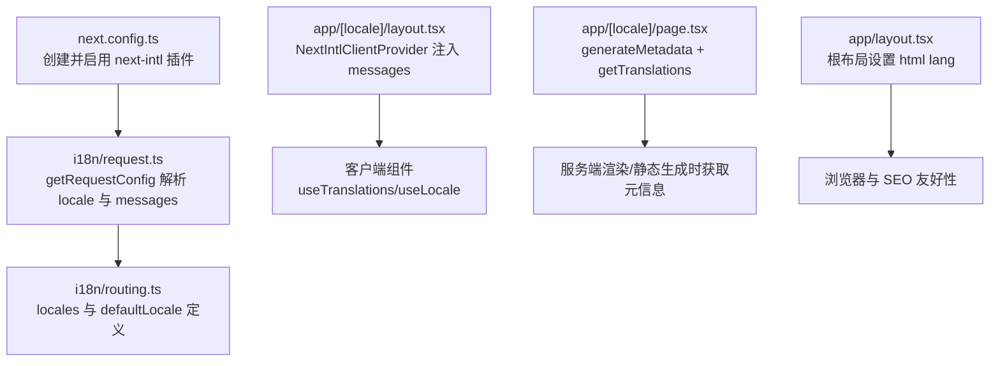
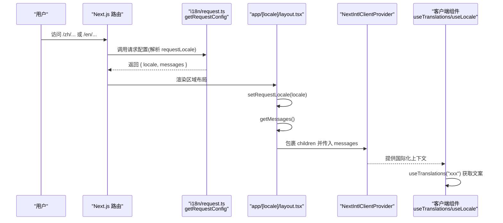
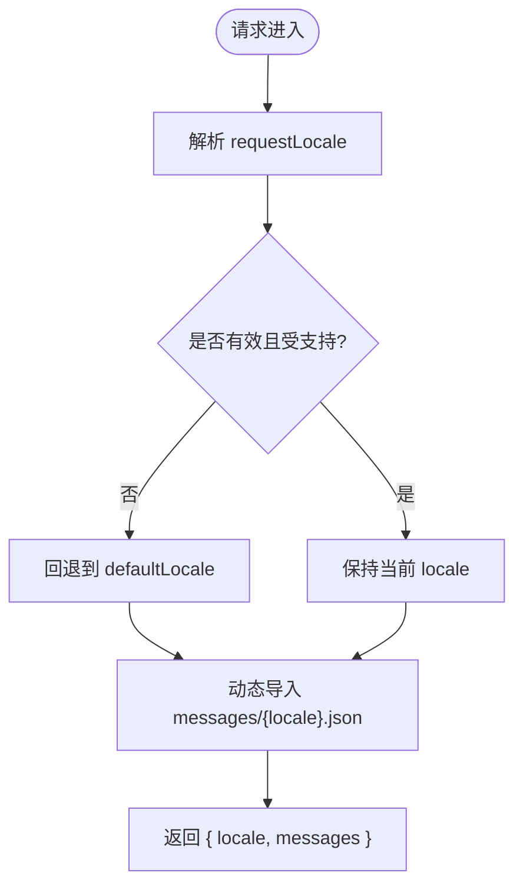
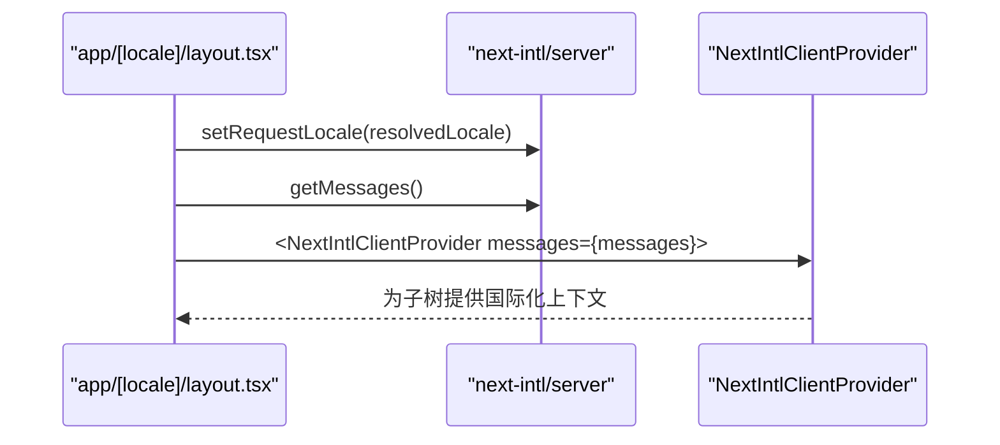
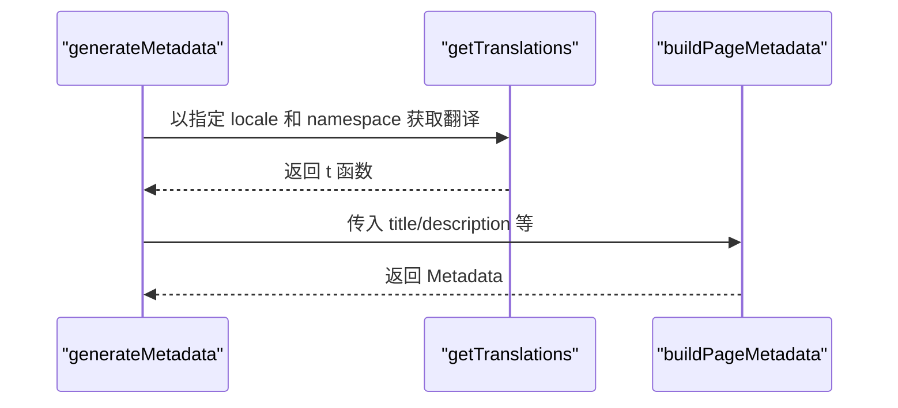
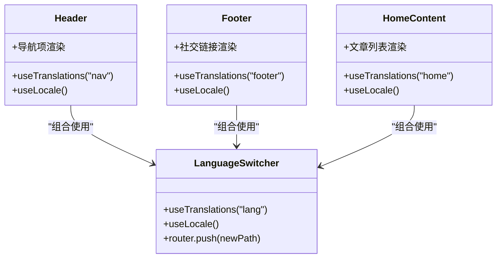
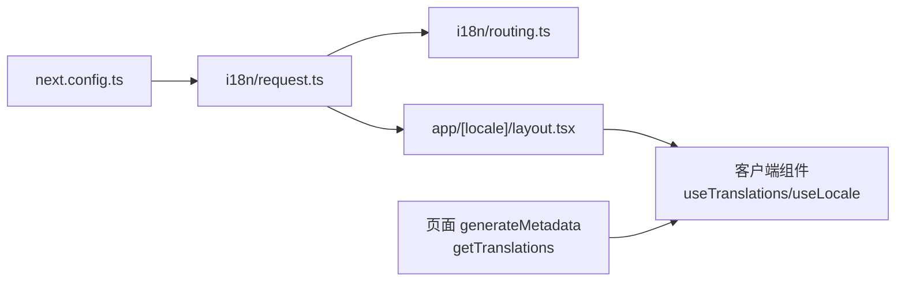

# 请求上下文管理

<cite>
**本文引用的文件**
- [i18n/request.ts](file://i18n/request.ts)
- [i18n/routing.ts](file://i18n/routing.ts)
- [next.config.ts](file://next.config.ts)
- [app/layout.tsx](file://app/layout.tsx)
- [app/[locale]/layout.tsx](file://app/[locale]/layout.tsx)
- [app/[locale]/page.tsx](file://app/[locale]/page.tsx)
- [app/[locale]/blog/page.tsx](file://app/[locale]/blog/page.tsx)
- [components/layout/header.tsx](file://components/layout/header.tsx)
- [components/layout/footer.tsx](file://components/layout/footer.tsx)
- [components/layout/language-switcher.tsx](file://components/layout/language-switcher.tsx)
- [components/home/home-content.tsx](file://components/home/home-content.tsx)
- [app/[locale]/not-found.tsx](file://app/[locale]/not-found.tsx)
- [messages/en.json](file://messages/en.json)
</cite>

## 目录
1. [简介](#简介)
2. [项目结构](#项目结构)
3. [核心组件](#核心组件)
4. [架构总览](#架构总览)
5. [详细组件分析](#详细组件分析)
6. [依赖关系分析](#依赖关系分析)
7. [性能考量](#性能考量)
8. [故障排查指南](#故障排查指南)
9. [结论](#结论)
10. [附录：使用示例与最佳实践](#附录使用示例与最佳实践)

## 简介
本文件围绕 next-intl 的请求上下文管理，系统性解析该项目的国际化实现。重点包括：
- 请求配置与路由定义（getRequestConfig、defineRouting）
- 服务器端翻译加载（getTranslations、setRequestLocale、getMessages）
- 客户端上下文注入（NextIntlClientProvider）
- 在服务器组件与客户端组件中访问国际化数据的方式
- 异步翻译加载流程与错误边界处理建议
- 中间件执行顺序与性能优化策略
- 不同场景下的上下文使用方法与代码片段路径

## 项目结构
本项目采用基于路由前缀的多语言方案，通过 next-intl 的插件机制将 i18n 能力接入 Next.js 构建与运行期。关键位置如下：
- 国际化配置入口：i18n/request.ts、i18n/routing.ts
- Next.js 根布局与区域布局：app/layout.tsx、app/[locale]/layout.tsx
- 页面级元信息与数据准备：app/[locale]/page.tsx、app/[locale]/blog/page.tsx
- 客户端组件中的国际化 Hook：components/layout/header.tsx、footer.tsx、language-switcher.tsx、home-content.tsx
- 国际化消息资源：messages/en.json、messages/zh.json
- 插件注册与部署相关配置：next.config.ts

图示来源
- [next.config.ts:1-38](file://next.config.ts#L1-L38)
- [i18n/request.ts:1-15](file://i18n/request.ts#L1-L15)
- [i18n/routing.ts:1-6](file://i18n/routing.ts#L1-L6)
- [app/[locale]/layout.tsx:1-64](file://app/[locale]/layout.tsx#L1-L64)
- [app/[locale]/page.tsx:1-37](file://app/[locale]/page.tsx#L1-L37)
- [app/layout.tsx:93-114](file://app/layout.tsx#L93-L114)

章节来源
- [next.config.ts:1-38](file://next.config.ts#L1-L38)
- [i18n/request.ts:1-15](file://i18n/request.ts#L1-L15)
- [i18n/routing.ts:1-6](file://i18n/routing.ts#L1-L6)
- [app/[locale]/layout.tsx:1-64](file://app/[locale]/layout.tsx#L1-L64)
- [app/layout.tsx:93-114](file://app/layout.tsx#L93-L114)

## 核心组件
- 请求配置（Server）
  - getRequestConfig：解析请求 locale，动态导入对应 messages，返回 { locale, messages }
  - routing：声明支持的语言列表与默认语言
- 布局与 Provider（Server → Client）
  - app/[locale]/layout.tsx：校验 locale、设置请求语言、获取 messages，并通过 NextIntlClientProvider 注入到客户端
- 页面与元信息（Server）
  - generateMetadata 中使用 getTranslations 获取命名空间下的翻译，用于构建页面元信息
- 客户端组件（Client）
  - useTranslations、useLocale 在客户端组件中读取当前语言与翻译文本
  - LanguageSwitcher 通过 router.push 切换语言前缀

章节来源
- [i18n/request.ts:1-15](file://i18n/request.ts#L1-L15)
- [i18n/routing.ts:1-6](file://i18n/routing.ts#L1-L6)
- [app/[locale]/layout.tsx:1-64](file://app/[locale]/layout.tsx#L1-L64)
- [app/[locale]/page.tsx:1-37](file://app/[locale]/page.tsx#L1-L37)
- [components/layout/header.tsx:1-270](file://components/layout/header.tsx#L1-L270)
- [components/layout/footer.tsx:1-81](file://components/layout/footer.tsx#L1-L81)
- [components/layout/language-switcher.tsx:1-53](file://components/layout/language-switcher.tsx#L1-L53)

## 架构总览
下图展示了从请求进入、语言解析、消息加载到客户端渲染的完整链路。

图示来源
- [i18n/request.ts:1-15](file://i18n/request.ts#L1-L15)
- [app/[locale]/layout.tsx:1-64](file://app/[locale]/layout.tsx#L1-L64)

## 详细组件分析

### 请求配置与路由（Server）
- 路由定义
  - defineRouting 声明 locales 与 defaultLocale，作为语言白名单与回退策略依据
- 请求配置
  - getRequestConfig 接收 requestLocale，若未解析或未在白名单内则回退至 defaultLocale
  - 动态 import 对应 messages/*.json，避免打包无关语言包
  - 返回 { locale, messages } 供后续布局与页面使用

图示来源
- [i18n/request.ts:1-15](file://i18n/request.ts#L1-L15)
- [i18n/routing.ts:1-6](file://i18n/routing.ts#L1-L6)

章节来源
- [i18n/request.ts:1-15](file://i18n/request.ts#L1-L15)
- [i18n/routing.ts:1-6](file://i18n/routing.ts#L1-L6)

### 区域布局与 Provider 注入（Server → Client）
- 校验 locale：不在路由白名单则触发 notFound
- 设置请求语言：setRequestLocale 确保服务端渲染期间可正确读取当前语言
- 获取消息：getMessages 从请求配置中取得已解析的 messages
- 注入上下文：NextIntlClientProvider 将 messages 提供给所有子组件

图示来源
- [app/[locale]/layout.tsx:1-64](file://app/[locale]/layout.tsx#L1-L64)

章节来源
- [app/[locale]/layout.tsx:1-64](file://app/[locale]/layout.tsx#L1-L64)

### 页面元信息与 getTranslations（Server）
- generateMetadata 中通过 getTranslations({ locale, namespace }) 获取特定命名空间的翻译
- 结合 buildPageMetadata 构造页面的 title/description 等元信息
- 典型页面：首页与博客列表页均使用该模式

图示来源
- [app/[locale]/page.tsx:1-37](file://app/[locale]/page.tsx#L1-L37)
- [app/[locale]/blog/page.tsx:1-34](file://app/[locale]/blog/page.tsx#L1-L34)

章节来源
- [app/[locale]/page.tsx:1-37](file://app/[locale]/page.tsx#L1-L37)
- [app/[locale]/blog/page.tsx:1-34](file://app/[locale]/blog/page.tsx#L1-L34)

### 客户端组件中的国际化（Client）
- Header/Footer/HomeContent 等组件通过 useTranslations 与 useLocale 读取当前语言与文案
- LanguageSwitcher 通过 router.push 切换语言前缀，完成客户端导航

图示来源
- [components/layout/header.tsx:1-270](file://components/layout/header.tsx#L1-L270)
- [components/layout/footer.tsx:1-81](file://components/layout/footer.tsx#L1-L81)
- [components/home/home-content.tsx:1-261](file://components/home/home-content.tsx#L1-L261)
- [components/layout/language-switcher.tsx:1-53](file://components/layout/language-switcher.tsx#L1-L53)

章节来源
- [components/layout/header.tsx:1-270](file://components/layout/header.tsx#L1-L270)
- [components/layout/footer.tsx:1-81](file://components/layout/footer.tsx#L1-L81)
- [components/home/home-content.tsx:1-261](file://components/home/home-content.tsx#L1-L261)
- [components/layout/language-switcher.tsx:1-53](file://components/layout/language-switcher.tsx#L1-L53)

### 根布局与 HTML 语言属性
- 根布局根据 locale 设置 html lang，提升 SEO 与无障碍体验
- 字体变量与全局样式在根布局中统一注入

章节来源
- [app/layout.tsx:93-114](file://app/layout.tsx#L93-L114)

### 404 页面与国际化
- 404 页面为客户端组件，使用 useTranslations 与 useLocale 展示多语言提示与返回首页链接

章节来源
- [app/[locale]/not-found.tsx:1-33](file://app/[locale]/not-found.tsx#L1-L33)

## 依赖关系分析
- 插件注册：next.config.ts 通过 createNextIntlPlugin 引入 i18n/request.ts
- 请求阶段：i18n/request.ts 依赖 i18n/routing.ts 的 locales 与 defaultLocale
- 渲染阶段：app/[locale]/layout.tsx 依赖 next-intl/server 的 getMessages、setRequestLocale，以及 next-intl 的 NextIntlClientProvider
- 页面阶段：各页面在 generateMetadata 中调用 getTranslations 获取命名空间翻译
- 客户端阶段：组件通过 useTranslations/useLocale 消费上下文

图示来源
- [next.config.ts:1-38](file://next.config.ts#L1-L38)
- [i18n/request.ts:1-15](file://i18n/request.ts#L1-L15)
- [i18n/routing.ts:1-6](file://i18n/routing.ts#L1-L6)
- [app/[locale]/layout.tsx:1-64](file://app/[locale]/layout.tsx#L1-L64)
- [app/[locale]/page.tsx:1-37](file://app/[locale]/page.tsx#L1-L37)

章节来源
- [next.config.ts:1-38](file://next.config.ts#L1-L38)
- [i18n/request.ts:1-15](file://i18n/request.ts#L1-L15)
- [i18n/routing.ts:1-6](file://i18n/routing.ts#L1-L6)
- [app/[locale]/layout.tsx:1-64](file://app/[locale]/layout.tsx#L1-L64)
- [app/[locale]/page.tsx:1-37](file://app/[locale]/page.tsx#L1-L37)

## 性能考量
- 按需加载消息：i18n/request.ts 使用动态 import 仅加载当前语言的 messages，减少首屏体积
- 静态参数预生成：app/[locale]/layout.tsx 的 generateStaticParams 为每个 locale 生成静态路径，利于缓存与快速响应
- 请求语言设置：在布局与页面中尽早调用 setRequestLocale，避免重复解析
- 客户端 Hook 复用：useTranslations 与 useLocale 在组件树中共享上下文，避免重复计算
- 构建产物优化：next.config.ts 开启 export 与 trailingSlash，配合静态资源前缀策略，有利于 CDN 缓存与部署效率

[本节为通用性能建议，不直接分析具体文件]

## 故障排查指南
- 语言未生效
  - 检查路由白名单与默认语言配置是否正确
  - 确认布局中是否调用了 setRequestLocale 与 getMessages
  - 确认 NextIntlClientProvider 是否包裹了需要国际化的组件
- 404 页面未显示
  - 确认路由前缀是否存在于 locales 列表中
  - 检查 not-found 是否在正确的 [locale] 目录下
- 客户端 Hook 报错
  - 确认组件位于 NextIntlClientProvider 之下
  - 确认组件标记为客户端组件（"use client"）
- 元信息不正确
  - 检查 generateMetadata 中 getTranslations 的 namespace 是否与 messages 结构一致
  - 确认 locale 传递正确

章节来源
- [i18n/routing.ts:1-6](file://i18n/routing.ts#L1-L6)
- [app/[locale]/layout.tsx:1-64](file://app/[locale]/layout.tsx#L1-L64)
- [app/[locale]/not-found.tsx:1-33](file://app/[locale]/not-found.tsx#L1-L33)
- [app/[locale]/page.tsx:1-37](file://app/[locale]/page.tsx#L1-L37)

## 结论
该项目通过 next-intl 的插件化集成，实现了清晰的分层：
- 请求阶段：解析语言、加载消息
- 布局阶段：设置请求语言、注入 Provider
- 页面阶段：在服务端获取命名空间翻译用于元信息
- 客户端阶段：通过 Hook 消费上下文进行渲染与交互
整体设计简洁高效，具备良好的可扩展性与可维护性。

[本节为总结性内容，不直接分析具体文件]

## 附录：使用示例与最佳实践
- 在服务器组件中获取命名空间翻译（用于元信息）
  - 参考路径：[app/[locale]/page.tsx:13-25](file://app/[locale]/page.tsx#L13-L25)、[app/[locale]/blog/page.tsx:11-23](file://app/[locale]/blog/page.tsx#L11-L23)
- 在布局中设置请求语言并注入 Provider
  - 参考路径：[app/[locale]/layout.tsx:27-43](file://app/[locale]/layout.tsx#L27-L43)
- 在客户端组件中使用 useTranslations 与 useLocale
  - 参考路径：[components/layout/header.tsx:25-28](file://components/layout/header.tsx#L25-L28)、[components/layout/footer.tsx:12-15](file://components/layout/footer.tsx#L12-L15)、[components/home/home-content.tsx:28-32](file://components/home/home-content.tsx#L28-L32)
- 客户端语言切换
  - 参考路径：[components/layout/language-switcher.tsx:19-29](file://components/layout/language-switcher.tsx#L19-L29)
- 根布局设置 html lang
  - 参考路径：[app/layout.tsx:100-112](file://app/layout.tsx#L100-L112)
- 国际化消息结构
  - 参考路径：[messages/en.json:1-168](file://messages/en.json#L1-L168)

[本节为使用指引，不直接分析具体文件]