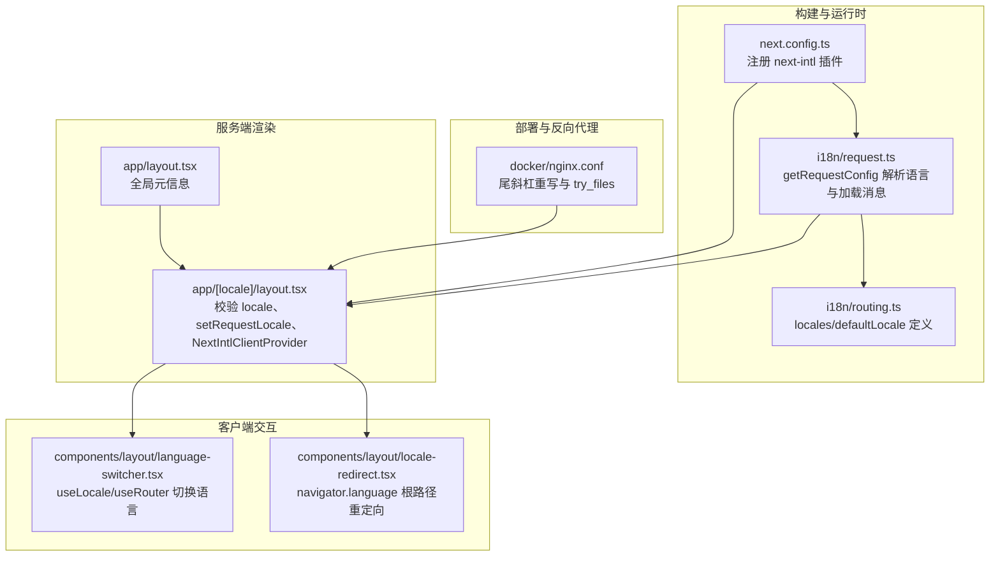
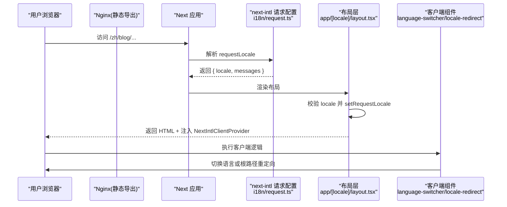
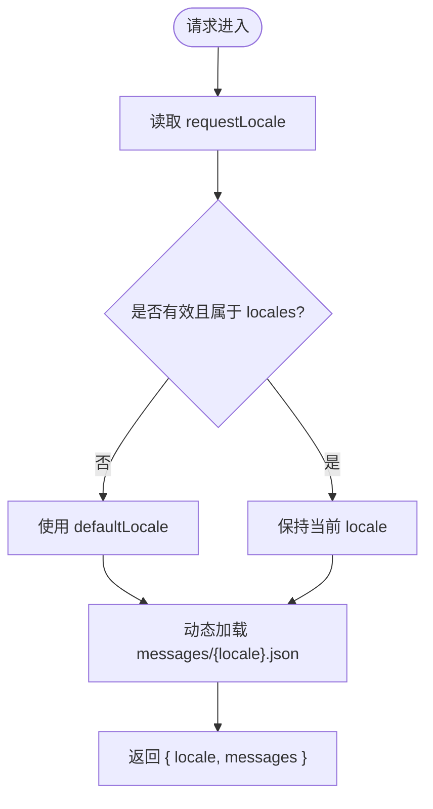
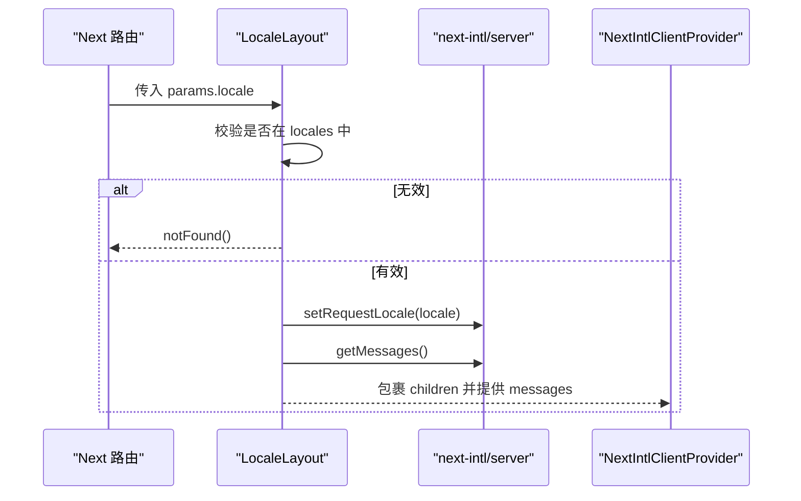
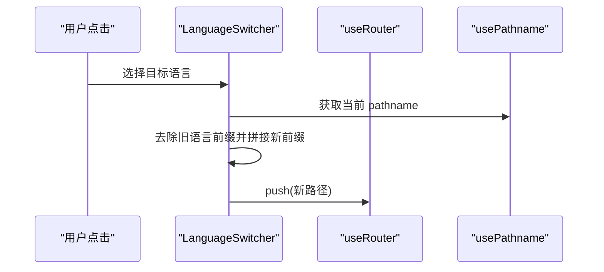
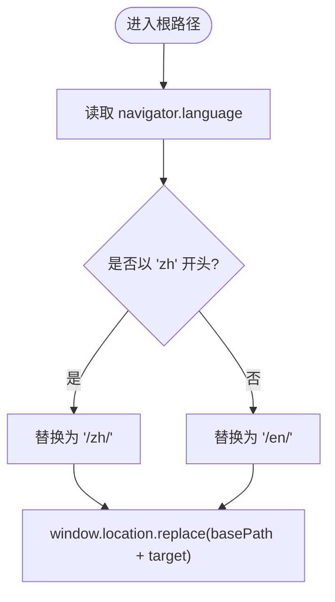
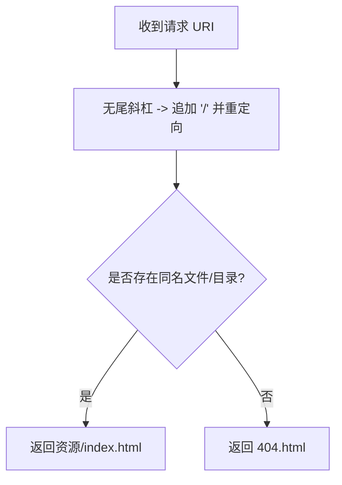
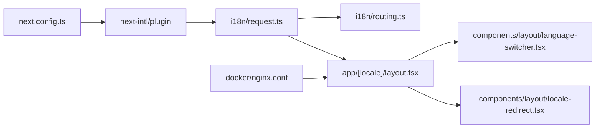

# 路由中间件

<cite>
**本文引用的文件**   
- [i18n/request.ts](file://i18n/request.ts)
- [i18n/routing.ts](file://i18n/routing.ts)
- [next.config.ts](file://next.config.ts)
- [app/[locale]/layout.tsx](file://app/[locale]/layout.tsx)
- [app/layout.tsx](file://app/layout.tsx)
- [components/layout/language-switcher.tsx](file://components/layout/language-switcher.tsx)
- [components/layout/locale-redirect.tsx](file://components/layout/locale-redirect.tsx)
- [docker/nginx.conf](file://docker/nginx.conf)
</cite>

## 目录
1. [简介](#简介)
2. [项目结构](#项目结构)
3. [核心组件](#核心组件)
4. [架构总览](#架构总览)
5. [详细组件分析](#详细组件分析)
6. [依赖关系分析](#依赖关系分析)
7. [性能考量](#性能考量)
8. [故障排查指南](#故障排查指南)
9. [结论](#结论)
10. [附录](#附录)

## 简介
本文件围绕 next-intl 在该 Next.js 项目中的“路由中间件”能力进行系统化说明。需要特别说明的是：该项目并未使用 Next.js 的 middleware.ts 文件，而是通过 next-intl 提供的插件与请求配置完成语言解析、消息加载与客户端渲染注入。整体流程包括：
- 构建期/运行期注册 next-intl 插件并指向请求配置
- 请求进入时由 next-intl 解析 locale（基于 URL 参数）
- 在布局层校验 locale 并启用静态渲染
- 客户端提供语言切换与根路径浏览器语言重定向

本项目未实现 Cookie 存储或服务器端用户偏好持久化；语言选择通过 URL 前缀传递，并在客户端做首次访问时的浏览器语言跳转。

## 项目结构
与路由中间件相关的核心位置如下：
- i18n 配置：定义路由语言集合、默认语言以及请求级语言解析与消息加载
- 应用布局：校验 locale、设置请求语言、注入国际化上下文
- 客户端组件：语言切换器与根路径浏览器语言重定向
- 构建配置：注册 next-intl 插件并暴露环境变量
- Nginx 规则：静态导出下的规范化尾斜杠与 try_files 策略

图示来源
- [next.config.ts:1-38](file://next.config.ts#L1-L38)
- [i18n/request.ts:1-15](file://i18n/request.ts#L1-L15)
- [i18n/routing.ts:1-6](file://i18n/routing.ts#L1-L6)
- [app/[locale]/layout.tsx:1-64](file://app/[locale]/layout.tsx#L1-L64)
- [components/layout/language-switcher.tsx:1-53](file://components/layout/language-switcher.tsx#L1-L53)
- [components/layout/locale-redirect.tsx:1-19](file://components/layout/locale-redirect.tsx#L1-L19)
- [docker/nginx.conf:87-95](file://docker/nginx.conf#L87-L95)

章节来源
- [next.config.ts:1-38](file://next.config.ts#L1-L38)
- [i18n/request.ts:1-15](file://i18n/request.ts#L1-L15)
- [i18n/routing.ts:1-6](file://i18n/routing.ts#L1-L6)
- [app/[locale]/layout.tsx:1-64](file://app/[locale]/layout.tsx#L1-L64)
- [components/layout/language-switcher.tsx:1-53](file://components/layout/language-switcher.tsx#L1-L53)
- [components/layout/locale-redirect.tsx:1-19](file://components/layout/locale-redirect.tsx#L1-L19)
- [docker/nginx.conf:87-95](file://docker/nginx.conf#L87-L95)

## 核心组件
- 请求配置（next-intl 插件入口）
  - 作用：接收请求，解析出当前 locale，并动态加载对应语言包
  - 关键点：当 URL 中 locale 不在允许列表或缺失时，回退到默认语言
- 路由定义
  - 作用：声明支持的语言集合与默认语言
- 布局层（[locale]）
  - 作用：校验 locale、启用静态渲染、注入 NextIntlClientProvider
- 客户端语言切换器
  - 作用：基于 useLocale 与 useRouter 更新 URL 前缀以切换语言
- 根路径浏览器语言重定向
  - 作用：在根路径下根据 navigator.language 跳转到 /zh/ 或 /en/
- 构建配置
  - 作用：注册 next-intl 插件，暴露 NEXT_PUBLIC_BASE_PATH 等环境变量
- Nginx 规则
  - 作用：静态导出下统一尾斜杠与资源定位

章节来源
- [i18n/request.ts:1-15](file://i18n/request.ts#L1-L15)
- [i18n/routing.ts:1-6](file://i18n/routing.ts#L1-L6)
- [app/[locale]/layout.tsx:1-64](file://app/[locale]/layout.tsx#L1-L64)
- [components/layout/language-switcher.tsx:1-53](file://components/layout/language-switcher.tsx#L1-L53)
- [components/layout/locale-redirect.tsx:1-19](file://components/layout/locale-redirect.tsx#L1-L19)
- [next.config.ts:1-38](file://next.config.ts#L1-L38)
- [docker/nginx.conf:87-95](file://docker/nginx.conf#L87-L95)

## 架构总览
下图展示了从请求进入到页面渲染的关键链路，重点体现 next-intl 的请求配置、布局层校验与客户端语言切换。

图示来源
- [i18n/request.ts:1-15](file://i18n/request.ts#L1-L15)
- [app/[locale]/layout.tsx:1-64](file://app/[locale]/layout.tsx#L1-L64)
- [components/layout/language-switcher.tsx:1-53](file://components/layout/language-switcher.tsx#L1-L53)
- [components/layout/locale-redirect.tsx:1-19](file://components/layout/locale-redirect.tsx#L1-L19)
- [docker/nginx.conf:87-95](file://docker/nginx.conf#L87-L95)

## 详细组件分析

### 请求配置与语言解析（next-intl 插件）
- 插件注册
  - 在构建配置中通过 createNextIntlPlugin 指定请求配置文件路径
- 请求配置
  - 使用 getRequestConfig 获取 requestLocale（来自 URL 参数）
  - 若缺失或不在 locales 列表中，则回退到 defaultLocale
  - 动态导入对应语言包 messages/{locale}.json
- 影响范围
  - 该配置在服务端渲染阶段生效，为布局与页面提供 getMessages/getTranslations 能力

图示来源
- [i18n/request.ts:1-15](file://i18n/request.ts#L1-L15)
- [i18n/routing.ts:1-6](file://i18n/routing.ts#L1-L6)
- [next.config.ts:1-38](file://next.config.ts#L1-L38)

章节来源
- [i18n/request.ts:1-15](file://i18n/request.ts#L1-L15)
- [i18n/routing.ts:1-6](file://i18n/routing.ts#L1-L6)
- [next.config.ts:1-38](file://next.config.ts#L1-L38)

### 布局层校验与客户端提供者注入
- 校验 locale
  - 若不在 routing.locales 中，直接触发 notFound
- 启用静态渲染
  - 调用 setRequestLocale 使后续 getMessages 走静态路径
- 注入国际化上下文
  - 使用 NextIntlClientProvider 包裹应用树，供客户端 useLocale/useTranslations 使用

图示来源
- [app/[locale]/layout.tsx:1-64](file://app/[locale]/layout.tsx#L1-L64)

章节来源
- [app/[locale]/layout.tsx:1-64](file://app/[locale]/layout.tsx#L1-L64)

### 客户端语言切换器
- 行为
  - 读取当前 useLocale 与 usePathname
  - 去除原 URL 中的语言前缀后拼接新语言前缀，并通过 router.push 导航
- 适用场景
  - 任意页面内切换语言，URL 即状态源

图示来源
- [components/layout/language-switcher.tsx:1-53](file://components/layout/language-switcher.tsx#L1-L53)

章节来源
- [components/layout/language-switcher.tsx:1-53](file://components/layout/language-switcher.tsx#L1-L53)

### 根路径浏览器语言重定向
- 行为
  - 在根路径下读取 navigator.language，匹配 zh 则跳转 /zh/，否则 /en/
  - 使用 window.location.replace 避免历史栈污染
- 注意
  - 仅对根路径生效，子路径不会重复重定向
  - 受 NEXT_PUBLIC_BASE_PATH 影响，需考虑部署子路径场景

图示来源
- [components/layout/locale-redirect.tsx:1-19](file://components/layout/locale-redirect.tsx#L1-L19)
- [next.config.ts:30-35](file://next.config.ts#L30-L35)

章节来源
- [components/layout/locale-redirect.tsx:1-19](file://components/layout/locale-redirect.tsx#L1-L19)
- [next.config.ts:30-35](file://next.config.ts#L30-L35)

### 部署与反向代理（Nginx）
- 尾斜杠规范
  - 将不带尾斜杠的路径永久重定向到带尾斜杠形式，保证静态导出目录一致性
- 资源定位
  - try_files 优先精确匹配，再尝试 index.html，最后 404

图示来源
- [docker/nginx.conf:87-95](file://docker/nginx.conf#L87-L95)

章节来源
- [docker/nginx.conf:87-95](file://docker/nginx.conf#L87-L95)

## 依赖关系分析
- 构建配置依赖 next-intl 插件，并将请求配置路径注入
- 请求配置依赖路由定义（locales/defaultLocale）
- 布局层依赖 next-intl/server 的 setRequestLocale 与 getMessages
- 客户端组件依赖 next-intl 的 useLocale/useTranslations 与 next/navigation 的 useRouter/usePathname
- Nginx 与 Next 静态导出配合，确保 URL 尾斜杠与资源定位一致

图示来源
- [next.config.ts:1-38](file://next.config.ts#L1-L38)
- [i18n/request.ts:1-15](file://i18n/request.ts#L1-L15)
- [i18n/routing.ts:1-6](file://i18n/routing.ts#L1-L6)
- [app/[locale]/layout.tsx:1-64](file://app/[locale]/layout.tsx#L1-L64)
- [components/layout/language-switcher.tsx:1-53](file://components/layout/language-switcher.tsx#L1-L53)
- [components/layout/locale-redirect.tsx:1-19](file://components/layout/locale-redirect.tsx#L1-L19)
- [docker/nginx.conf:87-95](file://docker/nginx.conf#L87-L95)

章节来源
- [next.config.ts:1-38](file://next.config.ts#L1-L38)
- [i18n/request.ts:1-15](file://i18n/request.ts#L1-L15)
- [i18n/routing.ts:1-6](file://i18n/routing.ts#L1-L6)
- [app/[locale]/layout.tsx:1-64](file://app/[locale]/layout.tsx#L1-L64)
- [components/layout/language-switcher.tsx:1-53](file://components/layout/language-switcher.tsx#L1-L53)
- [components/layout/locale-redirect.tsx:1-19](file://components/layout/locale-redirect.tsx#L1-L19)
- [docker/nginx.conf:87-95](file://docker/nginx.conf#L87-L95)

## 性能考量
- 静态渲染
  - 布局层调用 setRequestLocale 可启用静态渲染路径，减少运行时开销
- 动态导入消息
  - 请求配置按 locale 动态导入 messages 文件，避免一次性加载全部语言包
- 客户端重定向
  - 根路径重定向发生在客户端，会增加一次额外导航；建议在 SEO 友好的场景下结合服务端重定向或约定式路由
- 静态导出与 Nginx
  - 统一的尾斜杠与 try_files 可减少不必要的重定向与缓存失效

## 故障排查指南
- 现象：访问 /blog 被重定向到 /blog/
  - 原因：Nginx 强制尾斜杠
  - 处理：确认期望行为；如需取消，调整 Nginx rewrite 规则
- 现象：未知语言路径显示 404
  - 原因：布局层校验 locale 不在 locales 中
  - 处理：检查路由定义与 URL 前缀是否正确
- 现象：根路径未正确跳转到 /zh/ 或 /en/
  - 原因：navigator.language 不匹配或 NEXT_PUBLIC_BASE_PATH 配置不一致
  - 处理：核对部署模式与 BASE_PATH 环境变量
- 现象：切换语言后内容未刷新
  - 原因：客户端未正确更新 URL 前缀
  - 处理：检查 language-switcher 的路径拼接逻辑

章节来源
- [docker/nginx.conf:87-95](file://docker/nginx.conf#L87-L95)
- [app/[locale]/layout.tsx:1-64](file://app/[locale]/layout.tsx#L1-L64)
- [components/layout/locale-redirect.tsx:1-19](file://components/layout/locale-redirect.tsx#L1-L19)
- [components/layout/language-switcher.tsx:1-53](file://components/layout/language-switcher.tsx#L1-L53)
- [next.config.ts:30-35](file://next.config.ts#L30-L35)

## 结论
本项目采用 next-intl 的请求配置与布局层组合实现多语言路由，语言状态完全由 URL 前缀驱动，具备以下特点：
- 简洁可靠：无需中间件文件，通过插件与请求配置即可工作
- 易于调试：语言状态显式体现在 URL，便于追踪与分享
- 可扩展性强：新增语言只需扩展路由定义与消息文件，并在客户端组件中补充选项

若未来需要更复杂的语言决策（如 Cookie/LocalStorage 偏好、A/B 测试），可在现有基础上引入客户端持久化或服务端中间件增强。

## 附录

### 自定义中间件示例（概念性）
以下为概念性步骤，用于在现有方案之上增加“Cookie 存储用户语言偏好”的能力（非仓库现有实现）：
- 在请求配置中读取 Cookie 中的语言键，若存在且合法则优先使用
- 若不存在，则回退到 URL 参数或默认语言
- 在响应头中写入 Cookie，以便下次请求复用
- 在客户端语言切换成功后，同步写入本地存储或 Cookie

注意：当前仓库未包含此类实现，上述仅为扩展思路。