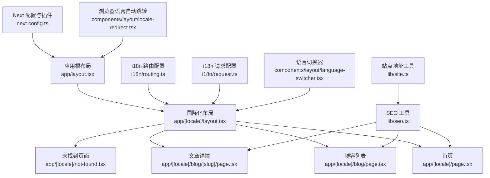
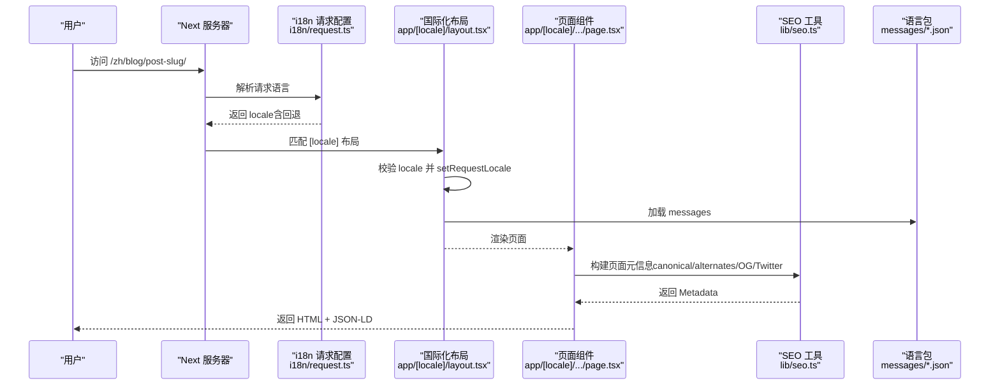
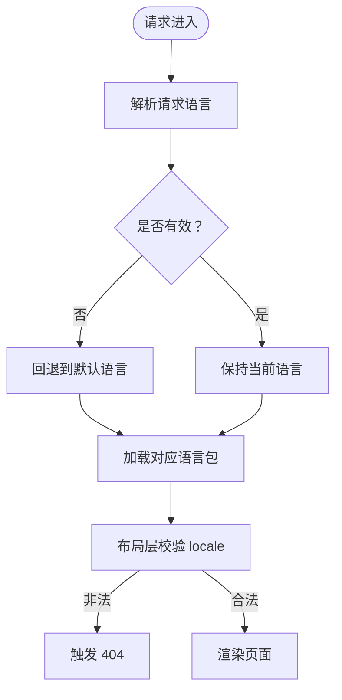
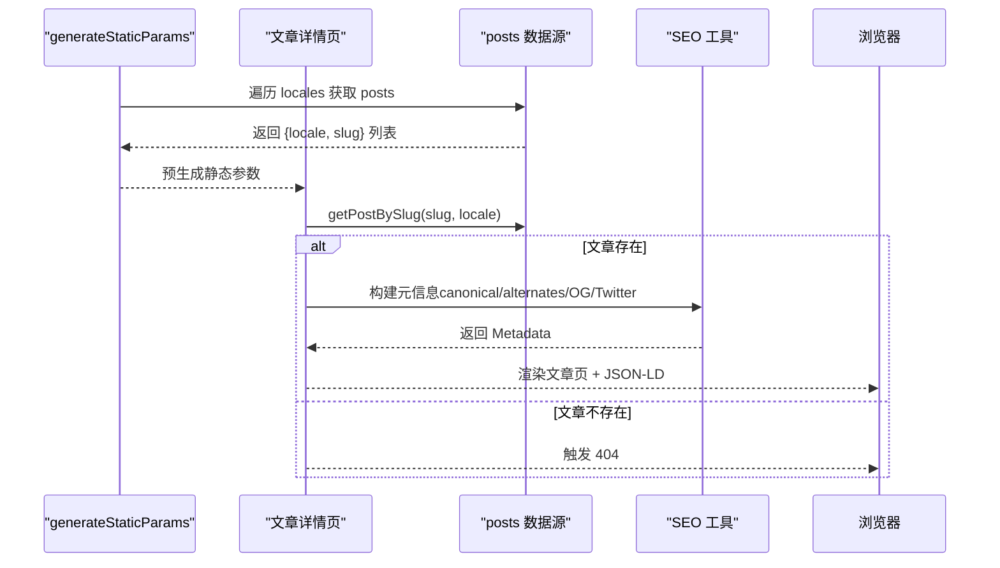
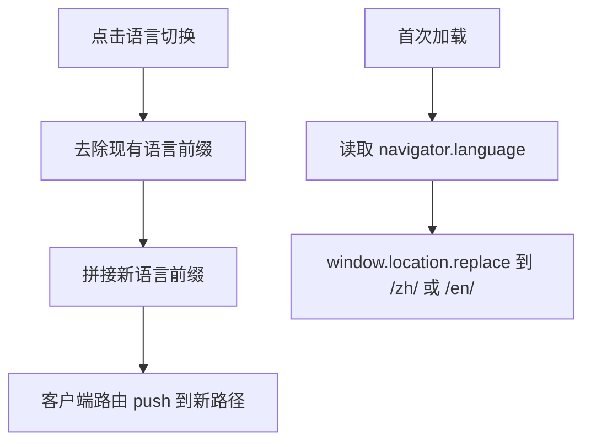
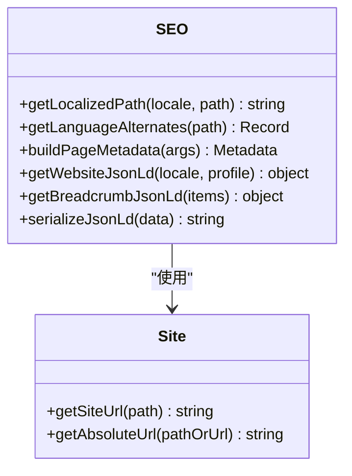
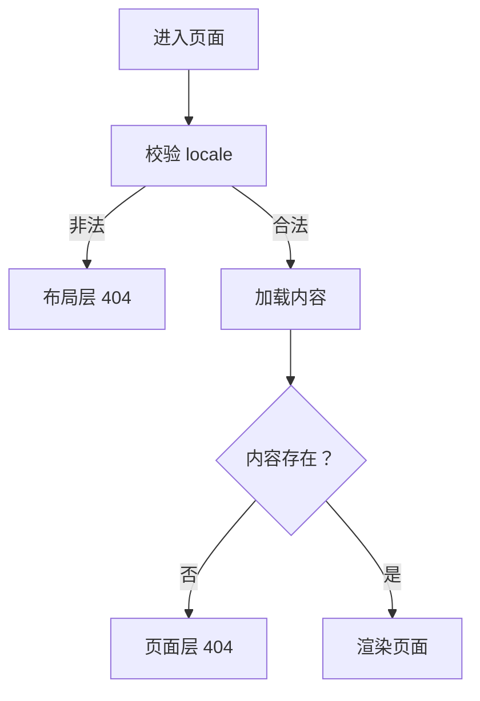
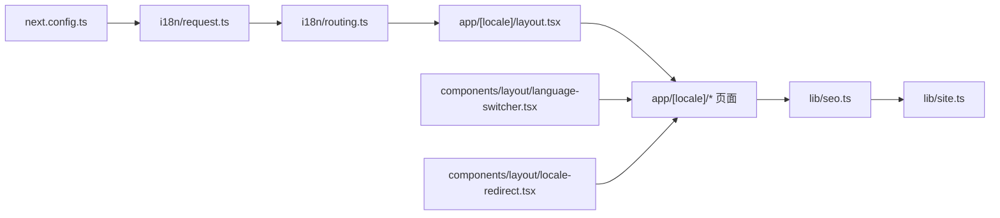

# 路由系统设计

<cite>
**本文引用的文件**
- [app/layout.tsx](file://app/layout.tsx)
- [app/[locale]/layout.tsx](file://app/[locale]/layout.tsx)
- [app/[locale]/page.tsx](file://app/[locale]/page.tsx)
- [app/[locale]/blog/page.tsx](file://app/[locale]/blog/page.tsx)
- [app/[locale]/blog/[slug]/page.tsx](file://app/[locale]/blog/[slug]/page.tsx)
- [app/[locale]/not-found.tsx](file://app/[locale]/not-found.tsx)
- [i18n/routing.ts](file://i18n/routing.ts)
- [i18n/request.ts](file://i18n/request.ts)
- [next.config.ts](file://next.config.ts)
- [components/layout/locale-redirect.tsx](file://components/layout/locale-redirect.tsx)
- [components/layout/language-switcher.tsx](file://components/layout/language-switcher.tsx)
- [lib/seo.ts](file://lib/seo.ts)
- [lib/site.ts](file://lib/site.ts)
- [messages/en.json](file://messages/en.json)
- [messages/zh.json](file://messages/zh.json)
</cite>

## 目录
1. [简介](#简介)
2. [项目结构](#项目结构)
3. [核心组件](#核心组件)
4. [架构总览](#架构总览)
5. [详细组件分析](#详细组件分析)
6. [依赖分析](#依赖分析)
7. [性能考虑](#性能考虑)
8. [故障排查指南](#故障排查指南)
9. [结论](#结论)
10. [附录：新增国际化页面与自定义路由实践](#附录新增国际化页面与自定义路由实践)

## 简介
本设计文档聚焦于基于 Next.js App Router 的国际化路由系统，围绕语言前缀路由策略、动态路由参数处理、请求上下文管理、SEO 友好的 URL 结构设计、重定向逻辑与错误处理机制展开。文档同时提供可操作的实践指引，帮助开发者快速添加新的国际化页面与自定义路由逻辑。

## 项目结构
该博客采用“按功能+层级”的组织方式：
- 顶层布局 app/layout.tsx 负责全局元信息、字体与 html/body 根节点。
- 国际化子树 app/[locale] 通过动态段 [locale] 实现语言前缀路由，内部包含各业务页面与布局。
- i18n 配置集中在 i18n 目录，定义支持的语言、默认语言以及请求级语言解析与消息加载。
- SEO 与站点地址工具位于 lib 目录，统一生成 canonical、alternates、OpenGraph、Twitter Card 等元数据。
- 客户端语言切换与自动跳转在 components/layout 中实现。

图表来源
- [app/layout.tsx:1-114](file://app/layout.tsx#L1-L114)
- [app/[locale]/layout.tsx:1-64](file://app/[locale]/layout.tsx#L1-L64)
- [app/[locale]/page.tsx:1-37](file://app/[locale]/page.tsx#L1-L37)
- [app/[locale]/blog/page.tsx:1-34](file://app/[locale]/blog/page.tsx#L1-L34)
- [app/[locale]/blog/[slug]/page.tsx:1-180](file://app/[locale]/blog/[slug]/page.tsx#L1-L180)
- [app/[locale]/not-found.tsx:1-33](file://app/[locale]/not-found.tsx#L1-L33)
- [i18n/routing.ts:1-6](file://i18n/routing.ts#L1-L6)
- [i18n/request.ts:1-15](file://i18n/request.ts#L1-L15)
- [next.config.ts:1-38](file://next.config.ts#L1-L38)
- [lib/seo.ts:1-199](file://lib/seo.ts#L1-L199)
- [lib/site.ts:1-35](file://lib/site.ts#L1-L35)
- [components/layout/language-switcher.tsx:1-53](file://components/layout/language-switcher.tsx#L1-L53)
- [components/layout/locale-redirect.tsx:1-19](file://components/layout/locale-redirect.tsx#L1-L19)

章节来源
- [app/layout.tsx:1-114](file://app/layout.tsx#L1-L114)
- [app/[locale]/layout.tsx:1-64](file://app/[locale]/layout.tsx#L1-L64)
- [i18n/routing.ts:1-6](file://i18n/routing.ts#L1-L6)
- [i18n/request.ts:1-15](file://i18n/request.ts#L1-L15)
- [next.config.ts:1-38](file://next.config.ts#L1-L38)
- [lib/seo.ts:1-199](file://lib/seo.ts#L1-L199)
- [lib/site.ts:1-35](file://lib/site.ts#L1-L35)
- [components/layout/language-switcher.tsx:1-53](file://components/layout/language-switcher.tsx#L1-L53)
- [components/layout/locale-redirect.tsx:1-19](file://components/layout/locale-redirect.tsx#L1-L19)

## 核心组件
- 国际化路由配置
  - 定义支持的语言集合与默认语言，供路由匹配与静态参数生成使用。
- 请求级语言解析
  - 从请求上下文解析语言，若缺失或非法则回退到默认语言，并动态加载对应语言包。
- 国际化布局
  - 校验 locale、设置请求语言、注入 next-intl 客户端提供者、渲染主题与基础 UI 骨架。
- 页面级元信息与内容
  - 各页面根据当前 locale 构建 SEO 元信息，并通过 next-intl 获取本地化文案。
- SEO 与站点地址工具
  - 统一生成 canonical、alternates、OG/Twitter 元数据，规范化路径与绝对 URL。
- 客户端语言切换与自动跳转
  - 语言切换器通过客户端路由替换语言前缀；自动跳转根据浏览器语言选择目标语言。

章节来源
- [i18n/routing.ts:1-6](file://i18n/routing.ts#L1-L6)
- [i18n/request.ts:1-15](file://i18n/request.ts#L1-L15)
- [app/[locale]/layout.tsx:1-64](file://app/[locale]/layout.tsx#L1-L64)
- [app/[locale]/page.tsx:1-37](file://app/[locale]/page.tsx#L1-L37)
- [app/[locale]/blog/page.tsx:1-34](file://app/[locale]/blog/page.tsx#L1-L34)
- [app/[locale]/blog/[slug]/page.tsx:1-180](file://app/[locale]/blog/[slug]/page.tsx#L1-L180)
- [lib/seo.ts:1-199](file://lib/seo.ts#L1-L199)
- [lib/site.ts:1-35](file://lib/site.ts#L1-L35)
- [components/layout/language-switcher.tsx:1-53](file://components/layout/language-switcher.tsx#L1-L53)
- [components/layout/locale-redirect.tsx:1-19](file://components/layout/locale-redirect.tsx#L1-L19)

## 架构总览
下图展示了从请求进入、语言解析、路由匹配到页面渲染与 SEO 元数据生成的整体流程。

图表来源
- [i18n/request.ts:1-15](file://i18n/request.ts#L1-L15)
- [app/[locale]/layout.tsx:1-64](file://app/[locale]/layout.tsx#L1-L64)
- [app/[locale]/blog/[slug]/page.tsx:1-180](file://app/[locale]/blog/[slug]/page.tsx#L1-L180)
- [lib/seo.ts:1-199](file://lib/seo.ts#L1-L199)
- [messages/en.json:1-168](file://messages/en.json#L1-L168)
- [messages/zh.json:1-168](file://messages/zh.json#L1-L168)

## 详细组件分析

### 国际化路由与请求上下文
- 语言集合与默认语言由 defineRouting 声明，作为路由匹配与静态参数生成的权威来源。
- 请求级配置在每次请求时解析语言，若缺失或不在支持列表中则回退至默认语言，并动态导入对应语言包。
- 布局层对 locale 进行二次校验，确保非法语言触发 404，避免无效渲染。

图表来源
- [i18n/routing.ts:1-6](file://i18n/routing.ts#L1-L6)
- [i18n/request.ts:1-15](file://i18n/request.ts#L1-L15)
- [app/[locale]/layout.tsx:1-64](file://app/[locale]/layout.tsx#L1-L64)

章节来源
- [i18n/routing.ts:1-6](file://i18n/routing.ts#L1-L6)
- [i18n/request.ts:1-15](file://i18n/request.ts#L1-L15)
- [app/[locale]/layout.tsx:1-64](file://app/[locale]/layout.tsx#L1-L64)

### 动态路由参数处理（文章详情页）
- 使用 generateStaticParams 为所有语言与所有文章 slug 预生成静态参数，提升首屏性能与 SEO。
- 页面函数根据 params.locale 与 params.slug 拉取对应语言的文章数据，不存在则调用 notFound。
- 元信息中包含 canonical、多语言 alternates、OpenGraph、Twitter Card 与结构化数据（JSON-LD）。

图表来源
- [app/[locale]/blog/[slug]/page.tsx:1-180](file://app/[locale]/blog/[slug]/page.tsx#L1-L180)
- [lib/seo.ts:1-199](file://lib/seo.ts#L1-L199)

章节来源
- [app/[locale]/blog/[slug]/page.tsx:1-180](file://app/[locale]/blog/[slug]/page.tsx#L1-L180)
- [lib/seo.ts:1-199](file://lib/seo.ts#L1-L199)

### 语言前缀路由策略与客户端切换
- 语言切换器通过客户端路由将 pathname 中的语言前缀替换为目标语言，保持其余路径不变。
- 自动跳转组件在首次加载时读取浏览器语言，并将用户重定向到对应语言的前缀路径。
- 这些操作均遵循统一的站点地址与 basePath 规则，确保链接正确。

图表来源
- [components/layout/language-switcher.tsx:1-53](file://components/layout/language-switcher.tsx#L1-L53)
- [components/layout/locale-redirect.tsx:1-19](file://components/layout/locale-redirect.tsx#L1-L19)
- [lib/site.ts:1-35](file://lib/site.ts#L1-L35)

章节来源
- [components/layout/language-switcher.tsx:1-53](file://components/layout/language-switcher.tsx#L1-L53)
- [components/layout/locale-redirect.tsx:1-19](file://components/layout/locale-redirect.tsx#L1-L19)
- [lib/site.ts:1-35](file://lib/site.ts#L1-L35)

### SEO 友好的 URL 结构与元数据
- 统一的路径规范化与语言前缀插入，保证 canonical 与 alternates 的一致性。
- 每个页面通过 buildPageMetadata 输出标准化的 OpenGraph、Twitter Card 与 robots 指令。
- 文章页额外输出结构化数据（BlogPosting、BreadcrumbList），增强搜索引擎理解。

图表来源
- [lib/seo.ts:1-199](file://lib/seo.ts#L1-L199)
- [lib/site.ts:1-35](file://lib/site.ts#L1-L35)

章节来源
- [lib/seo.ts:1-199](file://lib/seo.ts#L1-L199)
- [lib/site.ts:1-35](file://lib/site.ts#L1-L35)

### 错误处理机制
- 布局层对非法 locale 直接触发 404，防止无效页面渲染。
- 文章详情页在未找到文章时主动调用 notFound，配合 app/[locale]/not-found.tsx 展示国际化 404 页面。
- 404 页面使用 useLocale 与 next-intl 文案，确保语言一致性。

图表来源
- [app/[locale]/layout.tsx:1-64](file://app/[locale]/layout.tsx#L1-L64)
- [app/[locale]/blog/[slug]/page.tsx:1-180](file://app/[locale]/blog/[slug]/page.tsx#L1-L180)
- [app/[locale]/not-found.tsx:1-33](file://app/[locale]/not-found.tsx#L1-L33)

章节来源
- [app/[locale]/layout.tsx:1-64](file://app/[locale]/layout.tsx#L1-L64)
- [app/[locale]/blog/[slug]/page.tsx:1-180](file://app/[locale]/blog/[slug]/page.tsx#L1-L180)
- [app/[locale]/not-found.tsx:1-33](file://app/[locale]/not-found.tsx#L1-L33)

## 依赖分析
- 配置层
  - next.config.ts 启用 next-intl 插件并指向 i18n/request.ts，同时控制部署模式下的 basePath 与 assetPrefix。
- 路由层
  - i18n/routing.ts 提供语言集合与默认语言；i18n/request.ts 提供请求级语言解析与消息加载。
- 视图层
  - app/[locale]/* 页面依赖 next-intl 服务端 API 与 SEO 工具，统一输出元数据与结构化数据。
- 客户端交互
  - language-switcher 与 locale-redirect 通过客户端路由与环境变量完成语言切换与自动跳转。

图表来源
- [next.config.ts:1-38](file://next.config.ts#L1-L38)
- [i18n/request.ts:1-15](file://i18n/request.ts#L1-L15)
- [i18n/routing.ts:1-6](file://i18n/routing.ts#L1-L6)
- [app/[locale]/layout.tsx:1-64](file://app/[locale]/layout.tsx#L1-L64)
- [lib/seo.ts:1-199](file://lib/seo.ts#L1-L199)
- [lib/site.ts:1-35](file://lib/site.ts#L1-L35)
- [components/layout/language-switcher.tsx:1-53](file://components/layout/language-switcher.tsx#L1-L53)
- [components/layout/locale-redirect.tsx:1-19](file://components/layout/locale-redirect.tsx#L1-L19)

章节来源
- [next.config.ts:1-38](file://next.config.ts#L1-L38)
- [i18n/request.ts:1-15](file://i18n/request.ts#L1-L15)
- [i18n/routing.ts:1-6](file://i18n/routing.ts#L1-L6)
- [app/[locale]/layout.tsx:1-64](file://app/[locale]/layout.tsx#L1-L64)
- [lib/seo.ts:1-199](file://lib/seo.ts#L1-L199)
- [lib/site.ts:1-35](file://lib/site.ts#L1-L35)
- [components/layout/language-switcher.tsx:1-53](file://components/layout/language-switcher.tsx#L1-L53)
- [components/layout/locale-redirect.tsx:1-19](file://components/layout/locale-redirect.tsx#L1-L19)

## 性能考虑
- 静态参数预生成：文章详情页通过 generateStaticParams 为所有语言与文章组合生成静态参数，减少运行时计算与网络请求。
- 按需加载语言包：i18n/request.ts 使用动态 import 仅加载当前语言的消息文件，降低初始包体。
- 资源优化：next.config.ts 针对导出部署模式关闭图片优化，避免不必要的图像处理开销。
- 客户端路由切换：语言切换使用客户端路由，避免整页刷新，提升交互体验。

[本节为通用性能建议，不直接分析具体文件]

## 故障排查指南
- 语言未生效或回退到默认语言
  - 检查 i18n/routing.ts 中 locales 与 defaultLocale 配置是否正确。
  - 确认 i18n/request.ts 能正确解析 requestLocale 并回退到默认语言。
- 页面 404 或无法访问
  - 检查 app/[locale]/layout.tsx 中对 locale 的校验逻辑。
  - 对于文章详情页，确认 generateStaticParams 是否生成了正确的 {locale, slug} 组合。
- SEO 元信息异常
  - 核对 lib/seo.ts 中的路径规范化与语言前缀插入逻辑。
  - 确认 lib/site.ts 的站点地址与 basePath 环境变量配置是否符合部署环境。
- 客户端语言切换无效
  - 检查 components/layout/language-switcher.tsx 中的路径替换逻辑与 router.push 调用。
  - 确认 components/layout/locale-redirect.tsx 的环境变量 NEXT_PUBLIC_BASE_PATH 与浏览器语言检测。

章节来源
- [i18n/routing.ts:1-6](file://i18n/routing.ts#L1-L6)
- [i18n/request.ts:1-15](file://i18n/request.ts#L1-L15)
- [app/[locale]/layout.tsx:1-64](file://app/[locale]/layout.tsx#L1-L64)
- [app/[locale]/blog/[slug]/page.tsx:1-180](file://app/[locale]/blog/[slug]/page.tsx#L1-L180)
- [lib/seo.ts:1-199](file://lib/seo.ts#L1-L199)
- [lib/site.ts:1-35](file://lib/site.ts#L1-L35)
- [components/layout/language-switcher.tsx:1-53](file://components/layout/language-switcher.tsx#L1-L53)
- [components/layout/locale-redirect.tsx:1-19](file://components/layout/locale-redirect.tsx#L1-L19)

## 结论
本博客系统通过 Next.js App Router 与 next-intl 实现了稳健的国际化路由方案：以语言前缀为核心、以请求上下文为驱动、以 SEO 工具为支撑，兼顾了开发体验、运行性能与搜索引擎友好性。通过集中化的配置与工具函数，新增页面与自定义路由逻辑变得直观且一致。

[本节为总结性内容，不直接分析具体文件]

## 附录：新增国际化页面与自定义路由实践
- 新增一个带语言前缀的页面
  - 在 app/[locale] 下创建对应的 page.tsx，并在 generateMetadata 中使用 getTranslations 与 buildPageMetadata 输出 SEO 元信息。
  - 在页面函数中调用 setRequestLocale(locale) 以确保 next-intl 上下文可用。
  - 参考路径示例：
    - [app/[locale]/page.tsx:1-37](file://app/[locale]/page.tsx#L1-L37)
    - [app/[locale]/blog/page.tsx:1-34](file://app/[locale]/blog/page.tsx#L1-L34)
- 新增动态路由（如 /about/[id]）
  - 在 app/[locale]/about/[id]/page.tsx 中实现 generateStaticParams，遍历 locales 与数据源生成参数。
  - 在页面函数中根据 params.id 与 params.locale 拉取数据，不存在时调用 notFound。
  - 参考路径示例：
    - [app/[locale]/blog/[slug]/page.tsx:1-180](file://app/[locale]/blog/[slug]/page.tsx#L1-L180)
- 自定义路由逻辑（如重定向）
  - 在服务端可使用 redirect 或 revalidatePath 实现重定向与缓存失效。
  - 在客户端可通过 useRouter 与 usePathname 进行语言前缀替换与导航。
  - 参考路径示例：
    - [components/layout/language-switcher.tsx:1-53](file://components/layout/language-switcher.tsx#L1-L53)
    - [components/layout/locale-redirect.tsx:1-19](file://components/layout/locale-redirect.tsx#L1-L19)
- 更新 SEO 与多语言映射
  - 在 lib/seo.ts 中扩展 getLanguageAlternates 与 buildPageMetadata，确保 canonical 与 alternates 覆盖新增页面。
  - 在 messages/{locale}.json 中添加对应页面的标题与描述键值。
  - 参考路径示例：
    - [lib/seo.ts:1-199](file://lib/seo.ts#L1-L199)
    - [messages/en.json:1-168](file://messages/en.json#L1-L168)
    - [messages/zh.json:1-168](file://messages/zh.json#L1-L168)

章节来源
- [app/[locale]/page.tsx:1-37](file://app/[locale]/page.tsx#L1-L37)
- [app/[locale]/blog/page.tsx:1-34](file://app/[locale]/blog/page.tsx#L1-L34)
- [app/[locale]/blog/[slug]/page.tsx:1-180](file://app/[locale]/blog/[slug]/page.tsx#L1-L180)
- [components/layout/language-switcher.tsx:1-53](file://components/layout/language-switcher.tsx#L1-L53)
- [components/layout/locale-redirect.tsx:1-19](file://components/layout/locale-redirect.tsx#L1-L19)
- [lib/seo.ts:1-199](file://lib/seo.ts#L1-L199)
- [messages/en.json:1-168](file://messages/en.json#L1-L168)
- [messages/zh.json:1-168](file://messages/zh.json#L1-L168)