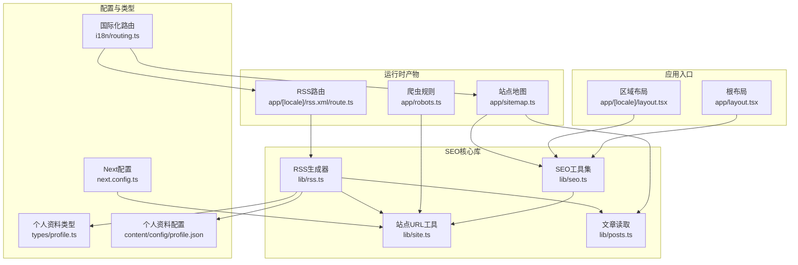
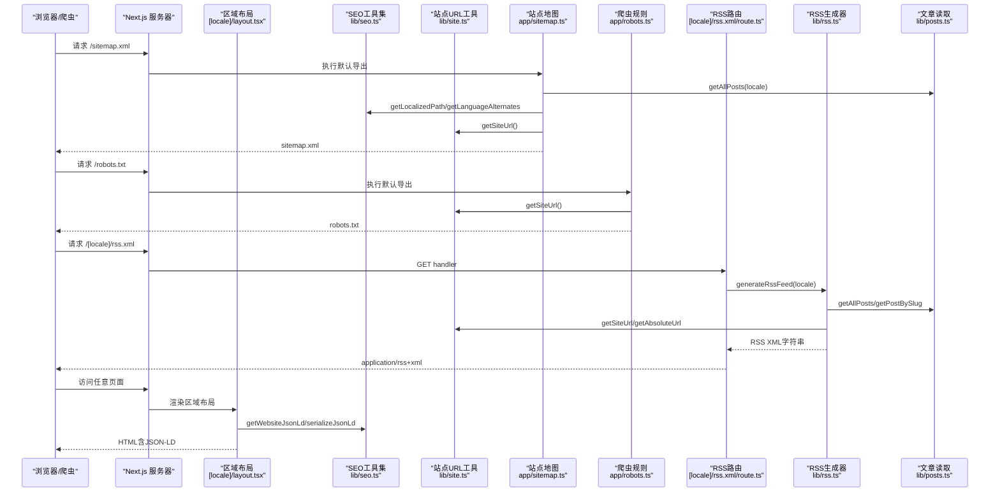
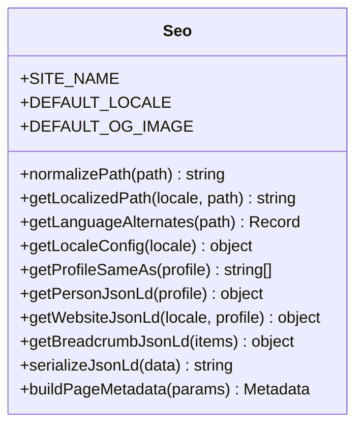
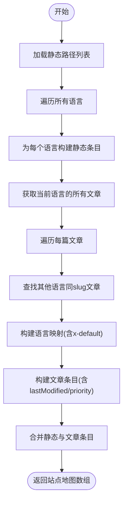
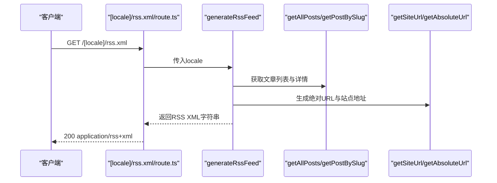
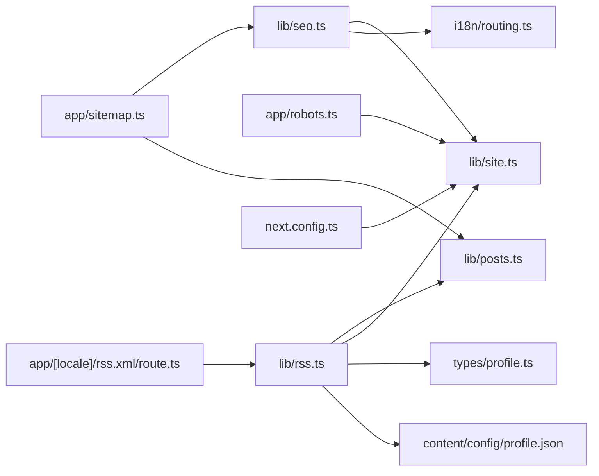

# SEO优化引擎

<cite>
**本文引用的文件**
- [lib/seo.ts](file://lib/seo.ts)
- [app/sitemap.ts](file://app/sitemap.ts)
- [app/robots.ts](file://app/robots.ts)
- [lib/rss.ts](file://lib/rss.ts)
- [app/[locale]/rss.xml/route.ts](file://app/[locale]/rss.xml/route.ts)
- [app/layout.tsx](file://app/layout.tsx)
- [app/[locale]/layout.tsx](file://app/[locale]/layout.tsx)
- [i18n/routing.ts](file://i18n/routing.ts)
- [lib/site.ts](file://lib/site.ts)
- [types/profile.ts](file://types/profile.ts)
- [content/config/profile.json](file://content/config/profile.json)
- [lib/posts.ts](file://lib/posts.ts)
- [next.config.ts](file://next.config.ts)
- [app/[locale]/blog/page.tsx](file://app/[locale]/blog/page.tsx)
- [app/[locale]/blog/[slug]/page.tsx](file://app/[locale]/blog/[slug]/page.tsx)
</cite>

## 目录
1. [简介](#简介)
2. [项目结构](#项目结构)
3. [核心组件](#核心组件)
4. [架构总览](#架构总览)
5. [详细组件分析](#详细组件分析)
6. [依赖关系分析](#依赖关系分析)
7. [性能考量](#性能考量)
8. [故障排查指南](#故障排查指南)
9. [结论](#结论)
10. [附录](#附录)

## 简介
本SEO优化引擎围绕Next.js应用，提供完整的搜索引擎优化能力：动态元数据生成、结构化数据注入、站点地图自动生成与RSS订阅源构建。通过统一的国际化路由与站点URL工具函数，确保多语言页面、社交分享（Open Graph/Twitter Cards）、爬虫友好性（robots.txt）与可发现性（sitemap.xml）的一致性。文档将深入解析seo.ts中的SEO工具函数、sitemap.ts的动态生成算法、robots.ts的自动化配置以及RSS订阅源的构建流程，并提供监控与调试建议。

## 项目结构
本项目采用“功能+层”混合组织方式：
- 根布局与区域布局负责全局元数据与结构化数据注入
- lib目录集中SEO、站点URL、内容读取等通用逻辑
- app目录按路由组织页面与API端点，包含sitemap、robots、RSS路由
- i18n与routing提供多语言支持
- content存放文章与配置文件，供posts与profile模块读取

图表来源
- [app/layout.tsx:17-91](file://app/layout.tsx#L17-L91)
- [app/[locale]/layout.tsx:40-47](file://app/[locale]/layout.tsx#L40-L47)
- [lib/seo.ts:137-198](file://lib/seo.ts#L137-L198)
- [lib/site.ts:13-34](file://lib/site.ts#L13-L34)
- [app/sitemap.ts:28-75](file://app/sitemap.ts#L28-L75)
- [app/robots.ts:6-15](file://app/robots.ts#L6-L15)
- [app/[locale]/rss.xml/route.ts:11-22](file://app/[locale]/rss.xml/route.ts#L11-L22)
- [lib/rss.ts:124-155](file://lib/rss.ts#L124-L155)
- [i18n/routing.ts:3-6](file://i18n/routing.ts#L3-L6)
- [types/profile.ts:22-51](file://types/profile.ts#L22-L51)
- [content/config/profile.json:1-66](file://content/config/profile.json#L1-L66)
- [next.config.ts:21-36](file://next.config.ts#L21-L36)

章节来源
- [app/layout.tsx:17-91](file://app/layout.tsx#L17-L91)
- [app/[locale]/layout.tsx:40-47](file://app/[locale]/layout.tsx#L40-L47)
- [lib/seo.ts:137-198](file://lib/seo.ts#L137-L198)
- [lib/site.ts:13-34](file://lib/site.ts#L13-L34)
- [app/sitemap.ts:28-75](file://app/sitemap.ts#L28-L75)
- [app/robots.ts:6-15](file://app/robots.ts#L6-L15)
- [app/[locale]/rss.xml/route.ts:11-22](file://app/[locale]/rss.xml/route.ts#L11-L22)
- [lib/rss.ts:124-155](file://lib/rss.ts#L124-L155)
- [i18n/routing.ts:3-6](file://i18n/routing.ts#L3-L6)
- [types/profile.ts:22-51](file://types/profile.ts#L22-L51)
- [content/config/profile.json:1-66](file://content/config/profile.json#L1-L66)
- [next.config.ts:21-36](file://next.config.ts#L21-L36)

## 核心组件
- SEO工具集（lib/seo.ts）
  - 提供本地化路径、语言交替链接、关键词与OG语言映射
  - 生成Person、Website、BreadcrumbList等JSON-LD
  - 统一构建页面元数据（标题、描述、关键词、canonical、OG、Twitter、robots指令）
- 站点URL工具（lib/site.ts）
  - 基于环境变量组装站点基址、basePath与绝对URL，适配用户站点与项目站点部署
- 站点地图（app/sitemap.ts）
  - 静态页面与文章页面的动态合并，自动为每个语言生成条目与alternates
- 爬虫规则（app/robots.ts）
  - 声明允许规则、站点地图与主机地址
- RSS订阅源（lib/rss.ts + app/[locale]/rss.xml/route.ts）
  - 从Markdown文章提取元信息，渲染HTML并生成符合规范的RSS XML
- 布局与元数据注入（app/layout.tsx, app/[locale]/layout.tsx）
  - 根布局设置全局元数据与图标；区域布局注入网站级JSON-LD

章节来源
- [lib/seo.ts:1-199](file://lib/seo.ts#L1-L199)
- [lib/site.ts:1-35](file://lib/site.ts#L1-L35)
- [app/sitemap.ts:1-76](file://app/sitemap.ts#L1-L76)
- [app/robots.ts:1-16](file://app/robots.ts#L1-L16)
- [lib/rss.ts:1-156](file://lib/rss.ts#L1-L156)
- [app/[locale]/rss.xml/route.ts:1-23](file://app/[locale]/rss.xml/route.ts#L1-L23)
- [app/layout.tsx:1-114](file://app/layout.tsx#L1-L114)
- [app/[locale]/layout.tsx:1-64](file://app/[locale]/layout.tsx#L1-L64)

## 架构总览
下图展示了SEO相关模块之间的调用关系与数据流向：

图表来源
- [app/sitemap.ts:28-75](file://app/sitemap.ts#L28-L75)
- [app/robots.ts:6-15](file://app/robots.ts#L6-L15)
- [app/[locale]/rss.xml/route.ts:11-22](file://app/[locale]/rss.xml/route.ts#L11-L22)
- [lib/rss.ts:124-155](file://lib/rss.ts#L124-L155)
- [lib/posts.ts:15-71](file://lib/posts.ts#L15-L71)
- [lib/site.ts:13-34](file://lib/site.ts#L13-L34)
- [lib/seo.ts:99-135](file://lib/seo.ts#L99-L135)
- [app/[locale]/layout.tsx:40-47](file://app/[locale]/layout.tsx#L40-L47)

## 详细组件分析

### SEO工具集（lib/seo.ts）
- 本地化路径与语言交替
  - normalizePath与getLocalizedPath用于规范化路径并按语言前缀拼接
  - getLanguageAlternates为当前路径生成en-US、zh-CN与x-default的语言交替映射
- 关键词与OG语言
  - localeConfig维护不同语言的htmlLang、ogLocale与keywords
- JSON-LD生成
  - getProfileSameAs过滤有效外链
  - getPersonJsonLd与getWebsiteJsonLd组合生成网站与人物实体
  - getBreadcrumbJsonLd生成面包屑列表
  - serializeJsonLd安全转义避免XSS
- 页面元数据构建
  - buildPageMetadata统一输出title、description、keywords、canonical、alternates、openGraph、twitter、robots指令

使用示例（路径引用）
- 在博客列表页中调用buildPageMetadata生成页面元数据
  - [app/[locale]/blog/page.tsx:11-23](file://app/[locale]/blog/page.tsx#L11-L23)
- 在文章详情页中扩展article类型的OG与Twitter卡片，并补充alternates
  - [app/[locale]/blog/[slug]/page.tsx:37-108](file://app/[locale]/blog/[slug]/page.tsx#L37-L108)

图表来源
- [lib/seo.ts:48-198](file://lib/seo.ts#L48-L198)

章节来源
- [lib/seo.ts:1-199](file://lib/seo.ts#L1-L199)
- [app/[locale]/blog/page.tsx:11-23](file://app/[locale]/blog/page.tsx#L11-L23)
- [app/[locale]/blog/[slug]/page.tsx:37-108](file://app/[locale]/blog/[slug]/page.tsx#L37-L108)

### 站点地图（app/sitemap.ts）
- 静态路径集合
  - 首页、博客、关于、经验、简历等基础页面，附带changeFrequency与priority
- 动态文章路径
  - 遍历所有语言的文章，按slug匹配跨语言版本，生成alternates
  - lastModified由文章日期解析得到
- 语言交替
  - 对每个语言生成对应URL，并为英文优先设置x-default

图表来源
- [app/sitemap.ts:15-75](file://app/sitemap.ts#L15-L75)
- [lib/seo.ts:53-68](file://lib/seo.ts#L53-L68)
- [lib/site.ts:13-16](file://lib/site.ts#L13-L16)
- [lib/posts.ts:15-47](file://lib/posts.ts#L15-L47)

章节来源
- [app/sitemap.ts:1-76](file://app/sitemap.ts#L1-L76)
- [lib/posts.ts:15-47](file://lib/posts.ts#L15-L47)

### 爬虫规则（app/robots.ts）
- 允许所有路径被爬取
- 声明站点地图与主机地址
- 强制静态生成，提升性能

章节来源
- [app/robots.ts:1-16](file://app/robots.ts#L1-L16)

### RSS订阅源（lib/rss.ts + app/[locale]/rss.xml/route.ts）
- 数据源
  - 从content/posts/{locale}读取文章，解析frontmatter与正文
- 渲染与标准化
  - Markdown经unified管线转为HTML，并修正相对资源路径为绝对URL
- 条目生成
  - 为每条文章生成title、link、guid、pubDate、description、content:encoded、dc:creator、author、category等字段
- 频道元信息
  - 根据语言选择标题与语言代码，插入头像、版权与atom自链接
- 路由暴露
  - 为每种语言生成/[locale]/rss.xml，响应application/rss+xml

图表来源
- [app/[locale]/rss.xml/route.ts:11-22](file://app/[locale]/rss.xml/route.ts#L11-L22)
- [lib/rss.ts:124-155](file://lib/rss.ts#L124-L155)
- [lib/posts.ts:15-71](file://lib/posts.ts#L15-L71)
- [lib/site.ts:13-34](file://lib/site.ts#L13-L34)

章节来源
- [lib/rss.ts:1-156](file://lib/rss.ts#L1-L156)
- [app/[locale]/rss.xml/route.ts:1-23](file://app/[locale]/rss.xml/route.ts#L1-L23)
- [lib/posts.ts:15-71](file://lib/posts.ts#L15-L71)

### 布局与结构化数据注入（app/layout.tsx, app/[locale]/layout.tsx）
- 根布局
  - 设置metadataBase、全局title模板、描述、作者、发布者、分类、关键词、RSS链接、OG/Twitter卡片、robots指令、formatDetection
- 区域布局
  - 根据当前语言注入网站级JSON-LD（WebSite与Person），并通过序列化函数安全注入到页面

章节来源
- [app/layout.tsx:17-91](file://app/layout.tsx#L17-L91)
- [app/[locale]/layout.tsx:40-47](file://app/[locale]/layout.tsx#L40-L47)
- [lib/seo.ts:99-135](file://lib/seo.ts#L99-L135)

### 文章详情页SEO增强（app/[locale]/blog/[slug]/page.tsx）
- 动态生成article类型元数据，补充publishedTime、authors、tags
- 构建文章级JSON-LD（BlogPosting）与面包屑JSON-LD（BreadcrumbList）
- 为文章页面生成canonical与语言交替链接

章节来源
- [app/[locale]/blog/[slug]/page.tsx:37-108](file://app/[locale]/blog/[slug]/page.tsx#L37-L108)
- [app/[locale]/blog/[slug]/page.tsx:131-169](file://app/[locale]/blog/[slug]/page.tsx#L131-L169)
- [lib/seo.ts:118-135](file://lib/seo.ts#L118-L135)

## 依赖关系分析
- 耦合与内聚
  - seo.ts作为核心聚合器，低耦合地依赖site.ts与i18n/routing.ts，内聚了元数据与结构化数据生成逻辑
  - sitemap.ts与rss.ts分别依赖posts.ts与site.ts，职责清晰
- 外部依赖
  - next-intl路由定义决定语言集合与默认语言
  - Next.js导出模式与trailingSlash影响URL结构与缓存策略
- 潜在循环依赖
  - 未发现直接循环导入；各模块单向依赖

图表来源
- [lib/seo.ts:1-199](file://lib/seo.ts#L1-L199)
- [lib/site.ts:1-35](file://lib/site.ts#L1-L35)
- [i18n/routing.ts:3-6](file://i18n/routing.ts#L3-L6)
- [app/sitemap.ts:1-76](file://app/sitemap.ts#L1-L76)
- [app/robots.ts:1-16](file://app/robots.ts#L1-L16)
- [app/[locale]/rss.xml/route.ts:1-23](file://app/[locale]/rss.xml/route.ts#L1-L23)
- [lib/rss.ts:1-156](file://lib/rss.ts#L1-L156)
- [types/profile.ts:22-51](file://types/profile.ts#L22-L51)
- [content/config/profile.json:1-66](file://content/config/profile.json#L1-L66)
- [next.config.ts:21-36](file://next.config.ts#L21-L36)

章节来源
- [lib/seo.ts:1-199](file://lib/seo.ts#L1-L199)
- [lib/site.ts:1-35](file://lib/site.ts#L1-L35)
- [i18n/routing.ts:3-6](file://i18n/routing.ts#L3-L6)
- [app/sitemap.ts:1-76](file://app/sitemap.ts#L1-L76)
- [app/robots.ts:1-16](file://app/robots.ts#L1-L16)
- [app/[locale]/rss.xml/route.ts:1-23](file://app/[locale]/rss.xml/route.ts#L1-L23)
- [lib/rss.ts:1-156](file://lib/rss.ts#L1-L156)
- [types/profile.ts:22-51](file://types/profile.ts#L22-L51)
- [content/config/profile.json:1-66](file://content/config/profile.json#L1-L66)
- [next.config.ts:21-36](file://next.config.ts#L21-L36)

## 性能考量
- 静态生成
  - sitemap.ts与robots.ts均设置为force-static，减少运行时开销
  - RSS路由启用force-static与dynamicParams=false，预生成所有语言版本
- 图片与资源
  - 根布局与页面元数据中使用绝对URL，避免二次重定向
  - 默认OG图像尺寸针对平台优化（如1638x1638与1200x630）
- 部署路径
  - 通过next.config.ts控制basePath与assetPrefix，结合site.ts的getSiteUrl与getAbsoluteUrl，保证资源路径正确且无需额外跳转

章节来源
- [app/sitemap.ts:11](file://app/sitemap.ts#L11)
- [app/robots.ts:4](file://app/robots.ts#L4)
- [app/[locale]/rss.xml/route.ts:4-5](file://app/[locale]/rss.xml/route.ts#L4-L5)
- [app/layout.tsx:55-70](file://app/layout.tsx#L55-L70)
- [lib/seo.ts:171-178](file://lib/seo.ts#L171-L178)
- [next.config.ts:21-36](file://next.config.ts#L21-L36)
- [lib/site.ts:13-34](file://lib/site.ts#L13-L34)

## 故障排查指南
- 站点地图未更新
  - 检查文章是否标记为已发布（published !== false）
  - 确认getAllPosts能读取到目标语言目录
  - 验证sitemap.ts的staticPaths与路由一致
- RSS无法订阅或内容缺失
  - 检查Markdown frontmatter是否存在title、date、description等必要字段
  - 确认RSS路由参数locale是否正确传递
  - 查看normalizeFeedHtml是否成功替换相对路径为绝对URL
- OG/Twitter卡片不生效
  - 核对页面元数据中image是否为绝对URL
  - 确认openGraph与twitter字段是否被覆盖或未正确合并
- robots.txt异常
  - 检查host与sitemap URL是否指向正确的生产域名
- 多语言交替错误
  - 确认getLanguageAlternates与getLocalizedPath生成的URL与路由一致
  - 检查x-default是否指向英文版本

章节来源
- [lib/posts.ts:15-47](file://lib/posts.ts#L15-L47)
- [app/sitemap.ts:28-75](file://app/sitemap.ts#L28-L75)
- [lib/rss.ts:81-100](file://lib/rss.ts#L81-L100)
- [app/[locale]/rss.xml/route.ts:11-22](file://app/[locale]/rss.xml/route.ts#L11-L22)
- [lib/seo.ts:137-198](file://lib/seo.ts#L137-L198)
- [app/robots.ts:6-15](file://app/robots.ts#L6-L15)

## 结论
该SEO优化引擎以seo.ts为核心，结合site.ts与i18n/routing.ts，实现了跨语言一致的元数据与结构化数据注入；通过sitemap.ts与robots.ts提升可发现性与爬取效率；RSS订阅源则完善了内容分发渠道。整体架构清晰、职责分明，具备良好的可维护性与扩展性。建议在后续迭代中引入SEO指标监控与自动化测试，进一步提升稳定性与效果。

## 附录
- 社交媒体分享优化（Open Graph、Twitter Cards）
  - 在页面级通过buildPageMetadata统一设置OG与Twitter卡片，文章页可扩展article类型与封面图
  - 根布局设置全局默认值，确保无页面覆盖时仍具备良好展示
- SEO监控与调试工具
  - 使用Google Search Console验证sitemap与robots
  - 使用Facebook Sharing Debugger与Twitter Card Validator校验OG与卡片
  - 使用浏览器开发者工具检查页面源码中的JSON-LD与meta标签
- 最佳实践
  - 保持canonical与alternates一致
  - 为每篇文章提供唯一封面图与描述
  - 合理设置changeFrequency与priority，避免过度优化

章节来源
- [app/[locale]/blog/[slug]/page.tsx:68-108](file://app/[locale]/blog/[slug]/page.tsx#L68-L108)
- [app/layout.tsx:48-70](file://app/layout.tsx#L48-L70)
- [lib/seo.ts:137-198](file://lib/seo.ts#L137-L198)