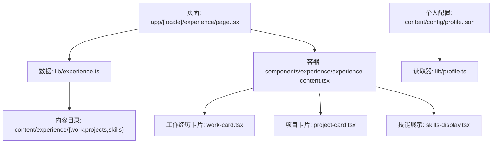
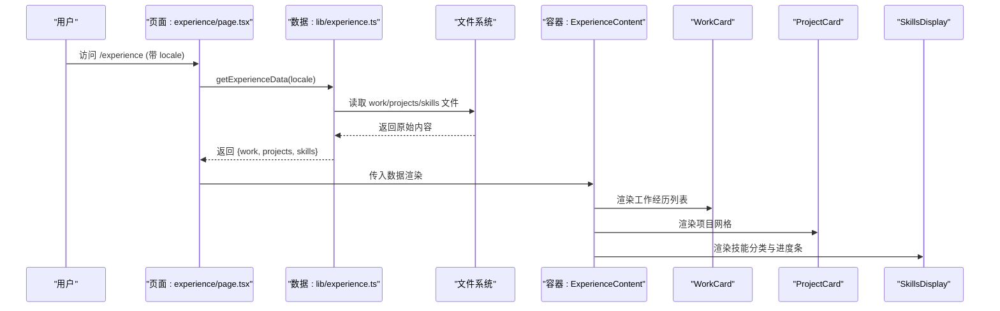
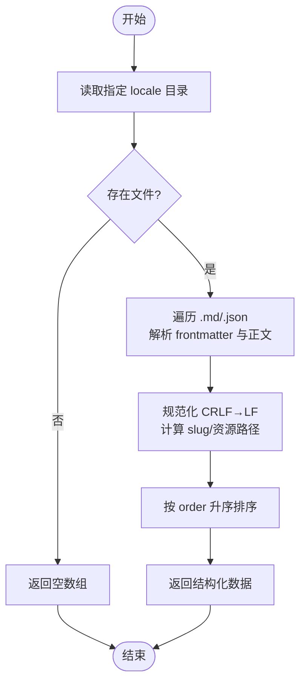
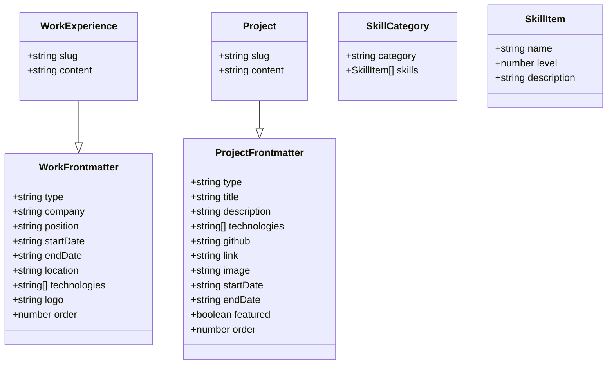
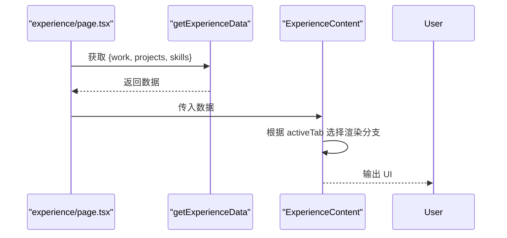
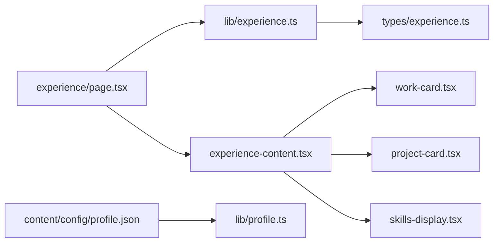

# 个人展示模块

<cite>
**本文引用的文件**   
- [lib/experience.ts](file://lib/experience.ts)
- [components/experience/experience-content.tsx](file://components/experience/experience-content.tsx)
- [components/experience/work-card.tsx](file://components/experience/work-card.tsx)
- [components/experience/project-card.tsx](file://components/experience/project-card.tsx)
- [components/experience/skills-display.tsx](file://components/experience/skills-display.tsx)
- [app/[locale]/experience/page.tsx](file://app/[locale]/experience/page.tsx)
- [content/config/profile.json](file://content/config/profile.json)
- [lib/profile.ts](file://lib/profile.ts)
- [types/experience.ts](file://types/experience.ts)
- [types/profile.ts](file://types/profile.ts)
- [content/experience/skills/zh.json](file://content/experience/skills/zh.json)
</cite>

## 目录
1. [简介](#简介)
2. [项目结构](#项目结构)
3. [核心组件](#核心组件)
4. [架构总览](#架构总览)
5. [详细组件分析](#详细组件分析)
6. [依赖关系分析](#依赖关系分析)
7. [性能与可访问性](#性能与可访问性)
8. [故障排查指南](#故障排查指南)
9. [结论](#结论)
10. [附录：配置与操作指南](#附录配置与操作指南)

## 简介
本模块为“个人展示”页面，提供工作经验、项目作品集、技能展示和个人简介等能力。数据来源于 Markdown 与 JSON 配置文件，通过服务端读取并渲染到客户端组件中；同时支持多语言与响应式布局。

## 项目结构
- 页面入口：按路由参数 locale 加载对应语言的数据，组装后交给 ExperienceContent 渲染。
- 数据层：统一从 content/experience 目录下读取工作、项目、技能三类内容，并进行解析与排序。
- 展示层：ExperienceContent 作为容器，根据当前标签页切换 WorkCard、SkillsDisplay、ProjectCard 的渲染。
- 配置层：profile.json 管理个人信息、社交链接、主题色、评论配置等；lib/profile.ts 负责路径规范化与便捷查询。

图表来源
- [app/[locale]/experience/page.tsx:1-35](file://app/[locale]/experience/page.tsx#L1-L35)
- [lib/experience.ts:1-147](file://lib/experience.ts#L1-L147)
- [components/experience/experience-content.tsx:1-106](file://components/experience/experience-content.tsx#L1-L106)
- [components/experience/work-card.tsx:1-69](file://components/experience/work-card.tsx#L1-L69)
- [components/experience/project-card.tsx:1-73](file://components/experience/project-card.tsx#L1-L73)
- [components/experience/skills-display.tsx:1-51](file://components/experience/skills-display.tsx#L1-L51)
- [content/config/profile.json:1-66](file://content/config/profile.json#L1-L66)
- [lib/profile.ts:1-30](file://lib/profile.ts#L1-L30)

章节来源
- [app/[locale]/experience/page.tsx:1-35](file://app/[locale]/experience/page.tsx#L1-L35)
- [lib/experience.ts:1-147](file://lib/experience.ts#L1-L147)
- [components/experience/experience-content.tsx:1-106](file://components/experience/experience-content.tsx#L1-L106)

## 核心组件
- 页面路由：根据 locale 调用 getExperienceData 获取三类数据，并传入 ExperienceContent。
- 数据加载：
  - 工作经历：遍历 content/experience/work/{locale}/*.md，解析 frontmatter 与正文，按 order 升序排列。
  - 项目作品：遍历 content/experience/projects/{locale}/*.md，解析 frontmatter 与正文，补充 image 资源路径，按 order 升序排列。
  - 技能展示：读取 content/experience/skills/{locale}.json，不存在则回退 en.json。
- 展示组件：
  - ExperienceContent：维护 activeTab 状态，渲染三个子组件或空态提示。
  - WorkCard：展示公司、职位、时间、地点、技术栈标签与 Markdown 内容。
  - ProjectCard：展示封面图、标题、描述、外链（GitHub/外部）、Markdown 内容与标签。
  - SkillsDisplay：按分类渲染技能条与可选说明。

章节来源
- [lib/experience.ts:17-147](file://lib/experience.ts#L17-L147)
- [components/experience/experience-content.tsx:1-106](file://components/experience/experience-content.tsx#L1-L106)
- [components/experience/work-card.tsx:1-69](file://components/experience/work-card.tsx#L1-L69)
- [components/experience/project-card.tsx:1-73](file://components/experience/project-card.tsx#L1-L73)
- [components/experience/skills-display.tsx:1-51](file://components/experience/skills-display.tsx#L1-L51)

## 架构总览
下图展示了从页面请求到数据读取再到组件渲染的完整流程。

图表来源
- [app/[locale]/experience/page.tsx:25-34](file://app/[locale]/experience/page.tsx#L25-L34)
- [lib/experience.ts:141-147](file://lib/experience.ts#L141-L147)
- [components/experience/experience-content.tsx:20-102](file://components/experience/experience-content.tsx#L20-L102)

## 详细组件分析

### 数据加载与处理逻辑（lib/experience.ts）
- 工作经历
  - 读取 content/experience/work/{locale} 下所有 .md 文件，解析 frontmatter 与正文，附加 slug 字段，并按 order 升序排序。
  - 提供按 slug 精确查询接口，异常时返回 null。
- 项目作品
  - 读取 content/experience/projects/{locale} 下所有 .md 文件，解析 frontmatter 与正文，自动将 image 字段转换为资源路径，并按 order 升序排序。
  - 提供精选项目过滤接口与按 slug 精确查询接口。
- 技能展示
  - 读取 content/experience/skills/{locale}.json，若不存在则回退到 en.json。
- 组合接口
  - getExperienceData 聚合 work、projects、skills 三项数据供页面使用。

图表来源
- [lib/experience.ts:17-46](file://lib/experience.ts#L17-L46)
- [lib/experience.ts:71-98](file://lib/experience.ts#L71-L98)
- [lib/experience.ts:124-137](file://lib/experience.ts#L124-L137)
- [lib/experience.ts:141-147](file://lib/experience.ts#L141-L147)

章节来源
- [lib/experience.ts:17-147](file://lib/experience.ts#L17-L147)

### 类型定义（types/experience.ts）
- WorkFrontmatter/WorkExperience：工作经历的前置元信息与扩展字段（slug、content）。
- ProjectFrontmatter/Project：项目的前置元信息（含 featured、order、image 等）与扩展字段。
- SkillCategory/SkillItem：技能分类与单项技能（name、level、description）。

图表来源
- [types/experience.ts:1-48](file://types/experience.ts#L1-L48)

章节来源
- [types/experience.ts:1-48](file://types/experience.ts#L1-L48)

### 页面与容器（experience/page.tsx 与 experience-content.tsx）
- 页面：生成 SEO 元信息，设置请求 locale，调用 getExperienceData 获取数据并传递给 ExperienceContent。
- 容器：维护 activeTab 状态，动态渲染工作经历、技能、项目三个区域；当数据为空时显示友好占位提示。

图表来源
- [app/[locale]/experience/page.tsx:25-34](file://app/[locale]/experience/page.tsx#L25-L34)
- [components/experience/experience-content.tsx:20-102](file://components/experience/experience-content.tsx#L20-L102)

章节来源
- [app/[locale]/experience/page.tsx:1-35](file://app/[locale]/experience/page.tsx#L1-L35)
- [components/experience/experience-content.tsx:1-106](file://components/experience/experience-content.tsx#L1-L106)

### 工作经历卡片（work-card.tsx）
- 数据绑定：company、position、startDate、endDate、location、technologies、content。
- 交互与样式：悬停边框高亮、动画延迟递增、当前在职标记、Markdown 内容渲染、技术栈标签。

章节来源
- [components/experience/work-card.tsx:1-69](file://components/experience/work-card.tsx#L1-L69)

### 项目卡片（project-card.tsx）
- 数据绑定：title、description、technologies、github、link、image、content。
- 交互与样式：封面图缩放动效、外链图标、悬停标题变色、Markdown 内容渲染、标签分组。

章节来源
- [components/experience/project-card.tsx:1-73](file://components/experience/project-card.tsx#L1-L73)

### 技能展示（skills-display.tsx）
- 动态渲染：按分类渲染卡片，每项技能显示名称、百分比与可选描述，内部包含进度条动画。
- 数据来源：由 getSkills 读取 JSON 文件，支持多语言回退。

章节来源
- [components/experience/skills-display.tsx:1-51](file://components/experience/skills-display.tsx#L1-L51)
- [lib/experience.ts:124-137](file://lib/experience.ts#L124-L137)

## 依赖关系分析
- 页面依赖数据层与展示层；数据层依赖文件系统与 gray-matter 解析；展示层依赖 UI 基础组件与图标库。
- 类型定义贯穿数据与组件，确保前后端数据结构一致。

图表来源
- [app/[locale]/experience/page.tsx:1-35](file://app/[locale]/experience/page.tsx#L1-L35)
- [lib/experience.ts:1-147](file://lib/experience.ts#L1-L147)
- [components/experience/experience-content.tsx:1-106](file://components/experience/experience-content.tsx#L1-L106)
- [components/experience/work-card.tsx:1-69](file://components/experience/work-card.tsx#L1-L69)
- [components/experience/project-card.tsx:1-73](file://components/experience/project-card.tsx#L1-L73)
- [components/experience/skills-display.tsx:1-51](file://components/experience/skills-display.tsx#L1-L51)
- [types/experience.ts:1-48](file://types/experience.ts#L1-L48)
- [content/config/profile.json:1-66](file://content/config/profile.json#L1-L66)
- [lib/profile.ts:1-30](file://lib/profile.ts#L1-L30)

章节来源
- [app/[locale]/experience/page.tsx:1-35](file://app/[locale]/experience/page.tsx#L1-L35)
- [lib/experience.ts:1-147](file://lib/experience.ts#L1-L147)
- [components/experience/experience-content.tsx:1-106](file://components/experience/experience-content.tsx#L1-L106)
- [types/experience.ts:1-48](file://types/experience.ts#L1-L48)
- [content/config/profile.json:1-66](file://content/config/profile.json#L1-L66)
- [lib/profile.ts:1-30](file://lib/profile.ts#L1-L30)

## 性能与可访问性
- 构建期一次性读取与解析 Markdown/JSON，减少运行时开销。
- 图片路径在数据层统一转换，避免重复计算。
- 列表项采用动画延迟递增，提升视觉层次而不影响首屏性能。
- 建议对大文档内容按需懒加载或分页展示，以提升滚动性能。
- 为图片添加 alt 文本，按钮与链接具备键盘可聚焦性，保证基本可访问性。

[本节为通用指导，不直接分析具体文件]

## 故障排查指南
- Windows 换行符导致部署后字节不一致问题：数据层已做 CRLF→LF 规范化，避免 RSC Flight 字节长度差异引发的异常。
- 缺少 locale 文件或目录：
  - 工作经历/项目：若目录不存在或文件缺失，返回空数组，页面会显示空态提示。
  - 技能：若目标 locale 的 JSON 不存在，回退到 en.json。
- 资源路径错误：检查项目封面 image 是否指向有效资源路径；数据层会自动拼接基础路径。
- 评论系统未生效：核对 profile.json 中的 giscus 配置是否正确。

章节来源
- [lib/experience.ts:31-35](file://lib/experience.ts#L31-L35)
- [lib/experience.ts:20-22](file://lib/experience.ts#L20-L22)
- [lib/experience.ts:74-76](file://lib/experience.ts#L74-L76)
- [lib/experience.ts:127-136](file://lib/experience.ts#L127-L136)
- [content/config/profile.json:49-64](file://content/config/profile.json#L49-L64)

## 结论
该模块以“数据即内容”的方式组织经验、项目与技能，结合 Next.js 的服务端数据读取与客户端组件渲染，实现了清晰的分层与良好的可扩展性。通过统一的类型定义与配置驱动，便于多语言与主题定制。

[本节为总结，不直接分析具体文件]

## 附录：配置与操作指南

### 配置文件结构与自定义选项（profile.json）
- personal：姓名、头像、Logo、职业、求职状态、多语言简介、所在地、邮箱。
- social：社交平台列表，包含平台标识、URL、用户名（可选）。
- resume：简历 PDF 地址与最后更新时间。
- theme：主色与强调色，用于全局主题定制。
- comments.giscus：评论系统配置，包括仓库、分类、映射策略、主题、语言等。

章节来源
- [content/config/profile.json:1-66](file://content/config/profile.json#L1-L66)
- [types/profile.ts:1-52](file://types/profile.ts#L1-L52)
- [lib/profile.ts:1-30](file://lib/profile.ts#L1-L30)

### 数据源与增删改查指南
- 工作经历
  - 新增：在 content/experience/work/{locale}/ 下新建 .md 文件，填写 frontmatter（type=work、company、position、startDate、endDate、location、technologies、order），并在正文编写 Markdown 内容。
  - 修改：编辑对应 .md 文件的 frontmatter 或正文。
  - 删除：移除对应 .md 文件。
  - 查询：通过 getWorkExperienceBySlug(slug, locale) 获取单条记录。
- 项目作品
  - 新增：在 content/experience/projects/{locale}/ 下新建 .md 文件，填写 frontmatter（type=project、title、description、technologies、github/link、image、featured、order），并在正文编写 Markdown 内容。
  - 修改：编辑对应 .md 文件的 frontmatter 或正文。
  - 删除：移除对应 .md 文件。
  - 查询：通过 getProjectBySlug(slug, locale) 获取单条记录；getFeaturedProjects(locale) 获取精选项目。
- 技能展示
  - 新增/修改：编辑 content/experience/skills/{locale}.json，按 SkillCategory 与 SkillItem 结构添加或调整条目。
  - 删除：移除对应条目或整个文件（将回退到 en.json）。
  - 查询：通过 getSkills(locale) 获取技能列表。

章节来源
- [lib/experience.ts:17-67](file://lib/experience.ts#L17-L67)
- [lib/experience.ts:71-120](file://lib/experience.ts#L71-L120)
- [lib/experience.ts:124-137](file://lib/experience.ts#L124-L137)
- [types/experience.ts:1-48](file://types/experience.ts#L1-L48)

### 组件数据绑定与渲染机制
- ExperienceContent：接收 work、projects、skills 三组数据，根据 activeTab 渲染相应子组件；当数据为空时显示空态提示。
- WorkCard：绑定 WorkExperience 字段，渲染时间范围、地点、技术栈标签与 Markdown 内容。
- ProjectCard：绑定 Project 字段，渲染封面图、外链、描述与 Markdown 内容。
- SkillsDisplay：绑定 SkillCategory[]，渲染分类卡片与技能进度条。

章节来源
- [components/experience/experience-content.tsx:20-102](file://components/experience/experience-content.tsx#L20-L102)
- [components/experience/work-card.tsx:15-69](file://components/experience/work-card.tsx#L15-L69)
- [components/experience/project-card.tsx:16-73](file://components/experience/project-card.tsx#L16-L73)
- [components/experience/skills-display.tsx:21-51](file://components/experience/skills-display.tsx#L21-L51)

### 样式定制方法
- 主题色：在 profile.json 的 theme.primaryColor 与 theme.accentColor 中调整，配合全局主题提供者生效。
- 组件样式：基于 Tailwind CSS 类名进行微调，如 hover:border-primary/30、animate-fade-in、grid 布局等。
- 进度条与动画：SkillsDisplay 内部 ProgressBar 使用内联样式控制宽度，可通过主题变量或全局 CSS 覆盖。

章节来源
- [content/config/profile.json:45-48](file://content/config/profile.json#L45-L48)
- [components/experience/skills-display.tsx:10-19](file://components/experience/skills-display.tsx#L10-L19)
- [components/experience/experience-content.tsx:31-50](file://components/experience/experience-content.tsx#L31-L50)

### 响应式设计与移动端适配
- 网格布局：项目与技能区域使用 grid-cols-1 md:grid-cols-2 实现小屏单列、大屏双列自适应。
- 弹性排版：标题、标签、图标在小屏下自动换行，保持可读性与点击热区。
- 间距与字号：使用紧凑的 prose 与 text-sm 等工具类，优化移动端阅读体验。

章节来源
- [components/experience/experience-content.tsx:86-99](file://components/experience/experience-content.tsx#L86-L99)
- [components/experience/skills-display.tsx:23-49](file://components/experience/skills-display.tsx#L23-L49)