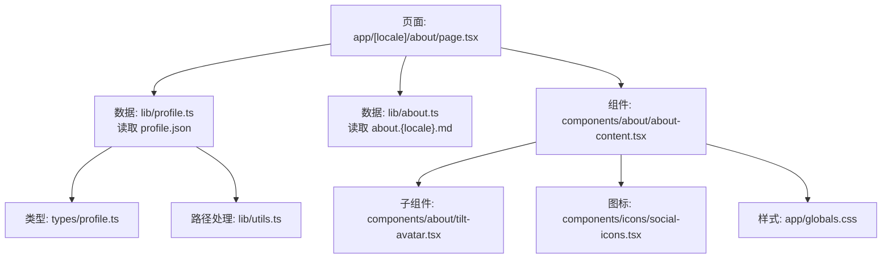
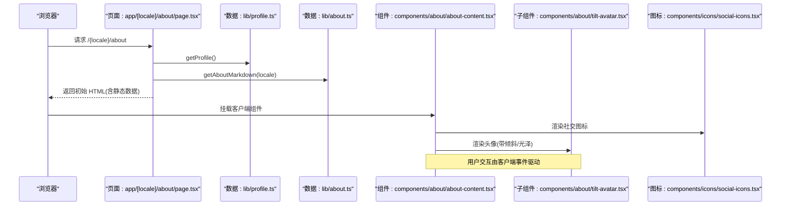
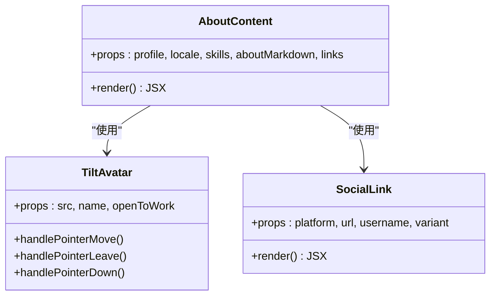
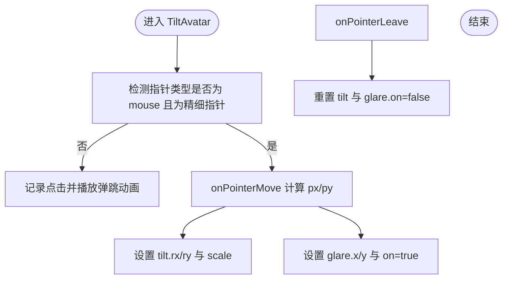
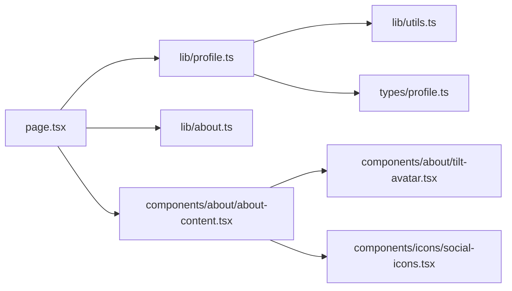

# 个人简介模块

<cite>
**本文引用的文件**   
- [about-content.tsx](file://components/about/about-content.tsx)
- [tilt-avatar.tsx](file://components/about/tilt-avatar.tsx)
- [profile.json](file://content/config/profile.json)
- [about.ts](file://lib/about.ts)
- [profile.ts](file://lib/profile.ts)
- [page.tsx](file://app/[locale]/about/page.tsx)
- [social-icons.tsx](file://components/icons/social-icons.tsx)
- [utils.ts](file://lib/utils.ts)
- [profile.ts（类型）](file://types/profile.ts)
- [globals.css](file://app/globals.css)
</cite>

## 目录
1. [简介](#简介)
2. [项目结构](#项目结构)
3. [核心组件](#核心组件)
4. [架构总览](#架构总览)
5. [详细组件分析](#详细组件分析)
6. [依赖关系分析](#依赖关系分析)
7. [性能与可访问性](#性能与可访问性)
8. [配置与多语言](#配置与多语言)
9. [样式定制指南](#样式定制指南)
10. [故障排查](#故障排查)
11. [结论](#结论)

## 简介
本模块为“关于我”页面，提供个人信息展示、头像倾斜与光泽动效、技能统计、社交链接入口、Markdown 个人介绍渲染以及友情链接展示。整体采用 Next.js App Router + next-intl 国际化方案，数据来源于 content/config/profile.json 与 Markdown 文件，并通过服务端页面聚合后渲染客户端组件。

## 项目结构
- 页面路由：app/[locale]/about/page.tsx
- 客户端组件：components/about/about-content.tsx、components/about/tilt-avatar.tsx
- 数据源：content/config/profile.json、content/config/about.{locale}.md
- 工具与类型：lib/profile.ts、lib/about.ts、lib/utils.ts、types/profile.ts
- 图标与社交链接：components/icons/social-icons.tsx
- 全局样式与动画：app/globals.css

图表来源
- [page.tsx:1-46](file://app/[locale]/about/page.tsx#L1-L46)
- [profile.ts:1-30](file://lib/profile.ts#L1-L30)
- [about.ts:1-17](file://lib/about.ts#L1-L17)
- [about-content.tsx:1-381](file://components/about/about-content.tsx#L1-L381)
- [tilt-avatar.tsx:1-109](file://components/about/tilt-avatar.tsx#L1-L109)
- [social-icons.tsx:1-263](file://components/icons/social-icons.tsx#L1-L263)
- [utils.ts:1-26](file://lib/utils.ts#L1-L26)
- [profile.ts（类型）:1-52](file://types/profile.ts#L1-L52)
- [globals.css:1-1104](file://app/globals.css#L1-L1104)

章节来源
- [page.tsx:1-46](file://app/[locale]/about/page.tsx#L1-L46)
- [profile.ts:1-30](file://lib/profile.ts#L1-L30)
- [about.ts:1-17](file://lib/about.ts#L1-L17)
- [about-content.tsx:1-381](file://components/about/about-content.tsx#L1-L381)
- [tilt-avatar.tsx:1-109](file://components/about/tilt-avatar.tsx#L1-L109)
- [social-icons.tsx:1-263](file://components/icons/social-icons.tsx#L1-L263)
- [utils.ts:1-26](file://lib/utils.ts#L1-L26)
- [profile.ts（类型）:1-52](file://types/profile.ts#L1-L52)
- [globals.css:1-1104](file://app/globals.css#L1-L1104)

## 核心组件
- AboutContent：负责“关于我”页面的布局与信息组织，包括左侧开发者卡片（头像、姓名、职位、位置、邮箱、社交按钮）、右侧详情区（分段标签切换：个人介绍 Markdown 与友情链接），并计算技能总数用于展示。
- TiltAvatar：实现头像的 3D 倾斜与光泽跟随效果，支持鼠标精细指针交互与触摸点击反馈动画。

章节来源
- [about-content.tsx:1-381](file://components/about/about-content.tsx#L1-L381)
- [tilt-avatar.tsx:1-109](file://components/about/tilt-avatar.tsx#L1-L109)

## 架构总览
页面在服务端加载 profile 与 about 内容，组装后传入客户端组件进行渲染。AboutContent 内部通过 next-intl 获取本地化文案，使用 SocialLink 统一渲染社交平台图标，TiltAvatar 提供沉浸式头像交互体验。

图表来源
- [page.tsx:1-46](file://app/[locale]/about/page.tsx#L1-L46)
- [profile.ts:1-30](file://lib/profile.ts#L1-L30)
- [about.ts:1-17](file://lib/about.ts#L1-L17)
- [about-content.tsx:1-381](file://components/about/about-content.tsx#L1-L381)
- [tilt-avatar.tsx:1-109](file://components/about/tilt-avatar.tsx#L1-L109)
- [social-icons.tsx:1-263](file://components/icons/social-icons.tsx#L1-L263)

## 详细组件分析

### AboutContent 组件
- 布局结构
  - 左侧固定卡片：包含 TiltAvatar、姓名、职业、位置、邮箱、社交按钮、跳转至经验与简历的按钮。
  - 右侧主区域：标题与分段标签（“个人介绍”和“友情链接”），默认显示“个人介绍”，支持滑动指示器切换。
- 渲染逻辑
  - 根据 locale 选择 bio 文本；计算 skills 总数用于展示。
  - “个人介绍”面板使用 MarkdownRenderer 渲染 about.{locale}.md 内容，空内容时显示占位提示。
  - “友情链接”面板以网格形式展示 FriendLink 列表，每个卡片包含头像、名称、分类、描述与外链主机名。
- 交互与动画
  - 标签切换使用 CSS transform 与 transition 实现平滑滑动指示器。
  - 面板切换使用方向性入场动画（从左右滑入）。
  - 背景装饰使用径向渐变与模糊光晕，悬停增强透明度。
- 可访问性
  - 标签区域使用 role="tablist"/role="tab"/role="tabpanel" 与 aria-* 属性，确保键盘与屏幕阅读器可用。

章节来源
- [about-content.tsx:1-381](file://components/about/about-content.tsx#L1-L381)
- [about.ts:1-17](file://lib/about.ts#L1-L17)
- [social-icons.tsx:1-263](file://components/icons/social-icons.tsx#L1-L263)
- [globals.css:600-733](file://app/globals.css#L600-L733)

#### 类图（组件关系）

图表来源
- [about-content.tsx:1-381](file://components/about/about-content.tsx#L1-L381)
- [tilt-avatar.tsx:1-109](file://components/about/tilt-avatar.tsx#L1-L109)
- [social-icons.tsx:1-263](file://components/icons/social-icons.tsx#L1-L263)

### TiltAvatar 组件
- 3D 倾斜算法
  - 基于 PointerEvent 的 clientX/clientY 与元素边界矩形计算归一化坐标 px/py（0..1）。
  - 将 px/py 映射到 rotateX/rotateY 角度，最大倾斜角 MAX_TILT 控制幅度。
  - 同时更新光泽层位置（glare.x/glare.y）与可见性，模拟高光随光标移动。
- 交互处理
  - 仅对 fine pointer（鼠标）启用倾斜与光泽；触摸设备触发点击弹跳动画。
  - onPointerLeave 重置倾斜与光泽状态。
  - 使用 preserve-3d 与 translateZ 分层，使光环、头像、光泽、徽章处于不同 Z 轴层次。
- 性能考量
  - 使用 requestAnimationFrame 启动动画避免阻塞。
  - 仅在存在 mouse 且 isFinePointer 时执行计算，减少移动端不必要的开销。

图表来源
- [tilt-avatar.tsx:1-109](file://components/about/tilt-avatar.tsx#L1-L109)

章节来源
- [tilt-avatar.tsx:1-109](file://components/about/tilt-avatar.tsx#L1-L109)
- [globals.css:638-648](file://app/globals.css#L638-L648)

### 配置文件 profile.json
- personal
  - name：姓名
  - avatar：头像 URL（支持外部 CDN 或相对路径）
  - logo：站点 Logo URL
  - profession：职业头衔
  - jobStatus.openToWork：是否开放工作机会（影响头像右下角徽章显示）
  - jobStatus.availableFor：可选的工作类型数组
  - bio.en/bio.zh：多语言简介
  - location：所在城市
  - email：联系邮箱（可选）
- social：社交平台列表，每项包含 platform、url、username（可选）
- resume.pdfUrl：简历 PDF 路径（服务端会拼接 basePath）
- theme.primaryColor/theme.accentColor：主题色配置
- comments.giscus：评论系统配置项（仓库、分类等）

章节来源
- [profile.json:1-66](file://content/config/profile.json#L1-L66)
- [profile.ts（类型）:1-52](file://types/profile.ts#L1-L52)

## 依赖关系分析
- 页面与服务端数据
  - page.tsx 调用 getProfile() 与 getAboutMarkdown(locale)，并将结果传给 AboutContent。
- 资源路径处理
  - getProfile() 使用 getAssetPath() 为相对路径添加 basePath，兼容 GitHub Pages 部署；绝对 URL 保持不变。
- 类型约束
  - ProfileConfig 定义了整个配置的结构，确保 JSON 字段与前端消费一致。
- 图标与社交链接
  - SocialLink 组件集中管理平台图标映射与多种渲染变体（icon/button/card）。

图表来源
- [page.tsx:1-46](file://app/[locale]/about/page.tsx#L1-L46)
- [profile.ts:1-30](file://lib/profile.ts#L1-L30)
- [about.ts:1-17](file://lib/about.ts#L1-L17)
- [utils.ts:1-26](file://lib/utils.ts#L1-L26)
- [profile.ts（类型）:1-52](file://types/profile.ts#L1-L52)
- [about-content.tsx:1-381](file://components/about/about-content.tsx#L1-L381)
- [tilt-avatar.tsx:1-109](file://components/about/tilt-avatar.tsx#L1-L109)
- [social-icons.tsx:1-263](file://components/icons/social-icons.tsx#L1-L263)

章节来源
- [page.tsx:1-46](file://app/[locale]/about/page.tsx#L1-L46)
- [profile.ts:1-30](file://lib/profile.ts#L1-L30)
- [about.ts:1-17](file://lib/about.ts#L1-L17)
- [utils.ts:1-26](file://lib/utils.ts#L1-L26)
- [profile.ts（类型）:1-52](file://types/profile.ts#L1-L52)
- [about-content.tsx:1-381](file://components/about/about-content.tsx#L1-L381)
- [tilt-avatar.tsx:1-109](file://components/about/tilt-avatar.tsx#L1-L109)
- [social-icons.tsx:1-263](file://components/icons/social-icons.tsx#L1-L263)

## 性能与可访问性
- 性能优化建议
  - 图片懒加载：头像与友链头像使用 loading="lazy"，降低首屏压力。
  - 事件节流：在高频移动事件中可考虑节流/防抖以减少重排；当前实现已限制仅 mouse 精细指针触发。
  - 动画降级：尊重 prefers-reduced-motion，自动降级动画以提升可访问性与性能。
  - 资源路径：getAssetPath 避免重复拼接与错误前缀，提升部署兼容性。
- 可访问性
  - 标签页使用语义化角色与 aria 属性，支持键盘导航与屏幕阅读器。
  - 社交链接包含 sr-only 文本，提升无障碍体验。
  - 颜色对比度遵循主题变量，保证明暗模式下的可读性。

章节来源
- [about-content.tsx:1-381](file://components/about/about-content.tsx#L1-L381)
- [tilt-avatar.tsx:1-109](file://components/about/tilt-avatar.tsx#L1-L109)
- [social-icons.tsx:1-263](file://components/icons/social-icons.tsx#L1-L263)
- [globals.css:179-192](file://app/globals.css#L179-L192)

## 配置与多语言
- 个人信息更新流程
  - 修改 content/config/profile.json 中的 personal 与 social 字段。
  - 如需更新个人介绍内容，新增或编辑 content/config/about.{locale}.md（例如 about.zh.md、about.en.md），未找到对应语言时回退到英文。
  - 头像与 Logo 可使用外部 CDN 或相对路径；相对路径会自动拼接 BASE_PATH。
- 多语言支持
  - 页面通过 next-intl/server 设置请求语言，并在客户端 useTranslations 获取文案。
  - bio 字段按 en/zh 区分，AboutContent 根据 locale 选择对应文本。
  - 社交链接平台由 SOCIAL_ICON_MAP 统一管理，新增平台需扩展映射。
- 响应式设计
  - 使用 Tailwind 断点实现两列布局（lg:grid-cols-[360px_1fr]），小屏单列堆叠。
  - 头像尺寸与间距在不同断点下自适应调整。
  - 友链网格在小屏单列、中屏双列。

章节来源
- [page.tsx:1-46](file://app/[locale]/about/page.tsx#L1-L46)
- [about.ts:1-17](file://lib/about.ts#L1-L17)
- [about-content.tsx:1-381](file://components/about/about-content.tsx#L1-L381)
- [profile.ts:1-30](file://lib/profile.ts#L1-L30)
- [utils.ts:1-26](file://lib/utils.ts#L1-L26)
- [social-icons.tsx:1-263](file://components/icons/social-icons.tsx#L1-L263)

## 样式定制指南
- 主题与色彩
  - 通过 globals.css 的 CSS 变量定义明暗主题色板，所有组件引用这些变量保持一致风格。
  - 渐变文字与背景通过 .gradient-text 与 .gradient-bg 复用。
- 动画与动效
  - 入场动画：fadeIn、slideUp、scaleIn。
  - 头像点击反馈：animate-avatar-tap。
  - 标签面板切换：animate-tab-left、animate-tab-right。
  - 卡片边框旋转光晕：dev-card-border::before 配合 @property 与 conic-gradient。
- 自定义建议
  - 调整 MAX_TILT 可改变头像倾斜幅度。
  - 修改 dev-card-border 的 conic-gradient 参数可自定义边框光晕颜色与速度。
  - 在 SOCIAL_ICON_MAP 中添加新平台图标与 SocialLink 变体即可扩展社交入口。

章节来源
- [globals.css:260-298](file://app/globals.css#L260-L298)
- [globals.css:600-733](file://app/globals.css#L600-L733)
- [tilt-avatar.tsx:1-109](file://components/about/tilt-avatar.tsx#L1-L109)
- [social-icons.tsx:1-263](file://components/icons/social-icons.tsx#L1-L263)

## 故障排查
- 头像不显示
  - 检查 profile.json 中 avatar 是否为有效 URL；若为相对路径，确认 NEXT_PUBLIC_BASE_PATH 环境变量正确设置。
  - 查看网络请求是否被跨域策略阻止，必要时使用同源或允许 CORS 的资源。
- 倾斜效果无效
  - 非鼠标设备不会触发倾斜；确认指针类型为 mouse 且匹配精细指针条件。
  - 检查父容器是否设置了 overflow:hidden 导致 getBoundingClientRect 异常。
- 多语言文案不生效
  - 确认 messages 文件中 about 命名空间键值是否存在；页面使用 useTranslations("about") 获取文案。
  - 检查 locale 是否正确传递到服务端与客户端。
- 友链头像加载失败
  - 组件内置 fallback 机制：当原始头像加载失败时回退到 ui-avatars.com 生成的头像；如仍失败则显示首字母。
- 部署后资源路径错误
  - 使用 getAssetPath 处理相对路径；确保构建环境中有正确的 BASE_PATH。

章节来源
- [profile.ts:1-30](file://lib/profile.ts#L1-L30)
- [utils.ts:1-26](file://lib/utils.ts#L1-L26)
- [about-content.tsx:306-381](file://components/about/about-content.tsx#L306-L381)
- [tilt-avatar.tsx:1-109](file://components/about/tilt-avatar.tsx#L1-L109)

## 结论
该个人简介模块通过清晰的数据流与组件拆分，实现了高内聚低耦合的架构。AboutContent 负责信息组织与交互，TiltAvatar 提供沉浸式视觉体验，profile.json 作为单一事实来源便于维护与扩展。结合 next-intl 的多语言支持与 Tailwind 的响应式能力，模块具备良好的可访问性、性能与可定制性。